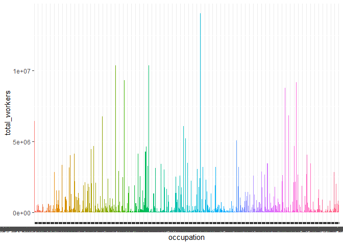

## Load library

```r
library(dplyr)
library(ggplot2)
library(readr)
library(tidyverse)
```


##Loading data

```r
jobs_gender <- readr::read_csv("https://raw.githubusercontent.com/rfordatascience/tidytuesday/master/data/2019/2019-03-05/jobs_gender.csv")
jobs_gender
```

<div data-pagedtable="false">
  <script data-pagedtable-source type="application/json">
{"columns":[{"label":["year"],"name":[1],"type":["dbl"],"align":["right"]},{"label":["occupation"],"name":[2],"type":["chr"],"align":["left"]},{"label":["major_category"],"name":[3],"type":["chr"],"align":["left"]},{"label":["minor_category"],"name":[4],"type":["chr"],"align":["left"]},{"label":["total_workers"],"name":[5],"type":["dbl"],"align":["right"]},{"label":["workers_male"],"name":[6],"type":["dbl"],"align":["right"]},{"label":["workers_female"],"name":[7],"type":["dbl"],"align":["right"]},{"label":["percent_female"],"name":[8],"type":["dbl"],"align":["right"]},{"label":["total_earnings"],"name":[9],"type":["dbl"],"align":["right"]},{"label":["total_earnings_male"],"name":[10],"type":["dbl"],"align":["right"]},{"label":["total_earnings_female"],"name":[11],"type":["dbl"],"align":["right"]},{"label":["wage_percent_of_male"],"name":[12],"type":["dbl"],"align":["right"]}],"data":[{"1":"2013","2":"Chief executives","3":"Management, Business, and Financial","4":"Management","5":"1024259","6":"782400","7":"241859","8":"23.6000000","9":"120254","10":"126142","11":"95921","12":"76.04208"},{"1":"2013","2":"General and operations managers","3":"Management, Business, and Financial","4":"Management","5":"977284","6":"681627","7":"295657","8":"30.3000000","9":"73557","10":"81041","11":"60759","12":"74.97316"},{"1":"2013","2":"Legislators","3":"Management, Business, and Financial","4":"Management","5":"14815","6":"8375","7":"6440","8":"43.5000000","9":"67155","10":"71530","11":"65325","12":"91.32532"},{"1":"2013","2":"Advertising and promotions managers","3":"Management, Business, and Financial","4":"Management","5":"43015","6":"17775","7":"25240","8":"58.7000000","9":"61371","10":"75190","11":"55860","12":"74.29179"},{"1":"2013","2":"Marketing and sales managers","3":"Management, Business, and Financial","4":"Management","5":"754514","6":"440078","7":"314436","8":"41.7000000","9":"78455","10":"91998","11":"65040","12":"70.69719"},{"1":"2013","2":"Public relations and fundraising managers","3":"Management, Business, and Financial","4":"Management","5":"44198","6":"16141","7":"28057","8":"63.5000000","9":"74114","10":"90071","11":"66052","12":"73.33326"},{"1":"2013","2":"Administrative services managers","3":"Management, Business, and Financial","4":"Management","5":"109703","6":"72873","7":"36830","8":"33.6000000","9":"62187","10":"66579","11":"55079","12":"82.72729"},{"1":"2013","2":"Computer and information systems managers","3":"Management, Business, and Financial","4":"Management","5":"489048","6":"354369","7":"134679","8":"27.5000000","9":"99167","10":"101318","11":"90940","12":"89.75700"},{"1":"2013","2":"Financial managers","3":"Management, Business, and Financial","4":"Management","5":"990611","6":"460842","7":"529769","8":"53.5000000","9":"70456","10":"90278","11":"57406","12":"63.58803"},{"1":"2013","2":"Compensation and benefits managers","3":"Management, Business, and Financial","4":"Management","5":"14656","6":"3387","7":"11269","8":"76.9000000","9":"71927","10":"97552","11":"68207","12":"NA"},{"1":"2013","2":"Human resources managers","3":"Management, Business, and Financial","4":"Management","5":"307004","6":"125240","7":"181764","8":"59.2000000","9":"67669","10":"75328","11":"64662","12":"85.84059"},{"1":"2013","2":"Training and development managers","3":"Management, Business, and Financial","4":"Management","5":"41185","6":"20111","7":"21074","8":"51.2000000","9":"74735","10":"80754","11":"71091","12":"88.03403"},{"1":"2013","2":"Industrial production managers","3":"Management, Business, and Financial","4":"Management","5":"218198","6":"177200","7":"40998","8":"18.8000000","9":"72414","10":"74623","11":"65033","12":"87.14873"},{"1":"2013","2":"Purchasing managers","3":"Management, Business, and Financial","4":"Management","5":"175540","6":"96499","7":"79041","8":"45.0000000","9":"71237","10":"81528","11":"62785","12":"77.01035"},{"1":"2013","2":"Transportation, storage, and distribution managers","3":"Management, Business, and Financial","4":"Management","5":"185512","6":"151841","7":"33671","8":"18.2000000","9":"52058","10":"52017","11":"52259","12":"100.46523"},{"1":"2013","2":"Farmers, ranchers, and other agricultural managers","3":"Management, Business, and Financial","4":"Management","5":"499775","6":"446121","7":"53654","8":"10.7000000","9":"40638","10":"41691","11":"25310","12":"60.70855"},{"1":"2013","2":"Construction managers","3":"Management, Business, and Financial","4":"Management","5":"469706","6":"434849","7":"34857","8":"7.4000000","9":"68101","10":"69556","11":"62198","12":"89.42147"},{"1":"2013","2":"Education administrators","3":"Management, Business, and Financial","4":"Management","5":"708239","6":"272330","7":"435909","8":"61.5000000","9":"66889","10":"78115","11":"60580","12":"77.55233"},{"1":"2013","2":"Architectural and engineering managers","3":"Management, Business, and Financial","4":"Management","5":"132575","6":"120777","7":"11798","8":"8.9000000","9":"121336","10":"121690","11":"113507","12":"93.27554"},{"1":"2013","2":"Food service managers","3":"Management, Business, and Financial","4":"Management","5":"740359","6":"407357","7":"333002","8":"45.0000000","9":"36586","10":"41164","11":"31578","12":"76.71266"},{"1":"2013","2":"Funeral service managers","3":"Management, Business, and Financial","4":"Management","5":"5439","6":"4421","7":"1018","8":"18.7000000","9":"70805","10":"71617","11":"52125","12":"NA"},{"1":"2013","2":"Gaming managers","3":"Management, Business, and Financial","4":"Management","5":"17294","6":"10632","7":"6662","8":"38.5000000","9":"51221","10":"52127","11":"47845","12":"91.78545"},{"1":"2013","2":"Lodging managers","3":"Management, Business, and Financial","4":"Management","5":"96419","6":"47382","7":"49037","8":"50.9000000","9":"41824","10":"50610","11":"36533","12":"72.18534"},{"1":"2013","2":"Medical and health services managers","3":"Management, Business, and Financial","4":"Management","5":"546042","6":"171661","7":"374381","8":"68.6000000","9":"69563","10":"84450","11":"64765","12":"76.69035"},{"1":"2013","2":"Natural sciences managers","3":"Management, Business, and Financial","4":"Management","5":"16766","6":"8633","7":"8133","8":"48.5000000","9":"94448","10":"121164","11":"85416","12":"70.49619"},{"1":"2013","2":"Postmasters and mail superintendents","3":"Management, Business, and Financial","4":"Management","5":"28282","6":"12394","7":"15888","8":"56.2000000","9":"65191","10":"77465","11":"56317","12":"72.69993"},{"1":"2013","2":"Property, real estate, and community association managers","3":"Management, Business, and Financial","4":"Management","5":"414232","6":"203818","7":"210414","8":"50.8000000","9":"47936","10":"57059","11":"41743","12":"73.15761"},{"1":"2013","2":"Social and community service managers","3":"Management, Business, and Financial","4":"Management","5":"279952","6":"96503","7":"183449","8":"65.5000000","9":"55473","10":"62367","11":"51933","12":"83.27000"},{"1":"2013","2":"Emergency management directors","3":"Management, Business, and Financial","4":"Management","5":"6422","6":"4662","7":"1760","8":"27.4000000","9":"73381","10":"73478","11":"73102","12":"NA"},{"1":"2013","2":"Managers, all other","3":"Management, Business, and Financial","4":"Management","5":"3034121","6":"2056582","7":"977539","8":"32.2000000","9":"75912","10":"81462","11":"63917","12":"78.46235"},{"1":"2013","2":"Agents and business managers of artists, performers, and athletes","3":"Management, Business, and Financial","4":"Business and Financial Operations","5":"28413","6":"17494","7":"10919","8":"38.4000000","9":"51244","10":"51910","11":"47043","12":"90.62416"},{"1":"2013","2":"Buyers and purchasing agents, farm products","3":"Management, Business, and Financial","4":"Business and Financial Operations","5":"7184","6":"5882","7":"1302","8":"18.1000000","9":"51036","10":"51063","11":"50742","12":"NA"},{"1":"2013","2":"Wholesale and retail buyers, except farm products","3":"Management, Business, and Financial","4":"Business and Financial Operations","5":"170412","6":"86522","7":"83890","8":"49.2000000","9":"42170","10":"41619","11":"42990","12":"103.29417"},{"1":"2013","2":"Purchasing agents, except wholesale, retail, and farm products","3":"Management, Business, and Financial","4":"Business and Financial Operations","5":"220927","6":"107988","7":"112939","8":"51.1000000","9":"54632","10":"60957","11":"50058","12":"82.12018"},{"1":"2013","2":"Claims adjusters, appraisers, examiners, and investigators","3":"Management, Business, and Financial","4":"Business and Financial Operations","5":"257730","6":"98587","7":"159143","8":"61.7000000","9":"51134","10":"60097","11":"46520","12":"77.40819"},{"1":"2013","2":"Compliance officers","3":"Management, Business, and Financial","4":"Business and Financial Operations","5":"193020","6":"95524","7":"97496","8":"50.5000000","9":"62311","10":"66724","11":"60054","12":"90.00360"},{"1":"2013","2":"Cost estimators","3":"Management, Business, and Financial","4":"Business and Financial Operations","5":"105744","6":"91484","7":"14260","8":"13.5000000","9":"57333","10":"60249","11":"49443","12":"82.06443"},{"1":"2013","2":"Human resources workers","3":"Management, Business, and Financial","4":"Business and Financial Operations","5":"571108","6":"158154","7":"412954","8":"72.3000000","9":"54989","10":"63034","11":"51765","12":"82.12235"},{"1":"2013","2":"Compensation, benefits, and job analysis specialists","3":"Management, Business, and Financial","4":"Business and Financial Operations","5":"53127","6":"13895","7":"39232","8":"73.8000000","9":"50968","10":"61089","11":"47927","12":"78.45439"},{"1":"2013","2":"Training and development specialists","3":"Management, Business, and Financial","4":"Business and Financial Operations","5":"105954","6":"50856","7":"55098","8":"52.0000000","9":"52417","10":"59310","11":"50024","12":"84.34328"},{"1":"2013","2":"Logisticians","3":"Management, Business, and Financial","4":"Business and Financial Operations","5":"97563","6":"63756","7":"33807","8":"34.7000000","9":"52109","10":"54698","11":"50410","12":"92.16059"},{"1":"2013","2":"Management analysts","3":"Management, Business, and Financial","4":"Business and Financial Operations","5":"589692","6":"346499","7":"243193","8":"41.2000000","9":"80220","10":"89151","11":"72006","12":"80.76858"},{"1":"2013","2":"Meeting, convention, and event planners","3":"Management, Business, and Financial","4":"Business and Financial Operations","5":"78856","6":"15208","7":"63648","8":"80.7000000","9":"47088","10":"47876","11":"46973","12":"98.11388"},{"1":"2013","2":"Fundraisers","3":"Management, Business, and Financial","4":"Business and Financial Operations","5":"63985","6":"18678","7":"45307","8":"70.8000000","9":"60802","10":"69292","11":"57730","12":"83.31409"},{"1":"2013","2":"Market research analysts and marketing specialists","3":"Management, Business, and Financial","4":"Business and Financial Operations","5":"230432","6":"102417","7":"128015","8":"55.6000000","9":"67154","10":"80508","11":"60673","12":"75.36270"},{"1":"2013","2":"Business operations specialists, all other","3":"Management, Business, and Financial","4":"Business and Financial Operations","5":"211970","6":"98399","7":"113571","8":"53.6000000","9":"56945","10":"67442","11":"51378","12":"76.18101"},{"1":"2013","2":"Accountants and auditors","3":"Management, Business, and Financial","4":"Business and Financial Operations","5":"1651199","6":"683411","7":"967788","8":"58.6000000","9":"61270","10":"72805","11":"54720","12":"75.15967"},{"1":"2013","2":"Appraisers and assessors of real estate","3":"Management, Business, and Financial","4":"Business and Financial Operations","5":"75414","6":"49592","7":"25822","8":"34.2000000","9":"55227","10":"61056","11":"45643","12":"74.75596"},{"1":"2013","2":"Budget analysts","3":"Management, Business, and Financial","4":"Business and Financial Operations","5":"41799","6":"14880","7":"26919","8":"64.4000000","9":"70429","10":"78667","11":"65830","12":"83.68185"},{"1":"2013","2":"Credit analysts","3":"Management, Business, and Financial","4":"Business and Financial Operations","5":"23011","6":"9607","7":"13404","8":"58.3000000","9":"53869","10":"56903","11":"51602","12":"90.68415"},{"1":"2013","2":"Financial analysts","3":"Management, Business, and Financial","4":"Business and Financial Operations","5":"65367","6":"44484","7":"20883","8":"31.9000000","9":"84140","10":"100081","11":"63424","12":"63.37267"},{"1":"2013","2":"Personal financial advisors","3":"Management, Business, and Financial","4":"Business and Financial Operations","5":"283136","6":"196273","7":"86863","8":"30.7000000","9":"82142","10":"98126","11":"60359","12":"61.51173"},{"1":"2013","2":"Insurance underwriters","3":"Management, Business, and Financial","4":"Business and Financial Operations","5":"94336","6":"33432","7":"60904","8":"64.6000000","9":"58402","10":"75372","11":"52283","12":"69.36661"},{"1":"2013","2":"Financial examiners","3":"Management, Business, and Financial","4":"Business and Financial Operations","5":"10413","6":"5134","7":"5279","8":"50.7000000","9":"71779","10":"77263","11":"60411","12":"NA"},{"1":"2013","2":"Credit counselors and loan officers","3":"Management, Business, and Financial","4":"Business and Financial Operations","5":"285649","6":"130778","7":"154871","8":"54.2000000","9":"54535","10":"69726","11":"46394","12":"66.53759"},{"1":"2013","2":"Tax examiners and collectors, and revenue agents","3":"Management, Business, and Financial","4":"Business and Financial Operations","5":"50960","6":"17617","7":"33343","8":"65.4000000","9":"49380","10":"66754","11":"45704","12":"68.46631"},{"1":"2013","2":"Tax preparers","3":"Management, Business, and Financial","4":"Business and Financial Operations","5":"51485","6":"24538","7":"26947","8":"52.3000000","9":"56047","10":"70641","11":"47997","12":"67.94496"},{"1":"2013","2":"Financial specialists, all other","3":"Management, Business, and Financial","4":"Business and Financial Operations","5":"58785","6":"26520","7":"32265","8":"54.9000000","9":"61323","10":"81859","11":"48869","12":"59.69899"},{"1":"2013","2":"Computer and information research scientists","3":"Computer, Engineering, and Science","4":"Computer and mathematical","5":"12993","6":"9222","7":"3771","8":"29.0000000","9":"95918","10":"100222","11":"88006","12":"NA"},{"1":"2013","2":"Computer systems analysts","3":"Computer, Engineering, and Science","4":"Computer and mathematical","5":"441538","6":"280626","7":"160912","8":"36.4000000","9":"75886","10":"81174","11":"69346","12":"85.42883"},{"1":"2013","2":"Information security analysts","3":"Computer, Engineering, and Science","4":"Computer and mathematical","5":"50853","6":"40681","7":"10172","8":"20.0000000","9":"84140","10":"86349","11":"80245","12":"92.93101"},{"1":"2013","2":"Computer programmers","3":"Computer, Engineering, and Science","4":"Computer and mathematical","5":"374314","6":"298175","7":"76139","8":"20.3000000","9":"80512","10":"81508","11":"75088","12":"92.12347"},{"1":"2013","2":"Software developers, applications and systems software","3":"Computer, Engineering, and Science","4":"Computer and mathematical","5":"924888","6":"741308","7":"183580","8":"19.8000000","9":"94025","10":"96868","11":"83808","12":"86.51774"},{"1":"2013","2":"Web developers","3":"Computer, Engineering, and Science","4":"Computer and mathematical","5":"136446","6":"95672","7":"40774","8":"29.9000000","9":"60056","10":"61566","11":"53995","12":"87.70263"},{"1":"2013","2":"Computer support specialists","3":"Computer, Engineering, and Science","4":"Computer and mathematical","5":"458736","6":"339470","7":"119266","8":"26.0000000","9":"52063","10":"53960","11":"49001","12":"90.80986"},{"1":"2013","2":"Database administrators","3":"Computer, Engineering, and Science","4":"Computer and mathematical","5":"101323","6":"61969","7":"39354","8":"38.8000000","9":"75824","10":"84609","11":"61378","12":"72.54311"},{"1":"2013","2":"Network and computer systems administrators","3":"Computer, Engineering, and Science","4":"Computer and mathematical","5":"195372","6":"160376","7":"34996","8":"17.9000000","9":"67246","10":"68363","11":"61699","12":"90.25204"},{"1":"2013","2":"Computer network architects","3":"Computer, Engineering, and Science","4":"Computer and mathematical","5":"91709","6":"84233","7":"7476","8":"8.2000000","9":"96372","10":"96549","11":"94445","12":"97.82080"},{"1":"2013","2":"Computer , all other","3":"Computer, Engineering, and Science","4":"Computer and mathematical","5":"354952","6":"277889","7":"77063","8":"21.7000000","9":"66550","10":"66971","11":"65329","12":"97.54819"},{"1":"2013","2":"Actuaries","3":"Computer, Engineering, and Science","4":"Computer and mathematical","5":"23200","6":"16642","7":"6558","8":"28.3000000","9":"112191","10":"116019","11":"106759","12":"92.01855"},{"1":"2013","2":"Mathematicians","3":"Computer, Engineering, and Science","4":"Computer and mathematical","5":"1933","6":"1603","7":"330","8":"17.1000000","9":"79256","10":"73799","11":"99362","12":"NA"},{"1":"2013","2":"Operations research analysts","3":"Computer, Engineering, and Science","4":"Computer and mathematical","5":"123636","6":"65206","7":"58430","8":"47.3000000","9":"77172","10":"86748","11":"68925","12":"79.45428"},{"1":"2013","2":"Statisticians","3":"Computer, Engineering, and Science","4":"Computer and mathematical","5":"31319","6":"16117","7":"15202","8":"48.5000000","9":"81209","10":"87488","11":"74291","12":"84.91565"},{"1":"2013","2":"Miscellaneous mathematical science","3":"Computer, Engineering, and Science","4":"Computer and mathematical","5":"3686","6":"1974","7":"1712","8":"46.4000000","9":"70370","10":"75221","11":"56018","12":"NA"},{"1":"2013","2":"Architects, except naval","3":"Computer, Engineering, and Science","4":"Architecture and Engineering","5":"145439","6":"114341","7":"31098","8":"21.4000000","9":"71305","10":"75395","11":"60518","12":"80.26792"},{"1":"2013","2":"Surveyors, cartographers, and photogrammetrists","3":"Computer, Engineering, and Science","4":"Architecture and Engineering","5":"31315","6":"24924","7":"6391","8":"20.4000000","9":"59354","10":"61190","11":"50876","12":"83.14430"},{"1":"2013","2":"Aerospace engineers","3":"Computer, Engineering, and Science","4":"Architecture and Engineering","5":"117942","6":"105914","7":"12028","8":"10.2000000","9":"100701","10":"101260","11":"90023","12":"88.90282"},{"1":"2013","2":"Agricultural engineers","3":"Computer, Engineering, and Science","4":"Architecture and Engineering","5":"2952","6":"2425","7":"527","8":"17.9000000","9":"70585","10":"73207","11":"39356","12":"NA"},{"1":"2013","2":"Biomedical engineers","3":"Computer, Engineering, and Science","4":"Architecture and Engineering","5":"12371","6":"10765","7":"1606","8":"13.0000000","9":"78629","10":"77459","11":"85248","12":"NA"},{"1":"2013","2":"Chemical engineers","3":"Computer, Engineering, and Science","4":"Architecture and Engineering","5":"53119","6":"45725","7":"7394","8":"13.9000000","9":"100231","10":"100632","11":"95507","12":"94.90719"},{"1":"2013","2":"Civil engineers","3":"Computer, Engineering, and Science","4":"Architecture and Engineering","5":"257802","6":"228722","7":"29080","8":"11.3000000","9":"81233","10":"81911","11":"71854","12":"87.72204"},{"1":"2013","2":"Computer hardware engineers","3":"Computer, Engineering, and Science","4":"Architecture and Engineering","5":"51453","6":"44773","7":"6680","8":"13.0000000","9":"91967","10":"95258","11":"76236","12":"NA"},{"1":"2013","2":"Electrical and electronics engineers","3":"Computer, Engineering, and Science","4":"Architecture and Engineering","5":"180122","6":"163656","7":"16466","8":"9.1000000","9":"91895","10":"93351","11":"81167","12":"86.94818"},{"1":"2013","2":"Environmental engineers","3":"Computer, Engineering, and Science","4":"Architecture and Engineering","5":"25988","6":"19105","7":"6883","8":"26.5000000","9":"77406","10":"80413","11":"72478","12":"90.13219"},{"1":"2013","2":"Industrial engineers, including health and safety","3":"Computer, Engineering, and Science","4":"Architecture and Engineering","5":"172367","6":"136669","7":"35698","8":"20.7000000","9":"75131","10":"76487","11":"66498","12":"86.94026"},{"1":"2013","2":"Marine engineers and naval architects","3":"Computer, Engineering, and Science","4":"Architecture and Engineering","5":"11147","6":"10288","7":"859","8":"7.7000000","9":"81250","10":"85451","11":"70430","12":"NA"},{"1":"2013","2":"Materials engineers","3":"Computer, Engineering, and Science","4":"Architecture and Engineering","5":"27975","6":"23360","7":"4615","8":"16.5000000","9":"80011","10":"80877","11":"73038","12":"NA"},{"1":"2013","2":"Mechanical engineers","3":"Computer, Engineering, and Science","4":"Architecture and Engineering","5":"206515","6":"191858","7":"14657","8":"7.1000000","9":"79565","10":"80193","11":"72416","12":"90.30215"},{"1":"2013","2":"Mining and geological engineers, including mining safety engineers","3":"Computer, Engineering, and Science","4":"Architecture and Engineering","5":"8430","6":"7886","7":"544","8":"6.5000000","9":"87279","10":"86617","11":"108500","12":"NA"},{"1":"2013","2":"Nuclear engineers","3":"Computer, Engineering, and Science","4":"Architecture and Engineering","5":"4813","6":"4205","7":"608","8":"12.6000000","9":"84017","10":"86028","11":"71482","12":"NA"},{"1":"2013","2":"Petroleum engineers","3":"Computer, Engineering, and Science","4":"Architecture and Engineering","5":"23225","6":"20619","7":"2606","8":"11.2000000","9":"110560","10":"109564","11":"120253","12":"NA"},{"1":"2013","2":"Engineers, all other","3":"Computer, Engineering, and Science","4":"Architecture and Engineering","5":"439749","6":"388864","7":"50885","8":"11.6000000","9":"90913","10":"91800","11":"81702","12":"89.00000"},{"1":"2013","2":"Drafters","3":"Computer, Engineering, and Science","4":"Architecture and Engineering","5":"124267","6":"102941","7":"21326","8":"17.2000000","9":"51609","10":"52296","11":"47123","12":"90.10823"},{"1":"2013","2":"Engineering technicians, except drafters","3":"Computer, Engineering, and Science","4":"Architecture and Engineering","5":"371566","6":"307644","7":"63922","8":"17.2000000","9":"54623","10":"56847","11":"43517","12":"76.55109"},{"1":"2013","2":"Surveying and mapping technicians","3":"Computer, Engineering, and Science","4":"Architecture and Engineering","5":"45449","6":"40811","7":"4638","8":"10.2000000","9":"48685","10":"49813","11":"42403","12":"NA"},{"1":"2013","2":"Agricultural and food scientists","3":"Computer, Engineering, and Science","4":"Life, Physical, and Social Science","5":"22154","6":"15764","7":"6390","8":"28.8000000","9":"60826","10":"62867","11":"53805","12":"85.58544"},{"1":"2013","2":"Biological scientists","3":"Computer, Engineering, and Science","4":"Life, Physical, and Social Science","5":"60924","6":"31860","7":"29064","8":"47.7000000","9":"57426","10":"57653","11":"57107","12":"99.05295"},{"1":"2013","2":"Conservation scientists and foresters","3":"Computer, Engineering, and Science","4":"Life, Physical, and Social Science","5":"20271","6":"15850","7":"4421","8":"21.8000000","9":"56075","10":"58798","11":"52387","12":"89.09657"},{"1":"2013","2":"Medical scientists","3":"Computer, Engineering, and Science","4":"Life, Physical, and Social Science","5":"112826","6":"53210","7":"59616","8":"52.8000000","9":"71375","10":"80113","11":"66860","12":"83.45712"},{"1":"2013","2":"Life scientists, all other","3":"Computer, Engineering, and Science","4":"Life, Physical, and Social Science","5":"1043","6":"706","7":"337","8":"32.3000000","9":"61321","10":"54143","11":"70276","12":"NA"},{"1":"2013","2":"Astronomers and physicists","3":"Computer, Engineering, and Science","4":"Life, Physical, and Social Science","5":"9359","6":"7563","7":"1796","8":"19.2000000","9":"101983","10":"100930","11":"105332","12":"NA"},{"1":"2013","2":"Atmospheric and space scientists","3":"Computer, Engineering, and Science","4":"Life, Physical, and Social Science","5":"10661","6":"8657","7":"2004","8":"18.8000000","9":"69873","10":"76668","11":"56603","12":"NA"},{"1":"2013","2":"Chemists and materials scientists","3":"Computer, Engineering, and Science","4":"Life, Physical, and Social Science","5":"71161","6":"42953","7":"28208","8":"39.6000000","9":"69780","10":"71853","11":"65582","12":"91.27246"},{"1":"2013","2":"Environmental scientists and geoscientists","3":"Computer, Engineering, and Science","4":"Life, Physical, and Social Science","5":"65341","6":"45052","7":"20289","8":"31.1000000","9":"71065","10":"77333","11":"61583","12":"79.63353"},{"1":"2013","2":"Physical scientists, all other","3":"Computer, Engineering, and Science","4":"Life, Physical, and Social Science","5":"171530","6":"106686","7":"64844","8":"37.8000000","9":"74592","10":"85195","11":"61217","12":"71.85516"},{"1":"2013","2":"Economists","3":"Computer, Engineering, and Science","4":"Life, Physical, and Social Science","5":"20957","6":"14810","7":"6147","8":"29.3000000","9":"105834","10":"120076","11":"82427","12":"68.64569"},{"1":"2013","2":"Survey researchers","3":"Computer, Engineering, and Science","4":"Life, Physical, and Social Science","5":"836","6":"358","7":"478","8":"57.2000000","9":"70521","10":"117685","11":"70443","12":"NA"},{"1":"2013","2":"Psychologists","3":"Computer, Engineering, and Science","4":"Life, Physical, and Social Science","5":"115139","6":"37071","7":"78068","8":"67.8000000","9":"66764","10":"76903","11":"62146","12":"80.81089"},{"1":"2013","2":"Urban and regional planners","3":"Computer, Engineering, and Science","4":"Life, Physical, and Social Science","5":"17145","6":"10824","7":"6321","8":"36.9000000","9":"67392","10":"71693","11":"62266","12":"86.85088"},{"1":"2013","2":"Miscellaneous social scientists and related workers, including sociologists","3":"Computer, Engineering, and Science","4":"Life, Physical, and Social Science","5":"32080","6":"15884","7":"16196","8":"50.5000000","9":"59540","10":"68632","11":"52123","12":"75.94562"},{"1":"2013","2":"Agricultural and food science technicians","3":"Computer, Engineering, and Science","4":"Life, Physical, and Social Science","5":"24559","6":"15509","7":"9050","8":"36.9000000","9":"42576","10":"45910","11":"39464","12":"85.95949"},{"1":"2013","2":"Biological technicians","3":"Computer, Engineering, and Science","4":"Life, Physical, and Social Science","5":"13985","6":"8785","7":"5200","8":"37.2000000","9":"45798","10":"46823","11":"41644","12":"88.93920"},{"1":"2013","2":"Chemical technicians","3":"Computer, Engineering, and Science","4":"Life, Physical, and Social Science","5":"51689","6":"34926","7":"16763","8":"32.4000000","9":"50982","10":"51831","11":"47360","12":"91.37389"},{"1":"2013","2":"Geological and petroleum technicians","3":"Computer, Engineering, and Science","4":"Life, Physical, and Social Science","5":"16156","6":"11467","7":"4689","8":"29.0000000","9":"61110","10":"62243","11":"52394","12":"NA"},{"1":"2013","2":"Nuclear technicians","3":"Computer, Engineering, and Science","4":"Life, Physical, and Social Science","5":"3722","6":"3265","7":"457","8":"12.3000000","9":"100455","10":"110076","11":"71540","12":"NA"},{"1":"2013","2":"Social science research assistants","3":"Computer, Engineering, and Science","4":"Life, Physical, and Social Science","5":"4333","6":"2950","7":"1383","8":"31.9000000","9":"40464","10":"40888","11":"35803","12":"NA"},{"1":"2013","2":"Miscellaneous life, physical, and social science technicians","3":"Computer, Engineering, and Science","4":"Life, Physical, and Social Science","5":"100831","6":"55051","7":"45780","8":"45.4000000","9":"44561","10":"48138","11":"40792","12":"84.73971"},{"1":"2013","2":"Counselors","3":"Education, Legal, Community Service, Arts, and Media","4":"Community and Social Service","5":"482328","6":"146849","7":"335479","8":"69.6000000","9":"42349","10":"42299","11":"42369","12":"100.16549"},{"1":"2013","2":"Social workers","3":"Education, Legal, Community Service, Arts, and Media","4":"Community and Social Service","5":"627085","6":"124774","7":"502311","8":"80.1000000","9":"41940","10":"42821","11":"41795","12":"97.60398"},{"1":"2013","2":"Probation officers and correctional treatment specialists","3":"Education, Legal, Community Service, Arts, and Media","4":"Community and Social Service","5":"83568","6":"42704","7":"40864","8":"48.9000000","9":"45909","10":"47561","11":"44385","12":"93.32226"},{"1":"2013","2":"Social and human service assistants","3":"Education, Legal, Community Service, Arts, and Media","4":"Community and Social Service","5":"94377","6":"20048","7":"74329","8":"78.8000000","9":"35643","10":"34967","11":"35766","12":"102.28501"},{"1":"2013","2":"Miscellaneous community and social service specialists, including health educators and community health workers","3":"Education, Legal, Community Service, Arts, and Media","4":"Community and Social Service","5":"68388","6":"25669","7":"42719","8":"62.5000000","9":"41900","10":"47966","11":"39620","12":"82.60018"},{"1":"2013","2":"Clergy","3":"Education, Legal, Community Service, Arts, and Media","4":"Community and Social Service","5":"339774","6":"289076","7":"50698","8":"14.9000000","9":"44422","10":"45350","11":"40754","12":"89.86549"},{"1":"2013","2":"Directors, religious activities and education","3":"Education, Legal, Community Service, Arts, and Media","4":"Community and Social Service","5":"34970","6":"16961","7":"18009","8":"51.5000000","9":"40736","10":"43053","11":"38681","12":"89.84507"},{"1":"2013","2":"Religious workers, all other","3":"Education, Legal, Community Service, Arts, and Media","4":"Community and Social Service","5":"41694","6":"19827","7":"21867","8":"52.4000000","9":"36496","10":"40454","11":"35612","12":"88.03085"},{"1":"2013","2":"Lawyers","3":"Education, Legal, Community Service, Arts, and Media","4":"Legal","5":"852860","6":"568201","7":"284659","8":"33.4000000","9":"120617","10":"127337","11":"101640","12":"79.81969"},{"1":"2013","2":"Judicial law clerks","3":"Education, Legal, Community Service, Arts, and Media","4":"Legal","5":"11115","6":"4920","7":"6195","8":"55.7000000","9":"55545","10":"54778","11":"55883","12":"NA"},{"1":"2013","2":"Judges, magistrates, and other judicial workers","3":"Education, Legal, Community Service, Arts, and Media","4":"Legal","5":"55881","6":"32209","7":"23672","8":"42.4000000","9":"100619","10":"115636","11":"83173","12":"71.92656"},{"1":"2013","2":"Paralegals and legal assistants","3":"Education, Legal, Community Service, Arts, and Media","4":"Legal","5":"307815","6":"45422","7":"262393","8":"85.2000000","9":"46562","10":"50498","11":"46061","12":"91.21351"},{"1":"2013","2":"Miscellaneous legal support workers","3":"Education, Legal, Community Service, Arts, and Media","4":"Legal","5":"148521","6":"40412","7":"108109","8":"72.8000000","9":"46748","10":"60958","11":"43663","12":"71.62801"},{"1":"2013","2":"Postsecondary teachers","3":"Education, Legal, Community Service, Arts, and Media","4":"Education, Training, and Library","5":"836986","6":"457786","7":"379200","8":"45.3000000","9":"65463","10":"71414","11":"60359","12":"84.51984"},{"1":"2013","2":"Preschool and kindergarten teachers","3":"Education, Legal, Community Service, Arts, and Media","4":"Education, Training, and Library","5":"316025","6":"8298","7":"307727","8":"97.4000000","9":"24347","10":"30067","11":"24257","12":"80.67649"},{"1":"2013","2":"Elementary and middle school teachers","3":"Education, Legal, Community Service, Arts, and Media","4":"Education, Training, and Library","5":"2282888","6":"503434","7":"1779454","8":"77.9000000","9":"48874","10":"51986","11":"47521","12":"91.41115"},{"1":"2013","2":"Secondary school teachers","3":"Education, Legal, Community Service, Arts, and Media","4":"Education, Training, and Library","5":"541598","6":"240315","7":"301283","8":"55.6000000","9":"50810","10":"52819","11":"49048","12":"92.86052"},{"1":"2013","2":"Special education teachers","3":"Education, Legal, Community Service, Arts, and Media","4":"Education, Training, and Library","5":"165928","6":"25578","7":"140350","8":"84.6000000","9":"47264","10":"46932","11":"47378","12":"100.95031"},{"1":"2013","2":"Other teachers and instructors","3":"Education, Legal, Community Service, Arts, and Media","4":"Education, Training, and Library","5":"359794","6":"169655","7":"190139","8":"52.8000000","9":"43740","10":"50250","11":"40132","12":"79.86468"},{"1":"2013","2":"Archivists, curators, and museum technicians","3":"Education, Legal, Community Service, Arts, and Media","4":"Education, Training, and Library","5":"31925","6":"13316","7":"18609","8":"58.3000000","9":"51704","10":"58285","11":"46130","12":"79.14558"},{"1":"2013","2":"Librarians","3":"Education, Legal, Community Service, Arts, and Media","4":"Education, Training, and Library","5":"111952","6":"19727","7":"92225","8":"82.4000000","9":"48892","10":"51879","11":"48005","12":"92.53262"},{"1":"2013","2":"Library technicians","3":"Education, Legal, Community Service, Arts, and Media","4":"Education, Training, and Library","5":"16163","6":"3583","7":"12580","8":"77.8000000","9":"31698","10":"38063","11":"31014","12":"NA"},{"1":"2013","2":"Teacher assistants","3":"Education, Legal, Community Service, Arts, and Media","4":"Education, Training, and Library","5":"371321","6":"44030","7":"327291","8":"88.1000000","9":"21125","10":"25873","11":"20748","12":"80.19171"},{"1":"2013","2":"Other education, training, and library workers","3":"Education, Legal, Community Service, Arts, and Media","4":"Education, Training, and Library","5":"88624","6":"26398","7":"62226","8":"70.2000000","9":"51516","10":"55834","11":"50756","12":"90.90518"},{"1":"2013","2":"Artists and related workers","3":"Education, Legal, Community Service, Arts, and Media","4":"Arts, Design, Entertainment, Sports, and Media","5":"116825","6":"75425","7":"41400","8":"35.4000000","9":"49197","10":"54669","11":"37261","12":"68.15746"},{"1":"2013","2":"Designers","3":"Education, Legal, Community Service, Arts, and Media","4":"Arts, Design, Entertainment, Sports, and Media","5":"552419","6":"303391","7":"249028","8":"45.1000000","9":"50461","10":"55658","11":"44269","12":"79.53753"},{"1":"2013","2":"Actors","3":"Education, Legal, Community Service, Arts, and Media","4":"Arts, Design, Entertainment, Sports, and Media","5":"12456","6":"8445","7":"4011","8":"32.2000000","9":"40438","10":"40745","11":"37149","12":"NA"},{"1":"2013","2":"Producers and directors","3":"Education, Legal, Community Service, Arts, and Media","4":"Arts, Design, Entertainment, Sports, and Media","5":"117967","6":"73980","7":"43987","8":"37.3000000","9":"63715","10":"62368","11":"66226","12":"106.18586"},{"1":"2013","2":"Athletes, coaches, umpires, and related workers","3":"Education, Legal, Community Service, Arts, and Media","4":"Arts, Design, Entertainment, Sports, and Media","5":"114456","6":"83451","7":"31005","8":"27.1000000","9":"43373","10":"46602","11":"36682","12":"78.71336"},{"1":"2013","2":"Dancers and choreographers","3":"Education, Legal, Community Service, Arts, and Media","4":"Arts, Design, Entertainment, Sports, and Media","5":"5424","6":"1239","7":"4185","8":"77.2000000","9":"31678","10":"50701","11":"30782","12":"NA"},{"1":"2013","2":"Musicians, singers, and related workers","3":"Education, Legal, Community Service, Arts, and Media","4":"Arts, Design, Entertainment, Sports, and Media","5":"60370","6":"48227","7":"12143","8":"20.1000000","9":"42746","10":"42988","11":"42279","12":"98.35070"},{"1":"2013","2":"Entertainers and performers, sports and related workers, all other","3":"Education, Legal, Community Service, Arts, and Media","4":"Arts, Design, Entertainment, Sports, and Media","5":"14230","6":"9381","7":"4849","8":"34.1000000","9":"40633","10":"42245","11":"32475","12":"NA"},{"1":"2013","2":"Announcers","3":"Education, Legal, Community Service, Arts, and Media","4":"Arts, Design, Entertainment, Sports, and Media","5":"25670","6":"20703","7":"4967","8":"19.3000000","9":"40913","10":"40829","11":"41437","12":"NA"},{"1":"2013","2":"News analysts, reporters and correspondents","3":"Education, Legal, Community Service, Arts, and Media","4":"Arts, Design, Entertainment, Sports, and Media","5":"52566","6":"29289","7":"23277","8":"44.3000000","9":"50711","10":"55156","11":"45994","12":"83.38893"},{"1":"2013","2":"Public relations specialists","3":"Education, Legal, Community Service, Arts, and Media","4":"Arts, Design, Entertainment, Sports, and Media","5":"97408","6":"38545","7":"58863","8":"60.4000000","9":"63966","10":"76638","11":"58483","12":"76.31071"},{"1":"2013","2":"Editors","3":"Education, Legal, Community Service, Arts, and Media","4":"Arts, Design, Entertainment, Sports, and Media","5":"117721","6":"59523","7":"58198","8":"49.4000000","9":"52746","10":"55899","11":"51884","12":"92.81740"},{"1":"2013","2":"Technical writers","3":"Education, Legal, Community Service, Arts, and Media","4":"Arts, Design, Entertainment, Sports, and Media","5":"43977","6":"19964","7":"24013","8":"54.6000000","9":"69242","10":"75598","11":"61511","12":"81.36591"},{"1":"2013","2":"Writers and authors","3":"Education, Legal, Community Service, Arts, and Media","4":"Arts, Design, Entertainment, Sports, and Media","5":"121198","6":"57902","7":"63296","8":"52.2000000","9":"53964","10":"60192","11":"51219","12":"85.09270"},{"1":"2013","2":"Miscellaneous media and communication workers","3":"Education, Legal, Community Service, Arts, and Media","4":"Arts, Design, Entertainment, Sports, and Media","5":"45120","6":"17870","7":"27250","8":"60.4000000","9":"42033","10":"46135","11":"40256","12":"87.25696"},{"1":"2013","2":"Miscellaneous media and communications equipment workers, including broadcast and sound engineering technicians and radio operators","3":"Education, Legal, Community Service, Arts, and Media","4":"Arts, Design, Entertainment, Sports, and Media","5":"68484","6":"62777","7":"5707","8":"8.3000000","9":"50514","10":"50378","11":"52954","12":"NA"},{"1":"2013","2":"Photographers","3":"Education, Legal, Community Service, Arts, and Media","4":"Arts, Design, Entertainment, Sports, and Media","5":"80489","6":"48494","7":"31995","8":"39.8000000","9":"38052","10":"44513","11":"30455","12":"68.41821"},{"1":"2013","2":"Television, video, and motion picture camera operators and editors","3":"Education, Legal, Community Service, Arts, and Media","4":"Arts, Design, Entertainment, Sports, and Media","5":"28620","6":"25400","7":"3220","8":"11.3000000","9":"50835","10":"51081","11":"42205","12":"NA"},{"1":"2013","2":"Chiropractors","3":"Healthcare Practitioners and Technical","4":"Healthcare Practitioners and Technical","5":"34499","6":"27139","7":"7360","8":"21.3000000","9":"70513","10":"72468","11":"60223","12":"83.10289"},{"1":"2013","2":"Dentists","3":"Healthcare Practitioners and Technical","4":"Healthcare Practitioners and Technical","5":"97562","6":"74382","7":"23180","8":"23.8000000","9":"141557","10":"151071","11":"102460","12":"67.82241"},{"1":"2013","2":"Dietitians and nutritionists","3":"Healthcare Practitioners and Technical","4":"Healthcare Practitioners and Technical","5":"61437","6":"7250","7":"54187","8":"88.2000000","9":"47997","10":"49001","11":"47717","12":"97.37965"},{"1":"2013","2":"Optometrists","3":"Healthcare Practitioners and Technical","4":"Healthcare Practitioners and Technical","5":"25610","6":"16298","7":"9312","8":"36.4000000","9":"103805","10":"120521","11":"96186","12":"79.80850"},{"1":"2013","2":"Pharmacists","3":"Healthcare Practitioners and Technical","4":"Healthcare Practitioners and Technical","5":"205734","6":"98972","7":"106762","8":"51.9000000","9":"116468","10":"120792","11":"111809","12":"92.56325"},{"1":"2013","2":"Physicians and surgeons","3":"Healthcare Practitioners and Technical","4":"Healthcare Practitioners and Technical","5":"737546","6":"495061","7":"242485","8":"32.9000000","9":"182232","10":"202533","11":"140036","12":"69.14231"},{"1":"2013","2":"Physician assistants","3":"Healthcare Practitioners and Technical","4":"Healthcare Practitioners and Technical","5":"100572","6":"35720","7":"64852","8":"64.5000000","9":"81522","10":"93791","11":"76396","12":"81.45344"},{"1":"2013","2":"Podiatrists","3":"Healthcare Practitioners and Technical","4":"Healthcare Practitioners and Technical","5":"6757","6":"5184","7":"1573","8":"23.3000000","9":"120367","10":"126978","11":"62064","12":"NA"},{"1":"2013","2":"Audiologists","3":"Healthcare Practitioners and Technical","4":"Healthcare Practitioners and Technical","5":"10771","6":"3078","7":"7693","8":"71.4000000","9":"76440","10":"82289","11":"75339","12":"NA"},{"1":"2013","2":"Occupational therapists","3":"Healthcare Practitioners and Technical","4":"Healthcare Practitioners and Technical","5":"59239","6":"6903","7":"52336","8":"88.3000000","9":"68270","10":"75740","11":"67164","12":"88.67705"},{"1":"2013","2":"Physical therapists","3":"Healthcare Practitioners and Technical","4":"Healthcare Practitioners and Technical","5":"136392","6":"49118","7":"87274","8":"64.0000000","9":"72260","10":"80411","11":"70509","12":"87.68576"},{"1":"2013","2":"Radiation therapists","3":"Healthcare Practitioners and Technical","4":"Healthcare Practitioners and Technical","5":"14694","6":"5731","7":"8963","8":"61.0000000","9":"75639","10":"84219","11":"68886","12":"NA"},{"1":"2013","2":"Recreational therapists","3":"Healthcare Practitioners and Technical","4":"Healthcare Practitioners and Technical","5":"9144","6":"3265","7":"5879","8":"64.3000000","9":"41923","10":"42004","11":"41782","12":"NA"},{"1":"2013","2":"Respiratory therapists","3":"Healthcare Practitioners and Technical","4":"Healthcare Practitioners and Technical","5":"84482","6":"32234","7":"52248","8":"61.8000000","9":"54303","10":"60677","11":"51864","12":"85.47555"},{"1":"2013","2":"Speech-language pathologists","3":"Healthcare Practitioners and Technical","4":"Healthcare Practitioners and Technical","5":"77904","6":"3626","7":"74278","8":"95.3000000","9":"60695","10":"68346","11":"60552","12":"NA"},{"1":"2013","2":"Miscellaneous therapists, including exercise physiologists","3":"Healthcare Practitioners and Technical","4":"Healthcare Practitioners and Technical","5":"99008","6":"24425","7":"74583","8":"75.3000000","9":"46743","10":"50295","11":"46040","12":"91.53991"},{"1":"2013","2":"Veterinarians","3":"Healthcare Practitioners and Technical","4":"Healthcare Practitioners and Technical","5":"57599","6":"29223","7":"28376","8":"49.3000000","9":"86490","10":"96582","11":"80681","12":"83.53627"},{"1":"2013","2":"Registered nurses","3":"Healthcare Practitioners and Technical","4":"Healthcare Practitioners and Technical","5":"2061647","6":"238183","7":"1823464","8":"88.4000000","9":"62265","10":"67990","11":"61946","12":"91.11046"},{"1":"2013","2":"Nurse anesthetists","3":"Healthcare Practitioners and Technical","4":"Healthcare Practitioners and Technical","5":"21664","6":"8259","7":"13405","8":"61.9000000","9":"147152","10":"150870","11":"142185","12":"94.24339"},{"1":"2013","2":"Nurse midwives","3":"Healthcare Practitioners and Technical","4":"Healthcare Practitioners and Technical","5":"2817","6":"0","7":"2817","8":"100.0000000","9":"90174","10":"NA","11":"90174","12":"NA"},{"1":"2013","2":"Nurse practitioners","3":"Healthcare Practitioners and Technical","4":"Healthcare Practitioners and Technical","5":"81140","6":"8332","7":"72808","8":"89.7000000","9":"91766","10":"106141","11":"91276","12":"85.99504"},{"1":"2013","2":"Health diagnosing and treating practitioners, all other","3":"Healthcare Practitioners and Technical","4":"Healthcare Practitioners and Technical","5":"10251","6":"4314","7":"5937","8":"57.9000000","9":"48175","10":"52729","11":"42025","12":"NA"},{"1":"2013","2":"Clinical laboratory technologists and technicians","3":"Healthcare Practitioners and Technical","4":"Healthcare Practitioners and Technical","5":"245751","6":"65488","7":"180263","8":"73.4000000","9":"45326","10":"46941","11":"44623","12":"95.06189"},{"1":"2013","2":"Dental hygienists","3":"Healthcare Practitioners and Technical","4":"Healthcare Practitioners and Technical","5":"61825","6":"3320","7":"58505","8":"94.6000000","9":"52043","10":"53709","11":"51972","12":"NA"},{"1":"2013","2":"Diagnostic related technologists and technicians","3":"Healthcare Practitioners and Technical","4":"Healthcare Practitioners and Technical","5":"237127","6":"74756","7":"162371","8":"68.5000000","9":"55482","10":"60703","11":"52950","12":"87.22798"},{"1":"2013","2":"Emergency medical technicians and paramedics","3":"Healthcare Practitioners and Technical","4":"Healthcare Practitioners and Technical","5":"157684","6":"110916","7":"46768","8":"29.7000000","9":"41670","10":"43647","11":"37023","12":"84.82370"},{"1":"2013","2":"Health practitioner support technologists and technicians","3":"Healthcare Practitioners and Technical","4":"Healthcare Practitioners and Technical","5":"350939","6":"73031","7":"277908","8":"79.2000000","9":"31788","10":"35640","11":"31292","12":"87.80022"},{"1":"2013","2":"Licensed practical and licensed vocational nurses","3":"Healthcare Practitioners and Technical","4":"Healthcare Practitioners and Technical","5":"442709","6":"43277","7":"399432","8":"90.2000000","9":"40031","10":"42442","11":"39562","12":"93.21427"},{"1":"2013","2":"Medical records and health information technicians","3":"Healthcare Practitioners and Technical","4":"Healthcare Practitioners and Technical","5":"90186","6":"9831","7":"80355","8":"89.1000000","9":"31530","10":"36960","11":"31126","12":"84.21537"},{"1":"2013","2":"Opticians, dispensing","3":"Healthcare Practitioners and Technical","4":"Healthcare Practitioners and Technical","5":"39047","6":"11901","7":"27146","8":"69.5000000","9":"35580","10":"42128","11":"32267","12":"76.59276"},{"1":"2013","2":"Miscellaneous health technologists and technicians","3":"Healthcare Practitioners and Technical","4":"Healthcare Practitioners and Technical","5":"90586","6":"33686","7":"56900","8":"62.8000000","9":"41660","10":"47830","11":"39277","12":"82.11792"},{"1":"2013","2":"Other healthcare practitioners and technical","3":"Healthcare Practitioners and Technical","4":"Healthcare Practitioners and Technical","5":"72636","6":"44786","7":"27850","8":"38.3000000","9":"55942","10":"60786","11":"47405","12":"77.98671"},{"1":"2013","2":"Nursing, psychiatric, and home health aides","3":"Service","4":"Healthcare Support","5":"1397113","6":"219944","7":"1177169","8":"84.3000000","9":"25909","10":"30408","11":"25362","12":"83.40568"},{"1":"2013","2":"Occupational therapy assistants and aides","3":"Service","4":"Healthcare Support","5":"10875","6":"1945","7":"8930","8":"82.1000000","9":"48814","10":"50311","11":"48606","12":"NA"},{"1":"2013","2":"Physical therapist assistants and aides","3":"Service","4":"Healthcare Support","5":"44581","6":"12122","7":"32459","8":"72.8000000","9":"41994","10":"46313","11":"41098","12":"88.73966"},{"1":"2013","2":"Massage therapists","3":"Service","4":"Healthcare Support","5":"57261","6":"13680","7":"43581","8":"76.1000000","9":"29253","10":"29272","11":"29240","12":"99.89068"},{"1":"2013","2":"Dental assistants","3":"Service","4":"Healthcare Support","5":"147438","6":"8460","7":"138978","8":"94.3000000","9":"30308","10":"26823","11":"30399","12":"NA"},{"1":"2013","2":"Medical assistants","3":"Service","4":"Healthcare Support","5":"330718","6":"24072","7":"306646","8":"92.7000000","9":"28760","10":"29894","11":"28661","12":"95.87543"},{"1":"2013","2":"Medical transcriptionists","3":"Service","4":"Healthcare Support","5":"31868","6":"1221","7":"30647","8":"96.2000000","9":"31933","10":"40429","11":"31772","12":"NA"},{"1":"2013","2":"Pharmacy aides","3":"Service","4":"Healthcare Support","5":"22034","6":"5644","7":"16390","8":"74.4000000","9":"29851","10":"30645","11":"29383","12":"NA"},{"1":"2013","2":"Veterinary assistants and laboratory animal caretakers","3":"Service","4":"Healthcare Support","5":"23366","6":"4416","7":"18950","8":"81.1000000","9":"22858","10":"26551","11":"22461","12":"NA"},{"1":"2013","2":"Phlebotomists","3":"Service","4":"Healthcare Support","5":"75727","6":"11061","7":"64666","8":"85.4000000","9":"31062","10":"34855","11":"30732","12":"88.17099"},{"1":"2013","2":"Healthcare support workers, all other, including medical equipment preparers","3":"Service","4":"Healthcare Support","5":"94391","6":"28907","7":"65484","8":"69.4000000","9":"28604","10":"32130","11":"26452","12":"82.32804"},{"1":"2013","2":"First-line supervisors of correctional officers","3":"Service","4":"Protective Service","5":"49105","6":"34261","7":"14844","8":"30.2000000","9":"49986","10":"54853","11":"44324","12":"80.80506"},{"1":"2013","2":"First-line supervisors of police and detectives","3":"Service","4":"Protective Service","5":"102581","6":"87467","7":"15114","8":"14.7000000","9":"73155","10":"75566","11":"65227","12":"86.31792"},{"1":"2013","2":"First-line supervisors of fire fighting and prevention workers","3":"Service","4":"Protective Service","5":"47968","6":"45815","7":"2153","8":"4.5000000","9":"86462","10":"87065","11":"68891","12":"NA"},{"1":"2013","2":"First-line supervisors of protective service workers, all other","3":"Service","4":"Protective Service","5":"73041","6":"53093","7":"19948","8":"27.3000000","9":"47876","10":"50239","11":"44965","12":"89.50218"},{"1":"2013","2":"Firefighters","3":"Service","4":"Protective Service","5":"256196","6":"246017","7":"10179","8":"4.0000000","9":"62189","10":"62361","11":"57346","12":"91.95811"},{"1":"2013","2":"Fire inspectors","3":"Service","4":"Protective Service","5":"16734","6":"15065","7":"1669","8":"10.0000000","9":"56114","10":"55777","11":"60478","12":"NA"},{"1":"2013","2":"Bailiffs, correctional officers, and jailers","3":"Service","4":"Protective Service","5":"387955","6":"281897","7":"106058","8":"27.3000000","9":"42043","10":"45432","11":"37042","12":"81.53284"},{"1":"2013","2":"Detectives and criminal investigators","3":"Service","4":"Protective Service","5":"117375","6":"87855","7":"29520","8":"25.2000000","9":"71169","10":"75025","11":"59386","12":"79.15495"},{"1":"2013","2":"Fish and game wardens","3":"Service","4":"Protective Service","5":"3308","6":"3245","7":"63","8":"1.9000000","9":"44924","10":"47679","11":"NA","12":"NA"},{"1":"2013","2":"Parking enforcement workers","3":"Service","4":"Protective Service","5":"4876","6":"2638","7":"2238","8":"45.9000000","9":"36589","10":"40588","11":"32217","12":"NA"},{"1":"2013","2":"Police and sheriff's patrol officers","3":"Service","4":"Protective Service","5":"623338","6":"539272","7":"84066","8":"13.5000000","9":"61313","10":"61694","11":"56541","12":"91.64749"},{"1":"2013","2":"Transit and railroad police","3":"Service","4":"Protective Service","5":"2623","6":"1977","7":"646","8":"24.6000000","9":"53590","10":"55521","11":"51100","12":"NA"},{"1":"2013","2":"Animal control workers","3":"Service","4":"Protective Service","5":"10552","6":"7135","7":"3417","8":"32.4000000","9":"35527","10":"35656","11":"32462","12":"NA"},{"1":"2013","2":"Private detectives and investigators","3":"Service","4":"Protective Service","5":"68657","6":"39367","7":"29290","8":"42.7000000","9":"50892","10":"56439","11":"45436","12":"80.50462"},{"1":"2013","2":"Security guards and gaming surveillance officers","3":"Service","4":"Protective Service","5":"668775","6":"518657","7":"150118","8":"22.4000000","9":"30421","10":"30546","11":"29883","12":"97.82950"},{"1":"2013","2":"Crossing guards","3":"Service","4":"Protective Service","5":"8589","6":"4388","7":"4201","8":"48.9000000","9":"31094","10":"31471","11":"30767","12":"NA"},{"1":"2013","2":"Transportation security screeners","3":"Service","4":"Protective Service","5":"21025","6":"13467","7":"7558","8":"35.9000000","9":"41104","10":"40732","11":"41751","12":"102.50172"},{"1":"2013","2":"Lifeguards and other recreational, and all other protective service workers","3":"Service","4":"Protective Service","5":"32041","6":"17049","7":"14992","8":"46.8000000","9":"30781","10":"32037","11":"27889","12":"87.05247"},{"1":"2013","2":"Chefs and head cooks","3":"Service","4":"Food Preparation and Serving Related","5":"303612","6":"252537","7":"51075","8":"16.8000000","9":"30267","10":"30810","11":"25534","12":"82.87569"},{"1":"2013","2":"First-line supervisors of food preparation and serving workers","3":"Service","4":"Food Preparation and Serving Related","5":"374711","6":"176476","7":"198235","8":"52.9000000","9":"24828","10":"27453","11":"22506","12":"81.98011"},{"1":"2013","2":"Cooks","3":"Service","4":"Food Preparation and Serving Related","5":"1111982","6":"700025","7":"411957","8":"37.0000000","9":"20319","10":"21063","11":"18581","12":"88.21630"},{"1":"2013","2":"Food preparation workers","3":"Service","4":"Food Preparation and Serving Related","5":"302338","6":"142050","7":"160288","8":"53.0000000","9":"19063","10":"19870","11":"18376","12":"92.48113"},{"1":"2013","2":"Bartenders","3":"Service","4":"Food Preparation and Serving Related","5":"203401","6":"104261","7":"99140","8":"48.7000000","9":"26403","10":"28682","11":"23849","12":"83.14971"},{"1":"2013","2":"Combined food preparation and serving workers, including fast food","3":"Service","4":"Food Preparation and Serving Related","5":"114984","6":"41054","7":"73930","8":"64.3000000","9":"19623","10":"20150","11":"19325","12":"95.90571"},{"1":"2013","2":"Counter attendants, cafeteria, food concession, and coffee shop","3":"Service","4":"Food Preparation and Serving Related","5":"30891","6":"10920","7":"19971","8":"64.6000000","9":"17544","10":"20304","11":"16771","12":"82.59949"},{"1":"2013","2":"Waiters and waitresses","3":"Service","4":"Food Preparation and Serving Related","5":"680777","6":"243097","7":"437680","8":"64.3000000","9":"20980","10":"23802","11":"19524","12":"82.02672"},{"1":"2013","2":"Food servers, nonrestaurant","3":"Service","4":"Food Preparation and Serving Related","5":"69554","6":"24402","7":"45152","8":"64.9000000","9":"23025","10":"23729","11":"22775","12":"95.97960"},{"1":"2013","2":"Dining room and cafeteria attendants and bartender helpers","3":"Service","4":"Food Preparation and Serving Related","5":"86785","6":"56021","7":"30764","8":"35.4000000","9":"19562","10":"20378","11":"17663","12":"86.67681"},{"1":"2013","2":"Dishwashers","3":"Service","4":"Food Preparation and Serving Related","5":"102959","6":"86995","7":"15964","8":"15.5000000","9":"17307","10":"17302","11":"17332","12":"100.17339"},{"1":"2013","2":"Hosts and hostesses, restaurant, lounge, and coffee shop","3":"Service","4":"Food Preparation and Serving Related","5":"42666","6":"7262","7":"35404","8":"83.0000000","9":"18040","10":"23444","11":"17260","12":"NA"},{"1":"2013","2":"Food preparation and serving related workers, all other","3":"Service","4":"Food Preparation and Serving Related","5":"3940","6":"1191","7":"2749","8":"69.8000000","9":"18510","10":"12147","11":"20039","12":"NA"},{"1":"2013","2":"First-line supervisors of housekeeping and janitorial workers","3":"Service","4":"Building and Grounds Cleaning and Maintenance","5":"182546","6":"123092","7":"59454","8":"32.6000000","9":"35629","10":"41180","11":"26860","12":"65.22584"},{"1":"2013","2":"First-line supervisors of landscaping, lawn service, and groundskeeping workers","3":"Service","4":"Building and Grounds Cleaning and Maintenance","5":"112776","6":"108132","7":"4644","8":"4.1000000","9":"38990","10":"39564","11":"31980","12":"NA"},{"1":"2013","2":"Janitors and building cleaners","3":"Service","4":"Building and Grounds Cleaning and Maintenance","5":"1519858","6":"1149371","7":"370487","8":"24.4000000","9":"26845","10":"29685","11":"21592","12":"72.73707"},{"1":"2013","2":"Maids and housekeeping cleaners","3":"Service","4":"Building and Grounds Cleaning and Maintenance","5":"737561","6":"127620","7":"609941","8":"82.7000000","9":"20422","10":"24397","11":"19752","12":"80.96077"},{"1":"2013","2":"Pest control workers","3":"Service","4":"Building and Grounds Cleaning and Maintenance","5":"53799","6":"51894","7":"1905","8":"3.5000000","9":"33351","10":"33871","11":"24899","12":"NA"},{"1":"2013","2":"Grounds maintenance workers","3":"Service","4":"Building and Grounds Cleaning and Maintenance","5":"728064","6":"693654","7":"34410","8":"4.7000000","9":"23545","10":"23639","11":"21996","12":"93.04962"},{"1":"2013","2":"First-line supervisors of gaming workers","3":"Service","4":"Personal Care and Service","5":"58437","6":"33458","7":"24979","8":"42.7000000","9":"41245","10":"45980","11":"37178","12":"80.85689"},{"1":"2013","2":"First-line supervisors of personal service workers","3":"Service","4":"Personal Care and Service","5":"98491","6":"47150","7":"51341","8":"52.1000000","9":"33932","10":"40006","11":"30871","12":"77.16593"},{"1":"2013","2":"Animal trainers","3":"Service","4":"Personal Care and Service","5":"27354","6":"12684","7":"14670","8":"53.6000000","9":"27188","10":"29644","11":"26400","12":"89.05681"},{"1":"2013","2":"Nonfarm animal caretakers","3":"Service","4":"Personal Care and Service","5":"103783","6":"31762","7":"72021","8":"69.4000000","9":"24547","10":"25025","11":"24401","12":"97.50649"},{"1":"2013","2":"Gaming services workers","3":"Service","4":"Personal Care and Service","5":"64709","6":"33752","7":"30957","8":"47.8000000","9":"36477","10":"37441","11":"35023","12":"93.54184"},{"1":"2013","2":"Motion picture projectionists","3":"Service","4":"Personal Care and Service","5":"2083","6":"1989","7":"94","8":"4.5000000","9":"31391","10":"31291","11":"100508","12":"NA"},{"1":"2013","2":"Ushers, lobby attendants, and ticket takers","3":"Service","4":"Personal Care and Service","5":"5964","6":"2920","7":"3044","8":"51.0000000","9":"22057","10":"29552","11":"20904","12":"NA"},{"1":"2013","2":"Miscellaneous entertainment attendants and related workers","3":"Service","4":"Personal Care and Service","5":"47151","6":"26402","7":"20749","8":"44.0000000","9":"25143","10":"25928","11":"24154","12":"93.15798"},{"1":"2013","2":"Embalmers and funeral attendants","3":"Service","4":"Personal Care and Service","5":"6643","6":"4600","7":"2043","8":"30.8000000","9":"26042","10":"27020","11":"19780","12":"NA"},{"1":"2013","2":"Morticians, undertakers, and funeral directors","3":"Service","4":"Personal Care and Service","5":"28279","6":"22551","7":"5728","8":"20.3000000","9":"47219","10":"51129","11":"31023","12":"60.67594"},{"1":"2013","2":"Barbers","3":"Service","4":"Personal Care and Service","5":"68648","6":"57663","7":"10985","8":"16.0000000","9":"21874","10":"22321","11":"18509","12":"82.92191"},{"1":"2013","2":"Hairdressers, hairstylists, and cosmetologists","3":"Service","4":"Personal Care and Service","5":"434564","6":"52142","7":"382422","8":"88.0000000","9":"24855","10":"31224","11":"23943","12":"76.68140"},{"1":"2013","2":"Miscellaneous personal appearance workers","3":"Service","4":"Personal Care and Service","5":"159831","6":"33519","7":"126312","8":"79.0000000","9":"21724","10":"22047","11":"21632","12":"98.11766"},{"1":"2013","2":"Baggage porters, bellhops, and concierges","3":"Service","4":"Personal Care and Service","5":"59390","6":"46419","7":"12971","8":"21.8000000","9":"31416","10":"31799","11":"30572","12":"96.14139"},{"1":"2013","2":"Tour and travel guides","3":"Service","4":"Personal Care and Service","5":"15628","6":"9572","7":"6056","8":"38.8000000","9":"29404","10":"29043","11":"30413","12":"NA"},{"1":"2013","2":"Childcare workers","3":"Service","4":"Personal Care and Service","5":"536474","6":"29929","7":"506545","8":"94.4000000","9":"20056","10":"21832","11":"19931","12":"91.29260"},{"1":"2013","2":"Personal care aides","3":"Service","4":"Personal Care and Service","5":"576620","6":"105440","7":"471180","8":"81.7000000","9":"21898","10":"24244","11":"21557","12":"88.91685"},{"1":"2013","2":"Recreation and fitness workers","3":"Service","4":"Personal Care and Service","5":"163532","6":"72807","7":"90725","8":"55.5000000","9":"31044","10":"35636","11":"28203","12":"79.14188"},{"1":"2013","2":"Residential advisors","3":"Service","4":"Personal Care and Service","5":"24461","6":"9448","7":"15013","8":"61.4000000","9":"26098","10":"27339","11":"25074","12":"91.71513"},{"1":"2013","2":"Personal care and service workers, all other","3":"Service","4":"Personal Care and Service","5":"48690","6":"33740","7":"14950","8":"30.7000000","9":"25529","10":"26597","11":"21820","12":"82.03933"},{"1":"2013","2":"First-line supervisors of retail sales workers","3":"Sales and Office","4":"Sales and Related","5":"2563806","6":"1465356","7":"1098450","8":"42.8000000","9":"38265","10":"44856","11":"31897","12":"71.10977"},{"1":"2013","2":"First-line supervisors of non-retail sales workers","3":"Sales and Office","4":"Sales and Related","5":"1030338","6":"751705","7":"278633","8":"27.0000000","9":"60403","10":"61556","11":"53770","12":"87.35135"},{"1":"2013","2":"Cashiers","3":"Sales and Office","4":"Sales and Related","5":"1042284","6":"321457","7":"720827","8":"69.2000000","9":"20562","10":"22257","11":"19736","12":"88.67323"},{"1":"2013","2":"Counter and rental clerks","3":"Sales and Office","4":"Sales and Related","5":"45567","6":"24387","7":"21180","8":"46.5000000","9":"27373","10":"27449","11":"27194","12":"99.07100"},{"1":"2013","2":"Parts salespersons","3":"Sales and Office","4":"Sales and Related","5":"82536","6":"73360","7":"9176","8":"11.1000000","9":"33375","10":"34231","11":"27467","12":"80.24013"},{"1":"2013","2":"Retail salespersons","3":"Sales and Office","4":"Sales and Related","5":"1668480","6":"1012539","7":"655941","8":"39.3000000","9":"31615","10":"37143","11":"26140","12":"70.37665"},{"1":"2013","2":"Advertising sales agents","3":"Sales and Office","4":"Sales and Related","5":"155726","6":"78938","7":"76788","8":"49.3000000","9":"51283","10":"60522","11":"45378","12":"74.97769"},{"1":"2013","2":"Insurance sales agents","3":"Sales and Office","4":"Sales and Related","5":"429706","6":"235417","7":"194289","8":"45.2000000","9":"50238","10":"61639","11":"41250","12":"66.92192"},{"1":"2013","2":"Securities, commodities, and financial services sales agents","3":"Sales and Office","4":"Sales and Related","5":"226082","6":"157344","7":"68738","8":"30.4000000","9":"76524","10":"93795","11":"51284","12":"54.67669"},{"1":"2013","2":"Travel agents","3":"Sales and Office","4":"Sales and Related","5":"46577","6":"9963","7":"36614","8":"78.6000000","9":"37233","10":"40408","11":"36746","12":"90.93744"},{"1":"2013","2":"Sales representatives, services, all other","3":"Sales and Office","4":"Sales and Related","5":"497043","6":"346088","7":"150955","8":"30.4000000","9":"60174","10":"65763","11":"48984","12":"74.48565"},{"1":"2013","2":"Sales representatives, wholesale and manufacturing","3":"Sales and Office","4":"Sales and Related","5":"1129716","6":"857038","7":"272678","8":"24.1000000","9":"61355","10":"63861","11":"51986","12":"81.40493"},{"1":"2013","2":"Models, demonstrators, and product promoters","3":"Sales and Office","4":"Sales and Related","5":"12335","6":"4971","7":"7364","8":"59.7000000","9":"30930","10":"50929","11":"27018","12":"NA"},{"1":"2013","2":"Real estate brokers and sales agents","3":"Sales and Office","4":"Sales and Related","5":"513527","6":"253865","7":"259662","8":"50.6000000","9":"50914","10":"60775","11":"42294","12":"69.59111"},{"1":"2013","2":"Sales engineers","3":"Sales and Office","4":"Sales and Related","5":"33279","6":"30626","7":"2653","8":"8.0000000","9":"93162","10":"95047","11":"77722","12":"NA"},{"1":"2013","2":"Telemarketers","3":"Sales and Office","4":"Sales and Related","5":"44182","6":"16477","7":"27705","8":"62.7000000","9":"25628","10":"26440","11":"25257","12":"95.52572"},{"1":"2013","2":"Door-to-door sales workers, news and street vendors, and related workers","3":"Sales and Office","4":"Sales and Related","5":"55838","6":"33591","7":"22247","8":"39.8000000","9":"25624","10":"29469","11":"23312","12":"79.10686"},{"1":"2013","2":"Sales and related workers, all other","3":"Sales and Office","4":"Sales and Related","5":"186390","6":"103486","7":"82904","8":"44.5000000","9":"51489","10":"61045","11":"44956","12":"73.64403"},{"1":"2013","2":"First-line supervisors of office and administrative support workers","3":"Sales and Office","4":"Office and Administrative Support","5":"1126495","6":"444538","7":"681957","8":"60.5000000","9":"46725","10":"54066","11":"42369","12":"78.36533"},{"1":"2013","2":"Switchboard operators, including answering service","3":"Sales and Office","4":"Office and Administrative Support","5":"20377","6":"4152","7":"16225","8":"79.6000000","9":"25878","10":"33816","11":"23936","12":"NA"},{"1":"2013","2":"Telephone operators","3":"Sales and Office","4":"Office and Administrative Support","5":"28046","6":"6893","7":"21153","8":"75.4000000","9":"29587","10":"31822","11":"27360","12":"85.97825"},{"1":"2013","2":"Communications equipment operators, all other","3":"Sales and Office","4":"Office and Administrative Support","5":"6543","6":"3590","7":"2953","8":"45.1000000","9":"46847","10":"53684","11":"34538","12":"NA"},{"1":"2013","2":"Bill and account collectors","3":"Sales and Office","4":"Office and Administrative Support","5":"142343","6":"42195","7":"100148","8":"70.4000000","9":"33453","10":"36784","11":"32234","12":"87.63049"},{"1":"2013","2":"Billing and posting clerks","3":"Sales and Office","4":"Office and Administrative Support","5":"386492","6":"39847","7":"346645","8":"89.7000000","9":"32487","10":"37351","11":"32267","12":"86.38858"},{"1":"2013","2":"Bookkeeping, accounting, and auditing clerks","3":"Sales and Office","4":"Office and Administrative Support","5":"874662","6":"114995","7":"759667","8":"86.9000000","9":"36798","10":"41490","11":"36372","12":"87.66450"},{"1":"2013","2":"Gaming cage workers","3":"Sales and Office","4":"Office and Administrative Support","5":"6046","6":"2239","7":"3807","8":"63.0000000","9":"23656","10":"21105","11":"27810","12":"NA"},{"1":"2013","2":"Payroll and timekeeping clerks","3":"Sales and Office","4":"Office and Administrative Support","5":"138447","6":"15290","7":"123157","8":"89.0000000","9":"39268","10":"41838","11":"38923","12":"93.03265"},{"1":"2013","2":"Procurement clerks","3":"Sales and Office","4":"Office and Administrative Support","5":"32617","6":"13441","7":"19176","8":"58.8000000","9":"50876","10":"65297","11":"45564","12":"69.77962"},{"1":"2013","2":"Tellers","3":"Sales and Office","4":"Office and Administrative Support","5":"233474","6":"26160","7":"207314","8":"88.8000000","9":"25260","10":"25564","11":"25222","12":"98.66218"},{"1":"2013","2":"Financial clerks, all other","3":"Sales and Office","4":"Office and Administrative Support","5":"95267","6":"37438","7":"57829","8":"60.7000000","9":"50176","10":"67732","11":"42122","12":"62.18922"},{"1":"2013","2":"Brokerage clerks","3":"Sales and Office","4":"Office and Administrative Support","5":"5857","6":"1328","7":"4529","8":"77.3000000","9":"46129","10":"50040","11":"45834","12":"NA"},{"1":"2013","2":"Correspondence clerks","3":"Sales and Office","4":"Office and Administrative Support","5":"3933","6":"1390","7":"2543","8":"64.7000000","9":"31789","10":"35020","11":"31302","12":"NA"},{"1":"2013","2":"Court, municipal, and license clerks","3":"Sales and Office","4":"Office and Administrative Support","5":"70610","6":"13198","7":"57412","8":"81.3000000","9":"36977","10":"42192","11":"35585","12":"84.34063"},{"1":"2013","2":"Credit authorizers, checkers, and clerks","3":"Sales and Office","4":"Office and Administrative Support","5":"40119","6":"10893","7":"29226","8":"72.8000000","9":"36579","10":"50853","11":"35037","12":"68.89859"},{"1":"2013","2":"Customer service representatives","3":"Sales and Office","4":"Office and Administrative Support","5":"1589129","6":"535845","7":"1053284","8":"66.3000000","9":"31913","10":"35505","11":"31152","12":"87.73975"},{"1":"2013","2":"Eligibility interviewers, government programs","3":"Sales and Office","4":"Office and Administrative Support","5":"65971","6":"14730","7":"51241","8":"77.7000000","9":"41398","10":"50400","11":"40071","12":"79.50595"},{"1":"2013","2":"File clerks","3":"Sales and Office","4":"Office and Administrative Support","5":"189148","6":"44248","7":"144900","8":"76.6000000","9":"32442","10":"35594","11":"31976","12":"89.83537"},{"1":"2013","2":"Hotel, motel, and resort desk clerks","3":"Sales and Office","4":"Office and Administrative Support","5":"76241","6":"27058","7":"49183","8":"64.5000000","9":"21564","10":"21995","11":"21329","12":"96.97204"},{"1":"2013","2":"Interviewers, except eligibility and loan","3":"Sales and Office","4":"Office and Administrative Support","5":"84440","6":"16624","7":"67816","8":"80.3000000","9":"31180","10":"35424","11":"30395","12":"85.80341"},{"1":"2013","2":"Library assistants, clerical","3":"Sales and Office","4":"Office and Administrative Support","5":"33132","6":"5578","7":"27554","8":"83.2000000","9":"28558","10":"30889","11":"27952","12":"90.49176"},{"1":"2013","2":"Loan interviewers and clerks","3":"Sales and Office","4":"Office and Administrative Support","5":"116281","6":"25344","7":"90937","8":"78.2000000","9":"39905","10":"41750","11":"38807","12":"92.95090"},{"1":"2013","2":"New accounts clerks","3":"Sales and Office","4":"Office and Administrative Support","5":"13217","6":"3094","7":"10123","8":"76.6000000","9":"34776","10":"47191","11":"31894","12":"NA"},{"1":"2013","2":"Order clerks","3":"Sales and Office","4":"Office and Administrative Support","5":"85033","6":"33587","7":"51446","8":"60.5000000","9":"31732","10":"33757","11":"31216","12":"92.47267"},{"1":"2013","2":"Human resources assistants, except payroll and timekeeping","3":"Sales and Office","4":"Office and Administrative Support","5":"54580","6":"9723","7":"44857","8":"82.2000000","9":"40081","10":"42293","11":"37643","12":"89.00527"},{"1":"2013","2":"Receptionists and information clerks","3":"Sales and Office","4":"Office and Administrative Support","5":"657793","6":"63049","7":"594744","8":"90.4000000","9":"27345","10":"29454","11":"27222","12":"92.42208"},{"1":"2013","2":"Reservation and transportation ticket agents and travel clerks","3":"Sales and Office","4":"Office and Administrative Support","5":"86373","6":"38370","7":"48003","8":"55.6000000","9":"36454","10":"40755","11":"35344","12":"86.72310"},{"1":"2013","2":"Information and record clerks, all other","3":"Sales and Office","4":"Office and Administrative Support","5":"85226","6":"14182","7":"71044","8":"83.4000000","9":"36818","10":"41589","11":"36352","12":"87.40773"},{"1":"2013","2":"Cargo and freight agents","3":"Sales and Office","4":"Office and Administrative Support","5":"16189","6":"10989","7":"5200","8":"32.1000000","9":"42040","10":"42852","11":"40984","12":"NA"},{"1":"2013","2":"Couriers and messengers","3":"Sales and Office","4":"Office and Administrative Support","5":"151599","6":"130948","7":"20651","8":"13.6000000","9":"37808","10":"39789","11":"30480","12":"76.60409"},{"1":"2013","2":"Dispatchers","3":"Sales and Office","4":"Office and Administrative Support","5":"235227","6":"108901","7":"126326","8":"53.7000000","9":"36730","10":"41363","11":"34067","12":"82.36105"},{"1":"2013","2":"Meter readers, utilities","3":"Sales and Office","4":"Office and Administrative Support","5":"25811","6":"22795","7":"3016","8":"11.7000000","9":"36555","10":"36161","11":"43775","12":"NA"},{"1":"2013","2":"Postal service clerks","3":"Sales and Office","4":"Office and Administrative Support","5":"94064","6":"47005","7":"47059","8":"50.0000000","9":"53357","10":"54166","11":"52574","12":"97.06089"},{"1":"2013","2":"Postal service mail carriers","3":"Sales and Office","4":"Office and Administrative Support","5":"251980","6":"161216","7":"90764","8":"36.0000000","9":"55923","10":"57073","11":"52085","12":"91.26032"},{"1":"2013","2":"Postal service mail sorters, processors, and processing machine operators","3":"Sales and Office","4":"Office and Administrative Support","5":"61856","6":"30285","7":"31571","8":"51.0000000","9":"53497","10":"54885","11":"52637","12":"95.90416"},{"1":"2013","2":"Production, planning, and expediting clerks","3":"Sales and Office","4":"Office and Administrative Support","5":"267453","6":"115532","7":"151921","8":"56.8000000","9":"44865","10":"56437","11":"37246","12":"65.99571"},{"1":"2013","2":"Shipping, receiving, and traffic clerks","3":"Sales and Office","4":"Office and Administrative Support","5":"445945","6":"322035","7":"123910","8":"27.8000000","9":"30682","10":"31401","11":"27939","12":"88.97487"},{"1":"2013","2":"Stock clerks and order fillers","3":"Sales and Office","4":"Office and Administrative Support","5":"814645","6":"536330","7":"278315","8":"34.2000000","9":"26489","10":"27032","11":"25493","12":"94.30675"},{"1":"2013","2":"Weighers, measurers, checkers, and samplers, recordkeeping","3":"Sales and Office","4":"Office and Administrative Support","5":"61712","6":"35803","7":"25909","8":"42.0000000","9":"35476","10":"40651","11":"30345","12":"74.64761"},{"1":"2013","2":"Secretaries and administrative assistants","3":"Sales and Office","4":"Office and Administrative Support","5":"2402826","6":"112008","7":"2290818","8":"95.3000000","9":"35814","10":"40599","11":"35677","12":"87.87655"},{"1":"2013","2":"Computer operators","3":"Sales and Office","4":"Office and Administrative Support","5":"78265","6":"43996","7":"34269","8":"43.8000000","9":"42028","10":"48966","11":"37288","12":"76.15080"},{"1":"2013","2":"Data entry keyers","3":"Sales and Office","4":"Office and Administrative Support","5":"235336","6":"51507","7":"183829","8":"78.1000000","9":"31745","10":"35544","11":"31236","12":"87.87981"},{"1":"2013","2":"Word processors and typists","3":"Sales and Office","4":"Office and Administrative Support","5":"217182","6":"29544","7":"187638","8":"86.4000000","9":"32507","10":"36294","11":"32208","12":"88.74194"},{"1":"2013","2":"Desktop publishers","3":"Sales and Office","4":"Office and Administrative Support","5":"3241","6":"1249","7":"1992","8":"61.5000000","9":"46502","10":"51304","11":"39944","12":"NA"},{"1":"2013","2":"Insurance claims and policy processing clerks","3":"Sales and Office","4":"Office and Administrative Support","5":"289881","6":"54892","7":"234989","8":"81.1000000","9":"36090","10":"40293","11":"35574","12":"88.28829"},{"1":"2013","2":"Mail clerks and mail machine operators, except postal service","3":"Sales and Office","4":"Office and Administrative Support","5":"54267","6":"29670","7":"24597","8":"45.3000000","9":"29276","10":"30238","11":"28308","12":"93.61730"},{"1":"2013","2":"Office clerks, general","3":"Sales and Office","4":"Office and Administrative Support","5":"729066","6":"127739","7":"601327","8":"82.5000000","9":"32439","10":"36371","11":"32155","12":"88.40835"},{"1":"2013","2":"Office machine operators, except computer","3":"Sales and Office","4":"Office and Administrative Support","5":"24326","6":"12575","7":"11751","8":"48.3000000","9":"32321","10":"35302","11":"31192","12":"88.35760"},{"1":"2013","2":"Proofreaders and copy markers","3":"Sales and Office","4":"Office and Administrative Support","5":"6416","6":"2922","7":"3494","8":"54.5000000","9":"33979","10":"35766","11":"32700","12":"NA"},{"1":"2013","2":"Statistical assistants","3":"Sales and Office","4":"Office and Administrative Support","5":"17346","6":"6145","7":"11201","8":"64.6000000","9":"41311","10":"46090","11":"40058","12":"86.91256"},{"1":"2013","2":"Office and administrative support workers, all other","3":"Sales and Office","4":"Office and Administrative Support","5":"428493","6":"103715","7":"324778","8":"75.8000000","9":"38662","10":"44833","11":"36981","12":"82.48612"},{"1":"2013","2":"First-line supervisors of farming, fishing, and forestry workers","3":"Natural Resources, Construction, and Maintenance","4":"Farming, Fishing, and Forestry","5":"50720","6":"44245","7":"6475","8":"12.8000000","9":"38025","10":"39581","11":"31456","12":"NA"},{"1":"2013","2":"Agricultural inspectors","3":"Natural Resources, Construction, and Maintenance","4":"Farming, Fishing, and Forestry","5":"12458","6":"7808","7":"4650","8":"37.3000000","9":"45328","10":"46125","11":"44682","12":"NA"},{"1":"2013","2":"Animal breeders","3":"Natural Resources, Construction, and Maintenance","4":"Farming, Fishing, and Forestry","5":"2642","6":"1785","7":"857","8":"32.4000000","9":"29195","10":"30906","11":"25666","12":"NA"},{"1":"2013","2":"Graders and sorters, agricultural products","3":"Natural Resources, Construction, and Maintenance","4":"Farming, Fishing, and Forestry","5":"32773","6":"11741","7":"21032","8":"64.2000000","9":"20420","10":"23490","11":"18099","12":"77.04981"},{"1":"2013","2":"Miscellaneous agricultural workers","3":"Natural Resources, Construction, and Maintenance","4":"Farming, Fishing, and Forestry","5":"451767","6":"383111","7":"68656","8":"15.2000000","9":"23324","10":"24602","11":"17713","12":"71.99821"},{"1":"2013","2":"Fishing and hunting workers","3":"Natural Resources, Construction, and Maintenance","4":"Farming, Fishing, and Forestry","5":"21018","6":"20416","7":"602","8":"2.9000000","9":"33226","10":"35018","11":"24415","12":"NA"},{"1":"2013","2":"Forest and conservation workers","3":"Natural Resources, Construction, and Maintenance","4":"Farming, Fishing, and Forestry","5":"9161","6":"7295","7":"1866","8":"20.4000000","9":"31045","10":"32118","11":"24167","12":"NA"},{"1":"2013","2":"Logging workers","3":"Natural Resources, Construction, and Maintenance","4":"Farming, Fishing, and Forestry","5":"45150","6":"44259","7":"891","8":"2.0000000","9":"31072","10":"31186","11":"23640","12":"NA"},{"1":"2013","2":"First-line supervisors of construction trades and extraction workers","3":"Natural Resources, Construction, and Maintenance","4":"Construction and Extraction","5":"601644","6":"584749","7":"16895","8":"2.8000000","9":"55843","10":"56164","11":"43878","12":"78.12478"},{"1":"2013","2":"Boilermakers","3":"Natural Resources, Construction, and Maintenance","4":"Construction and Extraction","5":"9092","6":"8753","7":"339","8":"3.7000000","9":"55887","10":"56031","11":"42065","12":"NA"},{"1":"2013","2":"Brickmasons, blockmasons, and stonemasons","3":"Natural Resources, Construction, and Maintenance","4":"Construction and Extraction","5":"77234","6":"76622","7":"612","8":"0.8000000","9":"31967","10":"32024","11":"25210","12":"NA"},{"1":"2013","2":"Carpenters","3":"Natural Resources, Construction, and Maintenance","4":"Construction and Extraction","5":"677720","6":"667276","7":"10444","8":"1.5000000","9":"34496","10":"34698","11":"26702","12":"76.95544"},{"1":"2013","2":"Carpet, floor, and tile installers and finishers","3":"Natural Resources, Construction, and Maintenance","4":"Construction and Extraction","5":"94438","6":"92480","7":"1958","8":"2.1000000","9":"31025","10":"31028","11":"30093","12":"NA"},{"1":"2013","2":"Cement masons, concrete finishers, and terrazzo workers","3":"Natural Resources, Construction, and Maintenance","4":"Construction and Extraction","5":"37067","6":"37040","7":"27","8":"0.1000000","9":"35716","10":"35706","11":"NA","12":"NA"},{"1":"2013","2":"Construction laborers","3":"Natural Resources, Construction, and Maintenance","4":"Construction and Extraction","5":"986693","6":"961321","7":"25372","8":"2.6000000","9":"31027","10":"31066","11":"27927","12":"89.89571"},{"1":"2013","2":"Paving, surfacing, and tamping equipment operators","3":"Natural Resources, Construction, and Maintenance","4":"Construction and Extraction","5":"8213","6":"8194","7":"19","8":"0.2000000","9":"39440","10":"39603","11":"NA","12":"NA"},{"1":"2013","2":"Operating engineers and other construction equipment operators, including pile-driver operators","3":"Natural Resources, Construction, and Maintenance","4":"Construction and Extraction","5":"247830","6":"243586","7":"4244","8":"1.7000000","9":"42200","10":"42289","11":"33641","12":"NA"},{"1":"2013","2":"Drywall installers, ceiling tile installers, and tapers","3":"Natural Resources, Construction, and Maintenance","4":"Construction and Extraction","5":"87974","6":"86599","7":"1375","8":"1.6000000","9":"29120","10":"29122","11":"27477","12":"NA"},{"1":"2013","2":"Electricians","3":"Natural Resources, Construction, and Maintenance","4":"Construction and Extraction","5":"583544","6":"573504","7":"10040","8":"1.7000000","9":"49969","10":"50029","11":"41299","12":"82.55012"},{"1":"2013","2":"Glaziers","3":"Natural Resources, Construction, and Maintenance","4":"Construction and Extraction","5":"30821","6":"30444","7":"377","8":"1.2000000","9":"35703","10":"35881","11":"20444","12":"NA"},{"1":"2013","2":"Insulation workers","3":"Natural Resources, Construction, and Maintenance","4":"Construction and Extraction","5":"34531","6":"33664","7":"867","8":"2.5000000","9":"36618","10":"36800","11":"30763","12":"NA"},{"1":"2013","2":"Painters, construction and maintenance","3":"Natural Resources, Construction, and Maintenance","4":"Construction and Extraction","5":"326717","6":"310089","7":"16628","8":"5.1000000","9":"30027","10":"30131","11":"26453","12":"87.79330"},{"1":"2013","2":"Paperhangers","3":"Natural Resources, Construction, and Maintenance","4":"Construction and Extraction","5":"2232","6":"1906","7":"326","8":"14.6000000","9":"47083","10":"50374","11":"40361","12":"NA"},{"1":"2013","2":"Pipelayers, plumbers, pipefitters, and steamfitters","3":"Natural Resources, Construction, and Maintenance","4":"Construction and Extraction","5":"397714","6":"392587","7":"5127","8":"1.3000000","9":"43340","10":"43411","11":"41047","12":"NA"},{"1":"2013","2":"Plasterers and stucco masons","3":"Natural Resources, Construction, and Maintenance","4":"Construction and Extraction","5":"17735","6":"17564","7":"171","8":"1.0000000","9":"25972","10":"25885","11":"NA","12":"NA"},{"1":"2013","2":"Reinforcing iron and rebar workers","3":"Natural Resources, Construction, and Maintenance","4":"Construction and Extraction","5":"4984","6":"4934","7":"50","8":"1.0000000","9":"32212","10":"32302","11":"NA","12":"NA"},{"1":"2013","2":"Roofers","3":"Natural Resources, Construction, and Maintenance","4":"Construction and Extraction","5":"118795","6":"118021","7":"774","8":"0.7000000","9":"27499","10":"27678","11":"19114","12":"NA"},{"1":"2013","2":"Sheet metal workers","3":"Natural Resources, Construction, and Maintenance","4":"Construction and Extraction","5":"96747","6":"92933","7":"3814","8":"3.9000000","9":"41924","10":"42004","11":"34016","12":"NA"},{"1":"2013","2":"Structural iron and steel workers","3":"Natural Resources, Construction, and Maintenance","4":"Construction and Extraction","5":"45516","6":"44413","7":"1103","8":"2.4000000","9":"45603","10":"45617","11":"41302","12":"NA"},{"1":"2013","2":"Helpers, construction trades","3":"Natural Resources, Construction, and Maintenance","4":"Construction and Extraction","5":"23274","6":"22956","7":"318","8":"1.4000000","9":"27555","10":"27431","11":"34839","12":"NA"},{"1":"2013","2":"Construction and building inspectors","3":"Natural Resources, Construction, and Maintenance","4":"Construction and Extraction","5":"67510","6":"60968","7":"6542","8":"9.7000000","9":"52318","10":"53088","11":"45705","12":"86.09290"},{"1":"2013","2":"Elevator installers and repairers","3":"Natural Resources, Construction, and Maintenance","4":"Construction and Extraction","5":"20339","6":"20077","7":"262","8":"1.3000000","9":"85914","10":"85807","11":"87403","12":"NA"},{"1":"2013","2":"Fence erectors","3":"Natural Resources, Construction, and Maintenance","4":"Construction and Extraction","5":"17578","6":"17480","7":"98","8":"0.6000000","9":"30664","10":"30669","11":"16111","12":"NA"},{"1":"2013","2":"Hazardous materials removal workers","3":"Natural Resources, Construction, and Maintenance","4":"Construction and Extraction","5":"23261","6":"19410","7":"3851","8":"16.6000000","9":"39516","10":"40284","11":"31033","12":"NA"},{"1":"2013","2":"Highway maintenance workers","3":"Natural Resources, Construction, and Maintenance","4":"Construction and Extraction","5":"80392","6":"78627","7":"1765","8":"2.2000000","9":"37416","10":"37480","11":"31543","12":"NA"},{"1":"2013","2":"Rail-track laying and maintenance equipment operators","3":"Natural Resources, Construction, and Maintenance","4":"Construction and Extraction","5":"8255","6":"8161","7":"94","8":"1.1000000","9":"54138","10":"53594","11":"NA","12":"NA"},{"1":"2013","2":"Septic tank servicers and sewer pipe cleaners","3":"Natural Resources, Construction, and Maintenance","4":"Construction and Extraction","5":"6191","6":"6191","7":"0","8":"0.0000000","9":"37914","10":"37914","11":"NA","12":"NA"},{"1":"2013","2":"Miscellaneous construction and related workers, including solar photovoltaic installers","3":"Natural Resources, Construction, and Maintenance","4":"Construction and Extraction","5":"25828","6":"24994","7":"834","8":"3.2000000","9":"37308","10":"38921","11":"24550","12":"NA"},{"1":"2013","2":"Derrick, rotary drill, and service unit operators, oil, gas, and mining","3":"Natural Resources, Construction, and Maintenance","4":"Construction and Extraction","5":"29652","6":"29284","7":"368","8":"1.2000000","9":"67369","10":"67593","11":"31710","12":"NA"},{"1":"2013","2":"Earth drillers, except oil and gas","3":"Natural Resources, Construction, and Maintenance","4":"Construction and Extraction","5":"22569","6":"22278","7":"291","8":"1.3000000","9":"52212","10":"52060","11":"62442","12":"NA"},{"1":"2013","2":"Explosives workers, ordnance handling experts, and blasters","3":"Natural Resources, Construction, and Maintenance","4":"Construction and Extraction","5":"10755","6":"9710","7":"1045","8":"9.7000000","9":"49568","10":"50630","11":"36960","12":"NA"},{"1":"2013","2":"Mining machine operators","3":"Natural Resources, Construction, and Maintenance","4":"Construction and Extraction","5":"65476","6":"63436","7":"2040","8":"3.1000000","9":"65453","10":"65606","11":"57397","12":"NA"},{"1":"2013","2":"Roof bolters, mining","3":"Natural Resources, Construction, and Maintenance","4":"Construction and Extraction","5":"3576","6":"3576","7":"0","8":"0.0000000","9":"66547","10":"66547","11":"NA","12":"NA"},{"1":"2013","2":"Roustabouts, oil and gas","3":"Natural Resources, Construction, and Maintenance","4":"Construction and Extraction","5":"9766","6":"9766","7":"0","8":"0.0000000","9":"44659","10":"44659","11":"NA","12":"NA"},{"1":"2013","2":"Helpers--extraction workers","3":"Natural Resources, Construction, and Maintenance","4":"Construction and Extraction","5":"3690","6":"3498","7":"192","8":"5.2000000","9":"50147","10":"49887","11":"55662","12":"NA"},{"1":"2013","2":"Other extraction workers","3":"Natural Resources, Construction, and Maintenance","4":"Construction and Extraction","5":"55483","6":"54614","7":"869","8":"1.6000000","9":"51020","10":"50962","11":"59240","12":"NA"},{"1":"2013","2":"First-line supervisors of mechanics, installers, and repairers","3":"Natural Resources, Construction, and Maintenance","4":"Installation, Maintenance, and Repair","5":"243639","6":"226658","7":"16981","8":"7.0000000","9":"56777","10":"57076","11":"52927","12":"92.73074"},{"1":"2013","2":"Computer, automated teller, and office machine repairers","3":"Natural Resources, Construction, and Maintenance","4":"Installation, Maintenance, and Repair","5":"176644","6":"156442","7":"20202","8":"11.4000000","9":"42430","10":"43137","11":"39601","12":"91.80286"},{"1":"2013","2":"Radio and telecommunications equipment installers and repairers","3":"Natural Resources, Construction, and Maintenance","4":"Installation, Maintenance, and Repair","5":"142862","6":"129293","7":"13569","8":"9.5000000","9":"52061","10":"52209","11":"45468","12":"87.08843"},{"1":"2013","2":"Avionics technicians","3":"Natural Resources, Construction, and Maintenance","4":"Installation, Maintenance, and Repair","5":"17066","6":"15218","7":"1848","8":"10.8000000","9":"51056","10":"51834","11":"42398","12":"NA"},{"1":"2013","2":"Electric motor, power tool, and related repairers","3":"Natural Resources, Construction, and Maintenance","4":"Installation, Maintenance, and Repair","5":"21134","6":"20230","7":"904","8":"4.3000000","9":"50157","10":"50430","11":"30066","12":"NA"},{"1":"2013","2":"Electrical and electronics installers and repairers, transportation equipment","3":"Natural Resources, Construction, and Maintenance","4":"Installation, Maintenance, and Repair","5":"1633","6":"1591","7":"42","8":"2.6000000","9":"50636","10":"50287","11":"NA","12":"NA"},{"1":"2013","2":"Electrical and electronics repairers, industrial and utility","3":"Natural Resources, Construction, and Maintenance","4":"Installation, Maintenance, and Repair","5":"10426","6":"9921","7":"505","8":"4.8000000","9":"65252","10":"65526","11":"60320","12":"NA"},{"1":"2013","2":"Electronic equipment installers and repairers, motor vehicles","3":"Natural Resources, Construction, and Maintenance","4":"Installation, Maintenance, and Repair","5":"8864","6":"8405","7":"459","8":"5.2000000","9":"40489","10":"40818","11":"22493","12":"NA"},{"1":"2013","2":"Electronic home entertainment equipment installers and repairers","3":"Natural Resources, Construction, and Maintenance","4":"Installation, Maintenance, and Repair","5":"33927","6":"32579","7":"1348","8":"4.0000000","9":"41295","10":"41385","11":"30949","12":"NA"},{"1":"2013","2":"Security and fire alarm systems installers","3":"Natural Resources, Construction, and Maintenance","4":"Installation, Maintenance, and Repair","5":"41748","6":"40680","7":"1068","8":"2.6000000","9":"42135","10":"42157","11":"41096","12":"NA"},{"1":"2013","2":"Aircraft mechanics and service technicians","3":"Natural Resources, Construction, and Maintenance","4":"Installation, Maintenance, and Repair","5":"141341","6":"134480","7":"6861","8":"4.9000000","9":"55948","10":"56690","11":"45440","12":"80.15523"},{"1":"2013","2":"Automotive body and related repairers","3":"Natural Resources, Construction, and Maintenance","4":"Installation, Maintenance, and Repair","5":"113922","6":"111855","7":"2067","8":"1.8000000","9":"38943","10":"39370","11":"31007","12":"NA"},{"1":"2013","2":"Automotive glass installers and repairers","3":"Natural Resources, Construction, and Maintenance","4":"Installation, Maintenance, and Repair","5":"14117","6":"13237","7":"880","8":"6.2000000","9":"36325","10":"36293","11":"37687","12":"NA"},{"1":"2013","2":"Automotive service technicians and mechanics","3":"Natural Resources, Construction, and Maintenance","4":"Installation, Maintenance, and Repair","5":"681551","6":"672920","7":"8631","8":"1.3000000","9":"35491","10":"35523","11":"31587","12":"88.91985"},{"1":"2013","2":"Bus and truck mechanics and diesel engine specialists","3":"Natural Resources, Construction, and Maintenance","4":"Installation, Maintenance, and Repair","5":"259470","6":"257501","7":"1969","8":"0.8000000","9":"42775","10":"42902","11":"36083","12":"NA"},{"1":"2013","2":"Heavy vehicle and mobile equipment service technicians and mechanics","3":"Natural Resources, Construction, and Maintenance","4":"Installation, Maintenance, and Repair","5":"178705","6":"176382","7":"2323","8":"1.3000000","9":"50242","10":"50329","11":"41656","12":"NA"},{"1":"2013","2":"Small engine mechanics","3":"Natural Resources, Construction, and Maintenance","4":"Installation, Maintenance, and Repair","5":"31008","6":"30586","7":"422","8":"1.4000000","9":"31387","10":"31369","11":"31591","12":"NA"},{"1":"2013","2":"Miscellaneous vehicle and mobile equipment mechanics, installers, and repairers","3":"Natural Resources, Construction, and Maintenance","4":"Installation, Maintenance, and Repair","5":"52737","6":"51671","7":"1066","8":"2.0000000","9":"27061","10":"27158","11":"23954","12":"NA"},{"1":"2013","2":"Control and valve installers and repairers","3":"Natural Resources, Construction, and Maintenance","4":"Installation, Maintenance, and Repair","5":"18621","6":"17694","7":"927","8":"5.0000000","9":"50254","10":"50548","11":"40393","12":"NA"},{"1":"2013","2":"Heating, air conditioning, and refrigeration mechanics and installers","3":"Natural Resources, Construction, and Maintenance","4":"Installation, Maintenance, and Repair","5":"279902","6":"276780","7":"3122","8":"1.1000000","9":"41810","10":"41855","11":"32257","12":"NA"},{"1":"2013","2":"Home appliance repairers","3":"Natural Resources, Construction, and Maintenance","4":"Installation, Maintenance, and Repair","5":"29444","6":"28494","7":"950","8":"3.2000000","9":"37293","10":"37384","11":"28702","12":"NA"},{"1":"2013","2":"Industrial and refractory machinery mechanics","3":"Natural Resources, Construction, and Maintenance","4":"Installation, Maintenance, and Repair","5":"332142","6":"322465","7":"9677","8":"2.9000000","9":"50350","10":"50482","11":"41142","12":"81.49836"},{"1":"2013","2":"Maintenance and repair workers, general","3":"Natural Resources, Construction, and Maintenance","4":"Installation, Maintenance, and Repair","5":"449977","6":"432709","7":"17268","8":"3.8000000","9":"41557","10":"41683","11":"36185","12":"86.80997"},{"1":"2013","2":"Maintenance workers, machinery","3":"Natural Resources, Construction, and Maintenance","4":"Installation, Maintenance, and Repair","5":"23855","6":"23410","7":"445","8":"1.9000000","9":"45714","10":"45579","11":"57318","12":"NA"},{"1":"2013","2":"Millwrights","3":"Natural Resources, Construction, and Maintenance","4":"Installation, Maintenance, and Repair","5":"37622","6":"37034","7":"588","8":"1.6000000","9":"60128","10":"60153","11":"56197","12":"NA"},{"1":"2013","2":"Electrical power-line installers and repairers","3":"Natural Resources, Construction, and Maintenance","4":"Installation, Maintenance, and Repair","5":"99444","6":"98259","7":"1185","8":"1.2000000","9":"70022","10":"69852","11":"80439","12":"NA"},{"1":"2013","2":"Telecommunications line installers and repairers","3":"Natural Resources, Construction, and Maintenance","4":"Installation, Maintenance, and Repair","5":"118663","6":"113126","7":"5537","8":"4.7000000","9":"48906","10":"47527","11":"55989","12":"NA"},{"1":"2013","2":"Precision instrument and equipment repairers","3":"Natural Resources, Construction, and Maintenance","4":"Installation, Maintenance, and Repair","5":"53885","6":"49578","7":"4307","8":"8.0000000","9":"46805","10":"47813","11":"40064","12":"NA"},{"1":"2013","2":"Coin, vending, and amusement machine servicers and repairers","3":"Natural Resources, Construction, and Maintenance","4":"Installation, Maintenance, and Repair","5":"26854","6":"23787","7":"3067","8":"11.4000000","9":"35333","10":"35885","11":"32002","12":"NA"},{"1":"2013","2":"Commercial divers","3":"Natural Resources, Construction, and Maintenance","4":"Installation, Maintenance, and Repair","5":"2277","6":"2221","7":"56","8":"2.5000000","9":"50511","10":"50966","11":"NA","12":"NA"},{"1":"2013","2":"Locksmiths and safe repairers","3":"Natural Resources, Construction, and Maintenance","4":"Installation, Maintenance, and Repair","5":"17151","6":"16358","7":"793","8":"4.6000000","9":"37251","10":"37993","11":"24135","12":"NA"},{"1":"2013","2":"Manufactured building and mobile home installers","3":"Natural Resources, Construction, and Maintenance","4":"Installation, Maintenance, and Repair","5":"4001","6":"3828","7":"173","8":"4.3000000","9":"30669","10":"30799","11":"NA","12":"NA"},{"1":"2013","2":"Riggers","3":"Natural Resources, Construction, and Maintenance","4":"Installation, Maintenance, and Repair","5":"9555","6":"9450","7":"105","8":"1.1000000","9":"42586","10":"43701","11":"NA","12":"NA"},{"1":"2013","2":"Signal and track switch repairers","3":"Natural Resources, Construction, and Maintenance","4":"Installation, Maintenance, and Repair","5":"3623","6":"3593","7":"30","8":"0.8000000","9":"72403","10":"72465","11":"NA","12":"NA"},{"1":"2013","2":"Helpers--installation, maintenance, and repair workers","3":"Natural Resources, Construction, and Maintenance","4":"Installation, Maintenance, and Repair","5":"14156","6":"13193","7":"963","8":"6.8000000","9":"27385","10":"26932","11":"29307","12":"NA"},{"1":"2013","2":"Other installation, maintenance, and repair workers, including wind turbine service technicians","3":"Natural Resources, Construction, and Maintenance","4":"Installation, Maintenance, and Repair","5":"168658","6":"159562","7":"9096","8":"5.4000000","9":"36654","10":"37008","11":"28922","12":"78.15067"},{"1":"2013","2":"First-line supervisors of production and operating workers","3":"Production, Transportation, and Material Moving","4":"Production","5":"802370","6":"656622","7":"145748","8":"18.2000000","9":"51796","10":"54494","11":"40815","12":"74.89815"},{"1":"2013","2":"Aircraft structure, surfaces, rigging, and systems assemblers","3":"Production, Transportation, and Material Moving","4":"Production","5":"5202","6":"3823","7":"1379","8":"26.5000000","9":"47268","10":"51161","11":"35660","12":"NA"},{"1":"2013","2":"Electrical, electronics, and electromechanical assemblers","3":"Production, Transportation, and Material Moving","4":"Production","5":"116834","6":"61800","7":"55034","8":"47.1000000","9":"30144","10":"31243","11":"27385","12":"87.65163"},{"1":"2013","2":"Engine and other machine assemblers","3":"Production, Transportation, and Material Moving","4":"Production","5":"10950","6":"9903","7":"1047","8":"9.6000000","9":"40939","10":"41657","11":"35316","12":"NA"},{"1":"2013","2":"Structural metal fabricators and fitters","3":"Production, Transportation, and Material Moving","4":"Production","5":"20509","6":"19856","7":"653","8":"3.2000000","9":"40196","10":"40346","11":"30970","12":"NA"},{"1":"2013","2":"Miscellaneous assemblers and fabricators","3":"Production, Transportation, and Material Moving","4":"Production","5":"766770","6":"484475","7":"282295","8":"36.8000000","9":"30561","10":"32026","11":"26899","12":"83.99113"},{"1":"2013","2":"Bakers","3":"Production, Transportation, and Material Moving","4":"Production","5":"131066","6":"67099","7":"63967","8":"48.8000000","9":"23666","10":"26114","11":"22040","12":"84.39917"},{"1":"2013","2":"Butchers and other meat, poultry, and fish processing workers","3":"Production, Transportation, and Material Moving","4":"Production","5":"203134","6":"154517","7":"48617","8":"23.9000000","9":"26999","10":"29333","11":"22876","12":"77.98725"},{"1":"2013","2":"Food and tobacco roasting, baking, and drying machine operators and tenders","3":"Production, Transportation, and Material Moving","4":"Production","5":"7085","6":"5409","7":"1676","8":"23.7000000","9":"32919","10":"36385","11":"26845","12":"NA"},{"1":"2013","2":"Food batchmakers","3":"Production, Transportation, and Material Moving","4":"Production","5":"56485","6":"28317","7":"28168","8":"49.9000000","9":"27131","10":"31811","11":"24268","12":"76.28808"},{"1":"2013","2":"Food cooking machine operators and tenders","3":"Production, Transportation, and Material Moving","4":"Production","5":"5670","6":"3950","7":"1720","8":"30.3000000","9":"27563","10":"30554","11":"22015","12":"NA"},{"1":"2013","2":"Food processing workers, all other","3":"Production, Transportation, and Material Moving","4":"Production","5":"95533","6":"65550","7":"29983","8":"31.4000000","9":"31292","10":"32439","11":"27983","12":"86.26345"},{"1":"2013","2":"Computer control programmers and operators","3":"Production, Transportation, and Material Moving","4":"Production","5":"72368","6":"67129","7":"5239","8":"7.2000000","9":"41755","10":"42021","11":"36468","12":"NA"},{"1":"2013","2":"Extruding and drawing machine setters, operators, and tenders, metal and plastic","3":"Production, Transportation, and Material Moving","4":"Production","5":"10880","6":"8824","7":"2056","8":"18.9000000","9":"38438","10":"40222","11":"32041","12":"NA"},{"1":"2013","2":"Forging machine setters, operators, and tenders, metal and plastic","3":"Production, Transportation, and Material Moving","4":"Production","5":"6847","6":"6616","7":"231","8":"3.4000000","9":"40969","10":"41164","11":"26124","12":"NA"},{"1":"2013","2":"Rolling machine setters, operators, and tenders, metal and plastic","3":"Production, Transportation, and Material Moving","4":"Production","5":"9439","6":"6791","7":"2648","8":"28.1000000","9":"35348","10":"39696","11":"25227","12":"NA"},{"1":"2013","2":"Cutting, punching, and press machine setters, operators, and tenders, metal and plastic","3":"Production, Transportation, and Material Moving","4":"Production","5":"75234","6":"61087","7":"14147","8":"18.8000000","9":"31664","10":"32671","11":"26923","12":"82.40642"},{"1":"2013","2":"Drilling and boring machine tool setters, operators, and tenders, metal and plastic","3":"Production, Transportation, and Material Moving","4":"Production","5":"4002","6":"3031","7":"971","8":"24.3000000","9":"35366","10":"36947","11":"30941","12":"NA"},{"1":"2013","2":"Grinding, lapping, polishing, and buffing machine tool setters, operators, and tenders, metal and plastic","3":"Production, Transportation, and Material Moving","4":"Production","5":"38305","6":"33030","7":"5275","8":"13.8000000","9":"31843","10":"32823","11":"25041","12":"NA"},{"1":"2013","2":"Lathe and turning machine tool setters, operators, and tenders, metal and plastic","3":"Production, Transportation, and Material Moving","4":"Production","5":"8530","6":"7524","7":"1006","8":"11.8000000","9":"37227","10":"39932","11":"27079","12":"NA"},{"1":"2013","2":"Milling and planing machine setters, operators, and tenders, metal and plastic","3":"Production, Transportation, and Material Moving","4":"Production","5":"2780","6":"2531","7":"249","8":"9.0000000","9":"36621","10":"36487","11":"37304","12":"NA"},{"1":"2013","2":"Machinists","3":"Production, Transportation, and Material Moving","4":"Production","5":"330090","6":"316382","7":"13708","8":"4.2000000","9":"45163","10":"45549","11":"31887","12":"70.00593"},{"1":"2013","2":"Metal furnace operators, tenders, pourers, and casters","3":"Production, Transportation, and Material Moving","4":"Production","5":"18709","6":"17712","7":"997","8":"5.3000000","9":"45782","10":"45644","11":"48828","12":"NA"},{"1":"2013","2":"Model makers and patternmakers, metal and plastic","3":"Production, Transportation, and Material Moving","4":"Production","5":"6061","6":"4886","7":"1175","8":"19.4000000","9":"42126","10":"45087","11":"36732","12":"NA"},{"1":"2013","2":"Molders and molding machine setters, operators, and tenders, metal and plastic","3":"Production, Transportation, and Material Moving","4":"Production","5":"35447","6":"29875","7":"5572","8":"15.7000000","9":"36377","10":"38294","11":"30011","12":"78.36998"},{"1":"2013","2":"Multiple machine tool setters, operators, and tenders, metal and plastic","3":"Production, Transportation, and Material Moving","4":"Production","5":"2437","6":"1767","7":"670","8":"27.5000000","9":"46845","10":"53347","11":"26824","12":"NA"},{"1":"2013","2":"Tool and die makers","3":"Production, Transportation, and Material Moving","4":"Production","5":"51409","6":"50058","7":"1351","8":"2.6000000","9":"54084","10":"54642","11":"36745","12":"NA"},{"1":"2013","2":"Welding, soldering, and brazing workers","3":"Production, Transportation, and Material Moving","4":"Production","5":"488957","6":"464041","7":"24916","8":"5.1000000","9":"38137","10":"39281","11":"26893","12":"68.46312"},{"1":"2013","2":"Heat treating equipment setters, operators, and tenders, metal and plastic","3":"Production, Transportation, and Material Moving","4":"Production","5":"6459","6":"5874","7":"585","8":"9.1000000","9":"40726","10":"40662","11":"46350","12":"NA"},{"1":"2013","2":"Layout workers, metal and plastic","3":"Production, Transportation, and Material Moving","4":"Production","5":"6077","6":"5911","7":"166","8":"2.7000000","9":"47903","10":"48655","11":"41135","12":"NA"},{"1":"2013","2":"Plating and coating machine setters, operators, and tenders, metal and plastic","3":"Production, Transportation, and Material Moving","4":"Production","5":"13378","6":"12355","7":"1023","8":"7.6000000","9":"34069","10":"35031","11":"26024","12":"NA"},{"1":"2013","2":"Tool grinders, filers, and sharpeners","3":"Production, Transportation, and Material Moving","4":"Production","5":"4643","6":"4375","7":"268","8":"5.8000000","9":"40022","10":"40550","11":"30966","12":"NA"},{"1":"2013","2":"Metal workers and plastic workers, all other","3":"Production, Transportation, and Material Moving","4":"Production","5":"317561","6":"249208","7":"68353","8":"21.5000000","9":"32471","10":"35514","11":"26963","12":"75.92217"},{"1":"2013","2":"Prepress technicians and workers","3":"Production, Transportation, and Material Moving","4":"Production","5":"23527","6":"12712","7":"10815","8":"46.0000000","9":"32464","10":"38946","11":"28806","12":"73.96395"},{"1":"2013","2":"Printing workers, except prepress technicians and workers","3":"Production, Transportation, and Material Moving","4":"Production","5":"169498","6":"135466","7":"34032","8":"20.1000000","9":"34992","10":"36916","11":"26679","12":"72.26948"},{"1":"2013","2":"Laundry and dry-cleaning workers","3":"Production, Transportation, and Material Moving","4":"Production","5":"111926","6":"47034","7":"64892","8":"58.0000000","9":"21137","10":"24752","11":"19203","12":"77.58161"},{"1":"2013","2":"Pressers, textile, garment, and related materials","3":"Production, Transportation, and Material Moving","4":"Production","5":"25595","6":"10309","7":"15286","8":"59.7000000","9":"21701","10":"27268","11":"20168","12":"73.96215"},{"1":"2013","2":"Sewing machine operators","3":"Production, Transportation, and Material Moving","4":"Production","5":"134443","6":"36754","7":"97689","8":"72.7000000","9":"20788","10":"22855","11":"20430","12":"89.38963"},{"1":"2013","2":"Shoe and leather workers and repairers","3":"Production, Transportation, and Material Moving","4":"Production","5":"6508","6":"5326","7":"1182","8":"18.2000000","9":"26334","10":"28974","11":"21262","12":"NA"},{"1":"2013","2":"Shoe machine operators and tenders","3":"Production, Transportation, and Material Moving","4":"Production","5":"4373","6":"2209","7":"2164","8":"49.5000000","9":"21688","10":"21536","11":"21970","12":"NA"},{"1":"2013","2":"Tailors, dressmakers, and sewers","3":"Production, Transportation, and Material Moving","4":"Production","5":"42018","6":"12251","7":"29767","8":"70.8000000","9":"22621","10":"27459","11":"21759","12":"79.24178"},{"1":"2013","2":"Textile bleaching and dyeing machine operators and tenders","3":"Production, Transportation, and Material Moving","4":"Production","5":"1989","6":"1587","7":"402","8":"20.2000000","9":"30170","10":"28612","11":"31154","12":"NA"},{"1":"2013","2":"Textile cutting machine setters, operators, and tenders","3":"Production, Transportation, and Material Moving","4":"Production","5":"4006","6":"2842","7":"1164","8":"29.1000000","9":"24492","10":"26319","11":"18793","12":"NA"},{"1":"2013","2":"Textile knitting and weaving machine setters, operators, and tenders","3":"Production, Transportation, and Material Moving","4":"Production","5":"6615","6":"2746","7":"3869","8":"58.5000000","9":"27247","10":"30288","11":"25110","12":"NA"},{"1":"2013","2":"Textile winding, twisting, and drawing out machine setters, operators, and tenders","3":"Production, Transportation, and Material Moving","4":"Production","5":"9594","6":"4129","7":"5465","8":"57.0000000","9":"25266","10":"24567","11":"25449","12":"NA"},{"1":"2013","2":"Fabric and apparel patternmakers","3":"Production, Transportation, and Material Moving","4":"Production","5":"2639","6":"296","7":"2343","8":"88.8000000","9":"52694","10":"53500","11":"52582","12":"NA"},{"1":"2013","2":"Upholsterers","3":"Production, Transportation, and Material Moving","4":"Production","5":"24713","6":"20708","7":"4005","8":"16.2000000","9":"29397","10":"30724","11":"20834","12":"NA"},{"1":"2013","2":"Miscellaneous textile, apparel, and furnishings workers, including extruding and forming machine setters, operators, and tenders, synthetic and glass fibers","3":"Production, Transportation, and Material Moving","4":"Production","5":"10790","6":"6417","7":"4373","8":"40.5000000","9":"24685","10":"28326","11":"22354","12":"NA"},{"1":"2013","2":"Cabinetmakers and bench carpenters","3":"Production, Transportation, and Material Moving","4":"Production","5":"38783","6":"37474","7":"1309","8":"3.4000000","9":"31379","10":"31685","11":"21543","12":"NA"},{"1":"2013","2":"Furniture finishers","3":"Production, Transportation, and Material Moving","4":"Production","5":"7639","6":"6161","7":"1478","8":"19.3000000","9":"30211","10":"32936","11":"26337","12":"NA"},{"1":"2013","2":"Sawing machine setters, operators, and tenders, wood","3":"Production, Transportation, and Material Moving","4":"Production","5":"22242","6":"20877","7":"1365","8":"6.1000000","9":"27395","10":"27449","11":"26034","12":"NA"},{"1":"2013","2":"Woodworking machine setters, operators, and tenders, except sawing","3":"Production, Transportation, and Material Moving","4":"Production","5":"20413","6":"16259","7":"4154","8":"20.3000000","9":"26115","10":"26282","11":"25489","12":"NA"},{"1":"2013","2":"Miscellaneous woodworkers, including model makers and patternmakers","3":"Production, Transportation, and Material Moving","4":"Production","5":"17735","6":"16619","7":"1116","8":"6.3000000","9":"31347","10":"31991","11":"18913","12":"NA"},{"1":"2013","2":"Power plant operators, distributors, and dispatchers","3":"Production, Transportation, and Material Moving","4":"Production","5":"44028","6":"41680","7":"2348","8":"5.3000000","9":"80959","10":"81043","11":"72351","12":"NA"},{"1":"2013","2":"Stationary engineers and boiler operators","3":"Production, Transportation, and Material Moving","4":"Production","5":"81858","6":"79736","7":"2122","8":"2.6000000","9":"55732","10":"55864","11":"54415","12":"NA"},{"1":"2013","2":"Water and wastewater treatment plant and system operators","3":"Production, Transportation, and Material Moving","4":"Production","5":"80472","6":"77340","7":"3132","8":"3.9000000","9":"45638","10":"45724","11":"41945","12":"NA"},{"1":"2013","2":"Miscellaneous plant and system operators","3":"Production, Transportation, and Material Moving","4":"Production","5":"37086","6":"34414","7":"2672","8":"7.2000000","9":"61601","10":"62068","11":"53601","12":"NA"},{"1":"2013","2":"Chemical processing machine setters, operators, and tenders","3":"Production, Transportation, and Material Moving","4":"Production","5":"49659","6":"44589","7":"5070","8":"10.2000000","9":"50608","10":"51669","11":"38087","12":"NA"},{"1":"2013","2":"Crushing, grinding, polishing, mixing, and blending workers","3":"Production, Transportation, and Material Moving","4":"Production","5":"70478","6":"63515","7":"6963","8":"9.9000000","9":"36849","10":"37709","11":"32032","12":"84.94524"},{"1":"2013","2":"Cutting workers","3":"Production, Transportation, and Material Moving","4":"Production","5":"49849","6":"40036","7":"9813","8":"19.7000000","9":"29415","10":"31113","11":"21516","12":"69.15437"},{"1":"2013","2":"Extruding, forming, pressing, and compacting machine setters, operators, and tenders","3":"Production, Transportation, and Material Moving","4":"Production","5":"21803","6":"17029","7":"4774","8":"21.9000000","9":"34475","10":"36743","11":"24444","12":"NA"},{"1":"2013","2":"Furnace, kiln, oven, drier, and kettle operators and tenders","3":"Production, Transportation, and Material Moving","4":"Production","5":"11333","6":"9713","7":"1620","8":"14.3000000","9":"35408","10":"35876","11":"24819","12":"NA"},{"1":"2013","2":"Inspectors, testers, sorters, samplers, and weighers","3":"Production, Transportation, and Material Moving","4":"Production","5":"623203","6":"397579","7":"225624","8":"36.2000000","9":"38673","10":"43551","11":"31043","12":"71.27965"},{"1":"2013","2":"Jewelers and precious stone and metal workers","3":"Production, Transportation, and Material Moving","4":"Production","5":"26929","6":"18880","7":"8049","8":"29.9000000","9":"33334","10":"36494","11":"24657","12":"67.56453"},{"1":"2013","2":"Medical, dental, and ophthalmic laboratory technicians","3":"Production, Transportation, and Material Moving","4":"Production","5":"64031","6":"34102","7":"29929","8":"46.7000000","9":"33779","10":"37346","11":"30704","12":"82.21496"},{"1":"2013","2":"Packaging and filling machine operators and tenders","3":"Production, Transportation, and Material Moving","4":"Production","5":"198721","6":"92772","7":"105949","8":"53.3000000","9":"25434","10":"28528","11":"22809","12":"79.95303"},{"1":"2013","2":"Painting workers","3":"Production, Transportation, and Material Moving","4":"Production","5":"101860","6":"91461","7":"10399","8":"10.2000000","9":"32285","10":"33422","11":"28032","12":"83.87290"},{"1":"2013","2":"Photographic process workers and processing machine operators","3":"Production, Transportation, and Material Moving","4":"Production","5":"25840","6":"14124","7":"11716","8":"45.3000000","9":"26166","10":"31888","11":"21348","12":"66.94681"},{"1":"2013","2":"Semiconductor processors","3":"Production, Transportation, and Material Moving","4":"Production","5":"1988","6":"1233","7":"755","8":"38.0000000","9":"39118","10":"50057","11":"31023","12":"NA"},{"1":"2013","2":"Adhesive bonding machine operators and tenders","3":"Production, Transportation, and Material Moving","4":"Production","5":"8680","6":"4930","7":"3750","8":"43.2000000","9":"29066","10":"33187","11":"23833","12":"NA"},{"1":"2013","2":"Cleaning, washing, and metal pickling equipment operators and tenders","3":"Production, Transportation, and Material Moving","4":"Production","5":"6098","6":"5077","7":"1021","8":"16.7000000","9":"31567","10":"31884","11":"26250","12":"NA"},{"1":"2013","2":"Cooling and freezing equipment operators and tenders","3":"Production, Transportation, and Material Moving","4":"Production","5":"2208","6":"2062","7":"146","8":"6.6000000","9":"35556","10":"37889","11":"21726","12":"NA"},{"1":"2013","2":"Etchers and engravers","3":"Production, Transportation, and Material Moving","4":"Production","5":"6620","6":"5150","7":"1470","8":"22.2000000","9":"31708","10":"33319","11":"24509","12":"NA"},{"1":"2013","2":"Molders, shapers, and casters, except metal and plastic","3":"Production, Transportation, and Material Moving","4":"Production","5":"23056","6":"20401","7":"2655","8":"11.5000000","9":"30639","10":"31191","11":"20724","12":"NA"},{"1":"2013","2":"Paper goods machine setters, operators, and tenders","3":"Production, Transportation, and Material Moving","4":"Production","5":"26459","6":"21034","7":"5425","8":"20.5000000","9":"39446","10":"45905","11":"25134","12":"NA"},{"1":"2013","2":"Tire builders","3":"Production, Transportation, and Material Moving","4":"Production","5":"14330","6":"13161","7":"1169","8":"8.2000000","9":"49825","10":"50462","11":"37200","12":"NA"},{"1":"2013","2":"Helpers--production workers","3":"Production, Transportation, and Material Moving","4":"Production","5":"25685","6":"21637","7":"4048","8":"15.8000000","9":"26744","10":"27179","11":"22732","12":"NA"},{"1":"2013","2":"Supervisors of transportation and material moving workers","3":"Production, Transportation, and Material Moving","4":"Transportation","5":"185456","6":"156031","7":"29425","8":"15.9000000","9":"50107","10":"51339","11":"40904","12":"79.67432"},{"1":"2013","2":"Aircraft pilots and flight engineers","3":"Production, Transportation, and Material Moving","4":"Transportation","5":"88969","6":"85054","7":"3915","8":"4.4000000","9":"100595","10":"101007","11":"50770","12":"NA"},{"1":"2013","2":"Air traffic controllers and airfield operations specialists","3":"Production, Transportation, and Material Moving","4":"Transportation","5":"33382","6":"27511","7":"5871","8":"17.6000000","9":"77014","10":"80236","11":"65873","12":"NA"},{"1":"2013","2":"Flight attendants","3":"Production, Transportation, and Material Moving","4":"Transportation","5":"43455","6":"10842","7":"32613","8":"75.1000000","9":"42687","10":"51594","11":"41168","12":"79.79222"},{"1":"2013","2":"Ambulance drivers and attendants, except emergency medical technicians","3":"Production, Transportation, and Material Moving","4":"Transportation","5":"9147","6":"6961","7":"2186","8":"23.9000000","9":"24285","10":"24657","11":"22602","12":"NA"},{"1":"2013","2":"Bus drivers","3":"Production, Transportation, and Material Moving","4":"Transportation","5":"275991","6":"174830","7":"101161","8":"36.7000000","9":"32725","10":"37569","11":"27180","12":"72.34688"},{"1":"2013","2":"Driver/sales workers and truck drivers","3":"Production, Transportation, and Material Moving","4":"Transportation","5":"2472147","6":"2365886","7":"106261","8":"4.3000000","9":"40588","10":"40865","11":"27657","12":"67.67894"},{"1":"2013","2":"Taxi drivers and chauffeurs","3":"Production, Transportation, and Material Moving","4":"Transportation","5":"196209","6":"175350","7":"20859","8":"10.6000000","9":"26200","10":"26763","11":"21521","12":"80.41326"},{"1":"2013","2":"Motor vehicle operators, all other","3":"Production, Transportation, and Material Moving","4":"Transportation","5":"16506","6":"14232","7":"2274","8":"13.8000000","9":"27418","10":"30190","11":"18932","12":"NA"},{"1":"2013","2":"Locomotive engineers and operators","3":"Production, Transportation, and Material Moving","4":"Transportation","5":"43391","6":"41408","7":"1983","8":"4.6000000","9":"77002","10":"78762","11":"55528","12":"NA"},{"1":"2013","2":"Railroad brake, signal, and switch operators","3":"Production, Transportation, and Material Moving","4":"Transportation","5":"4454","6":"4395","7":"59","8":"1.3000000","9":"61302","10":"61203","11":"NA","12":"NA"},{"1":"2013","2":"Railroad conductors and yardmasters","3":"Production, Transportation, and Material Moving","4":"Transportation","5":"43061","6":"40176","7":"2885","8":"6.7000000","9":"65417","10":"65462","11":"65256","12":"NA"},{"1":"2013","2":"Subway, streetcar, and other rail transportation workers","3":"Production, Transportation, and Material Moving","4":"Transportation","5":"9669","6":"8566","7":"1103","8":"11.4000000","9":"59028","10":"61243","11":"55787","12":"NA"},{"1":"2013","2":"Sailors and marine oilers","3":"Production, Transportation, and Material Moving","4":"Transportation","5":"12690","6":"12153","7":"537","8":"4.2000000","9":"48856","10":"49771","11":"37716","12":"NA"},{"1":"2013","2":"Ship and boat captains and operators","3":"Production, Transportation, and Material Moving","4":"Transportation","5":"26328","6":"25849","7":"479","8":"1.8000000","9":"69566","10":"70159","11":"37067","12":"NA"},{"1":"2013","2":"Ship engineers","3":"Production, Transportation, and Material Moving","4":"Transportation","5":"4145","6":"3894","7":"251","8":"6.1000000","9":"77584","10":"78984","11":"70984","12":"NA"},{"1":"2013","2":"Bridge and lock tenders","3":"Production, Transportation, and Material Moving","4":"Transportation","5":"3240","6":"2712","7":"528","8":"16.3000000","9":"45080","10":"50039","11":"27053","12":"NA"},{"1":"2013","2":"Parking lot attendants","3":"Production, Transportation, and Material Moving","4":"Transportation","5":"38720","6":"35027","7":"3693","8":"9.5000000","9":"23270","10":"23889","11":"19536","12":"NA"},{"1":"2013","2":"Automotive and watercraft service attendants","3":"Production, Transportation, and Material Moving","4":"Transportation","5":"67748","6":"55406","7":"12342","8":"18.2000000","9":"22312","10":"22729","11":"20516","12":"90.26354"},{"1":"2013","2":"Other transportation workers","3":"Production, Transportation, and Material Moving","4":"Transportation","5":"16054","6":"14073","7":"1981","8":"12.3000000","9":"42418","10":"42494","11":"42068","12":"NA"},{"1":"2013","2":"Conveyor operators and tenders","3":"Production, Transportation, and Material Moving","4":"Material Moving","5":"4831","6":"4225","7":"606","8":"12.5000000","9":"36041","10":"36374","11":"24934","12":"NA"},{"1":"2013","2":"Crane and tower operators","3":"Production, Transportation, and Material Moving","4":"Material Moving","5":"52665","6":"50867","7":"1798","8":"3.4000000","9":"51507","10":"51448","11":"51941","12":"NA"},{"1":"2013","2":"Dredge, excavating, and loading machine operators","3":"Production, Transportation, and Material Moving","4":"Material Moving","5":"26394","6":"26074","7":"320","8":"1.2000000","9":"41841","10":"41892","11":"28750","12":"NA"},{"1":"2013","2":"Hoist and winch operators","3":"Production, Transportation, and Material Moving","4":"Material Moving","5":"6973","6":"6060","7":"913","8":"13.1000000","9":"41722","10":"46825","11":"26862","12":"NA"},{"1":"2013","2":"Industrial truck and tractor operators","3":"Production, Transportation, and Material Moving","4":"Material Moving","5":"428059","6":"399291","7":"28768","8":"6.7000000","9":"31000","10":"31002","11":"30981","12":"99.93226"},{"1":"2013","2":"Cleaners of vehicles and equipment","3":"Production, Transportation, and Material Moving","4":"Material Moving","5":"197864","6":"171164","7":"26700","8":"13.5000000","9":"23751","10":"23605","11":"24793","12":"105.03283"},{"1":"2013","2":"Laborers and freight, stock, and material movers, hand","3":"Production, Transportation, and Material Moving","4":"Material Moving","5":"1211599","6":"1009313","7":"202286","8":"16.7000000","9":"29722","10":"30531","11":"24953","12":"81.73004"},{"1":"2013","2":"Machine feeders and offbearers","3":"Production, Transportation, and Material Moving","4":"Material Moving","5":"21230","6":"14507","7":"6723","8":"31.7000000","9":"25667","10":"30290","11":"21911","12":"72.33741"},{"1":"2013","2":"Packers and packagers, hand","3":"Production, Transportation, and Material Moving","4":"Material Moving","5":"273503","6":"123631","7":"149872","8":"54.8000000","9":"21661","10":"22711","11":"20876","12":"91.92021"},{"1":"2013","2":"Pumping station operators","3":"Production, Transportation, and Material Moving","4":"Material Moving","5":"25133","6":"23425","7":"1708","8":"6.8000000","9":"60787","10":"60134","11":"130660","12":"NA"},{"1":"2013","2":"Refuse and recyclable material collectors","3":"Production, Transportation, and Material Moving","4":"Material Moving","5":"73441","6":"67859","7":"5582","8":"7.6000000","9":"29333","10":"30057","11":"22209","12":"NA"},{"1":"2013","2":"Mine shuttle car operators","3":"Production, Transportation, and Material Moving","4":"Material Moving","5":"847","6":"847","7":"0","8":"0.0000000","9":"70594","10":"70594","11":"NA","12":"NA"},{"1":"2013","2":"Tank car, truck, and ship loaders","3":"Production, Transportation, and Material Moving","4":"Material Moving","5":"4741","6":"4635","7":"106","8":"2.2000000","9":"40401","10":"40628","11":"13806","12":"NA"},{"1":"2013","2":"Material moving workers, all other","3":"Production, Transportation, and Material Moving","4":"Material Moving","5":"33196","6":"29364","7":"3832","8":"11.5000000","9":"35847","10":"36755","11":"28267","12":"NA"},{"1":"2014","2":"Chief executives","3":"Management, Business, and Financial","4":"Management","5":"1013853","6":"774838","7":"239015","8":"23.6000000","9":"122136","10":"130830","11":"101174","12":"77.33242"},{"1":"2014","2":"General and operations managers","3":"Management, Business, and Financial","4":"Management","5":"761445","6":"545655","7":"215790","8":"28.3000000","9":"67100","10":"74888","11":"53539","12":"71.49209"},{"1":"2014","2":"Legislators","3":"Management, Business, and Financial","4":"Management","5":"14365","6":"8413","7":"5952","8":"41.4000000","9":"71632","10":"76794","11":"70059","12":"91.22978"},{"1":"2014","2":"Advertising and promotions managers","3":"Management, Business, and Financial","4":"Management","5":"44209","6":"20591","7":"23618","8":"53.4000000","9":"61097","10":"75638","11":"52378","12":"69.24826"},{"1":"2014","2":"Marketing and sales managers","3":"Management, Business, and Financial","4":"Management","5":"760335","6":"434308","7":"326027","8":"42.9000000","9":"80973","10":"97067","11":"65229","12":"67.19998"},{"1":"2014","2":"Public relations and fundraising managers","3":"Management, Business, and Financial","4":"Management","5":"50604","6":"17962","7":"32642","8":"64.5000000","9":"76796","10":"91993","11":"70227","12":"76.33950"},{"1":"2014","2":"Administrative services managers","3":"Management, Business, and Financial","4":"Management","5":"122275","6":"78429","7":"43846","8":"35.9000000","9":"64620","10":"71025","11":"54308","12":"76.46322"},{"1":"2014","2":"Computer and information systems managers","3":"Management, Business, and Financial","4":"Management","5":"501450","6":"364546","7":"136904","8":"27.3000000","9":"100247","10":"101957","11":"88946","12":"87.23874"},{"1":"2014","2":"Financial managers","3":"Management, Business, and Financial","4":"Management","5":"1015563","6":"485108","7":"530455","8":"52.2000000","9":"72464","10":"94742","11":"60512","12":"63.87030"},{"1":"2014","2":"Compensation and benefits managers","3":"Management, Business, and Financial","4":"Management","5":"13138","6":"2824","7":"10314","8":"78.5000000","9":"80417","10":"116768","11":"75904","12":"NA"},{"1":"2014","2":"Human resources managers","3":"Management, Business, and Financial","4":"Management","5":"332171","6":"131578","7":"200593","8":"60.4000000","9":"70814","10":"77259","11":"66608","12":"86.21390"},{"1":"2014","2":"Training and development managers","3":"Management, Business, and Financial","4":"Management","5":"42441","6":"21790","7":"20651","8":"48.7000000","9":"75739","10":"81439","11":"69605","12":"85.46888"},{"1":"2014","2":"Industrial production managers","3":"Management, Business, and Financial","4":"Management","5":"222929","6":"178832","7":"44097","8":"19.8000000","9":"74546","10":"76623","11":"65474","12":"85.44954"},{"1":"2014","2":"Purchasing managers","3":"Management, Business, and Financial","4":"Management","5":"174227","6":"94380","7":"79847","8":"45.8000000","9":"74537","10":"81163","11":"65221","12":"80.35804"},{"1":"2014","2":"Transportation, storage, and distribution managers","3":"Management, Business, and Financial","4":"Management","5":"197645","6":"162291","7":"35354","8":"17.9000000","9":"51790","10":"51532","11":"55211","12":"107.13925"},{"1":"2014","2":"Farmers, ranchers, and other agricultural managers","3":"Management, Business, and Financial","4":"Management","5":"476355","6":"428794","7":"47561","8":"10.0000000","9":"41416","10":"41984","11":"30726","12":"73.18502"},{"1":"2014","2":"Construction managers","3":"Management, Business, and Financial","4":"Management","5":"491817","6":"460265","7":"31552","8":"6.4000000","9":"70037","10":"70391","11":"60483","12":"85.92434"},{"1":"2014","2":"Education administrators","3":"Management, Business, and Financial","4":"Management","5":"722529","6":"262082","7":"460447","8":"63.7000000","9":"68868","10":"79569","11":"62001","12":"77.92105"},{"1":"2014","2":"Architectural and engineering managers","3":"Management, Business, and Financial","4":"Management","5":"139986","6":"127411","7":"12575","8":"9.0000000","9":"124703","10":"125512","11":"120158","12":"95.73427"},{"1":"2014","2":"Food service managers","3":"Management, Business, and Financial","4":"Management","5":"775402","6":"423081","7":"352321","8":"45.4000000","9":"36471","10":"41587","11":"31092","12":"74.76375"},{"1":"2014","2":"Funeral service managers","3":"Management, Business, and Financial","4":"Management","5":"5982","6":"4638","7":"1344","8":"22.5000000","9":"62196","10":"61996","11":"70489","12":"NA"},{"1":"2014","2":"Gaming managers","3":"Management, Business, and Financial","4":"Management","5":"14326","6":"9074","7":"5252","8":"36.7000000","9":"53478","10":"55969","11":"50369","12":"89.99446"},{"1":"2014","2":"Lodging managers","3":"Management, Business, and Financial","4":"Management","5":"99057","6":"51022","7":"48035","8":"48.5000000","9":"43446","10":"50487","11":"39723","12":"78.67966"},{"1":"2014","2":"Medical and health services managers","3":"Management, Business, and Financial","4":"Management","5":"564606","6":"168025","7":"396581","8":"70.2000000","9":"71440","10":"85292","11":"66115","12":"77.51606"},{"1":"2014","2":"Natural sciences managers","3":"Management, Business, and Financial","4":"Management","5":"15569","6":"8745","7":"6824","8":"43.8000000","9":"80292","10":"101115","11":"71535","12":"70.74618"},{"1":"2014","2":"Postmasters and mail superintendents","3":"Management, Business, and Financial","4":"Management","5":"24028","6":"10550","7":"13478","8":"56.1000000","9":"69105","10":"75273","11":"63780","12":"84.73158"},{"1":"2014","2":"Property, real estate, and community association managers","3":"Management, Business, and Financial","4":"Management","5":"436425","6":"214284","7":"222141","8":"50.9000000","9":"50395","10":"60819","11":"44159","12":"72.60724"},{"1":"2014","2":"Social and community service managers","3":"Management, Business, and Financial","4":"Management","5":"281769","6":"93870","7":"187899","8":"66.7000000","9":"53263","10":"60158","11":"51343","12":"85.34692"},{"1":"2014","2":"Emergency management directors","3":"Management, Business, and Financial","4":"Management","5":"6951","6":"5457","7":"1494","8":"21.5000000","9":"68901","10":"68843","11":"72877","12":"NA"},{"1":"2014","2":"Managers, all other","3":"Management, Business, and Financial","4":"Management","5":"3571939","6":"2379728","7":"1192211","8":"33.4000000","9":"75766","10":"81484","11":"63700","12":"78.17486"},{"1":"2014","2":"Agents and business managers of artists, performers, and athletes","3":"Management, Business, and Financial","4":"Business and Financial Operations","5":"27459","6":"15621","7":"11838","8":"43.1000000","9":"54283","10":"60818","11":"50170","12":"82.49203"},{"1":"2014","2":"Buyers and purchasing agents, farm products","3":"Management, Business, and Financial","4":"Business and Financial Operations","5":"7705","6":"5892","7":"1813","8":"23.5000000","9":"44818","10":"50060","11":"37830","12":"NA"},{"1":"2014","2":"Wholesale and retail buyers, except farm products","3":"Management, Business, and Financial","4":"Business and Financial Operations","5":"136489","6":"67668","7":"68821","8":"50.4000000","9":"42159","10":"42033","11":"42271","12":"100.56622"},{"1":"2014","2":"Purchasing agents, except wholesale, retail, and farm products","3":"Management, Business, and Financial","4":"Business and Financial Operations","5":"251774","6":"123335","7":"128439","8":"51.0000000","9":"52529","10":"58713","11":"49852","12":"84.90794"},{"1":"2014","2":"Claims adjusters, appraisers, examiners, and investigators","3":"Management, Business, and Financial","4":"Business and Financial Operations","5":"267839","6":"109789","7":"158050","8":"59.0000000","9":"51001","10":"57748","11":"46759","12":"80.97077"},{"1":"2014","2":"Compliance officers","3":"Management, Business, and Financial","4":"Business and Financial Operations","5":"188361","6":"91085","7":"97276","8":"51.6000000","9":"65105","10":"70067","11":"61418","12":"87.65610"},{"1":"2014","2":"Cost estimators","3":"Management, Business, and Financial","4":"Business and Financial Operations","5":"115808","6":"103325","7":"12483","8":"10.8000000","9":"61037","10":"61776","11":"50332","12":"81.47501"},{"1":"2014","2":"Human resources workers","3":"Management, Business, and Financial","4":"Business and Financial Operations","5":"625092","6":"172605","7":"452487","8":"72.4000000","9":"54089","10":"62362","11":"51655","12":"82.83089"},{"1":"2014","2":"Compensation, benefits, and job analysis specialists","3":"Management, Business, and Financial","4":"Business and Financial Operations","5":"42428","6":"8853","7":"33575","8":"79.1000000","9":"50075","10":"62739","11":"47450","12":"75.63079"},{"1":"2014","2":"Training and development specialists","3":"Management, Business, and Financial","4":"Business and Financial Operations","5":"104051","6":"43450","7":"60601","8":"58.2000000","9":"54215","10":"61958","11":"49533","12":"79.94609"},{"1":"2014","2":"Logisticians","3":"Management, Business, and Financial","4":"Business and Financial Operations","5":"100957","6":"63832","7":"37125","8":"36.8000000","9":"51574","10":"54775","11":"47353","12":"86.45002"},{"1":"2014","2":"Management analysts","3":"Management, Business, and Financial","4":"Business and Financial Operations","5":"587570","6":"344850","7":"242720","8":"41.3000000","9":"80535","10":"89368","11":"72260","12":"80.85668"},{"1":"2014","2":"Meeting, convention, and event planners","3":"Management, Business, and Financial","4":"Business and Financial Operations","5":"82089","6":"20356","7":"61733","8":"75.2000000","9":"47698","10":"50086","11":"47205","12":"94.24789"},{"1":"2014","2":"Fundraisers","3":"Management, Business, and Financial","4":"Business and Financial Operations","5":"70528","6":"20451","7":"50077","8":"71.0000000","9":"60078","10":"63150","11":"57571","12":"91.16548"},{"1":"2014","2":"Market research analysts and marketing specialists","3":"Management, Business, and Financial","4":"Business and Financial Operations","5":"230827","6":"102742","7":"128085","8":"55.5000000","9":"66945","10":"79902","11":"60798","12":"76.09071"},{"1":"2014","2":"Business operations specialists, all other","3":"Management, Business, and Financial","4":"Business and Financial Operations","5":"234988","6":"105222","7":"129766","8":"55.2000000","9":"57650","10":"66402","11":"51754","12":"77.94042"},{"1":"2014","2":"Accountants and auditors","3":"Management, Business, and Financial","4":"Business and Financial Operations","5":"1562860","6":"641601","7":"921259","8":"58.9000000","9":"60970","10":"71611","11":"54676","12":"76.35140"},{"1":"2014","2":"Appraisers and assessors of real estate","3":"Management, Business, and Financial","4":"Business and Financial Operations","5":"69205","6":"48033","7":"21172","8":"30.6000000","9":"52387","10":"60032","11":"45696","12":"76.11940"},{"1":"2014","2":"Budget analysts","3":"Management, Business, and Financial","4":"Business and Financial Operations","5":"42931","6":"15702","7":"27229","8":"63.4000000","9":"73617","10":"81622","11":"67367","12":"82.53535"},{"1":"2014","2":"Credit analysts","3":"Management, Business, and Financial","4":"Business and Financial Operations","5":"26676","6":"12241","7":"14435","8":"54.1000000","9":"51701","10":"56119","11":"47764","12":"85.11199"},{"1":"2014","2":"Financial analysts","3":"Management, Business, and Financial","4":"Business and Financial Operations","5":"180971","6":"107860","7":"73111","8":"40.4000000","9":"78843","10":"84758","11":"73685","12":"86.93575"},{"1":"2014","2":"Personal financial advisors","3":"Management, Business, and Financial","4":"Business and Financial Operations","5":"312232","6":"216545","7":"95687","8":"30.6000000","9":"83154","10":"100564","11":"63432","12":"63.07625"},{"1":"2014","2":"Insurance underwriters","3":"Management, Business, and Financial","4":"Business and Financial Operations","5":"99576","6":"32369","7":"67207","8":"67.5000000","9":"59253","10":"71090","11":"55763","12":"78.44001"},{"1":"2014","2":"Financial examiners","3":"Management, Business, and Financial","4":"Business and Financial Operations","5":"11708","6":"6213","7":"5495","8":"46.9000000","9":"80648","10":"91839","11":"66456","12":"NA"},{"1":"2014","2":"Credit counselors and loan officers","3":"Management, Business, and Financial","4":"Business and Financial Operations","5":"270825","6":"123437","7":"147388","8":"54.4000000","9":"55515","10":"71012","11":"46834","12":"65.95223"},{"1":"2014","2":"Tax examiners and collectors, and revenue agents","3":"Management, Business, and Financial","4":"Business and Financial Operations","5":"50454","6":"18782","7":"31672","8":"62.8000000","9":"51944","10":"63606","11":"47747","12":"75.06682"},{"1":"2014","2":"Tax preparers","3":"Management, Business, and Financial","4":"Business and Financial Operations","5":"52982","6":"24476","7":"28506","8":"53.8000000","9":"52451","10":"56832","11":"50927","12":"89.60973"},{"1":"2014","2":"Financial specialists, all other","3":"Management, Business, and Financial","4":"Business and Financial Operations","5":"54692","6":"26082","7":"28610","8":"52.3000000","9":"61982","10":"91705","11":"49220","12":"53.67210"},{"1":"2014","2":"Computer and information research scientists","3":"Computer, Engineering, and Science","4":"Computer and mathematical","5":"13529","6":"11168","7":"2361","8":"17.5000000","9":"102201","10":"103624","11":"91426","12":"NA"},{"1":"2014","2":"Computer systems analysts","3":"Computer, Engineering, and Science","4":"Computer and mathematical","5":"473960","6":"302291","7":"171669","8":"36.2000000","9":"76506","10":"81294","11":"69406","12":"85.37653"},{"1":"2014","2":"Information security analysts","3":"Computer, Engineering, and Science","4":"Computer and mathematical","5":"53003","6":"42352","7":"10651","8":"20.1000000","9":"86632","10":"90671","11":"75779","12":"83.57578"},{"1":"2014","2":"Computer programmers","3":"Computer, Engineering, and Science","4":"Computer and mathematical","5":"374346","6":"297722","7":"76624","8":"20.5000000","9":"81928","10":"82951","11":"77830","12":"93.82648"},{"1":"2014","2":"Software developers, applications and systems software","3":"Computer, Engineering, and Science","4":"Computer and mathematical","5":"979815","6":"792074","7":"187741","8":"19.2000000","9":"95739","10":"99519","11":"85287","12":"85.69921"},{"1":"2014","2":"Web developers","3":"Computer, Engineering, and Science","4":"Computer and mathematical","5":"145465","6":"97577","7":"47888","8":"32.9000000","9":"61023","10":"65007","11":"53650","12":"82.52957"},{"1":"2014","2":"Computer support specialists","3":"Computer, Engineering, and Science","4":"Computer and mathematical","5":"470915","6":"349868","7":"121047","8":"25.7000000","9":"52551","10":"53807","11":"50956","12":"94.70143"},{"1":"2014","2":"Database administrators","3":"Computer, Engineering, and Science","4":"Computer and mathematical","5":"102296","6":"65627","7":"36669","8":"35.8000000","9":"77455","10":"86854","11":"56890","12":"65.50073"},{"1":"2014","2":"Network and computer systems administrators","3":"Computer, Engineering, and Science","4":"Computer and mathematical","5":"183110","6":"150346","7":"32764","8":"17.9000000","9":"69647","10":"70533","11":"64094","12":"90.87094"},{"1":"2014","2":"Computer network architects","3":"Computer, Engineering, and Science","4":"Computer and mathematical","5":"97510","6":"88248","7":"9262","8":"9.5000000","9":"92623","10":"94255","11":"86560","12":"91.83598"},{"1":"2014","2":"Computer , all other","3":"Computer, Engineering, and Science","4":"Computer and mathematical","5":"476615","6":"368819","7":"107796","8":"22.6000000","9":"68159","10":"68787","11":"67019","12":"97.42975"},{"1":"2014","2":"Actuaries","3":"Computer, Engineering, and Science","4":"Computer and mathematical","5":"26071","6":"16914","7":"9157","8":"35.1000000","9":"101355","10":"105153","11":"100158","12":"95.24978"},{"1":"2014","2":"Mathematicians","3":"Computer, Engineering, and Science","4":"Computer and mathematical","5":"2335","6":"1760","7":"575","8":"24.6000000","9":"108154","10":"120660","11":"55489","12":"NA"},{"1":"2014","2":"Operations research analysts","3":"Computer, Engineering, and Science","4":"Computer and mathematical","5":"122903","6":"66552","7":"56351","8":"45.8000000","9":"77416","10":"82373","11":"71696","12":"87.03823"},{"1":"2014","2":"Statisticians","3":"Computer, Engineering, and Science","4":"Computer and mathematical","5":"32115","6":"17054","7":"15061","8":"46.9000000","9":"83461","10":"87419","11":"80913","12":"92.55768"},{"1":"2014","2":"Miscellaneous mathematical science","3":"Computer, Engineering, and Science","4":"Computer and mathematical","5":"2993","6":"1652","7":"1341","8":"44.8000000","9":"71689","10":"75217","11":"67183","12":"NA"},{"1":"2014","2":"Architects, except naval","3":"Computer, Engineering, and Science","4":"Architecture and Engineering","5":"141773","6":"109020","7":"32753","8":"23.1000000","9":"74630","10":"79542","11":"63215","12":"79.47374"},{"1":"2014","2":"Surveyors, cartographers, and photogrammetrists","3":"Computer, Engineering, and Science","4":"Architecture and Engineering","5":"30688","6":"25077","7":"5611","8":"18.3000000","9":"57018","10":"57296","11":"54594","12":"NA"},{"1":"2014","2":"Aerospace engineers","3":"Computer, Engineering, and Science","4":"Architecture and Engineering","5":"108106","6":"94450","7":"13656","8":"12.6000000","9":"100551","10":"101474","11":"85045","12":"83.80965"},{"1":"2014","2":"Agricultural engineers","3":"Computer, Engineering, and Science","4":"Architecture and Engineering","5":"2275","6":"2129","7":"146","8":"6.4000000","9":"77830","10":"77894","11":"77703","12":"NA"},{"1":"2014","2":"Biomedical engineers","3":"Computer, Engineering, and Science","4":"Architecture and Engineering","5":"12151","6":"10045","7":"2106","8":"17.3000000","9":"85212","10":"90275","11":"74343","12":"NA"},{"1":"2014","2":"Chemical engineers","3":"Computer, Engineering, and Science","4":"Architecture and Engineering","5":"50207","6":"42425","7":"7782","8":"15.5000000","9":"98259","10":"100275","11":"87309","12":"87.06956"},{"1":"2014","2":"Civil engineers","3":"Computer, Engineering, and Science","4":"Architecture and Engineering","5":"263869","6":"231947","7":"31922","8":"12.1000000","9":"81639","10":"82405","11":"72899","12":"88.46429"},{"1":"2014","2":"Computer hardware engineers","3":"Computer, Engineering, and Science","4":"Architecture and Engineering","5":"48738","6":"40015","7":"8723","8":"17.9000000","9":"92845","10":"98302","11":"85309","12":"86.78257"},{"1":"2014","2":"Electrical and electronics engineers","3":"Computer, Engineering, and Science","4":"Architecture and Engineering","5":"189028","6":"172016","7":"17012","8":"9.0000000","9":"92224","10":"93711","11":"82691","12":"88.24044"},{"1":"2014","2":"Environmental engineers","3":"Computer, Engineering, and Science","4":"Architecture and Engineering","5":"23435","6":"17469","7":"5966","8":"25.5000000","9":"83190","10":"85840","11":"80798","12":"94.12628"},{"1":"2014","2":"Industrial engineers, including health and safety","3":"Computer, Engineering, and Science","4":"Architecture and Engineering","5":"160051","6":"130663","7":"29388","8":"18.4000000","9":"78029","10":"79476","11":"72469","12":"91.18350"},{"1":"2014","2":"Marine engineers and naval architects","3":"Computer, Engineering, and Science","4":"Architecture and Engineering","5":"11931","6":"10759","7":"1172","8":"9.8000000","9":"79677","10":"80931","11":"62262","12":"NA"},{"1":"2014","2":"Materials engineers","3":"Computer, Engineering, and Science","4":"Architecture and Engineering","5":"29248","6":"26574","7":"2674","8":"9.1000000","9":"78907","10":"79129","11":"73533","12":"NA"},{"1":"2014","2":"Mechanical engineers","3":"Computer, Engineering, and Science","4":"Architecture and Engineering","5":"220593","6":"204412","7":"16181","8":"7.3000000","9":"80674","10":"80890","11":"76532","12":"94.61244"},{"1":"2014","2":"Mining and geological engineers, including mining safety engineers","3":"Computer, Engineering, and Science","4":"Architecture and Engineering","5":"10735","6":"9876","7":"859","8":"8.0000000","9":"101450","10":"101177","11":"104954","12":"NA"},{"1":"2014","2":"Nuclear engineers","3":"Computer, Engineering, and Science","4":"Architecture and Engineering","5":"5689","6":"5178","7":"511","8":"9.0000000","9":"100588","10":"100899","11":"100345","12":"NA"},{"1":"2014","2":"Petroleum engineers","3":"Computer, Engineering, and Science","4":"Architecture and Engineering","5":"26436","6":"24334","7":"2102","8":"8.0000000","9":"119645","10":"120198","11":"108664","12":"NA"},{"1":"2014","2":"Engineers, all other","3":"Computer, Engineering, and Science","4":"Architecture and Engineering","5":"446166","6":"389678","7":"56488","8":"12.7000000","9":"90963","10":"91811","11":"80959","12":"88.18007"},{"1":"2014","2":"Drafters","3":"Computer, Engineering, and Science","4":"Architecture and Engineering","5":"124795","6":"102986","7":"21809","8":"17.5000000","9":"51324","10":"52440","11":"43037","12":"82.06903"},{"1":"2014","2":"Engineering technicians, except drafters","3":"Computer, Engineering, and Science","4":"Architecture and Engineering","5":"344546","6":"284353","7":"60193","8":"17.5000000","9":"52925","10":"55961","11":"41755","12":"74.61446"},{"1":"2014","2":"Surveying and mapping technicians","3":"Computer, Engineering, and Science","4":"Architecture and Engineering","5":"56276","6":"51499","7":"4777","8":"8.5000000","9":"50838","10":"51271","11":"41269","12":"NA"},{"1":"2014","2":"Agricultural and food scientists","3":"Computer, Engineering, and Science","4":"Life, Physical, and Social Science","5":"17148","6":"11511","7":"5637","8":"32.9000000","9":"63076","10":"66204","11":"56742","12":"85.70781"},{"1":"2014","2":"Biological scientists","3":"Computer, Engineering, and Science","4":"Life, Physical, and Social Science","5":"57529","6":"29504","7":"28025","8":"48.7000000","9":"62045","10":"62296","11":"61723","12":"99.08020"},{"1":"2014","2":"Conservation scientists and foresters","3":"Computer, Engineering, and Science","4":"Life, Physical, and Social Science","5":"15754","6":"12073","7":"3681","8":"23.4000000","9":"56746","10":"56925","11":"55702","12":"NA"},{"1":"2014","2":"Medical scientists","3":"Computer, Engineering, and Science","4":"Life, Physical, and Social Science","5":"114987","6":"55413","7":"59574","8":"51.8000000","9":"71874","10":"79409","11":"70170","12":"88.36530"},{"1":"2014","2":"Life scientists, all other","3":"Computer, Engineering, and Science","4":"Life, Physical, and Social Science","5":"5315","6":"3208","7":"2107","8":"39.6000000","9":"76852","10":"77448","11":"75448","12":"NA"},{"1":"2014","2":"Astronomers and physicists","3":"Computer, Engineering, and Science","4":"Life, Physical, and Social Science","5":"8487","6":"7212","7":"1275","8":"15.0000000","9":"100557","10":"100878","11":"74550","12":"NA"},{"1":"2014","2":"Atmospheric and space scientists","3":"Computer, Engineering, and Science","4":"Life, Physical, and Social Science","5":"8973","6":"7438","7":"1535","8":"17.1000000","9":"84118","10":"84922","11":"80803","12":"NA"},{"1":"2014","2":"Chemists and materials scientists","3":"Computer, Engineering, and Science","4":"Life, Physical, and Social Science","5":"75390","6":"48305","7":"27085","8":"35.9000000","9":"68111","10":"71203","11":"64146","12":"90.08890"},{"1":"2014","2":"Environmental scientists and geoscientists","3":"Computer, Engineering, and Science","4":"Life, Physical, and Social Science","5":"61131","6":"43304","7":"17827","8":"29.2000000","9":"74949","10":"80066","11":"64967","12":"81.14181"},{"1":"2014","2":"Physical scientists, all other","3":"Computer, Engineering, and Science","4":"Life, Physical, and Social Science","5":"171195","6":"102042","7":"69153","8":"40.4000000","9":"72973","10":"81838","11":"62530","12":"76.40705"},{"1":"2014","2":"Economists","3":"Computer, Engineering, and Science","4":"Life, Physical, and Social Science","5":"19978","6":"13224","7":"6754","8":"33.8000000","9":"110548","10":"120249","11":"97869","12":"81.38862"},{"1":"2014","2":"Survey researchers","3":"Computer, Engineering, and Science","4":"Life, Physical, and Social Science","5":"947","6":"338","7":"609","8":"64.3000000","9":"47236","10":"95694","11":"45808","12":"NA"},{"1":"2014","2":"Psychologists","3":"Computer, Engineering, and Science","4":"Life, Physical, and Social Science","5":"115413","6":"38825","7":"76588","8":"66.4000000","9":"70415","10":"82152","11":"63914","12":"77.79969"},{"1":"2014","2":"Urban and regional planners","3":"Computer, Engineering, and Science","4":"Life, Physical, and Social Science","5":"19217","6":"11650","7":"7567","8":"39.4000000","9":"71496","10":"76563","11":"58594","12":"76.53044"},{"1":"2014","2":"Miscellaneous social scientists and related workers, including sociologists","3":"Computer, Engineering, and Science","4":"Life, Physical, and Social Science","5":"37644","6":"18711","7":"18933","8":"50.3000000","9":"53839","10":"59402","11":"49466","12":"83.27329"},{"1":"2014","2":"Agricultural and food science technicians","3":"Computer, Engineering, and Science","4":"Life, Physical, and Social Science","5":"30884","6":"20341","7":"10543","8":"34.1000000","9":"45171","10":"45592","11":"43189","12":"94.72934"},{"1":"2014","2":"Biological technicians","3":"Computer, Engineering, and Science","4":"Life, Physical, and Social Science","5":"18297","6":"10874","7":"7423","8":"40.6000000","9":"47322","10":"51206","11":"43010","12":"83.99406"},{"1":"2014","2":"Chemical technicians","3":"Computer, Engineering, and Science","4":"Life, Physical, and Social Science","5":"59973","6":"40817","7":"19156","8":"31.9000000","9":"51100","10":"55310","11":"46166","12":"83.46773"},{"1":"2014","2":"Geological and petroleum technicians","3":"Computer, Engineering, and Science","4":"Life, Physical, and Social Science","5":"11704","6":"9491","7":"2213","8":"18.9000000","9":"61113","10":"61552","11":"58773","12":"NA"},{"1":"2014","2":"Nuclear technicians","3":"Computer, Engineering, and Science","4":"Life, Physical, and Social Science","5":"3322","6":"2899","7":"423","8":"12.7000000","9":"81607","10":"81518","11":"120118","12":"NA"},{"1":"2014","2":"Social science research assistants","3":"Computer, Engineering, and Science","4":"Life, Physical, and Social Science","5":"1666","6":"582","7":"1084","8":"65.1000000","9":"41279","10":"62318","11":"33376","12":"NA"},{"1":"2014","2":"Miscellaneous life, physical, and social science technicians","3":"Computer, Engineering, and Science","4":"Life, Physical, and Social Science","5":"134477","6":"73486","7":"60991","8":"45.4000000","9":"42097","10":"45391","11":"40335","12":"88.86123"},{"1":"2014","2":"Counselors","3":"Education, Legal, Community Service, Arts, and Media","4":"Community and Social Service","5":"499447","6":"151784","7":"347663","8":"69.6000000","9":"43086","10":"42943","11":"43144","12":"100.46806"},{"1":"2014","2":"Social workers","3":"Education, Legal, Community Service, Arts, and Media","4":"Community and Social Service","5":"662207","6":"133598","7":"528609","8":"79.8000000","9":"42403","10":"44262","11":"42201","12":"95.34364"},{"1":"2014","2":"Probation officers and correctional treatment specialists","3":"Education, Legal, Community Service, Arts, and Media","4":"Community and Social Service","5":"85020","6":"38805","7":"46215","8":"54.4000000","9":"47695","10":"48441","11":"46867","12":"96.75069"},{"1":"2014","2":"Social and human service assistants","3":"Education, Legal, Community Service, Arts, and Media","4":"Community and Social Service","5":"132261","6":"29857","7":"102404","8":"77.4000000","9":"35827","10":"39091","11":"35331","12":"90.38142"},{"1":"2014","2":"Miscellaneous community and social service specialists, including health educators and community health workers","3":"Education, Legal, Community Service, Arts, and Media","4":"Community and Social Service","5":"72471","6":"25385","7":"47086","8":"65.0000000","9":"40924","10":"45046","11":"39779","12":"88.30751"},{"1":"2014","2":"Clergy","3":"Education, Legal, Community Service, Arts, and Media","4":"Community and Social Service","5":"334788","6":"281877","7":"52911","8":"15.8000000","9":"43671","10":"45100","11":"39185","12":"86.88470"},{"1":"2014","2":"Directors, religious activities and education","3":"Education, Legal, Community Service, Arts, and Media","4":"Community and Social Service","5":"45159","6":"21875","7":"23284","8":"51.6000000","9":"41937","10":"46639","11":"40026","12":"85.82088"},{"1":"2014","2":"Religious workers, all other","3":"Education, Legal, Community Service, Arts, and Media","4":"Community and Social Service","5":"41141","6":"18925","7":"22216","8":"54.0000000","9":"35801","10":"36993","11":"35353","12":"95.56673"},{"1":"2014","2":"Lawyers","3":"Education, Legal, Community Service, Arts, and Media","4":"Legal","5":"861223","6":"575443","7":"285780","8":"33.2000000","9":"120885","10":"130819","11":"101219","12":"77.37332"},{"1":"2014","2":"Judicial law clerks","3":"Education, Legal, Community Service, Arts, and Media","4":"Legal","5":"11531","6":"3470","7":"8061","8":"69.9000000","9":"61117","10":"61812","11":"60639","12":"NA"},{"1":"2014","2":"Judges, magistrates, and other judicial workers","3":"Education, Legal, Community Service, Arts, and Media","4":"Legal","5":"54753","6":"30616","7":"24137","8":"44.1000000","9":"96222","10":"111928","11":"80325","12":"71.76488"},{"1":"2014","2":"Paralegals and legal assistants","3":"Education, Legal, Community Service, Arts, and Media","4":"Legal","5":"306773","6":"43126","7":"263647","8":"85.9000000","9":"46642","10":"49289","11":"46319","12":"93.97431"},{"1":"2014","2":"Miscellaneous legal support workers","3":"Education, Legal, Community Service, Arts, and Media","4":"Legal","5":"129802","6":"35187","7":"94615","8":"72.9000000","9":"50929","10":"64394","11":"47439","12":"73.66991"},{"1":"2014","2":"Postsecondary teachers","3":"Education, Legal, Community Service, Arts, and Media","4":"Education, Training, and Library","5":"848073","6":"446709","7":"401364","8":"47.3000000","9":"65698","10":"71982","11":"60502","12":"84.05157"},{"1":"2014","2":"Preschool and kindergarten teachers","3":"Education, Legal, Community Service, Arts, and Media","4":"Education, Training, and Library","5":"332062","6":"8003","7":"324059","8":"97.6000000","9":"24489","10":"28156","11":"24377","12":"86.57835"},{"1":"2014","2":"Elementary and middle school teachers","3":"Education, Legal, Community Service, Arts, and Media","4":"Education, Training, and Library","5":"2315762","6":"515461","7":"1800301","8":"77.7000000","9":"49832","10":"52275","11":"48594","12":"92.95839"},{"1":"2014","2":"Secondary school teachers","3":"Education, Legal, Community Service, Arts, and Media","4":"Education, Training, and Library","5":"535253","6":"231738","7":"303515","8":"56.7000000","9":"51547","10":"53429","11":"50548","12":"94.60780"},{"1":"2014","2":"Special education teachers","3":"Education, Legal, Community Service, Arts, and Media","4":"Education, Training, and Library","5":"172214","6":"24672","7":"147542","8":"85.7000000","9":"46416","10":"49768","11":"45952","12":"92.33242"},{"1":"2014","2":"Other teachers and instructors","3":"Education, Legal, Community Service, Arts, and Media","4":"Education, Training, and Library","5":"362242","6":"170986","7":"191256","8":"52.8000000","9":"45216","10":"52063","11":"38612","12":"74.16399"},{"1":"2014","2":"Archivists, curators, and museum technicians","3":"Education, Legal, Community Service, Arts, and Media","4":"Education, Training, and Library","5":"30249","6":"12270","7":"17979","8":"59.4000000","9":"49160","10":"56860","11":"45282","12":"79.63771"},{"1":"2014","2":"Librarians","3":"Education, Legal, Community Service, Arts, and Media","4":"Education, Training, and Library","5":"114109","6":"20872","7":"93237","8":"81.7000000","9":"49697","10":"52528","11":"48589","12":"92.50114"},{"1":"2014","2":"Library technicians","3":"Education, Legal, Community Service, Arts, and Media","4":"Education, Training, and Library","5":"12623","6":"3237","7":"9386","8":"74.4000000","9":"31038","10":"36862","11":"28121","12":"NA"},{"1":"2014","2":"Teacher assistants","3":"Education, Legal, Community Service, Arts, and Media","4":"Education, Training, and Library","5":"411405","6":"57182","7":"354223","8":"86.1000000","9":"21634","10":"28311","11":"20985","12":"74.12313"},{"1":"2014","2":"Other education, training, and library workers","3":"Education, Legal, Community Service, Arts, and Media","4":"Education, Training, and Library","5":"77839","6":"22421","7":"55418","8":"71.2000000","9":"52058","10":"57321","11":"50771","12":"88.57312"},{"1":"2014","2":"Artists and related workers","3":"Education, Legal, Community Service, Arts, and Media","4":"Arts, Design, Entertainment, Sports, and Media","5":"114321","6":"73161","7":"41160","8":"36.0000000","9":"46646","10":"51814","11":"40191","12":"77.56784"},{"1":"2014","2":"Designers","3":"Education, Legal, Community Service, Arts, and Media","4":"Arts, Design, Entertainment, Sports, and Media","5":"574431","6":"304311","7":"270120","8":"47.0000000","9":"50005","10":"55533","11":"42444","12":"76.43023"},{"1":"2014","2":"Actors","3":"Education, Legal, Community Service, Arts, and Media","4":"Arts, Design, Entertainment, Sports, and Media","5":"10606","6":"6414","7":"4192","8":"39.5000000","9":"41569","10":"46615","11":"38251","12":"NA"},{"1":"2014","2":"Producers and directors","3":"Education, Legal, Community Service, Arts, and Media","4":"Arts, Design, Entertainment, Sports, and Media","5":"109665","6":"69950","7":"39715","8":"36.2000000","9":"63063","10":"64642","11":"61825","12":"95.64215"},{"1":"2014","2":"Athletes, coaches, umpires, and related workers","3":"Education, Legal, Community Service, Arts, and Media","4":"Arts, Design, Entertainment, Sports, and Media","5":"123608","6":"93262","7":"30346","8":"24.6000000","9":"42873","10":"46140","11":"38242","12":"82.88253"},{"1":"2014","2":"Dancers and choreographers","3":"Education, Legal, Community Service, Arts, and Media","4":"Arts, Design, Entertainment, Sports, and Media","5":"8058","6":"1753","7":"6305","8":"78.2000000","9":"30666","10":"36905","11":"27268","12":"NA"},{"1":"2014","2":"Musicians, singers, and related workers","3":"Education, Legal, Community Service, Arts, and Media","4":"Arts, Design, Entertainment, Sports, and Media","5":"64044","6":"49552","7":"14492","8":"22.6000000","9":"43538","10":"42472","11":"45683","12":"107.56028"},{"1":"2014","2":"Entertainers and performers, sports and related workers, all other","3":"Education, Legal, Community Service, Arts, and Media","4":"Arts, Design, Entertainment, Sports, and Media","5":"18169","6":"11135","7":"7034","8":"38.7000000","9":"37299","10":"40847","11":"34944","12":"NA"},{"1":"2014","2":"Announcers","3":"Education, Legal, Community Service, Arts, and Media","4":"Arts, Design, Entertainment, Sports, and Media","5":"23223","6":"18830","7":"4393","8":"18.9000000","9":"45303","10":"45065","11":"46654","12":"NA"},{"1":"2014","2":"News analysts, reporters and correspondents","3":"Education, Legal, Community Service, Arts, and Media","4":"Arts, Design, Entertainment, Sports, and Media","5":"58796","6":"35832","7":"22964","8":"39.1000000","9":"53751","10":"57304","11":"50461","12":"88.05843"},{"1":"2014","2":"Public relations specialists","3":"Education, Legal, Community Service, Arts, and Media","4":"Arts, Design, Entertainment, Sports, and Media","5":"98358","6":"35621","7":"62737","8":"63.8000000","9":"64970","10":"76940","11":"60011","12":"77.99714"},{"1":"2014","2":"Editors","3":"Education, Legal, Community Service, Arts, and Media","4":"Arts, Design, Entertainment, Sports, and Media","5":"121275","6":"61510","7":"59765","8":"49.3000000","9":"53892","10":"57804","11":"51764","12":"89.55090"},{"1":"2014","2":"Technical writers","3":"Education, Legal, Community Service, Arts, and Media","4":"Arts, Design, Entertainment, Sports, and Media","5":"47369","6":"19623","7":"27746","8":"58.6000000","9":"66590","10":"69872","11":"64769","12":"92.69665"},{"1":"2014","2":"Writers and authors","3":"Education, Legal, Community Service, Arts, and Media","4":"Arts, Design, Entertainment, Sports, and Media","5":"126601","6":"60839","7":"65762","8":"51.9000000","9":"58150","10":"62207","11":"52479","12":"84.36189"},{"1":"2014","2":"Miscellaneous media and communication workers","3":"Education, Legal, Community Service, Arts, and Media","4":"Arts, Design, Entertainment, Sports, and Media","5":"44430","6":"15931","7":"28499","8":"64.1000000","9":"40861","10":"47478","11":"36853","12":"77.62121"},{"1":"2014","2":"Miscellaneous media and communications equipment workers, including broadcast and sound engineering technicians and radio operators","3":"Education, Legal, Community Service, Arts, and Media","4":"Arts, Design, Entertainment, Sports, and Media","5":"68024","6":"62903","7":"5121","8":"7.5000000","9":"51725","10":"52122","11":"45207","12":"NA"},{"1":"2014","2":"Photographers","3":"Education, Legal, Community Service, Arts, and Media","4":"Arts, Design, Entertainment, Sports, and Media","5":"77681","6":"46986","7":"30695","8":"39.5000000","9":"37530","10":"40650","11":"35015","12":"86.13776"},{"1":"2014","2":"Television, video, and motion picture camera operators and editors","3":"Education, Legal, Community Service, Arts, and Media","4":"Arts, Design, Entertainment, Sports, and Media","5":"27759","6":"24264","7":"3495","8":"12.6000000","9":"50147","10":"51223","11":"37703","12":"NA"},{"1":"2014","2":"Chiropractors","3":"Healthcare Practitioners and Technical","4":"Healthcare Practitioners and Technical","5":"39109","6":"28680","7":"10429","8":"26.7000000","9":"71112","10":"72458","11":"60296","12":"83.21510"},{"1":"2014","2":"Dentists","3":"Healthcare Practitioners and Technical","4":"Healthcare Practitioners and Technical","5":"103211","6":"78254","7":"24957","8":"24.2000000","9":"150041","10":"151764","11":"121953","12":"80.35700"},{"1":"2014","2":"Dietitians and nutritionists","3":"Healthcare Practitioners and Technical","4":"Healthcare Practitioners and Technical","5":"66139","6":"10548","7":"55591","8":"84.1000000","9":"47909","10":"46015","11":"48645","12":"105.71553"},{"1":"2014","2":"Optometrists","3":"Healthcare Practitioners and Technical","4":"Healthcare Practitioners and Technical","5":"27120","6":"16955","7":"10165","8":"37.5000000","9":"101931","10":"120535","11":"91378","12":"75.81035"},{"1":"2014","2":"Pharmacists","3":"Healthcare Practitioners and Technical","4":"Healthcare Practitioners and Technical","5":"210328","6":"101904","7":"108424","8":"51.5000000","9":"116276","10":"120410","11":"112232","12":"93.20821"},{"1":"2014","2":"Physicians and surgeons","3":"Healthcare Practitioners and Technical","4":"Healthcare Practitioners and Technical","5":"686827","6":"461288","7":"225539","8":"32.8000000","9":"194521","10":"211526","11":"150053","12":"70.93832"},{"1":"2014","2":"Physician assistants","3":"Healthcare Practitioners and Technical","4":"Healthcare Practitioners and Technical","5":"75160","6":"25626","7":"49534","8":"65.9000000","9":"94513","10":"102354","11":"91296","12":"89.19632"},{"1":"2014","2":"Podiatrists","3":"Healthcare Practitioners and Technical","4":"Healthcare Practitioners and Technical","5":"6580","6":"5080","7":"1500","8":"22.8000000","9":"102486","10":"135579","11":"99821","12":"NA"},{"1":"2014","2":"Audiologists","3":"Healthcare Practitioners and Technical","4":"Healthcare Practitioners and Technical","5":"10476","6":"2570","7":"7906","8":"75.5000000","9":"72709","10":"71475","11":"73235","12":"NA"},{"1":"2014","2":"Occupational therapists","3":"Healthcare Practitioners and Technical","4":"Healthcare Practitioners and Technical","5":"62781","6":"9027","7":"53754","8":"85.6000000","9":"68823","10":"75237","11":"66990","12":"89.03864"},{"1":"2014","2":"Physical therapists","3":"Healthcare Practitioners and Technical","4":"Healthcare Practitioners and Technical","5":"154006","6":"57984","7":"96022","8":"62.3000000","9":"74449","10":"80327","11":"71083","12":"88.49204"},{"1":"2014","2":"Radiation therapists","3":"Healthcare Practitioners and Technical","4":"Healthcare Practitioners and Technical","5":"13222","6":"3798","7":"9424","8":"71.3000000","9":"75447","10":"85545","11":"72210","12":"NA"},{"1":"2014","2":"Recreational therapists","3":"Healthcare Practitioners and Technical","4":"Healthcare Practitioners and Technical","5":"7545","6":"1976","7":"5569","8":"73.8000000","9":"46466","10":"51778","11":"42049","12":"NA"},{"1":"2014","2":"Respiratory therapists","3":"Healthcare Practitioners and Technical","4":"Healthcare Practitioners and Technical","5":"89483","6":"33330","7":"56153","8":"62.8000000","9":"55979","10":"60952","11":"52433","12":"86.02343"},{"1":"2014","2":"Speech-language pathologists","3":"Healthcare Practitioners and Technical","4":"Healthcare Practitioners and Technical","5":"85021","6":"4434","7":"80587","8":"94.8000000","9":"62054","10":"71703","11":"61827","12":"NA"},{"1":"2014","2":"Miscellaneous therapists, including exercise physiologists","3":"Healthcare Practitioners and Technical","4":"Healthcare Practitioners and Technical","5":"99395","6":"27919","7":"71476","8":"71.9000000","9":"46527","10":"50453","11":"45564","12":"90.30979"},{"1":"2014","2":"Veterinarians","3":"Healthcare Practitioners and Technical","4":"Healthcare Practitioners and Technical","5":"62082","6":"28586","7":"33496","8":"54.0000000","9":"87898","10":"100638","11":"80243","12":"79.73430"},{"1":"2014","2":"Registered nurses","3":"Healthcare Practitioners and Technical","4":"Healthcare Practitioners and Technical","5":"2183447","6":"253618","7":"1929829","8":"88.4000000","9":"62280","10":"67965","11":"61961","12":"91.16604"},{"1":"2014","2":"Nurse anesthetists","3":"Healthcare Practitioners and Technical","4":"Healthcare Practitioners and Technical","5":"20026","6":"8875","7":"11151","8":"55.7000000","9":"150828","10":"162997","11":"142372","12":"87.34639"},{"1":"2014","2":"Nurse midwives","3":"Healthcare Practitioners and Technical","4":"Healthcare Practitioners and Technical","5":"4490","6":"0","7":"4490","8":"100.0000000","9":"96465","10":"NA","11":"96465","12":"NA"},{"1":"2014","2":"Nurse practitioners","3":"Healthcare Practitioners and Technical","4":"Healthcare Practitioners and Technical","5":"92649","6":"10063","7":"82586","8":"89.1000000","9":"93344","10":"100765","11":"92421","12":"91.71935"},{"1":"2014","2":"Health diagnosing and treating practitioners, all other","3":"Healthcare Practitioners and Technical","4":"Healthcare Practitioners and Technical","5":"12639","6":"4201","7":"8438","8":"66.8000000","9":"45654","10":"52089","11":"42772","12":"NA"},{"1":"2014","2":"Clinical laboratory technologists and technicians","3":"Healthcare Practitioners and Technical","4":"Healthcare Practitioners and Technical","5":"240655","6":"67742","7":"172913","8":"71.9000000","9":"46116","10":"50251","11":"45086","12":"89.72160"},{"1":"2014","2":"Dental hygienists","3":"Healthcare Practitioners and Technical","4":"Healthcare Practitioners and Technical","5":"62115","6":"4690","7":"57425","8":"92.4000000","9":"57014","10":"90873","11":"56113","12":"NA"},{"1":"2014","2":"Diagnostic related technologists and technicians","3":"Healthcare Practitioners and Technical","4":"Healthcare Practitioners and Technical","5":"243730","6":"77199","7":"166531","8":"68.3000000","9":"55288","10":"61101","11":"52395","12":"85.75146"},{"1":"2014","2":"Emergency medical technicians and paramedics","3":"Healthcare Practitioners and Technical","4":"Healthcare Practitioners and Technical","5":"161288","6":"116818","7":"44470","8":"27.6000000","9":"42006","10":"45812","11":"36003","12":"78.58858"},{"1":"2014","2":"Health practitioner support technologists and technicians","3":"Healthcare Practitioners and Technical","4":"Healthcare Practitioners and Technical","5":"431165","6":"109040","7":"322125","8":"74.7000000","9":"34036","10":"43170","11":"31930","12":"73.96340"},{"1":"2014","2":"Licensed practical and licensed vocational nurses","3":"Healthcare Practitioners and Technical","4":"Healthcare Practitioners and Technical","5":"588550","6":"73173","7":"515377","8":"87.6000000","9":"37020","10":"39777","11":"36863","12":"92.67416"},{"1":"2014","2":"Medical records and health information technicians","3":"Healthcare Practitioners and Technical","4":"Healthcare Practitioners and Technical","5":"128111","6":"12214","7":"115897","8":"90.5000000","9":"35805","10":"37349","11":"35578","12":"95.25824"},{"1":"2014","2":"Opticians, dispensing","3":"Healthcare Practitioners and Technical","4":"Healthcare Practitioners and Technical","5":"42394","6":"13631","7":"28763","8":"67.8000000","9":"37327","10":"45916","11":"34290","12":"74.67985"},{"1":"2014","2":"Miscellaneous health technologists and technicians","3":"Healthcare Practitioners and Technical","4":"Healthcare Practitioners and Technical","5":"97285","6":"40613","7":"56672","8":"58.3000000","9":"40935","10":"46835","11":"37369","12":"79.78862"},{"1":"2014","2":"Other healthcare practitioners and technical","3":"Healthcare Practitioners and Technical","4":"Healthcare Practitioners and Technical","5":"76705","6":"42934","7":"33771","8":"44.0000000","9":"51767","10":"55296","11":"47198","12":"85.35518"},{"1":"2014","2":"Nursing, psychiatric, and home health aides","3":"Service","4":"Healthcare Support","5":"1204676","6":"163850","7":"1040826","8":"86.4000000","9":"25613","10":"27354","11":"25353","12":"92.68480"},{"1":"2014","2":"Occupational therapy assistants and aides","3":"Service","4":"Healthcare Support","5":"12056","6":"839","7":"11217","8":"93.0000000","9":"46812","10":"48175","11":"46725","12":"NA"},{"1":"2014","2":"Physical therapist assistants and aides","3":"Service","4":"Healthcare Support","5":"49661","6":"14590","7":"35071","8":"70.6000000","9":"45272","10":"47565","11":"44280","12":"93.09366"},{"1":"2014","2":"Massage therapists","3":"Service","4":"Healthcare Support","5":"59445","6":"15114","7":"44331","8":"74.6000000","9":"29167","10":"30553","11":"28603","12":"93.61765"},{"1":"2014","2":"Dental assistants","3":"Service","4":"Healthcare Support","5":"160356","6":"12214","7":"148142","8":"92.4000000","9":"31154","10":"38150","11":"30934","12":"81.08519"},{"1":"2014","2":"Medical assistants","3":"Service","4":"Healthcare Support","5":"371596","6":"33230","7":"338366","8":"91.1000000","9":"29161","10":"32055","11":"28834","12":"89.95165"},{"1":"2014","2":"Medical transcriptionists","3":"Service","4":"Healthcare Support","5":"27861","6":"1643","7":"26218","8":"94.1000000","9":"31621","10":"36889","11":"31436","12":"NA"},{"1":"2014","2":"Pharmacy aides","3":"Service","4":"Healthcare Support","5":"27555","6":"5863","7":"21692","8":"78.7000000","9":"30371","10":"35713","11":"29246","12":"NA"},{"1":"2014","2":"Veterinary assistants and laboratory animal caretakers","3":"Service","4":"Healthcare Support","5":"25916","6":"4685","7":"21231","8":"81.9000000","9":"26224","10":"31865","11":"25464","12":"NA"},{"1":"2014","2":"Phlebotomists","3":"Service","4":"Healthcare Support","5":"71105","6":"8742","7":"62363","8":"87.7000000","9":"30387","10":"32364","11":"30164","12":"93.20232"},{"1":"2014","2":"Healthcare support workers, all other, including medical equipment preparers","3":"Service","4":"Healthcare Support","5":"88357","6":"29607","7":"58750","8":"66.5000000","9":"28572","10":"33008","11":"26809","12":"81.21970"},{"1":"2014","2":"First-line supervisors of correctional officers","3":"Service","4":"Protective Service","5":"54772","6":"39920","7":"14852","8":"27.1000000","9":"51123","10":"52747","11":"47980","12":"90.96252"},{"1":"2014","2":"First-line supervisors of police and detectives","3":"Service","4":"Protective Service","5":"99163","6":"83876","7":"15287","8":"15.4000000","9":"76115","10":"79451","11":"59909","12":"75.40371"},{"1":"2014","2":"First-line supervisors of fire fighting and prevention workers","3":"Service","4":"Protective Service","5":"39947","6":"38140","7":"1807","8":"4.5000000","9":"84250","10":"85472","11":"70432","12":"NA"},{"1":"2014","2":"First-line supervisors of protective service workers, all other","3":"Service","4":"Protective Service","5":"67352","6":"49211","7":"18141","8":"26.9000000","9":"50683","10":"51016","11":"49734","12":"97.48706"},{"1":"2014","2":"Firefighters","3":"Service","4":"Protective Service","5":"278058","6":"269060","7":"8998","8":"3.2000000","9":"65037","10":"65166","11":"55953","12":"85.86226"},{"1":"2014","2":"Fire inspectors","3":"Service","4":"Protective Service","5":"15969","6":"14224","7":"1745","8":"10.9000000","9":"56286","10":"56968","11":"48737","12":"NA"},{"1":"2014","2":"Bailiffs, correctional officers, and jailers","3":"Service","4":"Protective Service","5":"396206","6":"291867","7":"104339","8":"26.3000000","9":"43548","10":"46662","11":"38324","12":"82.13107"},{"1":"2014","2":"Detectives and criminal investigators","3":"Service","4":"Protective Service","5":"122800","6":"93314","7":"29486","8":"24.0000000","9":"74362","10":"80236","11":"60317","12":"75.17449"},{"1":"2014","2":"Fish and game wardens","3":"Service","4":"Protective Service","5":"5090","6":"4535","7":"555","8":"10.9000000","9":"50428","10":"49161","11":"58450","12":"NA"},{"1":"2014","2":"Parking enforcement workers","3":"Service","4":"Protective Service","5":"5647","6":"3430","7":"2217","8":"39.3000000","9":"40090","10":"40887","11":"35148","12":"NA"},{"1":"2014","2":"Police and sheriff's patrol officers","3":"Service","4":"Protective Service","5":"679836","6":"589160","7":"90676","8":"13.3000000","9":"60535","10":"61068","11":"52937","12":"86.68533"},{"1":"2014","2":"Transit and railroad police","3":"Service","4":"Protective Service","5":"1549","6":"1296","7":"253","8":"16.3000000","9":"61442","10":"61917","11":"47964","12":"NA"},{"1":"2014","2":"Animal control workers","3":"Service","4":"Protective Service","5":"8844","6":"5007","7":"3837","8":"43.4000000","9":"33046","10":"34706","11":"30741","12":"NA"},{"1":"2014","2":"Private detectives and investigators","3":"Service","4":"Protective Service","5":"74485","6":"42162","7":"32323","8":"43.4000000","9":"51775","10":"57338","11":"45554","12":"79.44818"},{"1":"2014","2":"Security guards and gaming surveillance officers","3":"Service","4":"Protective Service","5":"672682","6":"528648","7":"144034","8":"21.4000000","9":"30461","10":"30625","11":"29526","12":"96.41143"},{"1":"2014","2":"Crossing guards","3":"Service","4":"Protective Service","5":"11937","6":"6732","7":"5205","8":"43.6000000","9":"31936","10":"30186","11":"36788","12":"NA"},{"1":"2014","2":"Transportation security screeners","3":"Service","4":"Protective Service","5":"22644","6":"14885","7":"7759","8":"34.3000000","9":"40748","10":"41780","11":"38436","12":"91.99617"},{"1":"2014","2":"Lifeguards and other recreational, and all other protective service workers","3":"Service","4":"Protective Service","5":"25901","6":"16926","7":"8975","8":"34.7000000","9":"30550","10":"33579","11":"24645","12":"73.39409"},{"1":"2014","2":"Chefs and head cooks","3":"Service","4":"Food Preparation and Serving Related","5":"317690","6":"258841","7":"58849","8":"18.5000000","9":"30912","10":"31333","11":"27334","12":"87.23710"},{"1":"2014","2":"First-line supervisors of food preparation and serving workers","3":"Service","4":"Food Preparation and Serving Related","5":"361486","6":"164698","7":"196788","8":"54.4000000","9":"24662","10":"27882","11":"21967","12":"78.78560"},{"1":"2014","2":"Cooks","3":"Service","4":"Food Preparation and Serving Related","5":"1158633","6":"748984","7":"409649","8":"35.4000000","9":"20695","10":"21436","11":"18708","12":"87.27375"},{"1":"2014","2":"Food preparation workers","3":"Service","4":"Food Preparation and Serving Related","5":"312134","6":"147221","7":"164913","8":"52.8000000","9":"19113","10":"20107","11":"18110","12":"90.06814"},{"1":"2014","2":"Bartenders","3":"Service","4":"Food Preparation and Serving Related","5":"206547","6":"98170","7":"108377","8":"52.5000000","9":"26711","10":"30599","11":"24184","12":"79.03526"},{"1":"2014","2":"Combined food preparation and serving workers, including fast food","3":"Service","4":"Food Preparation and Serving Related","5":"127802","6":"45650","7":"82152","8":"64.3000000","9":"19301","10":"19509","11":"19204","12":"98.43662"},{"1":"2014","2":"Counter attendants, cafeteria, food concession, and coffee shop","3":"Service","4":"Food Preparation and Serving Related","5":"32166","6":"11409","7":"20757","8":"64.5000000","9":"17266","10":"18258","11":"16890","12":"92.50739"},{"1":"2014","2":"Waiters and waitresses","3":"Service","4":"Food Preparation and Serving Related","5":"701881","6":"255486","7":"446395","8":"63.6000000","9":"21238","10":"23875","11":"20133","12":"84.32670"},{"1":"2014","2":"Food servers, nonrestaurant","3":"Service","4":"Food Preparation and Serving Related","5":"82495","6":"30421","7":"52074","8":"63.1000000","9":"23645","10":"27673","11":"21543","12":"77.84844"},{"1":"2014","2":"Dining room and cafeteria attendants and bartender helpers","3":"Service","4":"Food Preparation and Serving Related","5":"106948","6":"69856","7":"37092","8":"34.7000000","9":"20330","10":"20922","11":"18970","12":"90.67011"},{"1":"2014","2":"Dishwashers","3":"Service","4":"Food Preparation and Serving Related","5":"108067","6":"89294","7":"18773","8":"17.4000000","9":"17764","10":"17900","11":"17295","12":"96.62011"},{"1":"2014","2":"Hosts and hostesses, restaurant, lounge, and coffee shop","3":"Service","4":"Food Preparation and Serving Related","5":"40718","6":"7322","7":"33396","8":"82.0000000","9":"18456","10":"25206","11":"17163","12":"NA"},{"1":"2014","2":"Food preparation and serving related workers, all other","3":"Service","4":"Food Preparation and Serving Related","5":"6621","6":"3761","7":"2860","8":"43.2000000","9":"18287","10":"17877","11":"18413","12":"NA"},{"1":"2014","2":"First-line supervisors of housekeeping and janitorial workers","3":"Service","4":"Building and Grounds Cleaning and Maintenance","5":"175328","6":"115757","7":"59571","8":"34.0000000","9":"36071","10":"41271","11":"27272","12":"66.08030"},{"1":"2014","2":"First-line supervisors of landscaping, lawn service, and groundskeeping workers","3":"Service","4":"Building and Grounds Cleaning and Maintenance","5":"113497","6":"107925","7":"5572","8":"4.9000000","9":"40065","10":"40374","11":"30951","12":"NA"},{"1":"2014","2":"Janitors and building cleaners","3":"Service","4":"Building and Grounds Cleaning and Maintenance","5":"1532714","6":"1156110","7":"376604","8":"24.6000000","9":"26883","10":"29635","11":"21904","12":"73.91260"},{"1":"2014","2":"Maids and housekeeping cleaners","3":"Service","4":"Building and Grounds Cleaning and Maintenance","5":"757647","6":"119135","7":"638512","8":"84.3000000","9":"20477","10":"25146","11":"19764","12":"78.59699"},{"1":"2014","2":"Pest control workers","3":"Service","4":"Building and Grounds Cleaning and Maintenance","5":"58844","6":"55812","7":"3032","8":"5.2000000","9":"35558","10":"35499","11":"36296","12":"NA"},{"1":"2014","2":"Grounds maintenance workers","3":"Service","4":"Building and Grounds Cleaning and Maintenance","5":"747493","6":"715414","7":"32079","8":"4.3000000","9":"24570","10":"24616","11":"22929","12":"93.14673"},{"1":"2014","2":"First-line supervisors of gaming workers","3":"Service","4":"Personal Care and Service","5":"18128","6":"11231","7":"6897","8":"38.0000000","9":"44452","10":"45984","11":"40514","12":"88.10456"},{"1":"2014","2":"First-line supervisors of personal service workers","3":"Service","4":"Personal Care and Service","5":"60234","6":"23389","7":"36845","8":"61.2000000","9":"32818","10":"36619","11":"31367","12":"85.65772"},{"1":"2014","2":"Animal trainers","3":"Service","4":"Personal Care and Service","5":"27257","6":"12136","7":"15121","8":"55.5000000","9":"29592","10":"35604","11":"25656","12":"72.05932"},{"1":"2014","2":"Nonfarm animal caretakers","3":"Service","4":"Personal Care and Service","5":"106483","6":"30268","7":"76215","8":"71.6000000","9":"23806","10":"26048","11":"22859","12":"87.75722"},{"1":"2014","2":"Gaming services workers","3":"Service","4":"Personal Care and Service","5":"66084","6":"38049","7":"28035","8":"42.4000000","9":"38759","10":"40433","11":"36969","12":"91.43274"},{"1":"2014","2":"Motion picture projectionists","3":"Service","4":"Personal Care and Service","5":"1645","6":"1583","7":"62","8":"3.8000000","9":"30297","10":"30565","11":"NA","12":"NA"},{"1":"2014","2":"Ushers, lobby attendants, and ticket takers","3":"Service","4":"Personal Care and Service","5":"6175","6":"3936","7":"2239","8":"36.3000000","9":"25024","10":"26850","11":"23288","12":"NA"},{"1":"2014","2":"Miscellaneous entertainment attendants and related workers","3":"Service","4":"Personal Care and Service","5":"52296","6":"30640","7":"21656","8":"41.4000000","9":"25353","10":"26824","11":"23395","12":"87.21667"},{"1":"2014","2":"Embalmers and funeral attendants","3":"Service","4":"Personal Care and Service","5":"5333","6":"4091","7":"1242","8":"23.3000000","9":"32270","10":"35674","11":"25977","12":"NA"},{"1":"2014","2":"Morticians, undertakers, and funeral directors","3":"Service","4":"Personal Care and Service","5":"32853","6":"24345","7":"8508","8":"25.9000000","9":"50136","10":"51651","11":"39199","12":"75.89204"},{"1":"2014","2":"Barbers","3":"Service","4":"Personal Care and Service","5":"69049","6":"56626","7":"12423","8":"18.0000000","9":"25380","10":"26015","11":"22291","12":"85.68518"},{"1":"2014","2":"Hairdressers, hairstylists, and cosmetologists","3":"Service","4":"Personal Care and Service","5":"425183","6":"46421","7":"378762","8":"89.1000000","9":"24776","10":"31715","11":"23714","12":"74.77219"},{"1":"2014","2":"Miscellaneous personal appearance workers","3":"Service","4":"Personal Care and Service","5":"179507","6":"35665","7":"143842","8":"80.1000000","9":"21574","10":"21809","11":"21506","12":"98.61067"},{"1":"2014","2":"Baggage porters, bellhops, and concierges","3":"Service","4":"Personal Care and Service","5":"58485","6":"47332","7":"11153","8":"19.1000000","9":"30649","10":"31464","11":"28102","12":"89.31477"},{"1":"2014","2":"Tour and travel guides","3":"Service","4":"Personal Care and Service","5":"15875","6":"10345","7":"5530","8":"34.8000000","9":"27641","10":"26595","11":"30540","12":"114.83362"},{"1":"2014","2":"Childcare workers","3":"Service","4":"Personal Care and Service","5":"538900","6":"29136","7":"509764","8":"94.6000000","9":"20642","10":"24602","11":"20452","12":"83.13145"},{"1":"2014","2":"Personal care aides","3":"Service","4":"Personal Care and Service","5":"629543","6":"115059","7":"514484","8":"81.7000000","9":"21825","10":"24091","11":"21459","12":"89.07476"},{"1":"2014","2":"Recreation and fitness workers","3":"Service","4":"Personal Care and Service","5":"173857","6":"73410","7":"100447","8":"57.8000000","9":"31005","10":"35635","11":"27867","12":"78.20121"},{"1":"2014","2":"Residential advisors","3":"Service","4":"Personal Care and Service","5":"27719","6":"9506","7":"18213","8":"65.7000000","9":"27733","10":"27532","11":"27761","12":"100.83176"},{"1":"2014","2":"Personal care and service workers, all other","3":"Service","4":"Personal Care and Service","5":"46143","6":"27591","7":"18552","8":"40.2000000","9":"25728","10":"26138","11":"24444","12":"93.51901"},{"1":"2014","2":"First-line supervisors of retail sales workers","3":"Sales and Office","4":"Sales and Related","5":"2548184","6":"1454977","7":"1093207","8":"42.9000000","9":"38807","10":"44447","11":"32093","12":"72.20510"},{"1":"2014","2":"First-line supervisors of non-retail sales workers","3":"Sales and Office","4":"Sales and Related","5":"1073544","6":"763485","7":"310059","8":"28.9000000","9":"61010","10":"62257","11":"55013","12":"88.36436"},{"1":"2014","2":"Cashiers","3":"Sales and Office","4":"Sales and Related","5":"964264","6":"275605","7":"688659","8":"71.4000000","9":"20251","10":"21696","11":"19688","12":"90.74484"},{"1":"2014","2":"Counter and rental clerks","3":"Sales and Office","4":"Sales and Related","5":"47070","6":"25390","7":"21680","8":"46.1000000","9":"28446","10":"36039","11":"23941","12":"66.43081"},{"1":"2014","2":"Parts salespersons","3":"Sales and Office","4":"Sales and Related","5":"84821","6":"75787","7":"9034","8":"10.7000000","9":"35264","10":"36195","11":"26989","12":"74.56555"},{"1":"2014","2":"Retail salespersons","3":"Sales and Office","4":"Sales and Related","5":"1706417","6":"1034865","7":"671552","8":"39.4000000","9":"31567","10":"36903","11":"26051","12":"70.59318"},{"1":"2014","2":"Advertising sales agents","3":"Sales and Office","4":"Sales and Related","5":"139398","6":"72167","7":"67231","8":"48.2000000","9":"55768","10":"60973","11":"50664","12":"83.09252"},{"1":"2014","2":"Insurance sales agents","3":"Sales and Office","4":"Sales and Related","5":"435197","6":"232437","7":"202760","8":"46.6000000","9":"50441","10":"61939","11":"40861","12":"65.96974"},{"1":"2014","2":"Securities, commodities, and financial services sales agents","3":"Sales and Office","4":"Sales and Related","5":"212151","6":"151873","7":"60278","8":"28.4000000","9":"81020","10":"100017","11":"57024","12":"57.01431"},{"1":"2014","2":"Travel agents","3":"Sales and Office","4":"Sales and Related","5":"53306","6":"10988","7":"42318","8":"79.4000000","9":"39306","10":"42195","11":"37187","12":"88.13130"},{"1":"2014","2":"Sales representatives, services, all other","3":"Sales and Office","4":"Sales and Related","5":"529277","6":"363958","7":"165319","8":"31.2000000","9":"60973","10":"66103","11":"50916","12":"77.02525"},{"1":"2014","2":"Sales representatives, wholesale and manufacturing","3":"Sales and Office","4":"Sales and Related","5":"1177413","6":"872483","7":"304930","8":"25.9000000","9":"61920","10":"65198","11":"52549","12":"80.59910"},{"1":"2014","2":"Models, demonstrators, and product promoters","3":"Sales and Office","4":"Sales and Related","5":"15243","6":"7024","7":"8219","8":"53.9000000","9":"37469","10":"36869","11":"39774","12":"NA"},{"1":"2014","2":"Real estate brokers and sales agents","3":"Sales and Office","4":"Sales and Related","5":"534320","6":"261734","7":"272586","8":"51.0000000","9":"52124","10":"62132","11":"46221","12":"74.39162"},{"1":"2014","2":"Sales engineers","3":"Sales and Office","4":"Sales and Related","5":"32909","6":"30615","7":"2294","8":"7.0000000","9":"97271","10":"98568","11":"80547","12":"NA"},{"1":"2014","2":"Telemarketers","3":"Sales and Office","4":"Sales and Related","5":"38731","6":"15021","7":"23710","8":"61.2000000","9":"25063","10":"27405","11":"22793","12":"83.17095"},{"1":"2014","2":"Door-to-door sales workers, news and street vendors, and related workers","3":"Sales and Office","4":"Sales and Related","5":"54795","6":"32505","7":"22290","8":"40.7000000","9":"27326","10":"29807","11":"24704","12":"82.87986"},{"1":"2014","2":"Sales and related workers, all other","3":"Sales and Office","4":"Sales and Related","5":"187100","6":"107761","7":"79339","8":"42.4000000","9":"51804","10":"60938","11":"44199","12":"72.53110"},{"1":"2014","2":"First-line supervisors of office and administrative support workers","3":"Sales and Office","4":"Office and Administrative Support","5":"1146803","6":"449090","7":"697713","8":"60.8000000","9":"47166","10":"52192","11":"44181","12":"84.65090"},{"1":"2014","2":"Switchboard operators, including answering service","3":"Sales and Office","4":"Office and Administrative Support","5":"18557","6":"3038","7":"15519","8":"83.6000000","9":"26952","10":"27978","11":"26883","12":"NA"},{"1":"2014","2":"Telephone operators","3":"Sales and Office","4":"Office and Administrative Support","5":"28220","6":"5516","7":"22704","8":"80.5000000","9":"30644","10":"35392","11":"29157","12":"NA"},{"1":"2014","2":"Communications equipment operators, all other","3":"Sales and Office","4":"Office and Administrative Support","5":"8194","6":"4926","7":"3268","8":"39.9000000","9":"50845","10":"52307","11":"34015","12":"NA"},{"1":"2014","2":"Bill and account collectors","3":"Sales and Office","4":"Office and Administrative Support","5":"141345","6":"39750","7":"101595","8":"71.9000000","9":"33001","10":"35614","11":"32404","12":"90.98669"},{"1":"2014","2":"Billing and posting clerks","3":"Sales and Office","4":"Office and Administrative Support","5":"375964","6":"43730","7":"332234","8":"88.4000000","9":"33078","10":"38530","11":"32379","12":"84.03582"},{"1":"2014","2":"Bookkeeping, accounting, and auditing clerks","3":"Sales and Office","4":"Office and Administrative Support","5":"821268","6":"111395","7":"709873","8":"86.4000000","9":"37260","10":"41368","11":"36891","12":"89.17763"},{"1":"2014","2":"Gaming cage workers","3":"Sales and Office","4":"Office and Administrative Support","5":"6326","6":"2076","7":"4250","8":"67.2000000","9":"27460","10":"34971","11":"26384","12":"NA"},{"1":"2014","2":"Payroll and timekeeping clerks","3":"Sales and Office","4":"Office and Administrative Support","5":"124952","6":"16181","7":"108771","8":"87.1000000","9":"40093","10":"41891","11":"39584","12":"94.49285"},{"1":"2014","2":"Procurement clerks","3":"Sales and Office","4":"Office and Administrative Support","5":"26885","6":"11186","7":"15699","8":"58.4000000","9":"49515","10":"59765","11":"43055","12":"72.04049"},{"1":"2014","2":"Tellers","3":"Sales and Office","4":"Office and Administrative Support","5":"228539","6":"33332","7":"195207","8":"85.4000000","9":"25876","10":"26341","11":"25808","12":"97.97654"},{"1":"2014","2":"Financial clerks, all other","3":"Sales and Office","4":"Office and Administrative Support","5":"94393","6":"34648","7":"59745","8":"63.3000000","9":"46241","10":"66189","11":"40423","12":"61.07208"},{"1":"2014","2":"Brokerage clerks","3":"Sales and Office","4":"Office and Administrative Support","5":"6566","6":"1547","7":"5019","8":"76.4000000","9":"44597","10":"54420","11":"42373","12":"NA"},{"1":"2014","2":"Correspondence clerks","3":"Sales and Office","4":"Office and Administrative Support","5":"4237","6":"965","7":"3272","8":"77.2000000","9":"35930","10":"35075","11":"36071","12":"NA"},{"1":"2014","2":"Court, municipal, and license clerks","3":"Sales and Office","4":"Office and Administrative Support","5":"59598","6":"13619","7":"45979","8":"77.1000000","9":"36682","10":"41381","11":"35895","12":"86.74271"},{"1":"2014","2":"Credit authorizers, checkers, and clerks","3":"Sales and Office","4":"Office and Administrative Support","5":"38097","6":"10010","7":"28087","8":"73.7000000","9":"37407","10":"46838","11":"36218","12":"77.32610"},{"1":"2014","2":"Customer service representatives","3":"Sales and Office","4":"Office and Administrative Support","5":"1669991","6":"591258","7":"1078733","8":"64.6000000","9":"32332","10":"36341","11":"31531","12":"86.76426"},{"1":"2014","2":"Eligibility interviewers, government programs","3":"Sales and Office","4":"Office and Administrative Support","5":"65854","6":"12952","7":"52902","8":"80.3000000","9":"41195","10":"47051","11":"40508","12":"86.09381"},{"1":"2014","2":"File clerks","3":"Sales and Office","4":"Office and Administrative Support","5":"164174","6":"37427","7":"126747","8":"77.2000000","9":"31981","10":"36499","11":"31482","12":"86.25442"},{"1":"2014","2":"Hotel, motel, and resort desk clerks","3":"Sales and Office","4":"Office and Administrative Support","5":"75704","6":"29858","7":"45846","8":"60.6000000","9":"21651","10":"22119","11":"21218","12":"95.92658"},{"1":"2014","2":"Interviewers, except eligibility and loan","3":"Sales and Office","4":"Office and Administrative Support","5":"84111","6":"15614","7":"68497","8":"81.4000000","9":"32072","10":"36282","11":"31690","12":"87.34359"},{"1":"2014","2":"Library assistants, clerical","3":"Sales and Office","4":"Office and Administrative Support","5":"34487","6":"6071","7":"28416","8":"82.4000000","9":"30596","10":"33851","11":"30195","12":"NA"},{"1":"2014","2":"Loan interviewers and clerks","3":"Sales and Office","4":"Office and Administrative Support","5":"99022","6":"19370","7":"79652","8":"80.4000000","9":"41743","10":"44236","11":"41251","12":"93.25210"},{"1":"2014","2":"New accounts clerks","3":"Sales and Office","4":"Office and Administrative Support","5":"12498","6":"3866","7":"8632","8":"69.1000000","9":"36786","10":"40891","11":"35459","12":"NA"},{"1":"2014","2":"Order clerks","3":"Sales and Office","4":"Office and Administrative Support","5":"85608","6":"38120","7":"47488","8":"55.5000000","9":"31715","10":"32151","11":"31320","12":"97.41532"},{"1":"2014","2":"Human resources assistants, except payroll and timekeeping","3":"Sales and Office","4":"Office and Administrative Support","5":"48476","6":"9353","7":"39123","8":"80.7000000","9":"38134","10":"41918","11":"37139","12":"88.59917"},{"1":"2014","2":"Receptionists and information clerks","3":"Sales and Office","4":"Office and Administrative Support","5":"643687","6":"61685","7":"582002","8":"90.4000000","9":"27125","10":"30650","11":"26976","12":"88.01305"},{"1":"2014","2":"Reservation and transportation ticket agents and travel clerks","3":"Sales and Office","4":"Office and Administrative Support","5":"87092","6":"37127","7":"49965","8":"57.4000000","9":"37781","10":"41676","11":"35527","12":"85.24570"},{"1":"2014","2":"Information and record clerks, all other","3":"Sales and Office","4":"Office and Administrative Support","5":"73262","6":"13687","7":"59575","8":"81.3000000","9":"36034","10":"40504","11":"35578","12":"87.83824"},{"1":"2014","2":"Cargo and freight agents","3":"Sales and Office","4":"Office and Administrative Support","5":"15275","6":"9758","7":"5517","8":"36.1000000","9":"40517","10":"41102","11":"40026","12":"NA"},{"1":"2014","2":"Couriers and messengers","3":"Sales and Office","4":"Office and Administrative Support","5":"146362","6":"128267","7":"18095","8":"12.4000000","9":"39451","10":"40454","11":"35553","12":"87.88501"},{"1":"2014","2":"Dispatchers","3":"Sales and Office","4":"Office and Administrative Support","5":"244363","6":"107528","7":"136835","8":"56.0000000","9":"37688","10":"42178","11":"34728","12":"82.33676"},{"1":"2014","2":"Meter readers, utilities","3":"Sales and Office","4":"Office and Administrative Support","5":"25329","6":"21464","7":"3865","8":"15.3000000","9":"37039","10":"36727","11":"38729","12":"NA"},{"1":"2014","2":"Postal service clerks","3":"Sales and Office","4":"Office and Administrative Support","5":"90764","6":"46025","7":"44739","8":"49.3000000","9":"54650","10":"55978","11":"52953","12":"94.59609"},{"1":"2014","2":"Postal service mail carriers","3":"Sales and Office","4":"Office and Administrative Support","5":"252571","6":"160610","7":"91961","8":"36.4000000","9":"55921","10":"57131","11":"52261","12":"91.47573"},{"1":"2014","2":"Postal service mail sorters, processors, and processing machine operators","3":"Sales and Office","4":"Office and Administrative Support","5":"52498","6":"28102","7":"24396","8":"46.5000000","9":"54788","10":"55844","11":"52804","12":"94.55626"},{"1":"2014","2":"Production, planning, and expediting clerks","3":"Sales and Office","4":"Office and Administrative Support","5":"264366","6":"118215","7":"146151","8":"55.3000000","9":"44413","10":"54623","11":"38292","12":"70.10234"},{"1":"2014","2":"Shipping, receiving, and traffic clerks","3":"Sales and Office","4":"Office and Administrative Support","5":"463500","6":"330111","7":"133389","8":"28.8000000","9":"30729","10":"31211","11":"29372","12":"94.10785"},{"1":"2014","2":"Stock clerks and order fillers","3":"Sales and Office","4":"Office and Administrative Support","5":"829783","6":"546352","7":"283431","8":"34.2000000","9":"26605","10":"27108","11":"25745","12":"94.97196"},{"1":"2014","2":"Weighers, measurers, checkers, and samplers, recordkeeping","3":"Sales and Office","4":"Office and Administrative Support","5":"62783","6":"33794","7":"28989","8":"46.2000000","9":"34284","10":"39691","11":"31033","12":"78.18649"},{"1":"2014","2":"Secretaries and administrative assistants","3":"Sales and Office","4":"Office and Administrative Support","5":"2267963","6":"109810","7":"2158153","8":"95.2000000","9":"36141","10":"41073","11":"36004","12":"87.65856"},{"1":"2014","2":"Computer operators","3":"Sales and Office","4":"Office and Administrative Support","5":"64280","6":"35029","7":"29251","8":"45.5000000","9":"41218","10":"50004","11":"35821","12":"71.63627"},{"1":"2014","2":"Data entry keyers","3":"Sales and Office","4":"Office and Administrative Support","5":"236645","6":"50011","7":"186634","8":"78.9000000","9":"31421","10":"35479","11":"30850","12":"86.95285"},{"1":"2014","2":"Word processors and typists","3":"Sales and Office","4":"Office and Administrative Support","5":"194758","6":"29341","7":"165417","8":"84.9000000","9":"33942","10":"35117","11":"33695","12":"95.95068"},{"1":"2014","2":"Desktop publishers","3":"Sales and Office","4":"Office and Administrative Support","5":"1847","6":"767","7":"1080","8":"58.5000000","9":"50779","10":"50962","11":"47443","12":"NA"},{"1":"2014","2":"Insurance claims and policy processing clerks","3":"Sales and Office","4":"Office and Administrative Support","5":"298694","6":"55430","7":"243264","8":"81.4000000","9":"36111","10":"39019","11":"35733","12":"91.57846"},{"1":"2014","2":"Mail clerks and mail machine operators, except postal service","3":"Sales and Office","4":"Office and Administrative Support","5":"51096","6":"24983","7":"26113","8":"51.1000000","9":"30003","10":"31673","11":"26519","12":"83.72747"},{"1":"2014","2":"Office clerks, general","3":"Sales and Office","4":"Office and Administrative Support","5":"798828","6":"141921","7":"656907","8":"82.2000000","9":"32573","10":"37853","11":"32053","12":"84.67757"},{"1":"2014","2":"Office machine operators, except computer","3":"Sales and Office","4":"Office and Administrative Support","5":"18384","6":"8958","7":"9426","8":"51.3000000","9":"31607","10":"35214","11":"30327","12":"86.12200"},{"1":"2014","2":"Proofreaders and copy markers","3":"Sales and Office","4":"Office and Administrative Support","5":"6117","6":"1817","7":"4300","8":"70.3000000","9":"36265","10":"36679","11":"36101","12":"NA"},{"1":"2014","2":"Statistical assistants","3":"Sales and Office","4":"Office and Administrative Support","5":"13979","6":"5360","7":"8619","8":"61.7000000","9":"45281","10":"60366","11":"41460","12":"68.68105"},{"1":"2014","2":"Office and administrative support workers, all other","3":"Sales and Office","4":"Office and Administrative Support","5":"471807","6":"121141","7":"350666","8":"74.3000000","9":"39222","10":"42369","11":"37669","12":"88.90698"},{"1":"2014","2":"First-line supervisors of farming, fishing, and forestry workers","3":"Natural Resources, Construction, and Maintenance","4":"Farming, Fishing, and Forestry","5":"44409","6":"38603","7":"5806","8":"13.1000000","9":"40046","10":"40935","11":"27206","12":"66.46146"},{"1":"2014","2":"Agricultural inspectors","3":"Natural Resources, Construction, and Maintenance","4":"Farming, Fishing, and Forestry","5":"10560","6":"6890","7":"3670","8":"34.8000000","9":"50215","10":"47665","11":"58503","12":"NA"},{"1":"2014","2":"Animal breeders","3":"Natural Resources, Construction, and Maintenance","4":"Farming, Fishing, and Forestry","5":"2494","6":"2059","7":"435","8":"17.4000000","9":"31763","10":"31537","11":"32098","12":"NA"},{"1":"2014","2":"Graders and sorters, agricultural products","3":"Natural Resources, Construction, and Maintenance","4":"Farming, Fishing, and Forestry","5":"34810","6":"12600","7":"22210","8":"63.8000000","9":"20512","10":"25403","11":"18205","12":"71.66476"},{"1":"2014","2":"Miscellaneous agricultural workers","3":"Natural Resources, Construction, and Maintenance","4":"Farming, Fishing, and Forestry","5":"479993","6":"406702","7":"73291","8":"15.3000000","9":"23645","10":"25119","11":"17718","12":"70.53625"},{"1":"2014","2":"Fishing and hunting workers","3":"Natural Resources, Construction, and Maintenance","4":"Farming, Fishing, and Forestry","5":"19945","6":"19198","7":"747","8":"3.7000000","9":"31952","10":"32300","11":"21692","12":"NA"},{"1":"2014","2":"Forest and conservation workers","3":"Natural Resources, Construction, and Maintenance","4":"Farming, Fishing, and Forestry","5":"9445","6":"7846","7":"1599","8":"16.9000000","9":"32067","10":"31899","11":"36898","12":"NA"},{"1":"2014","2":"Logging workers","3":"Natural Resources, Construction, and Maintenance","4":"Farming, Fishing, and Forestry","5":"42803","6":"42258","7":"545","8":"1.3000000","9":"31746","10":"31725","11":"40922","12":"NA"},{"1":"2014","2":"First-line supervisors of construction trades and extraction workers","3":"Natural Resources, Construction, and Maintenance","4":"Construction and Extraction","5":"608875","6":"593015","7":"15860","8":"2.6000000","9":"57855","10":"57943","11":"56697","12":"97.84961"},{"1":"2014","2":"Boilermakers","3":"Natural Resources, Construction, and Maintenance","4":"Construction and Extraction","5":"12626","6":"12240","7":"386","8":"3.1000000","9":"55449","10":"54633","11":"61484","12":"NA"},{"1":"2014","2":"Brickmasons, blockmasons, and stonemasons","3":"Natural Resources, Construction, and Maintenance","4":"Construction and Extraction","5":"80656","6":"79524","7":"1132","8":"1.4000000","9":"33296","10":"32934","11":"37068","12":"NA"},{"1":"2014","2":"Carpenters","3":"Natural Resources, Construction, and Maintenance","4":"Construction and Extraction","5":"785306","6":"774823","7":"10483","8":"1.3000000","9":"34967","10":"35074","11":"26575","12":"75.76838"},{"1":"2014","2":"Carpet, floor, and tile installers and finishers","3":"Natural Resources, Construction, and Maintenance","4":"Construction and Extraction","5":"101337","6":"99786","7":"1551","8":"1.5000000","9":"31696","10":"31799","11":"18773","12":"NA"},{"1":"2014","2":"Cement masons, concrete finishers, and terrazzo workers","3":"Natural Resources, Construction, and Maintenance","4":"Construction and Extraction","5":"35697","6":"35186","7":"511","8":"1.4000000","9":"32090","10":"32050","11":"50698","12":"NA"},{"1":"2014","2":"Construction laborers","3":"Natural Resources, Construction, and Maintenance","4":"Construction and Extraction","5":"1113361","6":"1083386","7":"29975","8":"2.7000000","9":"31395","10":"31434","11":"29338","12":"93.33206"},{"1":"2014","2":"Paving, surfacing, and tamping equipment operators","3":"Natural Resources, Construction, and Maintenance","4":"Construction and Extraction","5":"7639","6":"7628","7":"11","8":"0.1000000","9":"38677","10":"38721","11":"NA","12":"NA"},{"1":"2014","2":"Operating engineers and other construction equipment operators, including pile-driver operators","3":"Natural Resources, Construction, and Maintenance","4":"Construction and Extraction","5":"254237","6":"250082","7":"4155","8":"1.6000000","9":"45048","10":"45089","11":"42351","12":"NA"},{"1":"2014","2":"Drywall installers, ceiling tile installers, and tapers","3":"Natural Resources, Construction, and Maintenance","4":"Construction and Extraction","5":"94066","6":"90296","7":"3770","8":"4.0000000","9":"28979","10":"29403","11":"25106","12":"NA"},{"1":"2014","2":"Electricians","3":"Natural Resources, Construction, and Maintenance","4":"Construction and Extraction","5":"591640","6":"577579","7":"14061","8":"2.4000000","9":"49809","10":"50079","11":"36276","12":"72.43755"},{"1":"2014","2":"Glaziers","3":"Natural Resources, Construction, and Maintenance","4":"Construction and Extraction","5":"33384","6":"32552","7":"832","8":"2.5000000","9":"36785","10":"37167","11":"27803","12":"NA"},{"1":"2014","2":"Insulation workers","3":"Natural Resources, Construction, and Maintenance","4":"Construction and Extraction","5":"36601","6":"35735","7":"866","8":"2.4000000","9":"37270","10":"37390","11":"35809","12":"NA"},{"1":"2014","2":"Painters, construction and maintenance","3":"Natural Resources, Construction, and Maintenance","4":"Construction and Extraction","5":"365280","6":"348513","7":"16767","8":"4.6000000","9":"30317","10":"30488","11":"25519","12":"83.70178"},{"1":"2014","2":"Paperhangers","3":"Natural Resources, Construction, and Maintenance","4":"Construction and Extraction","5":"2377","6":"2196","7":"181","8":"7.6000000","9":"35857","10":"37280","11":"NA","12":"NA"},{"1":"2014","2":"Pipelayers, plumbers, pipefitters, and steamfitters","3":"Natural Resources, Construction, and Maintenance","4":"Construction and Extraction","5":"415539","6":"410851","7":"4688","8":"1.1000000","9":"43790","10":"43979","11":"35301","12":"NA"},{"1":"2014","2":"Plasterers and stucco masons","3":"Natural Resources, Construction, and Maintenance","4":"Construction and Extraction","5":"17452","6":"17310","7":"142","8":"0.8000000","9":"30975","10":"30904","11":"52162","12":"NA"},{"1":"2014","2":"Reinforcing iron and rebar workers","3":"Natural Resources, Construction, and Maintenance","4":"Construction and Extraction","5":"3839","6":"3394","7":"445","8":"11.6000000","9":"35893","10":"35280","11":"37461","12":"NA"},{"1":"2014","2":"Roofers","3":"Natural Resources, Construction, and Maintenance","4":"Construction and Extraction","5":"114990","6":"113772","7":"1218","8":"1.1000000","9":"29618","10":"29658","11":"27010","12":"NA"},{"1":"2014","2":"Sheet metal workers","3":"Natural Resources, Construction, and Maintenance","4":"Construction and Extraction","5":"102627","6":"98525","7":"4102","8":"4.0000000","9":"40254","10":"40393","11":"34294","12":"NA"},{"1":"2014","2":"Structural iron and steel workers","3":"Natural Resources, Construction, and Maintenance","4":"Construction and Extraction","5":"45105","6":"44229","7":"876","8":"1.9000000","9":"45592","10":"45896","11":"19964","12":"NA"},{"1":"2014","2":"Helpers, construction trades","3":"Natural Resources, Construction, and Maintenance","4":"Construction and Extraction","5":"28502","6":"27465","7":"1037","8":"3.6000000","9":"26805","10":"26857","11":"23064","12":"NA"},{"1":"2014","2":"Construction and building inspectors","3":"Natural Resources, Construction, and Maintenance","4":"Construction and Extraction","5":"67847","6":"61472","7":"6375","8":"9.4000000","9":"51884","10":"52679","11":"42189","12":"80.08694"},{"1":"2014","2":"Elevator installers and repairers","3":"Natural Resources, Construction, and Maintenance","4":"Construction and Extraction","5":"20992","6":"20987","7":"5","8":"0.0000000","9":"88901","10":"88919","11":"NA","12":"NA"},{"1":"2014","2":"Fence erectors","3":"Natural Resources, Construction, and Maintenance","4":"Construction and Extraction","5":"17946","6":"17787","7":"159","8":"0.9000000","9":"30148","10":"30223","11":"NA","12":"NA"},{"1":"2014","2":"Hazardous materials removal workers","3":"Natural Resources, Construction, and Maintenance","4":"Construction and Extraction","5":"23523","6":"20412","7":"3111","8":"13.2000000","9":"42087","10":"45173","11":"30026","12":"NA"},{"1":"2014","2":"Highway maintenance workers","3":"Natural Resources, Construction, and Maintenance","4":"Construction and Extraction","5":"83359","6":"81025","7":"2334","8":"2.8000000","9":"38267","10":"38457","11":"32204","12":"NA"},{"1":"2014","2":"Rail-track laying and maintenance equipment operators","3":"Natural Resources, Construction, and Maintenance","4":"Construction and Extraction","5":"12818","6":"12470","7":"348","8":"2.7000000","9":"49788","10":"50119","11":"23911","12":"NA"},{"1":"2014","2":"Septic tank servicers and sewer pipe cleaners","3":"Natural Resources, Construction, and Maintenance","4":"Construction and Extraction","5":"7362","6":"6932","7":"430","8":"5.8000000","9":"40914","10":"40902","11":"60023","12":"NA"},{"1":"2014","2":"Miscellaneous construction and related workers, including solar photovoltaic installers","3":"Natural Resources, Construction, and Maintenance","4":"Construction and Extraction","5":"24033","6":"23386","7":"647","8":"2.7000000","9":"40310","10":"40093","11":"43816","12":"NA"},{"1":"2014","2":"Derrick, rotary drill, and service unit operators, oil, gas, and mining","3":"Natural Resources, Construction, and Maintenance","4":"Construction and Extraction","5":"30927","6":"30023","7":"904","8":"2.9000000","9":"66914","10":"66299","11":"100584","12":"NA"},{"1":"2014","2":"Earth drillers, except oil and gas","3":"Natural Resources, Construction, and Maintenance","4":"Construction and Extraction","5":"23041","6":"22728","7":"313","8":"1.4000000","9":"53328","10":"53248","11":"NA","12":"NA"},{"1":"2014","2":"Explosives workers, ordnance handling experts, and blasters","3":"Natural Resources, Construction, and Maintenance","4":"Construction and Extraction","5":"7651","6":"6995","7":"656","8":"8.6000000","9":"56525","10":"57128","11":"52200","12":"NA"},{"1":"2014","2":"Mining machine operators","3":"Natural Resources, Construction, and Maintenance","4":"Construction and Extraction","5":"58432","6":"56917","7":"1515","8":"2.6000000","9":"61797","10":"61769","11":"66211","12":"NA"},{"1":"2014","2":"Roof bolters, mining","3":"Natural Resources, Construction, and Maintenance","4":"Construction and Extraction","5":"2812","6":"2812","7":"0","8":"0.0000000","9":"75895","10":"75895","11":"NA","12":"NA"},{"1":"2014","2":"Roustabouts, oil and gas","3":"Natural Resources, Construction, and Maintenance","4":"Construction and Extraction","5":"8932","6":"8674","7":"258","8":"2.9000000","9":"41283","10":"41892","11":"NA","12":"NA"},{"1":"2014","2":"Helpers--extraction workers","3":"Natural Resources, Construction, and Maintenance","4":"Construction and Extraction","5":"4323","6":"4323","7":"0","8":"0.0000000","9":"36244","10":"36244","11":"NA","12":"NA"},{"1":"2014","2":"Other extraction workers","3":"Natural Resources, Construction, and Maintenance","4":"Construction and Extraction","5":"61453","6":"59880","7":"1573","8":"2.6000000","9":"54975","10":"55072","11":"54298","12":"NA"},{"1":"2014","2":"First-line supervisors of mechanics, installers, and repairers","3":"Natural Resources, Construction, and Maintenance","4":"Installation, Maintenance, and Repair","5":"247081","6":"229489","7":"17592","8":"7.1000000","9":"56080","10":"56361","11":"51749","12":"91.81704"},{"1":"2014","2":"Computer, automated teller, and office machine repairers","3":"Natural Resources, Construction, and Maintenance","4":"Installation, Maintenance, and Repair","5":"155340","6":"136375","7":"18965","8":"12.2000000","9":"42483","10":"42490","11":"42400","12":"99.78819"},{"1":"2014","2":"Radio and telecommunications equipment installers and repairers","3":"Natural Resources, Construction, and Maintenance","4":"Installation, Maintenance, and Repair","5":"138077","6":"121794","7":"16283","8":"11.8000000","9":"54815","10":"55556","11":"50223","12":"90.40068"},{"1":"2014","2":"Avionics technicians","3":"Natural Resources, Construction, and Maintenance","4":"Installation, Maintenance, and Repair","5":"17128","6":"15328","7":"1800","8":"10.5000000","9":"56452","10":"56030","11":"61741","12":"NA"},{"1":"2014","2":"Electric motor, power tool, and related repairers","3":"Natural Resources, Construction, and Maintenance","4":"Installation, Maintenance, and Repair","5":"20957","6":"19802","7":"1155","8":"5.5000000","9":"48968","10":"49388","11":"46989","12":"NA"},{"1":"2014","2":"Electrical and electronics installers and repairers, transportation equipment","3":"Natural Resources, Construction, and Maintenance","4":"Installation, Maintenance, and Repair","5":"972","6":"972","7":"0","8":"0.0000000","9":"55676","10":"55676","11":"NA","12":"NA"},{"1":"2014","2":"Electrical and electronics repairers, industrial and utility","3":"Natural Resources, Construction, and Maintenance","4":"Installation, Maintenance, and Repair","5":"10327","6":"9440","7":"887","8":"8.6000000","9":"69019","10":"70833","11":"31137","12":"NA"},{"1":"2014","2":"Electronic equipment installers and repairers, motor vehicles","3":"Natural Resources, Construction, and Maintenance","4":"Installation, Maintenance, and Repair","5":"10304","6":"9724","7":"580","8":"5.6000000","9":"42208","10":"41694","11":"53434","12":"NA"},{"1":"2014","2":"Electronic home entertainment equipment installers and repairers","3":"Natural Resources, Construction, and Maintenance","4":"Installation, Maintenance, and Repair","5":"31737","6":"30952","7":"785","8":"2.5000000","9":"40723","10":"40923","11":"23605","12":"NA"},{"1":"2014","2":"Security and fire alarm systems installers","3":"Natural Resources, Construction, and Maintenance","4":"Installation, Maintenance, and Repair","5":"43095","6":"42192","7":"903","8":"2.1000000","9":"44478","10":"44955","11":"33279","12":"NA"},{"1":"2014","2":"Aircraft mechanics and service technicians","3":"Natural Resources, Construction, and Maintenance","4":"Installation, Maintenance, and Repair","5":"131138","6":"124135","7":"7003","8":"5.3000000","9":"60063","10":"60472","11":"33862","12":"55.99616"},{"1":"2014","2":"Automotive body and related repairers","3":"Natural Resources, Construction, and Maintenance","4":"Installation, Maintenance, and Repair","5":"120366","6":"118270","7":"2096","8":"1.7000000","9":"38069","10":"38474","11":"25700","12":"NA"},{"1":"2014","2":"Automotive glass installers and repairers","3":"Natural Resources, Construction, and Maintenance","4":"Installation, Maintenance, and Repair","5":"14403","6":"13939","7":"464","8":"3.2000000","9":"35875","10":"35783","11":"51858","12":"NA"},{"1":"2014","2":"Automotive service technicians and mechanics","3":"Natural Resources, Construction, and Maintenance","4":"Installation, Maintenance, and Repair","5":"708988","6":"698019","7":"10969","8":"1.5000000","9":"35783","10":"35825","11":"31006","12":"86.54850"},{"1":"2014","2":"Bus and truck mechanics and diesel engine specialists","3":"Natural Resources, Construction, and Maintenance","4":"Installation, Maintenance, and Repair","5":"244443","6":"241134","7":"3309","8":"1.4000000","9":"44796","10":"44692","11":"48217","12":"NA"},{"1":"2014","2":"Heavy vehicle and mobile equipment service technicians and mechanics","3":"Natural Resources, Construction, and Maintenance","4":"Installation, Maintenance, and Repair","5":"179975","6":"178524","7":"1451","8":"0.8000000","9":"50234","10":"50229","11":"51960","12":"NA"},{"1":"2014","2":"Small engine mechanics","3":"Natural Resources, Construction, and Maintenance","4":"Installation, Maintenance, and Repair","5":"36074","6":"35509","7":"565","8":"1.6000000","9":"33243","10":"33801","11":"26549","12":"NA"},{"1":"2014","2":"Miscellaneous vehicle and mobile equipment mechanics, installers, and repairers","3":"Natural Resources, Construction, and Maintenance","4":"Installation, Maintenance, and Repair","5":"52219","6":"51973","7":"246","8":"0.5000000","9":"26509","10":"26462","11":"42000","12":"NA"},{"1":"2014","2":"Control and valve installers and repairers","3":"Natural Resources, Construction, and Maintenance","4":"Installation, Maintenance, and Repair","5":"15923","6":"14911","7":"1012","8":"6.4000000","9":"53367","10":"52488","11":"55819","12":"NA"},{"1":"2014","2":"Heating, air conditioning, and refrigeration mechanics and installers","3":"Natural Resources, Construction, and Maintenance","4":"Installation, Maintenance, and Repair","5":"285439","6":"282558","7":"2881","8":"1.0000000","9":"43023","10":"43049","11":"42083","12":"NA"},{"1":"2014","2":"Home appliance repairers","3":"Natural Resources, Construction, and Maintenance","4":"Installation, Maintenance, and Repair","5":"27045","6":"26338","7":"707","8":"2.6000000","9":"35922","10":"36247","11":"11080","12":"NA"},{"1":"2014","2":"Industrial and refractory machinery mechanics","3":"Natural Resources, Construction, and Maintenance","4":"Installation, Maintenance, and Repair","5":"320231","6":"310684","7":"9547","8":"3.0000000","9":"49975","10":"50212","11":"33924","12":"67.56154"},{"1":"2014","2":"Maintenance and repair workers, general","3":"Natural Resources, Construction, and Maintenance","4":"Installation, Maintenance, and Repair","5":"455450","6":"440143","7":"15307","8":"3.4000000","9":"42330","10":"42378","11":"40901","12":"96.51470"},{"1":"2014","2":"Maintenance workers, machinery","3":"Natural Resources, Construction, and Maintenance","4":"Installation, Maintenance, and Repair","5":"25421","6":"24401","7":"1020","8":"4.0000000","9":"46228","10":"46518","11":"34629","12":"NA"},{"1":"2014","2":"Millwrights","3":"Natural Resources, Construction, and Maintenance","4":"Installation, Maintenance, and Repair","5":"37508","6":"36471","7":"1037","8":"2.8000000","9":"59275","10":"60063","11":"26845","12":"NA"},{"1":"2014","2":"Electrical power-line installers and repairers","3":"Natural Resources, Construction, and Maintenance","4":"Installation, Maintenance, and Repair","5":"99261","6":"98434","7":"827","8":"0.8000000","9":"70579","10":"70544","11":"80980","12":"NA"},{"1":"2014","2":"Telecommunications line installers and repairers","3":"Natural Resources, Construction, and Maintenance","4":"Installation, Maintenance, and Repair","5":"114904","6":"108814","7":"6090","8":"5.3000000","9":"50352","10":"50306","11":"50778","12":"NA"},{"1":"2014","2":"Precision instrument and equipment repairers","3":"Natural Resources, Construction, and Maintenance","4":"Installation, Maintenance, and Repair","5":"48521","6":"44066","7":"4455","8":"9.2000000","9":"49569","10":"50694","11":"37416","12":"NA"},{"1":"2014","2":"Coin, vending, and amusement machine servicers and repairers","3":"Natural Resources, Construction, and Maintenance","4":"Installation, Maintenance, and Repair","5":"26705","6":"23680","7":"3025","8":"11.3000000","9":"35071","10":"35511","11":"30804","12":"NA"},{"1":"2014","2":"Commercial divers","3":"Natural Resources, Construction, and Maintenance","4":"Installation, Maintenance, and Repair","5":"1751","6":"1598","7":"153","8":"8.7000000","9":"35756","10":"32088","11":"NA","12":"NA"},{"1":"2014","2":"Locksmiths and safe repairers","3":"Natural Resources, Construction, and Maintenance","4":"Installation, Maintenance, and Repair","5":"17618","6":"16688","7":"930","8":"5.3000000","9":"41155","10":"41324","11":"36616","12":"NA"},{"1":"2014","2":"Manufactured building and mobile home installers","3":"Natural Resources, Construction, and Maintenance","4":"Installation, Maintenance, and Repair","5":"4358","6":"3773","7":"585","8":"13.4000000","9":"27975","10":"28094","11":"27672","12":"NA"},{"1":"2014","2":"Riggers","3":"Natural Resources, Construction, and Maintenance","4":"Installation, Maintenance, and Repair","5":"10307","6":"10099","7":"208","8":"2.0000000","9":"41040","10":"40729","11":"NA","12":"NA"},{"1":"2014","2":"Signal and track switch repairers","3":"Natural Resources, Construction, and Maintenance","4":"Installation, Maintenance, and Repair","5":"4597","6":"4493","7":"104","8":"2.3000000","9":"76339","10":"76354","11":"NA","12":"NA"},{"1":"2014","2":"Helpers--installation, maintenance, and repair workers","3":"Natural Resources, Construction, and Maintenance","4":"Installation, Maintenance, and Repair","5":"15393","6":"14021","7":"1372","8":"8.9000000","9":"27725","10":"27592","11":"40141","12":"NA"},{"1":"2014","2":"Other installation, maintenance, and repair workers, including wind turbine service technicians","3":"Natural Resources, Construction, and Maintenance","4":"Installation, Maintenance, and Repair","5":"183416","6":"174822","7":"8594","8":"4.7000000","9":"38808","10":"39292","11":"33874","12":"86.21093"},{"1":"2014","2":"First-line supervisors of production and operating workers","3":"Production, Transportation, and Material Moving","4":"Production","5":"816079","6":"666603","7":"149476","8":"18.3000000","9":"51771","10":"54300","11":"40885","12":"75.29466"},{"1":"2014","2":"Aircraft structure, surfaces, rigging, and systems assemblers","3":"Production, Transportation, and Material Moving","4":"Production","5":"5213","6":"3519","7":"1694","8":"32.5000000","9":"41502","10":"50719","11":"30327","12":"NA"},{"1":"2014","2":"Electrical, electronics, and electromechanical assemblers","3":"Production, Transportation, and Material Moving","4":"Production","5":"105081","6":"53326","7":"51755","8":"49.3000000","9":"29466","10":"32037","11":"26225","12":"81.85848"},{"1":"2014","2":"Engine and other machine assemblers","3":"Production, Transportation, and Material Moving","4":"Production","5":"11797","6":"10235","7":"1562","8":"13.2000000","9":"43804","10":"45531","11":"33914","12":"NA"},{"1":"2014","2":"Structural metal fabricators and fitters","3":"Production, Transportation, and Material Moving","4":"Production","5":"22590","6":"21605","7":"985","8":"4.4000000","9":"41335","10":"41450","11":"38768","12":"NA"},{"1":"2014","2":"Miscellaneous assemblers and fabricators","3":"Production, Transportation, and Material Moving","4":"Production","5":"796167","6":"516231","7":"279936","8":"35.2000000","9":"30860","10":"32369","11":"26764","12":"82.68405"},{"1":"2014","2":"Bakers","3":"Production, Transportation, and Material Moving","4":"Production","5":"134823","6":"68615","7":"66208","8":"49.1000000","9":"24716","10":"26599","11":"21937","12":"82.47303"},{"1":"2014","2":"Butchers and other meat, poultry, and fish processing workers","3":"Production, Transportation, and Material Moving","4":"Production","5":"190986","6":"148006","7":"42980","8":"22.5000000","9":"28251","10":"30576","11":"23376","12":"76.45212"},{"1":"2014","2":"Food and tobacco roasting, baking, and drying machine operators and tenders","3":"Production, Transportation, and Material Moving","4":"Production","5":"5615","6":"3821","7":"1794","8":"32.0000000","9":"31989","10":"40384","11":"21941","12":"NA"},{"1":"2014","2":"Food batchmakers","3":"Production, Transportation, and Material Moving","4":"Production","5":"54655","6":"25568","7":"29087","8":"53.2000000","9":"27119","10":"31660","11":"24710","12":"78.04801"},{"1":"2014","2":"Food cooking machine operators and tenders","3":"Production, Transportation, and Material Moving","4":"Production","5":"6032","6":"3826","7":"2206","8":"36.6000000","9":"29500","10":"28892","11":"30404","12":"NA"},{"1":"2014","2":"Food processing workers, all other","3":"Production, Transportation, and Material Moving","4":"Production","5":"103888","6":"71012","7":"32876","8":"31.6000000","9":"30222","10":"31163","11":"27164","12":"87.16747"},{"1":"2014","2":"Computer control programmers and operators","3":"Production, Transportation, and Material Moving","4":"Production","5":"73475","6":"68096","7":"5379","8":"7.3000000","9":"44477","10":"45314","11":"36908","12":"81.44944"},{"1":"2014","2":"Extruding and drawing machine setters, operators, and tenders, metal and plastic","3":"Production, Transportation, and Material Moving","4":"Production","5":"10628","6":"9371","7":"1257","8":"11.8000000","9":"36487","10":"37160","11":"30716","12":"NA"},{"1":"2014","2":"Forging machine setters, operators, and tenders, metal and plastic","3":"Production, Transportation, and Material Moving","4":"Production","5":"6713","6":"6573","7":"140","8":"2.1000000","9":"40213","10":"40276","11":"36667","12":"NA"},{"1":"2014","2":"Rolling machine setters, operators, and tenders, metal and plastic","3":"Production, Transportation, and Material Moving","4":"Production","5":"7334","6":"5388","7":"1946","8":"26.5000000","9":"36745","10":"41082","11":"34784","12":"NA"},{"1":"2014","2":"Cutting, punching, and press machine setters, operators, and tenders, metal and plastic","3":"Production, Transportation, and Material Moving","4":"Production","5":"67361","6":"54074","7":"13287","8":"19.7000000","9":"32109","10":"33704","11":"26228","12":"77.81866"},{"1":"2014","2":"Drilling and boring machine tool setters, operators, and tenders, metal and plastic","3":"Production, Transportation, and Material Moving","4":"Production","5":"4392","6":"3918","7":"474","8":"10.8000000","9":"37299","10":"40449","11":"25875","12":"NA"},{"1":"2014","2":"Grinding, lapping, polishing, and buffing machine tool setters, operators, and tenders, metal and plastic","3":"Production, Transportation, and Material Moving","4":"Production","5":"40553","6":"36065","7":"4488","8":"11.1000000","9":"35032","10":"35366","11":"31274","12":"NA"},{"1":"2014","2":"Lathe and turning machine tool setters, operators, and tenders, metal and plastic","3":"Production, Transportation, and Material Moving","4":"Production","5":"8993","6":"8245","7":"748","8":"8.3000000","9":"41151","10":"41808","11":"30361","12":"NA"},{"1":"2014","2":"Milling and planing machine setters, operators, and tenders, metal and plastic","3":"Production, Transportation, and Material Moving","4":"Production","5":"1209","6":"1105","7":"104","8":"8.6000000","9":"27193","10":"27220","11":"21667","12":"NA"},{"1":"2014","2":"Machinists","3":"Production, Transportation, and Material Moving","4":"Production","5":"325737","6":"312996","7":"12741","8":"3.9000000","9":"45348","10":"45703","11":"36037","12":"78.85040"},{"1":"2014","2":"Metal furnace operators, tenders, pourers, and casters","3":"Production, Transportation, and Material Moving","4":"Production","5":"20557","6":"19649","7":"908","8":"4.4000000","9":"41694","10":"42324","11":"24758","12":"NA"},{"1":"2014","2":"Model makers and patternmakers, metal and plastic","3":"Production, Transportation, and Material Moving","4":"Production","5":"4953","6":"4243","7":"710","8":"14.3000000","9":"52454","10":"56152","11":"42316","12":"NA"},{"1":"2014","2":"Molders and molding machine setters, operators, and tenders, metal and plastic","3":"Production, Transportation, and Material Moving","4":"Production","5":"33297","6":"26025","7":"7272","8":"21.8000000","9":"35424","10":"36575","11":"30828","12":"84.28708"},{"1":"2014","2":"Multiple machine tool setters, operators, and tenders, metal and plastic","3":"Production, Transportation, and Material Moving","4":"Production","5":"3601","6":"3082","7":"519","8":"14.4000000","9":"40328","10":"40971","11":"35596","12":"NA"},{"1":"2014","2":"Tool and die makers","3":"Production, Transportation, and Material Moving","4":"Production","5":"52437","6":"51301","7":"1136","8":"2.2000000","9":"52840","10":"53158","11":"40671","12":"NA"},{"1":"2014","2":"Welding, soldering, and brazing workers","3":"Production, Transportation, and Material Moving","4":"Production","5":"507586","6":"479944","7":"27642","8":"5.4000000","9":"39371","10":"40048","11":"30576","12":"76.34838"},{"1":"2014","2":"Heat treating equipment setters, operators, and tenders, metal and plastic","3":"Production, Transportation, and Material Moving","4":"Production","5":"6883","6":"6474","7":"409","8":"5.9000000","9":"39515","10":"39286","11":"47461","12":"NA"},{"1":"2014","2":"Layout workers, metal and plastic","3":"Production, Transportation, and Material Moving","4":"Production","5":"7202","6":"6738","7":"464","8":"6.4000000","9":"41710","10":"42056","11":"7447","12":"NA"},{"1":"2014","2":"Plating and coating machine setters, operators, and tenders, metal and plastic","3":"Production, Transportation, and Material Moving","4":"Production","5":"13349","6":"11756","7":"1593","8":"11.9000000","9":"32844","10":"33717","11":"23317","12":"NA"},{"1":"2014","2":"Tool grinders, filers, and sharpeners","3":"Production, Transportation, and Material Moving","4":"Production","5":"4744","6":"4206","7":"538","8":"11.3000000","9":"37108","10":"40120","11":"11921","12":"NA"},{"1":"2014","2":"Metal workers and plastic workers, all other","3":"Production, Transportation, and Material Moving","4":"Production","5":"327533","6":"257556","7":"69977","8":"21.4000000","9":"33543","10":"36084","11":"26883","12":"74.50116"},{"1":"2014","2":"Prepress technicians and workers","3":"Production, Transportation, and Material Moving","4":"Production","5":"23027","6":"12359","7":"10668","8":"46.3000000","9":"35730","10":"38750","11":"30751","12":"79.35742"},{"1":"2014","2":"Printing workers, except prepress technicians and workers","3":"Production, Transportation, and Material Moving","4":"Production","5":"161075","6":"127666","7":"33409","8":"20.7000000","9":"36032","10":"38735","11":"27047","12":"69.82574"},{"1":"2014","2":"Laundry and dry-cleaning workers","3":"Production, Transportation, and Material Moving","4":"Production","5":"123108","6":"53643","7":"69465","8":"56.4000000","9":"21818","10":"25658","11":"20175","12":"78.63045"},{"1":"2014","2":"Pressers, textile, garment, and related materials","3":"Production, Transportation, and Material Moving","4":"Production","5":"27738","6":"11789","7":"15949","8":"57.5000000","9":"20726","10":"26958","11":"18203","12":"67.52356"},{"1":"2014","2":"Sewing machine operators","3":"Production, Transportation, and Material Moving","4":"Production","5":"131301","6":"37986","7":"93315","8":"71.1000000","9":"21046","10":"22705","11":"20553","12":"90.52191"},{"1":"2014","2":"Shoe and leather workers and repairers","3":"Production, Transportation, and Material Moving","4":"Production","5":"6811","6":"5365","7":"1446","8":"21.2000000","9":"22535","10":"23836","11":"16783","12":"NA"},{"1":"2014","2":"Shoe machine operators and tenders","3":"Production, Transportation, and Material Moving","4":"Production","5":"3372","6":"1399","7":"1973","8":"58.5000000","9":"26917","10":"27860","11":"26618","12":"NA"},{"1":"2014","2":"Tailors, dressmakers, and sewers","3":"Production, Transportation, and Material Moving","4":"Production","5":"42695","6":"14546","7":"28149","8":"65.9000000","9":"26373","10":"31520","11":"24129","12":"76.55140"},{"1":"2014","2":"Textile bleaching and dyeing machine operators and tenders","3":"Production, Transportation, and Material Moving","4":"Production","5":"3636","6":"2571","7":"1065","8":"29.3000000","9":"25546","10":"25951","11":"22306","12":"NA"},{"1":"2014","2":"Textile cutting machine setters, operators, and tenders","3":"Production, Transportation, and Material Moving","4":"Production","5":"6055","6":"4443","7":"1612","8":"26.6000000","9":"26584","10":"28294","11":"16828","12":"NA"},{"1":"2014","2":"Textile knitting and weaving machine setters, operators, and tenders","3":"Production, Transportation, and Material Moving","4":"Production","5":"6424","6":"2305","7":"4119","8":"64.1000000","9":"30671","10":"32454","11":"30236","12":"NA"},{"1":"2014","2":"Textile winding, twisting, and drawing out machine setters, operators, and tenders","3":"Production, Transportation, and Material Moving","4":"Production","5":"10083","6":"4484","7":"5599","8":"55.5000000","9":"26099","10":"27544","11":"24357","12":"NA"},{"1":"2014","2":"Fabric and apparel patternmakers","3":"Production, Transportation, and Material Moving","4":"Production","5":"2304","6":"487","7":"1817","8":"78.9000000","9":"51661","10":"54917","11":"51546","12":"NA"},{"1":"2014","2":"Upholsterers","3":"Production, Transportation, and Material Moving","4":"Production","5":"25207","6":"20931","7":"4276","8":"17.0000000","9":"28450","10":"30614","11":"25055","12":"NA"},{"1":"2014","2":"Miscellaneous textile, apparel, and furnishings workers, including extruding and forming machine setters, operators, and tenders, synthetic and glass fibers","3":"Production, Transportation, and Material Moving","4":"Production","5":"13973","6":"9476","7":"4497","8":"32.2000000","9":"27055","10":"27507","11":"26217","12":"NA"},{"1":"2014","2":"Cabinetmakers and bench carpenters","3":"Production, Transportation, and Material Moving","4":"Production","5":"43107","6":"40987","7":"2120","8":"4.9000000","9":"31453","10":"31498","11":"27234","12":"NA"},{"1":"2014","2":"Furniture finishers","3":"Production, Transportation, and Material Moving","4":"Production","5":"9708","6":"8055","7":"1653","8":"17.0000000","9":"28150","10":"30625","11":"24344","12":"NA"},{"1":"2014","2":"Sawing machine setters, operators, and tenders, wood","3":"Production, Transportation, and Material Moving","4":"Production","5":"25601","6":"23721","7":"1880","8":"7.3000000","9":"27147","10":"27425","11":"25624","12":"NA"},{"1":"2014","2":"Woodworking machine setters, operators, and tenders, except sawing","3":"Production, Transportation, and Material Moving","4":"Production","5":"14401","6":"12320","7":"2081","8":"14.5000000","9":"27081","10":"28391","11":"21618","12":"NA"},{"1":"2014","2":"Miscellaneous woodworkers, including model makers and patternmakers","3":"Production, Transportation, and Material Moving","4":"Production","5":"19152","6":"17451","7":"1701","8":"8.9000000","9":"32078","10":"32850","11":"21865","12":"NA"},{"1":"2014","2":"Power plant operators, distributors, and dispatchers","3":"Production, Transportation, and Material Moving","4":"Production","5":"42069","6":"40031","7":"2038","8":"4.8000000","9":"80491","10":"80741","11":"75684","12":"NA"},{"1":"2014","2":"Stationary engineers and boiler operators","3":"Production, Transportation, and Material Moving","4":"Production","5":"72810","6":"70470","7":"2340","8":"3.2000000","9":"56372","10":"56873","11":"40792","12":"NA"},{"1":"2014","2":"Water and wastewater treatment plant and system operators","3":"Production, Transportation, and Material Moving","4":"Production","5":"77537","6":"74364","7":"3173","8":"4.1000000","9":"46654","10":"46712","11":"41310","12":"NA"},{"1":"2014","2":"Miscellaneous plant and system operators","3":"Production, Transportation, and Material Moving","4":"Production","5":"35897","6":"32870","7":"3027","8":"8.4000000","9":"64422","10":"65610","11":"46611","12":"NA"},{"1":"2014","2":"Chemical processing machine setters, operators, and tenders","3":"Production, Transportation, and Material Moving","4":"Production","5":"49740","6":"44141","7":"5599","8":"11.3000000","9":"51330","10":"52007","11":"36241","12":"NA"},{"1":"2014","2":"Crushing, grinding, polishing, mixing, and blending workers","3":"Production, Transportation, and Material Moving","4":"Production","5":"77424","6":"68323","7":"9101","8":"11.8000000","9":"36940","10":"37868","11":"29334","12":"77.46382"},{"1":"2014","2":"Cutting workers","3":"Production, Transportation, and Material Moving","4":"Production","5":"47784","6":"36316","7":"11468","8":"24.0000000","9":"28343","10":"30782","11":"21981","12":"71.40862"},{"1":"2014","2":"Extruding, forming, pressing, and compacting machine setters, operators, and tenders","3":"Production, Transportation, and Material Moving","4":"Production","5":"25281","6":"21996","7":"3285","8":"13.0000000","9":"35956","10":"36816","11":"28433","12":"NA"},{"1":"2014","2":"Furnace, kiln, oven, drier, and kettle operators and tenders","3":"Production, Transportation, and Material Moving","4":"Production","5":"10960","6":"9793","7":"1167","8":"10.6000000","9":"46312","10":"46117","11":"49728","12":"NA"},{"1":"2014","2":"Inspectors, testers, sorters, samplers, and weighers","3":"Production, Transportation, and Material Moving","4":"Production","5":"651046","6":"422158","7":"228888","8":"35.2000000","9":"40334","10":"46622","11":"30672","12":"65.78868"},{"1":"2014","2":"Jewelers and precious stone and metal workers","3":"Production, Transportation, and Material Moving","4":"Production","5":"27267","6":"19997","7":"7270","8":"26.7000000","9":"31904","10":"38194","11":"21932","12":"57.42263"},{"1":"2014","2":"Medical, dental, and ophthalmic laboratory technicians","3":"Production, Transportation, and Material Moving","4":"Production","5":"61289","6":"30202","7":"31087","8":"50.7000000","9":"36689","10":"40940","11":"34086","12":"83.25843"},{"1":"2014","2":"Packaging and filling machine operators and tenders","3":"Production, Transportation, and Material Moving","4":"Production","5":"204716","6":"100367","7":"104349","8":"51.0000000","9":"25327","10":"28310","11":"22746","12":"80.34617"},{"1":"2014","2":"Painting workers","3":"Production, Transportation, and Material Moving","4":"Production","5":"111570","6":"99214","7":"12356","8":"11.1000000","9":"36655","10":"37361","11":"27478","12":"73.54728"},{"1":"2014","2":"Photographic process workers and processing machine operators","3":"Production, Transportation, and Material Moving","4":"Production","5":"24063","6":"12563","7":"11500","8":"47.8000000","9":"28406","10":"38140","11":"22254","12":"58.34819"},{"1":"2014","2":"Semiconductor processors","3":"Production, Transportation, and Material Moving","4":"Production","5":"1842","6":"1121","7":"721","8":"39.1000000","9":"36199","10":"36624","11":"35526","12":"NA"},{"1":"2014","2":"Adhesive bonding machine operators and tenders","3":"Production, Transportation, and Material Moving","4":"Production","5":"7013","6":"4559","7":"2454","8":"35.0000000","9":"35672","10":"41820","11":"21858","12":"NA"},{"1":"2014","2":"Cleaning, washing, and metal pickling equipment operators and tenders","3":"Production, Transportation, and Material Moving","4":"Production","5":"5395","6":"3542","7":"1853","8":"34.3000000","9":"30043","10":"35086","11":"25778","12":"NA"},{"1":"2014","2":"Cooling and freezing equipment operators and tenders","3":"Production, Transportation, and Material Moving","4":"Production","5":"2034","6":"1835","7":"199","8":"9.8000000","9":"45539","10":"45723","11":"NA","12":"NA"},{"1":"2014","2":"Etchers and engravers","3":"Production, Transportation, and Material Moving","4":"Production","5":"6350","6":"4775","7":"1575","8":"24.8000000","9":"32366","10":"35976","11":"26367","12":"NA"},{"1":"2014","2":"Molders, shapers, and casters, except metal and plastic","3":"Production, Transportation, and Material Moving","4":"Production","5":"22359","6":"19670","7":"2689","8":"12.0000000","9":"32152","10":"34116","11":"22129","12":"NA"},{"1":"2014","2":"Paper goods machine setters, operators, and tenders","3":"Production, Transportation, and Material Moving","4":"Production","5":"21451","6":"17286","7":"4165","8":"19.4000000","9":"41050","10":"49539","11":"21531","12":"NA"},{"1":"2014","2":"Tire builders","3":"Production, Transportation, and Material Moving","4":"Production","5":"11516","6":"10922","7":"594","8":"5.2000000","9":"50843","10":"50906","11":"48971","12":"NA"},{"1":"2014","2":"Helpers--production workers","3":"Production, Transportation, and Material Moving","4":"Production","5":"28067","6":"22112","7":"5955","8":"21.2000000","9":"27463","10":"30078","11":"22101","12":"NA"},{"1":"2014","2":"Supervisors of transportation and material moving workers","3":"Production, Transportation, and Material Moving","4":"Transportation","5":"180426","6":"146478","7":"33948","8":"18.8000000","9":"50717","10":"52151","11":"39700","12":"76.12510"},{"1":"2014","2":"Aircraft pilots and flight engineers","3":"Production, Transportation, and Material Moving","4":"Transportation","5":"86766","6":"83117","7":"3649","8":"4.2000000","9":"99152","10":"100263","11":"64765","12":"NA"},{"1":"2014","2":"Air traffic controllers and airfield operations specialists","3":"Production, Transportation, and Material Moving","4":"Transportation","5":"32904","6":"24882","7":"8022","8":"24.4000000","9":"89236","10":"90321","11":"81404","12":"90.12743"},{"1":"2014","2":"Flight attendants","3":"Production, Transportation, and Material Moving","4":"Transportation","5":"50986","6":"11818","7":"39168","8":"76.8000000","9":"44303","10":"53200","11":"42237","12":"79.39286"},{"1":"2014","2":"Ambulance drivers and attendants, except emergency medical technicians","3":"Production, Transportation, and Material Moving","4":"Transportation","5":"10871","6":"7848","7":"3023","8":"27.8000000","9":"23850","10":"27537","11":"20670","12":"NA"},{"1":"2014","2":"Bus drivers","3":"Production, Transportation, and Material Moving","4":"Transportation","5":"267775","6":"161334","7":"106441","8":"39.8000000","9":"32414","10":"36535","11":"27795","12":"76.07773"},{"1":"2014","2":"Driver/sales workers and truck drivers","3":"Production, Transportation, and Material Moving","4":"Transportation","5":"2569929","6":"2455007","7":"114922","8":"4.5000000","9":"40913","10":"41201","11":"30173","12":"73.23366"},{"1":"2014","2":"Taxi drivers and chauffeurs","3":"Production, Transportation, and Material Moving","4":"Transportation","5":"237024","6":"210214","7":"26810","8":"11.3000000","9":"27206","10":"28081","11":"23131","12":"82.37242"},{"1":"2014","2":"Motor vehicle operators, all other","3":"Production, Transportation, and Material Moving","4":"Transportation","5":"20578","6":"17369","7":"3209","8":"15.6000000","9":"26489","10":"26820","11":"25587","12":"NA"},{"1":"2014","2":"Locomotive engineers and operators","3":"Production, Transportation, and Material Moving","4":"Transportation","5":"46130","6":"44021","7":"2109","8":"4.6000000","9":"78092","10":"78583","11":"61334","12":"NA"},{"1":"2014","2":"Railroad brake, signal, and switch operators","3":"Production, Transportation, and Material Moving","4":"Transportation","5":"3808","6":"3808","7":"0","8":"0.0000000","9":"57310","10":"57310","11":"NA","12":"NA"},{"1":"2014","2":"Railroad conductors and yardmasters","3":"Production, Transportation, and Material Moving","4":"Transportation","5":"46802","6":"44966","7":"1836","8":"3.9000000","9":"65538","10":"66317","11":"47697","12":"NA"},{"1":"2014","2":"Subway, streetcar, and other rail transportation workers","3":"Production, Transportation, and Material Moving","4":"Transportation","5":"11165","6":"9845","7":"1320","8":"11.8000000","9":"61113","10":"61943","11":"52345","12":"NA"},{"1":"2014","2":"Sailors and marine oilers","3":"Production, Transportation, and Material Moving","4":"Transportation","5":"15078","6":"14524","7":"554","8":"3.7000000","9":"43772","10":"43583","11":"45610","12":"NA"},{"1":"2014","2":"Ship and boat captains and operators","3":"Production, Transportation, and Material Moving","4":"Transportation","5":"26446","6":"26132","7":"314","8":"1.2000000","9":"60418","10":"60870","11":"21157","12":"NA"},{"1":"2014","2":"Ship engineers","3":"Production, Transportation, and Material Moving","4":"Transportation","5":"3119","6":"2937","7":"182","8":"5.8000000","9":"89141","10":"100129","11":"23896","12":"NA"},{"1":"2014","2":"Bridge and lock tenders","3":"Production, Transportation, and Material Moving","4":"Transportation","5":"2746","6":"2017","7":"729","8":"26.5000000","9":"50870","10":"58365","11":"30232","12":"NA"},{"1":"2014","2":"Parking lot attendants","3":"Production, Transportation, and Material Moving","4":"Transportation","5":"43942","6":"38141","7":"5801","8":"13.2000000","9":"24865","10":"25416","11":"20614","12":"NA"},{"1":"2014","2":"Automotive and watercraft service attendants","3":"Production, Transportation, and Material Moving","4":"Transportation","5":"51714","6":"46618","7":"5096","8":"9.9000000","9":"21903","10":"22045","11":"20550","12":"NA"},{"1":"2014","2":"Other transportation workers","3":"Production, Transportation, and Material Moving","4":"Transportation","5":"16123","6":"14593","7":"1530","8":"9.5000000","9":"36973","10":"36573","11":"43882","12":"NA"},{"1":"2014","2":"Conveyor operators and tenders","3":"Production, Transportation, and Material Moving","4":"Material Moving","5":"4462","6":"3564","7":"898","8":"20.1000000","9":"37988","10":"38779","11":"36176","12":"NA"},{"1":"2014","2":"Crane and tower operators","3":"Production, Transportation, and Material Moving","4":"Material Moving","5":"56717","6":"55289","7":"1428","8":"2.5000000","9":"51753","10":"51748","11":"51867","12":"NA"},{"1":"2014","2":"Dredge, excavating, and loading machine operators","3":"Production, Transportation, and Material Moving","4":"Material Moving","5":"24385","6":"24257","7":"128","8":"0.5000000","9":"45314","10":"45190","11":"51364","12":"NA"},{"1":"2014","2":"Hoist and winch operators","3":"Production, Transportation, and Material Moving","4":"Material Moving","5":"5627","6":"5074","7":"553","8":"9.8000000","9":"39610","10":"37671","11":"65856","12":"NA"},{"1":"2014","2":"Industrial truck and tractor operators","3":"Production, Transportation, and Material Moving","4":"Material Moving","5":"446646","6":"416492","7":"30154","8":"6.8000000","9":"31579","10":"31580","11":"31558","12":"99.93034"},{"1":"2014","2":"Cleaners of vehicles and equipment","3":"Production, Transportation, and Material Moving","4":"Material Moving","5":"217057","6":"191159","7":"25898","8":"11.9000000","9":"24655","10":"25047","11":"21828","12":"87.14816"},{"1":"2014","2":"Laborers and freight, stock, and material movers, hand","3":"Production, Transportation, and Material Moving","4":"Material Moving","5":"1333857","6":"1113986","7":"219871","8":"16.5000000","9":"30256","10":"30949","11":"25457","12":"82.25468"},{"1":"2014","2":"Machine feeders and offbearers","3":"Production, Transportation, and Material Moving","4":"Material Moving","5":"16791","6":"10533","7":"6258","8":"37.3000000","9":"26963","10":"28868","11":"23022","12":"79.74920"},{"1":"2014","2":"Packers and packagers, hand","3":"Production, Transportation, and Material Moving","4":"Material Moving","5":"274739","6":"113331","7":"161408","8":"58.7000000","9":"22107","10":"24295","11":"21153","12":"87.06730"},{"1":"2014","2":"Pumping station operators","3":"Production, Transportation, and Material Moving","4":"Material Moving","5":"24642","6":"23111","7":"1531","8":"6.2000000","9":"60028","10":"60028","11":"60208","12":"NA"},{"1":"2014","2":"Refuse and recyclable material collectors","3":"Production, Transportation, and Material Moving","4":"Material Moving","5":"66445","6":"61465","7":"4980","8":"7.5000000","9":"30571","10":"30512","11":"32203","12":"NA"},{"1":"2014","2":"Mine shuttle car operators","3":"Production, Transportation, and Material Moving","4":"Material Moving","5":"1331","6":"1277","7":"54","8":"4.1000000","9":"65463","10":"51595","11":"NA","12":"NA"},{"1":"2014","2":"Tank car, truck, and ship loaders","3":"Production, Transportation, and Material Moving","4":"Material Moving","5":"3994","6":"3498","7":"496","8":"12.4000000","9":"32318","10":"33566","11":"19329","12":"NA"},{"1":"2014","2":"Material moving workers, all other","3":"Production, Transportation, and Material Moving","4":"Material Moving","5":"31845","6":"27996","7":"3849","8":"12.1000000","9":"36333","10":"36930","11":"31958","12":"NA"},{"1":"2015","2":"Chief executives","3":"Management, Business, and Financial","4":"Management","5":"1040875","6":"796280","7":"244595","8":"23.5000000","9":"126200","10":"140057","11":"101496","12":"72.50000"},{"1":"2015","2":"General and operations managers","3":"Management, Business, and Financial","4":"Management","5":"820262","6":"582065","7":"238197","8":"29.0000000","9":"69820","10":"75067","11":"57384","12":"76.40000"},{"1":"2015","2":"Legislators","3":"Management, Business, and Financial","4":"Management","5":"11383","6":"6260","7":"5123","8":"45.0000000","9":"61769","10":"70789","11":"56731","12":"80.10000"},{"1":"2015","2":"Advertising and promotions managers","3":"Management, Business, and Financial","4":"Management","5":"42778","6":"19268","7":"23510","8":"55.0000000","9":"61440","10":"70913","11":"55329","12":"78.00000"},{"1":"2015","2":"Marketing and sales managers","3":"Management, Business, and Financial","4":"Management","5":"819708","6":"463834","7":"355874","8":"43.4000000","9":"80734","10":"95761","11":"65921","12":"68.80000"},{"1":"2015","2":"Public relations and fundraising managers","3":"Management, Business, and Financial","4":"Management","5":"52633","6":"19478","7":"33155","8":"63.0000000","9":"78347","10":"84675","11":"72278","12":"85.40000"},{"1":"2015","2":"Administrative services managers","3":"Management, Business, and Financial","4":"Management","5":"135020","6":"81001","7":"54019","8":"40.0000000","9":"61901","10":"68249","11":"56589","12":"82.90000"},{"1":"2015","2":"Computer and information systems managers","3":"Management, Business, and Financial","4":"Management","5":"550033","6":"400987","7":"149046","8":"27.1000000","9":"101338","10":"104424","11":"92260","12":"88.40000"},{"1":"2015","2":"Financial managers","3":"Management, Business, and Financial","4":"Management","5":"1075868","6":"514557","7":"561311","8":"52.2000000","9":"75203","10":"97095","11":"60996","12":"62.80000"},{"1":"2015","2":"Compensation and benefits managers","3":"Management, Business, and Financial","4":"Management","5":"18273","6":"4488","7":"13785","8":"75.4000000","9":"77079","10":"106935","11":"70594","12":"NA"},{"1":"2015","2":"Human resources managers","3":"Management, Business, and Financial","4":"Management","5":"346818","6":"136261","7":"210557","8":"60.7000000","9":"71789","10":"80464","11":"67815","12":"84.30000"},{"1":"2015","2":"Training and development managers","3":"Management, Business, and Financial","4":"Management","5":"45083","6":"22499","7":"22584","8":"50.1000000","9":"74067","10":"75903","11":"71835","12":"94.60000"},{"1":"2015","2":"Industrial production managers","3":"Management, Business, and Financial","4":"Management","5":"224674","6":"180386","7":"44288","8":"19.7000000","9":"73812","10":"76055","11":"66667","12":"87.70000"},{"1":"2015","2":"Purchasing managers","3":"Management, Business, and Financial","4":"Management","5":"180237","6":"94739","7":"85498","8":"47.4000000","9":"71940","10":"81136","11":"65993","12":"81.30000"},{"1":"2015","2":"Transportation, storage, and distribution managers","3":"Management, Business, and Financial","4":"Management","5":"208783","6":"168799","7":"39984","8":"19.2000000","9":"52382","10":"53030","11":"51266","12":"96.70000"},{"1":"2015","2":"Farmers, ranchers, and other agricultural managers","3":"Management, Business, and Financial","4":"Management","5":"478065","6":"425953","7":"52112","8":"10.9000000","9":"41566","10":"42400","11":"28800","12":"67.90000"},{"1":"2015","2":"Construction managers","3":"Management, Business, and Financial","4":"Management","5":"519273","6":"481677","7":"37596","8":"7.2000000","9":"70871","10":"71257","11":"61768","12":"86.70000"},{"1":"2015","2":"Education administrators","3":"Management, Business, and Financial","4":"Management","5":"725830","6":"262810","7":"463020","8":"63.8000000","9":"70002","10":"80060","11":"62613","12":"78.20000"},{"1":"2015","2":"Architectural and engineering managers","3":"Management, Business, and Financial","4":"Management","5":"142692","6":"130504","7":"12188","8":"8.5000000","9":"126098","10":"125849","11":"131780","12":"104.70000"},{"1":"2015","2":"Food service managers","3":"Management, Business, and Financial","4":"Management","5":"799339","6":"440295","7":"359044","8":"44.9000000","9":"36830","10":"41550","11":"31660","12":"76.20000"},{"1":"2015","2":"Funeral service managers","3":"Management, Business, and Financial","4":"Management","5":"6678","6":"5043","7":"1635","8":"24.5000000","9":"58968","10":"62545","11":"51774","12":"NA"},{"1":"2015","2":"Gaming managers","3":"Management, Business, and Financial","4":"Management","5":"15573","6":"9255","7":"6318","8":"40.6000000","9":"51822","10":"60539","11":"45571","12":"75.30000"},{"1":"2015","2":"Lodging managers","3":"Management, Business, and Financial","4":"Management","5":"111620","6":"57502","7":"54118","8":"48.5000000","9":"42869","10":"49199","11":"40726","12":"82.80000"},{"1":"2015","2":"Medical and health services managers","3":"Management, Business, and Financial","4":"Management","5":"584635","6":"172461","7":"412174","8":"70.5000000","9":"70550","10":"83190","11":"65667","12":"78.90000"},{"1":"2015","2":"Natural sciences managers","3":"Management, Business, and Financial","4":"Management","5":"19346","6":"9350","7":"9996","8":"51.7000000","9":"78026","10":"101096","11":"70411","12":"69.60000"},{"1":"2015","2":"Postmasters and mail superintendents","3":"Management, Business, and Financial","4":"Management","5":"20609","6":"9897","7":"10712","8":"52.0000000","9":"69456","10":"74036","11":"64742","12":"87.40000"},{"1":"2015","2":"Property, real estate, and community association managers","3":"Management, Business, and Financial","4":"Management","5":"461757","6":"234252","7":"227505","8":"49.3000000","9":"52153","10":"61333","11":"46957","12":"76.60000"},{"1":"2015","2":"Social and community service managers","3":"Management, Business, and Financial","4":"Management","5":"293821","6":"95879","7":"197942","8":"67.4000000","9":"55506","10":"66320","11":"51472","12":"77.60000"},{"1":"2015","2":"Emergency management directors","3":"Management, Business, and Financial","4":"Management","5":"6950","6":"4429","7":"2521","8":"36.3000000","9":"61161","10":"61088","11":"61302","12":"NA"},{"1":"2015","2":"Managers, all other","3":"Management, Business, and Financial","4":"Management","5":"3681343","6":"2443030","7":"1238313","8":"33.6000000","9":"76680","10":"82139","11":"66153","12":"80.50000"},{"1":"2015","2":"Agents and business managers of artists, performers, and athletes","3":"Management, Business, and Financial","4":"Business and Financial Operations","5":"28197","6":"16204","7":"11993","8":"42.5000000","9":"55086","10":"60167","11":"43617","12":"72.50000"},{"1":"2015","2":"Buyers and purchasing agents, farm products","3":"Management, Business, and Financial","4":"Business and Financial Operations","5":"8890","6":"6538","7":"2352","8":"26.5000000","9":"50504","10":"51087","11":"43750","12":"NA"},{"1":"2015","2":"Wholesale and retail buyers, except farm products","3":"Management, Business, and Financial","4":"Business and Financial Operations","5":"138703","6":"70538","7":"68165","8":"49.1000000","9":"42479","10":"41549","11":"45473","12":"109.40000"},{"1":"2015","2":"Purchasing agents, except wholesale, retail, and farm products","3":"Management, Business, and Financial","4":"Business and Financial Operations","5":"243673","6":"116426","7":"127247","8":"52.2000000","9":"52118","10":"56516","11":"50429","12":"89.20000"},{"1":"2015","2":"Claims adjusters, appraisers, examiners, and investigators","3":"Management, Business, and Financial","4":"Business and Financial Operations","5":"264364","6":"106214","7":"158150","8":"59.8000000","9":"51638","10":"58069","11":"48172","12":"83.00000"},{"1":"2015","2":"Compliance officers","3":"Management, Business, and Financial","4":"Business and Financial Operations","5":"203916","6":"96365","7":"107551","8":"52.7000000","9":"65541","10":"70880","11":"60193","12":"84.90000"},{"1":"2015","2":"Cost estimators","3":"Management, Business, and Financial","4":"Business and Financial Operations","5":"117961","6":"102374","7":"15587","8":"13.2000000","9":"62038","10":"65039","11":"47652","12":"73.30000"},{"1":"2015","2":"Human resources workers","3":"Management, Business, and Financial","4":"Business and Financial Operations","5":"622517","6":"165517","7":"457000","8":"73.4000000","9":"55712","10":"62608","11":"52960","12":"84.60000"},{"1":"2015","2":"Compensation, benefits, and job analysis specialists","3":"Management, Business, and Financial","4":"Business and Financial Operations","5":"49272","6":"9570","7":"39702","8":"80.6000000","9":"50547","10":"66311","11":"48544","12":"73.20000"},{"1":"2015","2":"Training and development specialists","3":"Management, Business, and Financial","4":"Business and Financial Operations","5":"124732","6":"55168","7":"69564","8":"55.8000000","9":"56712","10":"65481","11":"51318","12":"78.40000"},{"1":"2015","2":"Logisticians","3":"Management, Business, and Financial","4":"Business and Financial Operations","5":"118827","6":"80188","7":"38639","8":"32.5000000","9":"51414","10":"53598","11":"49257","12":"91.90000"},{"1":"2015","2":"Management analysts","3":"Management, Business, and Financial","4":"Business and Financial Operations","5":"601323","6":"356627","7":"244696","8":"40.7000000","9":"81491","10":"90316","11":"72526","12":"80.30000"},{"1":"2015","2":"Meeting, convention, and event planners","3":"Management, Business, and Financial","4":"Business and Financial Operations","5":"84357","6":"18995","7":"65362","8":"77.5000000","9":"46795","10":"52198","11":"46016","12":"88.20000"},{"1":"2015","2":"Fundraisers","3":"Management, Business, and Financial","4":"Business and Financial Operations","5":"69606","6":"18867","7":"50739","8":"72.9000000","9":"60257","10":"70945","11":"57197","12":"80.60000"},{"1":"2015","2":"Market research analysts and marketing specialists","3":"Management, Business, and Financial","4":"Business and Financial Operations","5":"223163","6":"101313","7":"121850","8":"54.6000000","9":"67036","10":"80482","11":"60564","12":"75.30000"},{"1":"2015","2":"Business operations specialists, all other","3":"Management, Business, and Financial","4":"Business and Financial Operations","5":"240307","6":"113340","7":"126967","8":"52.8000000","9":"61388","10":"71857","11":"52542","12":"73.10000"},{"1":"2015","2":"Accountants and auditors","3":"Management, Business, and Financial","4":"Business and Financial Operations","5":"1590845","6":"635022","7":"955823","8":"60.1000000","9":"61630","10":"74290","11":"55355","12":"74.50000"},{"1":"2015","2":"Appraisers and assessors of real estate","3":"Management, Business, and Financial","4":"Business and Financial Operations","5":"75621","6":"48090","7":"27531","8":"36.4000000","9":"55113","10":"62041","11":"45713","12":"73.70000"},{"1":"2015","2":"Budget analysts","3":"Management, Business, and Financial","4":"Business and Financial Operations","5":"42992","6":"18004","7":"24988","8":"58.1000000","9":"75207","10":"83503","11":"72121","12":"86.40000"},{"1":"2015","2":"Credit analysts","3":"Management, Business, and Financial","4":"Business and Financial Operations","5":"25831","6":"11562","7":"14269","8":"55.2000000","9":"51742","10":"54170","11":"50368","12":"93.00000"},{"1":"2015","2":"Financial analysts","3":"Management, Business, and Financial","4":"Business and Financial Operations","5":"191432","6":"113535","7":"77897","8":"40.7000000","9":"80779","10":"86313","11":"73117","12":"84.70000"},{"1":"2015","2":"Personal financial advisors","3":"Management, Business, and Financial","4":"Business and Financial Operations","5":"310815","6":"216465","7":"94350","8":"30.4000000","9":"87023","10":"100744","11":"62398","12":"61.90000"},{"1":"2015","2":"Insurance underwriters","3":"Management, Business, and Financial","4":"Business and Financial Operations","5":"100406","6":"36810","7":"63596","8":"63.3000000","9":"61257","10":"70294","11":"56889","12":"80.90000"},{"1":"2015","2":"Financial examiners","3":"Management, Business, and Financial","4":"Business and Financial Operations","5":"11144","6":"5834","7":"5310","8":"47.6000000","9":"79197","10":"86633","11":"76190","12":"NA"},{"1":"2015","2":"Credit counselors and loan officers","3":"Management, Business, and Financial","4":"Business and Financial Operations","5":"273231","6":"120061","7":"153170","8":"56.1000000","9":"55986","10":"75368","11":"47329","12":"62.80000"},{"1":"2015","2":"Tax examiners and collectors, and revenue agents","3":"Management, Business, and Financial","4":"Business and Financial Operations","5":"50457","6":"16381","7":"34076","8":"67.5000000","9":"51028","10":"62186","11":"47388","12":"76.20000"},{"1":"2015","2":"Tax preparers","3":"Management, Business, and Financial","4":"Business and Financial Operations","5":"52627","6":"22243","7":"30384","8":"57.7000000","9":"52136","10":"62228","11":"45869","12":"73.70000"},{"1":"2015","2":"Financial specialists, all other","3":"Management, Business, and Financial","4":"Business and Financial Operations","5":"49449","6":"21315","7":"28134","8":"56.9000000","9":"64187","10":"92271","11":"50356","12":"54.60000"},{"1":"2015","2":"Computer and information research scientists","3":"Computer, Engineering, and Science","4":"Computer and mathematical","5":"16892","6":"12047","7":"4845","8":"28.7000000","9":"80981","10":"85716","11":"71493","12":"NA"},{"1":"2015","2":"Computer systems analysts","3":"Computer, Engineering, and Science","4":"Computer and mathematical","5":"426775","6":"265833","7":"160942","8":"37.7000000","9":"77420","10":"82774","11":"70706","12":"85.40000"},{"1":"2015","2":"Information security analysts","3":"Computer, Engineering, and Science","4":"Computer and mathematical","5":"62969","6":"50625","7":"12344","8":"19.6000000","9":"87209","10":"90764","11":"75800","12":"83.50000"},{"1":"2015","2":"Computer programmers","3":"Computer, Engineering, and Science","4":"Computer and mathematical","5":"381192","6":"300845","7":"80347","8":"21.1000000","9":"83138","10":"85773","11":"77459","12":"90.30000"},{"1":"2015","2":"Software developers, applications and systems software","3":"Computer, Engineering, and Science","4":"Computer and mathematical","5":"1037453","6":"839190","7":"198263","8":"19.1000000","9":"97763","10":"100697","11":"86856","12":"86.30000"},{"1":"2015","2":"Web developers","3":"Computer, Engineering, and Science","4":"Computer and mathematical","5":"139635","6":"93046","7":"46589","8":"33.4000000","9":"61543","10":"62432","11":"58768","12":"94.10000"},{"1":"2015","2":"Computer support specialists","3":"Computer, Engineering, and Science","4":"Computer and mathematical","5":"528080","6":"400613","7":"127467","8":"24.1000000","9":"56777","10":"57650","11":"52583","12":"91.20000"},{"1":"2015","2":"Database administrators","3":"Computer, Engineering, and Science","4":"Computer and mathematical","5":"98628","6":"64000","7":"34628","8":"35.1000000","9":"76971","10":"86021","11":"64495","12":"75.00000"},{"1":"2015","2":"Network and computer systems administrators","3":"Computer, Engineering, and Science","4":"Computer and mathematical","5":"190100","6":"156374","7":"33726","8":"17.7000000","9":"70574","10":"71367","11":"65148","12":"91.30000"},{"1":"2015","2":"Computer network architects","3":"Computer, Engineering, and Science","4":"Computer and mathematical","5":"103813","6":"94936","7":"8877","8":"8.6000000","9":"95506","10":"95720","11":"92370","12":"96.50000"},{"1":"2015","2":"Computer , all other","3":"Computer, Engineering, and Science","4":"Computer and mathematical","5":"502477","6":"386665","7":"115812","8":"23.0000000","9":"69200","10":"70207","11":"66684","12":"95.00000"},{"1":"2015","2":"Actuaries","3":"Computer, Engineering, and Science","4":"Computer and mathematical","5":"22141","6":"14827","7":"7314","8":"33.0000000","9":"102240","10":"112444","11":"92323","12":"82.10000"},{"1":"2015","2":"Mathematicians","3":"Computer, Engineering, and Science","4":"Computer and mathematical","5":"2100","6":"1291","7":"809","8":"38.5000000","9":"86951","10":"103750","11":"65179","12":"NA"},{"1":"2015","2":"Operations research analysts","3":"Computer, Engineering, and Science","4":"Computer and mathematical","5":"129326","6":"66333","7":"62993","8":"48.7000000","9":"77057","10":"86722","11":"70289","12":"81.10000"},{"1":"2015","2":"Statisticians","3":"Computer, Engineering, and Science","4":"Computer and mathematical","5":"33912","6":"17309","7":"16603","8":"49.0000000","9":"83209","10":"87300","11":"80260","12":"91.90000"},{"1":"2015","2":"Miscellaneous mathematical science","3":"Computer, Engineering, and Science","4":"Computer and mathematical","5":"3951","6":"2344","7":"1607","8":"40.7000000","9":"76250","10":"82500","11":"62345","12":"NA"},{"1":"2015","2":"Architects, except naval","3":"Computer, Engineering, and Science","4":"Architecture and Engineering","5":"147505","6":"111828","7":"35677","8":"24.2000000","9":"76033","10":"80488","11":"63891","12":"79.40000"},{"1":"2015","2":"Surveyors, cartographers, and photogrammetrists","3":"Computer, Engineering, and Science","4":"Architecture and Engineering","5":"25698","6":"21372","7":"4326","8":"16.8000000","9":"61862","10":"62003","11":"56677","12":"NA"},{"1":"2015","2":"Aerospace engineers","3":"Computer, Engineering, and Science","4":"Architecture and Engineering","5":"104657","6":"92536","7":"12121","8":"11.6000000","9":"101228","10":"102004","11":"90768","12":"89.00000"},{"1":"2015","2":"Agricultural engineers","3":"Computer, Engineering, and Science","4":"Architecture and Engineering","5":"3091","6":"2915","7":"176","8":"5.7000000","9":"78423","10":"78679","11":"47268","12":"NA"},{"1":"2015","2":"Biomedical engineers","3":"Computer, Engineering, and Science","4":"Architecture and Engineering","5":"11102","6":"9850","7":"1252","8":"11.3000000","9":"76167","10":"76923","11":"62000","12":"NA"},{"1":"2015","2":"Chemical engineers","3":"Computer, Engineering, and Science","4":"Architecture and Engineering","5":"56266","6":"47775","7":"8491","8":"15.1000000","9":"100960","10":"100944","11":"101063","12":"100.10000"},{"1":"2015","2":"Civil engineers","3":"Computer, Engineering, and Science","4":"Architecture and Engineering","5":"276172","6":"242805","7":"33367","8":"12.1000000","9":"82611","10":"85482","11":"75346","12":"88.10000"},{"1":"2015","2":"Computer hardware engineers","3":"Computer, Engineering, and Science","4":"Architecture and Engineering","5":"47062","6":"40447","7":"6615","8":"14.1000000","9":"95440","10":"97034","11":"84479","12":"87.10000"},{"1":"2015","2":"Electrical and electronics engineers","3":"Computer, Engineering, and Science","4":"Architecture and Engineering","5":"190417","6":"174106","7":"16311","8":"8.6000000","9":"92880","10":"95103","11":"81359","12":"85.50000"},{"1":"2015","2":"Environmental engineers","3":"Computer, Engineering, and Science","4":"Architecture and Engineering","5":"25754","6":"19312","7":"6442","8":"25.0000000","9":"80846","10":"82150","11":"75857","12":"92.30000"},{"1":"2015","2":"Industrial engineers, including health and safety","3":"Computer, Engineering, and Science","4":"Architecture and Engineering","5":"179731","6":"145147","7":"34584","8":"19.2000000","9":"76826","10":"77713","11":"71361","12":"91.80000"},{"1":"2015","2":"Marine engineers and naval architects","3":"Computer, Engineering, and Science","4":"Architecture and Engineering","5":"10832","6":"10002","7":"830","8":"7.7000000","9":"90353","10":"90095","11":"100404","12":"NA"},{"1":"2015","2":"Materials engineers","3":"Computer, Engineering, and Science","4":"Architecture and Engineering","5":"38312","6":"33756","7":"4556","8":"11.9000000","9":"80694","10":"81705","11":"69452","12":"NA"},{"1":"2015","2":"Mechanical engineers","3":"Computer, Engineering, and Science","4":"Architecture and Engineering","5":"225549","6":"206416","7":"19133","8":"8.5000000","9":"82760","10":"83340","11":"80750","12":"96.90000"},{"1":"2015","2":"Mining and geological engineers, including mining safety engineers","3":"Computer, Engineering, and Science","4":"Architecture and Engineering","5":"9279","6":"8253","7":"1026","8":"11.1000000","9":"89517","10":"87399","11":"101360","12":"NA"},{"1":"2015","2":"Nuclear engineers","3":"Computer, Engineering, and Science","4":"Architecture and Engineering","5":"6116","6":"5449","7":"667","8":"10.9000000","9":"111462","10":"113113","11":"102149","12":"NA"},{"1":"2015","2":"Petroleum engineers","3":"Computer, Engineering, and Science","4":"Architecture and Engineering","5":"28922","6":"25358","7":"3564","8":"12.3000000","9":"125678","10":"131162","11":"111271","12":"NA"},{"1":"2015","2":"Engineers, all other","3":"Computer, Engineering, and Science","4":"Architecture and Engineering","5":"474766","6":"412308","7":"62458","8":"13.2000000","9":"92062","10":"95216","11":"81156","12":"85.20000"},{"1":"2015","2":"Drafters","3":"Computer, Engineering, and Science","4":"Architecture and Engineering","5":"124921","6":"104061","7":"20860","8":"16.7000000","9":"51609","10":"52192","11":"47475","12":"91.00000"},{"1":"2015","2":"Engineering technicians, except drafters","3":"Computer, Engineering, and Science","4":"Architecture and Engineering","5":"316833","6":"263123","7":"53710","8":"17.0000000","9":"55024","10":"56580","11":"46172","12":"81.60000"},{"1":"2015","2":"Surveying and mapping technicians","3":"Computer, Engineering, and Science","4":"Architecture and Engineering","5":"50931","6":"47838","7":"3093","8":"6.1000000","9":"50504","10":"50771","11":"45360","12":"NA"},{"1":"2015","2":"Agricultural and food scientists","3":"Computer, Engineering, and Science","4":"Life, Physical, and Social Science","5":"17366","6":"11069","7":"6297","8":"36.3000000","9":"61150","10":"70009","11":"54178","12":"77.40000"},{"1":"2015","2":"Biological scientists","3":"Computer, Engineering, and Science","4":"Life, Physical, and Social Science","5":"62763","6":"33697","7":"29066","8":"46.3000000","9":"61141","10":"62192","11":"60114","12":"96.70000"},{"1":"2015","2":"Conservation scientists and foresters","3":"Computer, Engineering, and Science","4":"Life, Physical, and Social Science","5":"17087","6":"13930","7":"3157","8":"18.5000000","9":"52470","10":"55144","11":"51359","12":"NA"},{"1":"2015","2":"Medical scientists","3":"Computer, Engineering, and Science","4":"Life, Physical, and Social Science","5":"118091","6":"59308","7":"58783","8":"49.8000000","9":"75438","10":"82246","11":"67361","12":"81.90000"},{"1":"2015","2":"Life scientists, all other","3":"Computer, Engineering, and Science","4":"Life, Physical, and Social Science","5":"10172","6":"5461","7":"4711","8":"46.3000000","9":"72742","10":"74723","11":"60413","12":"NA"},{"1":"2015","2":"Astronomers and physicists","3":"Computer, Engineering, and Science","4":"Life, Physical, and Social Science","5":"8276","6":"7232","7":"1044","8":"12.6000000","9":"100407","10":"100634","11":"86477","12":"NA"},{"1":"2015","2":"Atmospheric and space scientists","3":"Computer, Engineering, and Science","4":"Life, Physical, and Social Science","5":"8367","6":"6577","7":"1790","8":"21.4000000","9":"82852","10":"86926","11":"68836","12":"NA"},{"1":"2015","2":"Chemists and materials scientists","3":"Computer, Engineering, and Science","4":"Life, Physical, and Social Science","5":"74050","6":"44599","7":"29451","8":"39.8000000","9":"67342","10":"73671","11":"63822","12":"86.60000"},{"1":"2015","2":"Environmental scientists and geoscientists","3":"Computer, Engineering, and Science","4":"Life, Physical, and Social Science","5":"58056","6":"41197","7":"16859","8":"29.0000000","9":"77010","10":"81693","11":"67141","12":"82.20000"},{"1":"2015","2":"Physical scientists, all other","3":"Computer, Engineering, and Science","4":"Life, Physical, and Social Science","5":"180602","6":"107571","7":"73031","8":"40.4000000","9":"77740","10":"86695","11":"66893","12":"77.20000"},{"1":"2015","2":"Economists","3":"Computer, Engineering, and Science","4":"Life, Physical, and Social Science","5":"22836","6":"15043","7":"7793","8":"34.1000000","9":"103467","10":"111549","11":"95733","12":"85.80000"},{"1":"2015","2":"Survey researchers","3":"Computer, Engineering, and Science","4":"Life, Physical, and Social Science","5":"929","6":"493","7":"436","8":"46.9000000","9":"90354","10":"106250","11":"70950","12":"NA"},{"1":"2015","2":"Psychologists","3":"Computer, Engineering, and Science","4":"Life, Physical, and Social Science","5":"122868","6":"38661","7":"84207","8":"68.5000000","9":"71416","10":"85861","11":"66765","12":"77.80000"},{"1":"2015","2":"Urban and regional planners","3":"Computer, Engineering, and Science","4":"Life, Physical, and Social Science","5":"20118","6":"11843","7":"8275","8":"41.1000000","9":"71387","10":"72133","11":"70053","12":"97.10000"},{"1":"2015","2":"Miscellaneous social scientists and related workers, including sociologists","3":"Computer, Engineering, and Science","4":"Life, Physical, and Social Science","5":"23218","6":"13124","7":"10094","8":"43.5000000","9":"66855","10":"70191","11":"61742","12":"88.00000"},{"1":"2015","2":"Agricultural and food science technicians","3":"Computer, Engineering, and Science","4":"Life, Physical, and Social Science","5":"30579","6":"20012","7":"10567","8":"34.6000000","9":"46084","10":"50753","11":"37219","12":"73.30000"},{"1":"2015","2":"Biological technicians","3":"Computer, Engineering, and Science","4":"Life, Physical, and Social Science","5":"17556","6":"8664","7":"8892","8":"50.6000000","9":"50100","10":"51100","11":"46928","12":"91.80000"},{"1":"2015","2":"Chemical technicians","3":"Computer, Engineering, and Science","4":"Life, Physical, and Social Science","5":"59673","6":"40557","7":"19116","8":"32.0000000","9":"52119","10":"55771","11":"48499","12":"87.00000"},{"1":"2015","2":"Geological and petroleum technicians","3":"Computer, Engineering, and Science","4":"Life, Physical, and Social Science","5":"16682","6":"13285","7":"3397","8":"20.4000000","9":"73543","10":"75499","11":"61777","12":"NA"},{"1":"2015","2":"Nuclear technicians","3":"Computer, Engineering, and Science","4":"Life, Physical, and Social Science","5":"3383","6":"2432","7":"951","8":"28.1000000","9":"71703","10":"75769","11":"61483","12":"NA"},{"1":"2015","2":"Social science research assistants","3":"Computer, Engineering, and Science","4":"Life, Physical, and Social Science","5":"2205","6":"775","7":"1430","8":"64.9000000","9":"42435","10":"52552","11":"42284","12":"NA"},{"1":"2015","2":"Miscellaneous life, physical, and social science technicians","3":"Computer, Engineering, and Science","4":"Life, Physical, and Social Science","5":"132230","6":"69433","7":"62797","8":"47.5000000","9":"42427","10":"46514","11":"40928","12":"88.00000"},{"1":"2015","2":"Counselors","3":"Education, Legal, Community Service, Arts, and Media","4":"Community and Social Service","5":"547839","6":"159706","7":"388133","8":"70.8000000","9":"44100","10":"45444","11":"43490","12":"95.70000"},{"1":"2015","2":"Social workers","3":"Education, Legal, Community Service, Arts, and Media","4":"Community and Social Service","5":"693187","6":"129081","7":"564106","8":"81.4000000","9":"42350","10":"45076","11":"42172","12":"93.60000"},{"1":"2015","2":"Probation officers and correctional treatment specialists","3":"Education, Legal, Community Service, Arts, and Media","4":"Community and Social Service","5":"83528","6":"42632","7":"40896","8":"49.0000000","9":"48528","10":"50128","11":"46479","12":"92.70000"},{"1":"2015","2":"Social and human service assistants","3":"Education, Legal, Community Service, Arts, and Media","4":"Community and Social Service","5":"134496","6":"28824","7":"105672","8":"78.6000000","9":"37178","10":"41363","11":"36551","12":"88.40000"},{"1":"2015","2":"Miscellaneous community and social service specialists, including health educators and community health workers","3":"Education, Legal, Community Service, Arts, and Media","4":"Community and Social Service","5":"65726","6":"19664","7":"46062","8":"70.1000000","9":"44030","10":"48495","11":"41334","12":"85.20000"},{"1":"2015","2":"Clergy","3":"Education, Legal, Community Service, Arts, and Media","4":"Community and Social Service","5":"329537","6":"277594","7":"51943","8":"15.8000000","9":"44518","10":"45275","11":"41604","12":"91.90000"},{"1":"2015","2":"Directors, religious activities and education","3":"Education, Legal, Community Service, Arts, and Media","4":"Community and Social Service","5":"47490","6":"23089","7":"24401","8":"51.4000000","9":"41935","10":"49056","11":"38554","12":"78.60000"},{"1":"2015","2":"Religious workers, all other","3":"Education, Legal, Community Service, Arts, and Media","4":"Community and Social Service","5":"35916","6":"14303","7":"21613","8":"60.2000000","9":"36943","10":"42330","11":"35712","12":"84.40000"},{"1":"2015","2":"Lawyers","3":"Education, Legal, Community Service, Arts, and Media","4":"Legal","5":"879090","6":"569258","7":"309832","8":"35.2000000","9":"120930","10":"130914","11":"101441","12":"77.50000"},{"1":"2015","2":"Judicial law clerks","3":"Education, Legal, Community Service, Arts, and Media","4":"Legal","5":"12429","6":"6332","7":"6097","8":"49.1000000","9":"55499","10":"51492","11":"59954","12":"NA"},{"1":"2015","2":"Judges, magistrates, and other judicial workers","3":"Education, Legal, Community Service, Arts, and Media","4":"Legal","5":"53899","6":"29676","7":"24223","8":"44.9000000","9":"101014","10":"121650","11":"71919","12":"59.10000"},{"1":"2015","2":"Paralegals and legal assistants","3":"Education, Legal, Community Service, Arts, and Media","4":"Legal","5":"316583","6":"52309","7":"264274","8":"83.5000000","9":"48453","10":"50668","11":"48007","12":"94.70000"},{"1":"2015","2":"Miscellaneous legal support workers","3":"Education, Legal, Community Service, Arts, and Media","4":"Legal","5":"130165","6":"40597","7":"89568","8":"68.8000000","9":"51139","10":"61075","11":"46881","12":"76.80000"},{"1":"2015","2":"Postsecondary teachers","3":"Education, Legal, Community Service, Arts, and Media","4":"Education, Training, and Library","5":"879141","6":"469912","7":"409229","8":"46.5000000","9":"65629","10":"71485","11":"61046","12":"85.40000"},{"1":"2015","2":"Preschool and kindergarten teachers","3":"Education, Legal, Community Service, Arts, and Media","4":"Education, Training, and Library","5":"340735","6":"9808","7":"330927","8":"97.1000000","9":"24938","10":"27004","11":"24853","12":"92.00000"},{"1":"2015","2":"Elementary and middle school teachers","3":"Education, Legal, Community Service, Arts, and Media","4":"Education, Training, and Library","5":"2316620","6":"513022","7":"1803598","8":"77.9000000","9":"50192","10":"52182","11":"49006","12":"93.90000"},{"1":"2015","2":"Secondary school teachers","3":"Education, Legal, Community Service, Arts, and Media","4":"Education, Training, and Library","5":"542418","6":"234178","7":"308240","8":"56.8000000","9":"51915","10":"55088","11":"50921","12":"92.40000"},{"1":"2015","2":"Special education teachers","3":"Education, Legal, Community Service, Arts, and Media","4":"Education, Training, and Library","5":"168678","6":"26883","7":"141795","8":"84.1000000","9":"48795","10":"49731","11":"48593","12":"97.70000"},{"1":"2015","2":"Other teachers and instructors","3":"Education, Legal, Community Service, Arts, and Media","4":"Education, Training, and Library","5":"354049","6":"161351","7":"192698","8":"54.4000000","9":"43893","10":"50979","11":"38426","12":"75.40000"},{"1":"2015","2":"Archivists, curators, and museum technicians","3":"Education, Legal, Community Service, Arts, and Media","4":"Education, Training, and Library","5":"32237","6":"13806","7":"18431","8":"57.2000000","9":"50931","10":"51822","11":"50497","12":"97.40000"},{"1":"2015","2":"Librarians","3":"Education, Legal, Community Service, Arts, and Media","4":"Education, Training, and Library","5":"108825","6":"21011","7":"87814","8":"80.7000000","9":"50871","10":"53810","11":"50445","12":"93.70000"},{"1":"2015","2":"Library technicians","3":"Education, Legal, Community Service, Arts, and Media","4":"Education, Training, and Library","5":"16438","6":"3363","7":"13075","8":"79.5000000","9":"36316","10":"40776","11":"33668","12":"NA"},{"1":"2015","2":"Teacher assistants","3":"Education, Legal, Community Service, Arts, and Media","4":"Education, Training, and Library","5":"410201","6":"55703","7":"354498","8":"86.4000000","9":"22150","10":"30116","11":"21578","12":"71.60000"},{"1":"2015","2":"Other education, training, and library workers","3":"Education, Legal, Community Service, Arts, and Media","4":"Education, Training, and Library","5":"71350","6":"21401","7":"49949","8":"70.0000000","9":"56213","10":"59029","11":"55296","12":"93.70000"},{"1":"2015","2":"Artists and related workers","3":"Education, Legal, Community Service, Arts, and Media","4":"Arts, Design, Entertainment, Sports, and Media","5":"115100","6":"73567","7":"41533","8":"36.1000000","9":"48915","10":"52071","11":"37468","12":"72.00000"},{"1":"2015","2":"Designers","3":"Education, Legal, Community Service, Arts, and Media","4":"Arts, Design, Entertainment, Sports, and Media","5":"608355","6":"317723","7":"290632","8":"47.8000000","9":"51545","10":"60191","11":"45100","12":"74.90000"},{"1":"2015","2":"Actors","3":"Education, Legal, Community Service, Arts, and Media","4":"Arts, Design, Entertainment, Sports, and Media","5":"13079","6":"8901","7":"4178","8":"31.9000000","9":"50567","10":"50634","11":"50465","12":"NA"},{"1":"2015","2":"Producers and directors","3":"Education, Legal, Community Service, Arts, and Media","4":"Arts, Design, Entertainment, Sports, and Media","5":"117179","6":"76866","7":"40313","8":"34.4000000","9":"62387","10":"66940","11":"56781","12":"84.80000"},{"1":"2015","2":"Athletes, coaches, umpires, and related workers","3":"Education, Legal, Community Service, Arts, and Media","4":"Arts, Design, Entertainment, Sports, and Media","5":"109943","6":"80600","7":"29343","8":"26.7000000","9":"45098","10":"47073","11":"40589","12":"86.20000"},{"1":"2015","2":"Dancers and choreographers","3":"Education, Legal, Community Service, Arts, and Media","4":"Arts, Design, Entertainment, Sports, and Media","5":"7439","6":"1485","7":"5954","8":"80.0000000","9":"39519","10":"65504","11":"36413","12":"NA"},{"1":"2015","2":"Musicians, singers, and related workers","3":"Education, Legal, Community Service, Arts, and Media","4":"Arts, Design, Entertainment, Sports, and Media","5":"65350","6":"48840","7":"16510","8":"25.3000000","9":"42428","10":"45378","11":"41193","12":"90.80000"},{"1":"2015","2":"Entertainers and performers, sports and related workers, all other","3":"Education, Legal, Community Service, Arts, and Media","4":"Arts, Design, Entertainment, Sports, and Media","5":"17704","6":"10091","7":"7613","8":"43.0000000","9":"40012","10":"42109","11":"32127","12":"NA"},{"1":"2015","2":"Announcers","3":"Education, Legal, Community Service, Arts, and Media","4":"Arts, Design, Entertainment, Sports, and Media","5":"27522","6":"22529","7":"4993","8":"18.1000000","9":"50378","10":"51039","11":"43471","12":"NA"},{"1":"2015","2":"News analysts, reporters and correspondents","3":"Education, Legal, Community Service, Arts, and Media","4":"Arts, Design, Entertainment, Sports, and Media","5":"56131","6":"32885","7":"23246","8":"41.4000000","9":"48528","10":"48247","11":"48698","12":"100.90000"},{"1":"2015","2":"Public relations specialists","3":"Education, Legal, Community Service, Arts, and Media","4":"Arts, Design, Entertainment, Sports, and Media","5":"101879","6":"38269","7":"63610","8":"62.4000000","9":"62272","10":"69604","11":"59513","12":"85.50000"},{"1":"2015","2":"Editors","3":"Education, Legal, Community Service, Arts, and Media","4":"Arts, Design, Entertainment, Sports, and Media","5":"126515","6":"59212","7":"67303","8":"53.2000000","9":"54548","10":"60200","11":"51463","12":"85.50000"},{"1":"2015","2":"Technical writers","3":"Education, Legal, Community Service, Arts, and Media","4":"Arts, Design, Entertainment, Sports, and Media","5":"43179","6":"19675","7":"23504","8":"54.4000000","9":"68642","10":"71559","11":"63665","12":"89.00000"},{"1":"2015","2":"Writers and authors","3":"Education, Legal, Community Service, Arts, and Media","4":"Arts, Design, Entertainment, Sports, and Media","5":"131816","6":"62166","7":"69650","8":"52.8000000","9":"56930","10":"61418","11":"52418","12":"85.30000"},{"1":"2015","2":"Miscellaneous media and communication workers","3":"Education, Legal, Community Service, Arts, and Media","4":"Arts, Design, Entertainment, Sports, and Media","5":"50676","6":"20443","7":"30233","8":"59.7000000","9":"41667","10":"50807","11":"37989","12":"74.80000"},{"1":"2015","2":"Miscellaneous media and communications equipment workers, including broadcast and sound engineering technicians and radio operators","3":"Education, Legal, Community Service, Arts, and Media","4":"Arts, Design, Entertainment, Sports, and Media","5":"72286","6":"67181","7":"5105","8":"7.1000000","9":"51473","10":"51423","11":"52188","12":"NA"},{"1":"2015","2":"Photographers","3":"Education, Legal, Community Service, Arts, and Media","4":"Arts, Design, Entertainment, Sports, and Media","5":"80094","6":"51875","7":"28219","8":"35.2000000","9":"41015","10":"45319","11":"35027","12":"77.30000"},{"1":"2015","2":"Television, video, and motion picture camera operators and editors","3":"Education, Legal, Community Service, Arts, and Media","4":"Arts, Design, Entertainment, Sports, and Media","5":"38581","6":"33101","7":"5480","8":"14.2000000","9":"46655","10":"48293","11":"41274","12":"NA"},{"1":"2015","2":"Chiropractors","3":"Healthcare Practitioners and Technical","4":"Healthcare Practitioners and Technical","5":"35155","6":"28258","7":"6897","8":"19.6000000","9":"76291","10":"81498","11":"61416","12":"75.40000"},{"1":"2015","2":"Dentists","3":"Healthcare Practitioners and Technical","4":"Healthcare Practitioners and Technical","5":"95713","6":"68320","7":"27393","8":"28.6000000","9":"150649","10":"156658","11":"120689","12":"77.00000"},{"1":"2015","2":"Dietitians and nutritionists","3":"Healthcare Practitioners and Technical","4":"Healthcare Practitioners and Technical","5":"61678","6":"5866","7":"55812","8":"90.5000000","9":"50322","10":"43293","11":"50820","12":"117.40000"},{"1":"2015","2":"Optometrists","3":"Healthcare Practitioners and Technical","4":"Healthcare Practitioners and Technical","5":"25706","6":"15220","7":"10486","8":"40.8000000","9":"110566","10":"121126","11":"100790","12":"83.20000"},{"1":"2015","2":"Pharmacists","3":"Healthcare Practitioners and Technical","4":"Healthcare Practitioners and Technical","5":"211639","6":"98435","7":"113204","8":"53.5000000","9":"120111","10":"121379","11":"115189","12":"94.90000"},{"1":"2015","2":"Physicians and surgeons","3":"Healthcare Practitioners and Technical","4":"Healthcare Practitioners and Technical","5":"715361","6":"477655","7":"237706","8":"33.2000000","9":"200203","10":"221528","11":"150975","12":"68.20000"},{"1":"2015","2":"Physician assistants","3":"Healthcare Practitioners and Technical","4":"Healthcare Practitioners and Technical","5":"72551","6":"25324","7":"47227","8":"65.1000000","9":"97462","10":"106335","11":"92087","12":"86.60000"},{"1":"2015","2":"Podiatrists","3":"Healthcare Practitioners and Technical","4":"Healthcare Practitioners and Technical","5":"5562","6":"4038","7":"1524","8":"27.4000000","9":"116654","10":"122430","11":"100562","12":"NA"},{"1":"2015","2":"Audiologists","3":"Healthcare Practitioners and Technical","4":"Healthcare Practitioners and Technical","5":"12077","6":"1986","7":"10091","8":"83.6000000","9":"73355","10":"82171","11":"71948","12":"NA"},{"1":"2015","2":"Occupational therapists","3":"Healthcare Practitioners and Technical","4":"Healthcare Practitioners and Technical","5":"64761","6":"8911","7":"55850","8":"86.2000000","9":"69738","10":"72440","11":"68000","12":"93.90000"},{"1":"2015","2":"Physical therapists","3":"Healthcare Practitioners and Technical","4":"Healthcare Practitioners and Technical","5":"157932","6":"58144","7":"99788","8":"63.2000000","9":"75836","10":"81239","11":"71898","12":"88.50000"},{"1":"2015","2":"Radiation therapists","3":"Healthcare Practitioners and Technical","4":"Healthcare Practitioners and Technical","5":"12812","6":"4172","7":"8640","8":"67.4000000","9":"80607","10":"81022","11":"80320","12":"NA"},{"1":"2015","2":"Recreational therapists","3":"Healthcare Practitioners and Technical","4":"Healthcare Practitioners and Technical","5":"7445","6":"1668","7":"5777","8":"77.6000000","9":"41480","10":"44892","11":"40508","12":"NA"},{"1":"2015","2":"Respiratory therapists","3":"Healthcare Practitioners and Technical","4":"Healthcare Practitioners and Technical","5":"83930","6":"32558","7":"51372","8":"61.2000000","9":"55793","10":"61589","11":"51928","12":"84.30000"},{"1":"2015","2":"Speech-language pathologists","3":"Healthcare Practitioners and Technical","4":"Healthcare Practitioners and Technical","5":"88903","6":"5343","7":"83560","8":"94.0000000","9":"61989","10":"73661","11":"61669","12":"NA"},{"1":"2015","2":"Miscellaneous therapists, including exercise physiologists","3":"Healthcare Practitioners and Technical","4":"Healthcare Practitioners and Technical","5":"99352","6":"21447","7":"77905","8":"78.4000000","9":"46386","10":"46534","11":"46364","12":"99.60000"},{"1":"2015","2":"Veterinarians","3":"Healthcare Practitioners and Technical","4":"Healthcare Practitioners and Technical","5":"56815","6":"25816","7":"30999","8":"54.6000000","9":"90378","10":"101745","11":"81649","12":"80.20000"},{"1":"2015","2":"Registered nurses","3":"Healthcare Practitioners and Technical","4":"Healthcare Practitioners and Technical","5":"2227835","6":"267866","7":"1959969","8":"88.0000000","9":"62636","10":"68759","11":"62268","12":"90.60000"},{"1":"2015","2":"Nurse anesthetists","3":"Healthcare Practitioners and Technical","4":"Healthcare Practitioners and Technical","5":"22833","6":"10381","7":"12452","8":"54.5000000","9":"152610","10":"170331","11":"148873","12":"87.40000"},{"1":"2015","2":"Nurse midwives","3":"Healthcare Practitioners and Technical","4":"Healthcare Practitioners and Technical","5":"4171","6":"53","7":"4118","8":"98.7000000","9":"91189","10":"NA","11":"91019","12":"NA"},{"1":"2015","2":"Nurse practitioners","3":"Healthcare Practitioners and Technical","4":"Healthcare Practitioners and Technical","5":"97121","6":"10196","7":"86925","8":"89.5000000","9":"96461","10":"100847","11":"96174","12":"95.40000"},{"1":"2015","2":"Health diagnosing and treating practitioners, all other","3":"Healthcare Practitioners and Technical","4":"Healthcare Practitioners and Technical","5":"13144","6":"4512","7":"8632","8":"65.7000000","9":"53226","10":"72059","11":"52231","12":"NA"},{"1":"2015","2":"Clinical laboratory technologists and technicians","3":"Healthcare Practitioners and Technical","4":"Healthcare Practitioners and Technical","5":"246437","6":"69100","7":"177337","8":"72.0000000","9":"47531","10":"51066","11":"46582","12":"91.20000"},{"1":"2015","2":"Dental hygienists","3":"Healthcare Practitioners and Technical","4":"Healthcare Practitioners and Technical","5":"68943","6":"5525","7":"63418","8":"92.0000000","9":"59700","10":"80648","11":"56796","12":"NA"},{"1":"2015","2":"Diagnostic related technologists and technicians","3":"Healthcare Practitioners and Technical","4":"Healthcare Practitioners and Technical","5":"259914","6":"89534","7":"170380","8":"65.6000000","9":"56328","10":"61703","11":"53309","12":"86.40000"},{"1":"2015","2":"Emergency medical technicians and paramedics","3":"Healthcare Practitioners and Technical","4":"Healthcare Practitioners and Technical","5":"157142","6":"108751","7":"48391","8":"30.8000000","9":"40915","10":"42618","11":"35720","12":"83.80000"},{"1":"2015","2":"Health practitioner support technologists and technicians","3":"Healthcare Practitioners and Technical","4":"Healthcare Practitioners and Technical","5":"429026","6":"92445","7":"336581","8":"78.5000000","9":"31830","10":"35843","11":"31348","12":"87.50000"},{"1":"2015","2":"Licensed practical and licensed vocational nurses","3":"Healthcare Practitioners and Technical","4":"Healthcare Practitioners and Technical","5":"572705","6":"69904","7":"502801","8":"87.8000000","9":"38441","10":"41171","11":"37816","12":"91.90000"},{"1":"2015","2":"Medical records and health information technicians","3":"Healthcare Practitioners and Technical","4":"Healthcare Practitioners and Technical","5":"143058","6":"13585","7":"129473","8":"90.5000000","9":"37102","10":"41133","11":"36939","12":"89.80000"},{"1":"2015","2":"Opticians, dispensing","3":"Healthcare Practitioners and Technical","4":"Healthcare Practitioners and Technical","5":"37530","6":"11702","7":"25828","8":"68.8000000","9":"38961","10":"46848","11":"34335","12":"73.30000"},{"1":"2015","2":"Miscellaneous health technologists and technicians","3":"Healthcare Practitioners and Technical","4":"Healthcare Practitioners and Technical","5":"96956","6":"33669","7":"63287","8":"65.3000000","9":"40495","10":"46975","11":"37077","12":"78.90000"},{"1":"2015","2":"Other healthcare practitioners and technical","3":"Healthcare Practitioners and Technical","4":"Healthcare Practitioners and Technical","5":"101327","6":"57917","7":"43410","8":"42.8000000","9":"57131","10":"61243","11":"52188","12":"85.20000"},{"1":"2015","2":"Nursing, psychiatric, and home health aides","3":"Service","4":"Healthcare Support","5":"1214020","6":"172611","7":"1041409","8":"85.8000000","9":"25743","10":"28461","11":"25390","12":"89.20000"},{"1":"2015","2":"Occupational therapy assistants and aides","3":"Service","4":"Healthcare Support","5":"12756","6":"1574","7":"11182","8":"87.7000000","9":"47302","10":"45980","11":"48391","12":"NA"},{"1":"2015","2":"Physical therapist assistants and aides","3":"Service","4":"Healthcare Support","5":"53025","6":"16778","7":"36247","8":"68.4000000","9":"45648","10":"47197","11":"44485","12":"94.30000"},{"1":"2015","2":"Massage therapists","3":"Service","4":"Healthcare Support","5":"60133","6":"15529","7":"44604","8":"74.2000000","9":"30667","10":"31658","11":"30422","12":"96.10000"},{"1":"2015","2":"Dental assistants","3":"Service","4":"Healthcare Support","5":"165817","6":"10936","7":"154881","8":"93.4000000","9":"31502","10":"37076","11":"31398","12":"84.70000"},{"1":"2015","2":"Medical assistants","3":"Service","4":"Healthcare Support","5":"376800","6":"30913","7":"345887","8":"91.8000000","9":"30085","10":"32623","11":"29872","12":"91.60000"},{"1":"2015","2":"Medical transcriptionists","3":"Service","4":"Healthcare Support","5":"29196","6":"1532","7":"27664","8":"94.8000000","9":"32279","10":"45282","11":"32182","12":"NA"},{"1":"2015","2":"Pharmacy aides","3":"Service","4":"Healthcare Support","5":"28588","6":"6246","7":"22342","8":"78.2000000","9":"31500","10":"36714","11":"30968","12":"NA"},{"1":"2015","2":"Veterinary assistants and laboratory animal caretakers","3":"Service","4":"Healthcare Support","5":"29360","6":"4998","7":"24362","8":"83.0000000","9":"25504","10":"38167","11":"24205","12":"NA"},{"1":"2015","2":"Phlebotomists","3":"Service","4":"Healthcare Support","5":"85128","6":"10946","7":"74182","8":"87.1000000","9":"30497","10":"32277","11":"30295","12":"93.90000"},{"1":"2015","2":"Healthcare support workers, all other, including medical equipment preparers","3":"Service","4":"Healthcare Support","5":"98693","6":"33481","7":"65212","8":"66.1000000","9":"30366","10":"31975","11":"28420","12":"88.90000"},{"1":"2015","2":"First-line supervisors of correctional officers","3":"Service","4":"Protective Service","5":"55327","6":"39436","7":"15891","8":"28.7000000","9":"53522","10":"57390","11":"46185","12":"80.50000"},{"1":"2015","2":"First-line supervisors of police and detectives","3":"Service","4":"Protective Service","5":"94175","6":"79588","7":"14587","8":"15.5000000","9":"80336","10":"81985","11":"63504","12":"77.50000"},{"1":"2015","2":"First-line supervisors of fire fighting and prevention workers","3":"Service","4":"Protective Service","5":"44798","6":"42954","7":"1844","8":"4.1000000","9":"86453","10":"86611","11":"70567","12":"NA"},{"1":"2015","2":"First-line supervisors of protective service workers, all other","3":"Service","4":"Protective Service","5":"64548","6":"50047","7":"14501","8":"22.5000000","9":"49384","10":"50301","11":"46813","12":"93.10000"},{"1":"2015","2":"Firefighters","3":"Service","4":"Protective Service","5":"254678","6":"242900","7":"11778","8":"4.6000000","9":"65336","10":"65586","11":"56817","12":"86.60000"},{"1":"2015","2":"Fire inspectors","3":"Service","4":"Protective Service","5":"17545","6":"15551","7":"1994","8":"11.4000000","9":"55762","10":"57478","11":"42298","12":"NA"},{"1":"2015","2":"Bailiffs, correctional officers, and jailers","3":"Service","4":"Protective Service","5":"376460","6":"275225","7":"101235","8":"26.9000000","9":"43558","10":"46825","11":"38088","12":"81.30000"},{"1":"2015","2":"Detectives and criminal investigators","3":"Service","4":"Protective Service","5":"118191","6":"88512","7":"29679","8":"25.1000000","9":"76843","10":"80877","11":"65511","12":"81.00000"},{"1":"2015","2":"Fish and game wardens","3":"Service","4":"Protective Service","5":"4175","6":"3855","7":"320","8":"7.7000000","9":"50041","10":"48576","11":"60694","12":"NA"},{"1":"2015","2":"Parking enforcement workers","3":"Service","4":"Protective Service","5":"6393","6":"3673","7":"2720","8":"42.5000000","9":"41431","10":"37006","11":"42985","12":"NA"},{"1":"2015","2":"Police and sheriff's patrol officers","3":"Service","4":"Protective Service","5":"662619","6":"572681","7":"89938","8":"13.6000000","9":"62358","10":"64391","11":"55331","12":"85.90000"},{"1":"2015","2":"Transit and railroad police","3":"Service","4":"Protective Service","5":"2915","6":"2426","7":"489","8":"16.8000000","9":"44818","10":"55634","11":"43541","12":"NA"},{"1":"2015","2":"Animal control workers","3":"Service","4":"Protective Service","5":"8176","6":"5357","7":"2819","8":"34.5000000","9":"35318","10":"32452","11":"40154","12":"NA"},{"1":"2015","2":"Private detectives and investigators","3":"Service","4":"Protective Service","5":"67589","6":"38415","7":"29174","8":"43.2000000","9":"51899","10":"57277","11":"46210","12":"80.70000"},{"1":"2015","2":"Security guards and gaming surveillance officers","3":"Service","4":"Protective Service","5":"675504","6":"529889","7":"145615","8":"21.6000000","9":"30369","10":"30738","11":"28384","12":"92.30000"},{"1":"2015","2":"Crossing guards","3":"Service","4":"Protective Service","5":"11204","6":"6289","7":"4915","8":"43.9000000","9":"32430","10":"32407","11":"32494","12":"NA"},{"1":"2015","2":"Transportation security screeners","3":"Service","4":"Protective Service","5":"23262","6":"14043","7":"9219","8":"39.6000000","9":"41487","10":"41893","11":"39937","12":"95.30000"},{"1":"2015","2":"Lifeguards and other recreational, and all other protective service workers","3":"Service","4":"Protective Service","5":"22488","6":"15424","7":"7064","8":"31.4000000","9":"31749","10":"34300","11":"27391","12":"79.90000"},{"1":"2015","2":"Chefs and head cooks","3":"Service","4":"Food Preparation and Serving Related","5":"328344","6":"264659","7":"63685","8":"19.4000000","9":"30443","10":"31069","11":"26279","12":"84.60000"},{"1":"2015","2":"First-line supervisors of food preparation and serving workers","3":"Service","4":"Food Preparation and Serving Related","5":"375654","6":"175801","7":"199853","8":"53.2000000","9":"25510","10":"29352","11":"22498","12":"76.60000"},{"1":"2015","2":"Cooks","3":"Service","4":"Food Preparation and Serving Related","5":"1182829","6":"746447","7":"436382","8":"36.9000000","9":"21062","10":"21975","11":"19307","12":"87.90000"},{"1":"2015","2":"Food preparation workers","3":"Service","4":"Food Preparation and Serving Related","5":"351007","6":"170381","7":"180626","8":"51.5000000","9":"20038","10":"20744","11":"18987","12":"91.50000"},{"1":"2015","2":"Bartenders","3":"Service","4":"Food Preparation and Serving Related","5":"212346","6":"105543","7":"106803","8":"50.3000000","9":"27471","10":"30988","11":"25275","12":"81.60000"},{"1":"2015","2":"Combined food preparation and serving workers, including fast food","3":"Service","4":"Food Preparation and Serving Related","5":"134080","6":"46208","7":"87872","8":"65.5000000","9":"20333","10":"20914","11":"20016","12":"95.70000"},{"1":"2015","2":"Counter attendants, cafeteria, food concession, and coffee shop","3":"Service","4":"Food Preparation and Serving Related","5":"35634","6":"13918","7":"21716","8":"60.9000000","9":"18017","10":"19160","11":"17410","12":"90.90000"},{"1":"2015","2":"Waiters and waitresses","3":"Service","4":"Food Preparation and Serving Related","5":"733624","6":"270068","7":"463556","8":"63.2000000","9":"21647","10":"24557","11":"20670","12":"84.20000"},{"1":"2015","2":"Food servers, nonrestaurant","3":"Service","4":"Food Preparation and Serving Related","5":"79506","6":"28337","7":"51169","8":"64.4000000","9":"23071","10":"27147","11":"21718","12":"80.00000"},{"1":"2015","2":"Dining room and cafeteria attendants and bartender helpers","3":"Service","4":"Food Preparation and Serving Related","5":"103325","6":"64046","7":"39279","8":"38.0000000","9":"20922","10":"21480","11":"19840","12":"92.40000"},{"1":"2015","2":"Dishwashers","3":"Service","4":"Food Preparation and Serving Related","5":"106946","6":"85964","7":"20982","8":"19.6000000","9":"18589","10":"18905","11":"17399","12":"92.00000"},{"1":"2015","2":"Hosts and hostesses, restaurant, lounge, and coffee shop","3":"Service","4":"Food Preparation and Serving Related","5":"44521","6":"8472","7":"36049","8":"81.0000000","9":"19298","10":"20684","11":"18930","12":"NA"},{"1":"2015","2":"Food preparation and serving related workers, all other","3":"Service","4":"Food Preparation and Serving Related","5":"6180","6":"3938","7":"2242","8":"36.3000000","9":"20259","10":"20354","11":"19940","12":"NA"},{"1":"2015","2":"First-line supervisors of housekeeping and janitorial workers","3":"Service","4":"Building and Grounds Cleaning and Maintenance","5":"182574","6":"110213","7":"72361","8":"39.6000000","9":"34676","10":"41119","11":"28699","12":"69.80000"},{"1":"2015","2":"First-line supervisors of landscaping, lawn service, and groundskeeping workers","3":"Service","4":"Building and Grounds Cleaning and Maintenance","5":"122309","6":"115012","7":"7297","8":"6.0000000","9":"39862","10":"40361","11":"31262","12":"77.50000"},{"1":"2015","2":"Janitors and building cleaners","3":"Service","4":"Building and Grounds Cleaning and Maintenance","5":"1480257","6":"1094360","7":"385897","8":"26.1000000","9":"27319","10":"30302","11":"22334","12":"73.70000"},{"1":"2015","2":"Maids and housekeeping cleaners","3":"Service","4":"Building and Grounds Cleaning and Maintenance","5":"764870","6":"119625","7":"645245","8":"84.4000000","9":"20720","10":"23513","11":"20284","12":"86.30000"},{"1":"2015","2":"Pest control workers","3":"Service","4":"Building and Grounds Cleaning and Maintenance","5":"59380","6":"57026","7":"2354","8":"4.0000000","9":"35704","10":"35688","11":"36560","12":"NA"},{"1":"2015","2":"Grounds maintenance workers","3":"Service","4":"Building and Grounds Cleaning and Maintenance","5":"748403","6":"713736","7":"34667","8":"4.6000000","9":"25090","10":"25133","11":"23213","12":"92.40000"},{"1":"2015","2":"First-line supervisors of gaming workers","3":"Service","4":"Personal Care and Service","5":"19441","6":"10764","7":"8677","8":"44.6000000","9":"43523","10":"44981","11":"41027","12":"91.20000"},{"1":"2015","2":"First-line supervisors of personal service workers","3":"Service","4":"Personal Care and Service","5":"68182","6":"27460","7":"40722","8":"59.7000000","9":"31871","10":"41640","11":"30040","12":"72.10000"},{"1":"2015","2":"Animal trainers","3":"Service","4":"Personal Care and Service","5":"25201","6":"11950","7":"13251","8":"52.6000000","9":"29163","10":"30878","11":"27128","12":"87.90000"},{"1":"2015","2":"Nonfarm animal caretakers","3":"Service","4":"Personal Care and Service","5":"122243","6":"37538","7":"84705","8":"69.3000000","9":"25207","10":"27070","11":"24085","12":"89.00000"},{"1":"2015","2":"Gaming services workers","3":"Service","4":"Personal Care and Service","5":"66483","6":"36292","7":"30191","8":"45.4000000","9":"40077","10":"40864","11":"38071","12":"93.20000"},{"1":"2015","2":"Motion picture projectionists","3":"Service","4":"Personal Care and Service","5":"1715","6":"1259","7":"456","8":"26.6000000","9":"23859","10":"30952","11":"20085","12":"NA"},{"1":"2015","2":"Ushers, lobby attendants, and ticket takers","3":"Service","4":"Personal Care and Service","5":"8040","6":"4348","7":"3692","8":"45.9000000","9":"24079","10":"25179","11":"22700","12":"NA"},{"1":"2015","2":"Miscellaneous entertainment attendants and related workers","3":"Service","4":"Personal Care and Service","5":"53319","6":"30018","7":"23301","8":"43.7000000","9":"24148","10":"24652","11":"23445","12":"95.10000"},{"1":"2015","2":"Embalmers and funeral attendants","3":"Service","4":"Personal Care and Service","5":"7477","6":"5628","7":"1849","8":"24.7000000","9":"37124","10":"36374","11":"40081","12":"NA"},{"1":"2015","2":"Morticians, undertakers, and funeral directors","3":"Service","4":"Personal Care and Service","5":"29202","6":"20943","7":"8259","8":"28.3000000","9":"49505","10":"50920","11":"41651","12":"81.80000"},{"1":"2015","2":"Barbers","3":"Service","4":"Personal Care and Service","5":"65578","6":"53593","7":"11985","8":"18.3000000","9":"24353","10":"25054","11":"21450","12":"85.60000"},{"1":"2015","2":"Hairdressers, hairstylists, and cosmetologists","3":"Service","4":"Personal Care and Service","5":"433958","6":"46909","7":"387049","8":"89.2000000","9":"25292","10":"30221","11":"24932","12":"82.50000"},{"1":"2015","2":"Miscellaneous personal appearance workers","3":"Service","4":"Personal Care and Service","5":"172329","6":"33328","7":"139001","8":"80.7000000","9":"21553","10":"21746","11":"21508","12":"98.90000"},{"1":"2015","2":"Baggage porters, bellhops, and concierges","3":"Service","4":"Personal Care and Service","5":"58186","6":"46251","7":"11935","8":"20.5000000","9":"31802","10":"31845","11":"31713","12":"99.60000"},{"1":"2015","2":"Tour and travel guides","3":"Service","4":"Personal Care and Service","5":"17915","6":"11913","7":"6002","8":"33.5000000","9":"27135","10":"30271","11":"22380","12":"NA"},{"1":"2015","2":"Childcare workers","3":"Service","4":"Personal Care and Service","5":"542799","6":"30617","7":"512182","8":"94.4000000","9":"21100","10":"24039","11":"20933","12":"87.10000"},{"1":"2015","2":"Personal care aides","3":"Service","4":"Personal Care and Service","5":"665649","6":"131142","7":"534507","8":"80.3000000","9":"22104","10":"24637","11":"21713","12":"88.10000"},{"1":"2015","2":"Recreation and fitness workers","3":"Service","4":"Personal Care and Service","5":"179318","6":"79947","7":"99371","8":"55.4000000","9":"31955","10":"36356","11":"30598","12":"84.20000"},{"1":"2015","2":"Residential advisors","3":"Service","4":"Personal Care and Service","5":"27489","6":"10179","7":"17310","8":"63.0000000","9":"26716","10":"25923","11":"27129","12":"104.70000"},{"1":"2015","2":"Personal care and service workers, all other","3":"Service","4":"Personal Care and Service","5":"70671","6":"34954","7":"35717","8":"50.5000000","9":"25498","10":"26242","11":"24312","12":"92.60000"},{"1":"2015","2":"First-line supervisors of retail sales workers","3":"Sales and Office","4":"Sales and Related","5":"2584676","6":"1475041","7":"1109635","8":"42.9000000","9":"39844","10":"45509","11":"32506","12":"71.40000"},{"1":"2015","2":"First-line supervisors of non-retail sales workers","3":"Sales and Office","4":"Sales and Related","5":"1083898","6":"774728","7":"309170","8":"28.5000000","9":"62028","10":"65472","11":"57009","12":"87.10000"},{"1":"2015","2":"Cashiers","3":"Sales and Office","4":"Sales and Related","5":"1005103","6":"286829","7":"718274","8":"71.5000000","9":"20671","10":"22496","11":"20074","12":"89.20000"},{"1":"2015","2":"Counter and rental clerks","3":"Sales and Office","4":"Sales and Related","5":"53595","6":"28590","7":"25005","8":"46.7000000","9":"28417","10":"34323","11":"24164","12":"70.40000"},{"1":"2015","2":"Parts salespersons","3":"Sales and Office","4":"Sales and Related","5":"97449","6":"85071","7":"12378","8":"12.7000000","9":"35291","10":"36175","11":"30045","12":"83.10000"},{"1":"2015","2":"Retail salespersons","3":"Sales and Office","4":"Sales and Related","5":"1728842","6":"1062896","7":"665946","8":"38.5000000","9":"31949","10":"37411","11":"26380","12":"70.50000"},{"1":"2015","2":"Advertising sales agents","3":"Sales and Office","4":"Sales and Related","5":"131025","6":"65642","7":"65383","8":"49.9000000","9":"60371","10":"61666","11":"56362","12":"91.40000"},{"1":"2015","2":"Insurance sales agents","3":"Sales and Office","4":"Sales and Related","5":"443784","6":"233599","7":"210185","8":"47.4000000","9":"50612","10":"62445","11":"41451","12":"66.40000"},{"1":"2015","2":"Securities, commodities, and financial services sales agents","3":"Sales and Office","4":"Sales and Related","5":"207926","6":"145614","7":"62312","8":"30.0000000","9":"81122","10":"100162","11":"57102","12":"57.00000"},{"1":"2015","2":"Travel agents","3":"Sales and Office","4":"Sales and Related","5":"51045","6":"11318","7":"39727","8":"77.8000000","9":"40649","10":"47801","11":"38750","12":"81.10000"},{"1":"2015","2":"Sales representatives, services, all other","3":"Sales and Office","4":"Sales and Related","5":"532756","6":"367845","7":"164911","8":"31.0000000","9":"61800","10":"67763","11":"51586","12":"76.10000"},{"1":"2015","2":"Sales representatives, wholesale and manufacturing","3":"Sales and Office","4":"Sales and Related","5":"1180434","6":"876695","7":"303739","8":"25.7000000","9":"62997","10":"67341","11":"52384","12":"77.80000"},{"1":"2015","2":"Models, demonstrators, and product promoters","3":"Sales and Office","4":"Sales and Related","5":"11284","6":"4271","7":"7013","8":"62.1000000","9":"33742","10":"60239","11":"24912","12":"NA"},{"1":"2015","2":"Real estate brokers and sales agents","3":"Sales and Office","4":"Sales and Related","5":"558162","6":"277717","7":"280445","8":"50.2000000","9":"53278","10":"61821","11":"49861","12":"80.70000"},{"1":"2015","2":"Sales engineers","3":"Sales and Office","4":"Sales and Related","5":"34183","6":"31961","7":"2222","8":"6.5000000","9":"102095","10":"102397","11":"90274","12":"NA"},{"1":"2015","2":"Telemarketers","3":"Sales and Office","4":"Sales and Related","5":"36741","6":"13319","7":"23422","8":"63.7000000","9":"25385","10":"26129","11":"25044","12":"95.80000"},{"1":"2015","2":"Door-to-door sales workers, news and street vendors, and related workers","3":"Sales and Office","4":"Sales and Related","5":"56544","6":"31987","7":"24557","8":"43.4000000","9":"26639","10":"28591","11":"25196","12":"88.10000"},{"1":"2015","2":"Sales and related workers, all other","3":"Sales and Office","4":"Sales and Related","5":"195098","6":"111117","7":"83981","8":"43.0000000","9":"52342","10":"65423","11":"47024","12":"71.90000"},{"1":"2015","2":"First-line supervisors of office and administrative support workers","3":"Sales and Office","4":"Office and Administrative Support","5":"1172641","6":"469845","7":"702796","8":"59.9000000","9":"47727","10":"54330","11":"43758","12":"80.50000"},{"1":"2015","2":"Switchboard operators, including answering service","3":"Sales and Office","4":"Office and Administrative Support","5":"19750","6":"4433","7":"15317","8":"77.6000000","9":"28733","10":"37955","11":"27348","12":"NA"},{"1":"2015","2":"Telephone operators","3":"Sales and Office","4":"Office and Administrative Support","5":"25954","6":"6600","7":"19354","8":"74.6000000","9":"30710","10":"31920","11":"30368","12":"NA"},{"1":"2015","2":"Communications equipment operators, all other","3":"Sales and Office","4":"Office and Administrative Support","5":"6186","6":"3573","7":"2613","8":"42.2000000","9":"50186","10":"52546","11":"48473","12":"NA"},{"1":"2015","2":"Bill and account collectors","3":"Sales and Office","4":"Office and Administrative Support","5":"132795","6":"37946","7":"94849","8":"71.4000000","9":"35374","10":"38114","11":"33961","12":"89.10000"},{"1":"2015","2":"Billing and posting clerks","3":"Sales and Office","4":"Office and Administrative Support","5":"387079","6":"46422","7":"340657","8":"88.0000000","9":"34158","10":"37241","11":"33514","12":"90.00000"},{"1":"2015","2":"Bookkeeping, accounting, and auditing clerks","3":"Sales and Office","4":"Office and Administrative Support","5":"824256","6":"106296","7":"717960","8":"87.1000000","9":"37498","10":"41560","11":"37181","12":"89.50000"},{"1":"2015","2":"Gaming cage workers","3":"Sales and Office","4":"Office and Administrative Support","5":"6141","6":"2078","7":"4063","8":"66.2000000","9":"26255","10":"27482","11":"23911","12":"NA"},{"1":"2015","2":"Payroll and timekeeping clerks","3":"Sales and Office","4":"Office and Administrative Support","5":"128515","6":"15431","7":"113084","8":"88.0000000","9":"41274","10":"46039","11":"41018","12":"89.10000"},{"1":"2015","2":"Procurement clerks","3":"Sales and Office","4":"Office and Administrative Support","5":"27334","6":"12321","7":"15013","8":"54.9000000","9":"51576","10":"57057","11":"49581","12":"86.90000"},{"1":"2015","2":"Tellers","3":"Sales and Office","4":"Office and Administrative Support","5":"222682","6":"29290","7":"193392","8":"86.8000000","9":"26514","10":"27256","11":"26428","12":"97.00000"},{"1":"2015","2":"Financial clerks, all other","3":"Sales and Office","4":"Office and Administrative Support","5":"105595","6":"43054","7":"62541","8":"59.2000000","9":"50192","10":"66747","11":"42454","12":"63.60000"},{"1":"2015","2":"Brokerage clerks","3":"Sales and Office","4":"Office and Administrative Support","5":"5325","6":"2033","7":"3292","8":"61.8000000","9":"46724","10":"51212","11":"45709","12":"NA"},{"1":"2015","2":"Correspondence clerks","3":"Sales and Office","4":"Office and Administrative Support","5":"4705","6":"1771","7":"2934","8":"62.4000000","9":"34330","10":"41904","11":"33489","12":"NA"},{"1":"2015","2":"Court, municipal, and license clerks","3":"Sales and Office","4":"Office and Administrative Support","5":"66156","6":"13832","7":"52324","8":"79.1000000","9":"37256","10":"41402","11":"36849","12":"89.00000"},{"1":"2015","2":"Credit authorizers, checkers, and clerks","3":"Sales and Office","4":"Office and Administrative Support","5":"44112","6":"12277","7":"31835","8":"72.2000000","9":"37200","10":"47358","11":"33911","12":"71.60000"},{"1":"2015","2":"Customer service representatives","3":"Sales and Office","4":"Office and Administrative Support","5":"1718122","6":"603453","7":"1114669","8":"64.9000000","9":"32317","10":"36064","11":"31577","12":"87.60000"},{"1":"2015","2":"Eligibility interviewers, government programs","3":"Sales and Office","4":"Office and Administrative Support","5":"63758","6":"12551","7":"51207","8":"80.3000000","9":"40640","10":"50885","11":"39798","12":"78.20000"},{"1":"2015","2":"File clerks","3":"Sales and Office","4":"Office and Administrative Support","5":"148742","6":"34688","7":"114054","8":"76.7000000","9":"32320","10":"36548","11":"31871","12":"87.20000"},{"1":"2015","2":"Hotel, motel, and resort desk clerks","3":"Sales and Office","4":"Office and Administrative Support","5":"76390","6":"26226","7":"50164","8":"65.7000000","9":"22015","10":"22424","11":"21849","12":"97.40000"},{"1":"2015","2":"Interviewers, except eligibility and loan","3":"Sales and Office","4":"Office and Administrative Support","5":"83520","6":"11504","7":"72016","8":"86.2000000","9":"31550","10":"37615","11":"31059","12":"82.60000"},{"1":"2015","2":"Library assistants, clerical","3":"Sales and Office","4":"Office and Administrative Support","5":"33081","6":"6681","7":"26400","8":"79.8000000","9":"29934","10":"31454","11":"29217","12":"NA"},{"1":"2015","2":"Loan interviewers and clerks","3":"Sales and Office","4":"Office and Administrative Support","5":"101161","6":"19877","7":"81284","8":"80.4000000","9":"41230","10":"45544","11":"40723","12":"89.40000"},{"1":"2015","2":"New accounts clerks","3":"Sales and Office","4":"Office and Administrative Support","5":"14475","6":"4181","7":"10294","8":"71.1000000","9":"33666","10":"36388","11":"32294","12":"NA"},{"1":"2015","2":"Order clerks","3":"Sales and Office","4":"Office and Administrative Support","5":"92853","6":"38417","7":"54436","8":"58.6000000","9":"31859","10":"33907","11":"30940","12":"91.20000"},{"1":"2015","2":"Human resources assistants, except payroll and timekeeping","3":"Sales and Office","4":"Office and Administrative Support","5":"35349","6":"6847","7":"28502","8":"80.6000000","9":"39349","10":"41347","11":"37429","12":"90.50000"},{"1":"2015","2":"Receptionists and information clerks","3":"Sales and Office","4":"Office and Administrative Support","5":"673178","6":"67446","7":"605732","8":"90.0000000","9":"27482","10":"31364","11":"27260","12":"86.90000"},{"1":"2015","2":"Reservation and transportation ticket agents and travel clerks","3":"Sales and Office","4":"Office and Administrative Support","5":"89592","6":"40313","7":"49279","8":"55.0000000","9":"38389","10":"41690","11":"36558","12":"87.70000"},{"1":"2015","2":"Information and record clerks, all other","3":"Sales and Office","4":"Office and Administrative Support","5":"63591","6":"15875","7":"47716","8":"75.0000000","9":"38533","10":"44875","11":"35837","12":"79.90000"},{"1":"2015","2":"Cargo and freight agents","3":"Sales and Office","4":"Office and Administrative Support","5":"17014","6":"11366","7":"5648","8":"33.2000000","9":"37286","10":"37367","11":"37161","12":"NA"},{"1":"2015","2":"Couriers and messengers","3":"Sales and Office","4":"Office and Administrative Support","5":"140185","6":"122486","7":"17699","8":"12.6000000","9":"36487","10":"36854","11":"31658","12":"85.90000"},{"1":"2015","2":"Dispatchers","3":"Sales and Office","4":"Office and Administrative Support","5":"238287","6":"110071","7":"128216","8":"53.8000000","9":"39323","10":"41983","11":"36386","12":"86.70000"},{"1":"2015","2":"Meter readers, utilities","3":"Sales and Office","4":"Office and Administrative Support","5":"23586","6":"20026","7":"3560","8":"15.1000000","9":"40162","10":"39647","11":"41823","12":"NA"},{"1":"2015","2":"Postal service clerks","3":"Sales and Office","4":"Office and Administrative Support","5":"95566","6":"44466","7":"51100","8":"53.5000000","9":"55021","10":"56034","11":"51583","12":"92.10000"},{"1":"2015","2":"Postal service mail carriers","3":"Sales and Office","4":"Office and Administrative Support","5":"267230","6":"168843","7":"98387","8":"36.8000000","9":"56356","10":"57818","11":"52221","12":"90.30000"},{"1":"2015","2":"Postal service mail sorters, processors, and processing machine operators","3":"Sales and Office","4":"Office and Administrative Support","5":"53474","6":"25986","7":"27488","8":"51.4000000","9":"53083","10":"55037","11":"51071","12":"92.80000"},{"1":"2015","2":"Production, planning, and expediting clerks","3":"Sales and Office","4":"Office and Administrative Support","5":"270331","6":"114456","7":"155875","8":"57.7000000","9":"46053","10":"56455","11":"39133","12":"69.30000"},{"1":"2015","2":"Shipping, receiving, and traffic clerks","3":"Sales and Office","4":"Office and Administrative Support","5":"479565","6":"334423","7":"145142","8":"30.3000000","9":"30934","10":"31719","11":"28917","12":"91.20000"},{"1":"2015","2":"Stock clerks and order fillers","3":"Sales and Office","4":"Office and Administrative Support","5":"881379","6":"582881","7":"298498","8":"33.9000000","9":"27118","10":"27792","11":"26113","12":"94.00000"},{"1":"2015","2":"Weighers, measurers, checkers, and samplers, recordkeeping","3":"Sales and Office","4":"Office and Administrative Support","5":"60025","6":"35611","7":"24414","8":"40.7000000","9":"36196","10":"41345","11":"30528","12":"73.80000"},{"1":"2015","2":"Secretaries and administrative assistants","3":"Sales and Office","4":"Office and Administrative Support","5":"2292625","6":"120737","7":"2171888","8":"94.7000000","9":"36663","10":"41054","11":"36513","12":"88.90000"},{"1":"2015","2":"Computer operators","3":"Sales and Office","4":"Office and Administrative Support","5":"69473","6":"38242","7":"31231","8":"45.0000000","9":"43932","10":"50154","11":"37483","12":"74.70000"},{"1":"2015","2":"Data entry keyers","3":"Sales and Office","4":"Office and Administrative Support","5":"229754","6":"53801","7":"175953","8":"76.6000000","9":"32124","10":"34723","11":"31807","12":"91.60000"},{"1":"2015","2":"Word processors and typists","3":"Sales and Office","4":"Office and Administrative Support","5":"197811","6":"29650","7":"168161","8":"85.0000000","9":"35048","10":"36611","11":"34604","12":"94.50000"},{"1":"2015","2":"Desktop publishers","3":"Sales and Office","4":"Office and Administrative Support","5":"2316","6":"499","7":"1817","8":"78.5000000","9":"50667","10":"49306","11":"51087","12":"NA"},{"1":"2015","2":"Insurance claims and policy processing clerks","3":"Sales and Office","4":"Office and Administrative Support","5":"317490","6":"62343","7":"255147","8":"80.4000000","9":"36838","10":"40237","11":"36406","12":"90.50000"},{"1":"2015","2":"Mail clerks and mail machine operators, except postal service","3":"Sales and Office","4":"Office and Administrative Support","5":"52602","6":"25830","7":"26772","8":"50.9000000","9":"30578","10":"31379","11":"28966","12":"92.30000"},{"1":"2015","2":"Office clerks, general","3":"Sales and Office","4":"Office and Administrative Support","5":"838480","6":"150980","7":"687500","8":"82.0000000","9":"33678","10":"36442","11":"32850","12":"90.10000"},{"1":"2015","2":"Office machine operators, except computer","3":"Sales and Office","4":"Office and Administrative Support","5":"23701","6":"10885","7":"12816","8":"54.1000000","9":"29338","10":"31933","11":"26829","12":"84.00000"},{"1":"2015","2":"Proofreaders and copy markers","3":"Sales and Office","4":"Office and Administrative Support","5":"6526","6":"2181","7":"4345","8":"66.6000000","9":"34559","10":"36940","11":"31797","12":"NA"},{"1":"2015","2":"Statistical assistants","3":"Sales and Office","4":"Office and Administrative Support","5":"14662","6":"5747","7":"8915","8":"60.8000000","9":"48936","10":"55617","11":"46423","12":"NA"},{"1":"2015","2":"Office and administrative support workers, all other","3":"Sales and Office","4":"Office and Administrative Support","5":"487520","6":"118499","7":"369021","8":"75.7000000","9":"39843","10":"44329","11":"37840","12":"85.40000"},{"1":"2015","2":"First-line supervisors of farming, fishing, and forestry workers","3":"Natural Resources, Construction, and Maintenance","4":"Farming, Fishing, and Forestry","5":"50333","6":"43275","7":"7058","8":"14.0000000","9":"40351","10":"40904","11":"36592","12":"89.50000"},{"1":"2015","2":"Agricultural inspectors","3":"Natural Resources, Construction, and Maintenance","4":"Farming, Fishing, and Forestry","5":"11709","6":"8054","7":"3655","8":"31.2000000","9":"45894","10":"47088","11":"39794","12":"NA"},{"1":"2015","2":"Animal breeders","3":"Natural Resources, Construction, and Maintenance","4":"Farming, Fishing, and Forestry","5":"4019","6":"2106","7":"1913","8":"47.6000000","9":"31984","10":"31354","11":"41288","12":"NA"},{"1":"2015","2":"Graders and sorters, agricultural products","3":"Natural Resources, Construction, and Maintenance","4":"Farming, Fishing, and Forestry","5":"33127","6":"11776","7":"21351","8":"64.5000000","9":"21434","10":"26573","11":"20373","12":"76.70000"},{"1":"2015","2":"Miscellaneous agricultural workers","3":"Natural Resources, Construction, and Maintenance","4":"Farming, Fishing, and Forestry","5":"498973","6":"415865","7":"83108","8":"16.7000000","9":"24083","10":"25272","11":"19587","12":"77.50000"},{"1":"2015","2":"Fishing and hunting workers","3":"Natural Resources, Construction, and Maintenance","4":"Farming, Fishing, and Forestry","5":"18994","6":"18097","7":"897","8":"4.7000000","9":"37740","10":"38078","11":"26616","12":"NA"},{"1":"2015","2":"Forest and conservation workers","3":"Natural Resources, Construction, and Maintenance","4":"Farming, Fishing, and Forestry","5":"8844","6":"7653","7":"1191","8":"13.5000000","9":"37657","10":"40396","11":"26661","12":"NA"},{"1":"2015","2":"Logging workers","3":"Natural Resources, Construction, and Maintenance","4":"Farming, Fishing, and Forestry","5":"37999","6":"37411","7":"588","8":"1.5000000","9":"32026","10":"32102","11":"30577","12":"NA"},{"1":"2015","2":"First-line supervisors of construction trades and extraction workers","3":"Natural Resources, Construction, and Maintenance","4":"Construction and Extraction","5":"648913","6":"628502","7":"20411","8":"3.1000000","9":"57174","10":"57434","11":"50654","12":"88.20000"},{"1":"2015","2":"Boilermakers","3":"Natural Resources, Construction, and Maintenance","4":"Construction and Extraction","5":"13130","6":"11852","7":"1278","8":"9.7000000","9":"57242","10":"60273","11":"46271","12":"NA"},{"1":"2015","2":"Brickmasons, blockmasons, and stonemasons","3":"Natural Resources, Construction, and Maintenance","4":"Construction and Extraction","5":"87393","6":"86748","7":"645","8":"0.7000000","9":"36511","10":"36502","11":"37154","12":"NA"},{"1":"2015","2":"Carpenters","3":"Natural Resources, Construction, and Maintenance","4":"Construction and Extraction","5":"815108","6":"802196","7":"12912","8":"1.6000000","9":"35859","10":"35923","11":"31376","12":"87.30000"},{"1":"2015","2":"Carpet, floor, and tile installers and finishers","3":"Natural Resources, Construction, and Maintenance","4":"Construction and Extraction","5":"102910","6":"100694","7":"2216","8":"2.2000000","9":"31201","10":"31265","11":"29262","12":"NA"},{"1":"2015","2":"Cement masons, concrete finishers, and terrazzo workers","3":"Natural Resources, Construction, and Maintenance","4":"Construction and Extraction","5":"34416","6":"34200","7":"216","8":"0.6000000","9":"33736","10":"33523","11":"42021","12":"NA"},{"1":"2015","2":"Construction laborers","3":"Natural Resources, Construction, and Maintenance","4":"Construction and Extraction","5":"1171574","6":"1145578","7":"25996","8":"2.2000000","9":"31609","10":"31636","11":"30276","12":"95.70000"},{"1":"2015","2":"Paving, surfacing, and tamping equipment operators","3":"Natural Resources, Construction, and Maintenance","4":"Construction and Extraction","5":"8788","6":"8497","7":"291","8":"3.3000000","9":"29198","10":"29293","11":"NA","12":"NA"},{"1":"2015","2":"Operating engineers and other construction equipment operators, including pile-driver operators","3":"Natural Resources, Construction, and Maintenance","4":"Construction and Extraction","5":"259652","6":"254159","7":"5493","8":"2.1000000","9":"45527","10":"45481","11":"47519","12":"NA"},{"1":"2015","2":"Drywall installers, ceiling tile installers, and tapers","3":"Natural Resources, Construction, and Maintenance","4":"Construction and Extraction","5":"99710","6":"97336","7":"2374","8":"2.4000000","9":"30805","10":"30827","11":"30367","12":"NA"},{"1":"2015","2":"Electricians","3":"Natural Resources, Construction, and Maintenance","4":"Construction and Extraction","5":"639345","6":"627698","7":"11647","8":"1.8000000","9":"50185","10":"50184","11":"50257","12":"100.10000"},{"1":"2015","2":"Glaziers","3":"Natural Resources, Construction, and Maintenance","4":"Construction and Extraction","5":"32153","6":"31688","7":"465","8":"1.4000000","9":"39607","10":"40026","11":"22408","12":"NA"},{"1":"2015","2":"Insulation workers","3":"Natural Resources, Construction, and Maintenance","4":"Construction and Extraction","5":"31136","6":"29795","7":"1341","8":"4.3000000","9":"37979","10":"39092","11":"21750","12":"NA"},{"1":"2015","2":"Painters, construction and maintenance","3":"Natural Resources, Construction, and Maintenance","4":"Construction and Extraction","5":"371450","6":"351341","7":"20109","8":"5.4000000","9":"29982","10":"30016","11":"28754","12":"95.80000"},{"1":"2015","2":"Paperhangers","3":"Natural Resources, Construction, and Maintenance","4":"Construction and Extraction","5":"1555","6":"1337","7":"218","8":"14.0000000","9":"41787","10":"41442","11":"NA","12":"NA"},{"1":"2015","2":"Pipelayers, plumbers, pipefitters, and steamfitters","3":"Natural Resources, Construction, and Maintenance","4":"Construction and Extraction","5":"441982","6":"436460","7":"5522","8":"1.2000000","9":"45141","10":"45166","11":"42368","12":"NA"},{"1":"2015","2":"Plasterers and stucco masons","3":"Natural Resources, Construction, and Maintenance","4":"Construction and Extraction","5":"21511","6":"21284","7":"227","8":"1.1000000","9":"30051","10":"30170","11":"17345","12":"NA"},{"1":"2015","2":"Reinforcing iron and rebar workers","3":"Natural Resources, Construction, and Maintenance","4":"Construction and Extraction","5":"7097","6":"7097","7":"0","8":"0.0000000","9":"32636","10":"32636","11":"NA","12":"NA"},{"1":"2015","2":"Roofers","3":"Natural Resources, Construction, and Maintenance","4":"Construction and Extraction","5":"131639","6":"130107","7":"1532","8":"1.2000000","9":"30482","10":"30453","11":"31536","12":"NA"},{"1":"2015","2":"Sheet metal workers","3":"Natural Resources, Construction, and Maintenance","4":"Construction and Extraction","5":"97369","6":"92879","7":"4490","8":"4.6000000","9":"41647","10":"41965","11":"32170","12":"NA"},{"1":"2015","2":"Structural iron and steel workers","3":"Natural Resources, Construction, and Maintenance","4":"Construction and Extraction","5":"45673","6":"44753","7":"920","8":"2.0000000","9":"47794","10":"47989","11":"41556","12":"NA"},{"1":"2015","2":"Helpers, construction trades","3":"Natural Resources, Construction, and Maintenance","4":"Construction and Extraction","5":"30324","6":"29434","7":"890","8":"2.9000000","9":"27034","10":"26993","11":"30156","12":"NA"},{"1":"2015","2":"Construction and building inspectors","3":"Natural Resources, Construction, and Maintenance","4":"Construction and Extraction","5":"71140","6":"63032","7":"8108","8":"11.4000000","9":"52118","10":"53612","11":"41931","12":"78.20000"},{"1":"2015","2":"Elevator installers and repairers","3":"Natural Resources, Construction, and Maintenance","4":"Construction and Extraction","5":"21275","6":"20836","7":"439","8":"2.1000000","9":"82347","10":"82844","11":"71327","12":"NA"},{"1":"2015","2":"Fence erectors","3":"Natural Resources, Construction, and Maintenance","4":"Construction and Extraction","5":"18028","6":"17511","7":"517","8":"2.9000000","9":"28857","10":"29536","11":"24274","12":"NA"},{"1":"2015","2":"Hazardous materials removal workers","3":"Natural Resources, Construction, and Maintenance","4":"Construction and Extraction","5":"24600","6":"19183","7":"5417","8":"22.0000000","9":"38706","10":"42408","11":"28602","12":"NA"},{"1":"2015","2":"Highway maintenance workers","3":"Natural Resources, Construction, and Maintenance","4":"Construction and Extraction","5":"91845","6":"90399","7":"1446","8":"1.6000000","9":"40128","10":"40127","11":"40162","12":"NA"},{"1":"2015","2":"Rail-track laying and maintenance equipment operators","3":"Natural Resources, Construction, and Maintenance","4":"Construction and Extraction","5":"13345","6":"13093","7":"252","8":"1.9000000","9":"58570","10":"59141","11":"NA","12":"NA"},{"1":"2015","2":"Septic tank servicers and sewer pipe cleaners","3":"Natural Resources, Construction, and Maintenance","4":"Construction and Extraction","5":"9577","6":"9180","7":"397","8":"4.1000000","9":"35765","10":"36171","11":"26473","12":"NA"},{"1":"2015","2":"Miscellaneous construction and related workers, including solar photovoltaic installers","3":"Natural Resources, Construction, and Maintenance","4":"Construction and Extraction","5":"39573","6":"38998","7":"575","8":"1.5000000","9":"36782","10":"36781","11":"40094","12":"NA"},{"1":"2015","2":"Derrick, rotary drill, and service unit operators, oil, gas, and mining","3":"Natural Resources, Construction, and Maintenance","4":"Construction and Extraction","5":"26818","6":"26336","7":"482","8":"1.8000000","9":"70632","10":"70566","11":"102795","12":"NA"},{"1":"2015","2":"Earth drillers, except oil and gas","3":"Natural Resources, Construction, and Maintenance","4":"Construction and Extraction","5":"20248","6":"20129","7":"119","8":"0.6000000","9":"51088","10":"50961","11":"57004","12":"NA"},{"1":"2015","2":"Explosives workers, ordnance handling experts, and blasters","3":"Natural Resources, Construction, and Maintenance","4":"Construction and Extraction","5":"7931","6":"7453","7":"478","8":"6.0000000","9":"50965","10":"51680","11":"27109","12":"NA"},{"1":"2015","2":"Mining machine operators","3":"Natural Resources, Construction, and Maintenance","4":"Construction and Extraction","5":"53986","6":"51892","7":"2094","8":"3.9000000","9":"61442","10":"61489","11":"60412","12":"NA"},{"1":"2015","2":"Roof bolters, mining","3":"Natural Resources, Construction, and Maintenance","4":"Construction and Extraction","5":"2799","6":"2799","7":"0","8":"0.0000000","9":"70214","10":"70214","11":"NA","12":"NA"},{"1":"2015","2":"Roustabouts, oil and gas","3":"Natural Resources, Construction, and Maintenance","4":"Construction and Extraction","5":"8537","6":"8537","7":"0","8":"0.0000000","9":"45951","10":"45951","11":"NA","12":"NA"},{"1":"2015","2":"Helpers--extraction workers","3":"Natural Resources, Construction, and Maintenance","4":"Construction and Extraction","5":"1694","6":"1671","7":"23","8":"1.4000000","9":"40138","10":"40045","11":"NA","12":"NA"},{"1":"2015","2":"Other extraction workers","3":"Natural Resources, Construction, and Maintenance","4":"Construction and Extraction","5":"55609","6":"54276","7":"1333","8":"2.4000000","9":"60220","10":"60340","11":"52181","12":"86.50000"},{"1":"2015","2":"First-line supervisors of mechanics, installers, and repairers","3":"Natural Resources, Construction, and Maintenance","4":"Installation, Maintenance, and Repair","5":"251388","6":"237248","7":"14140","8":"5.6000000","9":"58657","10":"59434","11":"51964","12":"87.40000"},{"1":"2015","2":"Computer, automated teller, and office machine repairers","3":"Natural Resources, Construction, and Maintenance","4":"Installation, Maintenance, and Repair","5":"158624","6":"140149","7":"18475","8":"11.6000000","9":"42617","10":"43532","11":"40850","12":"93.80000"},{"1":"2015","2":"Radio and telecommunications equipment installers and repairers","3":"Natural Resources, Construction, and Maintenance","4":"Installation, Maintenance, and Repair","5":"140980","6":"128098","7":"12882","8":"9.1000000","9":"53181","10":"54618","11":"50750","12":"92.90000"},{"1":"2015","2":"Avionics technicians","3":"Natural Resources, Construction, and Maintenance","4":"Installation, Maintenance, and Repair","5":"17537","6":"16038","7":"1499","8":"8.5000000","9":"54056","10":"54178","11":"51594","12":"NA"},{"1":"2015","2":"Electric motor, power tool, and related repairers","3":"Natural Resources, Construction, and Maintenance","4":"Installation, Maintenance, and Repair","5":"20499","6":"19519","7":"980","8":"4.8000000","9":"43957","10":"45205","11":"31915","12":"NA"},{"1":"2015","2":"Electrical and electronics installers and repairers, transportation equipment","3":"Natural Resources, Construction, and Maintenance","4":"Installation, Maintenance, and Repair","5":"1418","6":"1408","7":"10","8":"0.7000000","9":"31217","10":"31053","11":"NA","12":"NA"},{"1":"2015","2":"Electrical and electronics repairers, industrial and utility","3":"Natural Resources, Construction, and Maintenance","4":"Installation, Maintenance, and Repair","5":"11609","6":"11155","7":"454","8":"3.9000000","9":"72062","10":"75775","11":"33801","12":"NA"},{"1":"2015","2":"Electronic equipment installers and repairers, motor vehicles","3":"Natural Resources, Construction, and Maintenance","4":"Installation, Maintenance, and Repair","5":"10870","6":"10635","7":"235","8":"2.2000000","9":"48534","10":"48581","11":"38173","12":"NA"},{"1":"2015","2":"Electronic home entertainment equipment installers and repairers","3":"Natural Resources, Construction, and Maintenance","4":"Installation, Maintenance, and Repair","5":"33359","6":"32508","7":"851","8":"2.6000000","9":"40129","10":"40382","11":"35242","12":"NA"},{"1":"2015","2":"Security and fire alarm systems installers","3":"Natural Resources, Construction, and Maintenance","4":"Installation, Maintenance, and Repair","5":"50824","6":"49507","7":"1317","8":"2.6000000","9":"44043","10":"43766","11":"45816","12":"NA"},{"1":"2015","2":"Aircraft mechanics and service technicians","3":"Natural Resources, Construction, and Maintenance","4":"Installation, Maintenance, and Repair","5":"138813","6":"132003","7":"6810","8":"4.9000000","9":"57438","10":"58198","11":"51819","12":"NA"},{"1":"2015","2":"Automotive body and related repairers","3":"Natural Resources, Construction, and Maintenance","4":"Installation, Maintenance, and Repair","5":"121541","6":"119979","7":"1562","8":"1.3000000","9":"40400","10":"40462","11":"31274","12":"NA"},{"1":"2015","2":"Automotive glass installers and repairers","3":"Natural Resources, Construction, and Maintenance","4":"Installation, Maintenance, and Repair","5":"15158","6":"15060","7":"98","8":"0.6000000","9":"40198","10":"40228","11":"30484","12":"NA"},{"1":"2015","2":"Automotive service technicians and mechanics","3":"Natural Resources, Construction, and Maintenance","4":"Installation, Maintenance, and Repair","5":"704917","6":"696530","7":"8387","8":"1.2000000","9":"36456","10":"36513","11":"31415","12":"86.00000"},{"1":"2015","2":"Bus and truck mechanics and diesel engine specialists","3":"Natural Resources, Construction, and Maintenance","4":"Installation, Maintenance, and Repair","5":"270500","6":"267592","7":"2908","8":"1.1000000","9":"44669","10":"44679","11":"43372","12":"NA"},{"1":"2015","2":"Heavy vehicle and mobile equipment service technicians and mechanics","3":"Natural Resources, Construction, and Maintenance","4":"Installation, Maintenance, and Repair","5":"178864","6":"176522","7":"2342","8":"1.3000000","9":"51251","10":"51285","11":"41659","12":"NA"},{"1":"2015","2":"Small engine mechanics","3":"Natural Resources, Construction, and Maintenance","4":"Installation, Maintenance, and Repair","5":"33855","6":"33215","7":"640","8":"1.9000000","9":"32320","10":"32302","11":"55310","12":"NA"},{"1":"2015","2":"Miscellaneous vehicle and mobile equipment mechanics, installers, and repairers","3":"Natural Resources, Construction, and Maintenance","4":"Installation, Maintenance, and Repair","5":"57224","6":"56456","7":"768","8":"1.3000000","9":"27209","10":"27148","11":"31652","12":"NA"},{"1":"2015","2":"Control and valve installers and repairers","3":"Natural Resources, Construction, and Maintenance","4":"Installation, Maintenance, and Repair","5":"17079","6":"15946","7":"1133","8":"6.6000000","9":"56570","10":"56873","11":"55817","12":"NA"},{"1":"2015","2":"Heating, air conditioning, and refrigeration mechanics and installers","3":"Natural Resources, Construction, and Maintenance","4":"Installation, Maintenance, and Repair","5":"313922","6":"311314","7":"2608","8":"0.8000000","9":"43178","10":"43252","11":"41457","12":"NA"},{"1":"2015","2":"Home appliance repairers","3":"Natural Resources, Construction, and Maintenance","4":"Installation, Maintenance, and Repair","5":"30355","6":"29539","7":"816","8":"2.7000000","9":"41352","10":"41508","11":"34718","12":"NA"},{"1":"2015","2":"Industrial and refractory machinery mechanics","3":"Natural Resources, Construction, and Maintenance","4":"Installation, Maintenance, and Repair","5":"359501","6":"349185","7":"10316","8":"2.9000000","9":"50598","10":"50771","11":"38573","12":"76.00000"},{"1":"2015","2":"Maintenance and repair workers, general","3":"Natural Resources, Construction, and Maintenance","4":"Installation, Maintenance, and Repair","5":"433396","6":"419580","7":"13816","8":"3.2000000","9":"42367","10":"42441","11":"39007","12":"91.90000"},{"1":"2015","2":"Maintenance workers, machinery","3":"Natural Resources, Construction, and Maintenance","4":"Installation, Maintenance, and Repair","5":"30046","6":"28584","7":"1462","8":"4.9000000","9":"47933","10":"48207","11":"41515","12":"NA"},{"1":"2015","2":"Millwrights","3":"Natural Resources, Construction, and Maintenance","4":"Installation, Maintenance, and Repair","5":"37854","6":"37304","7":"550","8":"1.5000000","9":"60435","10":"60516","11":"50270","12":"NA"},{"1":"2015","2":"Electrical power-line installers and repairers","3":"Natural Resources, Construction, and Maintenance","4":"Installation, Maintenance, and Repair","5":"109620","6":"107728","7":"1892","8":"1.7000000","9":"72202","10":"72366","11":"39674","12":"NA"},{"1":"2015","2":"Telecommunications line installers and repairers","3":"Natural Resources, Construction, and Maintenance","4":"Installation, Maintenance, and Repair","5":"131790","6":"125994","7":"5796","8":"4.4000000","9":"47745","10":"48004","11":"43077","12":"NA"},{"1":"2015","2":"Precision instrument and equipment repairers","3":"Natural Resources, Construction, and Maintenance","4":"Installation, Maintenance, and Repair","5":"53032","6":"48009","7":"5023","8":"9.5000000","9":"49107","10":"50268","11":"38941","12":"NA"},{"1":"2015","2":"Coin, vending, and amusement machine servicers and repairers","3":"Natural Resources, Construction, and Maintenance","4":"Installation, Maintenance, and Repair","5":"24663","6":"20953","7":"3710","8":"15.0000000","9":"36519","10":"37016","11":"31808","12":"NA"},{"1":"2015","2":"Commercial divers","3":"Natural Resources, Construction, and Maintenance","4":"Installation, Maintenance, and Repair","5":"3656","6":"3656","7":"0","8":"0.0000000","9":"42491","10":"42491","11":"NA","12":"NA"},{"1":"2015","2":"Locksmiths and safe repairers","3":"Natural Resources, Construction, and Maintenance","4":"Installation, Maintenance, and Repair","5":"20091","6":"18978","7":"1113","8":"5.5000000","9":"40304","10":"40550","11":"30660","12":"NA"},{"1":"2015","2":"Manufactured building and mobile home installers","3":"Natural Resources, Construction, and Maintenance","4":"Installation, Maintenance, and Repair","5":"4114","6":"3828","7":"286","8":"7.0000000","9":"24181","10":"22983","11":"30713","12":"NA"},{"1":"2015","2":"Riggers","3":"Natural Resources, Construction, and Maintenance","4":"Installation, Maintenance, and Repair","5":"7983","6":"7738","7":"245","8":"3.1000000","9":"52418","10":"54591","11":"31449","12":"NA"},{"1":"2015","2":"Signal and track switch repairers","3":"Natural Resources, Construction, and Maintenance","4":"Installation, Maintenance, and Repair","5":"3898","6":"3758","7":"140","8":"3.6000000","9":"65000","10":"62398","11":"NA","12":"NA"},{"1":"2015","2":"Helpers--installation, maintenance, and repair workers","3":"Natural Resources, Construction, and Maintenance","4":"Installation, Maintenance, and Repair","5":"16410","6":"15706","7":"704","8":"4.3000000","9":"26547","10":"26118","11":"42039","12":"NA"},{"1":"2015","2":"Other installation, maintenance, and repair workers, including wind turbine service technicians","3":"Natural Resources, Construction, and Maintenance","4":"Installation, Maintenance, and Repair","5":"214334","6":"205830","7":"8504","8":"4.0000000","9":"40593","10":"40718","11":"32143","12":"78.90000"},{"1":"2015","2":"First-line supervisors of production and operating workers","3":"Production, Transportation, and Material Moving","4":"Production","5":"817787","6":"668229","7":"149558","8":"18.3000000","9":"52183","10":"55318","11":"41324","12":"74.70000"},{"1":"2015","2":"Aircraft structure, surfaces, rigging, and systems assemblers","3":"Production, Transportation, and Material Moving","4":"Production","5":"6647","6":"5233","7":"1414","8":"21.3000000","9":"40702","10":"41851","11":"26424","12":"NA"},{"1":"2015","2":"Electrical, electronics, and electromechanical assemblers","3":"Production, Transportation, and Material Moving","4":"Production","5":"106600","6":"54453","7":"52147","8":"48.9000000","9":"30522","10":"32381","11":"27911","12":"86.20000"},{"1":"2015","2":"Engine and other machine assemblers","3":"Production, Transportation, and Material Moving","4":"Production","5":"10601","6":"9596","7":"1005","8":"9.5000000","9":"41498","10":"42219","11":"26415","12":"NA"},{"1":"2015","2":"Structural metal fabricators and fitters","3":"Production, Transportation, and Material Moving","4":"Production","5":"23979","6":"22782","7":"1197","8":"5.0000000","9":"38770","10":"39734","11":"25383","12":"NA"},{"1":"2015","2":"Miscellaneous assemblers and fabricators","3":"Production, Transportation, and Material Moving","4":"Production","5":"830300","6":"530817","7":"299483","8":"36.1000000","9":"31459","10":"33617","11":"27839","12":"82.80000"},{"1":"2015","2":"Bakers","3":"Production, Transportation, and Material Moving","4":"Production","5":"139172","6":"69408","7":"69764","8":"50.1000000","9":"24833","10":"26200","11":"23243","12":"88.70000"},{"1":"2015","2":"Butchers and other meat, poultry, and fish processing workers","3":"Production, Transportation, and Material Moving","4":"Production","5":"207420","6":"163796","7":"43624","8":"21.0000000","9":"28372","10":"30533","11":"23870","12":"78.20000"},{"1":"2015","2":"Food and tobacco roasting, baking, and drying machine operators and tenders","3":"Production, Transportation, and Material Moving","4":"Production","5":"8298","6":"5909","7":"2389","8":"28.8000000","9":"30587","10":"32077","11":"22152","12":"NA"},{"1":"2015","2":"Food batchmakers","3":"Production, Transportation, and Material Moving","4":"Production","5":"64716","6":"30666","7":"34050","8":"52.6000000","9":"27198","10":"31260","11":"24809","12":"79.40000"},{"1":"2015","2":"Food cooking machine operators and tenders","3":"Production, Transportation, and Material Moving","4":"Production","5":"5350","6":"2975","7":"2375","8":"44.4000000","9":"26943","10":"30690","11":"22426","12":"NA"},{"1":"2015","2":"Food processing workers, all other","3":"Production, Transportation, and Material Moving","4":"Production","5":"107115","6":"70277","7":"36838","8":"34.4000000","9":"31329","10":"32363","11":"27909","12":"86.20000"},{"1":"2015","2":"Computer control programmers and operators","3":"Production, Transportation, and Material Moving","4":"Production","5":"84644","6":"79265","7":"5379","8":"6.4000000","9":"42704","10":"44321","11":"32993","12":"74.40000"},{"1":"2015","2":"Extruding and drawing machine setters, operators, and tenders, metal and plastic","3":"Production, Transportation, and Material Moving","4":"Production","5":"10559","6":"9524","7":"1035","8":"9.8000000","9":"38439","10":"38872","11":"30221","12":"NA"},{"1":"2015","2":"Forging machine setters, operators, and tenders, metal and plastic","3":"Production, Transportation, and Material Moving","4":"Production","5":"7310","6":"6834","7":"476","8":"6.5000000","9":"38750","10":"40165","11":"31984","12":"NA"},{"1":"2015","2":"Rolling machine setters, operators, and tenders, metal and plastic","3":"Production, Transportation, and Material Moving","4":"Production","5":"8714","6":"6834","7":"1880","8":"21.6000000","9":"45319","10":"46069","11":"36277","12":"NA"},{"1":"2015","2":"Cutting, punching, and press machine setters, operators, and tenders, metal and plastic","3":"Production, Transportation, and Material Moving","4":"Production","5":"75548","6":"63620","7":"11928","8":"15.8000000","9":"33733","10":"35538","11":"27252","12":"76.70000"},{"1":"2015","2":"Drilling and boring machine tool setters, operators, and tenders, metal and plastic","3":"Production, Transportation, and Material Moving","4":"Production","5":"1355","6":"1275","7":"80","8":"5.9000000","9":"38397","10":"40038","11":"28333","12":"NA"},{"1":"2015","2":"Grinding, lapping, polishing, and buffing machine tool setters, operators, and tenders, metal and plastic","3":"Production, Transportation, and Material Moving","4":"Production","5":"42811","6":"39536","7":"3275","8":"7.6000000","9":"33574","10":"34601","11":"31659","12":"NA"},{"1":"2015","2":"Lathe and turning machine tool setters, operators, and tenders, metal and plastic","3":"Production, Transportation, and Material Moving","4":"Production","5":"7178","6":"6433","7":"745","8":"10.4000000","9":"37629","10":"40088","11":"27254","12":"NA"},{"1":"2015","2":"Milling and planing machine setters, operators, and tenders, metal and plastic","3":"Production, Transportation, and Material Moving","4":"Production","5":"1578","6":"1399","7":"179","8":"11.3000000","9":"30927","10":"30942","11":"30864","12":"NA"},{"1":"2015","2":"Machinists","3":"Production, Transportation, and Material Moving","4":"Production","5":"306776","6":"294514","7":"12262","8":"4.0000000","9":"45930","10":"46405","11":"31772","12":"68.50000"},{"1":"2015","2":"Metal furnace operators, tenders, pourers, and casters","3":"Production, Transportation, and Material Moving","4":"Production","5":"21398","6":"19251","7":"2147","8":"10.0000000","9":"41843","10":"42124","11":"39157","12":"NA"},{"1":"2015","2":"Model makers and patternmakers, metal and plastic","3":"Production, Transportation, and Material Moving","4":"Production","5":"4131","6":"3153","7":"978","8":"23.7000000","9":"45616","10":"50200","11":"22862","12":"NA"},{"1":"2015","2":"Molders and molding machine setters, operators, and tenders, metal and plastic","3":"Production, Transportation, and Material Moving","4":"Production","5":"34976","6":"30499","7":"4477","8":"12.8000000","9":"36573","10":"37377","11":"32270","12":"NA"},{"1":"2015","2":"Multiple machine tool setters, operators, and tenders, metal and plastic","3":"Production, Transportation, and Material Moving","4":"Production","5":"3604","6":"3180","7":"424","8":"11.8000000","9":"38750","10":"41765","11":"29745","12":"NA"},{"1":"2015","2":"Tool and die makers","3":"Production, Transportation, and Material Moving","4":"Production","5":"52096","6":"50184","7":"1912","8":"3.7000000","9":"55475","10":"56431","11":"27805","12":"NA"},{"1":"2015","2":"Welding, soldering, and brazing workers","3":"Production, Transportation, and Material Moving","4":"Production","5":"514255","6":"489580","7":"24675","8":"4.8000000","9":"40548","10":"40878","11":"30839","12":"75.40000"},{"1":"2015","2":"Heat treating equipment setters, operators, and tenders, metal and plastic","3":"Production, Transportation, and Material Moving","4":"Production","5":"5102","6":"4658","7":"444","8":"8.7000000","9":"46967","10":"50127","11":"28353","12":"NA"},{"1":"2015","2":"Layout workers, metal and plastic","3":"Production, Transportation, and Material Moving","4":"Production","5":"5753","6":"5241","7":"512","8":"8.9000000","9":"43294","10":"45075","11":"39521","12":"NA"},{"1":"2015","2":"Plating and coating machine setters, operators, and tenders, metal and plastic","3":"Production, Transportation, and Material Moving","4":"Production","5":"14348","6":"13296","7":"1052","8":"7.3000000","9":"35293","10":"34847","11":"41088","12":"NA"},{"1":"2015","2":"Tool grinders, filers, and sharpeners","3":"Production, Transportation, and Material Moving","4":"Production","5":"4042","6":"4016","7":"26","8":"0.6000000","9":"46744","10":"46910","11":"NA","12":"NA"},{"1":"2015","2":"Metal workers and plastic workers, all other","3":"Production, Transportation, and Material Moving","4":"Production","5":"336630","6":"262100","7":"74530","8":"22.1000000","9":"33848","10":"36355","11":"26844","12":"73.80000"},{"1":"2015","2":"Prepress technicians and workers","3":"Production, Transportation, and Material Moving","4":"Production","5":"19214","6":"12215","7":"6999","8":"36.4000000","9":"36428","10":"37700","11":"35295","12":"93.60000"},{"1":"2015","2":"Printing workers, except prepress technicians and workers","3":"Production, Transportation, and Material Moving","4":"Production","5":"162921","6":"127798","7":"35123","8":"21.6000000","9":"35323","10":"37388","11":"27474","12":"73.50000"},{"1":"2015","2":"Laundry and dry-cleaning workers","3":"Production, Transportation, and Material Moving","4":"Production","5":"121900","6":"52495","7":"69405","8":"56.9000000","9":"22331","10":"27141","11":"20277","12":"74.70000"},{"1":"2015","2":"Pressers, textile, garment, and related materials","3":"Production, Transportation, and Material Moving","4":"Production","5":"27312","6":"10165","7":"17147","8":"62.8000000","9":"21936","10":"31669","11":"19658","12":"62.10000"},{"1":"2015","2":"Sewing machine operators","3":"Production, Transportation, and Material Moving","4":"Production","5":"131070","6":"37666","7":"93404","8":"71.3000000","9":"21839","10":"24565","11":"21306","12":"86.70000"},{"1":"2015","2":"Shoe and leather workers and repairers","3":"Production, Transportation, and Material Moving","4":"Production","5":"6640","6":"5357","7":"1283","8":"19.3000000","9":"29370","10":"29059","11":"30127","12":"NA"},{"1":"2015","2":"Shoe machine operators and tenders","3":"Production, Transportation, and Material Moving","4":"Production","5":"2950","6":"1787","7":"1163","8":"39.4000000","9":"24644","10":"29264","11":"21450","12":"NA"},{"1":"2015","2":"Tailors, dressmakers, and sewers","3":"Production, Transportation, and Material Moving","4":"Production","5":"43544","6":"12214","7":"31330","8":"72.0000000","9":"25443","10":"32682","11":"23077","12":"70.60000"},{"1":"2015","2":"Textile bleaching and dyeing machine operators and tenders","3":"Production, Transportation, and Material Moving","4":"Production","5":"2451","6":"1737","7":"714","8":"29.1000000","9":"31399","10":"30335","11":"35228","12":"NA"},{"1":"2015","2":"Textile cutting machine setters, operators, and tenders","3":"Production, Transportation, and Material Moving","4":"Production","5":"5925","6":"4512","7":"1413","8":"23.8000000","9":"24248","10":"25278","11":"23010","12":"NA"},{"1":"2015","2":"Textile knitting and weaving machine setters, operators, and tenders","3":"Production, Transportation, and Material Moving","4":"Production","5":"7156","6":"4143","7":"3013","8":"42.1000000","9":"24854","10":"24779","11":"25041","12":"NA"},{"1":"2015","2":"Textile winding, twisting, and drawing out machine setters, operators, and tenders","3":"Production, Transportation, and Material Moving","4":"Production","5":"11708","6":"4278","7":"7430","8":"63.5000000","9":"25963","10":"26855","11":"25650","12":"NA"},{"1":"2015","2":"Fabric and apparel patternmakers","3":"Production, Transportation, and Material Moving","4":"Production","5":"1816","6":"337","7":"1479","8":"81.4000000","9":"58625","10":"32035","11":"70372","12":"NA"},{"1":"2015","2":"Upholsterers","3":"Production, Transportation, and Material Moving","4":"Production","5":"25446","6":"22552","7":"2894","8":"11.4000000","9":"30621","10":"31151","11":"24594","12":"NA"},{"1":"2015","2":"Miscellaneous textile, apparel, and furnishings workers, including extruding and forming machine setters, operators, and tenders, synthetic and glass fibers","3":"Production, Transportation, and Material Moving","4":"Production","5":"12398","6":"7625","7":"4773","8":"38.5000000","9":"28159","10":"29200","11":"26210","12":"NA"},{"1":"2015","2":"Cabinetmakers and bench carpenters","3":"Production, Transportation, and Material Moving","4":"Production","5":"39703","6":"36941","7":"2762","8":"7.0000000","9":"32256","10":"33558","11":"22878","12":"NA"},{"1":"2015","2":"Furniture finishers","3":"Production, Transportation, and Material Moving","4":"Production","5":"10789","6":"8424","7":"2365","8":"21.9000000","9":"28713","10":"29104","11":"26948","12":"NA"},{"1":"2015","2":"Sawing machine setters, operators, and tenders, wood","3":"Production, Transportation, and Material Moving","4":"Production","5":"26791","6":"25142","7":"1649","8":"6.2000000","9":"30040","10":"30279","11":"22262","12":"NA"},{"1":"2015","2":"Woodworking machine setters, operators, and tenders, except sawing","3":"Production, Transportation, and Material Moving","4":"Production","5":"13443","6":"10493","7":"2950","8":"21.9000000","9":"25849","10":"27185","11":"21578","12":"NA"},{"1":"2015","2":"Miscellaneous woodworkers, including model makers and patternmakers","3":"Production, Transportation, and Material Moving","4":"Production","5":"22696","6":"21232","7":"1464","8":"6.5000000","9":"32156","10":"33192","11":"25679","12":"NA"},{"1":"2015","2":"Power plant operators, distributors, and dispatchers","3":"Production, Transportation, and Material Moving","4":"Production","5":"45276","6":"42380","7":"2896","8":"6.4000000","9":"90725","10":"90941","11":"84802","12":"NA"},{"1":"2015","2":"Stationary engineers and boiler operators","3":"Production, Transportation, and Material Moving","4":"Production","5":"81300","6":"78937","7":"2363","8":"2.9000000","9":"56459","10":"56675","11":"50848","12":"NA"},{"1":"2015","2":"Water and wastewater treatment plant and system operators","3":"Production, Transportation, and Material Moving","4":"Production","5":"74759","6":"69777","7":"4982","8":"6.7000000","9":"50262","10":"50423","11":"45590","12":"NA"},{"1":"2015","2":"Miscellaneous plant and system operators","3":"Production, Transportation, and Material Moving","4":"Production","5":"42261","6":"39992","7":"2269","8":"5.4000000","9":"61883","10":"62128","11":"60079","12":"NA"},{"1":"2015","2":"Chemical processing machine setters, operators, and tenders","3":"Production, Transportation, and Material Moving","4":"Production","5":"48836","6":"44149","7":"4687","8":"9.6000000","9":"50240","10":"50363","11":"44090","12":"NA"},{"1":"2015","2":"Crushing, grinding, polishing, mixing, and blending workers","3":"Production, Transportation, and Material Moving","4":"Production","5":"76006","6":"68607","7":"7399","8":"9.7000000","9":"36668","10":"37187","11":"30257","12":"81.40000"},{"1":"2015","2":"Cutting workers","3":"Production, Transportation, and Material Moving","4":"Production","5":"49997","6":"38757","7":"11240","8":"22.5000000","9":"30116","10":"31267","11":"25598","12":"81.90000"},{"1":"2015","2":"Extruding, forming, pressing, and compacting machine setters, operators, and tenders","3":"Production, Transportation, and Material Moving","4":"Production","5":"22120","6":"18586","7":"3534","8":"16.0000000","9":"32536","10":"34123","11":"26544","12":"NA"},{"1":"2015","2":"Furnace, kiln, oven, drier, and kettle operators and tenders","3":"Production, Transportation, and Material Moving","4":"Production","5":"12433","6":"10440","7":"1993","8":"16.0000000","9":"39520","10":"39695","11":"29844","12":"NA"},{"1":"2015","2":"Inspectors, testers, sorters, samplers, and weighers","3":"Production, Transportation, and Material Moving","4":"Production","5":"643756","6":"417655","7":"226101","8":"35.1000000","9":"41090","10":"46862","11":"32112","12":"68.50000"},{"1":"2015","2":"Jewelers and precious stone and metal workers","3":"Production, Transportation, and Material Moving","4":"Production","5":"27793","6":"18918","7":"8875","8":"31.9000000","9":"32094","10":"36175","11":"26355","12":"72.90000"},{"1":"2015","2":"Medical, dental, and ophthalmic laboratory technicians","3":"Production, Transportation, and Material Moving","4":"Production","5":"61143","6":"28007","7":"33136","8":"54.2000000","9":"33686","10":"39462","11":"31402","12":"79.60000"},{"1":"2015","2":"Packaging and filling machine operators and tenders","3":"Production, Transportation, and Material Moving","4":"Production","5":"199896","6":"93325","7":"106571","8":"53.3000000","9":"25736","10":"29335","11":"23523","12":"80.20000"},{"1":"2015","2":"Painting workers","3":"Production, Transportation, and Material Moving","4":"Production","5":"127684","6":"116181","7":"11503","8":"9.0000000","9":"33484","10":"35208","11":"25261","12":"71.70000"},{"1":"2015","2":"Photographic process workers and processing machine operators","3":"Production, Transportation, and Material Moving","4":"Production","5":"18581","6":"10055","7":"8526","8":"45.9000000","9":"31876","10":"40222","11":"26546","12":"66.00000"},{"1":"2015","2":"Semiconductor processors","3":"Production, Transportation, and Material Moving","4":"Production","5":"2819","6":"1664","7":"1155","8":"41.0000000","9":"43059","10":"62637","11":"32948","12":"NA"},{"1":"2015","2":"Adhesive bonding machine operators and tenders","3":"Production, Transportation, and Material Moving","4":"Production","5":"6852","6":"4823","7":"2029","8":"29.6000000","9":"35479","10":"39373","11":"27324","12":"NA"},{"1":"2015","2":"Cleaning, washing, and metal pickling equipment operators and tenders","3":"Production, Transportation, and Material Moving","4":"Production","5":"4471","6":"2917","7":"1554","8":"34.8000000","9":"22363","10":"25339","11":"21754","12":"NA"},{"1":"2015","2":"Cooling and freezing equipment operators and tenders","3":"Production, Transportation, and Material Moving","4":"Production","5":"2013","6":"1689","7":"324","8":"16.1000000","9":"34580","10":"33088","11":"70515","12":"NA"},{"1":"2015","2":"Etchers and engravers","3":"Production, Transportation, and Material Moving","4":"Production","5":"7020","6":"4471","7":"2549","8":"36.3000000","9":"30770","10":"32116","11":"30090","12":"NA"},{"1":"2015","2":"Molders, shapers, and casters, except metal and plastic","3":"Production, Transportation, and Material Moving","4":"Production","5":"24236","6":"21710","7":"2526","8":"10.4000000","9":"31261","10":"31812","11":"26375","12":"NA"},{"1":"2015","2":"Paper goods machine setters, operators, and tenders","3":"Production, Transportation, and Material Moving","4":"Production","5":"18859","6":"15531","7":"3328","8":"17.6000000","9":"36923","10":"40138","11":"26693","12":"NA"},{"1":"2015","2":"Tire builders","3":"Production, Transportation, and Material Moving","4":"Production","5":"13082","6":"11555","7":"1527","8":"11.7000000","9":"44488","10":"43854","11":"52037","12":"NA"},{"1":"2015","2":"Helpers--production workers","3":"Production, Transportation, and Material Moving","4":"Production","5":"28476","6":"22505","7":"5971","8":"21.0000000","9":"27299","10":"30720","11":"20670","12":"NA"},{"1":"2015","2":"Supervisors of transportation and material moving workers","3":"Production, Transportation, and Material Moving","4":"Transportation","5":"191955","6":"152014","7":"39941","8":"20.8000000","9":"50083","10":"51175","11":"40475","12":"79.10000"},{"1":"2015","2":"Aircraft pilots and flight engineers","3":"Production, Transportation, and Material Moving","4":"Transportation","5":"96406","6":"91827","7":"4579","8":"4.7000000","9":"100744","10":"101122","11":"67089","12":"NA"},{"1":"2015","2":"Air traffic controllers and airfield operations specialists","3":"Production, Transportation, and Material Moving","4":"Transportation","5":"33438","6":"27537","7":"5901","8":"17.6000000","9":"91165","10":"93508","11":"61448","12":"NA"},{"1":"2015","2":"Flight attendants","3":"Production, Transportation, and Material Moving","4":"Transportation","5":"50153","6":"13383","7":"36770","8":"73.3000000","9":"47492","10":"51523","11":"46447","12":"90.10000"},{"1":"2015","2":"Ambulance drivers and attendants, except emergency medical technicians","3":"Production, Transportation, and Material Moving","4":"Transportation","5":"8277","6":"7038","7":"1239","8":"15.0000000","9":"27459","10":"27305","11":"28472","12":"NA"},{"1":"2015","2":"Bus drivers","3":"Production, Transportation, and Material Moving","4":"Transportation","5":"288778","6":"174214","7":"114564","8":"39.7000000","9":"32398","10":"38072","11":"27095","12":"71.20000"},{"1":"2015","2":"Driver/sales workers and truck drivers","3":"Production, Transportation, and Material Moving","4":"Transportation","5":"2644153","6":"2526258","7":"117895","8":"4.5000000","9":"41834","10":"42127","11":"30962","12":"73.50000"},{"1":"2015","2":"Taxi drivers and chauffeurs","3":"Production, Transportation, and Material Moving","4":"Transportation","5":"265304","6":"230682","7":"34622","8":"13.0000000","9":"27420","10":"28025","11":"25519","12":"91.10000"},{"1":"2015","2":"Motor vehicle operators, all other","3":"Production, Transportation, and Material Moving","4":"Transportation","5":"19406","6":"17681","7":"1725","8":"8.9000000","9":"26376","10":"26655","11":"23368","12":"NA"},{"1":"2015","2":"Locomotive engineers and operators","3":"Production, Transportation, and Material Moving","4":"Transportation","5":"41443","6":"40390","7":"1053","8":"2.5000000","9":"88235","10":"89171","11":"77242","12":"NA"},{"1":"2015","2":"Railroad brake, signal, and switch operators","3":"Production, Transportation, and Material Moving","4":"Transportation","5":"4928","6":"4552","7":"376","8":"7.6000000","9":"60761","10":"59383","11":"61895","12":"NA"},{"1":"2015","2":"Railroad conductors and yardmasters","3":"Production, Transportation, and Material Moving","4":"Transportation","5":"45382","6":"41828","7":"3554","8":"7.8000000","9":"70810","10":"71385","11":"57074","12":"NA"},{"1":"2015","2":"Subway, streetcar, and other rail transportation workers","3":"Production, Transportation, and Material Moving","4":"Transportation","5":"13012","6":"11881","7":"1131","8":"8.7000000","9":"61449","10":"61611","11":"42346","12":"NA"},{"1":"2015","2":"Sailors and marine oilers","3":"Production, Transportation, and Material Moving","4":"Transportation","5":"16111","6":"15589","7":"522","8":"3.2000000","9":"50298","10":"50609","11":"30976","12":"NA"},{"1":"2015","2":"Ship and boat captains and operators","3":"Production, Transportation, and Material Moving","4":"Transportation","5":"28620","6":"25685","7":"2935","8":"10.3000000","9":"74061","10":"76969","11":"37225","12":"NA"},{"1":"2015","2":"Ship engineers","3":"Production, Transportation, and Material Moving","4":"Transportation","5":"3083","6":"3017","7":"66","8":"2.1000000","9":"66631","10":"66531","11":"NA","12":"NA"},{"1":"2015","2":"Bridge and lock tenders","3":"Production, Transportation, and Material Moving","4":"Transportation","5":"4370","6":"4335","7":"35","8":"0.8000000","9":"52147","10":"52261","11":"NA","12":"NA"},{"1":"2015","2":"Parking lot attendants","3":"Production, Transportation, and Material Moving","4":"Transportation","5":"43949","6":"38026","7":"5923","8":"13.5000000","9":"24167","10":"24822","11":"21547","12":"NA"},{"1":"2015","2":"Automotive and watercraft service attendants","3":"Production, Transportation, and Material Moving","4":"Transportation","5":"53855","6":"46788","7":"7067","8":"13.1000000","9":"22502","10":"22632","11":"21986","12":"97.10000"},{"1":"2015","2":"Other transportation workers","3":"Production, Transportation, and Material Moving","4":"Transportation","5":"19745","6":"18016","7":"1729","8":"8.8000000","9":"37731","10":"37714","11":"37969","12":"NA"},{"1":"2015","2":"Conveyor operators and tenders","3":"Production, Transportation, and Material Moving","4":"Material Moving","5":"4294","6":"3342","7":"952","8":"22.2000000","9":"39835","10":"41020","11":"27883","12":"NA"},{"1":"2015","2":"Crane and tower operators","3":"Production, Transportation, and Material Moving","4":"Material Moving","5":"53870","6":"52684","7":"1186","8":"2.2000000","9":"60192","10":"60219","11":"51406","12":"NA"},{"1":"2015","2":"Dredge, excavating, and loading machine operators","3":"Production, Transportation, and Material Moving","4":"Material Moving","5":"27041","6":"26837","7":"204","8":"0.8000000","9":"40540","10":"40613","11":"27024","12":"NA"},{"1":"2015","2":"Hoist and winch operators","3":"Production, Transportation, and Material Moving","4":"Material Moving","5":"6082","6":"5846","7":"236","8":"3.9000000","9":"47994","10":"48378","11":"19821","12":"NA"},{"1":"2015","2":"Industrial truck and tractor operators","3":"Production, Transportation, and Material Moving","4":"Material Moving","5":"485176","6":"447589","7":"37587","8":"7.7000000","9":"31800","10":"31772","11":"32105","12":"101.00000"},{"1":"2015","2":"Cleaners of vehicles and equipment","3":"Production, Transportation, and Material Moving","4":"Material Moving","5":"224675","6":"195370","7":"29305","8":"13.0000000","9":"24242","10":"24341","11":"23666","12":"97.20000"},{"1":"2015","2":"Laborers and freight, stock, and material movers, hand","3":"Production, Transportation, and Material Moving","4":"Material Moving","5":"1331155","6":"1116110","7":"215045","8":"16.2000000","9":"30536","10":"31178","11":"25986","12":"83.30000"},{"1":"2015","2":"Machine feeders and offbearers","3":"Production, Transportation, and Material Moving","4":"Material Moving","5":"18459","6":"11194","7":"7265","8":"39.4000000","9":"24902","10":"25841","11":"22075","12":"85.40000"},{"1":"2015","2":"Packers and packagers, hand","3":"Production, Transportation, and Material Moving","4":"Material Moving","5":"285020","6":"122856","7":"162164","8":"56.9000000","9":"22713","10":"24795","11":"21675","12":"87.40000"},{"1":"2015","2":"Pumping station operators","3":"Production, Transportation, and Material Moving","4":"Material Moving","5":"23091","6":"22340","7":"751","8":"3.3000000","9":"54503","10":"56109","11":"35863","12":"NA"},{"1":"2015","2":"Refuse and recyclable material collectors","3":"Production, Transportation, and Material Moving","4":"Material Moving","5":"69740","6":"63353","7":"6387","8":"9.2000000","9":"30661","10":"31034","11":"24589","12":"NA"},{"1":"2015","2":"Mine shuttle car operators","3":"Production, Transportation, and Material Moving","4":"Material Moving","5":"658","6":"658","7":"0","8":"0.0000000","9":"69263","10":"69263","11":"NA","12":"NA"},{"1":"2015","2":"Tank car, truck, and ship loaders","3":"Production, Transportation, and Material Moving","4":"Material Moving","5":"4723","6":"4683","7":"40","8":"0.8000000","9":"50365","10":"50446","11":"NA","12":"NA"},{"1":"2015","2":"Material moving workers, all other","3":"Production, Transportation, and Material Moving","4":"Material Moving","5":"37448","6":"33399","7":"4049","8":"10.8000000","9":"36931","10":"37696","11":"31959","12":"NA"},{"1":"2016","2":"Chief executives","3":"Management, Business, and Financial","4":"Management","5":"1068258","6":"813898","7":"254360","8":"23.8107274","9":"130266","10":"141108","11":"103564","12":"73.39343"},{"1":"2016","2":"General and operations managers","3":"Management, Business, and Financial","4":"Management","5":"834005","6":"588111","7":"245894","8":"29.4835163","9":"70686","10":"76246","11":"56906","12":"74.63473"},{"1":"2016","2":"Legislators","3":"Management, Business, and Financial","4":"Management","5":"13966","6":"7431","7":"6535","8":"46.7922097","9":"65592","10":"67233","11":"63788","12":"94.87603"},{"1":"2016","2":"Advertising and promotions managers","3":"Management, Business, and Financial","4":"Management","5":"42996","6":"17752","7":"25244","8":"58.7124384","9":"67082","10":"79594","11":"61173","12":"76.85630"},{"1":"2016","2":"Marketing and sales managers","3":"Management, Business, and Financial","4":"Management","5":"843840","6":"464995","7":"378845","8":"44.8953593","9":"82357","10":"100137","11":"69079","12":"68.98449"},{"1":"2016","2":"Public relations and fundraising managers","3":"Management, Business, and Financial","4":"Management","5":"51121","6":"16705","7":"34416","8":"67.3226267","9":"77835","10":"84016","11":"75260","12":"89.57818"},{"1":"2016","2":"Administrative services managers","3":"Management, Business, and Financial","4":"Management","5":"136431","6":"82550","7":"53881","8":"39.4932237","9":"64208","10":"69788","11":"60177","12":"86.22829"},{"1":"2016","2":"Computer and information systems managers","3":"Management, Business, and Financial","4":"Management","5":"564747","6":"413250","7":"151497","8":"26.8256405","9":"103513","10":"107411","11":"95603","12":"89.00671"},{"1":"2016","2":"Financial managers","3":"Management, Business, and Financial","4":"Management","5":"1067163","6":"506068","7":"561095","8":"52.5781910","9":"76178","10":"100505","11":"62089","12":"61.77703"},{"1":"2016","2":"Compensation and benefits managers","3":"Management, Business, and Financial","4":"Management","5":"17074","6":"4254","7":"12820","8":"75.0849244","9":"71605","10":"93895","11":"70251","12":"NA"},{"1":"2016","2":"Human resources managers","3":"Management, Business, and Financial","4":"Management","5":"369518","6":"143842","7":"225676","8":"61.0730736","9":"72008","10":"77463","11":"70342","12":"90.80722"},{"1":"2016","2":"Training and development managers","3":"Management, Business, and Financial","4":"Management","5":"49960","6":"23959","7":"26001","8":"52.0436349","9":"72153","10":"82392","11":"64686","12":"78.51005"},{"1":"2016","2":"Industrial production managers","3":"Management, Business, and Financial","4":"Management","5":"220263","6":"176191","7":"44072","8":"20.0088077","9":"76077","10":"77262","11":"70073","12":"90.69530"},{"1":"2016","2":"Purchasing managers","3":"Management, Business, and Financial","4":"Management","5":"181255","6":"94445","7":"86810","8":"47.8938512","9":"76501","10":"82307","11":"70023","12":"85.07539"},{"1":"2016","2":"Transportation, storage, and distribution managers","3":"Management, Business, and Financial","4":"Management","5":"222794","6":"182671","7":"40123","8":"18.0090128","9":"52485","10":"52318","11":"54796","12":"104.73642"},{"1":"2016","2":"Farmers, ranchers, and other agricultural managers","3":"Management, Business, and Financial","4":"Management","5":"451680","6":"400989","7":"50691","8":"11.2227683","9":"41404","10":"42190","11":"30405","12":"72.06684"},{"1":"2016","2":"Construction managers","3":"Management, Business, and Financial","4":"Management","5":"573250","6":"528329","7":"44921","8":"7.8361971","9":"71331","10":"71907","11":"62218","12":"86.52565"},{"1":"2016","2":"Education administrators","3":"Management, Business, and Financial","4":"Management","5":"747962","6":"282062","7":"465900","8":"62.2892607","9":"70748","10":"80380","11":"64509","12":"80.25504"},{"1":"2016","2":"Architectural and engineering managers","3":"Management, Business, and Financial","4":"Management","5":"144812","6":"131956","7":"12856","8":"8.8777173","9":"130293","10":"130300","11":"130255","12":"99.96546"},{"1":"2016","2":"Food service managers","3":"Management, Business, and Financial","4":"Management","5":"792807","6":"436773","7":"356034","8":"44.9080293","9":"38380","10":"42601","11":"31861","12":"74.78932"},{"1":"2016","2":"Funeral service managers","3":"Management, Business, and Financial","4":"Management","5":"5733","6":"4173","7":"1560","8":"27.2108844","9":"60848","10":"60487","11":"61597","12":"NA"},{"1":"2016","2":"Gaming managers","3":"Management, Business, and Financial","4":"Management","5":"15477","6":"10129","7":"5348","8":"34.5545002","9":"55674","10":"56664","11":"52872","12":"93.30792"},{"1":"2016","2":"Lodging managers","3":"Management, Business, and Financial","4":"Management","5":"107568","6":"50893","7":"56675","8":"52.6876023","9":"45875","10":"51697","11":"41285","12":"79.85957"},{"1":"2016","2":"Medical and health services managers","3":"Management, Business, and Financial","4":"Management","5":"606615","6":"176012","7":"430603","8":"70.9845619","9":"71739","10":"87311","11":"66855","12":"76.57111"},{"1":"2016","2":"Natural sciences managers","3":"Management, Business, and Financial","4":"Management","5":"17916","6":"8464","7":"9452","8":"52.7573119","9":"92161","10":"111817","11":"76768","12":"68.65503"},{"1":"2016","2":"Postmasters and mail superintendents","3":"Management, Business, and Financial","4":"Management","5":"20947","6":"11398","7":"9549","8":"45.5864802","9":"71429","10":"72401","11":"67745","12":"93.56915"},{"1":"2016","2":"Property, real estate, and community association managers","3":"Management, Business, and Financial","4":"Management","5":"459115","6":"233710","7":"225405","8":"49.0955425","9":"51957","10":"61797","11":"46405","12":"75.09264"},{"1":"2016","2":"Social and community service managers","3":"Management, Business, and Financial","4":"Management","5":"296269","6":"91027","7":"205242","8":"69.2755570","9":"56610","10":"68388","11":"52444","12":"76.68597"},{"1":"2016","2":"Emergency management directors","3":"Management, Business, and Financial","4":"Management","5":"7304","6":"5663","7":"1641","8":"22.4671413","9":"68834","10":"68407","11":"70337","12":"NA"},{"1":"2016","2":"Managers, all other","3":"Management, Business, and Financial","4":"Management","5":"3758629","6":"2472383","7":"1286246","8":"34.2211482","9":"78843","10":"84600","11":"67769","12":"80.10520"},{"1":"2016","2":"Agents and business managers of artists, performers, and athletes","3":"Management, Business, and Financial","4":"Business and Financial Operations","5":"33337","6":"17328","7":"16009","8":"48.0217176","9":"51728","10":"55328","11":"50761","12":"91.74559"},{"1":"2016","2":"Buyers and purchasing agents, farm products","3":"Management, Business, and Financial","4":"Business and Financial Operations","5":"7795","6":"5584","7":"2211","8":"28.3643361","9":"66349","10":"69214","11":"57352","12":"NA"},{"1":"2016","2":"Wholesale and retail buyers, except farm products","3":"Management, Business, and Financial","4":"Business and Financial Operations","5":"139871","6":"71088","7":"68783","8":"49.1760265","9":"41625","10":"41612","11":"41637","12":"100.06008"},{"1":"2016","2":"Purchasing agents, except wholesale, retail, and farm products","3":"Management, Business, and Financial","4":"Business and Financial Operations","5":"253717","6":"122410","7":"131307","8":"51.7533315","9":"54740","10":"60366","11":"51121","12":"84.68509"},{"1":"2016","2":"Claims adjusters, appraisers, examiners, and investigators","3":"Management, Business, and Financial","4":"Business and Financial Operations","5":"271129","6":"105531","7":"165598","8":"61.0771994","9":"52582","10":"60840","11":"50024","12":"82.22222"},{"1":"2016","2":"Compliance officers","3":"Management, Business, and Financial","4":"Business and Financial Operations","5":"226344","6":"107204","7":"119140","8":"52.6366946","9":"69262","10":"73211","11":"64588","12":"88.22172"},{"1":"2016","2":"Cost estimators","3":"Management, Business, and Financial","4":"Business and Financial Operations","5":"122804","6":"105522","7":"17282","8":"14.0728315","9":"63106","10":"65805","11":"49752","12":"75.60520"},{"1":"2016","2":"Human resources workers","3":"Management, Business, and Financial","4":"Business and Financial Operations","5":"678049","6":"188438","7":"489611","8":"72.2087932","9":"57369","10":"66412","11":"54975","12":"82.77871"},{"1":"2016","2":"Compensation, benefits, and job analysis specialists","3":"Management, Business, and Financial","4":"Business and Financial Operations","5":"47978","6":"10731","7":"37247","8":"77.6334987","9":"54108","10":"62886","11":"51522","12":"81.92921"},{"1":"2016","2":"Training and development specialists","3":"Management, Business, and Financial","4":"Business and Financial Operations","5":"111303","6":"50284","7":"61019","8":"54.8224217","9":"58739","10":"65332","11":"52456","12":"80.29143"},{"1":"2016","2":"Logisticians","3":"Management, Business, and Financial","4":"Business and Financial Operations","5":"117328","6":"77464","7":"39864","8":"33.9765444","9":"52260","10":"55233","11":"50220","12":"90.92390"},{"1":"2016","2":"Management analysts","3":"Management, Business, and Financial","4":"Business and Financial Operations","5":"630863","6":"369877","7":"260986","8":"41.3696793","9":"83080","10":"91169","11":"76338","12":"83.73241"},{"1":"2016","2":"Meeting, convention, and event planners","3":"Management, Business, and Financial","4":"Business and Financial Operations","5":"96349","6":"24116","7":"72233","8":"74.9701606","9":"46598","10":"42729","11":"47221","12":"110.51277"},{"1":"2016","2":"Fundraisers","3":"Management, Business, and Financial","4":"Business and Financial Operations","5":"68581","6":"20709","7":"47872","8":"69.8035899","9":"66048","10":"77186","11":"64272","12":"83.26899"},{"1":"2016","2":"Market research analysts and marketing specialists","3":"Management, Business, and Financial","4":"Business and Financial Operations","5":"237008","6":"103644","7":"133364","8":"56.2698306","9":"70985","10":"82565","11":"64398","12":"77.99673"},{"1":"2016","2":"Business operations specialists, all other","3":"Management, Business, and Financial","4":"Business and Financial Operations","5":"236553","6":"110674","7":"125879","8":"53.2138675","9":"61811","10":"73014","11":"52499","12":"71.90265"},{"1":"2016","2":"Accountants and auditors","3":"Management, Business, and Financial","4":"Business and Financial Operations","5":"1628824","6":"656553","7":"972271","8":"59.6915934","9":"63740","10":"76129","11":"57370","12":"75.35893"},{"1":"2016","2":"Appraisers and assessors of real estate","3":"Management, Business, and Financial","4":"Business and Financial Operations","5":"73690","6":"50409","7":"23281","8":"31.5931605","9":"60533","10":"62298","11":"50291","12":"80.72651"},{"1":"2016","2":"Budget analysts","3":"Management, Business, and Financial","4":"Business and Financial Operations","5":"42410","6":"16123","7":"26287","8":"61.9830229","9":"71237","10":"75399","11":"68955","12":"91.45347"},{"1":"2016","2":"Credit analysts","3":"Management, Business, and Financial","4":"Business and Financial Operations","5":"26382","6":"12589","7":"13793","8":"52.2818588","9":"53909","10":"58520","11":"51419","12":"87.86569"},{"1":"2016","2":"Financial analysts","3":"Management, Business, and Financial","4":"Business and Financial Operations","5":"194932","6":"117808","7":"77124","8":"39.5645661","9":"82415","10":"93203","11":"73427","12":"78.78180"},{"1":"2016","2":"Personal financial advisors","3":"Management, Business, and Financial","4":"Business and Financial Operations","5":"327459","6":"231444","7":"96015","8":"29.3212280","9":"91150","10":"101634","11":"69479","12":"68.36197"},{"1":"2016","2":"Insurance underwriters","3":"Management, Business, and Financial","4":"Business and Financial Operations","5":"98194","6":"36949","7":"61245","8":"62.3714280","9":"61197","10":"73389","11":"56465","12":"76.93932"},{"1":"2016","2":"Financial examiners","3":"Management, Business, and Financial","4":"Business and Financial Operations","5":"14812","6":"7827","7":"6985","8":"47.1577100","9":"79594","10":"85285","11":"70328","12":"82.46233"},{"1":"2016","2":"Credit counselors and loan officers","3":"Management, Business, and Financial","4":"Business and Financial Operations","5":"292543","6":"132203","7":"160340","8":"54.8090366","9":"59219","10":"76686","11":"50325","12":"65.62476"},{"1":"2016","2":"Tax examiners and collectors, and revenue agents","3":"Management, Business, and Financial","4":"Business and Financial Operations","5":"42395","6":"15901","7":"26494","8":"62.4932185","9":"51797","10":"61586","11":"50296","12":"81.66791"},{"1":"2016","2":"Tax preparers","3":"Management, Business, and Financial","4":"Business and Financial Operations","5":"55325","6":"23690","7":"31635","8":"57.1802982","9":"55336","10":"70019","11":"48033","12":"68.59995"},{"1":"2016","2":"Financial specialists, all other","3":"Management, Business, and Financial","4":"Business and Financial Operations","5":"47467","6":"22881","7":"24586","8":"51.7959846","9":"61271","10":"85274","11":"50828","12":"59.60551"},{"1":"2016","2":"Computer and information research scientists","3":"Computer, Engineering, and Science","4":"Computer and mathematical","5":"16406","6":"13203","7":"3203","8":"19.5233451","9":"101205","10":"102464","11":"90480","12":"NA"},{"1":"2016","2":"Computer systems analysts","3":"Computer, Engineering, and Science","4":"Computer and mathematical","5":"448325","6":"267043","7":"181282","8":"40.4353984","9":"80219","10":"85192","11":"72409","12":"84.99507"},{"1":"2016","2":"Information security analysts","3":"Computer, Engineering, and Science","4":"Computer and mathematical","5":"74659","6":"60291","7":"14368","8":"19.2448332","9":"91119","10":"93450","11":"85895","12":"91.91546"},{"1":"2016","2":"Computer programmers","3":"Computer, Engineering, and Science","4":"Computer and mathematical","5":"370512","6":"293334","7":"77178","8":"20.8300946","9":"85795","10":"87064","11":"80528","12":"92.49288"},{"1":"2016","2":"Software developers, applications and systems software","3":"Computer, Engineering, and Science","4":"Computer and mathematical","5":"1124661","6":"918865","7":"205796","8":"18.2984917","9":"100760","10":"101969","11":"88759","12":"87.04508"},{"1":"2016","2":"Web developers","3":"Computer, Engineering, and Science","4":"Computer and mathematical","5":"138048","6":"92611","7":"45437","8":"32.9139140","9":"63173","10":"67356","11":"56860","12":"84.41713"},{"1":"2016","2":"Computer support specialists","3":"Computer, Engineering, and Science","4":"Computer and mathematical","5":"553718","6":"418848","7":"134870","8":"24.3571638","9":"58027","10":"60363","11":"52699","12":"87.30348"},{"1":"2016","2":"Database administrators","3":"Computer, Engineering, and Science","4":"Computer and mathematical","5":"99602","6":"62319","7":"37283","8":"37.4319793","9":"81082","10":"90749","11":"60838","12":"67.03986"},{"1":"2016","2":"Network and computer systems administrators","3":"Computer, Engineering, and Science","4":"Computer and mathematical","5":"192293","6":"157000","7":"35293","8":"18.3537622","9":"73483","10":"74896","11":"69127","12":"92.29732"},{"1":"2016","2":"Computer network architects","3":"Computer, Engineering, and Science","4":"Computer and mathematical","5":"92872","6":"86504","7":"6368","8":"6.8567491","9":"98374","10":"98123","11":"100471","12":"102.39292"},{"1":"2016","2":"Computer , all other","3":"Computer, Engineering, and Science","4":"Computer and mathematical","5":"569272","6":"445016","7":"124256","8":"21.8271758","9":"70492","10":"71112","11":"66521","12":"93.54399"},{"1":"2016","2":"Actuaries","3":"Computer, Engineering, and Science","4":"Computer and mathematical","5":"25197","6":"17769","7":"7428","8":"29.4797000","9":"108576","10":"125465","11":"92500","12":"73.72574"},{"1":"2016","2":"Mathematicians","3":"Computer, Engineering, and Science","4":"Computer and mathematical","5":"1288","6":"1035","7":"253","8":"19.6428571","9":"121912","10":"130431","11":"81991","12":"NA"},{"1":"2016","2":"Operations research analysts","3":"Computer, Engineering, and Science","4":"Computer and mathematical","5":"126989","6":"63903","7":"63086","8":"49.6783186","9":"81092","10":"85955","11":"76005","12":"88.42418"},{"1":"2016","2":"Statisticians","3":"Computer, Engineering, and Science","4":"Computer and mathematical","5":"47469","6":"26411","7":"21058","8":"44.3615833","9":"81345","10":"82414","11":"80027","12":"97.10365"},{"1":"2016","2":"Miscellaneous mathematical science","3":"Computer, Engineering, and Science","4":"Computer and mathematical","5":"3041","6":"1616","7":"1425","8":"46.8595857","9":"66960","10":"85022","11":"46676","12":"NA"},{"1":"2016","2":"Architects, except naval","3":"Computer, Engineering, and Science","4":"Architecture and Engineering","5":"157568","6":"119954","7":"37614","8":"23.8715983","9":"76154","10":"81075","11":"61765","12":"76.18255"},{"1":"2016","2":"Surveyors, cartographers, and photogrammetrists","3":"Computer, Engineering, and Science","4":"Architecture and Engineering","5":"27429","6":"22619","7":"4810","8":"17.5361843","9":"61119","10":"62390","11":"55812","12":"NA"},{"1":"2016","2":"Aerospace engineers","3":"Computer, Engineering, and Science","4":"Architecture and Engineering","5":"114956","6":"102611","7":"12345","8":"10.7388914","9":"102350","10":"104133","11":"91982","12":"88.33127"},{"1":"2016","2":"Agricultural engineers","3":"Computer, Engineering, and Science","4":"Architecture and Engineering","5":"1976","6":"1811","7":"165","8":"8.3502024","9":"82707","10":"83329","11":"NA","12":"NA"},{"1":"2016","2":"Biomedical engineers","3":"Computer, Engineering, and Science","4":"Architecture and Engineering","5":"12988","6":"10977","7":"2011","8":"15.4835233","9":"82150","10":"82307","11":"80583","12":"NA"},{"1":"2016","2":"Chemical engineers","3":"Computer, Engineering, and Science","4":"Architecture and Engineering","5":"57812","6":"46688","7":"11124","8":"19.2416799","9":"100425","10":"101626","11":"84137","12":"82.79082"},{"1":"2016","2":"Civil engineers","3":"Computer, Engineering, and Science","4":"Architecture and Engineering","5":"311007","6":"271698","7":"39309","8":"12.6392654","9":"86606","10":"89218","11":"75052","12":"84.12204"},{"1":"2016","2":"Computer hardware engineers","3":"Computer, Engineering, and Science","4":"Architecture and Engineering","5":"48767","6":"42855","7":"5912","8":"12.1229520","9":"93870","10":"95911","11":"90712","12":"NA"},{"1":"2016","2":"Electrical and electronics engineers","3":"Computer, Engineering, and Science","4":"Architecture and Engineering","5":"186214","6":"171539","7":"14675","8":"7.8807179","9":"96538","10":"98702","11":"81370","12":"82.44007"},{"1":"2016","2":"Environmental engineers","3":"Computer, Engineering, and Science","4":"Architecture and Engineering","5":"27552","6":"19945","7":"7607","8":"27.6096109","9":"80421","10":"81736","11":"75468","12":"92.33141"},{"1":"2016","2":"Industrial engineers, including health and safety","3":"Computer, Engineering, and Science","4":"Architecture and Engineering","5":"183615","6":"145311","7":"38304","8":"20.8610408","9":"79761","10":"80491","11":"75753","12":"94.11363"},{"1":"2016","2":"Marine engineers and naval architects","3":"Computer, Engineering, and Science","4":"Architecture and Engineering","5":"10619","6":"9501","7":"1118","8":"10.5282983","9":"90840","10":"91898","11":"80611","12":"NA"},{"1":"2016","2":"Materials engineers","3":"Computer, Engineering, and Science","4":"Architecture and Engineering","5":"34668","6":"31741","7":"2927","8":"8.4429445","9":"81420","10":"81479","11":"80865","12":"NA"},{"1":"2016","2":"Mechanical engineers","3":"Computer, Engineering, and Science","4":"Architecture and Engineering","5":"245579","6":"228477","7":"17102","8":"6.9639505","9":"84486","10":"84537","11":"84034","12":"99.40499"},{"1":"2016","2":"Mining and geological engineers, including mining safety engineers","3":"Computer, Engineering, and Science","4":"Architecture and Engineering","5":"8540","6":"7389","7":"1151","8":"13.4777518","9":"93125","10":"95068","11":"92216","12":"NA"},{"1":"2016","2":"Nuclear engineers","3":"Computer, Engineering, and Science","4":"Architecture and Engineering","5":"6902","6":"5756","7":"1146","8":"16.6038829","9":"95190","10":"96151","11":"74659","12":"NA"},{"1":"2016","2":"Petroleum engineers","3":"Computer, Engineering, and Science","4":"Architecture and Engineering","5":"22671","6":"19383","7":"3288","8":"14.5031097","9":"141359","10":"150247","11":"112500","12":"NA"},{"1":"2016","2":"Engineers, all other","3":"Computer, Engineering, and Science","4":"Architecture and Engineering","5":"471817","6":"411849","7":"59968","8":"12.7100126","9":"93058","10":"95214","11":"85464","12":"89.75991"},{"1":"2016","2":"Drafters","3":"Computer, Engineering, and Science","4":"Architecture and Engineering","5":"132332","6":"110629","7":"21703","8":"16.4004171","9":"52899","10":"54290","11":"50363","12":"92.76662"},{"1":"2016","2":"Engineering technicians, except drafters","3":"Computer, Engineering, and Science","4":"Architecture and Engineering","5":"319240","6":"262975","7":"56265","8":"17.6246711","9":"55953","10":"58274","11":"48448","12":"83.13828"},{"1":"2016","2":"Surveying and mapping technicians","3":"Computer, Engineering, and Science","4":"Architecture and Engineering","5":"55079","6":"51382","7":"3697","8":"6.7121771","9":"50071","10":"50231","11":"46731","12":"NA"},{"1":"2016","2":"Agricultural and food scientists","3":"Computer, Engineering, and Science","4":"Life, Physical, and Social Science","5":"21091","6":"13559","7":"7532","8":"35.7119150","9":"70220","10":"71570","11":"64842","12":"90.59941"},{"1":"2016","2":"Biological scientists","3":"Computer, Engineering, and Science","4":"Life, Physical, and Social Science","5":"65111","6":"35893","7":"29218","8":"44.8741380","9":"61171","10":"65122","11":"56853","12":"87.30229"},{"1":"2016","2":"Conservation scientists and foresters","3":"Computer, Engineering, and Science","4":"Life, Physical, and Social Science","5":"18235","6":"14086","7":"4149","8":"22.7529476","9":"60447","10":"60340","11":"60827","12":"NA"},{"1":"2016","2":"Medical scientists","3":"Computer, Engineering, and Science","4":"Life, Physical, and Social Science","5":"116550","6":"54653","7":"61897","8":"53.1076791","9":"74534","10":"80827","11":"71175","12":"88.05845"},{"1":"2016","2":"Life scientists, all other","3":"Computer, Engineering, and Science","4":"Life, Physical, and Social Science","5":"4116","6":"2467","7":"1649","8":"40.0631681","9":"65765","10":"81388","11":"54712","12":"NA"},{"1":"2016","2":"Astronomers and physicists","3":"Computer, Engineering, and Science","4":"Life, Physical, and Social Science","5":"9881","6":"7669","7":"2212","8":"22.3863981","9":"93935","10":"101448","11":"68105","12":"NA"},{"1":"2016","2":"Atmospheric and space scientists","3":"Computer, Engineering, and Science","4":"Life, Physical, and Social Science","5":"10037","6":"8609","7":"1428","8":"14.2273588","9":"90434","10":"91465","11":"84167","12":"NA"},{"1":"2016","2":"Chemists and materials scientists","3":"Computer, Engineering, and Science","4":"Life, Physical, and Social Science","5":"77023","6":"49013","7":"28010","8":"36.3657609","9":"70594","10":"75433","11":"63426","12":"84.08256"},{"1":"2016","2":"Environmental scientists and geoscientists","3":"Computer, Engineering, and Science","4":"Life, Physical, and Social Science","5":"63449","6":"42834","7":"20615","8":"32.4906618","9":"72831","10":"79279","11":"60315","12":"76.07942"},{"1":"2016","2":"Physical scientists, all other","3":"Computer, Engineering, and Science","4":"Life, Physical, and Social Science","5":"192236","6":"115118","7":"77118","8":"40.1163154","9":"77439","10":"87134","11":"65913","12":"75.64556"},{"1":"2016","2":"Economists","3":"Computer, Engineering, and Science","4":"Life, Physical, and Social Science","5":"21747","6":"15164","7":"6583","8":"30.2708420","9":"109562","10":"111514","11":"103723","12":"93.01343"},{"1":"2016","2":"Survey researchers","3":"Computer, Engineering, and Science","4":"Life, Physical, and Social Science","5":"1453","6":"423","7":"1030","8":"70.8878183","9":"64230","10":"23794","11":"64931","12":"NA"},{"1":"2016","2":"Psychologists","3":"Computer, Engineering, and Science","4":"Life, Physical, and Social Science","5":"121887","6":"37701","7":"84186","8":"69.0688917","9":"72789","10":"90586","11":"69134","12":"76.31864"},{"1":"2016","2":"Urban and regional planners","3":"Computer, Engineering, and Science","4":"Life, Physical, and Social Science","5":"21747","6":"12910","7":"8837","8":"40.6354900","9":"70647","10":"74634","11":"65309","12":"87.50569"},{"1":"2016","2":"Miscellaneous social scientists and related workers, including sociologists","3":"Computer, Engineering, and Science","4":"Life, Physical, and Social Science","5":"24486","6":"12996","7":"11490","8":"46.9247733","9":"61924","10":"67455","11":"57068","12":"84.60159"},{"1":"2016","2":"Agricultural and food science technicians","3":"Computer, Engineering, and Science","4":"Life, Physical, and Social Science","5":"27668","6":"16564","7":"11104","8":"40.1330056","9":"45039","10":"48340","11":"40927","12":"84.66487"},{"1":"2016","2":"Biological technicians","3":"Computer, Engineering, and Science","4":"Life, Physical, and Social Science","5":"16216","6":"8401","7":"7815","8":"48.1931426","9":"49041","10":"50495","11":"44796","12":"88.71373"},{"1":"2016","2":"Chemical technicians","3":"Computer, Engineering, and Science","4":"Life, Physical, and Social Science","5":"56741","6":"40491","7":"16250","8":"28.6389031","9":"52188","10":"54898","11":"48580","12":"88.49138"},{"1":"2016","2":"Geological and petroleum technicians","3":"Computer, Engineering, and Science","4":"Life, Physical, and Social Science","5":"12268","6":"9465","7":"2803","8":"22.8480600","9":"71250","10":"71414","11":"70152","12":"NA"},{"1":"2016","2":"Nuclear technicians","3":"Computer, Engineering, and Science","4":"Life, Physical, and Social Science","5":"3432","6":"3144","7":"288","8":"8.3916084","9":"84688","10":"87628","11":"78893","12":"NA"},{"1":"2016","2":"Social science research assistants","3":"Computer, Engineering, and Science","4":"Life, Physical, and Social Science","5":"1723","6":"219","7":"1504","8":"87.2896111","9":"41644","10":"50617","11":"41419","12":"NA"},{"1":"2016","2":"Miscellaneous life, physical, and social science technicians","3":"Computer, Engineering, and Science","4":"Life, Physical, and Social Science","5":"127222","6":"69211","7":"58011","8":"45.5982456","9":"42673","10":"45323","11":"41614","12":"91.81652"},{"1":"2016","2":"Counselors","3":"Education, Legal, Community Service, Arts, and Media","4":"Community and Social Service","5":"536072","6":"148955","7":"387117","8":"72.2136206","9":"45356","10":"46279","11":"45007","12":"97.25145"},{"1":"2016","2":"Social workers","3":"Education, Legal, Community Service, Arts, and Media","4":"Community and Social Service","5":"704192","6":"133995","7":"570197","8":"80.9718088","9":"44669","10":"44973","11":"44603","12":"99.17728"},{"1":"2016","2":"Probation officers and correctional treatment specialists","3":"Education, Legal, Community Service, Arts, and Media","4":"Community and Social Service","5":"81680","6":"37849","7":"43831","8":"53.6618511","9":"48545","10":"48620","11":"48480","12":"99.71205"},{"1":"2016","2":"Social and human service assistants","3":"Education, Legal, Community Service, Arts, and Media","4":"Community and Social Service","5":"146414","6":"32813","7":"113601","8":"77.5888918","9":"37732","10":"39459","11":"37450","12":"94.90864"},{"1":"2016","2":"Miscellaneous community and social service specialists, including health educators and community health workers","3":"Education, Legal, Community Service, Arts, and Media","4":"Community and Social Service","5":"63963","6":"21744","7":"42219","8":"66.0053468","9":"45512","10":"49319","11":"42490","12":"86.15341"},{"1":"2016","2":"Clergy","3":"Education, Legal, Community Service, Arts, and Media","4":"Community and Social Service","5":"347581","6":"291732","7":"55849","8":"16.0679094","9":"45502","10":"46282","11":"41571","12":"89.82110"},{"1":"2016","2":"Directors, religious activities and education","3":"Education, Legal, Community Service, Arts, and Media","4":"Community and Social Service","5":"45090","6":"20243","7":"24847","8":"55.1053449","9":"44160","10":"51925","11":"40845","12":"78.66153"},{"1":"2016","2":"Religious workers, all other","3":"Education, Legal, Community Service, Arts, and Media","4":"Community and Social Service","5":"40939","6":"19099","7":"21840","8":"53.3476636","9":"35551","10":"37461","11":"32408","12":"86.51131"},{"1":"2016","2":"Lawyers","3":"Education, Legal, Community Service, Arts, and Media","4":"Legal","5":"891088","6":"568630","7":"322458","8":"36.1869984","9":"122073","10":"136043","11":"102484","12":"75.33206"},{"1":"2016","2":"Judicial law clerks","3":"Education, Legal, Community Service, Arts, and Media","4":"Legal","5":"10323","6":"3490","7":"6833","8":"66.1919985","9":"55882","10":"56766","11":"52494","12":"NA"},{"1":"2016","2":"Judges, magistrates, and other judicial workers","3":"Education, Legal, Community Service, Arts, and Media","4":"Legal","5":"58544","6":"32986","7":"25558","8":"43.6560536","9":"102861","10":"125071","11":"80807","12":"64.60890"},{"1":"2016","2":"Paralegals and legal assistants","3":"Education, Legal, Community Service, Arts, and Media","4":"Legal","5":"318793","6":"43287","7":"275506","8":"86.4215965","9":"47223","10":"49198","11":"47073","12":"95.68072"},{"1":"2016","2":"Miscellaneous legal support workers","3":"Education, Legal, Community Service, Arts, and Media","4":"Legal","5":"126357","6":"34026","7":"92331","8":"73.0715354","9":"50997","10":"66459","11":"46470","12":"69.92281"},{"1":"2016","2":"Postsecondary teachers","3":"Education, Legal, Community Service, Arts, and Media","4":"Education, Training, and Library","5":"881345","6":"470888","7":"410457","8":"46.5716604","9":"67145","10":"74485","11":"61169","12":"82.12258"},{"1":"2016","2":"Preschool and kindergarten teachers","3":"Education, Legal, Community Service, Arts, and Media","4":"Education, Training, and Library","5":"339677","6":"6755","7":"332922","8":"98.0113461","9":"25124","10":"29102","11":"25021","12":"85.97691"},{"1":"2016","2":"Elementary and middle school teachers","3":"Education, Legal, Community Service, Arts, and Media","4":"Education, Training, and Library","5":"2398445","6":"530970","7":"1867475","8":"77.8619064","9":"50659","10":"53096","11":"50021","12":"94.20860"},{"1":"2016","2":"Secondary school teachers","3":"Education, Legal, Community Service, Arts, and Media","4":"Education, Training, and Library","5":"536264","6":"231158","7":"305106","8":"56.8947384","9":"52671","10":"55800","11":"51608","12":"92.48746"},{"1":"2016","2":"Special education teachers","3":"Education, Legal, Community Service, Arts, and Media","4":"Education, Training, and Library","5":"178054","6":"25632","7":"152422","8":"85.6043672","9":"48840","10":"49953","11":"48703","12":"97.49765"},{"1":"2016","2":"Other teachers and instructors","3":"Education, Legal, Community Service, Arts, and Media","4":"Education, Training, and Library","5":"356475","6":"167249","7":"189226","8":"53.0825444","9":"45426","10":"51439","11":"40544","12":"78.81957"},{"1":"2016","2":"Archivists, curators, and museum technicians","3":"Education, Legal, Community Service, Arts, and Media","4":"Education, Training, and Library","5":"36260","6":"13889","7":"22371","8":"61.6960838","9":"48374","10":"52835","11":"45296","12":"85.73105"},{"1":"2016","2":"Librarians","3":"Education, Legal, Community Service, Arts, and Media","4":"Education, Training, and Library","5":"115076","6":"23238","7":"91838","8":"79.8063888","9":"51429","10":"57961","11":"50671","12":"87.42258"},{"1":"2016","2":"Library technicians","3":"Education, Legal, Community Service, Arts, and Media","4":"Education, Training, and Library","5":"11386","6":"2235","7":"9151","8":"80.3706306","9":"31228","10":"45951","11":"28397","12":"NA"},{"1":"2016","2":"Teacher assistants","3":"Education, Legal, Community Service, Arts, and Media","4":"Education, Training, and Library","5":"421376","6":"53389","7":"367987","8":"87.3298432","9":"22682","10":"31063","11":"22095","12":"71.12964"},{"1":"2016","2":"Other education, training, and library workers","3":"Education, Legal, Community Service, Arts, and Media","4":"Education, Training, and Library","5":"74463","6":"21638","7":"52825","8":"70.9412728","9":"52790","10":"59582","11":"51638","12":"86.66711"},{"1":"2016","2":"Artists and related workers","3":"Education, Legal, Community Service, Arts, and Media","4":"Arts, Design, Entertainment, Sports, and Media","5":"121771","6":"76519","7":"45252","8":"37.1615573","9":"45124","10":"51669","11":"36922","12":"71.45871"},{"1":"2016","2":"Designers","3":"Education, Legal, Community Service, Arts, and Media","4":"Arts, Design, Entertainment, Sports, and Media","5":"628865","6":"328481","7":"300384","8":"47.7660547","9":"51768","10":"60035","11":"46516","12":"77.48147"},{"1":"2016","2":"Actors","3":"Education, Legal, Community Service, Arts, and Media","4":"Arts, Design, Entertainment, Sports, and Media","5":"14423","6":"8254","7":"6169","8":"42.7719615","9":"41201","10":"43425","11":"36214","12":"NA"},{"1":"2016","2":"Producers and directors","3":"Education, Legal, Community Service, Arts, and Media","4":"Arts, Design, Entertainment, Sports, and Media","5":"121999","6":"77794","7":"44205","8":"36.2339036","9":"68571","10":"71577","11":"62435","12":"87.22774"},{"1":"2016","2":"Athletes, coaches, umpires, and related workers","3":"Education, Legal, Community Service, Arts, and Media","4":"Arts, Design, Entertainment, Sports, and Media","5":"123505","6":"91380","7":"32125","8":"26.0110927","9":"46393","10":"49152","11":"41270","12":"83.96403"},{"1":"2016","2":"Dancers and choreographers","3":"Education, Legal, Community Service, Arts, and Media","4":"Arts, Design, Entertainment, Sports, and Media","5":"6556","6":"1468","7":"5088","8":"77.6082977","9":"31342","10":"51586","11":"24844","12":"NA"},{"1":"2016","2":"Musicians, singers, and related workers","3":"Education, Legal, Community Service, Arts, and Media","4":"Arts, Design, Entertainment, Sports, and Media","5":"66779","6":"51875","7":"14904","8":"22.3183935","9":"41300","10":"41521","11":"40399","12":"97.29775"},{"1":"2016","2":"Entertainers and performers, sports and related workers, all other","3":"Education, Legal, Community Service, Arts, and Media","4":"Arts, Design, Entertainment, Sports, and Media","5":"18325","6":"11738","7":"6587","8":"35.9454297","9":"39303","10":"41549","11":"31670","12":"NA"},{"1":"2016","2":"Announcers","3":"Education, Legal, Community Service, Arts, and Media","4":"Arts, Design, Entertainment, Sports, and Media","5":"26152","6":"19879","7":"6273","8":"23.9866932","9":"45767","10":"45883","11":"45062","12":"NA"},{"1":"2016","2":"News analysts, reporters and correspondents","3":"Education, Legal, Community Service, Arts, and Media","4":"Arts, Design, Entertainment, Sports, and Media","5":"57202","6":"31972","7":"25230","8":"44.1068494","9":"55372","10":"58457","11":"50435","12":"86.27709"},{"1":"2016","2":"Public relations specialists","3":"Education, Legal, Community Service, Arts, and Media","4":"Arts, Design, Entertainment, Sports, and Media","5":"103540","6":"35880","7":"67660","8":"65.3467259","9":"65386","10":"77116","11":"61547","12":"79.81093"},{"1":"2016","2":"Editors","3":"Education, Legal, Community Service, Arts, and Media","4":"Arts, Design, Entertainment, Sports, and Media","5":"125387","6":"64120","7":"61267","8":"48.8623223","9":"55140","10":"57665","11":"52078","12":"90.31128"},{"1":"2016","2":"Technical writers","3":"Education, Legal, Community Service, Arts, and Media","4":"Arts, Design, Entertainment, Sports, and Media","5":"47360","6":"19792","7":"27568","8":"58.2094595","9":"71388","10":"73800","11":"70139","12":"95.03930"},{"1":"2016","2":"Writers and authors","3":"Education, Legal, Community Service, Arts, and Media","4":"Arts, Design, Entertainment, Sports, and Media","5":"132235","6":"57364","7":"74871","8":"56.6196544","9":"55464","10":"58065","11":"52347","12":"90.15242"},{"1":"2016","2":"Miscellaneous media and communication workers","3":"Education, Legal, Community Service, Arts, and Media","4":"Arts, Design, Entertainment, Sports, and Media","5":"54009","6":"20909","7":"33100","8":"61.2860819","9":"42255","10":"47608","11":"41197","12":"86.53378"},{"1":"2016","2":"Miscellaneous media and communications equipment workers, including broadcast and sound engineering technicians and radio operators","3":"Education, Legal, Community Service, Arts, and Media","4":"Arts, Design, Entertainment, Sports, and Media","5":"70806","6":"66356","7":"4450","8":"6.2847781","9":"52335","10":"54586","11":"46794","12":"NA"},{"1":"2016","2":"Photographers","3":"Education, Legal, Community Service, Arts, and Media","4":"Arts, Design, Entertainment, Sports, and Media","5":"90481","6":"54402","7":"36079","8":"39.8746698","9":"36504","10":"41275","11":"31254","12":"75.72138"},{"1":"2016","2":"Television, video, and motion picture camera operators and editors","3":"Education, Legal, Community Service, Arts, and Media","4":"Arts, Design, Entertainment, Sports, and Media","5":"37742","6":"30920","7":"6822","8":"18.0753537","9":"51138","10":"51388","11":"50355","12":"NA"},{"1":"2016","2":"Chiropractors","3":"Healthcare Practitioners and Technical","4":"Healthcare Practitioners and Technical","5":"40960","6":"31857","7":"9103","8":"22.2241211","9":"80466","10":"86586","11":"57522","12":"66.43337"},{"1":"2016","2":"Dentists","3":"Healthcare Practitioners and Technical","4":"Healthcare Practitioners and Technical","5":"93294","6":"65998","7":"27296","8":"29.2580445","9":"150132","10":"158810","11":"115473","12":"72.71142"},{"1":"2016","2":"Dietitians and nutritionists","3":"Healthcare Practitioners and Technical","4":"Healthcare Practitioners and Technical","5":"70729","6":"8095","7":"62634","8":"88.5549068","9":"49841","10":"47439","11":"49886","12":"105.15820"},{"1":"2016","2":"Optometrists","3":"Healthcare Practitioners and Technical","4":"Healthcare Practitioners and Technical","5":"27134","6":"18087","7":"9047","8":"33.3419326","9":"117397","10":"125489","11":"101000","12":"80.48514"},{"1":"2016","2":"Pharmacists","3":"Healthcare Practitioners and Technical","4":"Healthcare Practitioners and Technical","5":"214665","6":"97539","7":"117126","8":"54.5622249","9":"120878","10":"122351","11":"118461","12":"96.82062"},{"1":"2016","2":"Physicians and surgeons","3":"Healthcare Practitioners and Technical","4":"Healthcare Practitioners and Technical","5":"743383","6":"489748","7":"253635","8":"34.1190207","9":"201542","10":"231420","11":"166388","12":"71.89871"},{"1":"2016","2":"Physician assistants","3":"Healthcare Practitioners and Technical","4":"Healthcare Practitioners and Technical","5":"76018","6":"27869","7":"48149","8":"63.3389460","9":"101940","10":"111673","11":"100434","12":"89.93579"},{"1":"2016","2":"Podiatrists","3":"Healthcare Practitioners and Technical","4":"Healthcare Practitioners and Technical","5":"6093","6":"5140","7":"953","8":"15.6408994","9":"126617","10":"140350","11":"101644","12":"NA"},{"1":"2016","2":"Audiologists","3":"Healthcare Practitioners and Technical","4":"Healthcare Practitioners and Technical","5":"11195","6":"2186","7":"9009","8":"80.4734256","9":"72760","10":"74127","11":"72123","12":"NA"},{"1":"2016","2":"Occupational therapists","3":"Healthcare Practitioners and Technical","4":"Healthcare Practitioners and Technical","5":"72099","6":"9813","7":"62286","8":"86.3895477","9":"70679","10":"80834","11":"70044","12":"86.65166"},{"1":"2016","2":"Physical therapists","3":"Healthcare Practitioners and Technical","4":"Healthcare Practitioners and Technical","5":"162536","6":"60163","7":"102373","8":"62.9848157","9":"77605","10":"85149","11":"74555","12":"87.55828"},{"1":"2016","2":"Radiation therapists","3":"Healthcare Practitioners and Technical","4":"Healthcare Practitioners and Technical","5":"10165","6":"3289","7":"6876","8":"67.6438760","9":"88073","10":"95008","11":"79488","12":"NA"},{"1":"2016","2":"Recreational therapists","3":"Healthcare Practitioners and Technical","4":"Healthcare Practitioners and Technical","5":"10160","6":"3072","7":"7088","8":"69.7637795","9":"40040","10":"41037","11":"38967","12":"NA"},{"1":"2016","2":"Respiratory therapists","3":"Healthcare Practitioners and Technical","4":"Healthcare Practitioners and Technical","5":"92125","6":"37338","7":"54787","8":"59.4702849","9":"56532","10":"61280","11":"52583","12":"85.80777"},{"1":"2016","2":"Speech-language pathologists","3":"Healthcare Practitioners and Technical","4":"Healthcare Practitioners and Technical","5":"87443","6":"4661","7":"82782","8":"94.6696705","9":"63532","10":"75360","11":"62734","12":"NA"},{"1":"2016","2":"Miscellaneous therapists, including exercise physiologists","3":"Healthcare Practitioners and Technical","4":"Healthcare Practitioners and Technical","5":"107797","6":"25250","7":"82547","8":"76.5763426","9":"50208","10":"52202","11":"48955","12":"93.77993"},{"1":"2016","2":"Veterinarians","3":"Healthcare Practitioners and Technical","4":"Healthcare Practitioners and Technical","5":"65797","6":"26912","7":"38885","8":"59.0984391","9":"90063","10":"103622","11":"82228","12":"79.35381"},{"1":"2016","2":"Registered nurses","3":"Healthcare Practitioners and Technical","4":"Healthcare Practitioners and Technical","5":"2317493","6":"281048","7":"2036445","8":"87.8727573","9":"65331","10":"70952","11":"64413","12":"90.78391"},{"1":"2016","2":"Nurse anesthetists","3":"Healthcare Practitioners and Technical","4":"Healthcare Practitioners and Technical","5":"26253","6":"10941","7":"15312","8":"58.3247629","9":"160522","10":"176957","11":"151667","12":"85.70839"},{"1":"2016","2":"Nurse midwives","3":"Healthcare Practitioners and Technical","4":"Healthcare Practitioners and Technical","5":"4001","6":"0","7":"4001","8":"100.0000000","9":"101552","10":"NA","11":"101552","12":"NA"},{"1":"2016","2":"Nurse practitioners","3":"Healthcare Practitioners and Technical","4":"Healthcare Practitioners and Technical","5":"116166","6":"14128","7":"102038","8":"87.8380938","9":"100639","10":"111130","11":"100030","12":"90.01170"},{"1":"2016","2":"Health diagnosing and treating practitioners, all other","3":"Healthcare Practitioners and Technical","4":"Healthcare Practitioners and Technical","5":"13264","6":"5463","7":"7801","8":"58.8133293","9":"55718","10":"65898","11":"51087","12":"NA"},{"1":"2016","2":"Clinical laboratory technologists and technicians","3":"Healthcare Practitioners and Technical","4":"Healthcare Practitioners and Technical","5":"245278","6":"68887","7":"176391","8":"71.9147253","9":"48170","10":"51112","11":"46984","12":"91.92362"},{"1":"2016","2":"Dental hygienists","3":"Healthcare Practitioners and Technical","4":"Healthcare Practitioners and Technical","5":"71498","6":"4845","7":"66653","8":"93.2235867","9":"56632","10":"70807","11":"55946","12":"NA"},{"1":"2016","2":"Diagnostic related technologists and technicians","3":"Healthcare Practitioners and Technical","4":"Healthcare Practitioners and Technical","5":"263276","6":"88369","7":"174907","8":"66.4348440","9":"58828","10":"64560","11":"55958","12":"86.67596"},{"1":"2016","2":"Emergency medical technicians and paramedics","3":"Healthcare Practitioners and Technical","4":"Healthcare Practitioners and Technical","5":"167315","6":"114281","7":"53034","8":"31.6970983","9":"42373","10":"46301","11":"39941","12":"86.26380"},{"1":"2016","2":"Health practitioner support technologists and technicians","3":"Healthcare Practitioners and Technical","4":"Healthcare Practitioners and Technical","5":"440607","6":"98824","7":"341783","8":"77.5709419","9":"32466","10":"36093","11":"32093","12":"88.91752"},{"1":"2016","2":"Licensed practical and licensed vocational nurses","3":"Healthcare Practitioners and Technical","4":"Healthcare Practitioners and Technical","5":"602316","6":"77484","7":"524832","8":"87.1356564","9":"38946","10":"40939","11":"38523","12":"94.09854"},{"1":"2016","2":"Medical records and health information technicians","3":"Healthcare Practitioners and Technical","4":"Healthcare Practitioners and Technical","5":"148302","6":"14938","7":"133364","8":"89.9273105","9":"38273","10":"37208","11":"38404","12":"103.21436"},{"1":"2016","2":"Opticians, dispensing","3":"Healthcare Practitioners and Technical","4":"Healthcare Practitioners and Technical","5":"48366","6":"14044","7":"34322","8":"70.9630732","9":"37389","10":"50622","11":"35058","12":"69.25447"},{"1":"2016","2":"Miscellaneous health technologists and technicians","3":"Healthcare Practitioners and Technical","4":"Healthcare Practitioners and Technical","5":"97277","6":"36999","7":"60278","8":"61.9653155","9":"41207","10":"51118","11":"36438","12":"71.28213"},{"1":"2016","2":"Other healthcare practitioners and technical","3":"Healthcare Practitioners and Technical","4":"Healthcare Practitioners and Technical","5":"105941","6":"59387","7":"46554","8":"43.9433269","9":"57179","10":"61968","11":"52594","12":"84.87284"},{"1":"2016","2":"Nursing, psychiatric, and home health aides","3":"Service","4":"Healthcare Support","5":"1256050","6":"174528","7":"1081522","8":"86.1050117","9":"26056","10":"29503","11":"25706","12":"87.13012"},{"1":"2016","2":"Occupational therapy assistants and aides","3":"Service","4":"Healthcare Support","5":"13820","6":"2179","7":"11641","8":"84.2329957","9":"51182","10":"60709","11":"49665","12":"NA"},{"1":"2016","2":"Physical therapist assistants and aides","3":"Service","4":"Healthcare Support","5":"59281","6":"19380","7":"39901","8":"67.3082438","9":"45826","10":"48915","11":"42677","12":"87.24727"},{"1":"2016","2":"Massage therapists","3":"Service","4":"Healthcare Support","5":"67798","6":"16699","7":"51099","8":"75.3694799","9":"30766","10":"30833","11":"30739","12":"99.69513"},{"1":"2016","2":"Dental assistants","3":"Service","4":"Healthcare Support","5":"167955","6":"13096","7":"154859","8":"92.2026733","9":"31226","10":"32231","11":"31161","12":"96.68021"},{"1":"2016","2":"Medical assistants","3":"Service","4":"Healthcare Support","5":"382920","6":"35341","7":"347579","8":"90.7706571","9":"30549","10":"32083","11":"30418","12":"94.81034"},{"1":"2016","2":"Medical transcriptionists","3":"Service","4":"Healthcare Support","5":"20559","6":"1615","7":"18944","8":"92.1445596","9":"33597","10":"40995","11":"33161","12":"NA"},{"1":"2016","2":"Pharmacy aides","3":"Service","4":"Healthcare Support","5":"21617","6":"5064","7":"16553","8":"76.5739927","9":"30505","10":"36481","11":"29651","12":"NA"},{"1":"2016","2":"Veterinary assistants and laboratory animal caretakers","3":"Service","4":"Healthcare Support","5":"28193","6":"6400","7":"21793","8":"77.2993296","9":"26441","10":"35501","11":"25095","12":"70.68815"},{"1":"2016","2":"Phlebotomists","3":"Service","4":"Healthcare Support","5":"82446","6":"12560","7":"69886","8":"84.7657861","9":"31121","10":"30925","11":"31160","12":"100.75990"},{"1":"2016","2":"Healthcare support workers, all other, including medical equipment preparers","3":"Service","4":"Healthcare Support","5":"104670","6":"33760","7":"70910","8":"67.7462501","9":"30124","10":"31812","11":"28592","12":"89.87803"},{"1":"2016","2":"First-line supervisors of correctional officers","3":"Service","4":"Protective Service","5":"55565","6":"39893","7":"15672","8":"28.2048052","9":"51570","10":"53611","11":"48621","12":"90.69221"},{"1":"2016","2":"First-line supervisors of police and detectives","3":"Service","4":"Protective Service","5":"100335","6":"84933","7":"15402","8":"15.3505756","9":"79259","10":"81092","11":"70191","12":"86.55724"},{"1":"2016","2":"First-line supervisors of fire fighting and prevention workers","3":"Service","4":"Protective Service","5":"44941","6":"43233","7":"1708","8":"3.8005385","9":"90571","10":"90912","11":"85270","12":"NA"},{"1":"2016","2":"First-line supervisors of protective service workers, all other","3":"Service","4":"Protective Service","5":"66575","6":"49742","7":"16833","8":"25.2842659","9":"49305","10":"46609","11":"54717","12":"117.39578"},{"1":"2016","2":"Firefighters","3":"Service","4":"Protective Service","5":"265198","6":"253361","7":"11837","8":"4.4634575","9":"67598","10":"68680","11":"51926","12":"75.60571"},{"1":"2016","2":"Fire inspectors","3":"Service","4":"Protective Service","5":"19259","6":"17157","7":"2102","8":"10.9143777","9":"60006","10":"60447","11":"51104","12":"NA"},{"1":"2016","2":"Bailiffs, correctional officers, and jailers","3":"Service","4":"Protective Service","5":"375720","6":"277833","7":"97887","8":"26.0531779","9":"44807","10":"47005","11":"39834","12":"84.74418"},{"1":"2016","2":"Detectives and criminal investigators","3":"Service","4":"Protective Service","5":"112869","6":"85853","7":"27016","8":"23.9357131","9":"76604","10":"81253","11":"61821","12":"76.08458"},{"1":"2016","2":"Fish and game wardens","3":"Service","4":"Protective Service","5":"4716","6":"3820","7":"896","8":"18.9991518","9":"52265","10":"55234","11":"47351","12":"NA"},{"1":"2016","2":"Parking enforcement workers","3":"Service","4":"Protective Service","5":"4730","6":"2329","7":"2401","8":"50.7610994","9":"39298","10":"41625","11":"38221","12":"NA"},{"1":"2016","2":"Police and sheriff's patrol officers","3":"Service","4":"Protective Service","5":"669550","6":"582716","7":"86834","8":"12.9690090","9":"62852","10":"64792","11":"57402","12":"88.59427"},{"1":"2016","2":"Transit and railroad police","3":"Service","4":"Protective Service","5":"747","6":"747","7":"0","8":"0.0000000","9":"75603","10":"75603","11":"NA","12":"NA"},{"1":"2016","2":"Animal control workers","3":"Service","4":"Protective Service","5":"9987","6":"5824","7":"4163","8":"41.6841894","9":"33303","10":"34833","11":"32219","12":"NA"},{"1":"2016","2":"Private detectives and investigators","3":"Service","4":"Protective Service","5":"70181","6":"38879","7":"31302","8":"44.6018153","9":"56272","10":"61192","11":"49673","12":"81.17564"},{"1":"2016","2":"Security guards and gaming surveillance officers","3":"Service","4":"Protective Service","5":"647922","6":"505565","7":"142357","8":"21.9713175","9":"30422","10":"30724","11":"28889","12":"94.02747"},{"1":"2016","2":"Crossing guards","3":"Service","4":"Protective Service","5":"10864","6":"6311","7":"4553","8":"41.9090574","9":"32538","10":"31130","11":"36219","12":"NA"},{"1":"2016","2":"Transportation security screeners","3":"Service","4":"Protective Service","5":"33438","6":"22782","7":"10656","8":"31.8679347","9":"41793","10":"43027","11":"40534","12":"94.20596"},{"1":"2016","2":"Lifeguards and other recreational, and all other protective service workers","3":"Service","4":"Protective Service","5":"24348","6":"15453","7":"8895","8":"36.5327748","9":"30979","10":"36282","11":"21087","12":"58.11973"},{"1":"2016","2":"Chefs and head cooks","3":"Service","4":"Food Preparation and Serving Related","5":"346683","6":"276631","7":"70052","8":"20.2063557","9":"31461","10":"32240","11":"27651","12":"85.76613"},{"1":"2016","2":"First-line supervisors of food preparation and serving workers","3":"Service","4":"Food Preparation and Serving Related","5":"409285","6":"190025","7":"219260","8":"53.5714722","9":"25713","10":"29657","11":"22979","12":"77.48255"},{"1":"2016","2":"Cooks","3":"Service","4":"Food Preparation and Serving Related","5":"1201892","6":"775087","7":"426805","8":"35.5110942","9":"21756","10":"22575","11":"20320","12":"90.01107"},{"1":"2016","2":"Food preparation workers","3":"Service","4":"Food Preparation and Serving Related","5":"347692","6":"155856","7":"191836","8":"55.1741196","9":"20506","10":"21359","11":"19894","12":"93.14106"},{"1":"2016","2":"Bartenders","3":"Service","4":"Food Preparation and Serving Related","5":"226847","6":"115120","7":"111727","8":"49.2521391","9":"29375","10":"31277","11":"26017","12":"83.18253"},{"1":"2016","2":"Combined food preparation and serving workers, including fast food","3":"Service","4":"Food Preparation and Serving Related","5":"141425","6":"52096","7":"89329","8":"63.1635142","9":"20518","10":"20728","11":"20369","12":"98.26804"},{"1":"2016","2":"Counter attendants, cafeteria, food concession, and coffee shop","3":"Service","4":"Food Preparation and Serving Related","5":"32438","6":"12016","7":"20422","8":"62.9570257","9":"19179","10":"21885","11":"17398","12":"79.49737"},{"1":"2016","2":"Waiters and waitresses","3":"Service","4":"Food Preparation and Serving Related","5":"734635","6":"263439","7":"471196","8":"64.1401512","9":"22252","10":"25855","11":"21182","12":"81.92613"},{"1":"2016","2":"Food servers, nonrestaurant","3":"Service","4":"Food Preparation and Serving Related","5":"76030","6":"28696","7":"47334","8":"62.2570038","9":"24489","10":"27481","11":"23021","12":"83.77061"},{"1":"2016","2":"Dining room and cafeteria attendants and bartender helpers","3":"Service","4":"Food Preparation and Serving Related","5":"91150","6":"56105","7":"35045","8":"38.4476138","9":"21276","10":"22449","11":"18832","12":"83.88792"},{"1":"2016","2":"Dishwashers","3":"Service","4":"Food Preparation and Serving Related","5":"110513","6":"91810","7":"18703","8":"16.9238008","9":"19808","10":"19848","11":"19550","12":"98.49859"},{"1":"2016","2":"Hosts and hostesses, restaurant, lounge, and coffee shop","3":"Service","4":"Food Preparation and Serving Related","5":"46117","6":"7311","7":"38806","8":"84.1468439","9":"19751","10":"22335","11":"19022","12":"NA"},{"1":"2016","2":"Food preparation and serving related workers, all other","3":"Service","4":"Food Preparation and Serving Related","5":"4658","6":"2844","7":"1814","8":"38.9437527","9":"20199","10":"20559","11":"19202","12":"NA"},{"1":"2016","2":"First-line supervisors of housekeeping and janitorial workers","3":"Service","4":"Building and Grounds Cleaning and Maintenance","5":"173482","6":"117566","7":"55916","8":"32.2315860","9":"36399","10":"41024","11":"28875","12":"70.38563"},{"1":"2016","2":"First-line supervisors of landscaping, lawn service, and groundskeeping workers","3":"Service","4":"Building and Grounds Cleaning and Maintenance","5":"128673","6":"121311","7":"7362","8":"5.7214800","9":"40635","10":"40774","11":"36184","12":"88.74283"},{"1":"2016","2":"Janitors and building cleaners","3":"Service","4":"Building and Grounds Cleaning and Maintenance","5":"1553626","6":"1136790","7":"416836","8":"26.8298806","9":"27742","10":"30654","11":"22962","12":"74.90703"},{"1":"2016","2":"Maids and housekeeping cleaners","3":"Service","4":"Building and Grounds Cleaning and Maintenance","5":"790133","6":"128212","7":"661921","8":"83.7733647","9":"21476","10":"25788","11":"21000","12":"81.43322"},{"1":"2016","2":"Pest control workers","3":"Service","4":"Building and Grounds Cleaning and Maintenance","5":"68409","6":"65344","7":"3065","8":"4.4804046","9":"37802","10":"37805","11":"37420","12":"NA"},{"1":"2016","2":"Grounds maintenance workers","3":"Service","4":"Building and Grounds Cleaning and Maintenance","5":"802064","6":"762329","7":"39735","8":"4.9540934","9":"25708","10":"25838","11":"22944","12":"88.79944"},{"1":"2016","2":"First-line supervisors of gaming workers","3":"Service","4":"Personal Care and Service","5":"18772","6":"11389","7":"7383","8":"39.3298530","9":"45671","10":"50429","11":"41069","12":"81.43925"},{"1":"2016","2":"First-line supervisors of personal service workers","3":"Service","4":"Personal Care and Service","5":"74093","6":"25605","7":"48488","8":"65.4420795","9":"32240","10":"41425","11":"30569","12":"73.79360"},{"1":"2016","2":"Animal trainers","3":"Service","4":"Personal Care and Service","5":"29055","6":"14018","7":"15037","8":"51.7535708","9":"29978","10":"34134","11":"26578","12":"77.86371"},{"1":"2016","2":"Nonfarm animal caretakers","3":"Service","4":"Personal Care and Service","5":"120981","6":"34640","7":"86341","8":"71.3674048","9":"25210","10":"30133","11":"23724","12":"78.73096"},{"1":"2016","2":"Gaming services workers","3":"Service","4":"Personal Care and Service","5":"61881","6":"34548","7":"27333","8":"44.1702623","9":"39726","10":"41137","11":"36013","12":"87.54406"},{"1":"2016","2":"Motion picture projectionists","3":"Service","4":"Personal Care and Service","5":"1303","6":"1065","7":"238","8":"18.2655411","9":"48374","10":"49900","11":"21932","12":"NA"},{"1":"2016","2":"Ushers, lobby attendants, and ticket takers","3":"Service","4":"Personal Care and Service","5":"6511","6":"3855","7":"2656","8":"40.7925050","9":"28929","10":"30020","11":"27430","12":"NA"},{"1":"2016","2":"Miscellaneous entertainment attendants and related workers","3":"Service","4":"Personal Care and Service","5":"57391","6":"31464","7":"25927","8":"45.1760729","9":"25263","10":"27418","11":"21946","12":"80.04231"},{"1":"2016","2":"Embalmers and funeral attendants","3":"Service","4":"Personal Care and Service","5":"6580","6":"5293","7":"1287","8":"19.5592705","9":"29048","10":"28629","11":"29681","12":"NA"},{"1":"2016","2":"Morticians, undertakers, and funeral directors","3":"Service","4":"Personal Care and Service","5":"30549","6":"22471","7":"8078","8":"26.4427641","9":"51310","10":"52119","11":"42161","12":"80.89372"},{"1":"2016","2":"Barbers","3":"Service","4":"Personal Care and Service","5":"68864","6":"56579","7":"12285","8":"17.8395098","9":"25416","10":"26320","11":"21195","12":"80.52812"},{"1":"2016","2":"Hairdressers, hairstylists, and cosmetologists","3":"Service","4":"Personal Care and Service","5":"447533","6":"52211","7":"395322","8":"88.3335977","9":"26146","10":"31601","11":"25636","12":"81.12402"},{"1":"2016","2":"Miscellaneous personal appearance workers","3":"Service","4":"Personal Care and Service","5":"206248","6":"34993","7":"171255","8":"83.0335324","9":"23474","10":"26356","11":"22777","12":"86.42055"},{"1":"2016","2":"Baggage porters, bellhops, and concierges","3":"Service","4":"Personal Care and Service","5":"60412","6":"47690","7":"12722","8":"21.0587301","9":"31604","10":"33549","11":"27122","12":"80.84295"},{"1":"2016","2":"Tour and travel guides","3":"Service","4":"Personal Care and Service","5":"18870","6":"11893","7":"6977","8":"36.9740329","9":"30693","10":"31305","11":"29836","12":"NA"},{"1":"2016","2":"Childcare workers","3":"Service","4":"Personal Care and Service","5":"551286","6":"34354","7":"516932","8":"93.7683888","9":"21395","10":"25324","11":"21212","12":"83.76244"},{"1":"2016","2":"Personal care aides","3":"Service","4":"Personal Care and Service","5":"692735","6":"132541","7":"560194","8":"80.8669982","9":"22578","10":"25856","11":"22159","12":"85.70158"},{"1":"2016","2":"Recreation and fitness workers","3":"Service","4":"Personal Care and Service","5":"184743","6":"79514","7":"105229","8":"56.9596683","9":"31582","10":"35050","11":"30284","12":"86.40228"},{"1":"2016","2":"Residential advisors","3":"Service","4":"Personal Care and Service","5":"26803","6":"10295","7":"16508","8":"61.5901205","9":"28627","10":"30144","11":"27901","12":"92.55905"},{"1":"2016","2":"Personal care and service workers, all other","3":"Service","4":"Personal Care and Service","5":"73763","6":"37331","7":"36432","8":"49.3906159","9":"26185","10":"27148","11":"24883","12":"91.65684"},{"1":"2016","2":"First-line supervisors of retail sales workers","3":"Sales and Office","4":"Sales and Related","5":"2677578","6":"1537529","7":"1140049","8":"42.5776205","9":"40573","10":"46343","11":"33778","12":"72.88695"},{"1":"2016","2":"First-line supervisors of non-retail sales workers","3":"Sales and Office","4":"Sales and Related","5":"1074798","6":"748785","7":"326013","8":"30.3324904","9":"65016","10":"67434","11":"58166","12":"86.25619"},{"1":"2016","2":"Cashiers","3":"Sales and Office","4":"Sales and Related","5":"1019364","6":"293166","7":"726198","8":"71.2403028","9":"21000","10":"22413","11":"20482","12":"91.38446"},{"1":"2016","2":"Counter and rental clerks","3":"Sales and Office","4":"Sales and Related","5":"52412","6":"30604","7":"21808","8":"41.6087919","9":"31285","10":"35907","11":"25780","12":"71.79659"},{"1":"2016","2":"Parts salespersons","3":"Sales and Office","4":"Sales and Related","5":"92199","6":"83465","7":"8734","8":"9.4729878","9":"35832","10":"36526","11":"30509","12":"83.52680"},{"1":"2016","2":"Retail salespersons","3":"Sales and Office","4":"Sales and Related","5":"1716984","6":"1047929","7":"669055","8":"38.9668745","9":"32480","10":"40116","11":"26781","12":"66.75890"},{"1":"2016","2":"Advertising sales agents","3":"Sales and Office","4":"Sales and Related","5":"148263","6":"72790","7":"75473","8":"50.9048110","9":"61018","10":"66149","11":"56104","12":"84.81459"},{"1":"2016","2":"Insurance sales agents","3":"Sales and Office","4":"Sales and Related","5":"442385","6":"232516","7":"209869","8":"47.4403517","9":"51364","10":"62412","11":"42316","12":"67.80106"},{"1":"2016","2":"Securities, commodities, and financial services sales agents","3":"Sales and Office","4":"Sales and Related","5":"199539","6":"142840","7":"56699","8":"28.4149966","9":"91885","10":"115432","11":"58726","12":"50.87497"},{"1":"2016","2":"Travel agents","3":"Sales and Office","4":"Sales and Related","5":"49901","6":"11210","7":"38691","8":"77.5355203","9":"41744","10":"46173","11":"40707","12":"88.16191"},{"1":"2016","2":"Sales representatives, services, all other","3":"Sales and Office","4":"Sales and Related","5":"534512","6":"368392","7":"166120","8":"31.0788158","9":"66475","10":"71706","11":"56236","12":"78.42579"},{"1":"2016","2":"Sales representatives, wholesale and manufacturing","3":"Sales and Office","4":"Sales and Related","5":"1182664","6":"878257","7":"304407","8":"25.7390941","9":"65716","10":"70464","11":"54077","12":"76.74415"},{"1":"2016","2":"Models, demonstrators, and product promoters","3":"Sales and Office","4":"Sales and Related","5":"12940","6":"4816","7":"8124","8":"62.7820711","9":"31463","10":"42193","11":"28908","12":"NA"},{"1":"2016","2":"Real estate brokers and sales agents","3":"Sales and Office","4":"Sales and Related","5":"576380","6":"278623","7":"297757","8":"51.6598425","9":"57486","10":"69512","11":"50662","12":"72.88238"},{"1":"2016","2":"Sales engineers","3":"Sales and Office","4":"Sales and Related","5":"35706","6":"33085","7":"2621","8":"7.3405030","9":"111522","10":"113110","11":"80101","12":"NA"},{"1":"2016","2":"Telemarketers","3":"Sales and Office","4":"Sales and Related","5":"41866","6":"16569","7":"25297","8":"60.4237329","9":"25732","10":"27152","11":"25125","12":"92.53462"},{"1":"2016","2":"Door-to-door sales workers, news and street vendors, and related workers","3":"Sales and Office","4":"Sales and Related","5":"49513","6":"25691","7":"23822","8":"48.1126169","9":"30475","10":"35417","11":"25753","12":"72.71367"},{"1":"2016","2":"Sales and related workers, all other","3":"Sales and Office","4":"Sales and Related","5":"178931","6":"101250","7":"77681","8":"43.4139417","9":"54472","10":"61262","11":"48884","12":"79.79498"},{"1":"2016","2":"First-line supervisors of office and administrative support workers","3":"Sales and Office","4":"Office and Administrative Support","5":"1187429","6":"479925","7":"707504","8":"59.5828466","9":"50070","10":"56346","11":"45996","12":"81.63135"},{"1":"2016","2":"Switchboard operators, including answering service","3":"Sales and Office","4":"Office and Administrative Support","5":"17734","6":"3612","7":"14122","8":"79.6323446","9":"30456","10":"32279","11":"29428","12":"NA"},{"1":"2016","2":"Telephone operators","3":"Sales and Office","4":"Office and Administrative Support","5":"24570","6":"7004","7":"17566","8":"71.4936915","9":"31443","10":"36713","11":"30077","12":"NA"},{"1":"2016","2":"Communications equipment operators, all other","3":"Sales and Office","4":"Office and Administrative Support","5":"6802","6":"2751","7":"4051","8":"59.5560129","9":"43269","10":"57401","11":"36789","12":"NA"},{"1":"2016","2":"Bill and account collectors","3":"Sales and Office","4":"Office and Administrative Support","5":"123438","6":"35970","7":"87468","8":"70.8598649","9":"35448","10":"38514","11":"34145","12":"88.65607"},{"1":"2016","2":"Billing and posting clerks","3":"Sales and Office","4":"Office and Administrative Support","5":"396298","6":"45845","7":"350453","8":"88.4316852","9":"35026","10":"39843","11":"34424","12":"86.39912"},{"1":"2016","2":"Bookkeeping, accounting, and auditing clerks","3":"Sales and Office","4":"Office and Administrative Support","5":"829531","6":"105920","7":"723611","8":"87.2313392","9":"39329","10":"42013","11":"38665","12":"92.03104"},{"1":"2016","2":"Gaming cage workers","3":"Sales and Office","4":"Office and Administrative Support","5":"7661","6":"2566","7":"5095","8":"66.5056781","9":"29747","10":"30445","11":"29454","12":"NA"},{"1":"2016","2":"Payroll and timekeeping clerks","3":"Sales and Office","4":"Office and Administrative Support","5":"131052","6":"16608","7":"114444","8":"87.3271678","9":"41313","10":"49112","11":"40922","12":"83.32383"},{"1":"2016","2":"Procurement clerks","3":"Sales and Office","4":"Office and Administrative Support","5":"29591","6":"13472","7":"16119","8":"54.4726437","9":"56309","10":"60750","11":"51406","12":"84.61893"},{"1":"2016","2":"Tellers","3":"Sales and Office","4":"Office and Administrative Support","5":"211343","6":"28579","7":"182764","8":"86.4774324","9":"26405","10":"26674","11":"26361","12":"98.82657"},{"1":"2016","2":"Financial clerks, all other","3":"Sales and Office","4":"Office and Administrative Support","5":"102650","6":"47844","7":"54806","8":"53.3911349","9":"55627","10":"80037","11":"45021","12":"56.25023"},{"1":"2016","2":"Brokerage clerks","3":"Sales and Office","4":"Office and Administrative Support","5":"5600","6":"1925","7":"3675","8":"65.6250000","9":"47489","10":"55744","11":"46240","12":"NA"},{"1":"2016","2":"Correspondence clerks","3":"Sales and Office","4":"Office and Administrative Support","5":"3925","6":"1603","7":"2322","8":"59.1592357","9":"48989","10":"45353","11":"50434","12":"NA"},{"1":"2016","2":"Court, municipal, and license clerks","3":"Sales and Office","4":"Office and Administrative Support","5":"62021","6":"12876","7":"49145","8":"79.2392899","9":"38317","10":"45566","11":"37355","12":"81.97999"},{"1":"2016","2":"Credit authorizers, checkers, and clerks","3":"Sales and Office","4":"Office and Administrative Support","5":"30897","6":"8454","7":"22443","8":"72.6381202","9":"41698","10":"51812","11":"40120","12":"77.43380"},{"1":"2016","2":"Customer service representatives","3":"Sales and Office","4":"Office and Administrative Support","5":"1782634","6":"624476","7":"1158158","8":"64.9689168","9":"33442","10":"36744","11":"32095","12":"87.34759"},{"1":"2016","2":"Eligibility interviewers, government programs","3":"Sales and Office","4":"Office and Administrative Support","5":"73673","6":"14480","7":"59193","8":"80.3455811","9":"41945","10":"49343","11":"41024","12":"83.14047"},{"1":"2016","2":"File clerks","3":"Sales and Office","4":"Office and Administrative Support","5":"137412","6":"30743","7":"106669","8":"77.6271359","9":"34159","10":"36584","11":"33224","12":"90.81566"},{"1":"2016","2":"Hotel, motel, and resort desk clerks","3":"Sales and Office","4":"Office and Administrative Support","5":"85672","6":"28143","7":"57529","8":"67.1502941","9":"22230","10":"24328","11":"21575","12":"88.68382"},{"1":"2016","2":"Interviewers, except eligibility and loan","3":"Sales and Office","4":"Office and Administrative Support","5":"85914","6":"14408","7":"71506","8":"83.2297414","9":"31905","10":"40750","11":"31371","12":"76.98405"},{"1":"2016","2":"Library assistants, clerical","3":"Sales and Office","4":"Office and Administrative Support","5":"32411","6":"5476","7":"26935","8":"83.1045016","9":"30777","10":"30821","11":"30768","12":"NA"},{"1":"2016","2":"Loan interviewers and clerks","3":"Sales and Office","4":"Office and Administrative Support","5":"111389","6":"21075","7":"90314","8":"81.0798194","9":"41419","10":"45018","11":"41065","12":"91.21907"},{"1":"2016","2":"New accounts clerks","3":"Sales and Office","4":"Office and Administrative Support","5":"11515","6":"3187","7":"8328","8":"72.3230569","9":"35639","10":"41611","11":"32278","12":"NA"},{"1":"2016","2":"Order clerks","3":"Sales and Office","4":"Office and Administrative Support","5":"97111","6":"46722","7":"50389","8":"51.8880456","9":"32234","10":"35154","11":"31110","12":"88.49633"},{"1":"2016","2":"Human resources assistants, except payroll and timekeeping","3":"Sales and Office","4":"Office and Administrative Support","5":"41036","6":"6446","7":"34590","8":"84.2918413","9":"39336","10":"42269","11":"38544","12":"91.18740"},{"1":"2016","2":"Receptionists and information clerks","3":"Sales and Office","4":"Office and Administrative Support","5":"654662","6":"62554","7":"592108","8":"90.4448402","9":"28555","10":"29582","11":"28444","12":"96.15307"},{"1":"2016","2":"Reservation and transportation ticket agents and travel clerks","3":"Sales and Office","4":"Office and Administrative Support","5":"95666","6":"40719","7":"54947","8":"57.4362888","9":"38473","10":"41701","11":"36670","12":"87.93554"},{"1":"2016","2":"Information and record clerks, all other","3":"Sales and Office","4":"Office and Administrative Support","5":"78023","6":"18649","7":"59374","8":"76.0980736","9":"37235","10":"41564","11":"36385","12":"87.53970"},{"1":"2016","2":"Cargo and freight agents","3":"Sales and Office","4":"Office and Administrative Support","5":"18080","6":"12010","7":"6070","8":"33.5730088","9":"39230","10":"40883","11":"34028","12":"NA"},{"1":"2016","2":"Couriers and messengers","3":"Sales and Office","4":"Office and Administrative Support","5":"141348","6":"118900","7":"22448","8":"15.8813708","9":"37585","10":"39751","11":"31910","12":"80.27471"},{"1":"2016","2":"Dispatchers","3":"Sales and Office","4":"Office and Administrative Support","5":"246262","6":"114123","7":"132139","8":"53.6578928","9":"38780","10":"41998","11":"35987","12":"85.68741"},{"1":"2016","2":"Meter readers, utilities","3":"Sales and Office","4":"Office and Administrative Support","5":"22784","6":"20083","7":"2701","8":"11.8548104","9":"40726","10":"41069","11":"36016","12":"NA"},{"1":"2016","2":"Postal service clerks","3":"Sales and Office","4":"Office and Administrative Support","5":"97883","6":"48811","7":"49072","8":"50.1333224","9":"55378","10":"56060","11":"53272","12":"95.02676"},{"1":"2016","2":"Postal service mail carriers","3":"Sales and Office","4":"Office and Administrative Support","5":"281178","6":"179493","7":"101685","8":"36.1639246","9":"56755","10":"58358","11":"53337","12":"91.39621"},{"1":"2016","2":"Postal service mail sorters, processors, and processing machine operators","3":"Sales and Office","4":"Office and Administrative Support","5":"50704","6":"25280","7":"25424","8":"50.1420006","9":"54397","10":"56107","11":"51252","12":"91.34689"},{"1":"2016","2":"Production, planning, and expediting clerks","3":"Sales and Office","4":"Office and Administrative Support","5":"283387","6":"121074","7":"162313","8":"57.2760924","9":"48582","10":"61813","11":"40678","12":"65.80816"},{"1":"2016","2":"Shipping, receiving, and traffic clerks","3":"Sales and Office","4":"Office and Administrative Support","5":"475270","6":"338248","7":"137022","8":"28.8303491","9":"31175","10":"31887","11":"28869","12":"90.53533"},{"1":"2016","2":"Stock clerks and order fillers","3":"Sales and Office","4":"Office and Administrative Support","5":"905020","6":"602176","7":"302844","8":"33.4626859","9":"27212","10":"27445","11":"26749","12":"97.46402"},{"1":"2016","2":"Weighers, measurers, checkers, and samplers, recordkeeping","3":"Sales and Office","4":"Office and Administrative Support","5":"58258","6":"30597","7":"27661","8":"47.4801744","9":"35545","10":"37906","11":"31956","12":"84.30328"},{"1":"2016","2":"Secretaries and administrative assistants","3":"Sales and Office","4":"Office and Administrative Support","5":"2226591","6":"118739","7":"2107852","8":"94.6672290","9":"37122","10":"42411","11":"36929","12":"87.07411"},{"1":"2016","2":"Computer operators","3":"Sales and Office","4":"Office and Administrative Support","5":"75141","6":"41335","7":"33806","8":"44.9900853","9":"42199","10":"51176","11":"38041","12":"74.33367"},{"1":"2016","2":"Data entry keyers","3":"Sales and Office","4":"Office and Administrative Support","5":"218791","6":"51255","7":"167536","8":"76.5735336","9":"32441","10":"35201","11":"32168","12":"91.38377"},{"1":"2016","2":"Word processors and typists","3":"Sales and Office","4":"Office and Administrative Support","5":"198318","6":"31601","7":"166717","8":"84.0654908","9":"34645","10":"38353","11":"33909","12":"88.41290"},{"1":"2016","2":"Desktop publishers","3":"Sales and Office","4":"Office and Administrative Support","5":"1413","6":"878","7":"535","8":"37.8627035","9":"38949","10":"43391","11":"32024","12":"NA"},{"1":"2016","2":"Insurance claims and policy processing clerks","3":"Sales and Office","4":"Office and Administrative Support","5":"325075","6":"63360","7":"261715","8":"80.5091133","9":"37301","10":"40881","11":"36812","12":"90.04672"},{"1":"2016","2":"Mail clerks and mail machine operators, except postal service","3":"Sales and Office","4":"Office and Administrative Support","5":"53499","6":"27874","7":"25625","8":"47.8980916","9":"29624","10":"31777","11":"26983","12":"84.91362"},{"1":"2016","2":"Office clerks, general","3":"Sales and Office","4":"Office and Administrative Support","5":"841347","6":"145063","7":"696284","8":"82.7582436","9":"34654","10":"39885","11":"33492","12":"83.97142"},{"1":"2016","2":"Office machine operators, except computer","3":"Sales and Office","4":"Office and Administrative Support","5":"26251","6":"9726","7":"16525","8":"62.9499829","9":"30788","10":"37057","11":"28449","12":"76.77092"},{"1":"2016","2":"Proofreaders and copy markers","3":"Sales and Office","4":"Office and Administrative Support","5":"6113","6":"2139","7":"3974","8":"65.0089972","9":"40435","10":"38538","11":"41357","12":"NA"},{"1":"2016","2":"Statistical assistants","3":"Sales and Office","4":"Office and Administrative Support","5":"15243","6":"6858","7":"8385","8":"55.0088565","9":"50405","10":"52172","11":"47920","12":"91.85003"},{"1":"2016","2":"Office and administrative support workers, all other","3":"Sales and Office","4":"Office and Administrative Support","5":"449803","6":"111506","7":"338297","8":"75.2100364","9":"41080","10":"46448","11":"40209","12":"86.56777"},{"1":"2016","2":"First-line supervisors of farming, fishing, and forestry workers","3":"Natural Resources, Construction, and Maintenance","4":"Farming, Fishing, and Forestry","5":"50964","6":"44390","7":"6574","8":"12.8993015","9":"41273","10":"42138","11":"31416","12":"74.55503"},{"1":"2016","2":"Agricultural inspectors","3":"Natural Resources, Construction, and Maintenance","4":"Farming, Fishing, and Forestry","5":"12725","6":"7187","7":"5538","8":"43.5206287","9":"49889","10":"47000","11":"52455","12":"111.60638"},{"1":"2016","2":"Animal breeders","3":"Natural Resources, Construction, and Maintenance","4":"Farming, Fishing, and Forestry","5":"3290","6":"2273","7":"1017","8":"30.9118541","9":"30110","10":"36109","11":"27743","12":"NA"},{"1":"2016","2":"Graders and sorters, agricultural products","3":"Natural Resources, Construction, and Maintenance","4":"Farming, Fishing, and Forestry","5":"32820","6":"11478","7":"21342","8":"65.0274223","9":"21235","10":"22957","11":"20791","12":"90.56497"},{"1":"2016","2":"Miscellaneous agricultural workers","3":"Natural Resources, Construction, and Maintenance","4":"Farming, Fishing, and Forestry","5":"470635","6":"398935","7":"71700","8":"15.2347360","9":"25442","10":"26404","11":"20399","12":"77.25723"},{"1":"2016","2":"Fishing and hunting workers","3":"Natural Resources, Construction, and Maintenance","4":"Farming, Fishing, and Forestry","5":"21825","6":"20865","7":"960","8":"4.3986254","9":"31986","10":"32200","11":"25595","12":"NA"},{"1":"2016","2":"Forest and conservation workers","3":"Natural Resources, Construction, and Maintenance","4":"Farming, Fishing, and Forestry","5":"9824","6":"8377","7":"1447","8":"14.7292345","9":"36088","10":"37410","11":"29661","12":"NA"},{"1":"2016","2":"Logging workers","3":"Natural Resources, Construction, and Maintenance","4":"Farming, Fishing, and Forestry","5":"42033","6":"40378","7":"1655","8":"3.9373825","9":"32394","10":"33045","11":"21427","12":"NA"},{"1":"2016","2":"First-line supervisors of construction trades and extraction workers","3":"Natural Resources, Construction, and Maintenance","4":"Construction and Extraction","5":"670638","6":"649980","7":"20658","8":"3.0803504","9":"59536","10":"60145","11":"45174","12":"75.10849"},{"1":"2016","2":"Boilermakers","3":"Natural Resources, Construction, and Maintenance","4":"Construction and Extraction","5":"10997","6":"10890","7":"107","8":"0.9729926","9":"55239","10":"55370","11":"NA","12":"NA"},{"1":"2016","2":"Brickmasons, blockmasons, and stonemasons","3":"Natural Resources, Construction, and Maintenance","4":"Construction and Extraction","5":"98752","6":"98324","7":"428","8":"0.4334089","9":"33569","10":"33437","11":"52637","12":"NA"},{"1":"2016","2":"Carpenters","3":"Natural Resources, Construction, and Maintenance","4":"Construction and Extraction","5":"863456","6":"846846","7":"16610","8":"1.9236649","9":"36344","10":"36414","11":"31637","12":"86.88142"},{"1":"2016","2":"Carpet, floor, and tile installers and finishers","3":"Natural Resources, Construction, and Maintenance","4":"Construction and Extraction","5":"115722","6":"113490","7":"2232","8":"1.9287603","9":"34531","10":"34773","11":"30610","12":"NA"},{"1":"2016","2":"Cement masons, concrete finishers, and terrazzo workers","3":"Natural Resources, Construction, and Maintenance","4":"Construction and Extraction","5":"37336","6":"37215","7":"121","8":"0.3240840","9":"37227","10":"37287","11":"NA","12":"NA"},{"1":"2016","2":"Construction laborers","3":"Natural Resources, Construction, and Maintenance","4":"Construction and Extraction","5":"1180144","6":"1150257","7":"29887","8":"2.5324876","9":"32162","10":"32214","11":"30378","12":"94.30061"},{"1":"2016","2":"Paving, surfacing, and tamping equipment operators","3":"Natural Resources, Construction, and Maintenance","4":"Construction and Extraction","5":"11253","6":"10740","7":"513","8":"4.5587843","9":"41825","10":"42075","11":"40967","12":"NA"},{"1":"2016","2":"Operating engineers and other construction equipment operators, including pile-driver operators","3":"Natural Resources, Construction, and Maintenance","4":"Construction and Extraction","5":"269313","6":"262747","7":"6566","8":"2.4380553","9":"46503","10":"46485","11":"50129","12":"107.83909"},{"1":"2016","2":"Drywall installers, ceiling tile installers, and tapers","3":"Natural Resources, Construction, and Maintenance","4":"Construction and Extraction","5":"97916","6":"95903","7":"2013","8":"2.0558438","9":"31344","10":"31450","11":"21351","12":"NA"},{"1":"2016","2":"Electricians","3":"Natural Resources, Construction, and Maintenance","4":"Construction and Extraction","5":"647922","6":"635090","7":"12832","8":"1.9804853","9":"51278","10":"51289","11":"50082","12":"97.64667"},{"1":"2016","2":"Glaziers","3":"Natural Resources, Construction, and Maintenance","4":"Construction and Extraction","5":"37172","6":"37023","7":"149","8":"0.4008393","9":"40202","10":"40196","11":"41583","12":"NA"},{"1":"2016","2":"Insulation workers","3":"Natural Resources, Construction, and Maintenance","4":"Construction and Extraction","5":"39022","6":"37762","7":"1260","8":"3.2289478","9":"36329","10":"36411","11":"32216","12":"NA"},{"1":"2016","2":"Painters, construction and maintenance","3":"Natural Resources, Construction, and Maintenance","4":"Construction and Extraction","5":"359202","6":"342580","7":"16622","8":"4.6274798","9":"30778","10":"30840","11":"28608","12":"92.76265"},{"1":"2016","2":"Paperhangers","3":"Natural Resources, Construction, and Maintenance","4":"Construction and Extraction","5":"2130","6":"1494","7":"636","8":"29.8591549","9":"39968","10":"51503","11":"30208","12":"NA"},{"1":"2016","2":"Pipelayers, plumbers, pipefitters, and steamfitters","3":"Natural Resources, Construction, and Maintenance","4":"Construction and Extraction","5":"478329","6":"470850","7":"7479","8":"1.5635682","9":"47032","10":"47046","11":"45525","12":"96.76699"},{"1":"2016","2":"Plasterers and stucco masons","3":"Natural Resources, Construction, and Maintenance","4":"Construction and Extraction","5":"22350","6":"22059","7":"291","8":"1.3020134","9":"31073","10":"31084","11":"30701","12":"NA"},{"1":"2016","2":"Reinforcing iron and rebar workers","3":"Natural Resources, Construction, and Maintenance","4":"Construction and Extraction","5":"5730","6":"5730","7":"0","8":"0.0000000","9":"41008","10":"41008","11":"NA","12":"NA"},{"1":"2016","2":"Roofers","3":"Natural Resources, Construction, and Maintenance","4":"Construction and Extraction","5":"143180","6":"141632","7":"1548","8":"1.0811566","9":"30330","10":"30268","11":"50141","12":"NA"},{"1":"2016","2":"Sheet metal workers","3":"Natural Resources, Construction, and Maintenance","4":"Construction and Extraction","5":"97860","6":"93784","7":"4076","8":"4.1651339","9":"41644","10":"41844","11":"31804","12":"NA"},{"1":"2016","2":"Structural iron and steel workers","3":"Natural Resources, Construction, and Maintenance","4":"Construction and Extraction","5":"45672","6":"44643","7":"1029","8":"2.2530215","9":"50902","10":"50571","11":"70904","12":"NA"},{"1":"2016","2":"Helpers, construction trades","3":"Natural Resources, Construction, and Maintenance","4":"Construction and Extraction","5":"26342","6":"25104","7":"1238","8":"4.6997191","9":"26554","10":"26378","11":"31607","12":"NA"},{"1":"2016","2":"Construction and building inspectors","3":"Natural Resources, Construction, and Maintenance","4":"Construction and Extraction","5":"74917","6":"66256","7":"8661","8":"11.5607939","9":"56109","10":"57669","11":"50025","12":"86.74504"},{"1":"2016","2":"Elevator installers and repairers","3":"Natural Resources, Construction, and Maintenance","4":"Construction and Extraction","5":"22574","6":"22119","7":"455","8":"2.0155932","9":"84181","10":"85281","11":"41783","12":"NA"},{"1":"2016","2":"Fence erectors","3":"Natural Resources, Construction, and Maintenance","4":"Construction and Extraction","5":"22014","6":"21176","7":"838","8":"3.8066685","9":"30844","10":"30985","11":"22235","12":"NA"},{"1":"2016","2":"Hazardous materials removal workers","3":"Natural Resources, Construction, and Maintenance","4":"Construction and Extraction","5":"23647","6":"19634","7":"4013","8":"16.9704402","9":"36733","10":"40524","11":"22296","12":"NA"},{"1":"2016","2":"Highway maintenance workers","3":"Natural Resources, Construction, and Maintenance","4":"Construction and Extraction","5":"84345","6":"81531","7":"2814","8":"3.3362974","9":"39354","10":"39654","11":"31523","12":"NA"},{"1":"2016","2":"Rail-track laying and maintenance equipment operators","3":"Natural Resources, Construction, and Maintenance","4":"Construction and Extraction","5":"10530","6":"10221","7":"309","8":"2.9344729","9":"56883","10":"58917","11":"50596","12":"NA"},{"1":"2016","2":"Septic tank servicers and sewer pipe cleaners","3":"Natural Resources, Construction, and Maintenance","4":"Construction and Extraction","5":"9144","6":"8970","7":"174","8":"1.9028871","9":"41736","10":"41925","11":"16726","12":"NA"},{"1":"2016","2":"Miscellaneous construction and related workers, including solar photovoltaic installers","3":"Natural Resources, Construction, and Maintenance","4":"Construction and Extraction","5":"44893","6":"42825","7":"2068","8":"4.6065088","9":"35661","10":"35573","11":"36556","12":"NA"},{"1":"2016","2":"Derrick, rotary drill, and service unit operators, oil, gas, and mining","3":"Natural Resources, Construction, and Maintenance","4":"Construction and Extraction","5":"15635","6":"15545","7":"90","8":"0.5756316","9":"70098","10":"70027","11":"158929","12":"NA"},{"1":"2016","2":"Earth drillers, except oil and gas","3":"Natural Resources, Construction, and Maintenance","4":"Construction and Extraction","5":"19354","6":"19188","7":"166","8":"0.8577038","9":"45658","10":"45957","11":"NA","12":"NA"},{"1":"2016","2":"Explosives workers, ordnance handling experts, and blasters","3":"Natural Resources, Construction, and Maintenance","4":"Construction and Extraction","5":"9819","6":"8893","7":"926","8":"9.4306956","9":"54454","10":"51456","11":"66068","12":"NA"},{"1":"2016","2":"Mining machine operators","3":"Natural Resources, Construction, and Maintenance","4":"Construction and Extraction","5":"41476","6":"41142","7":"334","8":"0.8052850","9":"66863","10":"66715","11":"91628","12":"NA"},{"1":"2016","2":"Roof bolters, mining","3":"Natural Resources, Construction, and Maintenance","4":"Construction and Extraction","5":"1602","6":"1602","7":"0","8":"0.0000000","9":"75466","10":"75466","11":"NA","12":"NA"},{"1":"2016","2":"Roustabouts, oil and gas","3":"Natural Resources, Construction, and Maintenance","4":"Construction and Extraction","5":"4808","6":"4766","7":"42","8":"0.8735441","9":"43034","10":"43483","11":"NA","12":"NA"},{"1":"2016","2":"Helpers--extraction workers","3":"Natural Resources, Construction, and Maintenance","4":"Construction and Extraction","5":"1490","6":"1490","7":"0","8":"0.0000000","9":"55011","10":"55011","11":"NA","12":"NA"},{"1":"2016","2":"Other extraction workers","3":"Natural Resources, Construction, and Maintenance","4":"Construction and Extraction","5":"37639","6":"36346","7":"1293","8":"3.4352666","9":"54426","10":"55503","11":"26987","12":"NA"},{"1":"2016","2":"First-line supervisors of mechanics, installers, and repairers","3":"Natural Resources, Construction, and Maintenance","4":"Installation, Maintenance, and Repair","5":"245683","6":"228738","7":"16945","8":"6.8970991","9":"60447","10":"60653","11":"52313","12":"86.24965"},{"1":"2016","2":"Computer, automated teller, and office machine repairers","3":"Natural Resources, Construction, and Maintenance","4":"Installation, Maintenance, and Repair","5":"145593","6":"129949","7":"15644","8":"10.7450221","9":"43661","10":"43659","11":"43673","12":"100.03207"},{"1":"2016","2":"Radio and telecommunications equipment installers and repairers","3":"Natural Resources, Construction, and Maintenance","4":"Installation, Maintenance, and Repair","5":"138322","6":"125899","7":"12423","8":"8.9812177","9":"52338","10":"52854","11":"43442","12":"82.19245"},{"1":"2016","2":"Avionics technicians","3":"Natural Resources, Construction, and Maintenance","4":"Installation, Maintenance, and Repair","5":"14223","6":"12971","7":"1252","8":"8.8026436","9":"53595","10":"55164","11":"41295","12":"NA"},{"1":"2016","2":"Electric motor, power tool, and related repairers","3":"Natural Resources, Construction, and Maintenance","4":"Installation, Maintenance, and Repair","5":"19319","6":"18438","7":"881","8":"4.5602774","9":"45532","10":"46449","11":"21283","12":"NA"},{"1":"2016","2":"Electrical and electronics installers and repairers, transportation equipment","3":"Natural Resources, Construction, and Maintenance","4":"Installation, Maintenance, and Repair","5":"1414","6":"1360","7":"54","8":"3.8189533","9":"50787","10":"51259","11":"NA","12":"NA"},{"1":"2016","2":"Electrical and electronics repairers, industrial and utility","3":"Natural Resources, Construction, and Maintenance","4":"Installation, Maintenance, and Repair","5":"11642","6":"11189","7":"453","8":"3.8910840","9":"61825","10":"62348","11":"34616","12":"NA"},{"1":"2016","2":"Electronic equipment installers and repairers, motor vehicles","3":"Natural Resources, Construction, and Maintenance","4":"Installation, Maintenance, and Repair","5":"6365","6":"6247","7":"118","8":"1.8538885","9":"33643","10":"33363","11":"43438","12":"NA"},{"1":"2016","2":"Electronic home entertainment equipment installers and repairers","3":"Natural Resources, Construction, and Maintenance","4":"Installation, Maintenance, and Repair","5":"30552","6":"29243","7":"1309","8":"4.2844986","9":"41409","10":"41809","11":"31886","12":"NA"},{"1":"2016","2":"Security and fire alarm systems installers","3":"Natural Resources, Construction, and Maintenance","4":"Installation, Maintenance, and Repair","5":"55556","6":"54344","7":"1212","8":"2.1815825","9":"42132","10":"42195","11":"32085","12":"NA"},{"1":"2016","2":"Aircraft mechanics and service technicians","3":"Natural Resources, Construction, and Maintenance","4":"Installation, Maintenance, and Repair","5":"135682","6":"129265","7":"6417","8":"4.7294409","9":"61530","10":"61757","11":"52219","12":"NA"},{"1":"2016","2":"Automotive body and related repairers","3":"Natural Resources, Construction, and Maintenance","4":"Installation, Maintenance, and Repair","5":"119554","6":"117442","7":"2112","8":"1.7665657","9":"40841","10":"40984","11":"21989","12":"NA"},{"1":"2016","2":"Automotive glass installers and repairers","3":"Natural Resources, Construction, and Maintenance","4":"Installation, Maintenance, and Repair","5":"13994","6":"13660","7":"334","8":"2.3867372","9":"36565","10":"36680","11":"31938","12":"NA"},{"1":"2016","2":"Automotive service technicians and mechanics","3":"Natural Resources, Construction, and Maintenance","4":"Installation, Maintenance, and Repair","5":"726437","6":"717661","7":"8776","8":"1.2080882","9":"36634","10":"36695","11":"28342","12":"77.23668"},{"1":"2016","2":"Bus and truck mechanics and diesel engine specialists","3":"Natural Resources, Construction, and Maintenance","4":"Installation, Maintenance, and Repair","5":"274372","6":"271606","7":"2766","8":"1.0081204","9":"45320","10":"45423","11":"35206","12":"NA"},{"1":"2016","2":"Heavy vehicle and mobile equipment service technicians and mechanics","3":"Natural Resources, Construction, and Maintenance","4":"Installation, Maintenance, and Repair","5":"185817","6":"183026","7":"2791","8":"1.5020154","9":"51142","10":"51192","11":"36781","12":"NA"},{"1":"2016","2":"Small engine mechanics","3":"Natural Resources, Construction, and Maintenance","4":"Installation, Maintenance, and Repair","5":"33288","6":"32974","7":"314","8":"0.9432829","9":"32818","10":"32920","11":"30427","12":"NA"},{"1":"2016","2":"Miscellaneous vehicle and mobile equipment mechanics, installers, and repairers","3":"Natural Resources, Construction, and Maintenance","4":"Installation, Maintenance, and Repair","5":"59830","6":"58748","7":"1082","8":"1.8084573","9":"30297","10":"30233","11":"31652","12":"NA"},{"1":"2016","2":"Control and valve installers and repairers","3":"Natural Resources, Construction, and Maintenance","4":"Installation, Maintenance, and Repair","5":"16320","6":"15687","7":"633","8":"3.8786765","9":"52039","10":"52281","11":"40096","12":"NA"},{"1":"2016","2":"Heating, air conditioning, and refrigeration mechanics and installers","3":"Natural Resources, Construction, and Maintenance","4":"Installation, Maintenance, and Repair","5":"328423","6":"323520","7":"4903","8":"1.4928918","9":"45440","10":"45558","11":"36241","12":"NA"},{"1":"2016","2":"Home appliance repairers","3":"Natural Resources, Construction, and Maintenance","4":"Installation, Maintenance, and Repair","5":"29270","6":"27938","7":"1332","8":"4.5507345","9":"38745","10":"39861","11":"21141","12":"NA"},{"1":"2016","2":"Industrial and refractory machinery mechanics","3":"Natural Resources, Construction, and Maintenance","4":"Installation, Maintenance, and Repair","5":"350416","6":"339183","7":"11233","8":"3.2056185","9":"51050","10":"51187","11":"43169","12":"84.33587"},{"1":"2016","2":"Maintenance and repair workers, general","3":"Natural Resources, Construction, and Maintenance","4":"Installation, Maintenance, and Repair","5":"438171","6":"426084","7":"12087","8":"2.7585121","9":"44573","10":"45007","11":"35977","12":"79.93645"},{"1":"2016","2":"Maintenance workers, machinery","3":"Natural Resources, Construction, and Maintenance","4":"Installation, Maintenance, and Repair","5":"26300","6":"24982","7":"1318","8":"5.0114068","9":"48447","10":"49195","11":"36327","12":"NA"},{"1":"2016","2":"Millwrights","3":"Natural Resources, Construction, and Maintenance","4":"Installation, Maintenance, and Repair","5":"37285","6":"36664","7":"621","8":"1.6655491","9":"61877","10":"62133","11":"47123","12":"NA"},{"1":"2016","2":"Electrical power-line installers and repairers","3":"Natural Resources, Construction, and Maintenance","4":"Installation, Maintenance, and Repair","5":"106191","6":"105150","7":"1041","8":"0.9803091","9":"70012","10":"70154","11":"41238","12":"NA"},{"1":"2016","2":"Telecommunications line installers and repairers","3":"Natural Resources, Construction, and Maintenance","4":"Installation, Maintenance, and Repair","5":"125604","6":"120639","7":"4965","8":"3.9528996","9":"50164","10":"49989","11":"56978","12":"NA"},{"1":"2016","2":"Precision instrument and equipment repairers","3":"Natural Resources, Construction, and Maintenance","4":"Installation, Maintenance, and Repair","5":"47211","6":"42058","7":"5153","8":"10.9148292","9":"51655","10":"53697","11":"38147","12":"NA"},{"1":"2016","2":"Coin, vending, and amusement machine servicers and repairers","3":"Natural Resources, Construction, and Maintenance","4":"Installation, Maintenance, and Repair","5":"26515","6":"23061","7":"3454","8":"13.0265887","9":"36449","10":"37557","11":"28092","12":"NA"},{"1":"2016","2":"Commercial divers","3":"Natural Resources, Construction, and Maintenance","4":"Installation, Maintenance, and Repair","5":"4002","6":"3818","7":"184","8":"4.5977011","9":"37395","10":"40311","11":"NA","12":"NA"},{"1":"2016","2":"Locksmiths and safe repairers","3":"Natural Resources, Construction, and Maintenance","4":"Installation, Maintenance, and Repair","5":"20462","6":"19179","7":"1283","8":"6.2701593","9":"42329","10":"44176","11":"31038","12":"NA"},{"1":"2016","2":"Manufactured building and mobile home installers","3":"Natural Resources, Construction, and Maintenance","4":"Installation, Maintenance, and Repair","5":"2508","6":"2508","7":"0","8":"0.0000000","9":"41394","10":"41394","11":"NA","12":"NA"},{"1":"2016","2":"Riggers","3":"Natural Resources, Construction, and Maintenance","4":"Installation, Maintenance, and Repair","5":"10169","6":"10034","7":"135","8":"1.3275642","9":"49346","10":"50086","11":"31276","12":"NA"},{"1":"2016","2":"Signal and track switch repairers","3":"Natural Resources, Construction, and Maintenance","4":"Installation, Maintenance, and Repair","5":"4503","6":"4444","7":"59","8":"1.3102376","9":"75309","10":"75265","11":"NA","12":"NA"},{"1":"2016","2":"Helpers--installation, maintenance, and repair workers","3":"Natural Resources, Construction, and Maintenance","4":"Installation, Maintenance, and Repair","5":"12046","6":"11641","7":"405","8":"3.3621119","9":"31302","10":"31076","11":"35351","12":"NA"},{"1":"2016","2":"Other installation, maintenance, and repair workers, including wind turbine service technicians","3":"Natural Resources, Construction, and Maintenance","4":"Installation, Maintenance, and Repair","5":"204755","6":"194046","7":"10709","8":"5.2301531","9":"40529","10":"40789","11":"34637","12":"84.91750"},{"1":"2016","2":"First-line supervisors of production and operating workers","3":"Production, Transportation, and Material Moving","4":"Production","5":"836803","6":"677383","7":"159420","8":"19.0510789","9":"52520","10":"56343","11":"41397","12":"73.47319"},{"1":"2016","2":"Aircraft structure, surfaces, rigging, and systems assemblers","3":"Production, Transportation, and Material Moving","4":"Production","5":"5359","6":"4399","7":"960","8":"17.9137899","9":"46687","10":"50047","11":"31082","12":"NA"},{"1":"2016","2":"Electrical, electronics, and electromechanical assemblers","3":"Production, Transportation, and Material Moving","4":"Production","5":"105464","6":"53762","7":"51702","8":"49.0233634","9":"31438","10":"34772","11":"29682","12":"85.36179"},{"1":"2016","2":"Engine and other machine assemblers","3":"Production, Transportation, and Material Moving","4":"Production","5":"11383","6":"9632","7":"1751","8":"15.3825881","9":"45794","10":"50418","11":"29740","12":"NA"},{"1":"2016","2":"Structural metal fabricators and fitters","3":"Production, Transportation, and Material Moving","4":"Production","5":"23431","6":"22602","7":"829","8":"3.5380479","9":"43039","10":"42896","11":"45391","12":"NA"},{"1":"2016","2":"Miscellaneous assemblers and fabricators","3":"Production, Transportation, and Material Moving","4":"Production","5":"811317","6":"511277","7":"300040","8":"36.9818456","9":"31485","10":"33412","11":"28313","12":"84.73902"},{"1":"2016","2":"Bakers","3":"Production, Transportation, and Material Moving","4":"Production","5":"148282","6":"68168","7":"80114","8":"54.0281356","9":"25848","10":"26896","11":"24665","12":"91.70509"},{"1":"2016","2":"Butchers and other meat, poultry, and fish processing workers","3":"Production, Transportation, and Material Moving","4":"Production","5":"202694","6":"159194","7":"43500","8":"21.4609214","9":"29474","10":"30898","11":"25313","12":"81.92440"},{"1":"2016","2":"Food and tobacco roasting, baking, and drying machine operators and tenders","3":"Production, Transportation, and Material Moving","4":"Production","5":"8787","6":"6425","7":"2362","8":"26.8806191","9":"29654","10":"31168","11":"26246","12":"NA"},{"1":"2016","2":"Food batchmakers","3":"Production, Transportation, and Material Moving","4":"Production","5":"63244","6":"28012","7":"35232","8":"55.7080514","9":"27101","10":"31939","11":"25315","12":"79.26047"},{"1":"2016","2":"Food cooking machine operators and tenders","3":"Production, Transportation, and Material Moving","4":"Production","5":"6230","6":"3118","7":"3112","8":"49.9518459","9":"26528","10":"31345","11":"19516","12":"NA"},{"1":"2016","2":"Food processing workers, all other","3":"Production, Transportation, and Material Moving","4":"Production","5":"113094","6":"74917","7":"38177","8":"33.7568748","9":"31967","10":"34446","11":"29998","12":"87.08703"},{"1":"2016","2":"Computer control programmers and operators","3":"Production, Transportation, and Material Moving","4":"Production","5":"84907","6":"77415","7":"7492","8":"8.8237719","9":"44235","10":"45373","11":"35785","12":"78.86849"},{"1":"2016","2":"Extruding and drawing machine setters, operators, and tenders, metal and plastic","3":"Production, Transportation, and Material Moving","4":"Production","5":"12248","6":"10632","7":"1616","8":"13.1939909","9":"36047","10":"36243","11":"33269","12":"NA"},{"1":"2016","2":"Forging machine setters, operators, and tenders, metal and plastic","3":"Production, Transportation, and Material Moving","4":"Production","5":"6023","6":"5882","7":"141","8":"2.3410261","9":"45387","10":"45495","11":"40659","12":"NA"},{"1":"2016","2":"Rolling machine setters, operators, and tenders, metal and plastic","3":"Production, Transportation, and Material Moving","4":"Production","5":"8890","6":"6446","7":"2444","8":"27.4915636","9":"35268","10":"41292","11":"31361","12":"NA"},{"1":"2016","2":"Cutting, punching, and press machine setters, operators, and tenders, metal and plastic","3":"Production, Transportation, and Material Moving","4":"Production","5":"73711","6":"61267","7":"12444","8":"16.8821478","9":"32249","10":"33096","11":"29971","12":"90.55777"},{"1":"2016","2":"Drilling and boring machine tool setters, operators, and tenders, metal and plastic","3":"Production, Transportation, and Material Moving","4":"Production","5":"4257","6":"3563","7":"694","8":"16.3025605","9":"40872","10":"46574","11":"25953","12":"NA"},{"1":"2016","2":"Grinding, lapping, polishing, and buffing machine tool setters, operators, and tenders, metal and plastic","3":"Production, Transportation, and Material Moving","4":"Production","5":"38492","6":"34722","7":"3770","8":"9.7942430","9":"32512","10":"33540","11":"26940","12":"NA"},{"1":"2016","2":"Lathe and turning machine tool setters, operators, and tenders, metal and plastic","3":"Production, Transportation, and Material Moving","4":"Production","5":"8021","6":"7150","7":"871","8":"10.8589951","9":"37408","10":"40042","11":"32740","12":"NA"},{"1":"2016","2":"Milling and planing machine setters, operators, and tenders, metal and plastic","3":"Production, Transportation, and Material Moving","4":"Production","5":"1798","6":"1510","7":"288","8":"16.0177976","9":"37477","10":"43523","11":"11674","12":"NA"},{"1":"2016","2":"Machinists","3":"Production, Transportation, and Material Moving","4":"Production","5":"297165","6":"284315","7":"12850","8":"4.3241970","9":"46666","10":"47139","11":"32065","12":"68.02223"},{"1":"2016","2":"Metal furnace operators, tenders, pourers, and casters","3":"Production, Transportation, and Material Moving","4":"Production","5":"20923","6":"18354","7":"2569","8":"12.2783540","9":"43427","10":"45277","11":"31818","12":"NA"},{"1":"2016","2":"Model makers and patternmakers, metal and plastic","3":"Production, Transportation, and Material Moving","4":"Production","5":"4276","6":"3680","7":"596","8":"13.9382601","9":"49469","10":"49528","11":"44894","12":"NA"},{"1":"2016","2":"Molders and molding machine setters, operators, and tenders, metal and plastic","3":"Production, Transportation, and Material Moving","4":"Production","5":"33959","6":"28251","7":"5708","8":"16.8085044","9":"35532","10":"37402","11":"29056","12":"77.68569"},{"1":"2016","2":"Multiple machine tool setters, operators, and tenders, metal and plastic","3":"Production, Transportation, and Material Moving","4":"Production","5":"2097","6":"1884","7":"213","8":"10.1573677","9":"47536","10":"50644","11":"46329","12":"NA"},{"1":"2016","2":"Tool and die makers","3":"Production, Transportation, and Material Moving","4":"Production","5":"50267","6":"49521","7":"746","8":"1.4840750","9":"55390","10":"55465","11":"48137","12":"NA"},{"1":"2016","2":"Welding, soldering, and brazing workers","3":"Production, Transportation, and Material Moving","4":"Production","5":"475547","6":"449552","7":"25995","8":"5.4663367","9":"40394","10":"40770","11":"31097","12":"76.27422"},{"1":"2016","2":"Heat treating equipment setters, operators, and tenders, metal and plastic","3":"Production, Transportation, and Material Moving","4":"Production","5":"6474","6":"6135","7":"339","8":"5.2363299","9":"44329","10":"45883","11":"24395","12":"NA"},{"1":"2016","2":"Layout workers, metal and plastic","3":"Production, Transportation, and Material Moving","4":"Production","5":"5546","6":"4862","7":"684","8":"12.3332131","9":"51240","10":"52147","11":"46871","12":"NA"},{"1":"2016","2":"Plating and coating machine setters, operators, and tenders, metal and plastic","3":"Production, Transportation, and Material Moving","4":"Production","5":"12839","6":"11669","7":"1170","8":"9.1128593","9":"32560","10":"33452","11":"31061","12":"NA"},{"1":"2016","2":"Tool grinders, filers, and sharpeners","3":"Production, Transportation, and Material Moving","4":"Production","5":"5015","6":"4845","7":"170","8":"3.3898305","9":"44996","10":"45398","11":"30923","12":"NA"},{"1":"2016","2":"Metal workers and plastic workers, all other","3":"Production, Transportation, and Material Moving","4":"Production","5":"326498","6":"258055","7":"68443","8":"20.9627624","9":"35076","10":"36748","11":"29096","12":"79.17710"},{"1":"2016","2":"Prepress technicians and workers","3":"Production, Transportation, and Material Moving","4":"Production","5":"17187","6":"9888","7":"7299","8":"42.4681445","9":"36257","10":"41563","11":"30647","12":"73.73626"},{"1":"2016","2":"Printing workers, except prepress technicians and workers","3":"Production, Transportation, and Material Moving","4":"Production","5":"157832","6":"125189","7":"32643","8":"20.6821177","9":"37214","10":"40598","11":"28722","12":"70.74733"},{"1":"2016","2":"Laundry and dry-cleaning workers","3":"Production, Transportation, and Material Moving","4":"Production","5":"116109","6":"46921","7":"69188","8":"59.5888346","9":"22823","10":"26697","11":"21245","12":"79.57823"},{"1":"2016","2":"Pressers, textile, garment, and related materials","3":"Production, Transportation, and Material Moving","4":"Production","5":"24529","6":"10530","7":"13999","8":"57.0712218","9":"21308","10":"26667","11":"19094","12":"71.60160"},{"1":"2016","2":"Sewing machine operators","3":"Production, Transportation, and Material Moving","4":"Production","5":"129635","6":"38708","7":"90927","8":"70.1407799","9":"23027","10":"25189","11":"22358","12":"88.76097"},{"1":"2016","2":"Shoe and leather workers and repairers","3":"Production, Transportation, and Material Moving","4":"Production","5":"8294","6":"6063","7":"2231","8":"26.8989631","9":"26559","10":"27021","11":"25825","12":"NA"},{"1":"2016","2":"Shoe machine operators and tenders","3":"Production, Transportation, and Material Moving","4":"Production","5":"2149","6":"766","7":"1383","8":"64.3555142","9":"23349","10":"25646","11":"20446","12":"NA"},{"1":"2016","2":"Tailors, dressmakers, and sewers","3":"Production, Transportation, and Material Moving","4":"Production","5":"38822","6":"11704","7":"27118","8":"69.8521457","9":"26152","10":"36186","11":"23975","12":"66.25491"},{"1":"2016","2":"Textile bleaching and dyeing machine operators and tenders","3":"Production, Transportation, and Material Moving","4":"Production","5":"1234","6":"849","7":"385","8":"31.1993517","9":"26938","10":"30574","11":"23655","12":"NA"},{"1":"2016","2":"Textile cutting machine setters, operators, and tenders","3":"Production, Transportation, and Material Moving","4":"Production","5":"6067","6":"3153","7":"2914","8":"48.0303280","9":"22483","10":"24093","11":"21768","12":"NA"},{"1":"2016","2":"Textile knitting and weaving machine setters, operators, and tenders","3":"Production, Transportation, and Material Moving","4":"Production","5":"7421","6":"3616","7":"3805","8":"51.2734133","9":"28490","10":"30297","11":"27888","12":"NA"},{"1":"2016","2":"Textile winding, twisting, and drawing out machine setters, operators, and tenders","3":"Production, Transportation, and Material Moving","4":"Production","5":"9640","6":"3818","7":"5822","8":"60.3941909","9":"26440","10":"27864","11":"25962","12":"NA"},{"1":"2016","2":"Fabric and apparel patternmakers","3":"Production, Transportation, and Material Moving","4":"Production","5":"2114","6":"368","7":"1746","8":"82.5922422","9":"61630","10":"66227","11":"61097","12":"NA"},{"1":"2016","2":"Upholsterers","3":"Production, Transportation, and Material Moving","4":"Production","5":"23251","6":"19562","7":"3689","8":"15.8659843","9":"33082","10":"35421","11":"29958","12":"NA"},{"1":"2016","2":"Miscellaneous textile, apparel, and furnishings workers, including extruding and forming machine setters, operators, and tenders, synthetic and glass fibers","3":"Production, Transportation, and Material Moving","4":"Production","5":"12112","6":"7106","7":"5006","8":"41.3309115","9":"31173","10":"33827","11":"28770","12":"NA"},{"1":"2016","2":"Cabinetmakers and bench carpenters","3":"Production, Transportation, and Material Moving","4":"Production","5":"44283","6":"41443","7":"2840","8":"6.4132963","9":"35113","10":"36097","11":"27509","12":"NA"},{"1":"2016","2":"Furniture finishers","3":"Production, Transportation, and Material Moving","4":"Production","5":"7973","6":"6435","7":"1538","8":"19.2901041","9":"31457","10":"34727","11":"21619","12":"NA"},{"1":"2016","2":"Sawing machine setters, operators, and tenders, wood","3":"Production, Transportation, and Material Moving","4":"Production","5":"25859","6":"22926","7":"2933","8":"11.3422793","9":"27707","10":"28859","11":"23684","12":"NA"},{"1":"2016","2":"Woodworking machine setters, operators, and tenders, except sawing","3":"Production, Transportation, and Material Moving","4":"Production","5":"15419","6":"12322","7":"3097","8":"20.0856087","9":"27718","10":"30243","11":"24063","12":"NA"},{"1":"2016","2":"Miscellaneous woodworkers, including model makers and patternmakers","3":"Production, Transportation, and Material Moving","4":"Production","5":"22665","6":"20666","7":"1999","8":"8.8197662","9":"32046","10":"32052","11":"31993","12":"NA"},{"1":"2016","2":"Power plant operators, distributors, and dispatchers","3":"Production, Transportation, and Material Moving","4":"Production","5":"42662","6":"39345","7":"3317","8":"7.7750691","9":"89417","10":"90326","11":"72348","12":"NA"},{"1":"2016","2":"Stationary engineers and boiler operators","3":"Production, Transportation, and Material Moving","4":"Production","5":"80093","6":"78076","7":"2017","8":"2.5183225","9":"60018","10":"60049","11":"52121","12":"NA"},{"1":"2016","2":"Water and wastewater treatment plant and system operators","3":"Production, Transportation, and Material Moving","4":"Production","5":"78358","6":"75104","7":"3254","8":"4.1527349","9":"48818","10":"49659","11":"40614","12":"NA"},{"1":"2016","2":"Miscellaneous plant and system operators","3":"Production, Transportation, and Material Moving","4":"Production","5":"37531","6":"35295","7":"2236","8":"5.9577416","9":"63780","10":"64776","11":"54020","12":"NA"},{"1":"2016","2":"Chemical processing machine setters, operators, and tenders","3":"Production, Transportation, and Material Moving","4":"Production","5":"48578","6":"43856","7":"4722","8":"9.7204496","9":"51853","10":"51737","11":"54830","12":"NA"},{"1":"2016","2":"Crushing, grinding, polishing, mixing, and blending workers","3":"Production, Transportation, and Material Moving","4":"Production","5":"66068","6":"57898","7":"8170","8":"12.3660471","9":"37087","10":"38136","11":"29582","12":"77.56975"},{"1":"2016","2":"Cutting workers","3":"Production, Transportation, and Material Moving","4":"Production","5":"51485","6":"41676","7":"9809","8":"19.0521511","9":"30780","10":"31798","11":"26199","12":"82.39197"},{"1":"2016","2":"Extruding, forming, pressing, and compacting machine setters, operators, and tenders","3":"Production, Transportation, and Material Moving","4":"Production","5":"23961","6":"20153","7":"3808","8":"15.8924920","9":"36321","10":"38619","11":"24726","12":"NA"},{"1":"2016","2":"Furnace, kiln, oven, drier, and kettle operators and tenders","3":"Production, Transportation, and Material Moving","4":"Production","5":"10409","6":"8744","7":"1665","8":"15.9957729","9":"42352","10":"45284","11":"36547","12":"NA"},{"1":"2016","2":"Inspectors, testers, sorters, samplers, and weighers","3":"Production, Transportation, and Material Moving","4":"Production","5":"666282","6":"414113","7":"252169","8":"37.8471878","9":"41029","10":"47048","11":"32183","12":"68.40461"},{"1":"2016","2":"Jewelers and precious stone and metal workers","3":"Production, Transportation, and Material Moving","4":"Production","5":"25368","6":"17016","7":"8352","8":"32.9233680","9":"32523","10":"40173","11":"25842","12":"64.32679"},{"1":"2016","2":"Medical, dental, and ophthalmic laboratory technicians","3":"Production, Transportation, and Material Moving","4":"Production","5":"58471","6":"30351","7":"28120","8":"48.0922167","9":"36146","10":"41304","11":"32104","12":"77.72613"},{"1":"2016","2":"Packaging and filling machine operators and tenders","3":"Production, Transportation, and Material Moving","4":"Production","5":"204703","6":"94628","7":"110075","8":"53.7730273","9":"27178","10":"31391","11":"24791","12":"78.97487"},{"1":"2016","2":"Painting workers","3":"Production, Transportation, and Material Moving","4":"Production","5":"126596","6":"111321","7":"15275","8":"12.0659421","9":"36898","10":"39257","11":"26885","12":"68.48460"},{"1":"2016","2":"Photographic process workers and processing machine operators","3":"Production, Transportation, and Material Moving","4":"Production","5":"17651","6":"9662","7":"7989","8":"45.2608917","9":"31397","10":"37525","11":"26314","12":"70.12392"},{"1":"2016","2":"Semiconductor processors","3":"Production, Transportation, and Material Moving","4":"Production","5":"1741","6":"1203","7":"538","8":"30.9017806","9":"36791","10":"36050","11":"41018","12":"NA"},{"1":"2016","2":"Adhesive bonding machine operators and tenders","3":"Production, Transportation, and Material Moving","4":"Production","5":"6765","6":"3859","7":"2906","8":"42.9563932","9":"26961","10":"36218","11":"19670","12":"NA"},{"1":"2016","2":"Cleaning, washing, and metal pickling equipment operators and tenders","3":"Production, Transportation, and Material Moving","4":"Production","5":"3785","6":"2887","7":"898","8":"23.7252312","9":"31971","10":"33674","11":"25705","12":"NA"},{"1":"2016","2":"Cooling and freezing equipment operators and tenders","3":"Production, Transportation, and Material Moving","4":"Production","5":"2374","6":"2071","7":"303","8":"12.7632687","9":"47469","10":"48516","11":"33696","12":"NA"},{"1":"2016","2":"Etchers and engravers","3":"Production, Transportation, and Material Moving","4":"Production","5":"8059","6":"6017","7":"2042","8":"25.3381313","9":"32736","10":"35017","11":"31354","12":"NA"},{"1":"2016","2":"Molders, shapers, and casters, except metal and plastic","3":"Production, Transportation, and Material Moving","4":"Production","5":"22330","6":"19527","7":"2803","8":"12.5526198","9":"32017","10":"33234","11":"25597","12":"NA"},{"1":"2016","2":"Paper goods machine setters, operators, and tenders","3":"Production, Transportation, and Material Moving","4":"Production","5":"24020","6":"17945","7":"6075","8":"25.2914238","9":"38661","10":"42381","11":"26883","12":"NA"},{"1":"2016","2":"Tire builders","3":"Production, Transportation, and Material Moving","4":"Production","5":"12530","6":"11501","7":"1029","8":"8.2122905","9":"41969","10":"41952","11":"45525","12":"NA"},{"1":"2016","2":"Helpers--production workers","3":"Production, Transportation, and Material Moving","4":"Production","5":"23695","6":"19206","7":"4489","8":"18.9449251","9":"28256","10":"30140","11":"25318","12":"NA"},{"1":"2016","2":"Supervisors of transportation and material moving workers","3":"Production, Transportation, and Material Moving","4":"Transportation","5":"196226","6":"156914","7":"39312","8":"20.0340424","9":"51318","10":"53614","11":"40710","12":"75.93166"},{"1":"2016","2":"Aircraft pilots and flight engineers","3":"Production, Transportation, and Material Moving","4":"Transportation","5":"102512","6":"96231","7":"6281","8":"6.1270876","9":"102155","10":"102479","11":"90665","12":"NA"},{"1":"2016","2":"Air traffic controllers and airfield operations specialists","3":"Production, Transportation, and Material Moving","4":"Transportation","5":"29978","6":"24679","7":"5299","8":"17.6762960","9":"90935","10":"92499","11":"72322","12":"NA"},{"1":"2016","2":"Flight attendants","3":"Production, Transportation, and Material Moving","4":"Transportation","5":"53686","6":"15733","7":"37953","8":"70.6944082","9":"48586","10":"59579","11":"42869","12":"71.95320"},{"1":"2016","2":"Ambulance drivers and attendants, except emergency medical technicians","3":"Production, Transportation, and Material Moving","4":"Transportation","5":"10405","6":"8616","7":"1789","8":"17.1936569","9":"28239","10":"28017","11":"30258","12":"NA"},{"1":"2016","2":"Bus drivers","3":"Production, Transportation, and Material Moving","4":"Transportation","5":"280228","6":"178493","7":"101735","8":"36.3043664","9":"35222","10":"38539","11":"29570","12":"76.72747"},{"1":"2016","2":"Driver/sales workers and truck drivers","3":"Production, Transportation, and Material Moving","4":"Transportation","5":"2695081","6":"2570385","7":"124696","8":"4.6267997","9":"42200","10":"42435","11":"32237","12":"75.96795"},{"1":"2016","2":"Taxi drivers and chauffeurs","3":"Production, Transportation, and Material Moving","4":"Transportation","5":"302027","6":"265426","7":"36601","8":"12.1184530","9":"27925","10":"29130","11":"25365","12":"87.07518"},{"1":"2016","2":"Motor vehicle operators, all other","3":"Production, Transportation, and Material Moving","4":"Transportation","5":"17956","6":"15257","7":"2699","8":"15.0311873","9":"30386","10":"30781","11":"24567","12":"NA"},{"1":"2016","2":"Locomotive engineers and operators","3":"Production, Transportation, and Material Moving","4":"Transportation","5":"43277","6":"41071","7":"2206","8":"5.0973958","9":"85678","10":"85978","11":"80335","12":"NA"},{"1":"2016","2":"Railroad brake, signal, and switch operators","3":"Production, Transportation, and Material Moving","4":"Transportation","5":"3553","6":"3317","7":"236","8":"6.6422741","9":"60383","10":"60913","11":"NA","12":"NA"},{"1":"2016","2":"Railroad conductors and yardmasters","3":"Production, Transportation, and Material Moving","4":"Transportation","5":"43761","6":"41145","7":"2616","8":"5.9779256","9":"71955","10":"72667","11":"58522","12":"NA"},{"1":"2016","2":"Subway, streetcar, and other rail transportation workers","3":"Production, Transportation, and Material Moving","4":"Transportation","5":"14379","6":"12538","7":"1841","8":"12.8033938","9":"66028","10":"66705","11":"50528","12":"NA"},{"1":"2016","2":"Sailors and marine oilers","3":"Production, Transportation, and Material Moving","4":"Transportation","5":"15230","6":"13658","7":"1572","8":"10.3217334","9":"47279","10":"47363","11":"37364","12":"NA"},{"1":"2016","2":"Ship and boat captains and operators","3":"Production, Transportation, and Material Moving","4":"Transportation","5":"24058","6":"22985","7":"1073","8":"4.4600549","9":"73064","10":"74068","11":"60630","12":"NA"},{"1":"2016","2":"Ship engineers","3":"Production, Transportation, and Material Moving","4":"Transportation","5":"3026","6":"2713","7":"313","8":"10.3436880","9":"76236","10":"75670","11":"NA","12":"NA"},{"1":"2016","2":"Bridge and lock tenders","3":"Production, Transportation, and Material Moving","4":"Transportation","5":"3937","6":"3590","7":"347","8":"8.8138176","9":"52388","10":"53088","11":"46458","12":"NA"},{"1":"2016","2":"Parking lot attendants","3":"Production, Transportation, and Material Moving","4":"Transportation","5":"46169","6":"40140","7":"6029","8":"13.0585458","9":"23264","10":"23580","11":"22742","12":"NA"},{"1":"2016","2":"Automotive and watercraft service attendants","3":"Production, Transportation, and Material Moving","4":"Transportation","5":"59150","6":"52107","7":"7043","8":"11.9070161","9":"23322","10":"23813","11":"21091","12":"NA"},{"1":"2016","2":"Other transportation workers","3":"Production, Transportation, and Material Moving","4":"Transportation","5":"17369","6":"14420","7":"2949","8":"16.9785250","9":"36282","10":"38674","11":"27308","12":"NA"},{"1":"2016","2":"Conveyor operators and tenders","3":"Production, Transportation, and Material Moving","4":"Material Moving","5":"4427","6":"3447","7":"980","8":"22.1368873","9":"36974","10":"38235","11":"30806","12":"NA"},{"1":"2016","2":"Crane and tower operators","3":"Production, Transportation, and Material Moving","4":"Material Moving","5":"53751","6":"52233","7":"1518","8":"2.8241335","9":"58290","10":"58643","11":"40682","12":"NA"},{"1":"2016","2":"Dredge, excavating, and loading machine operators","3":"Production, Transportation, and Material Moving","4":"Material Moving","5":"27092","6":"26712","7":"380","8":"1.4026281","9":"42058","10":"42289","11":"31116","12":"NA"},{"1":"2016","2":"Hoist and winch operators","3":"Production, Transportation, and Material Moving","4":"Material Moving","5":"5934","6":"5731","7":"203","8":"3.4209639","9":"50089","10":"50364","11":"NA","12":"NA"},{"1":"2016","2":"Industrial truck and tractor operators","3":"Production, Transportation, and Material Moving","4":"Material Moving","5":"501490","6":"465444","7":"36046","8":"7.1877804","9":"32303","10":"32305","11":"32272","12":"99.89785"},{"1":"2016","2":"Cleaners of vehicles and equipment","3":"Production, Transportation, and Material Moving","4":"Material Moving","5":"225496","6":"192986","7":"32510","8":"14.4171072","9":"25839","10":"26267","11":"22073","12":"84.03320"},{"1":"2016","2":"Laborers and freight, stock, and material movers, hand","3":"Production, Transportation, and Material Moving","4":"Material Moving","5":"1340831","6":"1107839","7":"232992","8":"17.3766865","9":"30729","10":"31424","11":"26312","12":"83.73218"},{"1":"2016","2":"Machine feeders and offbearers","3":"Production, Transportation, and Material Moving","4":"Material Moving","5":"15745","6":"9103","7":"6642","8":"42.1848206","9":"29485","10":"32497","11":"22554","12":"NA"},{"1":"2016","2":"Packers and packagers, hand","3":"Production, Transportation, and Material Moving","4":"Material Moving","5":"292614","6":"128616","7":"163998","8":"56.0458488","9":"23676","10":"26211","11":"22013","12":"83.98382"},{"1":"2016","2":"Pumping station operators","3":"Production, Transportation, and Material Moving","4":"Material Moving","5":"19540","6":"18917","7":"623","8":"3.1883316","9":"62096","10":"62053","11":"67083","12":"NA"},{"1":"2016","2":"Refuse and recyclable material collectors","3":"Production, Transportation, and Material Moving","4":"Material Moving","5":"65170","6":"58851","7":"6319","8":"9.6961792","9":"32367","10":"34488","11":"24268","12":"NA"},{"1":"2016","2":"Mine shuttle car operators","3":"Production, Transportation, and Material Moving","4":"Material Moving","5":"732","6":"722","7":"10","8":"1.3661202","9":"43866","10":"43808","11":"NA","12":"NA"},{"1":"2016","2":"Tank car, truck, and ship loaders","3":"Production, Transportation, and Material Moving","4":"Material Moving","5":"4198","6":"4155","7":"43","8":"1.0242973","9":"44079","10":"44487","11":"NA","12":"NA"},{"1":"2016","2":"Material moving workers, all other","3":"Production, Transportation, and Material Moving","4":"Material Moving","5":"31072","6":"26478","7":"4594","8":"14.7850154","9":"35716","10":"36013","11":"31922","12":"NA"}],"options":{"columns":{"min":{},"max":[10]},"rows":{"min":[10],"max":[10]},"pages":{}}}
  </script>
</div>

##To add column i.e male female worker proportion

```r
prop_male_female <- jobs_gender %>% 
  select(year,occupation,total_workers,workers_male,workers_female) %>% 
  mutate(prop = workers_male/workers_female)
prop_male_female
```

<div data-pagedtable="false">
  <script data-pagedtable-source type="application/json">
{"columns":[{"label":["year"],"name":[1],"type":["dbl"],"align":["right"]},{"label":["occupation"],"name":[2],"type":["chr"],"align":["left"]},{"label":["total_workers"],"name":[3],"type":["dbl"],"align":["right"]},{"label":["workers_male"],"name":[4],"type":["dbl"],"align":["right"]},{"label":["workers_female"],"name":[5],"type":["dbl"],"align":["right"]},{"label":["prop"],"name":[6],"type":["dbl"],"align":["right"]}],"data":[{"1":"2013","2":"Chief executives","3":"1024259","4":"782400","5":"241859","6":"3.234943e+00"},{"1":"2013","2":"General and operations managers","3":"977284","4":"681627","5":"295657","6":"2.305465e+00"},{"1":"2013","2":"Legislators","3":"14815","4":"8375","5":"6440","6":"1.300466e+00"},{"1":"2013","2":"Advertising and promotions managers","3":"43015","4":"17775","5":"25240","6":"7.042393e-01"},{"1":"2013","2":"Marketing and sales managers","3":"754514","4":"440078","5":"314436","6":"1.399579e+00"},{"1":"2013","2":"Public relations and fundraising managers","3":"44198","4":"16141","5":"28057","6":"5.752932e-01"},{"1":"2013","2":"Administrative services managers","3":"109703","4":"72873","5":"36830","6":"1.978632e+00"},{"1":"2013","2":"Computer and information systems managers","3":"489048","4":"354369","5":"134679","6":"2.631212e+00"},{"1":"2013","2":"Financial managers","3":"990611","4":"460842","5":"529769","6":"8.698923e-01"},{"1":"2013","2":"Compensation and benefits managers","3":"14656","4":"3387","5":"11269","6":"3.005591e-01"},{"1":"2013","2":"Human resources managers","3":"307004","4":"125240","5":"181764","6":"6.890253e-01"},{"1":"2013","2":"Training and development managers","3":"41185","4":"20111","5":"21074","6":"9.543039e-01"},{"1":"2013","2":"Industrial production managers","3":"218198","4":"177200","5":"40998","6":"4.322162e+00"},{"1":"2013","2":"Purchasing managers","3":"175540","4":"96499","5":"79041","6":"1.220873e+00"},{"1":"2013","2":"Transportation, storage, and distribution managers","3":"185512","4":"151841","5":"33671","6":"4.509548e+00"},{"1":"2013","2":"Farmers, ranchers, and other agricultural managers","3":"499775","4":"446121","5":"53654","6":"8.314776e+00"},{"1":"2013","2":"Construction managers","3":"469706","4":"434849","5":"34857","6":"1.247523e+01"},{"1":"2013","2":"Education administrators","3":"708239","4":"272330","5":"435909","6":"6.247405e-01"},{"1":"2013","2":"Architectural and engineering managers","3":"132575","4":"120777","5":"11798","6":"1.023707e+01"},{"1":"2013","2":"Food service managers","3":"740359","4":"407357","5":"333002","6":"1.223287e+00"},{"1":"2013","2":"Funeral service managers","3":"5439","4":"4421","5":"1018","6":"4.342829e+00"},{"1":"2013","2":"Gaming managers","3":"17294","4":"10632","5":"6662","6":"1.595917e+00"},{"1":"2013","2":"Lodging managers","3":"96419","4":"47382","5":"49037","6":"9.662500e-01"},{"1":"2013","2":"Medical and health services managers","3":"546042","4":"171661","5":"374381","6":"4.585195e-01"},{"1":"2013","2":"Natural sciences managers","3":"16766","4":"8633","5":"8133","6":"1.061478e+00"},{"1":"2013","2":"Postmasters and mail superintendents","3":"28282","4":"12394","5":"15888","6":"7.800856e-01"},{"1":"2013","2":"Property, real estate, and community association managers","3":"414232","4":"203818","5":"210414","6":"9.686523e-01"},{"1":"2013","2":"Social and community service managers","3":"279952","4":"96503","5":"183449","6":"5.260481e-01"},{"1":"2013","2":"Emergency management directors","3":"6422","4":"4662","5":"1760","6":"2.648864e+00"},{"1":"2013","2":"Managers, all other","3":"3034121","4":"2056582","5":"977539","6":"2.103836e+00"},{"1":"2013","2":"Agents and business managers of artists, performers, and athletes","3":"28413","4":"17494","5":"10919","6":"1.602161e+00"},{"1":"2013","2":"Buyers and purchasing agents, farm products","3":"7184","4":"5882","5":"1302","6":"4.517665e+00"},{"1":"2013","2":"Wholesale and retail buyers, except farm products","3":"170412","4":"86522","5":"83890","6":"1.031374e+00"},{"1":"2013","2":"Purchasing agents, except wholesale, retail, and farm products","3":"220927","4":"107988","5":"112939","6":"9.561622e-01"},{"1":"2013","2":"Claims adjusters, appraisers, examiners, and investigators","3":"257730","4":"98587","5":"159143","6":"6.194869e-01"},{"1":"2013","2":"Compliance officers","3":"193020","4":"95524","5":"97496","6":"9.797735e-01"},{"1":"2013","2":"Cost estimators","3":"105744","4":"91484","5":"14260","6":"6.415428e+00"},{"1":"2013","2":"Human resources workers","3":"571108","4":"158154","5":"412954","6":"3.829821e-01"},{"1":"2013","2":"Compensation, benefits, and job analysis specialists","3":"53127","4":"13895","5":"39232","6":"3.541752e-01"},{"1":"2013","2":"Training and development specialists","3":"105954","4":"50856","5":"55098","6":"9.230099e-01"},{"1":"2013","2":"Logisticians","3":"97563","4":"63756","5":"33807","6":"1.885882e+00"},{"1":"2013","2":"Management analysts","3":"589692","4":"346499","5":"243193","6":"1.424790e+00"},{"1":"2013","2":"Meeting, convention, and event planners","3":"78856","4":"15208","5":"63648","6":"2.389392e-01"},{"1":"2013","2":"Fundraisers","3":"63985","4":"18678","5":"45307","6":"4.122542e-01"},{"1":"2013","2":"Market research analysts and marketing specialists","3":"230432","4":"102417","5":"128015","6":"8.000391e-01"},{"1":"2013","2":"Business operations specialists, all other","3":"211970","4":"98399","5":"113571","6":"8.664096e-01"},{"1":"2013","2":"Accountants and auditors","3":"1651199","4":"683411","5":"967788","6":"7.061578e-01"},{"1":"2013","2":"Appraisers and assessors of real estate","3":"75414","4":"49592","5":"25822","6":"1.920533e+00"},{"1":"2013","2":"Budget analysts","3":"41799","4":"14880","5":"26919","6":"5.527694e-01"},{"1":"2013","2":"Credit analysts","3":"23011","4":"9607","5":"13404","6":"7.167264e-01"},{"1":"2013","2":"Financial analysts","3":"65367","4":"44484","5":"20883","6":"2.130154e+00"},{"1":"2013","2":"Personal financial advisors","3":"283136","4":"196273","5":"86863","6":"2.259570e+00"},{"1":"2013","2":"Insurance underwriters","3":"94336","4":"33432","5":"60904","6":"5.489295e-01"},{"1":"2013","2":"Financial examiners","3":"10413","4":"5134","5":"5279","6":"9.725327e-01"},{"1":"2013","2":"Credit counselors and loan officers","3":"285649","4":"130778","5":"154871","6":"8.444318e-01"},{"1":"2013","2":"Tax examiners and collectors, and revenue agents","3":"50960","4":"17617","5":"33343","6":"5.283568e-01"},{"1":"2013","2":"Tax preparers","3":"51485","4":"24538","5":"26947","6":"9.106023e-01"},{"1":"2013","2":"Financial specialists, all other","3":"58785","4":"26520","5":"32265","6":"8.219433e-01"},{"1":"2013","2":"Computer and information research scientists","3":"12993","4":"9222","5":"3771","6":"2.445505e+00"},{"1":"2013","2":"Computer systems analysts","3":"441538","4":"280626","5":"160912","6":"1.743972e+00"},{"1":"2013","2":"Information security analysts","3":"50853","4":"40681","5":"10172","6":"3.999312e+00"},{"1":"2013","2":"Computer programmers","3":"374314","4":"298175","5":"76139","6":"3.916193e+00"},{"1":"2013","2":"Software developers, applications and systems software","3":"924888","4":"741308","5":"183580","6":"4.038065e+00"},{"1":"2013","2":"Web developers","3":"136446","4":"95672","5":"40774","6":"2.346397e+00"},{"1":"2013","2":"Computer support specialists","3":"458736","4":"339470","5":"119266","6":"2.846327e+00"},{"1":"2013","2":"Database administrators","3":"101323","4":"61969","5":"39354","6":"1.574656e+00"},{"1":"2013","2":"Network and computer systems administrators","3":"195372","4":"160376","5":"34996","6":"4.582695e+00"},{"1":"2013","2":"Computer network architects","3":"91709","4":"84233","5":"7476","6":"1.126712e+01"},{"1":"2013","2":"Computer , all other","3":"354952","4":"277889","5":"77063","6":"3.605998e+00"},{"1":"2013","2":"Actuaries","3":"23200","4":"16642","5":"6558","6":"2.537664e+00"},{"1":"2013","2":"Mathematicians","3":"1933","4":"1603","5":"330","6":"4.857576e+00"},{"1":"2013","2":"Operations research analysts","3":"123636","4":"65206","5":"58430","6":"1.115968e+00"},{"1":"2013","2":"Statisticians","3":"31319","4":"16117","5":"15202","6":"1.060189e+00"},{"1":"2013","2":"Miscellaneous mathematical science","3":"3686","4":"1974","5":"1712","6":"1.153037e+00"},{"1":"2013","2":"Architects, except naval","3":"145439","4":"114341","5":"31098","6":"3.676796e+00"},{"1":"2013","2":"Surveyors, cartographers, and photogrammetrists","3":"31315","4":"24924","5":"6391","6":"3.899859e+00"},{"1":"2013","2":"Aerospace engineers","3":"117942","4":"105914","5":"12028","6":"8.805620e+00"},{"1":"2013","2":"Agricultural engineers","3":"2952","4":"2425","5":"527","6":"4.601518e+00"},{"1":"2013","2":"Biomedical engineers","3":"12371","4":"10765","5":"1606","6":"6.702989e+00"},{"1":"2013","2":"Chemical engineers","3":"53119","4":"45725","5":"7394","6":"6.184068e+00"},{"1":"2013","2":"Civil engineers","3":"257802","4":"228722","5":"29080","6":"7.865268e+00"},{"1":"2013","2":"Computer hardware engineers","3":"51453","4":"44773","5":"6680","6":"6.702545e+00"},{"1":"2013","2":"Electrical and electronics engineers","3":"180122","4":"163656","5":"16466","6":"9.939026e+00"},{"1":"2013","2":"Environmental engineers","3":"25988","4":"19105","5":"6883","6":"2.775679e+00"},{"1":"2013","2":"Industrial engineers, including health and safety","3":"172367","4":"136669","5":"35698","6":"3.828478e+00"},{"1":"2013","2":"Marine engineers and naval architects","3":"11147","4":"10288","5":"859","6":"1.197672e+01"},{"1":"2013","2":"Materials engineers","3":"27975","4":"23360","5":"4615","6":"5.061755e+00"},{"1":"2013","2":"Mechanical engineers","3":"206515","4":"191858","5":"14657","6":"1.308985e+01"},{"1":"2013","2":"Mining and geological engineers, including mining safety engineers","3":"8430","4":"7886","5":"544","6":"1.449632e+01"},{"1":"2013","2":"Nuclear engineers","3":"4813","4":"4205","5":"608","6":"6.916118e+00"},{"1":"2013","2":"Petroleum engineers","3":"23225","4":"20619","5":"2606","6":"7.912126e+00"},{"1":"2013","2":"Engineers, all other","3":"439749","4":"388864","5":"50885","6":"7.642016e+00"},{"1":"2013","2":"Drafters","3":"124267","4":"102941","5":"21326","6":"4.827019e+00"},{"1":"2013","2":"Engineering technicians, except drafters","3":"371566","4":"307644","5":"63922","6":"4.812803e+00"},{"1":"2013","2":"Surveying and mapping technicians","3":"45449","4":"40811","5":"4638","6":"8.799267e+00"},{"1":"2013","2":"Agricultural and food scientists","3":"22154","4":"15764","5":"6390","6":"2.466980e+00"},{"1":"2013","2":"Biological scientists","3":"60924","4":"31860","5":"29064","6":"1.096201e+00"},{"1":"2013","2":"Conservation scientists and foresters","3":"20271","4":"15850","5":"4421","6":"3.585162e+00"},{"1":"2013","2":"Medical scientists","3":"112826","4":"53210","5":"59616","6":"8.925456e-01"},{"1":"2013","2":"Life scientists, all other","3":"1043","4":"706","5":"337","6":"2.094955e+00"},{"1":"2013","2":"Astronomers and physicists","3":"9359","4":"7563","5":"1796","6":"4.211024e+00"},{"1":"2013","2":"Atmospheric and space scientists","3":"10661","4":"8657","5":"2004","6":"4.319860e+00"},{"1":"2013","2":"Chemists and materials scientists","3":"71161","4":"42953","5":"28208","6":"1.522724e+00"},{"1":"2013","2":"Environmental scientists and geoscientists","3":"65341","4":"45052","5":"20289","6":"2.220514e+00"},{"1":"2013","2":"Physical scientists, all other","3":"171530","4":"106686","5":"64844","6":"1.645272e+00"},{"1":"2013","2":"Economists","3":"20957","4":"14810","5":"6147","6":"2.409305e+00"},{"1":"2013","2":"Survey researchers","3":"836","4":"358","5":"478","6":"7.489540e-01"},{"1":"2013","2":"Psychologists","3":"115139","4":"37071","5":"78068","6":"4.748553e-01"},{"1":"2013","2":"Urban and regional planners","3":"17145","4":"10824","5":"6321","6":"1.712387e+00"},{"1":"2013","2":"Miscellaneous social scientists and related workers, including sociologists","3":"32080","4":"15884","5":"16196","6":"9.807360e-01"},{"1":"2013","2":"Agricultural and food science technicians","3":"24559","4":"15509","5":"9050","6":"1.713702e+00"},{"1":"2013","2":"Biological technicians","3":"13985","4":"8785","5":"5200","6":"1.689423e+00"},{"1":"2013","2":"Chemical technicians","3":"51689","4":"34926","5":"16763","6":"2.083517e+00"},{"1":"2013","2":"Geological and petroleum technicians","3":"16156","4":"11467","5":"4689","6":"2.445511e+00"},{"1":"2013","2":"Nuclear technicians","3":"3722","4":"3265","5":"457","6":"7.144420e+00"},{"1":"2013","2":"Social science research assistants","3":"4333","4":"2950","5":"1383","6":"2.133044e+00"},{"1":"2013","2":"Miscellaneous life, physical, and social science technicians","3":"100831","4":"55051","5":"45780","6":"1.202512e+00"},{"1":"2013","2":"Counselors","3":"482328","4":"146849","5":"335479","6":"4.377293e-01"},{"1":"2013","2":"Social workers","3":"627085","4":"124774","5":"502311","6":"2.483999e-01"},{"1":"2013","2":"Probation officers and correctional treatment specialists","3":"83568","4":"42704","5":"40864","6":"1.045027e+00"},{"1":"2013","2":"Social and human service assistants","3":"94377","4":"20048","5":"74329","6":"2.697198e-01"},{"1":"2013","2":"Miscellaneous community and social service specialists, including health educators and community health workers","3":"68388","4":"25669","5":"42719","6":"6.008802e-01"},{"1":"2013","2":"Clergy","3":"339774","4":"289076","5":"50698","6":"5.701921e+00"},{"1":"2013","2":"Directors, religious activities and education","3":"34970","4":"16961","5":"18009","6":"9.418069e-01"},{"1":"2013","2":"Religious workers, all other","3":"41694","4":"19827","5":"21867","6":"9.067087e-01"},{"1":"2013","2":"Lawyers","3":"852860","4":"568201","5":"284659","6":"1.996076e+00"},{"1":"2013","2":"Judicial law clerks","3":"11115","4":"4920","5":"6195","6":"7.941889e-01"},{"1":"2013","2":"Judges, magistrates, and other judicial workers","3":"55881","4":"32209","5":"23672","6":"1.360637e+00"},{"1":"2013","2":"Paralegals and legal assistants","3":"307815","4":"45422","5":"262393","6":"1.731068e-01"},{"1":"2013","2":"Miscellaneous legal support workers","3":"148521","4":"40412","5":"108109","6":"3.738079e-01"},{"1":"2013","2":"Postsecondary teachers","3":"836986","4":"457786","5":"379200","6":"1.207242e+00"},{"1":"2013","2":"Preschool and kindergarten teachers","3":"316025","4":"8298","5":"307727","6":"2.696546e-02"},{"1":"2013","2":"Elementary and middle school teachers","3":"2282888","4":"503434","5":"1779454","6":"2.829149e-01"},{"1":"2013","2":"Secondary school teachers","3":"541598","4":"240315","5":"301283","6":"7.976388e-01"},{"1":"2013","2":"Special education teachers","3":"165928","4":"25578","5":"140350","6":"1.822444e-01"},{"1":"2013","2":"Other teachers and instructors","3":"359794","4":"169655","5":"190139","6":"8.922683e-01"},{"1":"2013","2":"Archivists, curators, and museum technicians","3":"31925","4":"13316","5":"18609","6":"7.155677e-01"},{"1":"2013","2":"Librarians","3":"111952","4":"19727","5":"92225","6":"2.139008e-01"},{"1":"2013","2":"Library technicians","3":"16163","4":"3583","5":"12580","6":"2.848172e-01"},{"1":"2013","2":"Teacher assistants","3":"371321","4":"44030","5":"327291","6":"1.345286e-01"},{"1":"2013","2":"Other education, training, and library workers","3":"88624","4":"26398","5":"62226","6":"4.242278e-01"},{"1":"2013","2":"Artists and related workers","3":"116825","4":"75425","5":"41400","6":"1.821860e+00"},{"1":"2013","2":"Designers","3":"552419","4":"303391","5":"249028","6":"1.218301e+00"},{"1":"2013","2":"Actors","3":"12456","4":"8445","5":"4011","6":"2.105460e+00"},{"1":"2013","2":"Producers and directors","3":"117967","4":"73980","5":"43987","6":"1.681861e+00"},{"1":"2013","2":"Athletes, coaches, umpires, and related workers","3":"114456","4":"83451","5":"31005","6":"2.691534e+00"},{"1":"2013","2":"Dancers and choreographers","3":"5424","4":"1239","5":"4185","6":"2.960573e-01"},{"1":"2013","2":"Musicians, singers, and related workers","3":"60370","4":"48227","5":"12143","6":"3.971589e+00"},{"1":"2013","2":"Entertainers and performers, sports and related workers, all other","3":"14230","4":"9381","5":"4849","6":"1.934626e+00"},{"1":"2013","2":"Announcers","3":"25670","4":"20703","5":"4967","6":"4.168110e+00"},{"1":"2013","2":"News analysts, reporters and correspondents","3":"52566","4":"29289","5":"23277","6":"1.258281e+00"},{"1":"2013","2":"Public relations specialists","3":"97408","4":"38545","5":"58863","6":"6.548256e-01"},{"1":"2013","2":"Editors","3":"117721","4":"59523","5":"58198","6":"1.022767e+00"},{"1":"2013","2":"Technical writers","3":"43977","4":"19964","5":"24013","6":"8.313830e-01"},{"1":"2013","2":"Writers and authors","3":"121198","4":"57902","5":"63296","6":"9.147813e-01"},{"1":"2013","2":"Miscellaneous media and communication workers","3":"45120","4":"17870","5":"27250","6":"6.557798e-01"},{"1":"2013","2":"Miscellaneous media and communications equipment workers, including broadcast and sound engineering technicians and radio operators","3":"68484","4":"62777","5":"5707","6":"1.100000e+01"},{"1":"2013","2":"Photographers","3":"80489","4":"48494","5":"31995","6":"1.515674e+00"},{"1":"2013","2":"Television, video, and motion picture camera operators and editors","3":"28620","4":"25400","5":"3220","6":"7.888199e+00"},{"1":"2013","2":"Chiropractors","3":"34499","4":"27139","5":"7360","6":"3.687364e+00"},{"1":"2013","2":"Dentists","3":"97562","4":"74382","5":"23180","6":"3.208887e+00"},{"1":"2013","2":"Dietitians and nutritionists","3":"61437","4":"7250","5":"54187","6":"1.337959e-01"},{"1":"2013","2":"Optometrists","3":"25610","4":"16298","5":"9312","6":"1.750215e+00"},{"1":"2013","2":"Pharmacists","3":"205734","4":"98972","5":"106762","6":"9.270340e-01"},{"1":"2013","2":"Physicians and surgeons","3":"737546","4":"495061","5":"242485","6":"2.041615e+00"},{"1":"2013","2":"Physician assistants","3":"100572","4":"35720","5":"64852","6":"5.507926e-01"},{"1":"2013","2":"Podiatrists","3":"6757","4":"5184","5":"1573","6":"3.295613e+00"},{"1":"2013","2":"Audiologists","3":"10771","4":"3078","5":"7693","6":"4.001040e-01"},{"1":"2013","2":"Occupational therapists","3":"59239","4":"6903","5":"52336","6":"1.318977e-01"},{"1":"2013","2":"Physical therapists","3":"136392","4":"49118","5":"87274","6":"5.628022e-01"},{"1":"2013","2":"Radiation therapists","3":"14694","4":"5731","5":"8963","6":"6.394064e-01"},{"1":"2013","2":"Recreational therapists","3":"9144","4":"3265","5":"5879","6":"5.553666e-01"},{"1":"2013","2":"Respiratory therapists","3":"84482","4":"32234","5":"52248","6":"6.169423e-01"},{"1":"2013","2":"Speech-language pathologists","3":"77904","4":"3626","5":"74278","6":"4.881661e-02"},{"1":"2013","2":"Miscellaneous therapists, including exercise physiologists","3":"99008","4":"24425","5":"74583","6":"3.274875e-01"},{"1":"2013","2":"Veterinarians","3":"57599","4":"29223","5":"28376","6":"1.029849e+00"},{"1":"2013","2":"Registered nurses","3":"2061647","4":"238183","5":"1823464","6":"1.306212e-01"},{"1":"2013","2":"Nurse anesthetists","3":"21664","4":"8259","5":"13405","6":"6.161134e-01"},{"1":"2013","2":"Nurse midwives","3":"2817","4":"0","5":"2817","6":"0.000000e+00"},{"1":"2013","2":"Nurse practitioners","3":"81140","4":"8332","5":"72808","6":"1.144380e-01"},{"1":"2013","2":"Health diagnosing and treating practitioners, all other","3":"10251","4":"4314","5":"5937","6":"7.266296e-01"},{"1":"2013","2":"Clinical laboratory technologists and technicians","3":"245751","4":"65488","5":"180263","6":"3.632914e-01"},{"1":"2013","2":"Dental hygienists","3":"61825","4":"3320","5":"58505","6":"5.674729e-02"},{"1":"2013","2":"Diagnostic related technologists and technicians","3":"237127","4":"74756","5":"162371","6":"4.604024e-01"},{"1":"2013","2":"Emergency medical technicians and paramedics","3":"157684","4":"110916","5":"46768","6":"2.371622e+00"},{"1":"2013","2":"Health practitioner support technologists and technicians","3":"350939","4":"73031","5":"277908","6":"2.627884e-01"},{"1":"2013","2":"Licensed practical and licensed vocational nurses","3":"442709","4":"43277","5":"399432","6":"1.083464e-01"},{"1":"2013","2":"Medical records and health information technicians","3":"90186","4":"9831","5":"80355","6":"1.223446e-01"},{"1":"2013","2":"Opticians, dispensing","3":"39047","4":"11901","5":"27146","6":"4.384071e-01"},{"1":"2013","2":"Miscellaneous health technologists and technicians","3":"90586","4":"33686","5":"56900","6":"5.920211e-01"},{"1":"2013","2":"Other healthcare practitioners and technical","3":"72636","4":"44786","5":"27850","6":"1.608115e+00"},{"1":"2013","2":"Nursing, psychiatric, and home health aides","3":"1397113","4":"219944","5":"1177169","6":"1.868415e-01"},{"1":"2013","2":"Occupational therapy assistants and aides","3":"10875","4":"1945","5":"8930","6":"2.178052e-01"},{"1":"2013","2":"Physical therapist assistants and aides","3":"44581","4":"12122","5":"32459","6":"3.734557e-01"},{"1":"2013","2":"Massage therapists","3":"57261","4":"13680","5":"43581","6":"3.138983e-01"},{"1":"2013","2":"Dental assistants","3":"147438","4":"8460","5":"138978","6":"6.087294e-02"},{"1":"2013","2":"Medical assistants","3":"330718","4":"24072","5":"306646","6":"7.850094e-02"},{"1":"2013","2":"Medical transcriptionists","3":"31868","4":"1221","5":"30647","6":"3.984077e-02"},{"1":"2013","2":"Pharmacy aides","3":"22034","4":"5644","5":"16390","6":"3.443563e-01"},{"1":"2013","2":"Veterinary assistants and laboratory animal caretakers","3":"23366","4":"4416","5":"18950","6":"2.330343e-01"},{"1":"2013","2":"Phlebotomists","3":"75727","4":"11061","5":"64666","6":"1.710482e-01"},{"1":"2013","2":"Healthcare support workers, all other, including medical equipment preparers","3":"94391","4":"28907","5":"65484","6":"4.414361e-01"},{"1":"2013","2":"First-line supervisors of correctional officers","3":"49105","4":"34261","5":"14844","6":"2.308071e+00"},{"1":"2013","2":"First-line supervisors of police and detectives","3":"102581","4":"87467","5":"15114","6":"5.787151e+00"},{"1":"2013","2":"First-line supervisors of fire fighting and prevention workers","3":"47968","4":"45815","5":"2153","6":"2.127961e+01"},{"1":"2013","2":"First-line supervisors of protective service workers, all other","3":"73041","4":"53093","5":"19948","6":"2.661570e+00"},{"1":"2013","2":"Firefighters","3":"256196","4":"246017","5":"10179","6":"2.416907e+01"},{"1":"2013","2":"Fire inspectors","3":"16734","4":"15065","5":"1669","6":"9.026363e+00"},{"1":"2013","2":"Bailiffs, correctional officers, and jailers","3":"387955","4":"281897","5":"106058","6":"2.657951e+00"},{"1":"2013","2":"Detectives and criminal investigators","3":"117375","4":"87855","5":"29520","6":"2.976118e+00"},{"1":"2013","2":"Fish and game wardens","3":"3308","4":"3245","5":"63","6":"5.150794e+01"},{"1":"2013","2":"Parking enforcement workers","3":"4876","4":"2638","5":"2238","6":"1.178731e+00"},{"1":"2013","2":"Police and sheriff's patrol officers","3":"623338","4":"539272","5":"84066","6":"6.414865e+00"},{"1":"2013","2":"Transit and railroad police","3":"2623","4":"1977","5":"646","6":"3.060372e+00"},{"1":"2013","2":"Animal control workers","3":"10552","4":"7135","5":"3417","6":"2.088089e+00"},{"1":"2013","2":"Private detectives and investigators","3":"68657","4":"39367","5":"29290","6":"1.344042e+00"},{"1":"2013","2":"Security guards and gaming surveillance officers","3":"668775","4":"518657","5":"150118","6":"3.454995e+00"},{"1":"2013","2":"Crossing guards","3":"8589","4":"4388","5":"4201","6":"1.044513e+00"},{"1":"2013","2":"Transportation security screeners","3":"21025","4":"13467","5":"7558","6":"1.781821e+00"},{"1":"2013","2":"Lifeguards and other recreational, and all other protective service workers","3":"32041","4":"17049","5":"14992","6":"1.137207e+00"},{"1":"2013","2":"Chefs and head cooks","3":"303612","4":"252537","5":"51075","6":"4.944435e+00"},{"1":"2013","2":"First-line supervisors of food preparation and serving workers","3":"374711","4":"176476","5":"198235","6":"8.902363e-01"},{"1":"2013","2":"Cooks","3":"1111982","4":"700025","5":"411957","6":"1.699267e+00"},{"1":"2013","2":"Food preparation workers","3":"302338","4":"142050","5":"160288","6":"8.862173e-01"},{"1":"2013","2":"Bartenders","3":"203401","4":"104261","5":"99140","6":"1.051654e+00"},{"1":"2013","2":"Combined food preparation and serving workers, including fast food","3":"114984","4":"41054","5":"73930","6":"5.553091e-01"},{"1":"2013","2":"Counter attendants, cafeteria, food concession, and coffee shop","3":"30891","4":"10920","5":"19971","6":"5.467928e-01"},{"1":"2013","2":"Waiters and waitresses","3":"680777","4":"243097","5":"437680","6":"5.554218e-01"},{"1":"2013","2":"Food servers, nonrestaurant","3":"69554","4":"24402","5":"45152","6":"5.404412e-01"},{"1":"2013","2":"Dining room and cafeteria attendants and bartender helpers","3":"86785","4":"56021","5":"30764","6":"1.820992e+00"},{"1":"2013","2":"Dishwashers","3":"102959","4":"86995","5":"15964","6":"5.449449e+00"},{"1":"2013","2":"Hosts and hostesses, restaurant, lounge, and coffee shop","3":"42666","4":"7262","5":"35404","6":"2.051181e-01"},{"1":"2013","2":"Food preparation and serving related workers, all other","3":"3940","4":"1191","5":"2749","6":"4.332485e-01"},{"1":"2013","2":"First-line supervisors of housekeeping and janitorial workers","3":"182546","4":"123092","5":"59454","6":"2.070374e+00"},{"1":"2013","2":"First-line supervisors of landscaping, lawn service, and groundskeeping workers","3":"112776","4":"108132","5":"4644","6":"2.328424e+01"},{"1":"2013","2":"Janitors and building cleaners","3":"1519858","4":"1149371","5":"370487","6":"3.102325e+00"},{"1":"2013","2":"Maids and housekeeping cleaners","3":"737561","4":"127620","5":"609941","6":"2.092334e-01"},{"1":"2013","2":"Pest control workers","3":"53799","4":"51894","5":"1905","6":"2.724094e+01"},{"1":"2013","2":"Grounds maintenance workers","3":"728064","4":"693654","5":"34410","6":"2.015850e+01"},{"1":"2013","2":"First-line supervisors of gaming workers","3":"58437","4":"33458","5":"24979","6":"1.339445e+00"},{"1":"2013","2":"First-line supervisors of personal service workers","3":"98491","4":"47150","5":"51341","6":"9.183693e-01"},{"1":"2013","2":"Animal trainers","3":"27354","4":"12684","5":"14670","6":"8.646217e-01"},{"1":"2013","2":"Nonfarm animal caretakers","3":"103783","4":"31762","5":"72021","6":"4.410103e-01"},{"1":"2013","2":"Gaming services workers","3":"64709","4":"33752","5":"30957","6":"1.090287e+00"},{"1":"2013","2":"Motion picture projectionists","3":"2083","4":"1989","5":"94","6":"2.115957e+01"},{"1":"2013","2":"Ushers, lobby attendants, and ticket takers","3":"5964","4":"2920","5":"3044","6":"9.592641e-01"},{"1":"2013","2":"Miscellaneous entertainment attendants and related workers","3":"47151","4":"26402","5":"20749","6":"1.272447e+00"},{"1":"2013","2":"Embalmers and funeral attendants","3":"6643","4":"4600","5":"2043","6":"2.251591e+00"},{"1":"2013","2":"Morticians, undertakers, and funeral directors","3":"28279","4":"22551","5":"5728","6":"3.936976e+00"},{"1":"2013","2":"Barbers","3":"68648","4":"57663","5":"10985","6":"5.249249e+00"},{"1":"2013","2":"Hairdressers, hairstylists, and cosmetologists","3":"434564","4":"52142","5":"382422","6":"1.363468e-01"},{"1":"2013","2":"Miscellaneous personal appearance workers","3":"159831","4":"33519","5":"126312","6":"2.653667e-01"},{"1":"2013","2":"Baggage porters, bellhops, and concierges","3":"59390","4":"46419","5":"12971","6":"3.578676e+00"},{"1":"2013","2":"Tour and travel guides","3":"15628","4":"9572","5":"6056","6":"1.580581e+00"},{"1":"2013","2":"Childcare workers","3":"536474","4":"29929","5":"506545","6":"5.908458e-02"},{"1":"2013","2":"Personal care aides","3":"576620","4":"105440","5":"471180","6":"2.237786e-01"},{"1":"2013","2":"Recreation and fitness workers","3":"163532","4":"72807","5":"90725","6":"8.025021e-01"},{"1":"2013","2":"Residential advisors","3":"24461","4":"9448","5":"15013","6":"6.293213e-01"},{"1":"2013","2":"Personal care and service workers, all other","3":"48690","4":"33740","5":"14950","6":"2.256856e+00"},{"1":"2013","2":"First-line supervisors of retail sales workers","3":"2563806","4":"1465356","5":"1098450","6":"1.334022e+00"},{"1":"2013","2":"First-line supervisors of non-retail sales workers","3":"1030338","4":"751705","5":"278633","6":"2.697832e+00"},{"1":"2013","2":"Cashiers","3":"1042284","4":"321457","5":"720827","6":"4.459558e-01"},{"1":"2013","2":"Counter and rental clerks","3":"45567","4":"24387","5":"21180","6":"1.151416e+00"},{"1":"2013","2":"Parts salespersons","3":"82536","4":"73360","5":"9176","6":"7.994769e+00"},{"1":"2013","2":"Retail salespersons","3":"1668480","4":"1012539","5":"655941","6":"1.543643e+00"},{"1":"2013","2":"Advertising sales agents","3":"155726","4":"78938","5":"76788","6":"1.027999e+00"},{"1":"2013","2":"Insurance sales agents","3":"429706","4":"235417","5":"194289","6":"1.211685e+00"},{"1":"2013","2":"Securities, commodities, and financial services sales agents","3":"226082","4":"157344","5":"68738","6":"2.289040e+00"},{"1":"2013","2":"Travel agents","3":"46577","4":"9963","5":"36614","6":"2.721090e-01"},{"1":"2013","2":"Sales representatives, services, all other","3":"497043","4":"346088","5":"150955","6":"2.292657e+00"},{"1":"2013","2":"Sales representatives, wholesale and manufacturing","3":"1129716","4":"857038","5":"272678","6":"3.143041e+00"},{"1":"2013","2":"Models, demonstrators, and product promoters","3":"12335","4":"4971","5":"7364","6":"6.750407e-01"},{"1":"2013","2":"Real estate brokers and sales agents","3":"513527","4":"253865","5":"259662","6":"9.776748e-01"},{"1":"2013","2":"Sales engineers","3":"33279","4":"30626","5":"2653","6":"1.154391e+01"},{"1":"2013","2":"Telemarketers","3":"44182","4":"16477","5":"27705","6":"5.947302e-01"},{"1":"2013","2":"Door-to-door sales workers, news and street vendors, and related workers","3":"55838","4":"33591","5":"22247","6":"1.509911e+00"},{"1":"2013","2":"Sales and related workers, all other","3":"186390","4":"103486","5":"82904","6":"1.248263e+00"},{"1":"2013","2":"First-line supervisors of office and administrative support workers","3":"1126495","4":"444538","5":"681957","6":"6.518563e-01"},{"1":"2013","2":"Switchboard operators, including answering service","3":"20377","4":"4152","5":"16225","6":"2.559014e-01"},{"1":"2013","2":"Telephone operators","3":"28046","4":"6893","5":"21153","6":"3.258639e-01"},{"1":"2013","2":"Communications equipment operators, all other","3":"6543","4":"3590","5":"2953","6":"1.215713e+00"},{"1":"2013","2":"Bill and account collectors","3":"142343","4":"42195","5":"100148","6":"4.213264e-01"},{"1":"2013","2":"Billing and posting clerks","3":"386492","4":"39847","5":"346645","6":"1.149505e-01"},{"1":"2013","2":"Bookkeeping, accounting, and auditing clerks","3":"874662","4":"114995","5":"759667","6":"1.513755e-01"},{"1":"2013","2":"Gaming cage workers","3":"6046","4":"2239","5":"3807","6":"5.881271e-01"},{"1":"2013","2":"Payroll and timekeeping clerks","3":"138447","4":"15290","5":"123157","6":"1.241505e-01"},{"1":"2013","2":"Procurement clerks","3":"32617","4":"13441","5":"19176","6":"7.009282e-01"},{"1":"2013","2":"Tellers","3":"233474","4":"26160","5":"207314","6":"1.261854e-01"},{"1":"2013","2":"Financial clerks, all other","3":"95267","4":"37438","5":"57829","6":"6.473914e-01"},{"1":"2013","2":"Brokerage clerks","3":"5857","4":"1328","5":"4529","6":"2.932215e-01"},{"1":"2013","2":"Correspondence clerks","3":"3933","4":"1390","5":"2543","6":"5.465985e-01"},{"1":"2013","2":"Court, municipal, and license clerks","3":"70610","4":"13198","5":"57412","6":"2.298823e-01"},{"1":"2013","2":"Credit authorizers, checkers, and clerks","3":"40119","4":"10893","5":"29226","6":"3.727161e-01"},{"1":"2013","2":"Customer service representatives","3":"1589129","4":"535845","5":"1053284","6":"5.087374e-01"},{"1":"2013","2":"Eligibility interviewers, government programs","3":"65971","4":"14730","5":"51241","6":"2.874651e-01"},{"1":"2013","2":"File clerks","3":"189148","4":"44248","5":"144900","6":"3.053692e-01"},{"1":"2013","2":"Hotel, motel, and resort desk clerks","3":"76241","4":"27058","5":"49183","6":"5.501494e-01"},{"1":"2013","2":"Interviewers, except eligibility and loan","3":"84440","4":"16624","5":"67816","6":"2.451339e-01"},{"1":"2013","2":"Library assistants, clerical","3":"33132","4":"5578","5":"27554","6":"2.024388e-01"},{"1":"2013","2":"Loan interviewers and clerks","3":"116281","4":"25344","5":"90937","6":"2.786984e-01"},{"1":"2013","2":"New accounts clerks","3":"13217","4":"3094","5":"10123","6":"3.056406e-01"},{"1":"2013","2":"Order clerks","3":"85033","4":"33587","5":"51446","6":"6.528593e-01"},{"1":"2013","2":"Human resources assistants, except payroll and timekeeping","3":"54580","4":"9723","5":"44857","6":"2.167555e-01"},{"1":"2013","2":"Receptionists and information clerks","3":"657793","4":"63049","5":"594744","6":"1.060103e-01"},{"1":"2013","2":"Reservation and transportation ticket agents and travel clerks","3":"86373","4":"38370","5":"48003","6":"7.993250e-01"},{"1":"2013","2":"Information and record clerks, all other","3":"85226","4":"14182","5":"71044","6":"1.996228e-01"},{"1":"2013","2":"Cargo and freight agents","3":"16189","4":"10989","5":"5200","6":"2.113269e+00"},{"1":"2013","2":"Couriers and messengers","3":"151599","4":"130948","5":"20651","6":"6.341000e+00"},{"1":"2013","2":"Dispatchers","3":"235227","4":"108901","5":"126326","6":"8.620632e-01"},{"1":"2013","2":"Meter readers, utilities","3":"25811","4":"22795","5":"3016","6":"7.558024e+00"},{"1":"2013","2":"Postal service clerks","3":"94064","4":"47005","5":"47059","6":"9.988525e-01"},{"1":"2013","2":"Postal service mail carriers","3":"251980","4":"161216","5":"90764","6":"1.776211e+00"},{"1":"2013","2":"Postal service mail sorters, processors, and processing machine operators","3":"61856","4":"30285","5":"31571","6":"9.592664e-01"},{"1":"2013","2":"Production, planning, and expediting clerks","3":"267453","4":"115532","5":"151921","6":"7.604742e-01"},{"1":"2013","2":"Shipping, receiving, and traffic clerks","3":"445945","4":"322035","5":"123910","6":"2.598943e+00"},{"1":"2013","2":"Stock clerks and order fillers","3":"814645","4":"536330","5":"278315","6":"1.927061e+00"},{"1":"2013","2":"Weighers, measurers, checkers, and samplers, recordkeeping","3":"61712","4":"35803","5":"25909","6":"1.381875e+00"},{"1":"2013","2":"Secretaries and administrative assistants","3":"2402826","4":"112008","5":"2290818","6":"4.889433e-02"},{"1":"2013","2":"Computer operators","3":"78265","4":"43996","5":"34269","6":"1.283843e+00"},{"1":"2013","2":"Data entry keyers","3":"235336","4":"51507","5":"183829","6":"2.801897e-01"},{"1":"2013","2":"Word processors and typists","3":"217182","4":"29544","5":"187638","6":"1.574521e-01"},{"1":"2013","2":"Desktop publishers","3":"3241","4":"1249","5":"1992","6":"6.270080e-01"},{"1":"2013","2":"Insurance claims and policy processing clerks","3":"289881","4":"54892","5":"234989","6":"2.335939e-01"},{"1":"2013","2":"Mail clerks and mail machine operators, except postal service","3":"54267","4":"29670","5":"24597","6":"1.206245e+00"},{"1":"2013","2":"Office clerks, general","3":"729066","4":"127739","5":"601327","6":"2.124285e-01"},{"1":"2013","2":"Office machine operators, except computer","3":"24326","4":"12575","5":"11751","6":"1.070122e+00"},{"1":"2013","2":"Proofreaders and copy markers","3":"6416","4":"2922","5":"3494","6":"8.362908e-01"},{"1":"2013","2":"Statistical assistants","3":"17346","4":"6145","5":"11201","6":"5.486117e-01"},{"1":"2013","2":"Office and administrative support workers, all other","3":"428493","4":"103715","5":"324778","6":"3.193412e-01"},{"1":"2013","2":"First-line supervisors of farming, fishing, and forestry workers","3":"50720","4":"44245","5":"6475","6":"6.833205e+00"},{"1":"2013","2":"Agricultural inspectors","3":"12458","4":"7808","5":"4650","6":"1.679140e+00"},{"1":"2013","2":"Animal breeders","3":"2642","4":"1785","5":"857","6":"2.082847e+00"},{"1":"2013","2":"Graders and sorters, agricultural products","3":"32773","4":"11741","5":"21032","6":"5.582446e-01"},{"1":"2013","2":"Miscellaneous agricultural workers","3":"451767","4":"383111","5":"68656","6":"5.580153e+00"},{"1":"2013","2":"Fishing and hunting workers","3":"21018","4":"20416","5":"602","6":"3.391362e+01"},{"1":"2013","2":"Forest and conservation workers","3":"9161","4":"7295","5":"1866","6":"3.909432e+00"},{"1":"2013","2":"Logging workers","3":"45150","4":"44259","5":"891","6":"4.967340e+01"},{"1":"2013","2":"First-line supervisors of construction trades and extraction workers","3":"601644","4":"584749","5":"16895","6":"3.461077e+01"},{"1":"2013","2":"Boilermakers","3":"9092","4":"8753","5":"339","6":"2.582006e+01"},{"1":"2013","2":"Brickmasons, blockmasons, and stonemasons","3":"77234","4":"76622","5":"612","6":"1.251993e+02"},{"1":"2013","2":"Carpenters","3":"677720","4":"667276","5":"10444","6":"6.389085e+01"},{"1":"2013","2":"Carpet, floor, and tile installers and finishers","3":"94438","4":"92480","5":"1958","6":"4.723187e+01"},{"1":"2013","2":"Cement masons, concrete finishers, and terrazzo workers","3":"37067","4":"37040","5":"27","6":"1.371852e+03"},{"1":"2013","2":"Construction laborers","3":"986693","4":"961321","5":"25372","6":"3.788905e+01"},{"1":"2013","2":"Paving, surfacing, and tamping equipment operators","3":"8213","4":"8194","5":"19","6":"4.312632e+02"},{"1":"2013","2":"Operating engineers and other construction equipment operators, including pile-driver operators","3":"247830","4":"243586","5":"4244","6":"5.739538e+01"},{"1":"2013","2":"Drywall installers, ceiling tile installers, and tapers","3":"87974","4":"86599","5":"1375","6":"6.298109e+01"},{"1":"2013","2":"Electricians","3":"583544","4":"573504","5":"10040","6":"5.712191e+01"},{"1":"2013","2":"Glaziers","3":"30821","4":"30444","5":"377","6":"8.075332e+01"},{"1":"2013","2":"Insulation workers","3":"34531","4":"33664","5":"867","6":"3.882814e+01"},{"1":"2013","2":"Painters, construction and maintenance","3":"326717","4":"310089","5":"16628","6":"1.864860e+01"},{"1":"2013","2":"Paperhangers","3":"2232","4":"1906","5":"326","6":"5.846626e+00"},{"1":"2013","2":"Pipelayers, plumbers, pipefitters, and steamfitters","3":"397714","4":"392587","5":"5127","6":"7.657246e+01"},{"1":"2013","2":"Plasterers and stucco masons","3":"17735","4":"17564","5":"171","6":"1.027135e+02"},{"1":"2013","2":"Reinforcing iron and rebar workers","3":"4984","4":"4934","5":"50","6":"9.868000e+01"},{"1":"2013","2":"Roofers","3":"118795","4":"118021","5":"774","6":"1.524819e+02"},{"1":"2013","2":"Sheet metal workers","3":"96747","4":"92933","5":"3814","6":"2.436628e+01"},{"1":"2013","2":"Structural iron and steel workers","3":"45516","4":"44413","5":"1103","6":"4.026564e+01"},{"1":"2013","2":"Helpers, construction trades","3":"23274","4":"22956","5":"318","6":"7.218868e+01"},{"1":"2013","2":"Construction and building inspectors","3":"67510","4":"60968","5":"6542","6":"9.319474e+00"},{"1":"2013","2":"Elevator installers and repairers","3":"20339","4":"20077","5":"262","6":"7.662977e+01"},{"1":"2013","2":"Fence erectors","3":"17578","4":"17480","5":"98","6":"1.783673e+02"},{"1":"2013","2":"Hazardous materials removal workers","3":"23261","4":"19410","5":"3851","6":"5.040249e+00"},{"1":"2013","2":"Highway maintenance workers","3":"80392","4":"78627","5":"1765","6":"4.454788e+01"},{"1":"2013","2":"Rail-track laying and maintenance equipment operators","3":"8255","4":"8161","5":"94","6":"8.681915e+01"},{"1":"2013","2":"Septic tank servicers and sewer pipe cleaners","3":"6191","4":"6191","5":"0","6":"Inf"},{"1":"2013","2":"Miscellaneous construction and related workers, including solar photovoltaic installers","3":"25828","4":"24994","5":"834","6":"2.996882e+01"},{"1":"2013","2":"Derrick, rotary drill, and service unit operators, oil, gas, and mining","3":"29652","4":"29284","5":"368","6":"7.957609e+01"},{"1":"2013","2":"Earth drillers, except oil and gas","3":"22569","4":"22278","5":"291","6":"7.655670e+01"},{"1":"2013","2":"Explosives workers, ordnance handling experts, and blasters","3":"10755","4":"9710","5":"1045","6":"9.291866e+00"},{"1":"2013","2":"Mining machine operators","3":"65476","4":"63436","5":"2040","6":"3.109608e+01"},{"1":"2013","2":"Roof bolters, mining","3":"3576","4":"3576","5":"0","6":"Inf"},{"1":"2013","2":"Roustabouts, oil and gas","3":"9766","4":"9766","5":"0","6":"Inf"},{"1":"2013","2":"Helpers--extraction workers","3":"3690","4":"3498","5":"192","6":"1.821875e+01"},{"1":"2013","2":"Other extraction workers","3":"55483","4":"54614","5":"869","6":"6.284695e+01"},{"1":"2013","2":"First-line supervisors of mechanics, installers, and repairers","3":"243639","4":"226658","5":"16981","6":"1.334774e+01"},{"1":"2013","2":"Computer, automated teller, and office machine repairers","3":"176644","4":"156442","5":"20202","6":"7.743887e+00"},{"1":"2013","2":"Radio and telecommunications equipment installers and repairers","3":"142862","4":"129293","5":"13569","6":"9.528558e+00"},{"1":"2013","2":"Avionics technicians","3":"17066","4":"15218","5":"1848","6":"8.234848e+00"},{"1":"2013","2":"Electric motor, power tool, and related repairers","3":"21134","4":"20230","5":"904","6":"2.237832e+01"},{"1":"2013","2":"Electrical and electronics installers and repairers, transportation equipment","3":"1633","4":"1591","5":"42","6":"3.788095e+01"},{"1":"2013","2":"Electrical and electronics repairers, industrial and utility","3":"10426","4":"9921","5":"505","6":"1.964554e+01"},{"1":"2013","2":"Electronic equipment installers and repairers, motor vehicles","3":"8864","4":"8405","5":"459","6":"1.831155e+01"},{"1":"2013","2":"Electronic home entertainment equipment installers and repairers","3":"33927","4":"32579","5":"1348","6":"2.416840e+01"},{"1":"2013","2":"Security and fire alarm systems installers","3":"41748","4":"40680","5":"1068","6":"3.808989e+01"},{"1":"2013","2":"Aircraft mechanics and service technicians","3":"141341","4":"134480","5":"6861","6":"1.960064e+01"},{"1":"2013","2":"Automotive body and related repairers","3":"113922","4":"111855","5":"2067","6":"5.411466e+01"},{"1":"2013","2":"Automotive glass installers and repairers","3":"14117","4":"13237","5":"880","6":"1.504205e+01"},{"1":"2013","2":"Automotive service technicians and mechanics","3":"681551","4":"672920","5":"8631","6":"7.796547e+01"},{"1":"2013","2":"Bus and truck mechanics and diesel engine specialists","3":"259470","4":"257501","5":"1969","6":"1.307776e+02"},{"1":"2013","2":"Heavy vehicle and mobile equipment service technicians and mechanics","3":"178705","4":"176382","5":"2323","6":"7.592854e+01"},{"1":"2013","2":"Small engine mechanics","3":"31008","4":"30586","5":"422","6":"7.247867e+01"},{"1":"2013","2":"Miscellaneous vehicle and mobile equipment mechanics, installers, and repairers","3":"52737","4":"51671","5":"1066","6":"4.847186e+01"},{"1":"2013","2":"Control and valve installers and repairers","3":"18621","4":"17694","5":"927","6":"1.908738e+01"},{"1":"2013","2":"Heating, air conditioning, and refrigeration mechanics and installers","3":"279902","4":"276780","5":"3122","6":"8.865471e+01"},{"1":"2013","2":"Home appliance repairers","3":"29444","4":"28494","5":"950","6":"2.999368e+01"},{"1":"2013","2":"Industrial and refractory machinery mechanics","3":"332142","4":"322465","5":"9677","6":"3.332283e+01"},{"1":"2013","2":"Maintenance and repair workers, general","3":"449977","4":"432709","5":"17268","6":"2.505843e+01"},{"1":"2013","2":"Maintenance workers, machinery","3":"23855","4":"23410","5":"445","6":"5.260674e+01"},{"1":"2013","2":"Millwrights","3":"37622","4":"37034","5":"588","6":"6.298299e+01"},{"1":"2013","2":"Electrical power-line installers and repairers","3":"99444","4":"98259","5":"1185","6":"8.291899e+01"},{"1":"2013","2":"Telecommunications line installers and repairers","3":"118663","4":"113126","5":"5537","6":"2.043092e+01"},{"1":"2013","2":"Precision instrument and equipment repairers","3":"53885","4":"49578","5":"4307","6":"1.151103e+01"},{"1":"2013","2":"Coin, vending, and amusement machine servicers and repairers","3":"26854","4":"23787","5":"3067","6":"7.755787e+00"},{"1":"2013","2":"Commercial divers","3":"2277","4":"2221","5":"56","6":"3.966071e+01"},{"1":"2013","2":"Locksmiths and safe repairers","3":"17151","4":"16358","5":"793","6":"2.062799e+01"},{"1":"2013","2":"Manufactured building and mobile home installers","3":"4001","4":"3828","5":"173","6":"2.212717e+01"},{"1":"2013","2":"Riggers","3":"9555","4":"9450","5":"105","6":"9.000000e+01"},{"1":"2013","2":"Signal and track switch repairers","3":"3623","4":"3593","5":"30","6":"1.197667e+02"},{"1":"2013","2":"Helpers--installation, maintenance, and repair workers","3":"14156","4":"13193","5":"963","6":"1.369990e+01"},{"1":"2013","2":"Other installation, maintenance, and repair workers, including wind turbine service technicians","3":"168658","4":"159562","5":"9096","6":"1.754200e+01"},{"1":"2013","2":"First-line supervisors of production and operating workers","3":"802370","4":"656622","5":"145748","6":"4.505187e+00"},{"1":"2013","2":"Aircraft structure, surfaces, rigging, and systems assemblers","3":"5202","4":"3823","5":"1379","6":"2.772299e+00"},{"1":"2013","2":"Electrical, electronics, and electromechanical assemblers","3":"116834","4":"61800","5":"55034","6":"1.122942e+00"},{"1":"2013","2":"Engine and other machine assemblers","3":"10950","4":"9903","5":"1047","6":"9.458453e+00"},{"1":"2013","2":"Structural metal fabricators and fitters","3":"20509","4":"19856","5":"653","6":"3.040735e+01"},{"1":"2013","2":"Miscellaneous assemblers and fabricators","3":"766770","4":"484475","5":"282295","6":"1.716201e+00"},{"1":"2013","2":"Bakers","3":"131066","4":"67099","5":"63967","6":"1.048963e+00"},{"1":"2013","2":"Butchers and other meat, poultry, and fish processing workers","3":"203134","4":"154517","5":"48617","6":"3.178250e+00"},{"1":"2013","2":"Food and tobacco roasting, baking, and drying machine operators and tenders","3":"7085","4":"5409","5":"1676","6":"3.227327e+00"},{"1":"2013","2":"Food batchmakers","3":"56485","4":"28317","5":"28168","6":"1.005290e+00"},{"1":"2013","2":"Food cooking machine operators and tenders","3":"5670","4":"3950","5":"1720","6":"2.296512e+00"},{"1":"2013","2":"Food processing workers, all other","3":"95533","4":"65550","5":"29983","6":"2.186239e+00"},{"1":"2013","2":"Computer control programmers and operators","3":"72368","4":"67129","5":"5239","6":"1.281332e+01"},{"1":"2013","2":"Extruding and drawing machine setters, operators, and tenders, metal and plastic","3":"10880","4":"8824","5":"2056","6":"4.291829e+00"},{"1":"2013","2":"Forging machine setters, operators, and tenders, metal and plastic","3":"6847","4":"6616","5":"231","6":"2.864069e+01"},{"1":"2013","2":"Rolling machine setters, operators, and tenders, metal and plastic","3":"9439","4":"6791","5":"2648","6":"2.564577e+00"},{"1":"2013","2":"Cutting, punching, and press machine setters, operators, and tenders, metal and plastic","3":"75234","4":"61087","5":"14147","6":"4.318018e+00"},{"1":"2013","2":"Drilling and boring machine tool setters, operators, and tenders, metal and plastic","3":"4002","4":"3031","5":"971","6":"3.121524e+00"},{"1":"2013","2":"Grinding, lapping, polishing, and buffing machine tool setters, operators, and tenders, metal and plastic","3":"38305","4":"33030","5":"5275","6":"6.261611e+00"},{"1":"2013","2":"Lathe and turning machine tool setters, operators, and tenders, metal and plastic","3":"8530","4":"7524","5":"1006","6":"7.479125e+00"},{"1":"2013","2":"Milling and planing machine setters, operators, and tenders, metal and plastic","3":"2780","4":"2531","5":"249","6":"1.016466e+01"},{"1":"2013","2":"Machinists","3":"330090","4":"316382","5":"13708","6":"2.308010e+01"},{"1":"2013","2":"Metal furnace operators, tenders, pourers, and casters","3":"18709","4":"17712","5":"997","6":"1.776530e+01"},{"1":"2013","2":"Model makers and patternmakers, metal and plastic","3":"6061","4":"4886","5":"1175","6":"4.158298e+00"},{"1":"2013","2":"Molders and molding machine setters, operators, and tenders, metal and plastic","3":"35447","4":"29875","5":"5572","6":"5.361630e+00"},{"1":"2013","2":"Multiple machine tool setters, operators, and tenders, metal and plastic","3":"2437","4":"1767","5":"670","6":"2.637313e+00"},{"1":"2013","2":"Tool and die makers","3":"51409","4":"50058","5":"1351","6":"3.705255e+01"},{"1":"2013","2":"Welding, soldering, and brazing workers","3":"488957","4":"464041","5":"24916","6":"1.862422e+01"},{"1":"2013","2":"Heat treating equipment setters, operators, and tenders, metal and plastic","3":"6459","4":"5874","5":"585","6":"1.004103e+01"},{"1":"2013","2":"Layout workers, metal and plastic","3":"6077","4":"5911","5":"166","6":"3.560843e+01"},{"1":"2013","2":"Plating and coating machine setters, operators, and tenders, metal and plastic","3":"13378","4":"12355","5":"1023","6":"1.207722e+01"},{"1":"2013","2":"Tool grinders, filers, and sharpeners","3":"4643","4":"4375","5":"268","6":"1.632463e+01"},{"1":"2013","2":"Metal workers and plastic workers, all other","3":"317561","4":"249208","5":"68353","6":"3.645897e+00"},{"1":"2013","2":"Prepress technicians and workers","3":"23527","4":"12712","5":"10815","6":"1.175405e+00"},{"1":"2013","2":"Printing workers, except prepress technicians and workers","3":"169498","4":"135466","5":"34032","6":"3.980548e+00"},{"1":"2013","2":"Laundry and dry-cleaning workers","3":"111926","4":"47034","5":"64892","6":"7.248043e-01"},{"1":"2013","2":"Pressers, textile, garment, and related materials","3":"25595","4":"10309","5":"15286","6":"6.744080e-01"},{"1":"2013","2":"Sewing machine operators","3":"134443","4":"36754","5":"97689","6":"3.762348e-01"},{"1":"2013","2":"Shoe and leather workers and repairers","3":"6508","4":"5326","5":"1182","6":"4.505922e+00"},{"1":"2013","2":"Shoe machine operators and tenders","3":"4373","4":"2209","5":"2164","6":"1.020795e+00"},{"1":"2013","2":"Tailors, dressmakers, and sewers","3":"42018","4":"12251","5":"29767","6":"4.115631e-01"},{"1":"2013","2":"Textile bleaching and dyeing machine operators and tenders","3":"1989","4":"1587","5":"402","6":"3.947761e+00"},{"1":"2013","2":"Textile cutting machine setters, operators, and tenders","3":"4006","4":"2842","5":"1164","6":"2.441581e+00"},{"1":"2013","2":"Textile knitting and weaving machine setters, operators, and tenders","3":"6615","4":"2746","5":"3869","6":"7.097441e-01"},{"1":"2013","2":"Textile winding, twisting, and drawing out machine setters, operators, and tenders","3":"9594","4":"4129","5":"5465","6":"7.555352e-01"},{"1":"2013","2":"Fabric and apparel patternmakers","3":"2639","4":"296","5":"2343","6":"1.263338e-01"},{"1":"2013","2":"Upholsterers","3":"24713","4":"20708","5":"4005","6":"5.170537e+00"},{"1":"2013","2":"Miscellaneous textile, apparel, and furnishings workers, including extruding and forming machine setters, operators, and tenders, synthetic and glass fibers","3":"10790","4":"6417","5":"4373","6":"1.467414e+00"},{"1":"2013","2":"Cabinetmakers and bench carpenters","3":"38783","4":"37474","5":"1309","6":"2.862796e+01"},{"1":"2013","2":"Furniture finishers","3":"7639","4":"6161","5":"1478","6":"4.168471e+00"},{"1":"2013","2":"Sawing machine setters, operators, and tenders, wood","3":"22242","4":"20877","5":"1365","6":"1.529451e+01"},{"1":"2013","2":"Woodworking machine setters, operators, and tenders, except sawing","3":"20413","4":"16259","5":"4154","6":"3.914059e+00"},{"1":"2013","2":"Miscellaneous woodworkers, including model makers and patternmakers","3":"17735","4":"16619","5":"1116","6":"1.489158e+01"},{"1":"2013","2":"Power plant operators, distributors, and dispatchers","3":"44028","4":"41680","5":"2348","6":"1.775128e+01"},{"1":"2013","2":"Stationary engineers and boiler operators","3":"81858","4":"79736","5":"2122","6":"3.757587e+01"},{"1":"2013","2":"Water and wastewater treatment plant and system operators","3":"80472","4":"77340","5":"3132","6":"2.469349e+01"},{"1":"2013","2":"Miscellaneous plant and system operators","3":"37086","4":"34414","5":"2672","6":"1.287949e+01"},{"1":"2013","2":"Chemical processing machine setters, operators, and tenders","3":"49659","4":"44589","5":"5070","6":"8.794675e+00"},{"1":"2013","2":"Crushing, grinding, polishing, mixing, and blending workers","3":"70478","4":"63515","5":"6963","6":"9.121787e+00"},{"1":"2013","2":"Cutting workers","3":"49849","4":"40036","5":"9813","6":"4.079894e+00"},{"1":"2013","2":"Extruding, forming, pressing, and compacting machine setters, operators, and tenders","3":"21803","4":"17029","5":"4774","6":"3.567030e+00"},{"1":"2013","2":"Furnace, kiln, oven, drier, and kettle operators and tenders","3":"11333","4":"9713","5":"1620","6":"5.995679e+00"},{"1":"2013","2":"Inspectors, testers, sorters, samplers, and weighers","3":"623203","4":"397579","5":"225624","6":"1.762131e+00"},{"1":"2013","2":"Jewelers and precious stone and metal workers","3":"26929","4":"18880","5":"8049","6":"2.345633e+00"},{"1":"2013","2":"Medical, dental, and ophthalmic laboratory technicians","3":"64031","4":"34102","5":"29929","6":"1.139430e+00"},{"1":"2013","2":"Packaging and filling machine operators and tenders","3":"198721","4":"92772","5":"105949","6":"8.756288e-01"},{"1":"2013","2":"Painting workers","3":"101860","4":"91461","5":"10399","6":"8.795173e+00"},{"1":"2013","2":"Photographic process workers and processing machine operators","3":"25840","4":"14124","5":"11716","6":"1.205531e+00"},{"1":"2013","2":"Semiconductor processors","3":"1988","4":"1233","5":"755","6":"1.633113e+00"},{"1":"2013","2":"Adhesive bonding machine operators and tenders","3":"8680","4":"4930","5":"3750","6":"1.314667e+00"},{"1":"2013","2":"Cleaning, washing, and metal pickling equipment operators and tenders","3":"6098","4":"5077","5":"1021","6":"4.972576e+00"},{"1":"2013","2":"Cooling and freezing equipment operators and tenders","3":"2208","4":"2062","5":"146","6":"1.412329e+01"},{"1":"2013","2":"Etchers and engravers","3":"6620","4":"5150","5":"1470","6":"3.503401e+00"},{"1":"2013","2":"Molders, shapers, and casters, except metal and plastic","3":"23056","4":"20401","5":"2655","6":"7.683992e+00"},{"1":"2013","2":"Paper goods machine setters, operators, and tenders","3":"26459","4":"21034","5":"5425","6":"3.877235e+00"},{"1":"2013","2":"Tire builders","3":"14330","4":"13161","5":"1169","6":"1.125834e+01"},{"1":"2013","2":"Helpers--production workers","3":"25685","4":"21637","5":"4048","6":"5.345109e+00"},{"1":"2013","2":"Supervisors of transportation and material moving workers","3":"185456","4":"156031","5":"29425","6":"5.302668e+00"},{"1":"2013","2":"Aircraft pilots and flight engineers","3":"88969","4":"85054","5":"3915","6":"2.172516e+01"},{"1":"2013","2":"Air traffic controllers and airfield operations specialists","3":"33382","4":"27511","5":"5871","6":"4.685914e+00"},{"1":"2013","2":"Flight attendants","3":"43455","4":"10842","5":"32613","6":"3.324441e-01"},{"1":"2013","2":"Ambulance drivers and attendants, except emergency medical technicians","3":"9147","4":"6961","5":"2186","6":"3.184355e+00"},{"1":"2013","2":"Bus drivers","3":"275991","4":"174830","5":"101161","6":"1.728235e+00"},{"1":"2013","2":"Driver/sales workers and truck drivers","3":"2472147","4":"2365886","5":"106261","6":"2.226486e+01"},{"1":"2013","2":"Taxi drivers and chauffeurs","3":"196209","4":"175350","5":"20859","6":"8.406443e+00"},{"1":"2013","2":"Motor vehicle operators, all other","3":"16506","4":"14232","5":"2274","6":"6.258575e+00"},{"1":"2013","2":"Locomotive engineers and operators","3":"43391","4":"41408","5":"1983","6":"2.088149e+01"},{"1":"2013","2":"Railroad brake, signal, and switch operators","3":"4454","4":"4395","5":"59","6":"7.449153e+01"},{"1":"2013","2":"Railroad conductors and yardmasters","3":"43061","4":"40176","5":"2885","6":"1.392582e+01"},{"1":"2013","2":"Subway, streetcar, and other rail transportation workers","3":"9669","4":"8566","5":"1103","6":"7.766092e+00"},{"1":"2013","2":"Sailors and marine oilers","3":"12690","4":"12153","5":"537","6":"2.263128e+01"},{"1":"2013","2":"Ship and boat captains and operators","3":"26328","4":"25849","5":"479","6":"5.396451e+01"},{"1":"2013","2":"Ship engineers","3":"4145","4":"3894","5":"251","6":"1.551394e+01"},{"1":"2013","2":"Bridge and lock tenders","3":"3240","4":"2712","5":"528","6":"5.136364e+00"},{"1":"2013","2":"Parking lot attendants","3":"38720","4":"35027","5":"3693","6":"9.484701e+00"},{"1":"2013","2":"Automotive and watercraft service attendants","3":"67748","4":"55406","5":"12342","6":"4.489224e+00"},{"1":"2013","2":"Other transportation workers","3":"16054","4":"14073","5":"1981","6":"7.103988e+00"},{"1":"2013","2":"Conveyor operators and tenders","3":"4831","4":"4225","5":"606","6":"6.971947e+00"},{"1":"2013","2":"Crane and tower operators","3":"52665","4":"50867","5":"1798","6":"2.829088e+01"},{"1":"2013","2":"Dredge, excavating, and loading machine operators","3":"26394","4":"26074","5":"320","6":"8.148125e+01"},{"1":"2013","2":"Hoist and winch operators","3":"6973","4":"6060","5":"913","6":"6.637459e+00"},{"1":"2013","2":"Industrial truck and tractor operators","3":"428059","4":"399291","5":"28768","6":"1.387969e+01"},{"1":"2013","2":"Cleaners of vehicles and equipment","3":"197864","4":"171164","5":"26700","6":"6.410637e+00"},{"1":"2013","2":"Laborers and freight, stock, and material movers, hand","3":"1211599","4":"1009313","5":"202286","6":"4.989535e+00"},{"1":"2013","2":"Machine feeders and offbearers","3":"21230","4":"14507","5":"6723","6":"2.157816e+00"},{"1":"2013","2":"Packers and packagers, hand","3":"273503","4":"123631","5":"149872","6":"8.249106e-01"},{"1":"2013","2":"Pumping station operators","3":"25133","4":"23425","5":"1708","6":"1.371487e+01"},{"1":"2013","2":"Refuse and recyclable material collectors","3":"73441","4":"67859","5":"5582","6":"1.215675e+01"},{"1":"2013","2":"Mine shuttle car operators","3":"847","4":"847","5":"0","6":"Inf"},{"1":"2013","2":"Tank car, truck, and ship loaders","3":"4741","4":"4635","5":"106","6":"4.372642e+01"},{"1":"2013","2":"Material moving workers, all other","3":"33196","4":"29364","5":"3832","6":"7.662839e+00"},{"1":"2014","2":"Chief executives","3":"1013853","4":"774838","5":"239015","6":"3.241797e+00"},{"1":"2014","2":"General and operations managers","3":"761445","4":"545655","5":"215790","6":"2.528639e+00"},{"1":"2014","2":"Legislators","3":"14365","4":"8413","5":"5952","6":"1.413474e+00"},{"1":"2014","2":"Advertising and promotions managers","3":"44209","4":"20591","5":"23618","6":"8.718350e-01"},{"1":"2014","2":"Marketing and sales managers","3":"760335","4":"434308","5":"326027","6":"1.332123e+00"},{"1":"2014","2":"Public relations and fundraising managers","3":"50604","4":"17962","5":"32642","6":"5.502727e-01"},{"1":"2014","2":"Administrative services managers","3":"122275","4":"78429","5":"43846","6":"1.788738e+00"},{"1":"2014","2":"Computer and information systems managers","3":"501450","4":"364546","5":"136904","6":"2.662786e+00"},{"1":"2014","2":"Financial managers","3":"1015563","4":"485108","5":"530455","6":"9.145130e-01"},{"1":"2014","2":"Compensation and benefits managers","3":"13138","4":"2824","5":"10314","6":"2.738026e-01"},{"1":"2014","2":"Human resources managers","3":"332171","4":"131578","5":"200593","6":"6.559451e-01"},{"1":"2014","2":"Training and development managers","3":"42441","4":"21790","5":"20651","6":"1.055155e+00"},{"1":"2014","2":"Industrial production managers","3":"222929","4":"178832","5":"44097","6":"4.055423e+00"},{"1":"2014","2":"Purchasing managers","3":"174227","4":"94380","5":"79847","6":"1.182011e+00"},{"1":"2014","2":"Transportation, storage, and distribution managers","3":"197645","4":"162291","5":"35354","6":"4.590457e+00"},{"1":"2014","2":"Farmers, ranchers, and other agricultural managers","3":"476355","4":"428794","5":"47561","6":"9.015664e+00"},{"1":"2014","2":"Construction managers","3":"491817","4":"460265","5":"31552","6":"1.458751e+01"},{"1":"2014","2":"Education administrators","3":"722529","4":"262082","5":"460447","6":"5.691904e-01"},{"1":"2014","2":"Architectural and engineering managers","3":"139986","4":"127411","5":"12575","6":"1.013209e+01"},{"1":"2014","2":"Food service managers","3":"775402","4":"423081","5":"352321","6":"1.200840e+00"},{"1":"2014","2":"Funeral service managers","3":"5982","4":"4638","5":"1344","6":"3.450893e+00"},{"1":"2014","2":"Gaming managers","3":"14326","4":"9074","5":"5252","6":"1.727723e+00"},{"1":"2014","2":"Lodging managers","3":"99057","4":"51022","5":"48035","6":"1.062184e+00"},{"1":"2014","2":"Medical and health services managers","3":"564606","4":"168025","5":"396581","6":"4.236839e-01"},{"1":"2014","2":"Natural sciences managers","3":"15569","4":"8745","5":"6824","6":"1.281506e+00"},{"1":"2014","2":"Postmasters and mail superintendents","3":"24028","4":"10550","5":"13478","6":"7.827571e-01"},{"1":"2014","2":"Property, real estate, and community association managers","3":"436425","4":"214284","5":"222141","6":"9.646306e-01"},{"1":"2014","2":"Social and community service managers","3":"281769","4":"93870","5":"187899","6":"4.995769e-01"},{"1":"2014","2":"Emergency management directors","3":"6951","4":"5457","5":"1494","6":"3.652610e+00"},{"1":"2014","2":"Managers, all other","3":"3571939","4":"2379728","5":"1192211","6":"1.996063e+00"},{"1":"2014","2":"Agents and business managers of artists, performers, and athletes","3":"27459","4":"15621","5":"11838","6":"1.319564e+00"},{"1":"2014","2":"Buyers and purchasing agents, farm products","3":"7705","4":"5892","5":"1813","6":"3.249862e+00"},{"1":"2014","2":"Wholesale and retail buyers, except farm products","3":"136489","4":"67668","5":"68821","6":"9.832464e-01"},{"1":"2014","2":"Purchasing agents, except wholesale, retail, and farm products","3":"251774","4":"123335","5":"128439","6":"9.602613e-01"},{"1":"2014","2":"Claims adjusters, appraisers, examiners, and investigators","3":"267839","4":"109789","5":"158050","6":"6.946473e-01"},{"1":"2014","2":"Compliance officers","3":"188361","4":"91085","5":"97276","6":"9.363563e-01"},{"1":"2014","2":"Cost estimators","3":"115808","4":"103325","5":"12483","6":"8.277257e+00"},{"1":"2014","2":"Human resources workers","3":"625092","4":"172605","5":"452487","6":"3.814585e-01"},{"1":"2014","2":"Compensation, benefits, and job analysis specialists","3":"42428","4":"8853","5":"33575","6":"2.636783e-01"},{"1":"2014","2":"Training and development specialists","3":"104051","4":"43450","5":"60601","6":"7.169849e-01"},{"1":"2014","2":"Logisticians","3":"100957","4":"63832","5":"37125","6":"1.719380e+00"},{"1":"2014","2":"Management analysts","3":"587570","4":"344850","5":"242720","6":"1.420773e+00"},{"1":"2014","2":"Meeting, convention, and event planners","3":"82089","4":"20356","5":"61733","6":"3.297426e-01"},{"1":"2014","2":"Fundraisers","3":"70528","4":"20451","5":"50077","6":"4.083911e-01"},{"1":"2014","2":"Market research analysts and marketing specialists","3":"230827","4":"102742","5":"128085","6":"8.021392e-01"},{"1":"2014","2":"Business operations specialists, all other","3":"234988","4":"105222","5":"129766","6":"8.108595e-01"},{"1":"2014","2":"Accountants and auditors","3":"1562860","4":"641601","5":"921259","6":"6.964393e-01"},{"1":"2014","2":"Appraisers and assessors of real estate","3":"69205","4":"48033","5":"21172","6":"2.268704e+00"},{"1":"2014","2":"Budget analysts","3":"42931","4":"15702","5":"27229","6":"5.766646e-01"},{"1":"2014","2":"Credit analysts","3":"26676","4":"12241","5":"14435","6":"8.480083e-01"},{"1":"2014","2":"Financial analysts","3":"180971","4":"107860","5":"73111","6":"1.475291e+00"},{"1":"2014","2":"Personal financial advisors","3":"312232","4":"216545","5":"95687","6":"2.263056e+00"},{"1":"2014","2":"Insurance underwriters","3":"99576","4":"32369","5":"67207","6":"4.816314e-01"},{"1":"2014","2":"Financial examiners","3":"11708","4":"6213","5":"5495","6":"1.130664e+00"},{"1":"2014","2":"Credit counselors and loan officers","3":"270825","4":"123437","5":"147388","6":"8.374969e-01"},{"1":"2014","2":"Tax examiners and collectors, and revenue agents","3":"50454","4":"18782","5":"31672","6":"5.930159e-01"},{"1":"2014","2":"Tax preparers","3":"52982","4":"24476","5":"28506","6":"8.586263e-01"},{"1":"2014","2":"Financial specialists, all other","3":"54692","4":"26082","5":"28610","6":"9.116393e-01"},{"1":"2014","2":"Computer and information research scientists","3":"13529","4":"11168","5":"2361","6":"4.730199e+00"},{"1":"2014","2":"Computer systems analysts","3":"473960","4":"302291","5":"171669","6":"1.760895e+00"},{"1":"2014","2":"Information security analysts","3":"53003","4":"42352","5":"10651","6":"3.976340e+00"},{"1":"2014","2":"Computer programmers","3":"374346","4":"297722","5":"76624","6":"3.885493e+00"},{"1":"2014","2":"Software developers, applications and systems software","3":"979815","4":"792074","5":"187741","6":"4.218972e+00"},{"1":"2014","2":"Web developers","3":"145465","4":"97577","5":"47888","6":"2.037609e+00"},{"1":"2014","2":"Computer support specialists","3":"470915","4":"349868","5":"121047","6":"2.890348e+00"},{"1":"2014","2":"Database administrators","3":"102296","4":"65627","5":"36669","6":"1.789713e+00"},{"1":"2014","2":"Network and computer systems administrators","3":"183110","4":"150346","5":"32764","6":"4.588756e+00"},{"1":"2014","2":"Computer network architects","3":"97510","4":"88248","5":"9262","6":"9.527964e+00"},{"1":"2014","2":"Computer , all other","3":"476615","4":"368819","5":"107796","6":"3.421453e+00"},{"1":"2014","2":"Actuaries","3":"26071","4":"16914","5":"9157","6":"1.847111e+00"},{"1":"2014","2":"Mathematicians","3":"2335","4":"1760","5":"575","6":"3.060870e+00"},{"1":"2014","2":"Operations research analysts","3":"122903","4":"66552","5":"56351","6":"1.181026e+00"},{"1":"2014","2":"Statisticians","3":"32115","4":"17054","5":"15061","6":"1.132329e+00"},{"1":"2014","2":"Miscellaneous mathematical science","3":"2993","4":"1652","5":"1341","6":"1.231916e+00"},{"1":"2014","2":"Architects, except naval","3":"141773","4":"109020","5":"32753","6":"3.328550e+00"},{"1":"2014","2":"Surveyors, cartographers, and photogrammetrists","3":"30688","4":"25077","5":"5611","6":"4.469257e+00"},{"1":"2014","2":"Aerospace engineers","3":"108106","4":"94450","5":"13656","6":"6.916374e+00"},{"1":"2014","2":"Agricultural engineers","3":"2275","4":"2129","5":"146","6":"1.458219e+01"},{"1":"2014","2":"Biomedical engineers","3":"12151","4":"10045","5":"2106","6":"4.769706e+00"},{"1":"2014","2":"Chemical engineers","3":"50207","4":"42425","5":"7782","6":"5.451683e+00"},{"1":"2014","2":"Civil engineers","3":"263869","4":"231947","5":"31922","6":"7.266055e+00"},{"1":"2014","2":"Computer hardware engineers","3":"48738","4":"40015","5":"8723","6":"4.587298e+00"},{"1":"2014","2":"Electrical and electronics engineers","3":"189028","4":"172016","5":"17012","6":"1.011145e+01"},{"1":"2014","2":"Environmental engineers","3":"23435","4":"17469","5":"5966","6":"2.928093e+00"},{"1":"2014","2":"Industrial engineers, including health and safety","3":"160051","4":"130663","5":"29388","6":"4.446134e+00"},{"1":"2014","2":"Marine engineers and naval architects","3":"11931","4":"10759","5":"1172","6":"9.180034e+00"},{"1":"2014","2":"Materials engineers","3":"29248","4":"26574","5":"2674","6":"9.937921e+00"},{"1":"2014","2":"Mechanical engineers","3":"220593","4":"204412","5":"16181","6":"1.263284e+01"},{"1":"2014","2":"Mining and geological engineers, including mining safety engineers","3":"10735","4":"9876","5":"859","6":"1.149709e+01"},{"1":"2014","2":"Nuclear engineers","3":"5689","4":"5178","5":"511","6":"1.013307e+01"},{"1":"2014","2":"Petroleum engineers","3":"26436","4":"24334","5":"2102","6":"1.157659e+01"},{"1":"2014","2":"Engineers, all other","3":"446166","4":"389678","5":"56488","6":"6.898421e+00"},{"1":"2014","2":"Drafters","3":"124795","4":"102986","5":"21809","6":"4.722179e+00"},{"1":"2014","2":"Engineering technicians, except drafters","3":"344546","4":"284353","5":"60193","6":"4.724021e+00"},{"1":"2014","2":"Surveying and mapping technicians","3":"56276","4":"51499","5":"4777","6":"1.078062e+01"},{"1":"2014","2":"Agricultural and food scientists","3":"17148","4":"11511","5":"5637","6":"2.042044e+00"},{"1":"2014","2":"Biological scientists","3":"57529","4":"29504","5":"28025","6":"1.052774e+00"},{"1":"2014","2":"Conservation scientists and foresters","3":"15754","4":"12073","5":"3681","6":"3.279815e+00"},{"1":"2014","2":"Medical scientists","3":"114987","4":"55413","5":"59574","6":"9.301541e-01"},{"1":"2014","2":"Life scientists, all other","3":"5315","4":"3208","5":"2107","6":"1.522544e+00"},{"1":"2014","2":"Astronomers and physicists","3":"8487","4":"7212","5":"1275","6":"5.656471e+00"},{"1":"2014","2":"Atmospheric and space scientists","3":"8973","4":"7438","5":"1535","6":"4.845603e+00"},{"1":"2014","2":"Chemists and materials scientists","3":"75390","4":"48305","5":"27085","6":"1.783459e+00"},{"1":"2014","2":"Environmental scientists and geoscientists","3":"61131","4":"43304","5":"17827","6":"2.429124e+00"},{"1":"2014","2":"Physical scientists, all other","3":"171195","4":"102042","5":"69153","6":"1.475598e+00"},{"1":"2014","2":"Economists","3":"19978","4":"13224","5":"6754","6":"1.957951e+00"},{"1":"2014","2":"Survey researchers","3":"947","4":"338","5":"609","6":"5.550082e-01"},{"1":"2014","2":"Psychologists","3":"115413","4":"38825","5":"76588","6":"5.069332e-01"},{"1":"2014","2":"Urban and regional planners","3":"19217","4":"11650","5":"7567","6":"1.539580e+00"},{"1":"2014","2":"Miscellaneous social scientists and related workers, including sociologists","3":"37644","4":"18711","5":"18933","6":"9.882744e-01"},{"1":"2014","2":"Agricultural and food science technicians","3":"30884","4":"20341","5":"10543","6":"1.929337e+00"},{"1":"2014","2":"Biological technicians","3":"18297","4":"10874","5":"7423","6":"1.464906e+00"},{"1":"2014","2":"Chemical technicians","3":"59973","4":"40817","5":"19156","6":"2.130768e+00"},{"1":"2014","2":"Geological and petroleum technicians","3":"11704","4":"9491","5":"2213","6":"4.288748e+00"},{"1":"2014","2":"Nuclear technicians","3":"3322","4":"2899","5":"423","6":"6.853428e+00"},{"1":"2014","2":"Social science research assistants","3":"1666","4":"582","5":"1084","6":"5.369004e-01"},{"1":"2014","2":"Miscellaneous life, physical, and social science technicians","3":"134477","4":"73486","5":"60991","6":"1.204866e+00"},{"1":"2014","2":"Counselors","3":"499447","4":"151784","5":"347663","6":"4.365837e-01"},{"1":"2014","2":"Social workers","3":"662207","4":"133598","5":"528609","6":"2.527350e-01"},{"1":"2014","2":"Probation officers and correctional treatment specialists","3":"85020","4":"38805","5":"46215","6":"8.396624e-01"},{"1":"2014","2":"Social and human service assistants","3":"132261","4":"29857","5":"102404","6":"2.915609e-01"},{"1":"2014","2":"Miscellaneous community and social service specialists, including health educators and community health workers","3":"72471","4":"25385","5":"47086","6":"5.391199e-01"},{"1":"2014","2":"Clergy","3":"334788","4":"281877","5":"52911","6":"5.327380e+00"},{"1":"2014","2":"Directors, religious activities and education","3":"45159","4":"21875","5":"23284","6":"9.394863e-01"},{"1":"2014","2":"Religious workers, all other","3":"41141","4":"18925","5":"22216","6":"8.518635e-01"},{"1":"2014","2":"Lawyers","3":"861223","4":"575443","5":"285780","6":"2.013587e+00"},{"1":"2014","2":"Judicial law clerks","3":"11531","4":"3470","5":"8061","6":"4.304677e-01"},{"1":"2014","2":"Judges, magistrates, and other judicial workers","3":"54753","4":"30616","5":"24137","6":"1.268426e+00"},{"1":"2014","2":"Paralegals and legal assistants","3":"306773","4":"43126","5":"263647","6":"1.635748e-01"},{"1":"2014","2":"Miscellaneous legal support workers","3":"129802","4":"35187","5":"94615","6":"3.718966e-01"},{"1":"2014","2":"Postsecondary teachers","3":"848073","4":"446709","5":"401364","6":"1.112977e+00"},{"1":"2014","2":"Preschool and kindergarten teachers","3":"332062","4":"8003","5":"324059","6":"2.469612e-02"},{"1":"2014","2":"Elementary and middle school teachers","3":"2315762","4":"515461","5":"1800301","6":"2.863193e-01"},{"1":"2014","2":"Secondary school teachers","3":"535253","4":"231738","5":"303515","6":"7.635142e-01"},{"1":"2014","2":"Special education teachers","3":"172214","4":"24672","5":"147542","6":"1.672202e-01"},{"1":"2014","2":"Other teachers and instructors","3":"362242","4":"170986","5":"191256","6":"8.940164e-01"},{"1":"2014","2":"Archivists, curators, and museum technicians","3":"30249","4":"12270","5":"17979","6":"6.824629e-01"},{"1":"2014","2":"Librarians","3":"114109","4":"20872","5":"93237","6":"2.238596e-01"},{"1":"2014","2":"Library technicians","3":"12623","4":"3237","5":"9386","6":"3.448753e-01"},{"1":"2014","2":"Teacher assistants","3":"411405","4":"57182","5":"354223","6":"1.614294e-01"},{"1":"2014","2":"Other education, training, and library workers","3":"77839","4":"22421","5":"55418","6":"4.045797e-01"},{"1":"2014","2":"Artists and related workers","3":"114321","4":"73161","5":"41160","6":"1.777478e+00"},{"1":"2014","2":"Designers","3":"574431","4":"304311","5":"270120","6":"1.126577e+00"},{"1":"2014","2":"Actors","3":"10606","4":"6414","5":"4192","6":"1.530057e+00"},{"1":"2014","2":"Producers and directors","3":"109665","4":"69950","5":"39715","6":"1.761299e+00"},{"1":"2014","2":"Athletes, coaches, umpires, and related workers","3":"123608","4":"93262","5":"30346","6":"3.073288e+00"},{"1":"2014","2":"Dancers and choreographers","3":"8058","4":"1753","5":"6305","6":"2.780333e-01"},{"1":"2014","2":"Musicians, singers, and related workers","3":"64044","4":"49552","5":"14492","6":"3.419266e+00"},{"1":"2014","2":"Entertainers and performers, sports and related workers, all other","3":"18169","4":"11135","5":"7034","6":"1.583025e+00"},{"1":"2014","2":"Announcers","3":"23223","4":"18830","5":"4393","6":"4.286365e+00"},{"1":"2014","2":"News analysts, reporters and correspondents","3":"58796","4":"35832","5":"22964","6":"1.560355e+00"},{"1":"2014","2":"Public relations specialists","3":"98358","4":"35621","5":"62737","6":"5.677830e-01"},{"1":"2014","2":"Editors","3":"121275","4":"61510","5":"59765","6":"1.029198e+00"},{"1":"2014","2":"Technical writers","3":"47369","4":"19623","5":"27746","6":"7.072371e-01"},{"1":"2014","2":"Writers and authors","3":"126601","4":"60839","5":"65762","6":"9.251391e-01"},{"1":"2014","2":"Miscellaneous media and communication workers","3":"44430","4":"15931","5":"28499","6":"5.590021e-01"},{"1":"2014","2":"Miscellaneous media and communications equipment workers, including broadcast and sound engineering technicians and radio operators","3":"68024","4":"62903","5":"5121","6":"1.228334e+01"},{"1":"2014","2":"Photographers","3":"77681","4":"46986","5":"30695","6":"1.530738e+00"},{"1":"2014","2":"Television, video, and motion picture camera operators and editors","3":"27759","4":"24264","5":"3495","6":"6.942489e+00"},{"1":"2014","2":"Chiropractors","3":"39109","4":"28680","5":"10429","6":"2.750024e+00"},{"1":"2014","2":"Dentists","3":"103211","4":"78254","5":"24957","6":"3.135553e+00"},{"1":"2014","2":"Dietitians and nutritionists","3":"66139","4":"10548","5":"55591","6":"1.897429e-01"},{"1":"2014","2":"Optometrists","3":"27120","4":"16955","5":"10165","6":"1.667978e+00"},{"1":"2014","2":"Pharmacists","3":"210328","4":"101904","5":"108424","6":"9.398657e-01"},{"1":"2014","2":"Physicians and surgeons","3":"686827","4":"461288","5":"225539","6":"2.045269e+00"},{"1":"2014","2":"Physician assistants","3":"75160","4":"25626","5":"49534","6":"5.173416e-01"},{"1":"2014","2":"Podiatrists","3":"6580","4":"5080","5":"1500","6":"3.386667e+00"},{"1":"2014","2":"Audiologists","3":"10476","4":"2570","5":"7906","6":"3.250696e-01"},{"1":"2014","2":"Occupational therapists","3":"62781","4":"9027","5":"53754","6":"1.679317e-01"},{"1":"2014","2":"Physical therapists","3":"154006","4":"57984","5":"96022","6":"6.038616e-01"},{"1":"2014","2":"Radiation therapists","3":"13222","4":"3798","5":"9424","6":"4.030136e-01"},{"1":"2014","2":"Recreational therapists","3":"7545","4":"1976","5":"5569","6":"3.548213e-01"},{"1":"2014","2":"Respiratory therapists","3":"89483","4":"33330","5":"56153","6":"5.935569e-01"},{"1":"2014","2":"Speech-language pathologists","3":"85021","4":"4434","5":"80587","6":"5.502128e-02"},{"1":"2014","2":"Miscellaneous therapists, including exercise physiologists","3":"99395","4":"27919","5":"71476","6":"3.906066e-01"},{"1":"2014","2":"Veterinarians","3":"62082","4":"28586","5":"33496","6":"8.534153e-01"},{"1":"2014","2":"Registered nurses","3":"2183447","4":"253618","5":"1929829","6":"1.314199e-01"},{"1":"2014","2":"Nurse anesthetists","3":"20026","4":"8875","5":"11151","6":"7.958927e-01"},{"1":"2014","2":"Nurse midwives","3":"4490","4":"0","5":"4490","6":"0.000000e+00"},{"1":"2014","2":"Nurse practitioners","3":"92649","4":"10063","5":"82586","6":"1.218487e-01"},{"1":"2014","2":"Health diagnosing and treating practitioners, all other","3":"12639","4":"4201","5":"8438","6":"4.978668e-01"},{"1":"2014","2":"Clinical laboratory technologists and technicians","3":"240655","4":"67742","5":"172913","6":"3.917693e-01"},{"1":"2014","2":"Dental hygienists","3":"62115","4":"4690","5":"57425","6":"8.167175e-02"},{"1":"2014","2":"Diagnostic related technologists and technicians","3":"243730","4":"77199","5":"166531","6":"4.635713e-01"},{"1":"2014","2":"Emergency medical technicians and paramedics","3":"161288","4":"116818","5":"44470","6":"2.626895e+00"},{"1":"2014","2":"Health practitioner support technologists and technicians","3":"431165","4":"109040","5":"322125","6":"3.385021e-01"},{"1":"2014","2":"Licensed practical and licensed vocational nurses","3":"588550","4":"73173","5":"515377","6":"1.419796e-01"},{"1":"2014","2":"Medical records and health information technicians","3":"128111","4":"12214","5":"115897","6":"1.053867e-01"},{"1":"2014","2":"Opticians, dispensing","3":"42394","4":"13631","5":"28763","6":"4.739075e-01"},{"1":"2014","2":"Miscellaneous health technologists and technicians","3":"97285","4":"40613","5":"56672","6":"7.166326e-01"},{"1":"2014","2":"Other healthcare practitioners and technical","3":"76705","4":"42934","5":"33771","6":"1.271327e+00"},{"1":"2014","2":"Nursing, psychiatric, and home health aides","3":"1204676","4":"163850","5":"1040826","6":"1.574230e-01"},{"1":"2014","2":"Occupational therapy assistants and aides","3":"12056","4":"839","5":"11217","6":"7.479718e-02"},{"1":"2014","2":"Physical therapist assistants and aides","3":"49661","4":"14590","5":"35071","6":"4.160132e-01"},{"1":"2014","2":"Massage therapists","3":"59445","4":"15114","5":"44331","6":"3.409352e-01"},{"1":"2014","2":"Dental assistants","3":"160356","4":"12214","5":"148142","6":"8.244792e-02"},{"1":"2014","2":"Medical assistants","3":"371596","4":"33230","5":"338366","6":"9.820727e-02"},{"1":"2014","2":"Medical transcriptionists","3":"27861","4":"1643","5":"26218","6":"6.266687e-02"},{"1":"2014","2":"Pharmacy aides","3":"27555","4":"5863","5":"21692","6":"2.702840e-01"},{"1":"2014","2":"Veterinary assistants and laboratory animal caretakers","3":"25916","4":"4685","5":"21231","6":"2.206679e-01"},{"1":"2014","2":"Phlebotomists","3":"71105","4":"8742","5":"62363","6":"1.401793e-01"},{"1":"2014","2":"Healthcare support workers, all other, including medical equipment preparers","3":"88357","4":"29607","5":"58750","6":"5.039489e-01"},{"1":"2014","2":"First-line supervisors of correctional officers","3":"54772","4":"39920","5":"14852","6":"2.687853e+00"},{"1":"2014","2":"First-line supervisors of police and detectives","3":"99163","4":"83876","5":"15287","6":"5.486753e+00"},{"1":"2014","2":"First-line supervisors of fire fighting and prevention workers","3":"39947","4":"38140","5":"1807","6":"2.110681e+01"},{"1":"2014","2":"First-line supervisors of protective service workers, all other","3":"67352","4":"49211","5":"18141","6":"2.712695e+00"},{"1":"2014","2":"Firefighters","3":"278058","4":"269060","5":"8998","6":"2.990220e+01"},{"1":"2014","2":"Fire inspectors","3":"15969","4":"14224","5":"1745","6":"8.151289e+00"},{"1":"2014","2":"Bailiffs, correctional officers, and jailers","3":"396206","4":"291867","5":"104339","6":"2.797295e+00"},{"1":"2014","2":"Detectives and criminal investigators","3":"122800","4":"93314","5":"29486","6":"3.164688e+00"},{"1":"2014","2":"Fish and game wardens","3":"5090","4":"4535","5":"555","6":"8.171171e+00"},{"1":"2014","2":"Parking enforcement workers","3":"5647","4":"3430","5":"2217","6":"1.547136e+00"},{"1":"2014","2":"Police and sheriff's patrol officers","3":"679836","4":"589160","5":"90676","6":"6.497419e+00"},{"1":"2014","2":"Transit and railroad police","3":"1549","4":"1296","5":"253","6":"5.122530e+00"},{"1":"2014","2":"Animal control workers","3":"8844","4":"5007","5":"3837","6":"1.304926e+00"},{"1":"2014","2":"Private detectives and investigators","3":"74485","4":"42162","5":"32323","6":"1.304396e+00"},{"1":"2014","2":"Security guards and gaming surveillance officers","3":"672682","4":"528648","5":"144034","6":"3.670300e+00"},{"1":"2014","2":"Crossing guards","3":"11937","4":"6732","5":"5205","6":"1.293372e+00"},{"1":"2014","2":"Transportation security screeners","3":"22644","4":"14885","5":"7759","6":"1.918417e+00"},{"1":"2014","2":"Lifeguards and other recreational, and all other protective service workers","3":"25901","4":"16926","5":"8975","6":"1.885905e+00"},{"1":"2014","2":"Chefs and head cooks","3":"317690","4":"258841","5":"58849","6":"4.398392e+00"},{"1":"2014","2":"First-line supervisors of food preparation and serving workers","3":"361486","4":"164698","5":"196788","6":"8.369311e-01"},{"1":"2014","2":"Cooks","3":"1158633","4":"748984","5":"409649","6":"1.828355e+00"},{"1":"2014","2":"Food preparation workers","3":"312134","4":"147221","5":"164913","6":"8.927192e-01"},{"1":"2014","2":"Bartenders","3":"206547","4":"98170","5":"108377","6":"9.058195e-01"},{"1":"2014","2":"Combined food preparation and serving workers, including fast food","3":"127802","4":"45650","5":"82152","6":"5.556773e-01"},{"1":"2014","2":"Counter attendants, cafeteria, food concession, and coffee shop","3":"32166","4":"11409","5":"20757","6":"5.496459e-01"},{"1":"2014","2":"Waiters and waitresses","3":"701881","4":"255486","5":"446395","6":"5.723317e-01"},{"1":"2014","2":"Food servers, nonrestaurant","3":"82495","4":"30421","5":"52074","6":"5.841879e-01"},{"1":"2014","2":"Dining room and cafeteria attendants and bartender helpers","3":"106948","4":"69856","5":"37092","6":"1.883317e+00"},{"1":"2014","2":"Dishwashers","3":"108067","4":"89294","5":"18773","6":"4.756512e+00"},{"1":"2014","2":"Hosts and hostesses, restaurant, lounge, and coffee shop","3":"40718","4":"7322","5":"33396","6":"2.192478e-01"},{"1":"2014","2":"Food preparation and serving related workers, all other","3":"6621","4":"3761","5":"2860","6":"1.315035e+00"},{"1":"2014","2":"First-line supervisors of housekeeping and janitorial workers","3":"175328","4":"115757","5":"59571","6":"1.943177e+00"},{"1":"2014","2":"First-line supervisors of landscaping, lawn service, and groundskeeping workers","3":"113497","4":"107925","5":"5572","6":"1.936917e+01"},{"1":"2014","2":"Janitors and building cleaners","3":"1532714","4":"1156110","5":"376604","6":"3.069829e+00"},{"1":"2014","2":"Maids and housekeeping cleaners","3":"757647","4":"119135","5":"638512","6":"1.865822e-01"},{"1":"2014","2":"Pest control workers","3":"58844","4":"55812","5":"3032","6":"1.840765e+01"},{"1":"2014","2":"Grounds maintenance workers","3":"747493","4":"715414","5":"32079","6":"2.230163e+01"},{"1":"2014","2":"First-line supervisors of gaming workers","3":"18128","4":"11231","5":"6897","6":"1.628389e+00"},{"1":"2014","2":"First-line supervisors of personal service workers","3":"60234","4":"23389","5":"36845","6":"6.347944e-01"},{"1":"2014","2":"Animal trainers","3":"27257","4":"12136","5":"15121","6":"8.025924e-01"},{"1":"2014","2":"Nonfarm animal caretakers","3":"106483","4":"30268","5":"76215","6":"3.971397e-01"},{"1":"2014","2":"Gaming services workers","3":"66084","4":"38049","5":"28035","6":"1.357196e+00"},{"1":"2014","2":"Motion picture projectionists","3":"1645","4":"1583","5":"62","6":"2.553226e+01"},{"1":"2014","2":"Ushers, lobby attendants, and ticket takers","3":"6175","4":"3936","5":"2239","6":"1.757928e+00"},{"1":"2014","2":"Miscellaneous entertainment attendants and related workers","3":"52296","4":"30640","5":"21656","6":"1.414850e+00"},{"1":"2014","2":"Embalmers and funeral attendants","3":"5333","4":"4091","5":"1242","6":"3.293881e+00"},{"1":"2014","2":"Morticians, undertakers, and funeral directors","3":"32853","4":"24345","5":"8508","6":"2.861425e+00"},{"1":"2014","2":"Barbers","3":"69049","4":"56626","5":"12423","6":"4.558158e+00"},{"1":"2014","2":"Hairdressers, hairstylists, and cosmetologists","3":"425183","4":"46421","5":"378762","6":"1.225598e-01"},{"1":"2014","2":"Miscellaneous personal appearance workers","3":"179507","4":"35665","5":"143842","6":"2.479457e-01"},{"1":"2014","2":"Baggage porters, bellhops, and concierges","3":"58485","4":"47332","5":"11153","6":"4.243881e+00"},{"1":"2014","2":"Tour and travel guides","3":"15875","4":"10345","5":"5530","6":"1.870705e+00"},{"1":"2014","2":"Childcare workers","3":"538900","4":"29136","5":"509764","6":"5.715586e-02"},{"1":"2014","2":"Personal care aides","3":"629543","4":"115059","5":"514484","6":"2.236396e-01"},{"1":"2014","2":"Recreation and fitness workers","3":"173857","4":"73410","5":"100447","6":"7.308332e-01"},{"1":"2014","2":"Residential advisors","3":"27719","4":"9506","5":"18213","6":"5.219349e-01"},{"1":"2014","2":"Personal care and service workers, all other","3":"46143","4":"27591","5":"18552","6":"1.487225e+00"},{"1":"2014","2":"First-line supervisors of retail sales workers","3":"2548184","4":"1454977","5":"1093207","6":"1.330925e+00"},{"1":"2014","2":"First-line supervisors of non-retail sales workers","3":"1073544","4":"763485","5":"310059","6":"2.462386e+00"},{"1":"2014","2":"Cashiers","3":"964264","4":"275605","5":"688659","6":"4.002053e-01"},{"1":"2014","2":"Counter and rental clerks","3":"47070","4":"25390","5":"21680","6":"1.171125e+00"},{"1":"2014","2":"Parts salespersons","3":"84821","4":"75787","5":"9034","6":"8.389086e+00"},{"1":"2014","2":"Retail salespersons","3":"1706417","4":"1034865","5":"671552","6":"1.541005e+00"},{"1":"2014","2":"Advertising sales agents","3":"139398","4":"72167","5":"67231","6":"1.073419e+00"},{"1":"2014","2":"Insurance sales agents","3":"435197","4":"232437","5":"202760","6":"1.146365e+00"},{"1":"2014","2":"Securities, commodities, and financial services sales agents","3":"212151","4":"151873","5":"60278","6":"2.519543e+00"},{"1":"2014","2":"Travel agents","3":"53306","4":"10988","5":"42318","6":"2.596531e-01"},{"1":"2014","2":"Sales representatives, services, all other","3":"529277","4":"363958","5":"165319","6":"2.201550e+00"},{"1":"2014","2":"Sales representatives, wholesale and manufacturing","3":"1177413","4":"872483","5":"304930","6":"2.861257e+00"},{"1":"2014","2":"Models, demonstrators, and product promoters","3":"15243","4":"7024","5":"8219","6":"8.546052e-01"},{"1":"2014","2":"Real estate brokers and sales agents","3":"534320","4":"261734","5":"272586","6":"9.601887e-01"},{"1":"2014","2":"Sales engineers","3":"32909","4":"30615","5":"2294","6":"1.334568e+01"},{"1":"2014","2":"Telemarketers","3":"38731","4":"15021","5":"23710","6":"6.335302e-01"},{"1":"2014","2":"Door-to-door sales workers, news and street vendors, and related workers","3":"54795","4":"32505","5":"22290","6":"1.458277e+00"},{"1":"2014","2":"Sales and related workers, all other","3":"187100","4":"107761","5":"79339","6":"1.358235e+00"},{"1":"2014","2":"First-line supervisors of office and administrative support workers","3":"1146803","4":"449090","5":"697713","6":"6.436601e-01"},{"1":"2014","2":"Switchboard operators, including answering service","3":"18557","4":"3038","5":"15519","6":"1.957600e-01"},{"1":"2014","2":"Telephone operators","3":"28220","4":"5516","5":"22704","6":"2.429528e-01"},{"1":"2014","2":"Communications equipment operators, all other","3":"8194","4":"4926","5":"3268","6":"1.507344e+00"},{"1":"2014","2":"Bill and account collectors","3":"141345","4":"39750","5":"101595","6":"3.912594e-01"},{"1":"2014","2":"Billing and posting clerks","3":"375964","4":"43730","5":"332234","6":"1.316241e-01"},{"1":"2014","2":"Bookkeeping, accounting, and auditing clerks","3":"821268","4":"111395","5":"709873","6":"1.569224e-01"},{"1":"2014","2":"Gaming cage workers","3":"6326","4":"2076","5":"4250","6":"4.884706e-01"},{"1":"2014","2":"Payroll and timekeeping clerks","3":"124952","4":"16181","5":"108771","6":"1.487621e-01"},{"1":"2014","2":"Procurement clerks","3":"26885","4":"11186","5":"15699","6":"7.125295e-01"},{"1":"2014","2":"Tellers","3":"228539","4":"33332","5":"195207","6":"1.707521e-01"},{"1":"2014","2":"Financial clerks, all other","3":"94393","4":"34648","5":"59745","6":"5.799314e-01"},{"1":"2014","2":"Brokerage clerks","3":"6566","4":"1547","5":"5019","6":"3.082287e-01"},{"1":"2014","2":"Correspondence clerks","3":"4237","4":"965","5":"3272","6":"2.949267e-01"},{"1":"2014","2":"Court, municipal, and license clerks","3":"59598","4":"13619","5":"45979","6":"2.962004e-01"},{"1":"2014","2":"Credit authorizers, checkers, and clerks","3":"38097","4":"10010","5":"28087","6":"3.563926e-01"},{"1":"2014","2":"Customer service representatives","3":"1669991","4":"591258","5":"1078733","6":"5.481041e-01"},{"1":"2014","2":"Eligibility interviewers, government programs","3":"65854","4":"12952","5":"52902","6":"2.448301e-01"},{"1":"2014","2":"File clerks","3":"164174","4":"37427","5":"126747","6":"2.952890e-01"},{"1":"2014","2":"Hotel, motel, and resort desk clerks","3":"75704","4":"29858","5":"45846","6":"6.512673e-01"},{"1":"2014","2":"Interviewers, except eligibility and loan","3":"84111","4":"15614","5":"68497","6":"2.279516e-01"},{"1":"2014","2":"Library assistants, clerical","3":"34487","4":"6071","5":"28416","6":"2.136472e-01"},{"1":"2014","2":"Loan interviewers and clerks","3":"99022","4":"19370","5":"79652","6":"2.431828e-01"},{"1":"2014","2":"New accounts clerks","3":"12498","4":"3866","5":"8632","6":"4.478684e-01"},{"1":"2014","2":"Order clerks","3":"85608","4":"38120","5":"47488","6":"8.027291e-01"},{"1":"2014","2":"Human resources assistants, except payroll and timekeeping","3":"48476","4":"9353","5":"39123","6":"2.390665e-01"},{"1":"2014","2":"Receptionists and information clerks","3":"643687","4":"61685","5":"582002","6":"1.059876e-01"},{"1":"2014","2":"Reservation and transportation ticket agents and travel clerks","3":"87092","4":"37127","5":"49965","6":"7.430601e-01"},{"1":"2014","2":"Information and record clerks, all other","3":"73262","4":"13687","5":"59575","6":"2.297440e-01"},{"1":"2014","2":"Cargo and freight agents","3":"15275","4":"9758","5":"5517","6":"1.768715e+00"},{"1":"2014","2":"Couriers and messengers","3":"146362","4":"128267","5":"18095","6":"7.088533e+00"},{"1":"2014","2":"Dispatchers","3":"244363","4":"107528","5":"136835","6":"7.858223e-01"},{"1":"2014","2":"Meter readers, utilities","3":"25329","4":"21464","5":"3865","6":"5.553428e+00"},{"1":"2014","2":"Postal service clerks","3":"90764","4":"46025","5":"44739","6":"1.028744e+00"},{"1":"2014","2":"Postal service mail carriers","3":"252571","4":"160610","5":"91961","6":"1.746501e+00"},{"1":"2014","2":"Postal service mail sorters, processors, and processing machine operators","3":"52498","4":"28102","5":"24396","6":"1.151910e+00"},{"1":"2014","2":"Production, planning, and expediting clerks","3":"264366","4":"118215","5":"146151","6":"8.088552e-01"},{"1":"2014","2":"Shipping, receiving, and traffic clerks","3":"463500","4":"330111","5":"133389","6":"2.474799e+00"},{"1":"2014","2":"Stock clerks and order fillers","3":"829783","4":"546352","5":"283431","6":"1.927637e+00"},{"1":"2014","2":"Weighers, measurers, checkers, and samplers, recordkeeping","3":"62783","4":"33794","5":"28989","6":"1.165753e+00"},{"1":"2014","2":"Secretaries and administrative assistants","3":"2267963","4":"109810","5":"2158153","6":"5.088147e-02"},{"1":"2014","2":"Computer operators","3":"64280","4":"35029","5":"29251","6":"1.197532e+00"},{"1":"2014","2":"Data entry keyers","3":"236645","4":"50011","5":"186634","6":"2.679630e-01"},{"1":"2014","2":"Word processors and typists","3":"194758","4":"29341","5":"165417","6":"1.773760e-01"},{"1":"2014","2":"Desktop publishers","3":"1847","4":"767","5":"1080","6":"7.101852e-01"},{"1":"2014","2":"Insurance claims and policy processing clerks","3":"298694","4":"55430","5":"243264","6":"2.278594e-01"},{"1":"2014","2":"Mail clerks and mail machine operators, except postal service","3":"51096","4":"24983","5":"26113","6":"9.567265e-01"},{"1":"2014","2":"Office clerks, general","3":"798828","4":"141921","5":"656907","6":"2.160443e-01"},{"1":"2014","2":"Office machine operators, except computer","3":"18384","4":"8958","5":"9426","6":"9.503501e-01"},{"1":"2014","2":"Proofreaders and copy markers","3":"6117","4":"1817","5":"4300","6":"4.225581e-01"},{"1":"2014","2":"Statistical assistants","3":"13979","4":"5360","5":"8619","6":"6.218819e-01"},{"1":"2014","2":"Office and administrative support workers, all other","3":"471807","4":"121141","5":"350666","6":"3.454598e-01"},{"1":"2014","2":"First-line supervisors of farming, fishing, and forestry workers","3":"44409","4":"38603","5":"5806","6":"6.648812e+00"},{"1":"2014","2":"Agricultural inspectors","3":"10560","4":"6890","5":"3670","6":"1.877384e+00"},{"1":"2014","2":"Animal breeders","3":"2494","4":"2059","5":"435","6":"4.733333e+00"},{"1":"2014","2":"Graders and sorters, agricultural products","3":"34810","4":"12600","5":"22210","6":"5.673120e-01"},{"1":"2014","2":"Miscellaneous agricultural workers","3":"479993","4":"406702","5":"73291","6":"5.549140e+00"},{"1":"2014","2":"Fishing and hunting workers","3":"19945","4":"19198","5":"747","6":"2.570013e+01"},{"1":"2014","2":"Forest and conservation workers","3":"9445","4":"7846","5":"1599","6":"4.906817e+00"},{"1":"2014","2":"Logging workers","3":"42803","4":"42258","5":"545","6":"7.753761e+01"},{"1":"2014","2":"First-line supervisors of construction trades and extraction workers","3":"608875","4":"593015","5":"15860","6":"3.739061e+01"},{"1":"2014","2":"Boilermakers","3":"12626","4":"12240","5":"386","6":"3.170984e+01"},{"1":"2014","2":"Brickmasons, blockmasons, and stonemasons","3":"80656","4":"79524","5":"1132","6":"7.025088e+01"},{"1":"2014","2":"Carpenters","3":"785306","4":"774823","5":"10483","6":"7.391233e+01"},{"1":"2014","2":"Carpet, floor, and tile installers and finishers","3":"101337","4":"99786","5":"1551","6":"6.433656e+01"},{"1":"2014","2":"Cement masons, concrete finishers, and terrazzo workers","3":"35697","4":"35186","5":"511","6":"6.885714e+01"},{"1":"2014","2":"Construction laborers","3":"1113361","4":"1083386","5":"29975","6":"3.614299e+01"},{"1":"2014","2":"Paving, surfacing, and tamping equipment operators","3":"7639","4":"7628","5":"11","6":"6.934545e+02"},{"1":"2014","2":"Operating engineers and other construction equipment operators, including pile-driver operators","3":"254237","4":"250082","5":"4155","6":"6.018821e+01"},{"1":"2014","2":"Drywall installers, ceiling tile installers, and tapers","3":"94066","4":"90296","5":"3770","6":"2.395119e+01"},{"1":"2014","2":"Electricians","3":"591640","4":"577579","5":"14061","6":"4.107667e+01"},{"1":"2014","2":"Glaziers","3":"33384","4":"32552","5":"832","6":"3.912500e+01"},{"1":"2014","2":"Insulation workers","3":"36601","4":"35735","5":"866","6":"4.126443e+01"},{"1":"2014","2":"Painters, construction and maintenance","3":"365280","4":"348513","5":"16767","6":"2.078565e+01"},{"1":"2014","2":"Paperhangers","3":"2377","4":"2196","5":"181","6":"1.213260e+01"},{"1":"2014","2":"Pipelayers, plumbers, pipefitters, and steamfitters","3":"415539","4":"410851","5":"4688","6":"8.763887e+01"},{"1":"2014","2":"Plasterers and stucco masons","3":"17452","4":"17310","5":"142","6":"1.219014e+02"},{"1":"2014","2":"Reinforcing iron and rebar workers","3":"3839","4":"3394","5":"445","6":"7.626966e+00"},{"1":"2014","2":"Roofers","3":"114990","4":"113772","5":"1218","6":"9.340887e+01"},{"1":"2014","2":"Sheet metal workers","3":"102627","4":"98525","5":"4102","6":"2.401877e+01"},{"1":"2014","2":"Structural iron and steel workers","3":"45105","4":"44229","5":"876","6":"5.048973e+01"},{"1":"2014","2":"Helpers, construction trades","3":"28502","4":"27465","5":"1037","6":"2.648505e+01"},{"1":"2014","2":"Construction and building inspectors","3":"67847","4":"61472","5":"6375","6":"9.642667e+00"},{"1":"2014","2":"Elevator installers and repairers","3":"20992","4":"20987","5":"5","6":"4.197400e+03"},{"1":"2014","2":"Fence erectors","3":"17946","4":"17787","5":"159","6":"1.118679e+02"},{"1":"2014","2":"Hazardous materials removal workers","3":"23523","4":"20412","5":"3111","6":"6.561234e+00"},{"1":"2014","2":"Highway maintenance workers","3":"83359","4":"81025","5":"2334","6":"3.471508e+01"},{"1":"2014","2":"Rail-track laying and maintenance equipment operators","3":"12818","4":"12470","5":"348","6":"3.583333e+01"},{"1":"2014","2":"Septic tank servicers and sewer pipe cleaners","3":"7362","4":"6932","5":"430","6":"1.612093e+01"},{"1":"2014","2":"Miscellaneous construction and related workers, including solar photovoltaic installers","3":"24033","4":"23386","5":"647","6":"3.614529e+01"},{"1":"2014","2":"Derrick, rotary drill, and service unit operators, oil, gas, and mining","3":"30927","4":"30023","5":"904","6":"3.321128e+01"},{"1":"2014","2":"Earth drillers, except oil and gas","3":"23041","4":"22728","5":"313","6":"7.261342e+01"},{"1":"2014","2":"Explosives workers, ordnance handling experts, and blasters","3":"7651","4":"6995","5":"656","6":"1.066311e+01"},{"1":"2014","2":"Mining machine operators","3":"58432","4":"56917","5":"1515","6":"3.756898e+01"},{"1":"2014","2":"Roof bolters, mining","3":"2812","4":"2812","5":"0","6":"Inf"},{"1":"2014","2":"Roustabouts, oil and gas","3":"8932","4":"8674","5":"258","6":"3.362016e+01"},{"1":"2014","2":"Helpers--extraction workers","3":"4323","4":"4323","5":"0","6":"Inf"},{"1":"2014","2":"Other extraction workers","3":"61453","4":"59880","5":"1573","6":"3.806739e+01"},{"1":"2014","2":"First-line supervisors of mechanics, installers, and repairers","3":"247081","4":"229489","5":"17592","6":"1.304508e+01"},{"1":"2014","2":"Computer, automated teller, and office machine repairers","3":"155340","4":"136375","5":"18965","6":"7.190878e+00"},{"1":"2014","2":"Radio and telecommunications equipment installers and repairers","3":"138077","4":"121794","5":"16283","6":"7.479826e+00"},{"1":"2014","2":"Avionics technicians","3":"17128","4":"15328","5":"1800","6":"8.515556e+00"},{"1":"2014","2":"Electric motor, power tool, and related repairers","3":"20957","4":"19802","5":"1155","6":"1.714459e+01"},{"1":"2014","2":"Electrical and electronics installers and repairers, transportation equipment","3":"972","4":"972","5":"0","6":"Inf"},{"1":"2014","2":"Electrical and electronics repairers, industrial and utility","3":"10327","4":"9440","5":"887","6":"1.064262e+01"},{"1":"2014","2":"Electronic equipment installers and repairers, motor vehicles","3":"10304","4":"9724","5":"580","6":"1.676552e+01"},{"1":"2014","2":"Electronic home entertainment equipment installers and repairers","3":"31737","4":"30952","5":"785","6":"3.942930e+01"},{"1":"2014","2":"Security and fire alarm systems installers","3":"43095","4":"42192","5":"903","6":"4.672425e+01"},{"1":"2014","2":"Aircraft mechanics and service technicians","3":"131138","4":"124135","5":"7003","6":"1.772597e+01"},{"1":"2014","2":"Automotive body and related repairers","3":"120366","4":"118270","5":"2096","6":"5.642653e+01"},{"1":"2014","2":"Automotive glass installers and repairers","3":"14403","4":"13939","5":"464","6":"3.004095e+01"},{"1":"2014","2":"Automotive service technicians and mechanics","3":"708988","4":"698019","5":"10969","6":"6.363561e+01"},{"1":"2014","2":"Bus and truck mechanics and diesel engine specialists","3":"244443","4":"241134","5":"3309","6":"7.287217e+01"},{"1":"2014","2":"Heavy vehicle and mobile equipment service technicians and mechanics","3":"179975","4":"178524","5":"1451","6":"1.230351e+02"},{"1":"2014","2":"Small engine mechanics","3":"36074","4":"35509","5":"565","6":"6.284779e+01"},{"1":"2014","2":"Miscellaneous vehicle and mobile equipment mechanics, installers, and repairers","3":"52219","4":"51973","5":"246","6":"2.112724e+02"},{"1":"2014","2":"Control and valve installers and repairers","3":"15923","4":"14911","5":"1012","6":"1.473419e+01"},{"1":"2014","2":"Heating, air conditioning, and refrigeration mechanics and installers","3":"285439","4":"282558","5":"2881","6":"9.807636e+01"},{"1":"2014","2":"Home appliance repairers","3":"27045","4":"26338","5":"707","6":"3.725318e+01"},{"1":"2014","2":"Industrial and refractory machinery mechanics","3":"320231","4":"310684","5":"9547","6":"3.254258e+01"},{"1":"2014","2":"Maintenance and repair workers, general","3":"455450","4":"440143","5":"15307","6":"2.875436e+01"},{"1":"2014","2":"Maintenance workers, machinery","3":"25421","4":"24401","5":"1020","6":"2.392255e+01"},{"1":"2014","2":"Millwrights","3":"37508","4":"36471","5":"1037","6":"3.516972e+01"},{"1":"2014","2":"Electrical power-line installers and repairers","3":"99261","4":"98434","5":"827","6":"1.190254e+02"},{"1":"2014","2":"Telecommunications line installers and repairers","3":"114904","4":"108814","5":"6090","6":"1.786765e+01"},{"1":"2014","2":"Precision instrument and equipment repairers","3":"48521","4":"44066","5":"4455","6":"9.891358e+00"},{"1":"2014","2":"Coin, vending, and amusement machine servicers and repairers","3":"26705","4":"23680","5":"3025","6":"7.828099e+00"},{"1":"2014","2":"Commercial divers","3":"1751","4":"1598","5":"153","6":"1.044444e+01"},{"1":"2014","2":"Locksmiths and safe repairers","3":"17618","4":"16688","5":"930","6":"1.794409e+01"},{"1":"2014","2":"Manufactured building and mobile home installers","3":"4358","4":"3773","5":"585","6":"6.449573e+00"},{"1":"2014","2":"Riggers","3":"10307","4":"10099","5":"208","6":"4.855288e+01"},{"1":"2014","2":"Signal and track switch repairers","3":"4597","4":"4493","5":"104","6":"4.320192e+01"},{"1":"2014","2":"Helpers--installation, maintenance, and repair workers","3":"15393","4":"14021","5":"1372","6":"1.021939e+01"},{"1":"2014","2":"Other installation, maintenance, and repair workers, including wind turbine service technicians","3":"183416","4":"174822","5":"8594","6":"2.034233e+01"},{"1":"2014","2":"First-line supervisors of production and operating workers","3":"816079","4":"666603","5":"149476","6":"4.459599e+00"},{"1":"2014","2":"Aircraft structure, surfaces, rigging, and systems assemblers","3":"5213","4":"3519","5":"1694","6":"2.077332e+00"},{"1":"2014","2":"Electrical, electronics, and electromechanical assemblers","3":"105081","4":"53326","5":"51755","6":"1.030355e+00"},{"1":"2014","2":"Engine and other machine assemblers","3":"11797","4":"10235","5":"1562","6":"6.552497e+00"},{"1":"2014","2":"Structural metal fabricators and fitters","3":"22590","4":"21605","5":"985","6":"2.193401e+01"},{"1":"2014","2":"Miscellaneous assemblers and fabricators","3":"796167","4":"516231","5":"279936","6":"1.844104e+00"},{"1":"2014","2":"Bakers","3":"134823","4":"68615","5":"66208","6":"1.036355e+00"},{"1":"2014","2":"Butchers and other meat, poultry, and fish processing workers","3":"190986","4":"148006","5":"42980","6":"3.443602e+00"},{"1":"2014","2":"Food and tobacco roasting, baking, and drying machine operators and tenders","3":"5615","4":"3821","5":"1794","6":"2.129877e+00"},{"1":"2014","2":"Food batchmakers","3":"54655","4":"25568","5":"29087","6":"8.790181e-01"},{"1":"2014","2":"Food cooking machine operators and tenders","3":"6032","4":"3826","5":"2206","6":"1.734361e+00"},{"1":"2014","2":"Food processing workers, all other","3":"103888","4":"71012","5":"32876","6":"2.159995e+00"},{"1":"2014","2":"Computer control programmers and operators","3":"73475","4":"68096","5":"5379","6":"1.265960e+01"},{"1":"2014","2":"Extruding and drawing machine setters, operators, and tenders, metal and plastic","3":"10628","4":"9371","5":"1257","6":"7.455052e+00"},{"1":"2014","2":"Forging machine setters, operators, and tenders, metal and plastic","3":"6713","4":"6573","5":"140","6":"4.695000e+01"},{"1":"2014","2":"Rolling machine setters, operators, and tenders, metal and plastic","3":"7334","4":"5388","5":"1946","6":"2.768756e+00"},{"1":"2014","2":"Cutting, punching, and press machine setters, operators, and tenders, metal and plastic","3":"67361","4":"54074","5":"13287","6":"4.069692e+00"},{"1":"2014","2":"Drilling and boring machine tool setters, operators, and tenders, metal and plastic","3":"4392","4":"3918","5":"474","6":"8.265823e+00"},{"1":"2014","2":"Grinding, lapping, polishing, and buffing machine tool setters, operators, and tenders, metal and plastic","3":"40553","4":"36065","5":"4488","6":"8.035873e+00"},{"1":"2014","2":"Lathe and turning machine tool setters, operators, and tenders, metal and plastic","3":"8993","4":"8245","5":"748","6":"1.102273e+01"},{"1":"2014","2":"Milling and planing machine setters, operators, and tenders, metal and plastic","3":"1209","4":"1105","5":"104","6":"1.062500e+01"},{"1":"2014","2":"Machinists","3":"325737","4":"312996","5":"12741","6":"2.456605e+01"},{"1":"2014","2":"Metal furnace operators, tenders, pourers, and casters","3":"20557","4":"19649","5":"908","6":"2.163987e+01"},{"1":"2014","2":"Model makers and patternmakers, metal and plastic","3":"4953","4":"4243","5":"710","6":"5.976056e+00"},{"1":"2014","2":"Molders and molding machine setters, operators, and tenders, metal and plastic","3":"33297","4":"26025","5":"7272","6":"3.578795e+00"},{"1":"2014","2":"Multiple machine tool setters, operators, and tenders, metal and plastic","3":"3601","4":"3082","5":"519","6":"5.938343e+00"},{"1":"2014","2":"Tool and die makers","3":"52437","4":"51301","5":"1136","6":"4.515933e+01"},{"1":"2014","2":"Welding, soldering, and brazing workers","3":"507586","4":"479944","5":"27642","6":"1.736285e+01"},{"1":"2014","2":"Heat treating equipment setters, operators, and tenders, metal and plastic","3":"6883","4":"6474","5":"409","6":"1.582885e+01"},{"1":"2014","2":"Layout workers, metal and plastic","3":"7202","4":"6738","5":"464","6":"1.452155e+01"},{"1":"2014","2":"Plating and coating machine setters, operators, and tenders, metal and plastic","3":"13349","4":"11756","5":"1593","6":"7.379787e+00"},{"1":"2014","2":"Tool grinders, filers, and sharpeners","3":"4744","4":"4206","5":"538","6":"7.817844e+00"},{"1":"2014","2":"Metal workers and plastic workers, all other","3":"327533","4":"257556","5":"69977","6":"3.680581e+00"},{"1":"2014","2":"Prepress technicians and workers","3":"23027","4":"12359","5":"10668","6":"1.158511e+00"},{"1":"2014","2":"Printing workers, except prepress technicians and workers","3":"161075","4":"127666","5":"33409","6":"3.821306e+00"},{"1":"2014","2":"Laundry and dry-cleaning workers","3":"123108","4":"53643","5":"69465","6":"7.722306e-01"},{"1":"2014","2":"Pressers, textile, garment, and related materials","3":"27738","4":"11789","5":"15949","6":"7.391686e-01"},{"1":"2014","2":"Sewing machine operators","3":"131301","4":"37986","5":"93315","6":"4.070728e-01"},{"1":"2014","2":"Shoe and leather workers and repairers","3":"6811","4":"5365","5":"1446","6":"3.710235e+00"},{"1":"2014","2":"Shoe machine operators and tenders","3":"3372","4":"1399","5":"1973","6":"7.090725e-01"},{"1":"2014","2":"Tailors, dressmakers, and sewers","3":"42695","4":"14546","5":"28149","6":"5.167502e-01"},{"1":"2014","2":"Textile bleaching and dyeing machine operators and tenders","3":"3636","4":"2571","5":"1065","6":"2.414085e+00"},{"1":"2014","2":"Textile cutting machine setters, operators, and tenders","3":"6055","4":"4443","5":"1612","6":"2.756203e+00"},{"1":"2014","2":"Textile knitting and weaving machine setters, operators, and tenders","3":"6424","4":"2305","5":"4119","6":"5.596018e-01"},{"1":"2014","2":"Textile winding, twisting, and drawing out machine setters, operators, and tenders","3":"10083","4":"4484","5":"5599","6":"8.008573e-01"},{"1":"2014","2":"Fabric and apparel patternmakers","3":"2304","4":"487","5":"1817","6":"2.680242e-01"},{"1":"2014","2":"Upholsterers","3":"25207","4":"20931","5":"4276","6":"4.894995e+00"},{"1":"2014","2":"Miscellaneous textile, apparel, and furnishings workers, including extruding and forming machine setters, operators, and tenders, synthetic and glass fibers","3":"13973","4":"9476","5":"4497","6":"2.107183e+00"},{"1":"2014","2":"Cabinetmakers and bench carpenters","3":"43107","4":"40987","5":"2120","6":"1.933349e+01"},{"1":"2014","2":"Furniture finishers","3":"9708","4":"8055","5":"1653","6":"4.872958e+00"},{"1":"2014","2":"Sawing machine setters, operators, and tenders, wood","3":"25601","4":"23721","5":"1880","6":"1.261755e+01"},{"1":"2014","2":"Woodworking machine setters, operators, and tenders, except sawing","3":"14401","4":"12320","5":"2081","6":"5.920231e+00"},{"1":"2014","2":"Miscellaneous woodworkers, including model makers and patternmakers","3":"19152","4":"17451","5":"1701","6":"1.025926e+01"},{"1":"2014","2":"Power plant operators, distributors, and dispatchers","3":"42069","4":"40031","5":"2038","6":"1.964230e+01"},{"1":"2014","2":"Stationary engineers and boiler operators","3":"72810","4":"70470","5":"2340","6":"3.011538e+01"},{"1":"2014","2":"Water and wastewater treatment plant and system operators","3":"77537","4":"74364","5":"3173","6":"2.343650e+01"},{"1":"2014","2":"Miscellaneous plant and system operators","3":"35897","4":"32870","5":"3027","6":"1.085894e+01"},{"1":"2014","2":"Chemical processing machine setters, operators, and tenders","3":"49740","4":"44141","5":"5599","6":"7.883729e+00"},{"1":"2014","2":"Crushing, grinding, polishing, mixing, and blending workers","3":"77424","4":"68323","5":"9101","6":"7.507197e+00"},{"1":"2014","2":"Cutting workers","3":"47784","4":"36316","5":"11468","6":"3.166725e+00"},{"1":"2014","2":"Extruding, forming, pressing, and compacting machine setters, operators, and tenders","3":"25281","4":"21996","5":"3285","6":"6.695890e+00"},{"1":"2014","2":"Furnace, kiln, oven, drier, and kettle operators and tenders","3":"10960","4":"9793","5":"1167","6":"8.391602e+00"},{"1":"2014","2":"Inspectors, testers, sorters, samplers, and weighers","3":"651046","4":"422158","5":"228888","6":"1.844387e+00"},{"1":"2014","2":"Jewelers and precious stone and metal workers","3":"27267","4":"19997","5":"7270","6":"2.750619e+00"},{"1":"2014","2":"Medical, dental, and ophthalmic laboratory technicians","3":"61289","4":"30202","5":"31087","6":"9.715315e-01"},{"1":"2014","2":"Packaging and filling machine operators and tenders","3":"204716","4":"100367","5":"104349","6":"9.618396e-01"},{"1":"2014","2":"Painting workers","3":"111570","4":"99214","5":"12356","6":"8.029621e+00"},{"1":"2014","2":"Photographic process workers and processing machine operators","3":"24063","4":"12563","5":"11500","6":"1.092435e+00"},{"1":"2014","2":"Semiconductor processors","3":"1842","4":"1121","5":"721","6":"1.554785e+00"},{"1":"2014","2":"Adhesive bonding machine operators and tenders","3":"7013","4":"4559","5":"2454","6":"1.857783e+00"},{"1":"2014","2":"Cleaning, washing, and metal pickling equipment operators and tenders","3":"5395","4":"3542","5":"1853","6":"1.911495e+00"},{"1":"2014","2":"Cooling and freezing equipment operators and tenders","3":"2034","4":"1835","5":"199","6":"9.221106e+00"},{"1":"2014","2":"Etchers and engravers","3":"6350","4":"4775","5":"1575","6":"3.031746e+00"},{"1":"2014","2":"Molders, shapers, and casters, except metal and plastic","3":"22359","4":"19670","5":"2689","6":"7.314987e+00"},{"1":"2014","2":"Paper goods machine setters, operators, and tenders","3":"21451","4":"17286","5":"4165","6":"4.150300e+00"},{"1":"2014","2":"Tire builders","3":"11516","4":"10922","5":"594","6":"1.838721e+01"},{"1":"2014","2":"Helpers--production workers","3":"28067","4":"22112","5":"5955","6":"3.713182e+00"},{"1":"2014","2":"Supervisors of transportation and material moving workers","3":"180426","4":"146478","5":"33948","6":"4.314776e+00"},{"1":"2014","2":"Aircraft pilots and flight engineers","3":"86766","4":"83117","5":"3649","6":"2.277802e+01"},{"1":"2014","2":"Air traffic controllers and airfield operations specialists","3":"32904","4":"24882","5":"8022","6":"3.101720e+00"},{"1":"2014","2":"Flight attendants","3":"50986","4":"11818","5":"39168","6":"3.017259e-01"},{"1":"2014","2":"Ambulance drivers and attendants, except emergency medical technicians","3":"10871","4":"7848","5":"3023","6":"2.596097e+00"},{"1":"2014","2":"Bus drivers","3":"267775","4":"161334","5":"106441","6":"1.515713e+00"},{"1":"2014","2":"Driver/sales workers and truck drivers","3":"2569929","4":"2455007","5":"114922","6":"2.136238e+01"},{"1":"2014","2":"Taxi drivers and chauffeurs","3":"237024","4":"210214","5":"26810","6":"7.840880e+00"},{"1":"2014","2":"Motor vehicle operators, all other","3":"20578","4":"17369","5":"3209","6":"5.412590e+00"},{"1":"2014","2":"Locomotive engineers and operators","3":"46130","4":"44021","5":"2109","6":"2.087293e+01"},{"1":"2014","2":"Railroad brake, signal, and switch operators","3":"3808","4":"3808","5":"0","6":"Inf"},{"1":"2014","2":"Railroad conductors and yardmasters","3":"46802","4":"44966","5":"1836","6":"2.449129e+01"},{"1":"2014","2":"Subway, streetcar, and other rail transportation workers","3":"11165","4":"9845","5":"1320","6":"7.458333e+00"},{"1":"2014","2":"Sailors and marine oilers","3":"15078","4":"14524","5":"554","6":"2.621661e+01"},{"1":"2014","2":"Ship and boat captains and operators","3":"26446","4":"26132","5":"314","6":"8.322293e+01"},{"1":"2014","2":"Ship engineers","3":"3119","4":"2937","5":"182","6":"1.613736e+01"},{"1":"2014","2":"Bridge and lock tenders","3":"2746","4":"2017","5":"729","6":"2.766804e+00"},{"1":"2014","2":"Parking lot attendants","3":"43942","4":"38141","5":"5801","6":"6.574901e+00"},{"1":"2014","2":"Automotive and watercraft service attendants","3":"51714","4":"46618","5":"5096","6":"9.147959e+00"},{"1":"2014","2":"Other transportation workers","3":"16123","4":"14593","5":"1530","6":"9.537908e+00"},{"1":"2014","2":"Conveyor operators and tenders","3":"4462","4":"3564","5":"898","6":"3.968820e+00"},{"1":"2014","2":"Crane and tower operators","3":"56717","4":"55289","5":"1428","6":"3.871779e+01"},{"1":"2014","2":"Dredge, excavating, and loading machine operators","3":"24385","4":"24257","5":"128","6":"1.895078e+02"},{"1":"2014","2":"Hoist and winch operators","3":"5627","4":"5074","5":"553","6":"9.175407e+00"},{"1":"2014","2":"Industrial truck and tractor operators","3":"446646","4":"416492","5":"30154","6":"1.381216e+01"},{"1":"2014","2":"Cleaners of vehicles and equipment","3":"217057","4":"191159","5":"25898","6":"7.381226e+00"},{"1":"2014","2":"Laborers and freight, stock, and material movers, hand","3":"1333857","4":"1113986","5":"219871","6":"5.066544e+00"},{"1":"2014","2":"Machine feeders and offbearers","3":"16791","4":"10533","5":"6258","6":"1.683126e+00"},{"1":"2014","2":"Packers and packagers, hand","3":"274739","4":"113331","5":"161408","6":"7.021399e-01"},{"1":"2014","2":"Pumping station operators","3":"24642","4":"23111","5":"1531","6":"1.509536e+01"},{"1":"2014","2":"Refuse and recyclable material collectors","3":"66445","4":"61465","5":"4980","6":"1.234237e+01"},{"1":"2014","2":"Mine shuttle car operators","3":"1331","4":"1277","5":"54","6":"2.364815e+01"},{"1":"2014","2":"Tank car, truck, and ship loaders","3":"3994","4":"3498","5":"496","6":"7.052419e+00"},{"1":"2014","2":"Material moving workers, all other","3":"31845","4":"27996","5":"3849","6":"7.273578e+00"},{"1":"2015","2":"Chief executives","3":"1040875","4":"796280","5":"244595","6":"3.255504e+00"},{"1":"2015","2":"General and operations managers","3":"820262","4":"582065","5":"238197","6":"2.443629e+00"},{"1":"2015","2":"Legislators","3":"11383","4":"6260","5":"5123","6":"1.221940e+00"},{"1":"2015","2":"Advertising and promotions managers","3":"42778","4":"19268","5":"23510","6":"8.195661e-01"},{"1":"2015","2":"Marketing and sales managers","3":"819708","4":"463834","5":"355874","6":"1.303366e+00"},{"1":"2015","2":"Public relations and fundraising managers","3":"52633","4":"19478","5":"33155","6":"5.874830e-01"},{"1":"2015","2":"Administrative services managers","3":"135020","4":"81001","5":"54019","6":"1.499491e+00"},{"1":"2015","2":"Computer and information systems managers","3":"550033","4":"400987","5":"149046","6":"2.690357e+00"},{"1":"2015","2":"Financial managers","3":"1075868","4":"514557","5":"561311","6":"9.167057e-01"},{"1":"2015","2":"Compensation and benefits managers","3":"18273","4":"4488","5":"13785","6":"3.255713e-01"},{"1":"2015","2":"Human resources managers","3":"346818","4":"136261","5":"210557","6":"6.471454e-01"},{"1":"2015","2":"Training and development managers","3":"45083","4":"22499","5":"22584","6":"9.962363e-01"},{"1":"2015","2":"Industrial production managers","3":"224674","4":"180386","5":"44288","6":"4.073022e+00"},{"1":"2015","2":"Purchasing managers","3":"180237","4":"94739","5":"85498","6":"1.108084e+00"},{"1":"2015","2":"Transportation, storage, and distribution managers","3":"208783","4":"168799","5":"39984","6":"4.221664e+00"},{"1":"2015","2":"Farmers, ranchers, and other agricultural managers","3":"478065","4":"425953","5":"52112","6":"8.173799e+00"},{"1":"2015","2":"Construction managers","3":"519273","4":"481677","5":"37596","6":"1.281192e+01"},{"1":"2015","2":"Education administrators","3":"725830","4":"262810","5":"463020","6":"5.675997e-01"},{"1":"2015","2":"Architectural and engineering managers","3":"142692","4":"130504","5":"12188","6":"1.070758e+01"},{"1":"2015","2":"Food service managers","3":"799339","4":"440295","5":"359044","6":"1.226298e+00"},{"1":"2015","2":"Funeral service managers","3":"6678","4":"5043","5":"1635","6":"3.084404e+00"},{"1":"2015","2":"Gaming managers","3":"15573","4":"9255","5":"6318","6":"1.464862e+00"},{"1":"2015","2":"Lodging managers","3":"111620","4":"57502","5":"54118","6":"1.062530e+00"},{"1":"2015","2":"Medical and health services managers","3":"584635","4":"172461","5":"412174","6":"4.184179e-01"},{"1":"2015","2":"Natural sciences managers","3":"19346","4":"9350","5":"9996","6":"9.353741e-01"},{"1":"2015","2":"Postmasters and mail superintendents","3":"20609","4":"9897","5":"10712","6":"9.239171e-01"},{"1":"2015","2":"Property, real estate, and community association managers","3":"461757","4":"234252","5":"227505","6":"1.029656e+00"},{"1":"2015","2":"Social and community service managers","3":"293821","4":"95879","5":"197942","6":"4.843793e-01"},{"1":"2015","2":"Emergency management directors","3":"6950","4":"4429","5":"2521","6":"1.756843e+00"},{"1":"2015","2":"Managers, all other","3":"3681343","4":"2443030","5":"1238313","6":"1.972870e+00"},{"1":"2015","2":"Agents and business managers of artists, performers, and athletes","3":"28197","4":"16204","5":"11993","6":"1.351121e+00"},{"1":"2015","2":"Buyers and purchasing agents, farm products","3":"8890","4":"6538","5":"2352","6":"2.779762e+00"},{"1":"2015","2":"Wholesale and retail buyers, except farm products","3":"138703","4":"70538","5":"68165","6":"1.034813e+00"},{"1":"2015","2":"Purchasing agents, except wholesale, retail, and farm products","3":"243673","4":"116426","5":"127247","6":"9.149607e-01"},{"1":"2015","2":"Claims adjusters, appraisers, examiners, and investigators","3":"264364","4":"106214","5":"158150","6":"6.716029e-01"},{"1":"2015","2":"Compliance officers","3":"203916","4":"96365","5":"107551","6":"8.959935e-01"},{"1":"2015","2":"Cost estimators","3":"117961","4":"102374","5":"15587","6":"6.567909e+00"},{"1":"2015","2":"Human resources workers","3":"622517","4":"165517","5":"457000","6":"3.621816e-01"},{"1":"2015","2":"Compensation, benefits, and job analysis specialists","3":"49272","4":"9570","5":"39702","6":"2.410458e-01"},{"1":"2015","2":"Training and development specialists","3":"124732","4":"55168","5":"69564","6":"7.930539e-01"},{"1":"2015","2":"Logisticians","3":"118827","4":"80188","5":"38639","6":"2.075313e+00"},{"1":"2015","2":"Management analysts","3":"601323","4":"356627","5":"244696","6":"1.457429e+00"},{"1":"2015","2":"Meeting, convention, and event planners","3":"84357","4":"18995","5":"65362","6":"2.906123e-01"},{"1":"2015","2":"Fundraisers","3":"69606","4":"18867","5":"50739","6":"3.718441e-01"},{"1":"2015","2":"Market research analysts and marketing specialists","3":"223163","4":"101313","5":"121850","6":"8.314567e-01"},{"1":"2015","2":"Business operations specialists, all other","3":"240307","4":"113340","5":"126967","6":"8.926729e-01"},{"1":"2015","2":"Accountants and auditors","3":"1590845","4":"635022","5":"955823","6":"6.643720e-01"},{"1":"2015","2":"Appraisers and assessors of real estate","3":"75621","4":"48090","5":"27531","6":"1.746758e+00"},{"1":"2015","2":"Budget analysts","3":"42992","4":"18004","5":"24988","6":"7.205058e-01"},{"1":"2015","2":"Credit analysts","3":"25831","4":"11562","5":"14269","6":"8.102880e-01"},{"1":"2015","2":"Financial analysts","3":"191432","4":"113535","5":"77897","6":"1.457502e+00"},{"1":"2015","2":"Personal financial advisors","3":"310815","4":"216465","5":"94350","6":"2.294277e+00"},{"1":"2015","2":"Insurance underwriters","3":"100406","4":"36810","5":"63596","6":"5.788100e-01"},{"1":"2015","2":"Financial examiners","3":"11144","4":"5834","5":"5310","6":"1.098682e+00"},{"1":"2015","2":"Credit counselors and loan officers","3":"273231","4":"120061","5":"153170","6":"7.838415e-01"},{"1":"2015","2":"Tax examiners and collectors, and revenue agents","3":"50457","4":"16381","5":"34076","6":"4.807196e-01"},{"1":"2015","2":"Tax preparers","3":"52627","4":"22243","5":"30384","6":"7.320629e-01"},{"1":"2015","2":"Financial specialists, all other","3":"49449","4":"21315","5":"28134","6":"7.576242e-01"},{"1":"2015","2":"Computer and information research scientists","3":"16892","4":"12047","5":"4845","6":"2.486481e+00"},{"1":"2015","2":"Computer systems analysts","3":"426775","4":"265833","5":"160942","6":"1.651732e+00"},{"1":"2015","2":"Information security analysts","3":"62969","4":"50625","5":"12344","6":"4.101183e+00"},{"1":"2015","2":"Computer programmers","3":"381192","4":"300845","5":"80347","6":"3.744322e+00"},{"1":"2015","2":"Software developers, applications and systems software","3":"1037453","4":"839190","5":"198263","6":"4.232711e+00"},{"1":"2015","2":"Web developers","3":"139635","4":"93046","5":"46589","6":"1.997167e+00"},{"1":"2015","2":"Computer support specialists","3":"528080","4":"400613","5":"127467","6":"3.142876e+00"},{"1":"2015","2":"Database administrators","3":"98628","4":"64000","5":"34628","6":"1.848215e+00"},{"1":"2015","2":"Network and computer systems administrators","3":"190100","4":"156374","5":"33726","6":"4.636601e+00"},{"1":"2015","2":"Computer network architects","3":"103813","4":"94936","5":"8877","6":"1.069460e+01"},{"1":"2015","2":"Computer , all other","3":"502477","4":"386665","5":"115812","6":"3.338730e+00"},{"1":"2015","2":"Actuaries","3":"22141","4":"14827","5":"7314","6":"2.027208e+00"},{"1":"2015","2":"Mathematicians","3":"2100","4":"1291","5":"809","6":"1.595797e+00"},{"1":"2015","2":"Operations research analysts","3":"129326","4":"66333","5":"62993","6":"1.053022e+00"},{"1":"2015","2":"Statisticians","3":"33912","4":"17309","5":"16603","6":"1.042522e+00"},{"1":"2015","2":"Miscellaneous mathematical science","3":"3951","4":"2344","5":"1607","6":"1.458619e+00"},{"1":"2015","2":"Architects, except naval","3":"147505","4":"111828","5":"35677","6":"3.134456e+00"},{"1":"2015","2":"Surveyors, cartographers, and photogrammetrists","3":"25698","4":"21372","5":"4326","6":"4.940361e+00"},{"1":"2015","2":"Aerospace engineers","3":"104657","4":"92536","5":"12121","6":"7.634354e+00"},{"1":"2015","2":"Agricultural engineers","3":"3091","4":"2915","5":"176","6":"1.656250e+01"},{"1":"2015","2":"Biomedical engineers","3":"11102","4":"9850","5":"1252","6":"7.867412e+00"},{"1":"2015","2":"Chemical engineers","3":"56266","4":"47775","5":"8491","6":"5.626546e+00"},{"1":"2015","2":"Civil engineers","3":"276172","4":"242805","5":"33367","6":"7.276800e+00"},{"1":"2015","2":"Computer hardware engineers","3":"47062","4":"40447","5":"6615","6":"6.114437e+00"},{"1":"2015","2":"Electrical and electronics engineers","3":"190417","4":"174106","5":"16311","6":"1.067415e+01"},{"1":"2015","2":"Environmental engineers","3":"25754","4":"19312","5":"6442","6":"2.997827e+00"},{"1":"2015","2":"Industrial engineers, including health and safety","3":"179731","4":"145147","5":"34584","6":"4.196941e+00"},{"1":"2015","2":"Marine engineers and naval architects","3":"10832","4":"10002","5":"830","6":"1.205060e+01"},{"1":"2015","2":"Materials engineers","3":"38312","4":"33756","5":"4556","6":"7.409131e+00"},{"1":"2015","2":"Mechanical engineers","3":"225549","4":"206416","5":"19133","6":"1.078848e+01"},{"1":"2015","2":"Mining and geological engineers, including mining safety engineers","3":"9279","4":"8253","5":"1026","6":"8.043860e+00"},{"1":"2015","2":"Nuclear engineers","3":"6116","4":"5449","5":"667","6":"8.169415e+00"},{"1":"2015","2":"Petroleum engineers","3":"28922","4":"25358","5":"3564","6":"7.115039e+00"},{"1":"2015","2":"Engineers, all other","3":"474766","4":"412308","5":"62458","6":"6.601364e+00"},{"1":"2015","2":"Drafters","3":"124921","4":"104061","5":"20860","6":"4.988543e+00"},{"1":"2015","2":"Engineering technicians, except drafters","3":"316833","4":"263123","5":"53710","6":"4.898957e+00"},{"1":"2015","2":"Surveying and mapping technicians","3":"50931","4":"47838","5":"3093","6":"1.546654e+01"},{"1":"2015","2":"Agricultural and food scientists","3":"17366","4":"11069","5":"6297","6":"1.757821e+00"},{"1":"2015","2":"Biological scientists","3":"62763","4":"33697","5":"29066","6":"1.159327e+00"},{"1":"2015","2":"Conservation scientists and foresters","3":"17087","4":"13930","5":"3157","6":"4.412417e+00"},{"1":"2015","2":"Medical scientists","3":"118091","4":"59308","5":"58783","6":"1.008931e+00"},{"1":"2015","2":"Life scientists, all other","3":"10172","4":"5461","5":"4711","6":"1.159202e+00"},{"1":"2015","2":"Astronomers and physicists","3":"8276","4":"7232","5":"1044","6":"6.927203e+00"},{"1":"2015","2":"Atmospheric and space scientists","3":"8367","4":"6577","5":"1790","6":"3.674302e+00"},{"1":"2015","2":"Chemists and materials scientists","3":"74050","4":"44599","5":"29451","6":"1.514346e+00"},{"1":"2015","2":"Environmental scientists and geoscientists","3":"58056","4":"41197","5":"16859","6":"2.443621e+00"},{"1":"2015","2":"Physical scientists, all other","3":"180602","4":"107571","5":"73031","6":"1.472950e+00"},{"1":"2015","2":"Economists","3":"22836","4":"15043","5":"7793","6":"1.930322e+00"},{"1":"2015","2":"Survey researchers","3":"929","4":"493","5":"436","6":"1.130734e+00"},{"1":"2015","2":"Psychologists","3":"122868","4":"38661","5":"84207","6":"4.591186e-01"},{"1":"2015","2":"Urban and regional planners","3":"20118","4":"11843","5":"8275","6":"1.431178e+00"},{"1":"2015","2":"Miscellaneous social scientists and related workers, including sociologists","3":"23218","4":"13124","5":"10094","6":"1.300178e+00"},{"1":"2015","2":"Agricultural and food science technicians","3":"30579","4":"20012","5":"10567","6":"1.893820e+00"},{"1":"2015","2":"Biological technicians","3":"17556","4":"8664","5":"8892","6":"9.743590e-01"},{"1":"2015","2":"Chemical technicians","3":"59673","4":"40557","5":"19116","6":"2.121626e+00"},{"1":"2015","2":"Geological and petroleum technicians","3":"16682","4":"13285","5":"3397","6":"3.910804e+00"},{"1":"2015","2":"Nuclear technicians","3":"3383","4":"2432","5":"951","6":"2.557308e+00"},{"1":"2015","2":"Social science research assistants","3":"2205","4":"775","5":"1430","6":"5.419580e-01"},{"1":"2015","2":"Miscellaneous life, physical, and social science technicians","3":"132230","4":"69433","5":"62797","6":"1.105674e+00"},{"1":"2015","2":"Counselors","3":"547839","4":"159706","5":"388133","6":"4.114724e-01"},{"1":"2015","2":"Social workers","3":"693187","4":"129081","5":"564106","6":"2.288240e-01"},{"1":"2015","2":"Probation officers and correctional treatment specialists","3":"83528","4":"42632","5":"40896","6":"1.042449e+00"},{"1":"2015","2":"Social and human service assistants","3":"134496","4":"28824","5":"105672","6":"2.727686e-01"},{"1":"2015","2":"Miscellaneous community and social service specialists, including health educators and community health workers","3":"65726","4":"19664","5":"46062","6":"4.269029e-01"},{"1":"2015","2":"Clergy","3":"329537","4":"277594","5":"51943","6":"5.344204e+00"},{"1":"2015","2":"Directors, religious activities and education","3":"47490","4":"23089","5":"24401","6":"9.462317e-01"},{"1":"2015","2":"Religious workers, all other","3":"35916","4":"14303","5":"21613","6":"6.617776e-01"},{"1":"2015","2":"Lawyers","3":"879090","4":"569258","5":"309832","6":"1.837312e+00"},{"1":"2015","2":"Judicial law clerks","3":"12429","4":"6332","5":"6097","6":"1.038544e+00"},{"1":"2015","2":"Judges, magistrates, and other judicial workers","3":"53899","4":"29676","5":"24223","6":"1.225117e+00"},{"1":"2015","2":"Paralegals and legal assistants","3":"316583","4":"52309","5":"264274","6":"1.979347e-01"},{"1":"2015","2":"Miscellaneous legal support workers","3":"130165","4":"40597","5":"89568","6":"4.532534e-01"},{"1":"2015","2":"Postsecondary teachers","3":"879141","4":"469912","5":"409229","6":"1.148286e+00"},{"1":"2015","2":"Preschool and kindergarten teachers","3":"340735","4":"9808","5":"330927","6":"2.963796e-02"},{"1":"2015","2":"Elementary and middle school teachers","3":"2316620","4":"513022","5":"1803598","6":"2.844437e-01"},{"1":"2015","2":"Secondary school teachers","3":"542418","4":"234178","5":"308240","6":"7.597262e-01"},{"1":"2015","2":"Special education teachers","3":"168678","4":"26883","5":"141795","6":"1.895906e-01"},{"1":"2015","2":"Other teachers and instructors","3":"354049","4":"161351","5":"192698","6":"8.373258e-01"},{"1":"2015","2":"Archivists, curators, and museum technicians","3":"32237","4":"13806","5":"18431","6":"7.490641e-01"},{"1":"2015","2":"Librarians","3":"108825","4":"21011","5":"87814","6":"2.392671e-01"},{"1":"2015","2":"Library technicians","3":"16438","4":"3363","5":"13075","6":"2.572084e-01"},{"1":"2015","2":"Teacher assistants","3":"410201","4":"55703","5":"354498","6":"1.571321e-01"},{"1":"2015","2":"Other education, training, and library workers","3":"71350","4":"21401","5":"49949","6":"4.284570e-01"},{"1":"2015","2":"Artists and related workers","3":"115100","4":"73567","5":"41533","6":"1.771290e+00"},{"1":"2015","2":"Designers","3":"608355","4":"317723","5":"290632","6":"1.093214e+00"},{"1":"2015","2":"Actors","3":"13079","4":"8901","5":"4178","6":"2.130445e+00"},{"1":"2015","2":"Producers and directors","3":"117179","4":"76866","5":"40313","6":"1.906730e+00"},{"1":"2015","2":"Athletes, coaches, umpires, and related workers","3":"109943","4":"80600","5":"29343","6":"2.746822e+00"},{"1":"2015","2":"Dancers and choreographers","3":"7439","4":"1485","5":"5954","6":"2.494122e-01"},{"1":"2015","2":"Musicians, singers, and related workers","3":"65350","4":"48840","5":"16510","6":"2.958207e+00"},{"1":"2015","2":"Entertainers and performers, sports and related workers, all other","3":"17704","4":"10091","5":"7613","6":"1.325496e+00"},{"1":"2015","2":"Announcers","3":"27522","4":"22529","5":"4993","6":"4.512117e+00"},{"1":"2015","2":"News analysts, reporters and correspondents","3":"56131","4":"32885","5":"23246","6":"1.414652e+00"},{"1":"2015","2":"Public relations specialists","3":"101879","4":"38269","5":"63610","6":"6.016192e-01"},{"1":"2015","2":"Editors","3":"126515","4":"59212","5":"67303","6":"8.797825e-01"},{"1":"2015","2":"Technical writers","3":"43179","4":"19675","5":"23504","6":"8.370916e-01"},{"1":"2015","2":"Writers and authors","3":"131816","4":"62166","5":"69650","6":"8.925485e-01"},{"1":"2015","2":"Miscellaneous media and communication workers","3":"50676","4":"20443","5":"30233","6":"6.761817e-01"},{"1":"2015","2":"Miscellaneous media and communications equipment workers, including broadcast and sound engineering technicians and radio operators","3":"72286","4":"67181","5":"5105","6":"1.315984e+01"},{"1":"2015","2":"Photographers","3":"80094","4":"51875","5":"28219","6":"1.838300e+00"},{"1":"2015","2":"Television, video, and motion picture camera operators and editors","3":"38581","4":"33101","5":"5480","6":"6.040328e+00"},{"1":"2015","2":"Chiropractors","3":"35155","4":"28258","5":"6897","6":"4.097144e+00"},{"1":"2015","2":"Dentists","3":"95713","4":"68320","5":"27393","6":"2.494068e+00"},{"1":"2015","2":"Dietitians and nutritionists","3":"61678","4":"5866","5":"55812","6":"1.051028e-01"},{"1":"2015","2":"Optometrists","3":"25706","4":"15220","5":"10486","6":"1.451459e+00"},{"1":"2015","2":"Pharmacists","3":"211639","4":"98435","5":"113204","6":"8.695364e-01"},{"1":"2015","2":"Physicians and surgeons","3":"715361","4":"477655","5":"237706","6":"2.009436e+00"},{"1":"2015","2":"Physician assistants","3":"72551","4":"25324","5":"47227","6":"5.362187e-01"},{"1":"2015","2":"Podiatrists","3":"5562","4":"4038","5":"1524","6":"2.649606e+00"},{"1":"2015","2":"Audiologists","3":"12077","4":"1986","5":"10091","6":"1.968090e-01"},{"1":"2015","2":"Occupational therapists","3":"64761","4":"8911","5":"55850","6":"1.595524e-01"},{"1":"2015","2":"Physical therapists","3":"157932","4":"58144","5":"99788","6":"5.826753e-01"},{"1":"2015","2":"Radiation therapists","3":"12812","4":"4172","5":"8640","6":"4.828704e-01"},{"1":"2015","2":"Recreational therapists","3":"7445","4":"1668","5":"5777","6":"2.887312e-01"},{"1":"2015","2":"Respiratory therapists","3":"83930","4":"32558","5":"51372","6":"6.337694e-01"},{"1":"2015","2":"Speech-language pathologists","3":"88903","4":"5343","5":"83560","6":"6.394208e-02"},{"1":"2015","2":"Miscellaneous therapists, including exercise physiologists","3":"99352","4":"21447","5":"77905","6":"2.752968e-01"},{"1":"2015","2":"Veterinarians","3":"56815","4":"25816","5":"30999","6":"8.328011e-01"},{"1":"2015","2":"Registered nurses","3":"2227835","4":"267866","5":"1959969","6":"1.366685e-01"},{"1":"2015","2":"Nurse anesthetists","3":"22833","4":"10381","5":"12452","6":"8.336813e-01"},{"1":"2015","2":"Nurse midwives","3":"4171","4":"53","5":"4118","6":"1.287033e-02"},{"1":"2015","2":"Nurse practitioners","3":"97121","4":"10196","5":"86925","6":"1.172965e-01"},{"1":"2015","2":"Health diagnosing and treating practitioners, all other","3":"13144","4":"4512","5":"8632","6":"5.227062e-01"},{"1":"2015","2":"Clinical laboratory technologists and technicians","3":"246437","4":"69100","5":"177337","6":"3.896536e-01"},{"1":"2015","2":"Dental hygienists","3":"68943","4":"5525","5":"63418","6":"8.712038e-02"},{"1":"2015","2":"Diagnostic related technologists and technicians","3":"259914","4":"89534","5":"170380","6":"5.254960e-01"},{"1":"2015","2":"Emergency medical technicians and paramedics","3":"157142","4":"108751","5":"48391","6":"2.247339e+00"},{"1":"2015","2":"Health practitioner support technologists and technicians","3":"429026","4":"92445","5":"336581","6":"2.746590e-01"},{"1":"2015","2":"Licensed practical and licensed vocational nurses","3":"572705","4":"69904","5":"502801","6":"1.390292e-01"},{"1":"2015","2":"Medical records and health information technicians","3":"143058","4":"13585","5":"129473","6":"1.049254e-01"},{"1":"2015","2":"Opticians, dispensing","3":"37530","4":"11702","5":"25828","6":"4.530742e-01"},{"1":"2015","2":"Miscellaneous health technologists and technicians","3":"96956","4":"33669","5":"63287","6":"5.320050e-01"},{"1":"2015","2":"Other healthcare practitioners and technical","3":"101327","4":"57917","5":"43410","6":"1.334186e+00"},{"1":"2015","2":"Nursing, psychiatric, and home health aides","3":"1214020","4":"172611","5":"1041409","6":"1.657476e-01"},{"1":"2015","2":"Occupational therapy assistants and aides","3":"12756","4":"1574","5":"11182","6":"1.407619e-01"},{"1":"2015","2":"Physical therapist assistants and aides","3":"53025","4":"16778","5":"36247","6":"4.628797e-01"},{"1":"2015","2":"Massage therapists","3":"60133","4":"15529","5":"44604","6":"3.481526e-01"},{"1":"2015","2":"Dental assistants","3":"165817","4":"10936","5":"154881","6":"7.060905e-02"},{"1":"2015","2":"Medical assistants","3":"376800","4":"30913","5":"345887","6":"8.937312e-02"},{"1":"2015","2":"Medical transcriptionists","3":"29196","4":"1532","5":"27664","6":"5.537883e-02"},{"1":"2015","2":"Pharmacy aides","3":"28588","4":"6246","5":"22342","6":"2.795632e-01"},{"1":"2015","2":"Veterinary assistants and laboratory animal caretakers","3":"29360","4":"4998","5":"24362","6":"2.051556e-01"},{"1":"2015","2":"Phlebotomists","3":"85128","4":"10946","5":"74182","6":"1.475560e-01"},{"1":"2015","2":"Healthcare support workers, all other, including medical equipment preparers","3":"98693","4":"33481","5":"65212","6":"5.134178e-01"},{"1":"2015","2":"First-line supervisors of correctional officers","3":"55327","4":"39436","5":"15891","6":"2.481656e+00"},{"1":"2015","2":"First-line supervisors of police and detectives","3":"94175","4":"79588","5":"14587","6":"5.456091e+00"},{"1":"2015","2":"First-line supervisors of fire fighting and prevention workers","3":"44798","4":"42954","5":"1844","6":"2.329393e+01"},{"1":"2015","2":"First-line supervisors of protective service workers, all other","3":"64548","4":"50047","5":"14501","6":"3.451279e+00"},{"1":"2015","2":"Firefighters","3":"254678","4":"242900","5":"11778","6":"2.062320e+01"},{"1":"2015","2":"Fire inspectors","3":"17545","4":"15551","5":"1994","6":"7.798897e+00"},{"1":"2015","2":"Bailiffs, correctional officers, and jailers","3":"376460","4":"275225","5":"101235","6":"2.718674e+00"},{"1":"2015","2":"Detectives and criminal investigators","3":"118191","4":"88512","5":"29679","6":"2.982311e+00"},{"1":"2015","2":"Fish and game wardens","3":"4175","4":"3855","5":"320","6":"1.204687e+01"},{"1":"2015","2":"Parking enforcement workers","3":"6393","4":"3673","5":"2720","6":"1.350368e+00"},{"1":"2015","2":"Police and sheriff's patrol officers","3":"662619","4":"572681","5":"89938","6":"6.367509e+00"},{"1":"2015","2":"Transit and railroad police","3":"2915","4":"2426","5":"489","6":"4.961145e+00"},{"1":"2015","2":"Animal control workers","3":"8176","4":"5357","5":"2819","6":"1.900319e+00"},{"1":"2015","2":"Private detectives and investigators","3":"67589","4":"38415","5":"29174","6":"1.316755e+00"},{"1":"2015","2":"Security guards and gaming surveillance officers","3":"675504","4":"529889","5":"145615","6":"3.638973e+00"},{"1":"2015","2":"Crossing guards","3":"11204","4":"6289","5":"4915","6":"1.279552e+00"},{"1":"2015","2":"Transportation security screeners","3":"23262","4":"14043","5":"9219","6":"1.523267e+00"},{"1":"2015","2":"Lifeguards and other recreational, and all other protective service workers","3":"22488","4":"15424","5":"7064","6":"2.183465e+00"},{"1":"2015","2":"Chefs and head cooks","3":"328344","4":"264659","5":"63685","6":"4.155751e+00"},{"1":"2015","2":"First-line supervisors of food preparation and serving workers","3":"375654","4":"175801","5":"199853","6":"8.796515e-01"},{"1":"2015","2":"Cooks","3":"1182829","4":"746447","5":"436382","6":"1.710536e+00"},{"1":"2015","2":"Food preparation workers","3":"351007","4":"170381","5":"180626","6":"9.432806e-01"},{"1":"2015","2":"Bartenders","3":"212346","4":"105543","5":"106803","6":"9.882026e-01"},{"1":"2015","2":"Combined food preparation and serving workers, including fast food","3":"134080","4":"46208","5":"87872","6":"5.258558e-01"},{"1":"2015","2":"Counter attendants, cafeteria, food concession, and coffee shop","3":"35634","4":"13918","5":"21716","6":"6.409099e-01"},{"1":"2015","2":"Waiters and waitresses","3":"733624","4":"270068","5":"463556","6":"5.826006e-01"},{"1":"2015","2":"Food servers, nonrestaurant","3":"79506","4":"28337","5":"51169","6":"5.537923e-01"},{"1":"2015","2":"Dining room and cafeteria attendants and bartender helpers","3":"103325","4":"64046","5":"39279","6":"1.630540e+00"},{"1":"2015","2":"Dishwashers","3":"106946","4":"85964","5":"20982","6":"4.097036e+00"},{"1":"2015","2":"Hosts and hostesses, restaurant, lounge, and coffee shop","3":"44521","4":"8472","5":"36049","6":"2.350135e-01"},{"1":"2015","2":"Food preparation and serving related workers, all other","3":"6180","4":"3938","5":"2242","6":"1.756467e+00"},{"1":"2015","2":"First-line supervisors of housekeeping and janitorial workers","3":"182574","4":"110213","5":"72361","6":"1.523099e+00"},{"1":"2015","2":"First-line supervisors of landscaping, lawn service, and groundskeeping workers","3":"122309","4":"115012","5":"7297","6":"1.576155e+01"},{"1":"2015","2":"Janitors and building cleaners","3":"1480257","4":"1094360","5":"385897","6":"2.835886e+00"},{"1":"2015","2":"Maids and housekeeping cleaners","3":"764870","4":"119625","5":"645245","6":"1.853947e-01"},{"1":"2015","2":"Pest control workers","3":"59380","4":"57026","5":"2354","6":"2.422515e+01"},{"1":"2015","2":"Grounds maintenance workers","3":"748403","4":"713736","5":"34667","6":"2.058834e+01"},{"1":"2015","2":"First-line supervisors of gaming workers","3":"19441","4":"10764","5":"8677","6":"1.240521e+00"},{"1":"2015","2":"First-line supervisors of personal service workers","3":"68182","4":"27460","5":"40722","6":"6.743284e-01"},{"1":"2015","2":"Animal trainers","3":"25201","4":"11950","5":"13251","6":"9.018187e-01"},{"1":"2015","2":"Nonfarm animal caretakers","3":"122243","4":"37538","5":"84705","6":"4.431616e-01"},{"1":"2015","2":"Gaming services workers","3":"66483","4":"36292","5":"30191","6":"1.202080e+00"},{"1":"2015","2":"Motion picture projectionists","3":"1715","4":"1259","5":"456","6":"2.760965e+00"},{"1":"2015","2":"Ushers, lobby attendants, and ticket takers","3":"8040","4":"4348","5":"3692","6":"1.177681e+00"},{"1":"2015","2":"Miscellaneous entertainment attendants and related workers","3":"53319","4":"30018","5":"23301","6":"1.288271e+00"},{"1":"2015","2":"Embalmers and funeral attendants","3":"7477","4":"5628","5":"1849","6":"3.043807e+00"},{"1":"2015","2":"Morticians, undertakers, and funeral directors","3":"29202","4":"20943","5":"8259","6":"2.535779e+00"},{"1":"2015","2":"Barbers","3":"65578","4":"53593","5":"11985","6":"4.471673e+00"},{"1":"2015","2":"Hairdressers, hairstylists, and cosmetologists","3":"433958","4":"46909","5":"387049","6":"1.211965e-01"},{"1":"2015","2":"Miscellaneous personal appearance workers","3":"172329","4":"33328","5":"139001","6":"2.397681e-01"},{"1":"2015","2":"Baggage porters, bellhops, and concierges","3":"58186","4":"46251","5":"11935","6":"3.875241e+00"},{"1":"2015","2":"Tour and travel guides","3":"17915","4":"11913","5":"6002","6":"1.984838e+00"},{"1":"2015","2":"Childcare workers","3":"542799","4":"30617","5":"512182","6":"5.977758e-02"},{"1":"2015","2":"Personal care aides","3":"665649","4":"131142","5":"534507","6":"2.453513e-01"},{"1":"2015","2":"Recreation and fitness workers","3":"179318","4":"79947","5":"99371","6":"8.045305e-01"},{"1":"2015","2":"Residential advisors","3":"27489","4":"10179","5":"17310","6":"5.880416e-01"},{"1":"2015","2":"Personal care and service workers, all other","3":"70671","4":"34954","5":"35717","6":"9.786376e-01"},{"1":"2015","2":"First-line supervisors of retail sales workers","3":"2584676","4":"1475041","5":"1109635","6":"1.329303e+00"},{"1":"2015","2":"First-line supervisors of non-retail sales workers","3":"1083898","4":"774728","5":"309170","6":"2.505832e+00"},{"1":"2015","2":"Cashiers","3":"1005103","4":"286829","5":"718274","6":"3.993309e-01"},{"1":"2015","2":"Counter and rental clerks","3":"53595","4":"28590","5":"25005","6":"1.143371e+00"},{"1":"2015","2":"Parts salespersons","3":"97449","4":"85071","5":"12378","6":"6.872758e+00"},{"1":"2015","2":"Retail salespersons","3":"1728842","4":"1062896","5":"665946","6":"1.596069e+00"},{"1":"2015","2":"Advertising sales agents","3":"131025","4":"65642","5":"65383","6":"1.003961e+00"},{"1":"2015","2":"Insurance sales agents","3":"443784","4":"233599","5":"210185","6":"1.111397e+00"},{"1":"2015","2":"Securities, commodities, and financial services sales agents","3":"207926","4":"145614","5":"62312","6":"2.336853e+00"},{"1":"2015","2":"Travel agents","3":"51045","4":"11318","5":"39727","6":"2.848944e-01"},{"1":"2015","2":"Sales representatives, services, all other","3":"532756","4":"367845","5":"164911","6":"2.230567e+00"},{"1":"2015","2":"Sales representatives, wholesale and manufacturing","3":"1180434","4":"876695","5":"303739","6":"2.886343e+00"},{"1":"2015","2":"Models, demonstrators, and product promoters","3":"11284","4":"4271","5":"7013","6":"6.090118e-01"},{"1":"2015","2":"Real estate brokers and sales agents","3":"558162","4":"277717","5":"280445","6":"9.902726e-01"},{"1":"2015","2":"Sales engineers","3":"34183","4":"31961","5":"2222","6":"1.438389e+01"},{"1":"2015","2":"Telemarketers","3":"36741","4":"13319","5":"23422","6":"5.686534e-01"},{"1":"2015","2":"Door-to-door sales workers, news and street vendors, and related workers","3":"56544","4":"31987","5":"24557","6":"1.302561e+00"},{"1":"2015","2":"Sales and related workers, all other","3":"195098","4":"111117","5":"83981","6":"1.323121e+00"},{"1":"2015","2":"First-line supervisors of office and administrative support workers","3":"1172641","4":"469845","5":"702796","6":"6.685368e-01"},{"1":"2015","2":"Switchboard operators, including answering service","3":"19750","4":"4433","5":"15317","6":"2.894170e-01"},{"1":"2015","2":"Telephone operators","3":"25954","4":"6600","5":"19354","6":"3.410148e-01"},{"1":"2015","2":"Communications equipment operators, all other","3":"6186","4":"3573","5":"2613","6":"1.367394e+00"},{"1":"2015","2":"Bill and account collectors","3":"132795","4":"37946","5":"94849","6":"4.000675e-01"},{"1":"2015","2":"Billing and posting clerks","3":"387079","4":"46422","5":"340657","6":"1.362720e-01"},{"1":"2015","2":"Bookkeeping, accounting, and auditing clerks","3":"824256","4":"106296","5":"717960","6":"1.480528e-01"},{"1":"2015","2":"Gaming cage workers","3":"6141","4":"2078","5":"4063","6":"5.114447e-01"},{"1":"2015","2":"Payroll and timekeeping clerks","3":"128515","4":"15431","5":"113084","6":"1.364561e-01"},{"1":"2015","2":"Procurement clerks","3":"27334","4":"12321","5":"15013","6":"8.206887e-01"},{"1":"2015","2":"Tellers","3":"222682","4":"29290","5":"193392","6":"1.514540e-01"},{"1":"2015","2":"Financial clerks, all other","3":"105595","4":"43054","5":"62541","6":"6.884124e-01"},{"1":"2015","2":"Brokerage clerks","3":"5325","4":"2033","5":"3292","6":"6.175577e-01"},{"1":"2015","2":"Correspondence clerks","3":"4705","4":"1771","5":"2934","6":"6.036128e-01"},{"1":"2015","2":"Court, municipal, and license clerks","3":"66156","4":"13832","5":"52324","6":"2.643529e-01"},{"1":"2015","2":"Credit authorizers, checkers, and clerks","3":"44112","4":"12277","5":"31835","6":"3.856447e-01"},{"1":"2015","2":"Customer service representatives","3":"1718122","4":"603453","5":"1114669","6":"5.413742e-01"},{"1":"2015","2":"Eligibility interviewers, government programs","3":"63758","4":"12551","5":"51207","6":"2.451032e-01"},{"1":"2015","2":"File clerks","3":"148742","4":"34688","5":"114054","6":"3.041366e-01"},{"1":"2015","2":"Hotel, motel, and resort desk clerks","3":"76390","4":"26226","5":"50164","6":"5.228052e-01"},{"1":"2015","2":"Interviewers, except eligibility and loan","3":"83520","4":"11504","5":"72016","6":"1.597423e-01"},{"1":"2015","2":"Library assistants, clerical","3":"33081","4":"6681","5":"26400","6":"2.530682e-01"},{"1":"2015","2":"Loan interviewers and clerks","3":"101161","4":"19877","5":"81284","6":"2.445377e-01"},{"1":"2015","2":"New accounts clerks","3":"14475","4":"4181","5":"10294","6":"4.061589e-01"},{"1":"2015","2":"Order clerks","3":"92853","4":"38417","5":"54436","6":"7.057278e-01"},{"1":"2015","2":"Human resources assistants, except payroll and timekeeping","3":"35349","4":"6847","5":"28502","6":"2.402288e-01"},{"1":"2015","2":"Receptionists and information clerks","3":"673178","4":"67446","5":"605732","6":"1.113463e-01"},{"1":"2015","2":"Reservation and transportation ticket agents and travel clerks","3":"89592","4":"40313","5":"49279","6":"8.180564e-01"},{"1":"2015","2":"Information and record clerks, all other","3":"63591","4":"15875","5":"47716","6":"3.326976e-01"},{"1":"2015","2":"Cargo and freight agents","3":"17014","4":"11366","5":"5648","6":"2.012394e+00"},{"1":"2015","2":"Couriers and messengers","3":"140185","4":"122486","5":"17699","6":"6.920504e+00"},{"1":"2015","2":"Dispatchers","3":"238287","4":"110071","5":"128216","6":"8.584810e-01"},{"1":"2015","2":"Meter readers, utilities","3":"23586","4":"20026","5":"3560","6":"5.625281e+00"},{"1":"2015","2":"Postal service clerks","3":"95566","4":"44466","5":"51100","6":"8.701761e-01"},{"1":"2015","2":"Postal service mail carriers","3":"267230","4":"168843","5":"98387","6":"1.716111e+00"},{"1":"2015","2":"Postal service mail sorters, processors, and processing machine operators","3":"53474","4":"25986","5":"27488","6":"9.453580e-01"},{"1":"2015","2":"Production, planning, and expediting clerks","3":"270331","4":"114456","5":"155875","6":"7.342807e-01"},{"1":"2015","2":"Shipping, receiving, and traffic clerks","3":"479565","4":"334423","5":"145142","6":"2.304109e+00"},{"1":"2015","2":"Stock clerks and order fillers","3":"881379","4":"582881","5":"298498","6":"1.952713e+00"},{"1":"2015","2":"Weighers, measurers, checkers, and samplers, recordkeeping","3":"60025","4":"35611","5":"24414","6":"1.458630e+00"},{"1":"2015","2":"Secretaries and administrative assistants","3":"2292625","4":"120737","5":"2171888","6":"5.559080e-02"},{"1":"2015","2":"Computer operators","3":"69473","4":"38242","5":"31231","6":"1.224488e+00"},{"1":"2015","2":"Data entry keyers","3":"229754","4":"53801","5":"175953","6":"3.057692e-01"},{"1":"2015","2":"Word processors and typists","3":"197811","4":"29650","5":"168161","6":"1.763191e-01"},{"1":"2015","2":"Desktop publishers","3":"2316","4":"499","5":"1817","6":"2.746285e-01"},{"1":"2015","2":"Insurance claims and policy processing clerks","3":"317490","4":"62343","5":"255147","6":"2.443415e-01"},{"1":"2015","2":"Mail clerks and mail machine operators, except postal service","3":"52602","4":"25830","5":"26772","6":"9.648140e-01"},{"1":"2015","2":"Office clerks, general","3":"838480","4":"150980","5":"687500","6":"2.196073e-01"},{"1":"2015","2":"Office machine operators, except computer","3":"23701","4":"10885","5":"12816","6":"8.493290e-01"},{"1":"2015","2":"Proofreaders and copy markers","3":"6526","4":"2181","5":"4345","6":"5.019563e-01"},{"1":"2015","2":"Statistical assistants","3":"14662","4":"5747","5":"8915","6":"6.446439e-01"},{"1":"2015","2":"Office and administrative support workers, all other","3":"487520","4":"118499","5":"369021","6":"3.211172e-01"},{"1":"2015","2":"First-line supervisors of farming, fishing, and forestry workers","3":"50333","4":"43275","5":"7058","6":"6.131340e+00"},{"1":"2015","2":"Agricultural inspectors","3":"11709","4":"8054","5":"3655","6":"2.203557e+00"},{"1":"2015","2":"Animal breeders","3":"4019","4":"2106","5":"1913","6":"1.100889e+00"},{"1":"2015","2":"Graders and sorters, agricultural products","3":"33127","4":"11776","5":"21351","6":"5.515433e-01"},{"1":"2015","2":"Miscellaneous agricultural workers","3":"498973","4":"415865","5":"83108","6":"5.003911e+00"},{"1":"2015","2":"Fishing and hunting workers","3":"18994","4":"18097","5":"897","6":"2.017503e+01"},{"1":"2015","2":"Forest and conservation workers","3":"8844","4":"7653","5":"1191","6":"6.425693e+00"},{"1":"2015","2":"Logging workers","3":"37999","4":"37411","5":"588","6":"6.362415e+01"},{"1":"2015","2":"First-line supervisors of construction trades and extraction workers","3":"648913","4":"628502","5":"20411","6":"3.079232e+01"},{"1":"2015","2":"Boilermakers","3":"13130","4":"11852","5":"1278","6":"9.273865e+00"},{"1":"2015","2":"Brickmasons, blockmasons, and stonemasons","3":"87393","4":"86748","5":"645","6":"1.344930e+02"},{"1":"2015","2":"Carpenters","3":"815108","4":"802196","5":"12912","6":"6.212794e+01"},{"1":"2015","2":"Carpet, floor, and tile installers and finishers","3":"102910","4":"100694","5":"2216","6":"4.543953e+01"},{"1":"2015","2":"Cement masons, concrete finishers, and terrazzo workers","3":"34416","4":"34200","5":"216","6":"1.583333e+02"},{"1":"2015","2":"Construction laborers","3":"1171574","4":"1145578","5":"25996","6":"4.406747e+01"},{"1":"2015","2":"Paving, surfacing, and tamping equipment operators","3":"8788","4":"8497","5":"291","6":"2.919931e+01"},{"1":"2015","2":"Operating engineers and other construction equipment operators, including pile-driver operators","3":"259652","4":"254159","5":"5493","6":"4.626962e+01"},{"1":"2015","2":"Drywall installers, ceiling tile installers, and tapers","3":"99710","4":"97336","5":"2374","6":"4.100084e+01"},{"1":"2015","2":"Electricians","3":"639345","4":"627698","5":"11647","6":"5.389353e+01"},{"1":"2015","2":"Glaziers","3":"32153","4":"31688","5":"465","6":"6.814624e+01"},{"1":"2015","2":"Insulation workers","3":"31136","4":"29795","5":"1341","6":"2.221849e+01"},{"1":"2015","2":"Painters, construction and maintenance","3":"371450","4":"351341","5":"20109","6":"1.747183e+01"},{"1":"2015","2":"Paperhangers","3":"1555","4":"1337","5":"218","6":"6.133028e+00"},{"1":"2015","2":"Pipelayers, plumbers, pipefitters, and steamfitters","3":"441982","4":"436460","5":"5522","6":"7.904020e+01"},{"1":"2015","2":"Plasterers and stucco masons","3":"21511","4":"21284","5":"227","6":"9.376211e+01"},{"1":"2015","2":"Reinforcing iron and rebar workers","3":"7097","4":"7097","5":"0","6":"Inf"},{"1":"2015","2":"Roofers","3":"131639","4":"130107","5":"1532","6":"8.492624e+01"},{"1":"2015","2":"Sheet metal workers","3":"97369","4":"92879","5":"4490","6":"2.068575e+01"},{"1":"2015","2":"Structural iron and steel workers","3":"45673","4":"44753","5":"920","6":"4.864457e+01"},{"1":"2015","2":"Helpers, construction trades","3":"30324","4":"29434","5":"890","6":"3.307191e+01"},{"1":"2015","2":"Construction and building inspectors","3":"71140","4":"63032","5":"8108","6":"7.774050e+00"},{"1":"2015","2":"Elevator installers and repairers","3":"21275","4":"20836","5":"439","6":"4.746241e+01"},{"1":"2015","2":"Fence erectors","3":"18028","4":"17511","5":"517","6":"3.387041e+01"},{"1":"2015","2":"Hazardous materials removal workers","3":"24600","4":"19183","5":"5417","6":"3.541259e+00"},{"1":"2015","2":"Highway maintenance workers","3":"91845","4":"90399","5":"1446","6":"6.251660e+01"},{"1":"2015","2":"Rail-track laying and maintenance equipment operators","3":"13345","4":"13093","5":"252","6":"5.195635e+01"},{"1":"2015","2":"Septic tank servicers and sewer pipe cleaners","3":"9577","4":"9180","5":"397","6":"2.312343e+01"},{"1":"2015","2":"Miscellaneous construction and related workers, including solar photovoltaic installers","3":"39573","4":"38998","5":"575","6":"6.782261e+01"},{"1":"2015","2":"Derrick, rotary drill, and service unit operators, oil, gas, and mining","3":"26818","4":"26336","5":"482","6":"5.463900e+01"},{"1":"2015","2":"Earth drillers, except oil and gas","3":"20248","4":"20129","5":"119","6":"1.691513e+02"},{"1":"2015","2":"Explosives workers, ordnance handling experts, and blasters","3":"7931","4":"7453","5":"478","6":"1.559205e+01"},{"1":"2015","2":"Mining machine operators","3":"53986","4":"51892","5":"2094","6":"2.478128e+01"},{"1":"2015","2":"Roof bolters, mining","3":"2799","4":"2799","5":"0","6":"Inf"},{"1":"2015","2":"Roustabouts, oil and gas","3":"8537","4":"8537","5":"0","6":"Inf"},{"1":"2015","2":"Helpers--extraction workers","3":"1694","4":"1671","5":"23","6":"7.265217e+01"},{"1":"2015","2":"Other extraction workers","3":"55609","4":"54276","5":"1333","6":"4.071718e+01"},{"1":"2015","2":"First-line supervisors of mechanics, installers, and repairers","3":"251388","4":"237248","5":"14140","6":"1.677850e+01"},{"1":"2015","2":"Computer, automated teller, and office machine repairers","3":"158624","4":"140149","5":"18475","6":"7.585873e+00"},{"1":"2015","2":"Radio and telecommunications equipment installers and repairers","3":"140980","4":"128098","5":"12882","6":"9.943953e+00"},{"1":"2015","2":"Avionics technicians","3":"17537","4":"16038","5":"1499","6":"1.069913e+01"},{"1":"2015","2":"Electric motor, power tool, and related repairers","3":"20499","4":"19519","5":"980","6":"1.991735e+01"},{"1":"2015","2":"Electrical and electronics installers and repairers, transportation equipment","3":"1418","4":"1408","5":"10","6":"1.408000e+02"},{"1":"2015","2":"Electrical and electronics repairers, industrial and utility","3":"11609","4":"11155","5":"454","6":"2.457048e+01"},{"1":"2015","2":"Electronic equipment installers and repairers, motor vehicles","3":"10870","4":"10635","5":"235","6":"4.525532e+01"},{"1":"2015","2":"Electronic home entertainment equipment installers and repairers","3":"33359","4":"32508","5":"851","6":"3.819976e+01"},{"1":"2015","2":"Security and fire alarm systems installers","3":"50824","4":"49507","5":"1317","6":"3.759074e+01"},{"1":"2015","2":"Aircraft mechanics and service technicians","3":"138813","4":"132003","5":"6810","6":"1.938370e+01"},{"1":"2015","2":"Automotive body and related repairers","3":"121541","4":"119979","5":"1562","6":"7.681114e+01"},{"1":"2015","2":"Automotive glass installers and repairers","3":"15158","4":"15060","5":"98","6":"1.536735e+02"},{"1":"2015","2":"Automotive service technicians and mechanics","3":"704917","4":"696530","5":"8387","6":"8.304877e+01"},{"1":"2015","2":"Bus and truck mechanics and diesel engine specialists","3":"270500","4":"267592","5":"2908","6":"9.201926e+01"},{"1":"2015","2":"Heavy vehicle and mobile equipment service technicians and mechanics","3":"178864","4":"176522","5":"2342","6":"7.537233e+01"},{"1":"2015","2":"Small engine mechanics","3":"33855","4":"33215","5":"640","6":"5.189844e+01"},{"1":"2015","2":"Miscellaneous vehicle and mobile equipment mechanics, installers, and repairers","3":"57224","4":"56456","5":"768","6":"7.351042e+01"},{"1":"2015","2":"Control and valve installers and repairers","3":"17079","4":"15946","5":"1133","6":"1.407414e+01"},{"1":"2015","2":"Heating, air conditioning, and refrigeration mechanics and installers","3":"313922","4":"311314","5":"2608","6":"1.193689e+02"},{"1":"2015","2":"Home appliance repairers","3":"30355","4":"29539","5":"816","6":"3.619975e+01"},{"1":"2015","2":"Industrial and refractory machinery mechanics","3":"359501","4":"349185","5":"10316","6":"3.384888e+01"},{"1":"2015","2":"Maintenance and repair workers, general","3":"433396","4":"419580","5":"13816","6":"3.036914e+01"},{"1":"2015","2":"Maintenance workers, machinery","3":"30046","4":"28584","5":"1462","6":"1.955130e+01"},{"1":"2015","2":"Millwrights","3":"37854","4":"37304","5":"550","6":"6.782545e+01"},{"1":"2015","2":"Electrical power-line installers and repairers","3":"109620","4":"107728","5":"1892","6":"5.693869e+01"},{"1":"2015","2":"Telecommunications line installers and repairers","3":"131790","4":"125994","5":"5796","6":"2.173810e+01"},{"1":"2015","2":"Precision instrument and equipment repairers","3":"53032","4":"48009","5":"5023","6":"9.557834e+00"},{"1":"2015","2":"Coin, vending, and amusement machine servicers and repairers","3":"24663","4":"20953","5":"3710","6":"5.647709e+00"},{"1":"2015","2":"Commercial divers","3":"3656","4":"3656","5":"0","6":"Inf"},{"1":"2015","2":"Locksmiths and safe repairers","3":"20091","4":"18978","5":"1113","6":"1.705121e+01"},{"1":"2015","2":"Manufactured building and mobile home installers","3":"4114","4":"3828","5":"286","6":"1.338462e+01"},{"1":"2015","2":"Riggers","3":"7983","4":"7738","5":"245","6":"3.158367e+01"},{"1":"2015","2":"Signal and track switch repairers","3":"3898","4":"3758","5":"140","6":"2.684286e+01"},{"1":"2015","2":"Helpers--installation, maintenance, and repair workers","3":"16410","4":"15706","5":"704","6":"2.230966e+01"},{"1":"2015","2":"Other installation, maintenance, and repair workers, including wind turbine service technicians","3":"214334","4":"205830","5":"8504","6":"2.420390e+01"},{"1":"2015","2":"First-line supervisors of production and operating workers","3":"817787","4":"668229","5":"149558","6":"4.468026e+00"},{"1":"2015","2":"Aircraft structure, surfaces, rigging, and systems assemblers","3":"6647","4":"5233","5":"1414","6":"3.700849e+00"},{"1":"2015","2":"Electrical, electronics, and electromechanical assemblers","3":"106600","4":"54453","5":"52147","6":"1.044221e+00"},{"1":"2015","2":"Engine and other machine assemblers","3":"10601","4":"9596","5":"1005","6":"9.548259e+00"},{"1":"2015","2":"Structural metal fabricators and fitters","3":"23979","4":"22782","5":"1197","6":"1.903258e+01"},{"1":"2015","2":"Miscellaneous assemblers and fabricators","3":"830300","4":"530817","5":"299483","6":"1.772445e+00"},{"1":"2015","2":"Bakers","3":"139172","4":"69408","5":"69764","6":"9.948971e-01"},{"1":"2015","2":"Butchers and other meat, poultry, and fish processing workers","3":"207420","4":"163796","5":"43624","6":"3.754722e+00"},{"1":"2015","2":"Food and tobacco roasting, baking, and drying machine operators and tenders","3":"8298","4":"5909","5":"2389","6":"2.473420e+00"},{"1":"2015","2":"Food batchmakers","3":"64716","4":"30666","5":"34050","6":"9.006167e-01"},{"1":"2015","2":"Food cooking machine operators and tenders","3":"5350","4":"2975","5":"2375","6":"1.252632e+00"},{"1":"2015","2":"Food processing workers, all other","3":"107115","4":"70277","5":"36838","6":"1.907731e+00"},{"1":"2015","2":"Computer control programmers and operators","3":"84644","4":"79265","5":"5379","6":"1.473601e+01"},{"1":"2015","2":"Extruding and drawing machine setters, operators, and tenders, metal and plastic","3":"10559","4":"9524","5":"1035","6":"9.201932e+00"},{"1":"2015","2":"Forging machine setters, operators, and tenders, metal and plastic","3":"7310","4":"6834","5":"476","6":"1.435714e+01"},{"1":"2015","2":"Rolling machine setters, operators, and tenders, metal and plastic","3":"8714","4":"6834","5":"1880","6":"3.635106e+00"},{"1":"2015","2":"Cutting, punching, and press machine setters, operators, and tenders, metal and plastic","3":"75548","4":"63620","5":"11928","6":"5.333669e+00"},{"1":"2015","2":"Drilling and boring machine tool setters, operators, and tenders, metal and plastic","3":"1355","4":"1275","5":"80","6":"1.593750e+01"},{"1":"2015","2":"Grinding, lapping, polishing, and buffing machine tool setters, operators, and tenders, metal and plastic","3":"42811","4":"39536","5":"3275","6":"1.207206e+01"},{"1":"2015","2":"Lathe and turning machine tool setters, operators, and tenders, metal and plastic","3":"7178","4":"6433","5":"745","6":"8.634899e+00"},{"1":"2015","2":"Milling and planing machine setters, operators, and tenders, metal and plastic","3":"1578","4":"1399","5":"179","6":"7.815642e+00"},{"1":"2015","2":"Machinists","3":"306776","4":"294514","5":"12262","6":"2.401843e+01"},{"1":"2015","2":"Metal furnace operators, tenders, pourers, and casters","3":"21398","4":"19251","5":"2147","6":"8.966465e+00"},{"1":"2015","2":"Model makers and patternmakers, metal and plastic","3":"4131","4":"3153","5":"978","6":"3.223926e+00"},{"1":"2015","2":"Molders and molding machine setters, operators, and tenders, metal and plastic","3":"34976","4":"30499","5":"4477","6":"6.812374e+00"},{"1":"2015","2":"Multiple machine tool setters, operators, and tenders, metal and plastic","3":"3604","4":"3180","5":"424","6":"7.500000e+00"},{"1":"2015","2":"Tool and die makers","3":"52096","4":"50184","5":"1912","6":"2.624686e+01"},{"1":"2015","2":"Welding, soldering, and brazing workers","3":"514255","4":"489580","5":"24675","6":"1.984113e+01"},{"1":"2015","2":"Heat treating equipment setters, operators, and tenders, metal and plastic","3":"5102","4":"4658","5":"444","6":"1.049099e+01"},{"1":"2015","2":"Layout workers, metal and plastic","3":"5753","4":"5241","5":"512","6":"1.023633e+01"},{"1":"2015","2":"Plating and coating machine setters, operators, and tenders, metal and plastic","3":"14348","4":"13296","5":"1052","6":"1.263878e+01"},{"1":"2015","2":"Tool grinders, filers, and sharpeners","3":"4042","4":"4016","5":"26","6":"1.544615e+02"},{"1":"2015","2":"Metal workers and plastic workers, all other","3":"336630","4":"262100","5":"74530","6":"3.516705e+00"},{"1":"2015","2":"Prepress technicians and workers","3":"19214","4":"12215","5":"6999","6":"1.745249e+00"},{"1":"2015","2":"Printing workers, except prepress technicians and workers","3":"162921","4":"127798","5":"35123","6":"3.638584e+00"},{"1":"2015","2":"Laundry and dry-cleaning workers","3":"121900","4":"52495","5":"69405","6":"7.563576e-01"},{"1":"2015","2":"Pressers, textile, garment, and related materials","3":"27312","4":"10165","5":"17147","6":"5.928151e-01"},{"1":"2015","2":"Sewing machine operators","3":"131070","4":"37666","5":"93404","6":"4.032590e-01"},{"1":"2015","2":"Shoe and leather workers and repairers","3":"6640","4":"5357","5":"1283","6":"4.175370e+00"},{"1":"2015","2":"Shoe machine operators and tenders","3":"2950","4":"1787","5":"1163","6":"1.536543e+00"},{"1":"2015","2":"Tailors, dressmakers, and sewers","3":"43544","4":"12214","5":"31330","6":"3.898500e-01"},{"1":"2015","2":"Textile bleaching and dyeing machine operators and tenders","3":"2451","4":"1737","5":"714","6":"2.432773e+00"},{"1":"2015","2":"Textile cutting machine setters, operators, and tenders","3":"5925","4":"4512","5":"1413","6":"3.193206e+00"},{"1":"2015","2":"Textile knitting and weaving machine setters, operators, and tenders","3":"7156","4":"4143","5":"3013","6":"1.375041e+00"},{"1":"2015","2":"Textile winding, twisting, and drawing out machine setters, operators, and tenders","3":"11708","4":"4278","5":"7430","6":"5.757739e-01"},{"1":"2015","2":"Fabric and apparel patternmakers","3":"1816","4":"337","5":"1479","6":"2.278567e-01"},{"1":"2015","2":"Upholsterers","3":"25446","4":"22552","5":"2894","6":"7.792674e+00"},{"1":"2015","2":"Miscellaneous textile, apparel, and furnishings workers, including extruding and forming machine setters, operators, and tenders, synthetic and glass fibers","3":"12398","4":"7625","5":"4773","6":"1.597528e+00"},{"1":"2015","2":"Cabinetmakers and bench carpenters","3":"39703","4":"36941","5":"2762","6":"1.337473e+01"},{"1":"2015","2":"Furniture finishers","3":"10789","4":"8424","5":"2365","6":"3.561945e+00"},{"1":"2015","2":"Sawing machine setters, operators, and tenders, wood","3":"26791","4":"25142","5":"1649","6":"1.524682e+01"},{"1":"2015","2":"Woodworking machine setters, operators, and tenders, except sawing","3":"13443","4":"10493","5":"2950","6":"3.556949e+00"},{"1":"2015","2":"Miscellaneous woodworkers, including model makers and patternmakers","3":"22696","4":"21232","5":"1464","6":"1.450273e+01"},{"1":"2015","2":"Power plant operators, distributors, and dispatchers","3":"45276","4":"42380","5":"2896","6":"1.463398e+01"},{"1":"2015","2":"Stationary engineers and boiler operators","3":"81300","4":"78937","5":"2363","6":"3.340542e+01"},{"1":"2015","2":"Water and wastewater treatment plant and system operators","3":"74759","4":"69777","5":"4982","6":"1.400582e+01"},{"1":"2015","2":"Miscellaneous plant and system operators","3":"42261","4":"39992","5":"2269","6":"1.762539e+01"},{"1":"2015","2":"Chemical processing machine setters, operators, and tenders","3":"48836","4":"44149","5":"4687","6":"9.419458e+00"},{"1":"2015","2":"Crushing, grinding, polishing, mixing, and blending workers","3":"76006","4":"68607","5":"7399","6":"9.272469e+00"},{"1":"2015","2":"Cutting workers","3":"49997","4":"38757","5":"11240","6":"3.448132e+00"},{"1":"2015","2":"Extruding, forming, pressing, and compacting machine setters, operators, and tenders","3":"22120","4":"18586","5":"3534","6":"5.259196e+00"},{"1":"2015","2":"Furnace, kiln, oven, drier, and kettle operators and tenders","3":"12433","4":"10440","5":"1993","6":"5.238334e+00"},{"1":"2015","2":"Inspectors, testers, sorters, samplers, and weighers","3":"643756","4":"417655","5":"226101","6":"1.847205e+00"},{"1":"2015","2":"Jewelers and precious stone and metal workers","3":"27793","4":"18918","5":"8875","6":"2.131606e+00"},{"1":"2015","2":"Medical, dental, and ophthalmic laboratory technicians","3":"61143","4":"28007","5":"33136","6":"8.452137e-01"},{"1":"2015","2":"Packaging and filling machine operators and tenders","3":"199896","4":"93325","5":"106571","6":"8.757073e-01"},{"1":"2015","2":"Painting workers","3":"127684","4":"116181","5":"11503","6":"1.010006e+01"},{"1":"2015","2":"Photographic process workers and processing machine operators","3":"18581","4":"10055","5":"8526","6":"1.179334e+00"},{"1":"2015","2":"Semiconductor processors","3":"2819","4":"1664","5":"1155","6":"1.440693e+00"},{"1":"2015","2":"Adhesive bonding machine operators and tenders","3":"6852","4":"4823","5":"2029","6":"2.377033e+00"},{"1":"2015","2":"Cleaning, washing, and metal pickling equipment operators and tenders","3":"4471","4":"2917","5":"1554","6":"1.877091e+00"},{"1":"2015","2":"Cooling and freezing equipment operators and tenders","3":"2013","4":"1689","5":"324","6":"5.212963e+00"},{"1":"2015","2":"Etchers and engravers","3":"7020","4":"4471","5":"2549","6":"1.754021e+00"},{"1":"2015","2":"Molders, shapers, and casters, except metal and plastic","3":"24236","4":"21710","5":"2526","6":"8.594616e+00"},{"1":"2015","2":"Paper goods machine setters, operators, and tenders","3":"18859","4":"15531","5":"3328","6":"4.666767e+00"},{"1":"2015","2":"Tire builders","3":"13082","4":"11555","5":"1527","6":"7.567125e+00"},{"1":"2015","2":"Helpers--production workers","3":"28476","4":"22505","5":"5971","6":"3.769050e+00"},{"1":"2015","2":"Supervisors of transportation and material moving workers","3":"191955","4":"152014","5":"39941","6":"3.805964e+00"},{"1":"2015","2":"Aircraft pilots and flight engineers","3":"96406","4":"91827","5":"4579","6":"2.005394e+01"},{"1":"2015","2":"Air traffic controllers and airfield operations specialists","3":"33438","4":"27537","5":"5901","6":"4.666497e+00"},{"1":"2015","2":"Flight attendants","3":"50153","4":"13383","5":"36770","6":"3.639652e-01"},{"1":"2015","2":"Ambulance drivers and attendants, except emergency medical technicians","3":"8277","4":"7038","5":"1239","6":"5.680387e+00"},{"1":"2015","2":"Bus drivers","3":"288778","4":"174214","5":"114564","6":"1.520670e+00"},{"1":"2015","2":"Driver/sales workers and truck drivers","3":"2644153","4":"2526258","5":"117895","6":"2.142803e+01"},{"1":"2015","2":"Taxi drivers and chauffeurs","3":"265304","4":"230682","5":"34622","6":"6.662873e+00"},{"1":"2015","2":"Motor vehicle operators, all other","3":"19406","4":"17681","5":"1725","6":"1.024986e+01"},{"1":"2015","2":"Locomotive engineers and operators","3":"41443","4":"40390","5":"1053","6":"3.835708e+01"},{"1":"2015","2":"Railroad brake, signal, and switch operators","3":"4928","4":"4552","5":"376","6":"1.210638e+01"},{"1":"2015","2":"Railroad conductors and yardmasters","3":"45382","4":"41828","5":"3554","6":"1.176927e+01"},{"1":"2015","2":"Subway, streetcar, and other rail transportation workers","3":"13012","4":"11881","5":"1131","6":"1.050486e+01"},{"1":"2015","2":"Sailors and marine oilers","3":"16111","4":"15589","5":"522","6":"2.986398e+01"},{"1":"2015","2":"Ship and boat captains and operators","3":"28620","4":"25685","5":"2935","6":"8.751278e+00"},{"1":"2015","2":"Ship engineers","3":"3083","4":"3017","5":"66","6":"4.571212e+01"},{"1":"2015","2":"Bridge and lock tenders","3":"4370","4":"4335","5":"35","6":"1.238571e+02"},{"1":"2015","2":"Parking lot attendants","3":"43949","4":"38026","5":"5923","6":"6.420057e+00"},{"1":"2015","2":"Automotive and watercraft service attendants","3":"53855","4":"46788","5":"7067","6":"6.620631e+00"},{"1":"2015","2":"Other transportation workers","3":"19745","4":"18016","5":"1729","6":"1.041990e+01"},{"1":"2015","2":"Conveyor operators and tenders","3":"4294","4":"3342","5":"952","6":"3.510504e+00"},{"1":"2015","2":"Crane and tower operators","3":"53870","4":"52684","5":"1186","6":"4.442159e+01"},{"1":"2015","2":"Dredge, excavating, and loading machine operators","3":"27041","4":"26837","5":"204","6":"1.315539e+02"},{"1":"2015","2":"Hoist and winch operators","3":"6082","4":"5846","5":"236","6":"2.477119e+01"},{"1":"2015","2":"Industrial truck and tractor operators","3":"485176","4":"447589","5":"37587","6":"1.190808e+01"},{"1":"2015","2":"Cleaners of vehicles and equipment","3":"224675","4":"195370","5":"29305","6":"6.666780e+00"},{"1":"2015","2":"Laborers and freight, stock, and material movers, hand","3":"1331155","4":"1116110","5":"215045","6":"5.190123e+00"},{"1":"2015","2":"Machine feeders and offbearers","3":"18459","4":"11194","5":"7265","6":"1.540812e+00"},{"1":"2015","2":"Packers and packagers, hand","3":"285020","4":"122856","5":"162164","6":"7.576034e-01"},{"1":"2015","2":"Pumping station operators","3":"23091","4":"22340","5":"751","6":"2.974700e+01"},{"1":"2015","2":"Refuse and recyclable material collectors","3":"69740","4":"63353","5":"6387","6":"9.919054e+00"},{"1":"2015","2":"Mine shuttle car operators","3":"658","4":"658","5":"0","6":"Inf"},{"1":"2015","2":"Tank car, truck, and ship loaders","3":"4723","4":"4683","5":"40","6":"1.170750e+02"},{"1":"2015","2":"Material moving workers, all other","3":"37448","4":"33399","5":"4049","6":"8.248703e+00"},{"1":"2016","2":"Chief executives","3":"1068258","4":"813898","5":"254360","6":"3.199788e+00"},{"1":"2016","2":"General and operations managers","3":"834005","4":"588111","5":"245894","6":"2.391726e+00"},{"1":"2016","2":"Legislators","3":"13966","4":"7431","5":"6535","6":"1.137108e+00"},{"1":"2016","2":"Advertising and promotions managers","3":"42996","4":"17752","5":"25244","6":"7.032166e-01"},{"1":"2016","2":"Marketing and sales managers","3":"843840","4":"464995","5":"378845","6":"1.227402e+00"},{"1":"2016","2":"Public relations and fundraising managers","3":"51121","4":"16705","5":"34416","6":"4.853847e-01"},{"1":"2016","2":"Administrative services managers","3":"136431","4":"82550","5":"53881","6":"1.532080e+00"},{"1":"2016","2":"Computer and information systems managers","3":"564747","4":"413250","5":"151497","6":"2.727777e+00"},{"1":"2016","2":"Financial managers","3":"1067163","4":"506068","5":"561095","6":"9.019293e-01"},{"1":"2016","2":"Compensation and benefits managers","3":"17074","4":"4254","5":"12820","6":"3.318253e-01"},{"1":"2016","2":"Human resources managers","3":"369518","4":"143842","5":"225676","6":"6.373828e-01"},{"1":"2016","2":"Training and development managers","3":"49960","4":"23959","5":"26001","6":"9.214646e-01"},{"1":"2016","2":"Industrial production managers","3":"220263","4":"176191","5":"44072","6":"3.997799e+00"},{"1":"2016","2":"Purchasing managers","3":"181255","4":"94445","5":"86810","6":"1.087951e+00"},{"1":"2016","2":"Transportation, storage, and distribution managers","3":"222794","4":"182671","5":"40123","6":"4.552775e+00"},{"1":"2016","2":"Farmers, ranchers, and other agricultural managers","3":"451680","4":"400989","5":"50691","6":"7.910457e+00"},{"1":"2016","2":"Construction managers","3":"573250","4":"528329","5":"44921","6":"1.176129e+01"},{"1":"2016","2":"Education administrators","3":"747962","4":"282062","5":"465900","6":"6.054132e-01"},{"1":"2016","2":"Architectural and engineering managers","3":"144812","4":"131956","5":"12856","6":"1.026416e+01"},{"1":"2016","2":"Food service managers","3":"792807","4":"436773","5":"356034","6":"1.226773e+00"},{"1":"2016","2":"Funeral service managers","3":"5733","4":"4173","5":"1560","6":"2.675000e+00"},{"1":"2016","2":"Gaming managers","3":"15477","4":"10129","5":"5348","6":"1.893979e+00"},{"1":"2016","2":"Lodging managers","3":"107568","4":"50893","5":"56675","6":"8.979797e-01"},{"1":"2016","2":"Medical and health services managers","3":"606615","4":"176012","5":"430603","6":"4.087570e-01"},{"1":"2016","2":"Natural sciences managers","3":"17916","4":"8464","5":"9452","6":"8.954719e-01"},{"1":"2016","2":"Postmasters and mail superintendents","3":"20947","4":"11398","5":"9549","6":"1.193633e+00"},{"1":"2016","2":"Property, real estate, and community association managers","3":"459115","4":"233710","5":"225405","6":"1.036845e+00"},{"1":"2016","2":"Social and community service managers","3":"296269","4":"91027","5":"205242","6":"4.435106e-01"},{"1":"2016","2":"Emergency management directors","3":"7304","4":"5663","5":"1641","6":"3.450945e+00"},{"1":"2016","2":"Managers, all other","3":"3758629","4":"2472383","5":"1286246","6":"1.922170e+00"},{"1":"2016","2":"Agents and business managers of artists, performers, and athletes","3":"33337","4":"17328","5":"16009","6":"1.082391e+00"},{"1":"2016","2":"Buyers and purchasing agents, farm products","3":"7795","4":"5584","5":"2211","6":"2.525554e+00"},{"1":"2016","2":"Wholesale and retail buyers, except farm products","3":"139871","4":"71088","5":"68783","6":"1.033511e+00"},{"1":"2016","2":"Purchasing agents, except wholesale, retail, and farm products","3":"253717","4":"122410","5":"131307","6":"9.322428e-01"},{"1":"2016","2":"Claims adjusters, appraisers, examiners, and investigators","3":"271129","4":"105531","5":"165598","6":"6.372722e-01"},{"1":"2016","2":"Compliance officers","3":"226344","4":"107204","5":"119140","6":"8.998153e-01"},{"1":"2016","2":"Cost estimators","3":"122804","4":"105522","5":"17282","6":"6.105891e+00"},{"1":"2016","2":"Human resources workers","3":"678049","4":"188438","5":"489611","6":"3.848729e-01"},{"1":"2016","2":"Compensation, benefits, and job analysis specialists","3":"47978","4":"10731","5":"37247","6":"2.881037e-01"},{"1":"2016","2":"Training and development specialists","3":"111303","4":"50284","5":"61019","6":"8.240712e-01"},{"1":"2016","2":"Logisticians","3":"117328","4":"77464","5":"39864","6":"1.943207e+00"},{"1":"2016","2":"Management analysts","3":"630863","4":"369877","5":"260986","6":"1.417229e+00"},{"1":"2016","2":"Meeting, convention, and event planners","3":"96349","4":"24116","5":"72233","6":"3.338640e-01"},{"1":"2016","2":"Fundraisers","3":"68581","4":"20709","5":"47872","6":"4.325911e-01"},{"1":"2016","2":"Market research analysts and marketing specialists","3":"237008","4":"103644","5":"133364","6":"7.771513e-01"},{"1":"2016","2":"Business operations specialists, all other","3":"236553","4":"110674","5":"125879","6":"8.792094e-01"},{"1":"2016","2":"Accountants and auditors","3":"1628824","4":"656553","5":"972271","6":"6.752778e-01"},{"1":"2016","2":"Appraisers and assessors of real estate","3":"73690","4":"50409","5":"23281","6":"2.165242e+00"},{"1":"2016","2":"Budget analysts","3":"42410","4":"16123","5":"26287","6":"6.133450e-01"},{"1":"2016","2":"Credit analysts","3":"26382","4":"12589","5":"13793","6":"9.127093e-01"},{"1":"2016","2":"Financial analysts","3":"194932","4":"117808","5":"77124","6":"1.527514e+00"},{"1":"2016","2":"Personal financial advisors","3":"327459","4":"231444","5":"96015","6":"2.410498e+00"},{"1":"2016","2":"Insurance underwriters","3":"98194","4":"36949","5":"61245","6":"6.032982e-01"},{"1":"2016","2":"Financial examiners","3":"14812","4":"7827","5":"6985","6":"1.120544e+00"},{"1":"2016","2":"Credit counselors and loan officers","3":"292543","4":"132203","5":"160340","6":"8.245167e-01"},{"1":"2016","2":"Tax examiners and collectors, and revenue agents","3":"42395","4":"15901","5":"26494","6":"6.001736e-01"},{"1":"2016","2":"Tax preparers","3":"55325","4":"23690","5":"31635","6":"7.488541e-01"},{"1":"2016","2":"Financial specialists, all other","3":"47467","4":"22881","5":"24586","6":"9.306516e-01"},{"1":"2016","2":"Computer and information research scientists","3":"16406","4":"13203","5":"3203","6":"4.122073e+00"},{"1":"2016","2":"Computer systems analysts","3":"448325","4":"267043","5":"181282","6":"1.473081e+00"},{"1":"2016","2":"Information security analysts","3":"74659","4":"60291","5":"14368","6":"4.196200e+00"},{"1":"2016","2":"Computer programmers","3":"370512","4":"293334","5":"77178","6":"3.800746e+00"},{"1":"2016","2":"Software developers, applications and systems software","3":"1124661","4":"918865","5":"205796","6":"4.464931e+00"},{"1":"2016","2":"Web developers","3":"138048","4":"92611","5":"45437","6":"2.038229e+00"},{"1":"2016","2":"Computer support specialists","3":"553718","4":"418848","5":"134870","6":"3.105568e+00"},{"1":"2016","2":"Database administrators","3":"99602","4":"62319","5":"37283","6":"1.671512e+00"},{"1":"2016","2":"Network and computer systems administrators","3":"192293","4":"157000","5":"35293","6":"4.448474e+00"},{"1":"2016","2":"Computer network architects","3":"92872","4":"86504","5":"6368","6":"1.358417e+01"},{"1":"2016","2":"Computer , all other","3":"569272","4":"445016","5":"124256","6":"3.581445e+00"},{"1":"2016","2":"Actuaries","3":"25197","4":"17769","5":"7428","6":"2.392165e+00"},{"1":"2016","2":"Mathematicians","3":"1288","4":"1035","5":"253","6":"4.090909e+00"},{"1":"2016","2":"Operations research analysts","3":"126989","4":"63903","5":"63086","6":"1.012951e+00"},{"1":"2016","2":"Statisticians","3":"47469","4":"26411","5":"21058","6":"1.254203e+00"},{"1":"2016","2":"Miscellaneous mathematical science","3":"3041","4":"1616","5":"1425","6":"1.134035e+00"},{"1":"2016","2":"Architects, except naval","3":"157568","4":"119954","5":"37614","6":"3.189079e+00"},{"1":"2016","2":"Surveyors, cartographers, and photogrammetrists","3":"27429","4":"22619","5":"4810","6":"4.702495e+00"},{"1":"2016","2":"Aerospace engineers","3":"114956","4":"102611","5":"12345","6":"8.311948e+00"},{"1":"2016","2":"Agricultural engineers","3":"1976","4":"1811","5":"165","6":"1.097576e+01"},{"1":"2016","2":"Biomedical engineers","3":"12988","4":"10977","5":"2011","6":"5.458478e+00"},{"1":"2016","2":"Chemical engineers","3":"57812","4":"46688","5":"11124","6":"4.197051e+00"},{"1":"2016","2":"Civil engineers","3":"311007","4":"271698","5":"39309","6":"6.911852e+00"},{"1":"2016","2":"Computer hardware engineers","3":"48767","4":"42855","5":"5912","6":"7.248816e+00"},{"1":"2016","2":"Electrical and electronics engineers","3":"186214","4":"171539","5":"14675","6":"1.168920e+01"},{"1":"2016","2":"Environmental engineers","3":"27552","4":"19945","5":"7607","6":"2.621927e+00"},{"1":"2016","2":"Industrial engineers, including health and safety","3":"183615","4":"145311","5":"38304","6":"3.793625e+00"},{"1":"2016","2":"Marine engineers and naval architects","3":"10619","4":"9501","5":"1118","6":"8.498211e+00"},{"1":"2016","2":"Materials engineers","3":"34668","4":"31741","5":"2927","6":"1.084421e+01"},{"1":"2016","2":"Mechanical engineers","3":"245579","4":"228477","5":"17102","6":"1.335967e+01"},{"1":"2016","2":"Mining and geological engineers, including mining safety engineers","3":"8540","4":"7389","5":"1151","6":"6.419635e+00"},{"1":"2016","2":"Nuclear engineers","3":"6902","4":"5756","5":"1146","6":"5.022688e+00"},{"1":"2016","2":"Petroleum engineers","3":"22671","4":"19383","5":"3288","6":"5.895073e+00"},{"1":"2016","2":"Engineers, all other","3":"471817","4":"411849","5":"59968","6":"6.867813e+00"},{"1":"2016","2":"Drafters","3":"132332","4":"110629","5":"21703","6":"5.097406e+00"},{"1":"2016","2":"Engineering technicians, except drafters","3":"319240","4":"262975","5":"56265","6":"4.673865e+00"},{"1":"2016","2":"Surveying and mapping technicians","3":"55079","4":"51382","5":"3697","6":"1.389830e+01"},{"1":"2016","2":"Agricultural and food scientists","3":"21091","4":"13559","5":"7532","6":"1.800186e+00"},{"1":"2016","2":"Biological scientists","3":"65111","4":"35893","5":"29218","6":"1.228455e+00"},{"1":"2016","2":"Conservation scientists and foresters","3":"18235","4":"14086","5":"4149","6":"3.395035e+00"},{"1":"2016","2":"Medical scientists","3":"116550","4":"54653","5":"61897","6":"8.829669e-01"},{"1":"2016","2":"Life scientists, all other","3":"4116","4":"2467","5":"1649","6":"1.496058e+00"},{"1":"2016","2":"Astronomers and physicists","3":"9881","4":"7669","5":"2212","6":"3.466998e+00"},{"1":"2016","2":"Atmospheric and space scientists","3":"10037","4":"8609","5":"1428","6":"6.028711e+00"},{"1":"2016","2":"Chemists and materials scientists","3":"77023","4":"49013","5":"28010","6":"1.749839e+00"},{"1":"2016","2":"Environmental scientists and geoscientists","3":"63449","4":"42834","5":"20615","6":"2.077807e+00"},{"1":"2016","2":"Physical scientists, all other","3":"192236","4":"115118","5":"77118","6":"1.492751e+00"},{"1":"2016","2":"Economists","3":"21747","4":"15164","5":"6583","6":"2.303509e+00"},{"1":"2016","2":"Survey researchers","3":"1453","4":"423","5":"1030","6":"4.106796e-01"},{"1":"2016","2":"Psychologists","3":"121887","4":"37701","5":"84186","6":"4.478298e-01"},{"1":"2016","2":"Urban and regional planners","3":"21747","4":"12910","5":"8837","6":"1.460903e+00"},{"1":"2016","2":"Miscellaneous social scientists and related workers, including sociologists","3":"24486","4":"12996","5":"11490","6":"1.131070e+00"},{"1":"2016","2":"Agricultural and food science technicians","3":"27668","4":"16564","5":"11104","6":"1.491715e+00"},{"1":"2016","2":"Biological technicians","3":"16216","4":"8401","5":"7815","6":"1.074984e+00"},{"1":"2016","2":"Chemical technicians","3":"56741","4":"40491","5":"16250","6":"2.491754e+00"},{"1":"2016","2":"Geological and petroleum technicians","3":"12268","4":"9465","5":"2803","6":"3.376739e+00"},{"1":"2016","2":"Nuclear technicians","3":"3432","4":"3144","5":"288","6":"1.091667e+01"},{"1":"2016","2":"Social science research assistants","3":"1723","4":"219","5":"1504","6":"1.456117e-01"},{"1":"2016","2":"Miscellaneous life, physical, and social science technicians","3":"127222","4":"69211","5":"58011","6":"1.193067e+00"},{"1":"2016","2":"Counselors","3":"536072","4":"148955","5":"387117","6":"3.847803e-01"},{"1":"2016","2":"Social workers","3":"704192","4":"133995","5":"570197","6":"2.349977e-01"},{"1":"2016","2":"Probation officers and correctional treatment specialists","3":"81680","4":"37849","5":"43831","6":"8.635213e-01"},{"1":"2016","2":"Social and human service assistants","3":"146414","4":"32813","5":"113601","6":"2.888443e-01"},{"1":"2016","2":"Miscellaneous community and social service specialists, including health educators and community health workers","3":"63963","4":"21744","5":"42219","6":"5.150288e-01"},{"1":"2016","2":"Clergy","3":"347581","4":"291732","5":"55849","6":"5.223585e+00"},{"1":"2016","2":"Directors, religious activities and education","3":"45090","4":"20243","5":"24847","6":"8.147060e-01"},{"1":"2016","2":"Religious workers, all other","3":"40939","4":"19099","5":"21840","6":"8.744963e-01"},{"1":"2016","2":"Lawyers","3":"891088","4":"568630","5":"322458","6":"1.763423e+00"},{"1":"2016","2":"Judicial law clerks","3":"10323","4":"3490","5":"6833","6":"5.107566e-01"},{"1":"2016","2":"Judges, magistrates, and other judicial workers","3":"58544","4":"32986","5":"25558","6":"1.290633e+00"},{"1":"2016","2":"Paralegals and legal assistants","3":"318793","4":"43287","5":"275506","6":"1.571182e-01"},{"1":"2016","2":"Miscellaneous legal support workers","3":"126357","4":"34026","5":"92331","6":"3.685219e-01"},{"1":"2016","2":"Postsecondary teachers","3":"881345","4":"470888","5":"410457","6":"1.147229e+00"},{"1":"2016","2":"Preschool and kindergarten teachers","3":"339677","4":"6755","5":"332922","6":"2.029004e-02"},{"1":"2016","2":"Elementary and middle school teachers","3":"2398445","4":"530970","5":"1867475","6":"2.843251e-01"},{"1":"2016","2":"Secondary school teachers","3":"536264","4":"231158","5":"305106","6":"7.576318e-01"},{"1":"2016","2":"Special education teachers","3":"178054","4":"25632","5":"152422","6":"1.681647e-01"},{"1":"2016","2":"Other teachers and instructors","3":"356475","4":"167249","5":"189226","6":"8.838585e-01"},{"1":"2016","2":"Archivists, curators, and museum technicians","3":"36260","4":"13889","5":"22371","6":"6.208484e-01"},{"1":"2016","2":"Librarians","3":"115076","4":"23238","5":"91838","6":"2.530325e-01"},{"1":"2016","2":"Library technicians","3":"11386","4":"2235","5":"9151","6":"2.442356e-01"},{"1":"2016","2":"Teacher assistants","3":"421376","4":"53389","5":"367987","6":"1.450839e-01"},{"1":"2016","2":"Other education, training, and library workers","3":"74463","4":"21638","5":"52825","6":"4.096167e-01"},{"1":"2016","2":"Artists and related workers","3":"121771","4":"76519","5":"45252","6":"1.690953e+00"},{"1":"2016","2":"Designers","3":"628865","4":"328481","5":"300384","6":"1.093537e+00"},{"1":"2016","2":"Actors","3":"14423","4":"8254","5":"6169","6":"1.337980e+00"},{"1":"2016","2":"Producers and directors","3":"121999","4":"77794","5":"44205","6":"1.759846e+00"},{"1":"2016","2":"Athletes, coaches, umpires, and related workers","3":"123505","4":"91380","5":"32125","6":"2.844514e+00"},{"1":"2016","2":"Dancers and choreographers","3":"6556","4":"1468","5":"5088","6":"2.885220e-01"},{"1":"2016","2":"Musicians, singers, and related workers","3":"66779","4":"51875","5":"14904","6":"3.480609e+00"},{"1":"2016","2":"Entertainers and performers, sports and related workers, all other","3":"18325","4":"11738","5":"6587","6":"1.781995e+00"},{"1":"2016","2":"Announcers","3":"26152","4":"19879","5":"6273","6":"3.168978e+00"},{"1":"2016","2":"News analysts, reporters and correspondents","3":"57202","4":"31972","5":"25230","6":"1.267222e+00"},{"1":"2016","2":"Public relations specialists","3":"103540","4":"35880","5":"67660","6":"5.302986e-01"},{"1":"2016","2":"Editors","3":"125387","4":"64120","5":"61267","6":"1.046567e+00"},{"1":"2016","2":"Technical writers","3":"47360","4":"19792","5":"27568","6":"7.179338e-01"},{"1":"2016","2":"Writers and authors","3":"132235","4":"57364","5":"74871","6":"7.661711e-01"},{"1":"2016","2":"Miscellaneous media and communication workers","3":"54009","4":"20909","5":"33100","6":"6.316918e-01"},{"1":"2016","2":"Miscellaneous media and communications equipment workers, including broadcast and sound engineering technicians and radio operators","3":"70806","4":"66356","5":"4450","6":"1.491146e+01"},{"1":"2016","2":"Photographers","3":"90481","4":"54402","5":"36079","6":"1.507858e+00"},{"1":"2016","2":"Television, video, and motion picture camera operators and editors","3":"37742","4":"30920","5":"6822","6":"4.532395e+00"},{"1":"2016","2":"Chiropractors","3":"40960","4":"31857","5":"9103","6":"3.499616e+00"},{"1":"2016","2":"Dentists","3":"93294","4":"65998","5":"27296","6":"2.417863e+00"},{"1":"2016","2":"Dietitians and nutritionists","3":"70729","4":"8095","5":"62634","6":"1.292429e-01"},{"1":"2016","2":"Optometrists","3":"27134","4":"18087","5":"9047","6":"1.999226e+00"},{"1":"2016","2":"Pharmacists","3":"214665","4":"97539","5":"117126","6":"8.327698e-01"},{"1":"2016","2":"Physicians and surgeons","3":"743383","4":"489748","5":"253635","6":"1.930916e+00"},{"1":"2016","2":"Physician assistants","3":"76018","4":"27869","5":"48149","6":"5.788075e-01"},{"1":"2016","2":"Podiatrists","3":"6093","4":"5140","5":"953","6":"5.393494e+00"},{"1":"2016","2":"Audiologists","3":"11195","4":"2186","5":"9009","6":"2.426462e-01"},{"1":"2016","2":"Occupational therapists","3":"72099","4":"9813","5":"62286","6":"1.575474e-01"},{"1":"2016","2":"Physical therapists","3":"162536","4":"60163","5":"102373","6":"5.876843e-01"},{"1":"2016","2":"Radiation therapists","3":"10165","4":"3289","5":"6876","6":"4.783304e-01"},{"1":"2016","2":"Recreational therapists","3":"10160","4":"3072","5":"7088","6":"4.334086e-01"},{"1":"2016","2":"Respiratory therapists","3":"92125","4":"37338","5":"54787","6":"6.815120e-01"},{"1":"2016","2":"Speech-language pathologists","3":"87443","4":"4661","5":"82782","6":"5.630451e-02"},{"1":"2016","2":"Miscellaneous therapists, including exercise physiologists","3":"107797","4":"25250","5":"82547","6":"3.058863e-01"},{"1":"2016","2":"Veterinarians","3":"65797","4":"26912","5":"38885","6":"6.920921e-01"},{"1":"2016","2":"Registered nurses","3":"2317493","4":"281048","5":"2036445","6":"1.380091e-01"},{"1":"2016","2":"Nurse anesthetists","3":"26253","4":"10941","5":"15312","6":"7.145376e-01"},{"1":"2016","2":"Nurse midwives","3":"4001","4":"0","5":"4001","6":"0.000000e+00"},{"1":"2016","2":"Nurse practitioners","3":"116166","4":"14128","5":"102038","6":"1.384582e-01"},{"1":"2016","2":"Health diagnosing and treating practitioners, all other","3":"13264","4":"5463","5":"7801","6":"7.002948e-01"},{"1":"2016","2":"Clinical laboratory technologists and technicians","3":"245278","4":"68887","5":"176391","6":"3.905358e-01"},{"1":"2016","2":"Dental hygienists","3":"71498","4":"4845","5":"66653","6":"7.268990e-02"},{"1":"2016","2":"Diagnostic related technologists and technicians","3":"263276","4":"88369","5":"174907","6":"5.052342e-01"},{"1":"2016","2":"Emergency medical technicians and paramedics","3":"167315","4":"114281","5":"53034","6":"2.154863e+00"},{"1":"2016","2":"Health practitioner support technologists and technicians","3":"440607","4":"98824","5":"341783","6":"2.891425e-01"},{"1":"2016","2":"Licensed practical and licensed vocational nurses","3":"602316","4":"77484","5":"524832","6":"1.476358e-01"},{"1":"2016","2":"Medical records and health information technicians","3":"148302","4":"14938","5":"133364","6":"1.120092e-01"},{"1":"2016","2":"Opticians, dispensing","3":"48366","4":"14044","5":"34322","6":"4.091836e-01"},{"1":"2016","2":"Miscellaneous health technologists and technicians","3":"97277","4":"36999","5":"60278","6":"6.138060e-01"},{"1":"2016","2":"Other healthcare practitioners and technical","3":"105941","4":"59387","5":"46554","6":"1.275658e+00"},{"1":"2016","2":"Nursing, psychiatric, and home health aides","3":"1256050","4":"174528","5":"1081522","6":"1.613726e-01"},{"1":"2016","2":"Occupational therapy assistants and aides","3":"13820","4":"2179","5":"11641","6":"1.871832e-01"},{"1":"2016","2":"Physical therapist assistants and aides","3":"59281","4":"19380","5":"39901","6":"4.857021e-01"},{"1":"2016","2":"Massage therapists","3":"67798","4":"16699","5":"51099","6":"3.267970e-01"},{"1":"2016","2":"Dental assistants","3":"167955","4":"13096","5":"154859","6":"8.456725e-02"},{"1":"2016","2":"Medical assistants","3":"382920","4":"35341","5":"347579","6":"1.016776e-01"},{"1":"2016","2":"Medical transcriptionists","3":"20559","4":"1615","5":"18944","6":"8.525127e-02"},{"1":"2016","2":"Pharmacy aides","3":"21617","4":"5064","5":"16553","6":"3.059264e-01"},{"1":"2016","2":"Veterinary assistants and laboratory animal caretakers","3":"28193","4":"6400","5":"21793","6":"2.936723e-01"},{"1":"2016","2":"Phlebotomists","3":"82446","4":"12560","5":"69886","6":"1.797213e-01"},{"1":"2016","2":"Healthcare support workers, all other, including medical equipment preparers","3":"104670","4":"33760","5":"70910","6":"4.760965e-01"},{"1":"2016","2":"First-line supervisors of correctional officers","3":"55565","4":"39893","5":"15672","6":"2.545495e+00"},{"1":"2016","2":"First-line supervisors of police and detectives","3":"100335","4":"84933","5":"15402","6":"5.514414e+00"},{"1":"2016","2":"First-line supervisors of fire fighting and prevention workers","3":"44941","4":"43233","5":"1708","6":"2.531206e+01"},{"1":"2016","2":"First-line supervisors of protective service workers, all other","3":"66575","4":"49742","5":"16833","6":"2.955029e+00"},{"1":"2016","2":"Firefighters","3":"265198","4":"253361","5":"11837","6":"2.140416e+01"},{"1":"2016","2":"Fire inspectors","3":"19259","4":"17157","5":"2102","6":"8.162226e+00"},{"1":"2016","2":"Bailiffs, correctional officers, and jailers","3":"375720","4":"277833","5":"97887","6":"2.838303e+00"},{"1":"2016","2":"Detectives and criminal investigators","3":"112869","4":"85853","5":"27016","6":"3.177858e+00"},{"1":"2016","2":"Fish and game wardens","3":"4716","4":"3820","5":"896","6":"4.263393e+00"},{"1":"2016","2":"Parking enforcement workers","3":"4730","4":"2329","5":"2401","6":"9.700125e-01"},{"1":"2016","2":"Police and sheriff's patrol officers","3":"669550","4":"582716","5":"86834","6":"6.710689e+00"},{"1":"2016","2":"Transit and railroad police","3":"747","4":"747","5":"0","6":"Inf"},{"1":"2016","2":"Animal control workers","3":"9987","4":"5824","5":"4163","6":"1.398991e+00"},{"1":"2016","2":"Private detectives and investigators","3":"70181","4":"38879","5":"31302","6":"1.242061e+00"},{"1":"2016","2":"Security guards and gaming surveillance officers","3":"647922","4":"505565","5":"142357","6":"3.551388e+00"},{"1":"2016","2":"Crossing guards","3":"10864","4":"6311","5":"4553","6":"1.386119e+00"},{"1":"2016","2":"Transportation security screeners","3":"33438","4":"22782","5":"10656","6":"2.137950e+00"},{"1":"2016","2":"Lifeguards and other recreational, and all other protective service workers","3":"24348","4":"15453","5":"8895","6":"1.737268e+00"},{"1":"2016","2":"Chefs and head cooks","3":"346683","4":"276631","5":"70052","6":"3.948938e+00"},{"1":"2016","2":"First-line supervisors of food preparation and serving workers","3":"409285","4":"190025","5":"219260","6":"8.666651e-01"},{"1":"2016","2":"Cooks","3":"1201892","4":"775087","5":"426805","6":"1.816021e+00"},{"1":"2016","2":"Food preparation workers","3":"347692","4":"155856","5":"191836","6":"8.124440e-01"},{"1":"2016","2":"Bartenders","3":"226847","4":"115120","5":"111727","6":"1.030369e+00"},{"1":"2016","2":"Combined food preparation and serving workers, including fast food","3":"141425","4":"52096","5":"89329","6":"5.831925e-01"},{"1":"2016","2":"Counter attendants, cafeteria, food concession, and coffee shop","3":"32438","4":"12016","5":"20422","6":"5.883851e-01"},{"1":"2016","2":"Waiters and waitresses","3":"734635","4":"263439","5":"471196","6":"5.590858e-01"},{"1":"2016","2":"Food servers, nonrestaurant","3":"76030","4":"28696","5":"47334","6":"6.062450e-01"},{"1":"2016","2":"Dining room and cafeteria attendants and bartender helpers","3":"91150","4":"56105","5":"35045","6":"1.600942e+00"},{"1":"2016","2":"Dishwashers","3":"110513","4":"91810","5":"18703","6":"4.908838e+00"},{"1":"2016","2":"Hosts and hostesses, restaurant, lounge, and coffee shop","3":"46117","4":"7311","5":"38806","6":"1.883987e-01"},{"1":"2016","2":"Food preparation and serving related workers, all other","3":"4658","4":"2844","5":"1814","6":"1.567806e+00"},{"1":"2016","2":"First-line supervisors of housekeeping and janitorial workers","3":"173482","4":"117566","5":"55916","6":"2.102547e+00"},{"1":"2016","2":"First-line supervisors of landscaping, lawn service, and groundskeeping workers","3":"128673","4":"121311","5":"7362","6":"1.647800e+01"},{"1":"2016","2":"Janitors and building cleaners","3":"1553626","4":"1136790","5":"416836","6":"2.727188e+00"},{"1":"2016","2":"Maids and housekeeping cleaners","3":"790133","4":"128212","5":"661921","6":"1.936968e-01"},{"1":"2016","2":"Pest control workers","3":"68409","4":"65344","5":"3065","6":"2.131941e+01"},{"1":"2016","2":"Grounds maintenance workers","3":"802064","4":"762329","5":"39735","6":"1.918533e+01"},{"1":"2016","2":"First-line supervisors of gaming workers","3":"18772","4":"11389","5":"7383","6":"1.542598e+00"},{"1":"2016","2":"First-line supervisors of personal service workers","3":"74093","4":"25605","5":"48488","6":"5.280688e-01"},{"1":"2016","2":"Animal trainers","3":"29055","4":"14018","5":"15037","6":"9.322338e-01"},{"1":"2016","2":"Nonfarm animal caretakers","3":"120981","4":"34640","5":"86341","6":"4.011999e-01"},{"1":"2016","2":"Gaming services workers","3":"61881","4":"34548","5":"27333","6":"1.263967e+00"},{"1":"2016","2":"Motion picture projectionists","3":"1303","4":"1065","5":"238","6":"4.474790e+00"},{"1":"2016","2":"Ushers, lobby attendants, and ticket takers","3":"6511","4":"3855","5":"2656","6":"1.451431e+00"},{"1":"2016","2":"Miscellaneous entertainment attendants and related workers","3":"57391","4":"31464","5":"25927","6":"1.213561e+00"},{"1":"2016","2":"Embalmers and funeral attendants","3":"6580","4":"5293","5":"1287","6":"4.112665e+00"},{"1":"2016","2":"Morticians, undertakers, and funeral directors","3":"30549","4":"22471","5":"8078","6":"2.781753e+00"},{"1":"2016","2":"Barbers","3":"68864","4":"56579","5":"12285","6":"4.605535e+00"},{"1":"2016","2":"Hairdressers, hairstylists, and cosmetologists","3":"447533","4":"52211","5":"395322","6":"1.320721e-01"},{"1":"2016","2":"Miscellaneous personal appearance workers","3":"206248","4":"34993","5":"171255","6":"2.043327e-01"},{"1":"2016","2":"Baggage porters, bellhops, and concierges","3":"60412","4":"47690","5":"12722","6":"3.748624e+00"},{"1":"2016","2":"Tour and travel guides","3":"18870","4":"11893","5":"6977","6":"1.704601e+00"},{"1":"2016","2":"Childcare workers","3":"551286","4":"34354","5":"516932","6":"6.645748e-02"},{"1":"2016","2":"Personal care aides","3":"692735","4":"132541","5":"560194","6":"2.365984e-01"},{"1":"2016","2":"Recreation and fitness workers","3":"184743","4":"79514","5":"105229","6":"7.556282e-01"},{"1":"2016","2":"Residential advisors","3":"26803","4":"10295","5":"16508","6":"6.236370e-01"},{"1":"2016","2":"Personal care and service workers, all other","3":"73763","4":"37331","5":"36432","6":"1.024676e+00"},{"1":"2016","2":"First-line supervisors of retail sales workers","3":"2677578","4":"1537529","5":"1140049","6":"1.348652e+00"},{"1":"2016","2":"First-line supervisors of non-retail sales workers","3":"1074798","4":"748785","5":"326013","6":"2.296795e+00"},{"1":"2016","2":"Cashiers","3":"1019364","4":"293166","5":"726198","6":"4.036998e-01"},{"1":"2016","2":"Counter and rental clerks","3":"52412","4":"30604","5":"21808","6":"1.403338e+00"},{"1":"2016","2":"Parts salespersons","3":"92199","4":"83465","5":"8734","6":"9.556332e+00"},{"1":"2016","2":"Retail salespersons","3":"1716984","4":"1047929","5":"669055","6":"1.566282e+00"},{"1":"2016","2":"Advertising sales agents","3":"148263","4":"72790","5":"75473","6":"9.644509e-01"},{"1":"2016","2":"Insurance sales agents","3":"442385","4":"232516","5":"209869","6":"1.107910e+00"},{"1":"2016","2":"Securities, commodities, and financial services sales agents","3":"199539","4":"142840","5":"56699","6":"2.519268e+00"},{"1":"2016","2":"Travel agents","3":"49901","4":"11210","5":"38691","6":"2.897315e-01"},{"1":"2016","2":"Sales representatives, services, all other","3":"534512","4":"368392","5":"166120","6":"2.217626e+00"},{"1":"2016","2":"Sales representatives, wholesale and manufacturing","3":"1182664","4":"878257","5":"304407","6":"2.885141e+00"},{"1":"2016","2":"Models, demonstrators, and product promoters","3":"12940","4":"4816","5":"8124","6":"5.928114e-01"},{"1":"2016","2":"Real estate brokers and sales agents","3":"576380","4":"278623","5":"297757","6":"9.357395e-01"},{"1":"2016","2":"Sales engineers","3":"35706","4":"33085","5":"2621","6":"1.262304e+01"},{"1":"2016","2":"Telemarketers","3":"41866","4":"16569","5":"25297","6":"6.549789e-01"},{"1":"2016","2":"Door-to-door sales workers, news and street vendors, and related workers","3":"49513","4":"25691","5":"23822","6":"1.078457e+00"},{"1":"2016","2":"Sales and related workers, all other","3":"178931","4":"101250","5":"77681","6":"1.303408e+00"},{"1":"2016","2":"First-line supervisors of office and administrative support workers","3":"1187429","4":"479925","5":"707504","6":"6.783354e-01"},{"1":"2016","2":"Switchboard operators, including answering service","3":"17734","4":"3612","5":"14122","6":"2.557711e-01"},{"1":"2016","2":"Telephone operators","3":"24570","4":"7004","5":"17566","6":"3.987248e-01"},{"1":"2016","2":"Communications equipment operators, all other","3":"6802","4":"2751","5":"4051","6":"6.790916e-01"},{"1":"2016","2":"Bill and account collectors","3":"123438","4":"35970","5":"87468","6":"4.112361e-01"},{"1":"2016","2":"Billing and posting clerks","3":"396298","4":"45845","5":"350453","6":"1.308164e-01"},{"1":"2016","2":"Bookkeeping, accounting, and auditing clerks","3":"829531","4":"105920","5":"723611","6":"1.463770e-01"},{"1":"2016","2":"Gaming cage workers","3":"7661","4":"2566","5":"5095","6":"5.036310e-01"},{"1":"2016","2":"Payroll and timekeeping clerks","3":"131052","4":"16608","5":"114444","6":"1.451190e-01"},{"1":"2016","2":"Procurement clerks","3":"29591","4":"13472","5":"16119","6":"8.357839e-01"},{"1":"2016","2":"Tellers","3":"211343","4":"28579","5":"182764","6":"1.563711e-01"},{"1":"2016","2":"Financial clerks, all other","3":"102650","4":"47844","5":"54806","6":"8.729701e-01"},{"1":"2016","2":"Brokerage clerks","3":"5600","4":"1925","5":"3675","6":"5.238095e-01"},{"1":"2016","2":"Correspondence clerks","3":"3925","4":"1603","5":"2322","6":"6.903531e-01"},{"1":"2016","2":"Court, municipal, and license clerks","3":"62021","4":"12876","5":"49145","6":"2.620002e-01"},{"1":"2016","2":"Credit authorizers, checkers, and clerks","3":"30897","4":"8454","5":"22443","6":"3.766876e-01"},{"1":"2016","2":"Customer service representatives","3":"1782634","4":"624476","5":"1158158","6":"5.391976e-01"},{"1":"2016","2":"Eligibility interviewers, government programs","3":"73673","4":"14480","5":"59193","6":"2.446235e-01"},{"1":"2016","2":"File clerks","3":"137412","4":"30743","5":"106669","6":"2.882093e-01"},{"1":"2016","2":"Hotel, motel, and resort desk clerks","3":"85672","4":"28143","5":"57529","6":"4.891968e-01"},{"1":"2016","2":"Interviewers, except eligibility and loan","3":"85914","4":"14408","5":"71506","6":"2.014936e-01"},{"1":"2016","2":"Library assistants, clerical","3":"32411","4":"5476","5":"26935","6":"2.033043e-01"},{"1":"2016","2":"Loan interviewers and clerks","3":"111389","4":"21075","5":"90314","6":"2.333525e-01"},{"1":"2016","2":"New accounts clerks","3":"11515","4":"3187","5":"8328","6":"3.826849e-01"},{"1":"2016","2":"Order clerks","3":"97111","4":"46722","5":"50389","6":"9.272262e-01"},{"1":"2016","2":"Human resources assistants, except payroll and timekeeping","3":"41036","4":"6446","5":"34590","6":"1.863544e-01"},{"1":"2016","2":"Receptionists and information clerks","3":"654662","4":"62554","5":"592108","6":"1.056463e-01"},{"1":"2016","2":"Reservation and transportation ticket agents and travel clerks","3":"95666","4":"40719","5":"54947","6":"7.410596e-01"},{"1":"2016","2":"Information and record clerks, all other","3":"78023","4":"18649","5":"59374","6":"3.140937e-01"},{"1":"2016","2":"Cargo and freight agents","3":"18080","4":"12010","5":"6070","6":"1.978583e+00"},{"1":"2016","2":"Couriers and messengers","3":"141348","4":"118900","5":"22448","6":"5.296686e+00"},{"1":"2016","2":"Dispatchers","3":"246262","4":"114123","5":"132139","6":"8.636587e-01"},{"1":"2016","2":"Meter readers, utilities","3":"22784","4":"20083","5":"2701","6":"7.435394e+00"},{"1":"2016","2":"Postal service clerks","3":"97883","4":"48811","5":"49072","6":"9.946813e-01"},{"1":"2016","2":"Postal service mail carriers","3":"281178","4":"179493","5":"101685","6":"1.765187e+00"},{"1":"2016","2":"Postal service mail sorters, processors, and processing machine operators","3":"50704","4":"25280","5":"25424","6":"9.943361e-01"},{"1":"2016","2":"Production, planning, and expediting clerks","3":"283387","4":"121074","5":"162313","6":"7.459292e-01"},{"1":"2016","2":"Shipping, receiving, and traffic clerks","3":"475270","4":"338248","5":"137022","6":"2.468567e+00"},{"1":"2016","2":"Stock clerks and order fillers","3":"905020","4":"602176","5":"302844","6":"1.988403e+00"},{"1":"2016","2":"Weighers, measurers, checkers, and samplers, recordkeeping","3":"58258","4":"30597","5":"27661","6":"1.106142e+00"},{"1":"2016","2":"Secretaries and administrative assistants","3":"2226591","4":"118739","5":"2107852","6":"5.633175e-02"},{"1":"2016","2":"Computer operators","3":"75141","4":"41335","5":"33806","6":"1.222712e+00"},{"1":"2016","2":"Data entry keyers","3":"218791","4":"51255","5":"167536","6":"3.059342e-01"},{"1":"2016","2":"Word processors and typists","3":"198318","4":"31601","5":"166717","6":"1.895488e-01"},{"1":"2016","2":"Desktop publishers","3":"1413","4":"878","5":"535","6":"1.641121e+00"},{"1":"2016","2":"Insurance claims and policy processing clerks","3":"325075","4":"63360","5":"261715","6":"2.420954e-01"},{"1":"2016","2":"Mail clerks and mail machine operators, except postal service","3":"53499","4":"27874","5":"25625","6":"1.087766e+00"},{"1":"2016","2":"Office clerks, general","3":"841347","4":"145063","5":"696284","6":"2.083388e-01"},{"1":"2016","2":"Office machine operators, except computer","3":"26251","4":"9726","5":"16525","6":"5.885628e-01"},{"1":"2016","2":"Proofreaders and copy markers","3":"6113","4":"2139","5":"3974","6":"5.382486e-01"},{"1":"2016","2":"Statistical assistants","3":"15243","4":"6858","5":"8385","6":"8.178891e-01"},{"1":"2016","2":"Office and administrative support workers, all other","3":"449803","4":"111506","5":"338297","6":"3.296098e-01"},{"1":"2016","2":"First-line supervisors of farming, fishing, and forestry workers","3":"50964","4":"44390","5":"6574","6":"6.752358e+00"},{"1":"2016","2":"Agricultural inspectors","3":"12725","4":"7187","5":"5538","6":"1.297761e+00"},{"1":"2016","2":"Animal breeders","3":"3290","4":"2273","5":"1017","6":"2.235005e+00"},{"1":"2016","2":"Graders and sorters, agricultural products","3":"32820","4":"11478","5":"21342","6":"5.378128e-01"},{"1":"2016","2":"Miscellaneous agricultural workers","3":"470635","4":"398935","5":"71700","6":"5.563947e+00"},{"1":"2016","2":"Fishing and hunting workers","3":"21825","4":"20865","5":"960","6":"2.173438e+01"},{"1":"2016","2":"Forest and conservation workers","3":"9824","4":"8377","5":"1447","6":"5.789219e+00"},{"1":"2016","2":"Logging workers","3":"42033","4":"40378","5":"1655","6":"2.439758e+01"},{"1":"2016","2":"First-line supervisors of construction trades and extraction workers","3":"670638","4":"649980","5":"20658","6":"3.146384e+01"},{"1":"2016","2":"Boilermakers","3":"10997","4":"10890","5":"107","6":"1.017757e+02"},{"1":"2016","2":"Brickmasons, blockmasons, and stonemasons","3":"98752","4":"98324","5":"428","6":"2.297290e+02"},{"1":"2016","2":"Carpenters","3":"863456","4":"846846","5":"16610","6":"5.098411e+01"},{"1":"2016","2":"Carpet, floor, and tile installers and finishers","3":"115722","4":"113490","5":"2232","6":"5.084677e+01"},{"1":"2016","2":"Cement masons, concrete finishers, and terrazzo workers","3":"37336","4":"37215","5":"121","6":"3.075620e+02"},{"1":"2016","2":"Construction laborers","3":"1180144","4":"1150257","5":"29887","6":"3.848687e+01"},{"1":"2016","2":"Paving, surfacing, and tamping equipment operators","3":"11253","4":"10740","5":"513","6":"2.093567e+01"},{"1":"2016","2":"Operating engineers and other construction equipment operators, including pile-driver operators","3":"269313","4":"262747","5":"6566","6":"4.001630e+01"},{"1":"2016","2":"Drywall installers, ceiling tile installers, and tapers","3":"97916","4":"95903","5":"2013","6":"4.764183e+01"},{"1":"2016","2":"Electricians","3":"647922","4":"635090","5":"12832","6":"4.949267e+01"},{"1":"2016","2":"Glaziers","3":"37172","4":"37023","5":"149","6":"2.484765e+02"},{"1":"2016","2":"Insulation workers","3":"39022","4":"37762","5":"1260","6":"2.996984e+01"},{"1":"2016","2":"Painters, construction and maintenance","3":"359202","4":"342580","5":"16622","6":"2.061003e+01"},{"1":"2016","2":"Paperhangers","3":"2130","4":"1494","5":"636","6":"2.349057e+00"},{"1":"2016","2":"Pipelayers, plumbers, pipefitters, and steamfitters","3":"478329","4":"470850","5":"7479","6":"6.295628e+01"},{"1":"2016","2":"Plasterers and stucco masons","3":"22350","4":"22059","5":"291","6":"7.580412e+01"},{"1":"2016","2":"Reinforcing iron and rebar workers","3":"5730","4":"5730","5":"0","6":"Inf"},{"1":"2016","2":"Roofers","3":"143180","4":"141632","5":"1548","6":"9.149354e+01"},{"1":"2016","2":"Sheet metal workers","3":"97860","4":"93784","5":"4076","6":"2.300883e+01"},{"1":"2016","2":"Structural iron and steel workers","3":"45672","4":"44643","5":"1029","6":"4.338484e+01"},{"1":"2016","2":"Helpers, construction trades","3":"26342","4":"25104","5":"1238","6":"2.027787e+01"},{"1":"2016","2":"Construction and building inspectors","3":"74917","4":"66256","5":"8661","6":"7.649925e+00"},{"1":"2016","2":"Elevator installers and repairers","3":"22574","4":"22119","5":"455","6":"4.861319e+01"},{"1":"2016","2":"Fence erectors","3":"22014","4":"21176","5":"838","6":"2.526969e+01"},{"1":"2016","2":"Hazardous materials removal workers","3":"23647","4":"19634","5":"4013","6":"4.892599e+00"},{"1":"2016","2":"Highway maintenance workers","3":"84345","4":"81531","5":"2814","6":"2.897335e+01"},{"1":"2016","2":"Rail-track laying and maintenance equipment operators","3":"10530","4":"10221","5":"309","6":"3.307767e+01"},{"1":"2016","2":"Septic tank servicers and sewer pipe cleaners","3":"9144","4":"8970","5":"174","6":"5.155172e+01"},{"1":"2016","2":"Miscellaneous construction and related workers, including solar photovoltaic installers","3":"44893","4":"42825","5":"2068","6":"2.070841e+01"},{"1":"2016","2":"Derrick, rotary drill, and service unit operators, oil, gas, and mining","3":"15635","4":"15545","5":"90","6":"1.727222e+02"},{"1":"2016","2":"Earth drillers, except oil and gas","3":"19354","4":"19188","5":"166","6":"1.155904e+02"},{"1":"2016","2":"Explosives workers, ordnance handling experts, and blasters","3":"9819","4":"8893","5":"926","6":"9.603672e+00"},{"1":"2016","2":"Mining machine operators","3":"41476","4":"41142","5":"334","6":"1.231796e+02"},{"1":"2016","2":"Roof bolters, mining","3":"1602","4":"1602","5":"0","6":"Inf"},{"1":"2016","2":"Roustabouts, oil and gas","3":"4808","4":"4766","5":"42","6":"1.134762e+02"},{"1":"2016","2":"Helpers--extraction workers","3":"1490","4":"1490","5":"0","6":"Inf"},{"1":"2016","2":"Other extraction workers","3":"37639","4":"36346","5":"1293","6":"2.810982e+01"},{"1":"2016","2":"First-line supervisors of mechanics, installers, and repairers","3":"245683","4":"228738","5":"16945","6":"1.349885e+01"},{"1":"2016","2":"Computer, automated teller, and office machine repairers","3":"145593","4":"129949","5":"15644","6":"8.306635e+00"},{"1":"2016","2":"Radio and telecommunications equipment installers and repairers","3":"138322","4":"125899","5":"12423","6":"1.013435e+01"},{"1":"2016","2":"Avionics technicians","3":"14223","4":"12971","5":"1252","6":"1.036022e+01"},{"1":"2016","2":"Electric motor, power tool, and related repairers","3":"19319","4":"18438","5":"881","6":"2.092849e+01"},{"1":"2016","2":"Electrical and electronics installers and repairers, transportation equipment","3":"1414","4":"1360","5":"54","6":"2.518519e+01"},{"1":"2016","2":"Electrical and electronics repairers, industrial and utility","3":"11642","4":"11189","5":"453","6":"2.469978e+01"},{"1":"2016","2":"Electronic equipment installers and repairers, motor vehicles","3":"6365","4":"6247","5":"118","6":"5.294068e+01"},{"1":"2016","2":"Electronic home entertainment equipment installers and repairers","3":"30552","4":"29243","5":"1309","6":"2.233995e+01"},{"1":"2016","2":"Security and fire alarm systems installers","3":"55556","4":"54344","5":"1212","6":"4.483828e+01"},{"1":"2016","2":"Aircraft mechanics and service technicians","3":"135682","4":"129265","5":"6417","6":"2.014415e+01"},{"1":"2016","2":"Automotive body and related repairers","3":"119554","4":"117442","5":"2112","6":"5.560701e+01"},{"1":"2016","2":"Automotive glass installers and repairers","3":"13994","4":"13660","5":"334","6":"4.089820e+01"},{"1":"2016","2":"Automotive service technicians and mechanics","3":"726437","4":"717661","5":"8776","6":"8.177541e+01"},{"1":"2016","2":"Bus and truck mechanics and diesel engine specialists","3":"274372","4":"271606","5":"2766","6":"9.819450e+01"},{"1":"2016","2":"Heavy vehicle and mobile equipment service technicians and mechanics","3":"185817","4":"183026","5":"2791","6":"6.557721e+01"},{"1":"2016","2":"Small engine mechanics","3":"33288","4":"32974","5":"314","6":"1.050127e+02"},{"1":"2016","2":"Miscellaneous vehicle and mobile equipment mechanics, installers, and repairers","3":"59830","4":"58748","5":"1082","6":"5.429575e+01"},{"1":"2016","2":"Control and valve installers and repairers","3":"16320","4":"15687","5":"633","6":"2.478199e+01"},{"1":"2016","2":"Heating, air conditioning, and refrigeration mechanics and installers","3":"328423","4":"323520","5":"4903","6":"6.598409e+01"},{"1":"2016","2":"Home appliance repairers","3":"29270","4":"27938","5":"1332","6":"2.097447e+01"},{"1":"2016","2":"Industrial and refractory machinery mechanics","3":"350416","4":"339183","5":"11233","6":"3.019523e+01"},{"1":"2016","2":"Maintenance and repair workers, general","3":"438171","4":"426084","5":"12087","6":"3.525143e+01"},{"1":"2016","2":"Maintenance workers, machinery","3":"26300","4":"24982","5":"1318","6":"1.895448e+01"},{"1":"2016","2":"Millwrights","3":"37285","4":"36664","5":"621","6":"5.904026e+01"},{"1":"2016","2":"Electrical power-line installers and repairers","3":"106191","4":"105150","5":"1041","6":"1.010086e+02"},{"1":"2016","2":"Telecommunications line installers and repairers","3":"125604","4":"120639","5":"4965","6":"2.429789e+01"},{"1":"2016","2":"Precision instrument and equipment repairers","3":"47211","4":"42058","5":"5153","6":"8.161847e+00"},{"1":"2016","2":"Coin, vending, and amusement machine servicers and repairers","3":"26515","4":"23061","5":"3454","6":"6.676607e+00"},{"1":"2016","2":"Commercial divers","3":"4002","4":"3818","5":"184","6":"2.075000e+01"},{"1":"2016","2":"Locksmiths and safe repairers","3":"20462","4":"19179","5":"1283","6":"1.494856e+01"},{"1":"2016","2":"Manufactured building and mobile home installers","3":"2508","4":"2508","5":"0","6":"Inf"},{"1":"2016","2":"Riggers","3":"10169","4":"10034","5":"135","6":"7.432593e+01"},{"1":"2016","2":"Signal and track switch repairers","3":"4503","4":"4444","5":"59","6":"7.532203e+01"},{"1":"2016","2":"Helpers--installation, maintenance, and repair workers","3":"12046","4":"11641","5":"405","6":"2.874321e+01"},{"1":"2016","2":"Other installation, maintenance, and repair workers, including wind turbine service technicians","3":"204755","4":"194046","5":"10709","6":"1.811990e+01"},{"1":"2016","2":"First-line supervisors of production and operating workers","3":"836803","4":"677383","5":"159420","6":"4.249047e+00"},{"1":"2016","2":"Aircraft structure, surfaces, rigging, and systems assemblers","3":"5359","4":"4399","5":"960","6":"4.582292e+00"},{"1":"2016","2":"Electrical, electronics, and electromechanical assemblers","3":"105464","4":"53762","5":"51702","6":"1.039844e+00"},{"1":"2016","2":"Engine and other machine assemblers","3":"11383","4":"9632","5":"1751","6":"5.500857e+00"},{"1":"2016","2":"Structural metal fabricators and fitters","3":"23431","4":"22602","5":"829","6":"2.726417e+01"},{"1":"2016","2":"Miscellaneous assemblers and fabricators","3":"811317","4":"511277","5":"300040","6":"1.704029e+00"},{"1":"2016","2":"Bakers","3":"148282","4":"68168","5":"80114","6":"8.508875e-01"},{"1":"2016","2":"Butchers and other meat, poultry, and fish processing workers","3":"202694","4":"159194","5":"43500","6":"3.659632e+00"},{"1":"2016","2":"Food and tobacco roasting, baking, and drying machine operators and tenders","3":"8787","4":"6425","5":"2362","6":"2.720152e+00"},{"1":"2016","2":"Food batchmakers","3":"63244","4":"28012","5":"35232","6":"7.950727e-01"},{"1":"2016","2":"Food cooking machine operators and tenders","3":"6230","4":"3118","5":"3112","6":"1.001928e+00"},{"1":"2016","2":"Food processing workers, all other","3":"113094","4":"74917","5":"38177","6":"1.962360e+00"},{"1":"2016","2":"Computer control programmers and operators","3":"84907","4":"77415","5":"7492","6":"1.033302e+01"},{"1":"2016","2":"Extruding and drawing machine setters, operators, and tenders, metal and plastic","3":"12248","4":"10632","5":"1616","6":"6.579208e+00"},{"1":"2016","2":"Forging machine setters, operators, and tenders, metal and plastic","3":"6023","4":"5882","5":"141","6":"4.171631e+01"},{"1":"2016","2":"Rolling machine setters, operators, and tenders, metal and plastic","3":"8890","4":"6446","5":"2444","6":"2.637480e+00"},{"1":"2016","2":"Cutting, punching, and press machine setters, operators, and tenders, metal and plastic","3":"73711","4":"61267","5":"12444","6":"4.923417e+00"},{"1":"2016","2":"Drilling and boring machine tool setters, operators, and tenders, metal and plastic","3":"4257","4":"3563","5":"694","6":"5.134006e+00"},{"1":"2016","2":"Grinding, lapping, polishing, and buffing machine tool setters, operators, and tenders, metal and plastic","3":"38492","4":"34722","5":"3770","6":"9.210080e+00"},{"1":"2016","2":"Lathe and turning machine tool setters, operators, and tenders, metal and plastic","3":"8021","4":"7150","5":"871","6":"8.208955e+00"},{"1":"2016","2":"Milling and planing machine setters, operators, and tenders, metal and plastic","3":"1798","4":"1510","5":"288","6":"5.243056e+00"},{"1":"2016","2":"Machinists","3":"297165","4":"284315","5":"12850","6":"2.212568e+01"},{"1":"2016","2":"Metal furnace operators, tenders, pourers, and casters","3":"20923","4":"18354","5":"2569","6":"7.144414e+00"},{"1":"2016","2":"Model makers and patternmakers, metal and plastic","3":"4276","4":"3680","5":"596","6":"6.174497e+00"},{"1":"2016","2":"Molders and molding machine setters, operators, and tenders, metal and plastic","3":"33959","4":"28251","5":"5708","6":"4.949369e+00"},{"1":"2016","2":"Multiple machine tool setters, operators, and tenders, metal and plastic","3":"2097","4":"1884","5":"213","6":"8.845070e+00"},{"1":"2016","2":"Tool and die makers","3":"50267","4":"49521","5":"746","6":"6.638204e+01"},{"1":"2016","2":"Welding, soldering, and brazing workers","3":"475547","4":"449552","5":"25995","6":"1.729379e+01"},{"1":"2016","2":"Heat treating equipment setters, operators, and tenders, metal and plastic","3":"6474","4":"6135","5":"339","6":"1.809735e+01"},{"1":"2016","2":"Layout workers, metal and plastic","3":"5546","4":"4862","5":"684","6":"7.108187e+00"},{"1":"2016","2":"Plating and coating machine setters, operators, and tenders, metal and plastic","3":"12839","4":"11669","5":"1170","6":"9.973504e+00"},{"1":"2016","2":"Tool grinders, filers, and sharpeners","3":"5015","4":"4845","5":"170","6":"2.850000e+01"},{"1":"2016","2":"Metal workers and plastic workers, all other","3":"326498","4":"258055","5":"68443","6":"3.770364e+00"},{"1":"2016","2":"Prepress technicians and workers","3":"17187","4":"9888","5":"7299","6":"1.354706e+00"},{"1":"2016","2":"Printing workers, except prepress technicians and workers","3":"157832","4":"125189","5":"32643","6":"3.835095e+00"},{"1":"2016","2":"Laundry and dry-cleaning workers","3":"116109","4":"46921","5":"69188","6":"6.781667e-01"},{"1":"2016","2":"Pressers, textile, garment, and related materials","3":"24529","4":"10530","5":"13999","6":"7.521966e-01"},{"1":"2016","2":"Sewing machine operators","3":"129635","4":"38708","5":"90927","6":"4.257041e-01"},{"1":"2016","2":"Shoe and leather workers and repairers","3":"8294","4":"6063","5":"2231","6":"2.717615e+00"},{"1":"2016","2":"Shoe machine operators and tenders","3":"2149","4":"766","5":"1383","6":"5.538684e-01"},{"1":"2016","2":"Tailors, dressmakers, and sewers","3":"38822","4":"11704","5":"27118","6":"4.315953e-01"},{"1":"2016","2":"Textile bleaching and dyeing machine operators and tenders","3":"1234","4":"849","5":"385","6":"2.205195e+00"},{"1":"2016","2":"Textile cutting machine setters, operators, and tenders","3":"6067","4":"3153","5":"2914","6":"1.082018e+00"},{"1":"2016","2":"Textile knitting and weaving machine setters, operators, and tenders","3":"7421","4":"3616","5":"3805","6":"9.503285e-01"},{"1":"2016","2":"Textile winding, twisting, and drawing out machine setters, operators, and tenders","3":"9640","4":"3818","5":"5822","6":"6.557884e-01"},{"1":"2016","2":"Fabric and apparel patternmakers","3":"2114","4":"368","5":"1746","6":"2.107675e-01"},{"1":"2016","2":"Upholsterers","3":"23251","4":"19562","5":"3689","6":"5.302792e+00"},{"1":"2016","2":"Miscellaneous textile, apparel, and furnishings workers, including extruding and forming machine setters, operators, and tenders, synthetic and glass fibers","3":"12112","4":"7106","5":"5006","6":"1.419497e+00"},{"1":"2016","2":"Cabinetmakers and bench carpenters","3":"44283","4":"41443","5":"2840","6":"1.459261e+01"},{"1":"2016","2":"Furniture finishers","3":"7973","4":"6435","5":"1538","6":"4.184005e+00"},{"1":"2016","2":"Sawing machine setters, operators, and tenders, wood","3":"25859","4":"22926","5":"2933","6":"7.816570e+00"},{"1":"2016","2":"Woodworking machine setters, operators, and tenders, except sawing","3":"15419","4":"12322","5":"3097","6":"3.978689e+00"},{"1":"2016","2":"Miscellaneous woodworkers, including model makers and patternmakers","3":"22665","4":"20666","5":"1999","6":"1.033817e+01"},{"1":"2016","2":"Power plant operators, distributors, and dispatchers","3":"42662","4":"39345","5":"3317","6":"1.186162e+01"},{"1":"2016","2":"Stationary engineers and boiler operators","3":"80093","4":"78076","5":"2017","6":"3.870897e+01"},{"1":"2016","2":"Water and wastewater treatment plant and system operators","3":"78358","4":"75104","5":"3254","6":"2.308052e+01"},{"1":"2016","2":"Miscellaneous plant and system operators","3":"37531","4":"35295","5":"2236","6":"1.578488e+01"},{"1":"2016","2":"Chemical processing machine setters, operators, and tenders","3":"48578","4":"43856","5":"4722","6":"9.287590e+00"},{"1":"2016","2":"Crushing, grinding, polishing, mixing, and blending workers","3":"66068","4":"57898","5":"8170","6":"7.086659e+00"},{"1":"2016","2":"Cutting workers","3":"51485","4":"41676","5":"9809","6":"4.248751e+00"},{"1":"2016","2":"Extruding, forming, pressing, and compacting machine setters, operators, and tenders","3":"23961","4":"20153","5":"3808","6":"5.292279e+00"},{"1":"2016","2":"Furnace, kiln, oven, drier, and kettle operators and tenders","3":"10409","4":"8744","5":"1665","6":"5.251652e+00"},{"1":"2016","2":"Inspectors, testers, sorters, samplers, and weighers","3":"666282","4":"414113","5":"252169","6":"1.642204e+00"},{"1":"2016","2":"Jewelers and precious stone and metal workers","3":"25368","4":"17016","5":"8352","6":"2.037356e+00"},{"1":"2016","2":"Medical, dental, and ophthalmic laboratory technicians","3":"58471","4":"30351","5":"28120","6":"1.079339e+00"},{"1":"2016","2":"Packaging and filling machine operators and tenders","3":"204703","4":"94628","5":"110075","6":"8.596684e-01"},{"1":"2016","2":"Painting workers","3":"126596","4":"111321","5":"15275","6":"7.287791e+00"},{"1":"2016","2":"Photographic process workers and processing machine operators","3":"17651","4":"9662","5":"7989","6":"1.209413e+00"},{"1":"2016","2":"Semiconductor processors","3":"1741","4":"1203","5":"538","6":"2.236059e+00"},{"1":"2016","2":"Adhesive bonding machine operators and tenders","3":"6765","4":"3859","5":"2906","6":"1.327942e+00"},{"1":"2016","2":"Cleaning, washing, and metal pickling equipment operators and tenders","3":"3785","4":"2887","5":"898","6":"3.214922e+00"},{"1":"2016","2":"Cooling and freezing equipment operators and tenders","3":"2374","4":"2071","5":"303","6":"6.834983e+00"},{"1":"2016","2":"Etchers and engravers","3":"8059","4":"6017","5":"2042","6":"2.946621e+00"},{"1":"2016","2":"Molders, shapers, and casters, except metal and plastic","3":"22330","4":"19527","5":"2803","6":"6.966465e+00"},{"1":"2016","2":"Paper goods machine setters, operators, and tenders","3":"24020","4":"17945","5":"6075","6":"2.953909e+00"},{"1":"2016","2":"Tire builders","3":"12530","4":"11501","5":"1029","6":"1.117687e+01"},{"1":"2016","2":"Helpers--production workers","3":"23695","4":"19206","5":"4489","6":"4.278458e+00"},{"1":"2016","2":"Supervisors of transportation and material moving workers","3":"196226","4":"156914","5":"39312","6":"3.991504e+00"},{"1":"2016","2":"Aircraft pilots and flight engineers","3":"102512","4":"96231","5":"6281","6":"1.532097e+01"},{"1":"2016","2":"Air traffic controllers and airfield operations specialists","3":"29978","4":"24679","5":"5299","6":"4.657294e+00"},{"1":"2016","2":"Flight attendants","3":"53686","4":"15733","5":"37953","6":"4.145390e-01"},{"1":"2016","2":"Ambulance drivers and attendants, except emergency medical technicians","3":"10405","4":"8616","5":"1789","6":"4.816098e+00"},{"1":"2016","2":"Bus drivers","3":"280228","4":"178493","5":"101735","6":"1.754490e+00"},{"1":"2016","2":"Driver/sales workers and truck drivers","3":"2695081","4":"2570385","5":"124696","6":"2.061321e+01"},{"1":"2016","2":"Taxi drivers and chauffeurs","3":"302027","4":"265426","5":"36601","6":"7.251878e+00"},{"1":"2016","2":"Motor vehicle operators, all other","3":"17956","4":"15257","5":"2699","6":"5.652834e+00"},{"1":"2016","2":"Locomotive engineers and operators","3":"43277","4":"41071","5":"2206","6":"1.861786e+01"},{"1":"2016","2":"Railroad brake, signal, and switch operators","3":"3553","4":"3317","5":"236","6":"1.405508e+01"},{"1":"2016","2":"Railroad conductors and yardmasters","3":"43761","4":"41145","5":"2616","6":"1.572821e+01"},{"1":"2016","2":"Subway, streetcar, and other rail transportation workers","3":"14379","4":"12538","5":"1841","6":"6.810429e+00"},{"1":"2016","2":"Sailors and marine oilers","3":"15230","4":"13658","5":"1572","6":"8.688295e+00"},{"1":"2016","2":"Ship and boat captains and operators","3":"24058","4":"22985","5":"1073","6":"2.142125e+01"},{"1":"2016","2":"Ship engineers","3":"3026","4":"2713","5":"313","6":"8.667732e+00"},{"1":"2016","2":"Bridge and lock tenders","3":"3937","4":"3590","5":"347","6":"1.034582e+01"},{"1":"2016","2":"Parking lot attendants","3":"46169","4":"40140","5":"6029","6":"6.657821e+00"},{"1":"2016","2":"Automotive and watercraft service attendants","3":"59150","4":"52107","5":"7043","6":"7.398410e+00"},{"1":"2016","2":"Other transportation workers","3":"17369","4":"14420","5":"2949","6":"4.889793e+00"},{"1":"2016","2":"Conveyor operators and tenders","3":"4427","4":"3447","5":"980","6":"3.517347e+00"},{"1":"2016","2":"Crane and tower operators","3":"53751","4":"52233","5":"1518","6":"3.440909e+01"},{"1":"2016","2":"Dredge, excavating, and loading machine operators","3":"27092","4":"26712","5":"380","6":"7.029474e+01"},{"1":"2016","2":"Hoist and winch operators","3":"5934","4":"5731","5":"203","6":"2.823153e+01"},{"1":"2016","2":"Industrial truck and tractor operators","3":"501490","4":"465444","5":"36046","6":"1.291250e+01"},{"1":"2016","2":"Cleaners of vehicles and equipment","3":"225496","4":"192986","5":"32510","6":"5.936204e+00"},{"1":"2016","2":"Laborers and freight, stock, and material movers, hand","3":"1340831","4":"1107839","5":"232992","6":"4.754837e+00"},{"1":"2016","2":"Machine feeders and offbearers","3":"15745","4":"9103","5":"6642","6":"1.370521e+00"},{"1":"2016","2":"Packers and packagers, hand","3":"292614","4":"128616","5":"163998","6":"7.842535e-01"},{"1":"2016","2":"Pumping station operators","3":"19540","4":"18917","5":"623","6":"3.036437e+01"},{"1":"2016","2":"Refuse and recyclable material collectors","3":"65170","4":"58851","5":"6319","6":"9.313341e+00"},{"1":"2016","2":"Mine shuttle car operators","3":"732","4":"722","5":"10","6":"7.220000e+01"},{"1":"2016","2":"Tank car, truck, and ship loaders","3":"4198","4":"4155","5":"43","6":"9.662791e+01"},{"1":"2016","2":"Material moving workers, all other","3":"31072","4":"26478","5":"4594","6":"5.763605e+00"}],"options":{"columns":{"min":{},"max":[10]},"rows":{"min":[10],"max":[10]},"pages":{}}}
  </script>
</div>

##To filter the minor_category:architecture and engineering

```r
arch_eng <- jobs_gender %>% select(year,occupation,minor_category,major_category,workers_male,workers_female) %>% 
  filter(minor_category=="Architecture and Engineering")
arch_eng
```

<div data-pagedtable="false">
  <script data-pagedtable-source type="application/json">
{"columns":[{"label":["year"],"name":[1],"type":["dbl"],"align":["right"]},{"label":["occupation"],"name":[2],"type":["chr"],"align":["left"]},{"label":["minor_category"],"name":[3],"type":["chr"],"align":["left"]},{"label":["major_category"],"name":[4],"type":["chr"],"align":["left"]},{"label":["workers_male"],"name":[5],"type":["dbl"],"align":["right"]},{"label":["workers_female"],"name":[6],"type":["dbl"],"align":["right"]}],"data":[{"1":"2013","2":"Architects, except naval","3":"Architecture and Engineering","4":"Computer, Engineering, and Science","5":"114341","6":"31098"},{"1":"2013","2":"Surveyors, cartographers, and photogrammetrists","3":"Architecture and Engineering","4":"Computer, Engineering, and Science","5":"24924","6":"6391"},{"1":"2013","2":"Aerospace engineers","3":"Architecture and Engineering","4":"Computer, Engineering, and Science","5":"105914","6":"12028"},{"1":"2013","2":"Agricultural engineers","3":"Architecture and Engineering","4":"Computer, Engineering, and Science","5":"2425","6":"527"},{"1":"2013","2":"Biomedical engineers","3":"Architecture and Engineering","4":"Computer, Engineering, and Science","5":"10765","6":"1606"},{"1":"2013","2":"Chemical engineers","3":"Architecture and Engineering","4":"Computer, Engineering, and Science","5":"45725","6":"7394"},{"1":"2013","2":"Civil engineers","3":"Architecture and Engineering","4":"Computer, Engineering, and Science","5":"228722","6":"29080"},{"1":"2013","2":"Computer hardware engineers","3":"Architecture and Engineering","4":"Computer, Engineering, and Science","5":"44773","6":"6680"},{"1":"2013","2":"Electrical and electronics engineers","3":"Architecture and Engineering","4":"Computer, Engineering, and Science","5":"163656","6":"16466"},{"1":"2013","2":"Environmental engineers","3":"Architecture and Engineering","4":"Computer, Engineering, and Science","5":"19105","6":"6883"},{"1":"2013","2":"Industrial engineers, including health and safety","3":"Architecture and Engineering","4":"Computer, Engineering, and Science","5":"136669","6":"35698"},{"1":"2013","2":"Marine engineers and naval architects","3":"Architecture and Engineering","4":"Computer, Engineering, and Science","5":"10288","6":"859"},{"1":"2013","2":"Materials engineers","3":"Architecture and Engineering","4":"Computer, Engineering, and Science","5":"23360","6":"4615"},{"1":"2013","2":"Mechanical engineers","3":"Architecture and Engineering","4":"Computer, Engineering, and Science","5":"191858","6":"14657"},{"1":"2013","2":"Mining and geological engineers, including mining safety engineers","3":"Architecture and Engineering","4":"Computer, Engineering, and Science","5":"7886","6":"544"},{"1":"2013","2":"Nuclear engineers","3":"Architecture and Engineering","4":"Computer, Engineering, and Science","5":"4205","6":"608"},{"1":"2013","2":"Petroleum engineers","3":"Architecture and Engineering","4":"Computer, Engineering, and Science","5":"20619","6":"2606"},{"1":"2013","2":"Engineers, all other","3":"Architecture and Engineering","4":"Computer, Engineering, and Science","5":"388864","6":"50885"},{"1":"2013","2":"Drafters","3":"Architecture and Engineering","4":"Computer, Engineering, and Science","5":"102941","6":"21326"},{"1":"2013","2":"Engineering technicians, except drafters","3":"Architecture and Engineering","4":"Computer, Engineering, and Science","5":"307644","6":"63922"},{"1":"2013","2":"Surveying and mapping technicians","3":"Architecture and Engineering","4":"Computer, Engineering, and Science","5":"40811","6":"4638"},{"1":"2014","2":"Architects, except naval","3":"Architecture and Engineering","4":"Computer, Engineering, and Science","5":"109020","6":"32753"},{"1":"2014","2":"Surveyors, cartographers, and photogrammetrists","3":"Architecture and Engineering","4":"Computer, Engineering, and Science","5":"25077","6":"5611"},{"1":"2014","2":"Aerospace engineers","3":"Architecture and Engineering","4":"Computer, Engineering, and Science","5":"94450","6":"13656"},{"1":"2014","2":"Agricultural engineers","3":"Architecture and Engineering","4":"Computer, Engineering, and Science","5":"2129","6":"146"},{"1":"2014","2":"Biomedical engineers","3":"Architecture and Engineering","4":"Computer, Engineering, and Science","5":"10045","6":"2106"},{"1":"2014","2":"Chemical engineers","3":"Architecture and Engineering","4":"Computer, Engineering, and Science","5":"42425","6":"7782"},{"1":"2014","2":"Civil engineers","3":"Architecture and Engineering","4":"Computer, Engineering, and Science","5":"231947","6":"31922"},{"1":"2014","2":"Computer hardware engineers","3":"Architecture and Engineering","4":"Computer, Engineering, and Science","5":"40015","6":"8723"},{"1":"2014","2":"Electrical and electronics engineers","3":"Architecture and Engineering","4":"Computer, Engineering, and Science","5":"172016","6":"17012"},{"1":"2014","2":"Environmental engineers","3":"Architecture and Engineering","4":"Computer, Engineering, and Science","5":"17469","6":"5966"},{"1":"2014","2":"Industrial engineers, including health and safety","3":"Architecture and Engineering","4":"Computer, Engineering, and Science","5":"130663","6":"29388"},{"1":"2014","2":"Marine engineers and naval architects","3":"Architecture and Engineering","4":"Computer, Engineering, and Science","5":"10759","6":"1172"},{"1":"2014","2":"Materials engineers","3":"Architecture and Engineering","4":"Computer, Engineering, and Science","5":"26574","6":"2674"},{"1":"2014","2":"Mechanical engineers","3":"Architecture and Engineering","4":"Computer, Engineering, and Science","5":"204412","6":"16181"},{"1":"2014","2":"Mining and geological engineers, including mining safety engineers","3":"Architecture and Engineering","4":"Computer, Engineering, and Science","5":"9876","6":"859"},{"1":"2014","2":"Nuclear engineers","3":"Architecture and Engineering","4":"Computer, Engineering, and Science","5":"5178","6":"511"},{"1":"2014","2":"Petroleum engineers","3":"Architecture and Engineering","4":"Computer, Engineering, and Science","5":"24334","6":"2102"},{"1":"2014","2":"Engineers, all other","3":"Architecture and Engineering","4":"Computer, Engineering, and Science","5":"389678","6":"56488"},{"1":"2014","2":"Drafters","3":"Architecture and Engineering","4":"Computer, Engineering, and Science","5":"102986","6":"21809"},{"1":"2014","2":"Engineering technicians, except drafters","3":"Architecture and Engineering","4":"Computer, Engineering, and Science","5":"284353","6":"60193"},{"1":"2014","2":"Surveying and mapping technicians","3":"Architecture and Engineering","4":"Computer, Engineering, and Science","5":"51499","6":"4777"},{"1":"2015","2":"Architects, except naval","3":"Architecture and Engineering","4":"Computer, Engineering, and Science","5":"111828","6":"35677"},{"1":"2015","2":"Surveyors, cartographers, and photogrammetrists","3":"Architecture and Engineering","4":"Computer, Engineering, and Science","5":"21372","6":"4326"},{"1":"2015","2":"Aerospace engineers","3":"Architecture and Engineering","4":"Computer, Engineering, and Science","5":"92536","6":"12121"},{"1":"2015","2":"Agricultural engineers","3":"Architecture and Engineering","4":"Computer, Engineering, and Science","5":"2915","6":"176"},{"1":"2015","2":"Biomedical engineers","3":"Architecture and Engineering","4":"Computer, Engineering, and Science","5":"9850","6":"1252"},{"1":"2015","2":"Chemical engineers","3":"Architecture and Engineering","4":"Computer, Engineering, and Science","5":"47775","6":"8491"},{"1":"2015","2":"Civil engineers","3":"Architecture and Engineering","4":"Computer, Engineering, and Science","5":"242805","6":"33367"},{"1":"2015","2":"Computer hardware engineers","3":"Architecture and Engineering","4":"Computer, Engineering, and Science","5":"40447","6":"6615"},{"1":"2015","2":"Electrical and electronics engineers","3":"Architecture and Engineering","4":"Computer, Engineering, and Science","5":"174106","6":"16311"},{"1":"2015","2":"Environmental engineers","3":"Architecture and Engineering","4":"Computer, Engineering, and Science","5":"19312","6":"6442"},{"1":"2015","2":"Industrial engineers, including health and safety","3":"Architecture and Engineering","4":"Computer, Engineering, and Science","5":"145147","6":"34584"},{"1":"2015","2":"Marine engineers and naval architects","3":"Architecture and Engineering","4":"Computer, Engineering, and Science","5":"10002","6":"830"},{"1":"2015","2":"Materials engineers","3":"Architecture and Engineering","4":"Computer, Engineering, and Science","5":"33756","6":"4556"},{"1":"2015","2":"Mechanical engineers","3":"Architecture and Engineering","4":"Computer, Engineering, and Science","5":"206416","6":"19133"},{"1":"2015","2":"Mining and geological engineers, including mining safety engineers","3":"Architecture and Engineering","4":"Computer, Engineering, and Science","5":"8253","6":"1026"},{"1":"2015","2":"Nuclear engineers","3":"Architecture and Engineering","4":"Computer, Engineering, and Science","5":"5449","6":"667"},{"1":"2015","2":"Petroleum engineers","3":"Architecture and Engineering","4":"Computer, Engineering, and Science","5":"25358","6":"3564"},{"1":"2015","2":"Engineers, all other","3":"Architecture and Engineering","4":"Computer, Engineering, and Science","5":"412308","6":"62458"},{"1":"2015","2":"Drafters","3":"Architecture and Engineering","4":"Computer, Engineering, and Science","5":"104061","6":"20860"},{"1":"2015","2":"Engineering technicians, except drafters","3":"Architecture and Engineering","4":"Computer, Engineering, and Science","5":"263123","6":"53710"},{"1":"2015","2":"Surveying and mapping technicians","3":"Architecture and Engineering","4":"Computer, Engineering, and Science","5":"47838","6":"3093"},{"1":"2016","2":"Architects, except naval","3":"Architecture and Engineering","4":"Computer, Engineering, and Science","5":"119954","6":"37614"},{"1":"2016","2":"Surveyors, cartographers, and photogrammetrists","3":"Architecture and Engineering","4":"Computer, Engineering, and Science","5":"22619","6":"4810"},{"1":"2016","2":"Aerospace engineers","3":"Architecture and Engineering","4":"Computer, Engineering, and Science","5":"102611","6":"12345"},{"1":"2016","2":"Agricultural engineers","3":"Architecture and Engineering","4":"Computer, Engineering, and Science","5":"1811","6":"165"},{"1":"2016","2":"Biomedical engineers","3":"Architecture and Engineering","4":"Computer, Engineering, and Science","5":"10977","6":"2011"},{"1":"2016","2":"Chemical engineers","3":"Architecture and Engineering","4":"Computer, Engineering, and Science","5":"46688","6":"11124"},{"1":"2016","2":"Civil engineers","3":"Architecture and Engineering","4":"Computer, Engineering, and Science","5":"271698","6":"39309"},{"1":"2016","2":"Computer hardware engineers","3":"Architecture and Engineering","4":"Computer, Engineering, and Science","5":"42855","6":"5912"},{"1":"2016","2":"Electrical and electronics engineers","3":"Architecture and Engineering","4":"Computer, Engineering, and Science","5":"171539","6":"14675"},{"1":"2016","2":"Environmental engineers","3":"Architecture and Engineering","4":"Computer, Engineering, and Science","5":"19945","6":"7607"},{"1":"2016","2":"Industrial engineers, including health and safety","3":"Architecture and Engineering","4":"Computer, Engineering, and Science","5":"145311","6":"38304"},{"1":"2016","2":"Marine engineers and naval architects","3":"Architecture and Engineering","4":"Computer, Engineering, and Science","5":"9501","6":"1118"},{"1":"2016","2":"Materials engineers","3":"Architecture and Engineering","4":"Computer, Engineering, and Science","5":"31741","6":"2927"},{"1":"2016","2":"Mechanical engineers","3":"Architecture and Engineering","4":"Computer, Engineering, and Science","5":"228477","6":"17102"},{"1":"2016","2":"Mining and geological engineers, including mining safety engineers","3":"Architecture and Engineering","4":"Computer, Engineering, and Science","5":"7389","6":"1151"},{"1":"2016","2":"Nuclear engineers","3":"Architecture and Engineering","4":"Computer, Engineering, and Science","5":"5756","6":"1146"},{"1":"2016","2":"Petroleum engineers","3":"Architecture and Engineering","4":"Computer, Engineering, and Science","5":"19383","6":"3288"},{"1":"2016","2":"Engineers, all other","3":"Architecture and Engineering","4":"Computer, Engineering, and Science","5":"411849","6":"59968"},{"1":"2016","2":"Drafters","3":"Architecture and Engineering","4":"Computer, Engineering, and Science","5":"110629","6":"21703"},{"1":"2016","2":"Engineering technicians, except drafters","3":"Architecture and Engineering","4":"Computer, Engineering, and Science","5":"262975","6":"56265"},{"1":"2016","2":"Surveying and mapping technicians","3":"Architecture and Engineering","4":"Computer, Engineering, and Science","5":"51382","6":"3697"}],"options":{"columns":{"min":{},"max":[10]},"rows":{"min":[10],"max":[10]},"pages":{}}}
  </script>
</div>
##To arrange total earnings in ascending orders according to wages

```r
asc_wage <- jobs_gender %>% 
   select(year,occupation,major_category,minor_category,total_earnings) %>% 
   arrange(total_earnings)
 asc_wage
```

<div data-pagedtable="false">
  <script data-pagedtable-source type="application/json">
{"columns":[{"label":["year"],"name":[1],"type":["dbl"],"align":["right"]},{"label":["occupation"],"name":[2],"type":["chr"],"align":["left"]},{"label":["major_category"],"name":[3],"type":["chr"],"align":["left"]},{"label":["minor_category"],"name":[4],"type":["chr"],"align":["left"]},{"label":["total_earnings"],"name":[5],"type":["dbl"],"align":["right"]}],"data":[{"1":"2014","2":"Counter attendants, cafeteria, food concession, and coffee shop","3":"Service","4":"Food Preparation and Serving Related","5":"17266"},{"1":"2013","2":"Dishwashers","3":"Service","4":"Food Preparation and Serving Related","5":"17307"},{"1":"2013","2":"Counter attendants, cafeteria, food concession, and coffee shop","3":"Service","4":"Food Preparation and Serving Related","5":"17544"},{"1":"2014","2":"Dishwashers","3":"Service","4":"Food Preparation and Serving Related","5":"17764"},{"1":"2015","2":"Counter attendants, cafeteria, food concession, and coffee shop","3":"Service","4":"Food Preparation and Serving Related","5":"18017"},{"1":"2013","2":"Hosts and hostesses, restaurant, lounge, and coffee shop","3":"Service","4":"Food Preparation and Serving Related","5":"18040"},{"1":"2014","2":"Food preparation and serving related workers, all other","3":"Service","4":"Food Preparation and Serving Related","5":"18287"},{"1":"2014","2":"Hosts and hostesses, restaurant, lounge, and coffee shop","3":"Service","4":"Food Preparation and Serving Related","5":"18456"},{"1":"2013","2":"Food preparation and serving related workers, all other","3":"Service","4":"Food Preparation and Serving Related","5":"18510"},{"1":"2015","2":"Dishwashers","3":"Service","4":"Food Preparation and Serving Related","5":"18589"},{"1":"2013","2":"Food preparation workers","3":"Service","4":"Food Preparation and Serving Related","5":"19063"},{"1":"2014","2":"Food preparation workers","3":"Service","4":"Food Preparation and Serving Related","5":"19113"},{"1":"2016","2":"Counter attendants, cafeteria, food concession, and coffee shop","3":"Service","4":"Food Preparation and Serving Related","5":"19179"},{"1":"2015","2":"Hosts and hostesses, restaurant, lounge, and coffee shop","3":"Service","4":"Food Preparation and Serving Related","5":"19298"},{"1":"2014","2":"Combined food preparation and serving workers, including fast food","3":"Service","4":"Food Preparation and Serving Related","5":"19301"},{"1":"2013","2":"Dining room and cafeteria attendants and bartender helpers","3":"Service","4":"Food Preparation and Serving Related","5":"19562"},{"1":"2013","2":"Combined food preparation and serving workers, including fast food","3":"Service","4":"Food Preparation and Serving Related","5":"19623"},{"1":"2016","2":"Hosts and hostesses, restaurant, lounge, and coffee shop","3":"Service","4":"Food Preparation and Serving Related","5":"19751"},{"1":"2016","2":"Dishwashers","3":"Service","4":"Food Preparation and Serving Related","5":"19808"},{"1":"2015","2":"Food preparation workers","3":"Service","4":"Food Preparation and Serving Related","5":"20038"},{"1":"2013","2":"Childcare workers","3":"Service","4":"Personal Care and Service","5":"20056"},{"1":"2016","2":"Food preparation and serving related workers, all other","3":"Service","4":"Food Preparation and Serving Related","5":"20199"},{"1":"2014","2":"Cashiers","3":"Sales and Office","4":"Sales and Related","5":"20251"},{"1":"2015","2":"Food preparation and serving related workers, all other","3":"Service","4":"Food Preparation and Serving Related","5":"20259"},{"1":"2013","2":"Cooks","3":"Service","4":"Food Preparation and Serving Related","5":"20319"},{"1":"2014","2":"Dining room and cafeteria attendants and bartender helpers","3":"Service","4":"Food Preparation and Serving Related","5":"20330"},{"1":"2015","2":"Combined food preparation and serving workers, including fast food","3":"Service","4":"Food Preparation and Serving Related","5":"20333"},{"1":"2013","2":"Graders and sorters, agricultural products","3":"Natural Resources, Construction, and Maintenance","4":"Farming, Fishing, and Forestry","5":"20420"},{"1":"2013","2":"Maids and housekeeping cleaners","3":"Service","4":"Building and Grounds Cleaning and Maintenance","5":"20422"},{"1":"2014","2":"Maids and housekeeping cleaners","3":"Service","4":"Building and Grounds Cleaning and Maintenance","5":"20477"},{"1":"2016","2":"Food preparation workers","3":"Service","4":"Food Preparation and Serving Related","5":"20506"},{"1":"2014","2":"Graders and sorters, agricultural products","3":"Natural Resources, Construction, and Maintenance","4":"Farming, Fishing, and Forestry","5":"20512"},{"1":"2016","2":"Combined food preparation and serving workers, including fast food","3":"Service","4":"Food Preparation and Serving Related","5":"20518"},{"1":"2013","2":"Cashiers","3":"Sales and Office","4":"Sales and Related","5":"20562"},{"1":"2014","2":"Childcare workers","3":"Service","4":"Personal Care and Service","5":"20642"},{"1":"2015","2":"Cashiers","3":"Sales and Office","4":"Sales and Related","5":"20671"},{"1":"2014","2":"Cooks","3":"Service","4":"Food Preparation and Serving Related","5":"20695"},{"1":"2015","2":"Maids and housekeeping cleaners","3":"Service","4":"Building and Grounds Cleaning and Maintenance","5":"20720"},{"1":"2014","2":"Pressers, textile, garment, and related materials","3":"Production, Transportation, and Material Moving","4":"Production","5":"20726"},{"1":"2013","2":"Sewing machine operators","3":"Production, Transportation, and Material Moving","4":"Production","5":"20788"},{"1":"2015","2":"Dining room and cafeteria attendants and bartender helpers","3":"Service","4":"Food Preparation and Serving Related","5":"20922"},{"1":"2013","2":"Waiters and waitresses","3":"Service","4":"Food Preparation and Serving Related","5":"20980"},{"1":"2016","2":"Cashiers","3":"Sales and Office","4":"Sales and Related","5":"21000"},{"1":"2014","2":"Sewing machine operators","3":"Production, Transportation, and Material Moving","4":"Production","5":"21046"},{"1":"2015","2":"Cooks","3":"Service","4":"Food Preparation and Serving Related","5":"21062"},{"1":"2015","2":"Childcare workers","3":"Service","4":"Personal Care and Service","5":"21100"},{"1":"2013","2":"Teacher assistants","3":"Education, Legal, Community Service, Arts, and Media","4":"Education, Training, and Library","5":"21125"},{"1":"2013","2":"Laundry and dry-cleaning workers","3":"Production, Transportation, and Material Moving","4":"Production","5":"21137"},{"1":"2016","2":"Graders and sorters, agricultural products","3":"Natural Resources, Construction, and Maintenance","4":"Farming, Fishing, and Forestry","5":"21235"},{"1":"2014","2":"Waiters and waitresses","3":"Service","4":"Food Preparation and Serving Related","5":"21238"},{"1":"2016","2":"Dining room and cafeteria attendants and bartender helpers","3":"Service","4":"Food Preparation and Serving Related","5":"21276"},{"1":"2016","2":"Pressers, textile, garment, and related materials","3":"Production, Transportation, and Material Moving","4":"Production","5":"21308"},{"1":"2016","2":"Childcare workers","3":"Service","4":"Personal Care and Service","5":"21395"},{"1":"2015","2":"Graders and sorters, agricultural products","3":"Natural Resources, Construction, and Maintenance","4":"Farming, Fishing, and Forestry","5":"21434"},{"1":"2016","2":"Maids and housekeeping cleaners","3":"Service","4":"Building and Grounds Cleaning and Maintenance","5":"21476"},{"1":"2015","2":"Miscellaneous personal appearance workers","3":"Service","4":"Personal Care and Service","5":"21553"},{"1":"2013","2":"Hotel, motel, and resort desk clerks","3":"Sales and Office","4":"Office and Administrative Support","5":"21564"},{"1":"2014","2":"Miscellaneous personal appearance workers","3":"Service","4":"Personal Care and Service","5":"21574"},{"1":"2014","2":"Teacher assistants","3":"Education, Legal, Community Service, Arts, and Media","4":"Education, Training, and Library","5":"21634"},{"1":"2015","2":"Waiters and waitresses","3":"Service","4":"Food Preparation and Serving Related","5":"21647"},{"1":"2014","2":"Hotel, motel, and resort desk clerks","3":"Sales and Office","4":"Office and Administrative Support","5":"21651"},{"1":"2013","2":"Packers and packagers, hand","3":"Production, Transportation, and Material Moving","4":"Material Moving","5":"21661"},{"1":"2013","2":"Shoe machine operators and tenders","3":"Production, Transportation, and Material Moving","4":"Production","5":"21688"},{"1":"2013","2":"Pressers, textile, garment, and related materials","3":"Production, Transportation, and Material Moving","4":"Production","5":"21701"},{"1":"2013","2":"Miscellaneous personal appearance workers","3":"Service","4":"Personal Care and Service","5":"21724"},{"1":"2016","2":"Cooks","3":"Service","4":"Food Preparation and Serving Related","5":"21756"},{"1":"2014","2":"Laundry and dry-cleaning workers","3":"Production, Transportation, and Material Moving","4":"Production","5":"21818"},{"1":"2014","2":"Personal care aides","3":"Service","4":"Personal Care and Service","5":"21825"},{"1":"2015","2":"Sewing machine operators","3":"Production, Transportation, and Material Moving","4":"Production","5":"21839"},{"1":"2013","2":"Barbers","3":"Service","4":"Personal Care and Service","5":"21874"},{"1":"2013","2":"Personal care aides","3":"Service","4":"Personal Care and Service","5":"21898"},{"1":"2014","2":"Automotive and watercraft service attendants","3":"Production, Transportation, and Material Moving","4":"Transportation","5":"21903"},{"1":"2015","2":"Pressers, textile, garment, and related materials","3":"Production, Transportation, and Material Moving","4":"Production","5":"21936"},{"1":"2015","2":"Hotel, motel, and resort desk clerks","3":"Sales and Office","4":"Office and Administrative Support","5":"22015"},{"1":"2013","2":"Ushers, lobby attendants, and ticket takers","3":"Service","4":"Personal Care and Service","5":"22057"},{"1":"2015","2":"Personal care aides","3":"Service","4":"Personal Care and Service","5":"22104"},{"1":"2014","2":"Packers and packagers, hand","3":"Production, Transportation, and Material Moving","4":"Material Moving","5":"22107"},{"1":"2015","2":"Teacher assistants","3":"Education, Legal, Community Service, Arts, and Media","4":"Education, Training, and Library","5":"22150"},{"1":"2016","2":"Hotel, motel, and resort desk clerks","3":"Sales and Office","4":"Office and Administrative Support","5":"22230"},{"1":"2016","2":"Waiters and waitresses","3":"Service","4":"Food Preparation and Serving Related","5":"22252"},{"1":"2013","2":"Automotive and watercraft service attendants","3":"Production, Transportation, and Material Moving","4":"Transportation","5":"22312"},{"1":"2015","2":"Laundry and dry-cleaning workers","3":"Production, Transportation, and Material Moving","4":"Production","5":"22331"},{"1":"2015","2":"Cleaning, washing, and metal pickling equipment operators and tenders","3":"Production, Transportation, and Material Moving","4":"Production","5":"22363"},{"1":"2016","2":"Textile cutting machine setters, operators, and tenders","3":"Production, Transportation, and Material Moving","4":"Production","5":"22483"},{"1":"2015","2":"Automotive and watercraft service attendants","3":"Production, Transportation, and Material Moving","4":"Transportation","5":"22502"},{"1":"2014","2":"Shoe and leather workers and repairers","3":"Production, Transportation, and Material Moving","4":"Production","5":"22535"},{"1":"2016","2":"Personal care aides","3":"Service","4":"Personal Care and Service","5":"22578"},{"1":"2013","2":"Tailors, dressmakers, and sewers","3":"Production, Transportation, and Material Moving","4":"Production","5":"22621"},{"1":"2016","2":"Teacher assistants","3":"Education, Legal, Community Service, Arts, and Media","4":"Education, Training, and Library","5":"22682"},{"1":"2015","2":"Packers and packagers, hand","3":"Production, Transportation, and Material Moving","4":"Material Moving","5":"22713"},{"1":"2016","2":"Laundry and dry-cleaning workers","3":"Production, Transportation, and Material Moving","4":"Production","5":"22823"},{"1":"2013","2":"Veterinary assistants and laboratory animal caretakers","3":"Service","4":"Healthcare Support","5":"22858"},{"1":"2013","2":"Food servers, nonrestaurant","3":"Service","4":"Food Preparation and Serving Related","5":"23025"},{"1":"2016","2":"Sewing machine operators","3":"Production, Transportation, and Material Moving","4":"Production","5":"23027"},{"1":"2015","2":"Food servers, nonrestaurant","3":"Service","4":"Food Preparation and Serving Related","5":"23071"},{"1":"2016","2":"Parking lot attendants","3":"Production, Transportation, and Material Moving","4":"Transportation","5":"23264"},{"1":"2013","2":"Parking lot attendants","3":"Production, Transportation, and Material Moving","4":"Transportation","5":"23270"},{"1":"2016","2":"Automotive and watercraft service attendants","3":"Production, Transportation, and Material Moving","4":"Transportation","5":"23322"},{"1":"2013","2":"Miscellaneous agricultural workers","3":"Natural Resources, Construction, and Maintenance","4":"Farming, Fishing, and Forestry","5":"23324"},{"1":"2016","2":"Shoe machine operators and tenders","3":"Production, Transportation, and Material Moving","4":"Production","5":"23349"},{"1":"2016","2":"Miscellaneous personal appearance workers","3":"Service","4":"Personal Care and Service","5":"23474"},{"1":"2013","2":"Grounds maintenance workers","3":"Service","4":"Building and Grounds Cleaning and Maintenance","5":"23545"},{"1":"2014","2":"Food servers, nonrestaurant","3":"Service","4":"Food Preparation and Serving Related","5":"23645"},{"1":"2014","2":"Miscellaneous agricultural workers","3":"Natural Resources, Construction, and Maintenance","4":"Farming, Fishing, and Forestry","5":"23645"},{"1":"2013","2":"Gaming cage workers","3":"Sales and Office","4":"Office and Administrative Support","5":"23656"},{"1":"2013","2":"Bakers","3":"Production, Transportation, and Material Moving","4":"Production","5":"23666"},{"1":"2016","2":"Packers and packagers, hand","3":"Production, Transportation, and Material Moving","4":"Material Moving","5":"23676"},{"1":"2013","2":"Cleaners of vehicles and equipment","3":"Production, Transportation, and Material Moving","4":"Material Moving","5":"23751"},{"1":"2014","2":"Nonfarm animal caretakers","3":"Service","4":"Personal Care and Service","5":"23806"},{"1":"2014","2":"Ambulance drivers and attendants, except emergency medical technicians","3":"Production, Transportation, and Material Moving","4":"Transportation","5":"23850"},{"1":"2015","2":"Motion picture projectionists","3":"Service","4":"Personal Care and Service","5":"23859"},{"1":"2015","2":"Ushers, lobby attendants, and ticket takers","3":"Service","4":"Personal Care and Service","5":"24079"},{"1":"2015","2":"Miscellaneous agricultural workers","3":"Natural Resources, Construction, and Maintenance","4":"Farming, Fishing, and Forestry","5":"24083"},{"1":"2015","2":"Miscellaneous entertainment attendants and related workers","3":"Service","4":"Personal Care and Service","5":"24148"},{"1":"2015","2":"Parking lot attendants","3":"Production, Transportation, and Material Moving","4":"Transportation","5":"24167"},{"1":"2015","2":"Manufactured building and mobile home installers","3":"Natural Resources, Construction, and Maintenance","4":"Installation, Maintenance, and Repair","5":"24181"},{"1":"2015","2":"Cleaners of vehicles and equipment","3":"Production, Transportation, and Material Moving","4":"Material Moving","5":"24242"},{"1":"2015","2":"Textile cutting machine setters, operators, and tenders","3":"Production, Transportation, and Material Moving","4":"Production","5":"24248"},{"1":"2013","2":"Ambulance drivers and attendants, except emergency medical technicians","3":"Production, Transportation, and Material Moving","4":"Transportation","5":"24285"},{"1":"2013","2":"Preschool and kindergarten teachers","3":"Education, Legal, Community Service, Arts, and Media","4":"Education, Training, and Library","5":"24347"},{"1":"2015","2":"Barbers","3":"Service","4":"Personal Care and Service","5":"24353"},{"1":"2014","2":"Preschool and kindergarten teachers","3":"Education, Legal, Community Service, Arts, and Media","4":"Education, Training, and Library","5":"24489"},{"1":"2016","2":"Food servers, nonrestaurant","3":"Service","4":"Food Preparation and Serving Related","5":"24489"},{"1":"2013","2":"Textile cutting machine setters, operators, and tenders","3":"Production, Transportation, and Material Moving","4":"Production","5":"24492"},{"1":"2013","2":"Nonfarm animal caretakers","3":"Service","4":"Personal Care and Service","5":"24547"},{"1":"2014","2":"Grounds maintenance workers","3":"Service","4":"Building and Grounds Cleaning and Maintenance","5":"24570"},{"1":"2015","2":"Shoe machine operators and tenders","3":"Production, Transportation, and Material Moving","4":"Production","5":"24644"},{"1":"2014","2":"Cleaners of vehicles and equipment","3":"Production, Transportation, and Material Moving","4":"Material Moving","5":"24655"},{"1":"2014","2":"First-line supervisors of food preparation and serving workers","3":"Service","4":"Food Preparation and Serving Related","5":"24662"},{"1":"2013","2":"Miscellaneous textile, apparel, and furnishings workers, including extruding and forming machine setters, operators, and tenders, synthetic and glass fibers","3":"Production, Transportation, and Material Moving","4":"Production","5":"24685"},{"1":"2014","2":"Bakers","3":"Production, Transportation, and Material Moving","4":"Production","5":"24716"},{"1":"2014","2":"Hairdressers, hairstylists, and cosmetologists","3":"Service","4":"Personal Care and Service","5":"24776"},{"1":"2013","2":"First-line supervisors of food preparation and serving workers","3":"Service","4":"Food Preparation and Serving Related","5":"24828"},{"1":"2015","2":"Bakers","3":"Production, Transportation, and Material Moving","4":"Production","5":"24833"},{"1":"2015","2":"Textile knitting and weaving machine setters, operators, and tenders","3":"Production, Transportation, and Material Moving","4":"Production","5":"24854"},{"1":"2013","2":"Hairdressers, hairstylists, and cosmetologists","3":"Service","4":"Personal Care and Service","5":"24855"},{"1":"2014","2":"Parking lot attendants","3":"Production, Transportation, and Material Moving","4":"Transportation","5":"24865"},{"1":"2015","2":"Machine feeders and offbearers","3":"Production, Transportation, and Material Moving","4":"Material Moving","5":"24902"},{"1":"2015","2":"Preschool and kindergarten teachers","3":"Education, Legal, Community Service, Arts, and Media","4":"Education, Training, and Library","5":"24938"},{"1":"2014","2":"Ushers, lobby attendants, and ticket takers","3":"Service","4":"Personal Care and Service","5":"25024"},{"1":"2014","2":"Telemarketers","3":"Sales and Office","4":"Sales and Related","5":"25063"},{"1":"2015","2":"Grounds maintenance workers","3":"Service","4":"Building and Grounds Cleaning and Maintenance","5":"25090"},{"1":"2016","2":"Preschool and kindergarten teachers","3":"Education, Legal, Community Service, Arts, and Media","4":"Education, Training, and Library","5":"25124"},{"1":"2013","2":"Miscellaneous entertainment attendants and related workers","3":"Service","4":"Personal Care and Service","5":"25143"},{"1":"2015","2":"Nonfarm animal caretakers","3":"Service","4":"Personal Care and Service","5":"25207"},{"1":"2016","2":"Nonfarm animal caretakers","3":"Service","4":"Personal Care and Service","5":"25210"},{"1":"2013","2":"Tellers","3":"Sales and Office","4":"Office and Administrative Support","5":"25260"},{"1":"2016","2":"Miscellaneous entertainment attendants and related workers","3":"Service","4":"Personal Care and Service","5":"25263"},{"1":"2013","2":"Textile winding, twisting, and drawing out machine setters, operators, and tenders","3":"Production, Transportation, and Material Moving","4":"Production","5":"25266"},{"1":"2015","2":"Hairdressers, hairstylists, and cosmetologists","3":"Service","4":"Personal Care and Service","5":"25292"},{"1":"2014","2":"Packaging and filling machine operators and tenders","3":"Production, Transportation, and Material Moving","4":"Production","5":"25327"},{"1":"2014","2":"Miscellaneous entertainment attendants and related workers","3":"Service","4":"Personal Care and Service","5":"25353"},{"1":"2014","2":"Barbers","3":"Service","4":"Personal Care and Service","5":"25380"},{"1":"2015","2":"Telemarketers","3":"Sales and Office","4":"Sales and Related","5":"25385"},{"1":"2016","2":"Barbers","3":"Service","4":"Personal Care and Service","5":"25416"},{"1":"2013","2":"Packaging and filling machine operators and tenders","3":"Production, Transportation, and Material Moving","4":"Production","5":"25434"},{"1":"2016","2":"Miscellaneous agricultural workers","3":"Natural Resources, Construction, and Maintenance","4":"Farming, Fishing, and Forestry","5":"25442"},{"1":"2015","2":"Tailors, dressmakers, and sewers","3":"Production, Transportation, and Material Moving","4":"Production","5":"25443"},{"1":"2015","2":"Personal care and service workers, all other","3":"Service","4":"Personal Care and Service","5":"25498"},{"1":"2015","2":"Veterinary assistants and laboratory animal caretakers","3":"Service","4":"Healthcare Support","5":"25504"},{"1":"2015","2":"First-line supervisors of food preparation and serving workers","3":"Service","4":"Food Preparation and Serving Related","5":"25510"},{"1":"2013","2":"Personal care and service workers, all other","3":"Service","4":"Personal Care and Service","5":"25529"},{"1":"2014","2":"Textile bleaching and dyeing machine operators and tenders","3":"Production, Transportation, and Material Moving","4":"Production","5":"25546"},{"1":"2014","2":"Nursing, psychiatric, and home health aides","3":"Service","4":"Healthcare Support","5":"25613"},{"1":"2013","2":"Door-to-door sales workers, news and street vendors, and related workers","3":"Sales and Office","4":"Sales and Related","5":"25624"},{"1":"2013","2":"Telemarketers","3":"Sales and Office","4":"Sales and Related","5":"25628"},{"1":"2013","2":"Machine feeders and offbearers","3":"Production, Transportation, and Material Moving","4":"Material Moving","5":"25667"},{"1":"2016","2":"Grounds maintenance workers","3":"Service","4":"Building and Grounds Cleaning and Maintenance","5":"25708"},{"1":"2016","2":"First-line supervisors of food preparation and serving workers","3":"Service","4":"Food Preparation and Serving Related","5":"25713"},{"1":"2014","2":"Personal care and service workers, all other","3":"Service","4":"Personal Care and Service","5":"25728"},{"1":"2016","2":"Telemarketers","3":"Sales and Office","4":"Sales and Related","5":"25732"},{"1":"2015","2":"Packaging and filling machine operators and tenders","3":"Production, Transportation, and Material Moving","4":"Production","5":"25736"},{"1":"2015","2":"Nursing, psychiatric, and home health aides","3":"Service","4":"Healthcare Support","5":"25743"},{"1":"2016","2":"Cleaners of vehicles and equipment","3":"Production, Transportation, and Material Moving","4":"Material Moving","5":"25839"},{"1":"2016","2":"Bakers","3":"Production, Transportation, and Material Moving","4":"Production","5":"25848"},{"1":"2015","2":"Woodworking machine setters, operators, and tenders, except sawing","3":"Production, Transportation, and Material Moving","4":"Production","5":"25849"},{"1":"2014","2":"Tellers","3":"Sales and Office","4":"Office and Administrative Support","5":"25876"},{"1":"2013","2":"Switchboard operators, including answering service","3":"Sales and Office","4":"Office and Administrative Support","5":"25878"},{"1":"2013","2":"Nursing, psychiatric, and home health aides","3":"Service","4":"Healthcare Support","5":"25909"},{"1":"2015","2":"Textile winding, twisting, and drawing out machine setters, operators, and tenders","3":"Production, Transportation, and Material Moving","4":"Production","5":"25963"},{"1":"2013","2":"Plasterers and stucco masons","3":"Natural Resources, Construction, and Maintenance","4":"Construction and Extraction","5":"25972"},{"1":"2013","2":"Embalmers and funeral attendants","3":"Service","4":"Personal Care and Service","5":"26042"},{"1":"2016","2":"Nursing, psychiatric, and home health aides","3":"Service","4":"Healthcare Support","5":"26056"},{"1":"2013","2":"Residential advisors","3":"Service","4":"Personal Care and Service","5":"26098"},{"1":"2014","2":"Textile winding, twisting, and drawing out machine setters, operators, and tenders","3":"Production, Transportation, and Material Moving","4":"Production","5":"26099"},{"1":"2013","2":"Woodworking machine setters, operators, and tenders, except sawing","3":"Production, Transportation, and Material Moving","4":"Production","5":"26115"},{"1":"2016","2":"Hairdressers, hairstylists, and cosmetologists","3":"Service","4":"Personal Care and Service","5":"26146"},{"1":"2016","2":"Tailors, dressmakers, and sewers","3":"Production, Transportation, and Material Moving","4":"Production","5":"26152"},{"1":"2013","2":"Photographic process workers and processing machine operators","3":"Production, Transportation, and Material Moving","4":"Production","5":"26166"},{"1":"2016","2":"Personal care and service workers, all other","3":"Service","4":"Personal Care and Service","5":"26185"},{"1":"2013","2":"Taxi drivers and chauffeurs","3":"Production, Transportation, and Material Moving","4":"Transportation","5":"26200"},{"1":"2014","2":"Veterinary assistants and laboratory animal caretakers","3":"Service","4":"Healthcare Support","5":"26224"},{"1":"2015","2":"Gaming cage workers","3":"Sales and Office","4":"Office and Administrative Support","5":"26255"},{"1":"2013","2":"Shoe and leather workers and repairers","3":"Production, Transportation, and Material Moving","4":"Production","5":"26334"},{"1":"2014","2":"Tailors, dressmakers, and sewers","3":"Production, Transportation, and Material Moving","4":"Production","5":"26373"},{"1":"2015","2":"Motor vehicle operators, all other","3":"Production, Transportation, and Material Moving","4":"Transportation","5":"26376"},{"1":"2013","2":"Bartenders","3":"Service","4":"Food Preparation and Serving Related","5":"26403"},{"1":"2016","2":"Tellers","3":"Sales and Office","4":"Office and Administrative Support","5":"26405"},{"1":"2016","2":"Textile winding, twisting, and drawing out machine setters, operators, and tenders","3":"Production, Transportation, and Material Moving","4":"Production","5":"26440"},{"1":"2016","2":"Veterinary assistants and laboratory animal caretakers","3":"Service","4":"Healthcare Support","5":"26441"},{"1":"2013","2":"Stock clerks and order fillers","3":"Sales and Office","4":"Office and Administrative Support","5":"26489"},{"1":"2014","2":"Motor vehicle operators, all other","3":"Production, Transportation, and Material Moving","4":"Transportation","5":"26489"},{"1":"2014","2":"Miscellaneous vehicle and mobile equipment mechanics, installers, and repairers","3":"Natural Resources, Construction, and Maintenance","4":"Installation, Maintenance, and Repair","5":"26509"},{"1":"2015","2":"Tellers","3":"Sales and Office","4":"Office and Administrative Support","5":"26514"},{"1":"2016","2":"Food cooking machine operators and tenders","3":"Production, Transportation, and Material Moving","4":"Production","5":"26528"},{"1":"2015","2":"Helpers--installation, maintenance, and repair workers","3":"Natural Resources, Construction, and Maintenance","4":"Installation, Maintenance, and Repair","5":"26547"},{"1":"2016","2":"Helpers, construction trades","3":"Natural Resources, Construction, and Maintenance","4":"Construction and Extraction","5":"26554"},{"1":"2016","2":"Shoe and leather workers and repairers","3":"Production, Transportation, and Material Moving","4":"Production","5":"26559"},{"1":"2014","2":"Textile cutting machine setters, operators, and tenders","3":"Production, Transportation, and Material Moving","4":"Production","5":"26584"},{"1":"2014","2":"Stock clerks and order fillers","3":"Sales and Office","4":"Office and Administrative Support","5":"26605"},{"1":"2015","2":"Door-to-door sales workers, news and street vendors, and related workers","3":"Sales and Office","4":"Sales and Related","5":"26639"},{"1":"2014","2":"Bartenders","3":"Service","4":"Food Preparation and Serving Related","5":"26711"},{"1":"2015","2":"Residential advisors","3":"Service","4":"Personal Care and Service","5":"26716"},{"1":"2013","2":"Helpers--production workers","3":"Production, Transportation, and Material Moving","4":"Production","5":"26744"},{"1":"2014","2":"Helpers, construction trades","3":"Natural Resources, Construction, and Maintenance","4":"Construction and Extraction","5":"26805"},{"1":"2013","2":"Janitors and building cleaners","3":"Service","4":"Building and Grounds Cleaning and Maintenance","5":"26845"},{"1":"2014","2":"Janitors and building cleaners","3":"Service","4":"Building and Grounds Cleaning and Maintenance","5":"26883"},{"1":"2014","2":"Shoe machine operators and tenders","3":"Production, Transportation, and Material Moving","4":"Production","5":"26917"},{"1":"2016","2":"Textile bleaching and dyeing machine operators and tenders","3":"Production, Transportation, and Material Moving","4":"Production","5":"26938"},{"1":"2015","2":"Food cooking machine operators and tenders","3":"Production, Transportation, and Material Moving","4":"Production","5":"26943"},{"1":"2014","2":"Switchboard operators, including answering service","3":"Sales and Office","4":"Office and Administrative Support","5":"26952"},{"1":"2016","2":"Adhesive bonding machine operators and tenders","3":"Production, Transportation, and Material Moving","4":"Production","5":"26961"},{"1":"2014","2":"Machine feeders and offbearers","3":"Production, Transportation, and Material Moving","4":"Material Moving","5":"26963"},{"1":"2013","2":"Butchers and other meat, poultry, and fish processing workers","3":"Production, Transportation, and Material Moving","4":"Production","5":"26999"},{"1":"2015","2":"Helpers, construction trades","3":"Natural Resources, Construction, and Maintenance","4":"Construction and Extraction","5":"27034"},{"1":"2014","2":"Miscellaneous textile, apparel, and furnishings workers, including extruding and forming machine setters, operators, and tenders, synthetic and glass fibers","3":"Production, Transportation, and Material Moving","4":"Production","5":"27055"},{"1":"2013","2":"Miscellaneous vehicle and mobile equipment mechanics, installers, and repairers","3":"Natural Resources, Construction, and Maintenance","4":"Installation, Maintenance, and Repair","5":"27061"},{"1":"2014","2":"Woodworking machine setters, operators, and tenders, except sawing","3":"Production, Transportation, and Material Moving","4":"Production","5":"27081"},{"1":"2016","2":"Food batchmakers","3":"Production, Transportation, and Material Moving","4":"Production","5":"27101"},{"1":"2015","2":"Stock clerks and order fillers","3":"Sales and Office","4":"Office and Administrative Support","5":"27118"},{"1":"2014","2":"Food batchmakers","3":"Production, Transportation, and Material Moving","4":"Production","5":"27119"},{"1":"2014","2":"Receptionists and information clerks","3":"Sales and Office","4":"Office and Administrative Support","5":"27125"},{"1":"2013","2":"Food batchmakers","3":"Production, Transportation, and Material Moving","4":"Production","5":"27131"},{"1":"2015","2":"Tour and travel guides","3":"Service","4":"Personal Care and Service","5":"27135"},{"1":"2014","2":"Sawing machine setters, operators, and tenders, wood","3":"Production, Transportation, and Material Moving","4":"Production","5":"27147"},{"1":"2016","2":"Packaging and filling machine operators and tenders","3":"Production, Transportation, and Material Moving","4":"Production","5":"27178"},{"1":"2013","2":"Animal trainers","3":"Service","4":"Personal Care and Service","5":"27188"},{"1":"2014","2":"Milling and planing machine setters, operators, and tenders, metal and plastic","3":"Production, Transportation, and Material Moving","4":"Production","5":"27193"},{"1":"2015","2":"Food batchmakers","3":"Production, Transportation, and Material Moving","4":"Production","5":"27198"},{"1":"2014","2":"Taxi drivers and chauffeurs","3":"Production, Transportation, and Material Moving","4":"Transportation","5":"27206"},{"1":"2015","2":"Miscellaneous vehicle and mobile equipment mechanics, installers, and repairers","3":"Natural Resources, Construction, and Maintenance","4":"Installation, Maintenance, and Repair","5":"27209"},{"1":"2016","2":"Stock clerks and order fillers","3":"Sales and Office","4":"Office and Administrative Support","5":"27212"},{"1":"2013","2":"Textile knitting and weaving machine setters, operators, and tenders","3":"Production, Transportation, and Material Moving","4":"Production","5":"27247"},{"1":"2015","2":"Helpers--production workers","3":"Production, Transportation, and Material Moving","4":"Production","5":"27299"},{"1":"2015","2":"Janitors and building cleaners","3":"Service","4":"Building and Grounds Cleaning and Maintenance","5":"27319"},{"1":"2014","2":"Door-to-door sales workers, news and street vendors, and related workers","3":"Sales and Office","4":"Sales and Related","5":"27326"},{"1":"2013","2":"Receptionists and information clerks","3":"Sales and Office","4":"Office and Administrative Support","5":"27345"},{"1":"2013","2":"Counter and rental clerks","3":"Sales and Office","4":"Sales and Related","5":"27373"},{"1":"2013","2":"Helpers--installation, maintenance, and repair workers","3":"Natural Resources, Construction, and Maintenance","4":"Installation, Maintenance, and Repair","5":"27385"},{"1":"2013","2":"Sawing machine setters, operators, and tenders, wood","3":"Production, Transportation, and Material Moving","4":"Production","5":"27395"},{"1":"2013","2":"Motor vehicle operators, all other","3":"Production, Transportation, and Material Moving","4":"Transportation","5":"27418"},{"1":"2015","2":"Taxi drivers and chauffeurs","3":"Production, Transportation, and Material Moving","4":"Transportation","5":"27420"},{"1":"2015","2":"Ambulance drivers and attendants, except emergency medical technicians","3":"Production, Transportation, and Material Moving","4":"Transportation","5":"27459"},{"1":"2014","2":"Gaming cage workers","3":"Sales and Office","4":"Office and Administrative Support","5":"27460"},{"1":"2014","2":"Helpers--production workers","3":"Production, Transportation, and Material Moving","4":"Production","5":"27463"},{"1":"2015","2":"Bartenders","3":"Service","4":"Food Preparation and Serving Related","5":"27471"},{"1":"2015","2":"Receptionists and information clerks","3":"Sales and Office","4":"Office and Administrative Support","5":"27482"},{"1":"2013","2":"Roofers","3":"Natural Resources, Construction, and Maintenance","4":"Construction and Extraction","5":"27499"},{"1":"2013","2":"Helpers, construction trades","3":"Natural Resources, Construction, and Maintenance","4":"Construction and Extraction","5":"27555"},{"1":"2013","2":"Food cooking machine operators and tenders","3":"Production, Transportation, and Material Moving","4":"Production","5":"27563"},{"1":"2014","2":"Tour and travel guides","3":"Service","4":"Personal Care and Service","5":"27641"},{"1":"2016","2":"Sawing machine setters, operators, and tenders, wood","3":"Production, Transportation, and Material Moving","4":"Production","5":"27707"},{"1":"2016","2":"Woodworking machine setters, operators, and tenders, except sawing","3":"Production, Transportation, and Material Moving","4":"Production","5":"27718"},{"1":"2014","2":"Helpers--installation, maintenance, and repair workers","3":"Natural Resources, Construction, and Maintenance","4":"Installation, Maintenance, and Repair","5":"27725"},{"1":"2014","2":"Residential advisors","3":"Service","4":"Personal Care and Service","5":"27733"},{"1":"2016","2":"Janitors and building cleaners","3":"Service","4":"Building and Grounds Cleaning and Maintenance","5":"27742"},{"1":"2016","2":"Taxi drivers and chauffeurs","3":"Production, Transportation, and Material Moving","4":"Transportation","5":"27925"},{"1":"2014","2":"Manufactured building and mobile home installers","3":"Natural Resources, Construction, and Maintenance","4":"Installation, Maintenance, and Repair","5":"27975"},{"1":"2014","2":"Furniture finishers","3":"Production, Transportation, and Material Moving","4":"Production","5":"28150"},{"1":"2015","2":"Miscellaneous textile, apparel, and furnishings workers, including extruding and forming machine setters, operators, and tenders, synthetic and glass fibers","3":"Production, Transportation, and Material Moving","4":"Production","5":"28159"},{"1":"2016","2":"Ambulance drivers and attendants, except emergency medical technicians","3":"Production, Transportation, and Material Moving","4":"Transportation","5":"28239"},{"1":"2014","2":"Butchers and other meat, poultry, and fish processing workers","3":"Production, Transportation, and Material Moving","4":"Production","5":"28251"},{"1":"2016","2":"Helpers--production workers","3":"Production, Transportation, and Material Moving","4":"Production","5":"28256"},{"1":"2014","2":"Cutting workers","3":"Production, Transportation, and Material Moving","4":"Production","5":"28343"},{"1":"2015","2":"Butchers and other meat, poultry, and fish processing workers","3":"Production, Transportation, and Material Moving","4":"Production","5":"28372"},{"1":"2014","2":"Photographic process workers and processing machine operators","3":"Production, Transportation, and Material Moving","4":"Production","5":"28406"},{"1":"2015","2":"Counter and rental clerks","3":"Sales and Office","4":"Sales and Related","5":"28417"},{"1":"2014","2":"Counter and rental clerks","3":"Sales and Office","4":"Sales and Related","5":"28446"},{"1":"2014","2":"Upholsterers","3":"Production, Transportation, and Material Moving","4":"Production","5":"28450"},{"1":"2016","2":"Textile knitting and weaving machine setters, operators, and tenders","3":"Production, Transportation, and Material Moving","4":"Production","5":"28490"},{"1":"2016","2":"Receptionists and information clerks","3":"Sales and Office","4":"Office and Administrative Support","5":"28555"},{"1":"2013","2":"Library assistants, clerical","3":"Sales and Office","4":"Office and Administrative Support","5":"28558"},{"1":"2014","2":"Healthcare support workers, all other, including medical equipment preparers","3":"Service","4":"Healthcare Support","5":"28572"},{"1":"2013","2":"Healthcare support workers, all other, including medical equipment preparers","3":"Service","4":"Healthcare Support","5":"28604"},{"1":"2016","2":"Residential advisors","3":"Service","4":"Personal Care and Service","5":"28627"},{"1":"2015","2":"Furniture finishers","3":"Production, Transportation, and Material Moving","4":"Production","5":"28713"},{"1":"2015","2":"Switchboard operators, including answering service","3":"Sales and Office","4":"Office and Administrative Support","5":"28733"},{"1":"2013","2":"Medical assistants","3":"Service","4":"Healthcare Support","5":"28760"},{"1":"2015","2":"Fence erectors","3":"Natural Resources, Construction, and Maintenance","4":"Construction and Extraction","5":"28857"},{"1":"2016","2":"Ushers, lobby attendants, and ticket takers","3":"Service","4":"Personal Care and Service","5":"28929"},{"1":"2014","2":"Drywall installers, ceiling tile installers, and tapers","3":"Natural Resources, Construction, and Maintenance","4":"Construction and Extraction","5":"28979"},{"1":"2016","2":"Embalmers and funeral attendants","3":"Service","4":"Personal Care and Service","5":"29048"},{"1":"2013","2":"Adhesive bonding machine operators and tenders","3":"Production, Transportation, and Material Moving","4":"Production","5":"29066"},{"1":"2013","2":"Drywall installers, ceiling tile installers, and tapers","3":"Natural Resources, Construction, and Maintenance","4":"Construction and Extraction","5":"29120"},{"1":"2014","2":"Medical assistants","3":"Service","4":"Healthcare Support","5":"29161"},{"1":"2015","2":"Animal trainers","3":"Service","4":"Personal Care and Service","5":"29163"},{"1":"2014","2":"Massage therapists","3":"Service","4":"Healthcare Support","5":"29167"},{"1":"2013","2":"Animal breeders","3":"Natural Resources, Construction, and Maintenance","4":"Farming, Fishing, and Forestry","5":"29195"},{"1":"2015","2":"Paving, surfacing, and tamping equipment operators","3":"Natural Resources, Construction, and Maintenance","4":"Construction and Extraction","5":"29198"},{"1":"2013","2":"Massage therapists","3":"Service","4":"Healthcare Support","5":"29253"},{"1":"2013","2":"Mail clerks and mail machine operators, except postal service","3":"Sales and Office","4":"Office and Administrative Support","5":"29276"},{"1":"2013","2":"Refuse and recyclable material collectors","3":"Production, Transportation, and Material Moving","4":"Material Moving","5":"29333"},{"1":"2015","2":"Office machine operators, except computer","3":"Sales and Office","4":"Office and Administrative Support","5":"29338"},{"1":"2015","2":"Shoe and leather workers and repairers","3":"Production, Transportation, and Material Moving","4":"Production","5":"29370"},{"1":"2016","2":"Bartenders","3":"Service","4":"Food Preparation and Serving Related","5":"29375"},{"1":"2013","2":"Upholsterers","3":"Production, Transportation, and Material Moving","4":"Production","5":"29397"},{"1":"2013","2":"Tour and travel guides","3":"Service","4":"Personal Care and Service","5":"29404"},{"1":"2013","2":"Cutting workers","3":"Production, Transportation, and Material Moving","4":"Production","5":"29415"},{"1":"2014","2":"Electrical, electronics, and electromechanical assemblers","3":"Production, Transportation, and Material Moving","4":"Production","5":"29466"},{"1":"2016","2":"Butchers and other meat, poultry, and fish processing workers","3":"Production, Transportation, and Material Moving","4":"Production","5":"29474"},{"1":"2016","2":"Machine feeders and offbearers","3":"Production, Transportation, and Material Moving","4":"Material Moving","5":"29485"},{"1":"2014","2":"Food cooking machine operators and tenders","3":"Production, Transportation, and Material Moving","4":"Production","5":"29500"},{"1":"2013","2":"Telephone operators","3":"Sales and Office","4":"Office and Administrative Support","5":"29587"},{"1":"2014","2":"Animal trainers","3":"Service","4":"Personal Care and Service","5":"29592"},{"1":"2014","2":"Roofers","3":"Natural Resources, Construction, and Maintenance","4":"Construction and Extraction","5":"29618"},{"1":"2016","2":"Mail clerks and mail machine operators, except postal service","3":"Sales and Office","4":"Office and Administrative Support","5":"29624"},{"1":"2016","2":"Food and tobacco roasting, baking, and drying machine operators and tenders","3":"Production, Transportation, and Material Moving","4":"Production","5":"29654"},{"1":"2013","2":"Laborers and freight, stock, and material movers, hand","3":"Production, Transportation, and Material Moving","4":"Material Moving","5":"29722"},{"1":"2016","2":"Gaming cage workers","3":"Sales and Office","4":"Office and Administrative Support","5":"29747"},{"1":"2013","2":"Pharmacy aides","3":"Service","4":"Healthcare Support","5":"29851"},{"1":"2015","2":"Library assistants, clerical","3":"Sales and Office","4":"Office and Administrative Support","5":"29934"},{"1":"2016","2":"Animal trainers","3":"Service","4":"Personal Care and Service","5":"29978"},{"1":"2015","2":"Painters, construction and maintenance","3":"Natural Resources, Construction, and Maintenance","4":"Construction and Extraction","5":"29982"},{"1":"2014","2":"Mail clerks and mail machine operators, except postal service","3":"Sales and Office","4":"Office and Administrative Support","5":"30003"},{"1":"2013","2":"Painters, construction and maintenance","3":"Natural Resources, Construction, and Maintenance","4":"Construction and Extraction","5":"30027"},{"1":"2015","2":"Sawing machine setters, operators, and tenders, wood","3":"Production, Transportation, and Material Moving","4":"Production","5":"30040"},{"1":"2014","2":"Cleaning, washing, and metal pickling equipment operators and tenders","3":"Production, Transportation, and Material Moving","4":"Production","5":"30043"},{"1":"2015","2":"Plasterers and stucco masons","3":"Natural Resources, Construction, and Maintenance","4":"Construction and Extraction","5":"30051"},{"1":"2015","2":"Medical assistants","3":"Service","4":"Healthcare Support","5":"30085"},{"1":"2016","2":"Animal breeders","3":"Natural Resources, Construction, and Maintenance","4":"Farming, Fishing, and Forestry","5":"30110"},{"1":"2015","2":"Cutting workers","3":"Production, Transportation, and Material Moving","4":"Production","5":"30116"},{"1":"2016","2":"Healthcare support workers, all other, including medical equipment preparers","3":"Service","4":"Healthcare Support","5":"30124"},{"1":"2013","2":"Electrical, electronics, and electromechanical assemblers","3":"Production, Transportation, and Material Moving","4":"Production","5":"30144"},{"1":"2014","2":"Fence erectors","3":"Natural Resources, Construction, and Maintenance","4":"Construction and Extraction","5":"30148"},{"1":"2013","2":"Textile bleaching and dyeing machine operators and tenders","3":"Production, Transportation, and Material Moving","4":"Production","5":"30170"},{"1":"2013","2":"Furniture finishers","3":"Production, Transportation, and Material Moving","4":"Production","5":"30211"},{"1":"2014","2":"Food processing workers, all other","3":"Production, Transportation, and Material Moving","4":"Production","5":"30222"},{"1":"2014","2":"Laborers and freight, stock, and material movers, hand","3":"Production, Transportation, and Material Moving","4":"Material Moving","5":"30256"},{"1":"2013","2":"Chefs and head cooks","3":"Service","4":"Food Preparation and Serving Related","5":"30267"},{"1":"2014","2":"Motion picture projectionists","3":"Service","4":"Personal Care and Service","5":"30297"},{"1":"2016","2":"Miscellaneous vehicle and mobile equipment mechanics, installers, and repairers","3":"Natural Resources, Construction, and Maintenance","4":"Installation, Maintenance, and Repair","5":"30297"},{"1":"2013","2":"Dental assistants","3":"Service","4":"Healthcare Support","5":"30308"},{"1":"2014","2":"Painters, construction and maintenance","3":"Natural Resources, Construction, and Maintenance","4":"Construction and Extraction","5":"30317"},{"1":"2016","2":"Roofers","3":"Natural Resources, Construction, and Maintenance","4":"Construction and Extraction","5":"30330"},{"1":"2015","2":"Healthcare support workers, all other, including medical equipment preparers","3":"Service","4":"Healthcare Support","5":"30366"},{"1":"2015","2":"Security guards and gaming surveillance officers","3":"Service","4":"Protective Service","5":"30369"},{"1":"2014","2":"Pharmacy aides","3":"Service","4":"Healthcare Support","5":"30371"},{"1":"2016","2":"Motor vehicle operators, all other","3":"Production, Transportation, and Material Moving","4":"Transportation","5":"30386"},{"1":"2014","2":"Phlebotomists","3":"Service","4":"Healthcare Support","5":"30387"},{"1":"2013","2":"Security guards and gaming surveillance officers","3":"Service","4":"Protective Service","5":"30421"},{"1":"2016","2":"Security guards and gaming surveillance officers","3":"Service","4":"Protective Service","5":"30422"},{"1":"2015","2":"Chefs and head cooks","3":"Service","4":"Food Preparation and Serving Related","5":"30443"},{"1":"2016","2":"Switchboard operators, including answering service","3":"Sales and Office","4":"Office and Administrative Support","5":"30456"},{"1":"2014","2":"Security guards and gaming surveillance officers","3":"Service","4":"Protective Service","5":"30461"},{"1":"2016","2":"Door-to-door sales workers, news and street vendors, and related workers","3":"Sales and Office","4":"Sales and Related","5":"30475"},{"1":"2015","2":"Roofers","3":"Natural Resources, Construction, and Maintenance","4":"Construction and Extraction","5":"30482"},{"1":"2015","2":"Phlebotomists","3":"Service","4":"Healthcare Support","5":"30497"},{"1":"2016","2":"Pharmacy aides","3":"Service","4":"Healthcare Support","5":"30505"},{"1":"2015","2":"Electrical, electronics, and electromechanical assemblers","3":"Production, Transportation, and Material Moving","4":"Production","5":"30522"},{"1":"2015","2":"Laborers and freight, stock, and material movers, hand","3":"Production, Transportation, and Material Moving","4":"Material Moving","5":"30536"},{"1":"2016","2":"Medical assistants","3":"Service","4":"Healthcare Support","5":"30549"},{"1":"2014","2":"Lifeguards and other recreational, and all other protective service workers","3":"Service","4":"Protective Service","5":"30550"},{"1":"2013","2":"Miscellaneous assemblers and fabricators","3":"Production, Transportation, and Material Moving","4":"Production","5":"30561"},{"1":"2014","2":"Refuse and recyclable material collectors","3":"Production, Transportation, and Material Moving","4":"Material Moving","5":"30571"},{"1":"2015","2":"Mail clerks and mail machine operators, except postal service","3":"Sales and Office","4":"Office and Administrative Support","5":"30578"},{"1":"2015","2":"Food and tobacco roasting, baking, and drying machine operators and tenders","3":"Production, Transportation, and Material Moving","4":"Production","5":"30587"},{"1":"2014","2":"Library assistants, clerical","3":"Sales and Office","4":"Office and Administrative Support","5":"30596"},{"1":"2015","2":"Upholsterers","3":"Production, Transportation, and Material Moving","4":"Production","5":"30621"},{"1":"2013","2":"Molders, shapers, and casters, except metal and plastic","3":"Production, Transportation, and Material Moving","4":"Production","5":"30639"},{"1":"2014","2":"Telephone operators","3":"Sales and Office","4":"Office and Administrative Support","5":"30644"},{"1":"2014","2":"Baggage porters, bellhops, and concierges","3":"Service","4":"Personal Care and Service","5":"30649"},{"1":"2015","2":"Refuse and recyclable material collectors","3":"Production, Transportation, and Material Moving","4":"Material Moving","5":"30661"},{"1":"2013","2":"Fence erectors","3":"Natural Resources, Construction, and Maintenance","4":"Construction and Extraction","5":"30664"},{"1":"2014","2":"Dancers and choreographers","3":"Education, Legal, Community Service, Arts, and Media","4":"Arts, Design, Entertainment, Sports, and Media","5":"30666"},{"1":"2015","2":"Massage therapists","3":"Service","4":"Healthcare Support","5":"30667"},{"1":"2013","2":"Manufactured building and mobile home installers","3":"Natural Resources, Construction, and Maintenance","4":"Installation, Maintenance, and Repair","5":"30669"},{"1":"2014","2":"Textile knitting and weaving machine setters, operators, and tenders","3":"Production, Transportation, and Material Moving","4":"Production","5":"30671"},{"1":"2013","2":"Shipping, receiving, and traffic clerks","3":"Sales and Office","4":"Office and Administrative Support","5":"30682"},{"1":"2016","2":"Tour and travel guides","3":"Service","4":"Personal Care and Service","5":"30693"},{"1":"2015","2":"Telephone operators","3":"Sales and Office","4":"Office and Administrative Support","5":"30710"},{"1":"2014","2":"Shipping, receiving, and traffic clerks","3":"Sales and Office","4":"Office and Administrative Support","5":"30729"},{"1":"2016","2":"Laborers and freight, stock, and material movers, hand","3":"Production, Transportation, and Material Moving","4":"Material Moving","5":"30729"},{"1":"2016","2":"Massage therapists","3":"Service","4":"Healthcare Support","5":"30766"},{"1":"2015","2":"Etchers and engravers","3":"Production, Transportation, and Material Moving","4":"Production","5":"30770"},{"1":"2016","2":"Library assistants, clerical","3":"Sales and Office","4":"Office and Administrative Support","5":"30777"},{"1":"2016","2":"Painters, construction and maintenance","3":"Natural Resources, Construction, and Maintenance","4":"Construction and Extraction","5":"30778"},{"1":"2016","2":"Cutting workers","3":"Production, Transportation, and Material Moving","4":"Production","5":"30780"},{"1":"2013","2":"Lifeguards and other recreational, and all other protective service workers","3":"Service","4":"Protective Service","5":"30781"},{"1":"2016","2":"Office machine operators, except computer","3":"Sales and Office","4":"Office and Administrative Support","5":"30788"},{"1":"2015","2":"Drywall installers, ceiling tile installers, and tapers","3":"Natural Resources, Construction, and Maintenance","4":"Construction and Extraction","5":"30805"},{"1":"2016","2":"Fence erectors","3":"Natural Resources, Construction, and Maintenance","4":"Construction and Extraction","5":"30844"},{"1":"2014","2":"Miscellaneous assemblers and fabricators","3":"Production, Transportation, and Material Moving","4":"Production","5":"30860"},{"1":"2014","2":"Chefs and head cooks","3":"Service","4":"Food Preparation and Serving Related","5":"30912"},{"1":"2015","2":"Milling and planing machine setters, operators, and tenders, metal and plastic","3":"Production, Transportation, and Material Moving","4":"Production","5":"30927"},{"1":"2013","2":"Models, demonstrators, and product promoters","3":"Sales and Office","4":"Sales and Related","5":"30930"},{"1":"2015","2":"Shipping, receiving, and traffic clerks","3":"Sales and Office","4":"Office and Administrative Support","5":"30934"},{"1":"2014","2":"Plasterers and stucco masons","3":"Natural Resources, Construction, and Maintenance","4":"Construction and Extraction","5":"30975"},{"1":"2016","2":"Lifeguards and other recreational, and all other protective service workers","3":"Service","4":"Protective Service","5":"30979"},{"1":"2013","2":"Industrial truck and tractor operators","3":"Production, Transportation, and Material Moving","4":"Material Moving","5":"31000"},{"1":"2014","2":"Recreation and fitness workers","3":"Service","4":"Personal Care and Service","5":"31005"},{"1":"2013","2":"Carpet, floor, and tile installers and finishers","3":"Natural Resources, Construction, and Maintenance","4":"Construction and Extraction","5":"31025"},{"1":"2013","2":"Construction laborers","3":"Natural Resources, Construction, and Maintenance","4":"Construction and Extraction","5":"31027"},{"1":"2014","2":"Library technicians","3":"Education, Legal, Community Service, Arts, and Media","4":"Education, Training, and Library","5":"31038"},{"1":"2013","2":"Recreation and fitness workers","3":"Service","4":"Personal Care and Service","5":"31044"},{"1":"2013","2":"Forest and conservation workers","3":"Natural Resources, Construction, and Maintenance","4":"Farming, Fishing, and Forestry","5":"31045"},{"1":"2013","2":"Phlebotomists","3":"Service","4":"Healthcare Support","5":"31062"},{"1":"2013","2":"Logging workers","3":"Natural Resources, Construction, and Maintenance","4":"Farming, Fishing, and Forestry","5":"31072"},{"1":"2016","2":"Plasterers and stucco masons","3":"Natural Resources, Construction, and Maintenance","4":"Construction and Extraction","5":"31073"},{"1":"2013","2":"Crossing guards","3":"Service","4":"Protective Service","5":"31094"},{"1":"2016","2":"Phlebotomists","3":"Service","4":"Healthcare Support","5":"31121"},{"1":"2014","2":"Dental assistants","3":"Service","4":"Healthcare Support","5":"31154"},{"1":"2016","2":"Miscellaneous textile, apparel, and furnishings workers, including extruding and forming machine setters, operators, and tenders, synthetic and glass fibers","3":"Production, Transportation, and Material Moving","4":"Production","5":"31173"},{"1":"2016","2":"Shipping, receiving, and traffic clerks","3":"Sales and Office","4":"Office and Administrative Support","5":"31175"},{"1":"2013","2":"Interviewers, except eligibility and loan","3":"Sales and Office","4":"Office and Administrative Support","5":"31180"},{"1":"2015","2":"Carpet, floor, and tile installers and finishers","3":"Natural Resources, Construction, and Maintenance","4":"Construction and Extraction","5":"31201"},{"1":"2015","2":"Electrical and electronics installers and repairers, transportation equipment","3":"Natural Resources, Construction, and Maintenance","4":"Installation, Maintenance, and Repair","5":"31217"},{"1":"2016","2":"Dental assistants","3":"Service","4":"Healthcare Support","5":"31226"},{"1":"2016","2":"Library technicians","3":"Education, Legal, Community Service, Arts, and Media","4":"Education, Training, and Library","5":"31228"},{"1":"2015","2":"Molders, shapers, and casters, except metal and plastic","3":"Production, Transportation, and Material Moving","4":"Production","5":"31261"},{"1":"2016","2":"Counter and rental clerks","3":"Sales and Office","4":"Sales and Related","5":"31285"},{"1":"2013","2":"Food processing workers, all other","3":"Production, Transportation, and Material Moving","4":"Production","5":"31292"},{"1":"2016","2":"Helpers--installation, maintenance, and repair workers","3":"Natural Resources, Construction, and Maintenance","4":"Installation, Maintenance, and Repair","5":"31302"},{"1":"2015","2":"Food processing workers, all other","3":"Production, Transportation, and Material Moving","4":"Production","5":"31329"},{"1":"2016","2":"Dancers and choreographers","3":"Education, Legal, Community Service, Arts, and Media","4":"Arts, Design, Entertainment, Sports, and Media","5":"31342"},{"1":"2016","2":"Drywall installers, ceiling tile installers, and tapers","3":"Natural Resources, Construction, and Maintenance","4":"Construction and Extraction","5":"31344"},{"1":"2013","2":"Miscellaneous woodworkers, including model makers and patternmakers","3":"Production, Transportation, and Material Moving","4":"Production","5":"31347"},{"1":"2013","2":"Cabinetmakers and bench carpenters","3":"Production, Transportation, and Material Moving","4":"Production","5":"31379"},{"1":"2013","2":"Small engine mechanics","3":"Natural Resources, Construction, and Maintenance","4":"Installation, Maintenance, and Repair","5":"31387"},{"1":"2013","2":"Motion picture projectionists","3":"Service","4":"Personal Care and Service","5":"31391"},{"1":"2014","2":"Construction laborers","3":"Natural Resources, Construction, and Maintenance","4":"Construction and Extraction","5":"31395"},{"1":"2016","2":"Photographic process workers and processing machine operators","3":"Production, Transportation, and Material Moving","4":"Production","5":"31397"},{"1":"2015","2":"Textile bleaching and dyeing machine operators and tenders","3":"Production, Transportation, and Material Moving","4":"Production","5":"31399"},{"1":"2013","2":"Baggage porters, bellhops, and concierges","3":"Service","4":"Personal Care and Service","5":"31416"},{"1":"2014","2":"Data entry keyers","3":"Sales and Office","4":"Office and Administrative Support","5":"31421"},{"1":"2016","2":"Electrical, electronics, and electromechanical assemblers","3":"Production, Transportation, and Material Moving","4":"Production","5":"31438"},{"1":"2016","2":"Telephone operators","3":"Sales and Office","4":"Office and Administrative Support","5":"31443"},{"1":"2014","2":"Cabinetmakers and bench carpenters","3":"Production, Transportation, and Material Moving","4":"Production","5":"31453"},{"1":"2016","2":"Furniture finishers","3":"Production, Transportation, and Material Moving","4":"Production","5":"31457"},{"1":"2015","2":"Miscellaneous assemblers and fabricators","3":"Production, Transportation, and Material Moving","4":"Production","5":"31459"},{"1":"2016","2":"Chefs and head cooks","3":"Service","4":"Food Preparation and Serving Related","5":"31461"},{"1":"2016","2":"Models, demonstrators, and product promoters","3":"Sales and Office","4":"Sales and Related","5":"31463"},{"1":"2016","2":"Miscellaneous assemblers and fabricators","3":"Production, Transportation, and Material Moving","4":"Production","5":"31485"},{"1":"2015","2":"Pharmacy aides","3":"Service","4":"Healthcare Support","5":"31500"},{"1":"2015","2":"Dental assistants","3":"Service","4":"Healthcare Support","5":"31502"},{"1":"2013","2":"Medical records and health information technicians","3":"Healthcare Practitioners and Technical","4":"Healthcare Practitioners and Technical","5":"31530"},{"1":"2015","2":"Interviewers, except eligibility and loan","3":"Sales and Office","4":"Office and Administrative Support","5":"31550"},{"1":"2013","2":"Cleaning, washing, and metal pickling equipment operators and tenders","3":"Production, Transportation, and Material Moving","4":"Production","5":"31567"},{"1":"2014","2":"Retail salespersons","3":"Sales and Office","4":"Sales and Related","5":"31567"},{"1":"2014","2":"Industrial truck and tractor operators","3":"Production, Transportation, and Material Moving","4":"Material Moving","5":"31579"},{"1":"2016","2":"Recreation and fitness workers","3":"Service","4":"Personal Care and Service","5":"31582"},{"1":"2016","2":"Baggage porters, bellhops, and concierges","3":"Service","4":"Personal Care and Service","5":"31604"},{"1":"2014","2":"Office machine operators, except computer","3":"Sales and Office","4":"Office and Administrative Support","5":"31607"},{"1":"2015","2":"Construction laborers","3":"Natural Resources, Construction, and Maintenance","4":"Construction and Extraction","5":"31609"},{"1":"2013","2":"Retail salespersons","3":"Sales and Office","4":"Sales and Related","5":"31615"},{"1":"2014","2":"Medical transcriptionists","3":"Service","4":"Healthcare Support","5":"31621"},{"1":"2013","2":"Cutting, punching, and press machine setters, operators, and tenders, metal and plastic","3":"Production, Transportation, and Material Moving","4":"Production","5":"31664"},{"1":"2013","2":"Dancers and choreographers","3":"Education, Legal, Community Service, Arts, and Media","4":"Arts, Design, Entertainment, Sports, and Media","5":"31678"},{"1":"2014","2":"Carpet, floor, and tile installers and finishers","3":"Natural Resources, Construction, and Maintenance","4":"Construction and Extraction","5":"31696"},{"1":"2013","2":"Library technicians","3":"Education, Legal, Community Service, Arts, and Media","4":"Education, Training, and Library","5":"31698"},{"1":"2013","2":"Etchers and engravers","3":"Production, Transportation, and Material Moving","4":"Production","5":"31708"},{"1":"2014","2":"Order clerks","3":"Sales and Office","4":"Office and Administrative Support","5":"31715"},{"1":"2013","2":"Order clerks","3":"Sales and Office","4":"Office and Administrative Support","5":"31732"},{"1":"2013","2":"Data entry keyers","3":"Sales and Office","4":"Office and Administrative Support","5":"31745"},{"1":"2014","2":"Logging workers","3":"Natural Resources, Construction, and Maintenance","4":"Farming, Fishing, and Forestry","5":"31746"},{"1":"2015","2":"Lifeguards and other recreational, and all other protective service workers","3":"Service","4":"Protective Service","5":"31749"},{"1":"2014","2":"Animal breeders","3":"Natural Resources, Construction, and Maintenance","4":"Farming, Fishing, and Forestry","5":"31763"},{"1":"2013","2":"Health practitioner support technologists and technicians","3":"Healthcare Practitioners and Technical","4":"Healthcare Practitioners and Technical","5":"31788"},{"1":"2013","2":"Correspondence clerks","3":"Sales and Office","4":"Office and Administrative Support","5":"31789"},{"1":"2015","2":"Industrial truck and tractor operators","3":"Production, Transportation, and Material Moving","4":"Material Moving","5":"31800"},{"1":"2015","2":"Baggage porters, bellhops, and concierges","3":"Service","4":"Personal Care and Service","5":"31802"},{"1":"2015","2":"Health practitioner support technologists and technicians","3":"Healthcare Practitioners and Technical","4":"Healthcare Practitioners and Technical","5":"31830"},{"1":"2013","2":"Grinding, lapping, polishing, and buffing machine tool setters, operators, and tenders, metal and plastic","3":"Production, Transportation, and Material Moving","4":"Production","5":"31843"},{"1":"2015","2":"Order clerks","3":"Sales and Office","4":"Office and Administrative Support","5":"31859"},{"1":"2015","2":"First-line supervisors of personal service workers","3":"Service","4":"Personal Care and Service","5":"31871"},{"1":"2015","2":"Photographic process workers and processing machine operators","3":"Production, Transportation, and Material Moving","4":"Production","5":"31876"},{"1":"2014","2":"Jewelers and precious stone and metal workers","3":"Production, Transportation, and Material Moving","4":"Production","5":"31904"},{"1":"2016","2":"Interviewers, except eligibility and loan","3":"Sales and Office","4":"Office and Administrative Support","5":"31905"},{"1":"2013","2":"Customer service representatives","3":"Sales and Office","4":"Office and Administrative Support","5":"31913"},{"1":"2013","2":"Medical transcriptionists","3":"Service","4":"Healthcare Support","5":"31933"},{"1":"2014","2":"Crossing guards","3":"Service","4":"Protective Service","5":"31936"},{"1":"2015","2":"Retail salespersons","3":"Sales and Office","4":"Sales and Related","5":"31949"},{"1":"2014","2":"Fishing and hunting workers","3":"Natural Resources, Construction, and Maintenance","4":"Farming, Fishing, and Forestry","5":"31952"},{"1":"2015","2":"Recreation and fitness workers","3":"Service","4":"Personal Care and Service","5":"31955"},{"1":"2013","2":"Brickmasons, blockmasons, and stonemasons","3":"Natural Resources, Construction, and Maintenance","4":"Construction and Extraction","5":"31967"},{"1":"2016","2":"Food processing workers, all other","3":"Production, Transportation, and Material Moving","4":"Production","5":"31967"},{"1":"2016","2":"Cleaning, washing, and metal pickling equipment operators and tenders","3":"Production, Transportation, and Material Moving","4":"Production","5":"31971"},{"1":"2014","2":"File clerks","3":"Sales and Office","4":"Office and Administrative Support","5":"31981"},{"1":"2015","2":"Animal breeders","3":"Natural Resources, Construction, and Maintenance","4":"Farming, Fishing, and Forestry","5":"31984"},{"1":"2016","2":"Fishing and hunting workers","3":"Natural Resources, Construction, and Maintenance","4":"Farming, Fishing, and Forestry","5":"31986"},{"1":"2014","2":"Food and tobacco roasting, baking, and drying machine operators and tenders","3":"Production, Transportation, and Material Moving","4":"Production","5":"31989"},{"1":"2016","2":"Molders, shapers, and casters, except metal and plastic","3":"Production, Transportation, and Material Moving","4":"Production","5":"32017"},{"1":"2015","2":"Logging workers","3":"Natural Resources, Construction, and Maintenance","4":"Farming, Fishing, and Forestry","5":"32026"},{"1":"2016","2":"Miscellaneous woodworkers, including model makers and patternmakers","3":"Production, Transportation, and Material Moving","4":"Production","5":"32046"},{"1":"2014","2":"Forest and conservation workers","3":"Natural Resources, Construction, and Maintenance","4":"Farming, Fishing, and Forestry","5":"32067"},{"1":"2014","2":"Interviewers, except eligibility and loan","3":"Sales and Office","4":"Office and Administrative Support","5":"32072"},{"1":"2014","2":"Miscellaneous woodworkers, including model makers and patternmakers","3":"Production, Transportation, and Material Moving","4":"Production","5":"32078"},{"1":"2014","2":"Cement masons, concrete finishers, and terrazzo workers","3":"Natural Resources, Construction, and Maintenance","4":"Construction and Extraction","5":"32090"},{"1":"2015","2":"Jewelers and precious stone and metal workers","3":"Production, Transportation, and Material Moving","4":"Production","5":"32094"},{"1":"2014","2":"Cutting, punching, and press machine setters, operators, and tenders, metal and plastic","3":"Production, Transportation, and Material Moving","4":"Production","5":"32109"},{"1":"2015","2":"Data entry keyers","3":"Sales and Office","4":"Office and Administrative Support","5":"32124"},{"1":"2014","2":"Molders, shapers, and casters, except metal and plastic","3":"Production, Transportation, and Material Moving","4":"Production","5":"32152"},{"1":"2015","2":"Miscellaneous woodworkers, including model makers and patternmakers","3":"Production, Transportation, and Material Moving","4":"Production","5":"32156"},{"1":"2016","2":"Construction laborers","3":"Natural Resources, Construction, and Maintenance","4":"Construction and Extraction","5":"32162"},{"1":"2013","2":"Reinforcing iron and rebar workers","3":"Natural Resources, Construction, and Maintenance","4":"Construction and Extraction","5":"32212"},{"1":"2016","2":"Order clerks","3":"Sales and Office","4":"Office and Administrative Support","5":"32234"},{"1":"2016","2":"First-line supervisors of personal service workers","3":"Service","4":"Personal Care and Service","5":"32240"},{"1":"2016","2":"Cutting, punching, and press machine setters, operators, and tenders, metal and plastic","3":"Production, Transportation, and Material Moving","4":"Production","5":"32249"},{"1":"2015","2":"Cabinetmakers and bench carpenters","3":"Production, Transportation, and Material Moving","4":"Production","5":"32256"},{"1":"2014","2":"Embalmers and funeral attendants","3":"Service","4":"Personal Care and Service","5":"32270"},{"1":"2015","2":"Medical transcriptionists","3":"Service","4":"Healthcare Support","5":"32279"},{"1":"2013","2":"Painting workers","3":"Production, Transportation, and Material Moving","4":"Production","5":"32285"},{"1":"2016","2":"Industrial truck and tractor operators","3":"Production, Transportation, and Material Moving","4":"Material Moving","5":"32303"},{"1":"2015","2":"Customer service representatives","3":"Sales and Office","4":"Office and Administrative Support","5":"32317"},{"1":"2014","2":"Tank car, truck, and ship loaders","3":"Production, Transportation, and Material Moving","4":"Material Moving","5":"32318"},{"1":"2015","2":"File clerks","3":"Sales and Office","4":"Office and Administrative Support","5":"32320"},{"1":"2015","2":"Small engine mechanics","3":"Natural Resources, Construction, and Maintenance","4":"Installation, Maintenance, and Repair","5":"32320"},{"1":"2013","2":"Office machine operators, except computer","3":"Sales and Office","4":"Office and Administrative Support","5":"32321"},{"1":"2014","2":"Customer service representatives","3":"Sales and Office","4":"Office and Administrative Support","5":"32332"},{"1":"2014","2":"Etchers and engravers","3":"Production, Transportation, and Material Moving","4":"Production","5":"32366"},{"1":"2016","2":"Refuse and recyclable material collectors","3":"Production, Transportation, and Material Moving","4":"Material Moving","5":"32367"},{"1":"2016","2":"Logging workers","3":"Natural Resources, Construction, and Maintenance","4":"Farming, Fishing, and Forestry","5":"32394"},{"1":"2015","2":"Bus drivers","3":"Production, Transportation, and Material Moving","4":"Transportation","5":"32398"},{"1":"2014","2":"Bus drivers","3":"Production, Transportation, and Material Moving","4":"Transportation","5":"32414"},{"1":"2015","2":"Crossing guards","3":"Service","4":"Protective Service","5":"32430"},{"1":"2013","2":"Office clerks, general","3":"Sales and Office","4":"Office and Administrative Support","5":"32439"},{"1":"2016","2":"Data entry keyers","3":"Sales and Office","4":"Office and Administrative Support","5":"32441"},{"1":"2013","2":"File clerks","3":"Sales and Office","4":"Office and Administrative Support","5":"32442"},{"1":"2013","2":"Prepress technicians and workers","3":"Production, Transportation, and Material Moving","4":"Production","5":"32464"},{"1":"2016","2":"Health practitioner support technologists and technicians","3":"Healthcare Practitioners and Technical","4":"Healthcare Practitioners and Technical","5":"32466"},{"1":"2013","2":"Metal workers and plastic workers, all other","3":"Production, Transportation, and Material Moving","4":"Production","5":"32471"},{"1":"2016","2":"Retail salespersons","3":"Sales and Office","4":"Sales and Related","5":"32480"},{"1":"2013","2":"Billing and posting clerks","3":"Sales and Office","4":"Office and Administrative Support","5":"32487"},{"1":"2013","2":"Word processors and typists","3":"Sales and Office","4":"Office and Administrative Support","5":"32507"},{"1":"2016","2":"Grinding, lapping, polishing, and buffing machine tool setters, operators, and tenders, metal and plastic","3":"Production, Transportation, and Material Moving","4":"Production","5":"32512"},{"1":"2016","2":"Jewelers and precious stone and metal workers","3":"Production, Transportation, and Material Moving","4":"Production","5":"32523"},{"1":"2015","2":"Extruding, forming, pressing, and compacting machine setters, operators, and tenders","3":"Production, Transportation, and Material Moving","4":"Production","5":"32536"},{"1":"2016","2":"Crossing guards","3":"Service","4":"Protective Service","5":"32538"},{"1":"2016","2":"Plating and coating machine setters, operators, and tenders, metal and plastic","3":"Production, Transportation, and Material Moving","4":"Production","5":"32560"},{"1":"2014","2":"Office clerks, general","3":"Sales and Office","4":"Office and Administrative Support","5":"32573"},{"1":"2015","2":"Reinforcing iron and rebar workers","3":"Natural Resources, Construction, and Maintenance","4":"Construction and Extraction","5":"32636"},{"1":"2013","2":"Bus drivers","3":"Production, Transportation, and Material Moving","4":"Transportation","5":"32725"},{"1":"2016","2":"Etchers and engravers","3":"Production, Transportation, and Material Moving","4":"Production","5":"32736"},{"1":"2014","2":"First-line supervisors of personal service workers","3":"Service","4":"Personal Care and Service","5":"32818"},{"1":"2016","2":"Small engine mechanics","3":"Natural Resources, Construction, and Maintenance","4":"Installation, Maintenance, and Repair","5":"32818"},{"1":"2014","2":"Plating and coating machine setters, operators, and tenders, metal and plastic","3":"Production, Transportation, and Material Moving","4":"Production","5":"32844"},{"1":"2013","2":"Food and tobacco roasting, baking, and drying machine operators and tenders","3":"Production, Transportation, and Material Moving","4":"Production","5":"32919"},{"1":"2014","2":"Bill and account collectors","3":"Sales and Office","4":"Office and Administrative Support","5":"33001"},{"1":"2014","2":"Animal control workers","3":"Service","4":"Protective Service","5":"33046"},{"1":"2014","2":"Billing and posting clerks","3":"Sales and Office","4":"Office and Administrative Support","5":"33078"},{"1":"2016","2":"Upholsterers","3":"Production, Transportation, and Material Moving","4":"Production","5":"33082"},{"1":"2013","2":"Fishing and hunting workers","3":"Natural Resources, Construction, and Maintenance","4":"Farming, Fishing, and Forestry","5":"33226"},{"1":"2014","2":"Small engine mechanics","3":"Natural Resources, Construction, and Maintenance","4":"Installation, Maintenance, and Repair","5":"33243"},{"1":"2014","2":"Brickmasons, blockmasons, and stonemasons","3":"Natural Resources, Construction, and Maintenance","4":"Construction and Extraction","5":"33296"},{"1":"2016","2":"Animal control workers","3":"Service","4":"Protective Service","5":"33303"},{"1":"2013","2":"Jewelers and precious stone and metal workers","3":"Production, Transportation, and Material Moving","4":"Production","5":"33334"},{"1":"2013","2":"Pest control workers","3":"Service","4":"Building and Grounds Cleaning and Maintenance","5":"33351"},{"1":"2013","2":"Parts salespersons","3":"Sales and Office","4":"Sales and Related","5":"33375"},{"1":"2016","2":"Customer service representatives","3":"Sales and Office","4":"Office and Administrative Support","5":"33442"},{"1":"2013","2":"Bill and account collectors","3":"Sales and Office","4":"Office and Administrative Support","5":"33453"},{"1":"2015","2":"Painting workers","3":"Production, Transportation, and Material Moving","4":"Production","5":"33484"},{"1":"2014","2":"Metal workers and plastic workers, all other","3":"Production, Transportation, and Material Moving","4":"Production","5":"33543"},{"1":"2016","2":"Brickmasons, blockmasons, and stonemasons","3":"Natural Resources, Construction, and Maintenance","4":"Construction and Extraction","5":"33569"},{"1":"2015","2":"Grinding, lapping, polishing, and buffing machine tool setters, operators, and tenders, metal and plastic","3":"Production, Transportation, and Material Moving","4":"Production","5":"33574"},{"1":"2016","2":"Medical transcriptionists","3":"Service","4":"Healthcare Support","5":"33597"},{"1":"2016","2":"Electronic equipment installers and repairers, motor vehicles","3":"Natural Resources, Construction, and Maintenance","4":"Installation, Maintenance, and Repair","5":"33643"},{"1":"2015","2":"New accounts clerks","3":"Sales and Office","4":"Office and Administrative Support","5":"33666"},{"1":"2015","2":"Office clerks, general","3":"Sales and Office","4":"Office and Administrative Support","5":"33678"},{"1":"2015","2":"Medical, dental, and ophthalmic laboratory technicians","3":"Production, Transportation, and Material Moving","4":"Production","5":"33686"},{"1":"2015","2":"Cutting, punching, and press machine setters, operators, and tenders, metal and plastic","3":"Production, Transportation, and Material Moving","4":"Production","5":"33733"},{"1":"2015","2":"Cement masons, concrete finishers, and terrazzo workers","3":"Natural Resources, Construction, and Maintenance","4":"Construction and Extraction","5":"33736"},{"1":"2015","2":"Models, demonstrators, and product promoters","3":"Sales and Office","4":"Sales and Related","5":"33742"},{"1":"2013","2":"Medical, dental, and ophthalmic laboratory technicians","3":"Production, Transportation, and Material Moving","4":"Production","5":"33779"},{"1":"2015","2":"Metal workers and plastic workers, all other","3":"Production, Transportation, and Material Moving","4":"Production","5":"33848"},{"1":"2013","2":"First-line supervisors of personal service workers","3":"Service","4":"Personal Care and Service","5":"33932"},{"1":"2014","2":"Word processors and typists","3":"Sales and Office","4":"Office and Administrative Support","5":"33942"},{"1":"2013","2":"Proofreaders and copy markers","3":"Sales and Office","4":"Office and Administrative Support","5":"33979"},{"1":"2014","2":"Health practitioner support technologists and technicians","3":"Healthcare Practitioners and Technical","4":"Healthcare Practitioners and Technical","5":"34036"},{"1":"2013","2":"Plating and coating machine setters, operators, and tenders, metal and plastic","3":"Production, Transportation, and Material Moving","4":"Production","5":"34069"},{"1":"2015","2":"Billing and posting clerks","3":"Sales and Office","4":"Office and Administrative Support","5":"34158"},{"1":"2016","2":"File clerks","3":"Sales and Office","4":"Office and Administrative Support","5":"34159"},{"1":"2014","2":"Weighers, measurers, checkers, and samplers, recordkeeping","3":"Sales and Office","4":"Office and Administrative Support","5":"34284"},{"1":"2015","2":"Correspondence clerks","3":"Sales and Office","4":"Office and Administrative Support","5":"34330"},{"1":"2013","2":"Extruding, forming, pressing, and compacting machine setters, operators, and tenders","3":"Production, Transportation, and Material Moving","4":"Production","5":"34475"},{"1":"2013","2":"Carpenters","3":"Natural Resources, Construction, and Maintenance","4":"Construction and Extraction","5":"34496"},{"1":"2016","2":"Carpet, floor, and tile installers and finishers","3":"Natural Resources, Construction, and Maintenance","4":"Construction and Extraction","5":"34531"},{"1":"2015","2":"Proofreaders and copy markers","3":"Sales and Office","4":"Office and Administrative Support","5":"34559"},{"1":"2015","2":"Cooling and freezing equipment operators and tenders","3":"Production, Transportation, and Material Moving","4":"Production","5":"34580"},{"1":"2016","2":"Word processors and typists","3":"Sales and Office","4":"Office and Administrative Support","5":"34645"},{"1":"2016","2":"Office clerks, general","3":"Sales and Office","4":"Office and Administrative Support","5":"34654"},{"1":"2015","2":"First-line supervisors of housekeeping and janitorial workers","3":"Service","4":"Building and Grounds Cleaning and Maintenance","5":"34676"},{"1":"2013","2":"New accounts clerks","3":"Sales and Office","4":"Office and Administrative Support","5":"34776"},{"1":"2014","2":"Carpenters","3":"Natural Resources, Construction, and Maintenance","4":"Construction and Extraction","5":"34967"},{"1":"2013","2":"Printing workers, except prepress technicians and workers","3":"Production, Transportation, and Material Moving","4":"Production","5":"34992"},{"1":"2016","2":"Billing and posting clerks","3":"Sales and Office","4":"Office and Administrative Support","5":"35026"},{"1":"2014","2":"Grinding, lapping, polishing, and buffing machine tool setters, operators, and tenders, metal and plastic","3":"Production, Transportation, and Material Moving","4":"Production","5":"35032"},{"1":"2015","2":"Word processors and typists","3":"Sales and Office","4":"Office and Administrative Support","5":"35048"},{"1":"2014","2":"Coin, vending, and amusement machine servicers and repairers","3":"Natural Resources, Construction, and Maintenance","4":"Installation, Maintenance, and Repair","5":"35071"},{"1":"2016","2":"Metal workers and plastic workers, all other","3":"Production, Transportation, and Material Moving","4":"Production","5":"35076"},{"1":"2016","2":"Cabinetmakers and bench carpenters","3":"Production, Transportation, and Material Moving","4":"Production","5":"35113"},{"1":"2016","2":"Bus drivers","3":"Production, Transportation, and Material Moving","4":"Transportation","5":"35222"},{"1":"2014","2":"Parts salespersons","3":"Sales and Office","4":"Sales and Related","5":"35264"},{"1":"2016","2":"Rolling machine setters, operators, and tenders, metal and plastic","3":"Production, Transportation, and Material Moving","4":"Production","5":"35268"},{"1":"2015","2":"Parts salespersons","3":"Sales and Office","4":"Sales and Related","5":"35291"},{"1":"2015","2":"Plating and coating machine setters, operators, and tenders, metal and plastic","3":"Production, Transportation, and Material Moving","4":"Production","5":"35293"},{"1":"2015","2":"Animal control workers","3":"Service","4":"Protective Service","5":"35318"},{"1":"2015","2":"Printing workers, except prepress technicians and workers","3":"Production, Transportation, and Material Moving","4":"Production","5":"35323"},{"1":"2013","2":"Coin, vending, and amusement machine servicers and repairers","3":"Natural Resources, Construction, and Maintenance","4":"Installation, Maintenance, and Repair","5":"35333"},{"1":"2013","2":"Rolling machine setters, operators, and tenders, metal and plastic","3":"Production, Transportation, and Material Moving","4":"Production","5":"35348"},{"1":"2013","2":"Drilling and boring machine tool setters, operators, and tenders, metal and plastic","3":"Production, Transportation, and Material Moving","4":"Production","5":"35366"},{"1":"2015","2":"Bill and account collectors","3":"Sales and Office","4":"Office and Administrative Support","5":"35374"},{"1":"2013","2":"Furnace, kiln, oven, drier, and kettle operators and tenders","3":"Production, Transportation, and Material Moving","4":"Production","5":"35408"},{"1":"2014","2":"Molders and molding machine setters, operators, and tenders, metal and plastic","3":"Production, Transportation, and Material Moving","4":"Production","5":"35424"},{"1":"2016","2":"Bill and account collectors","3":"Sales and Office","4":"Office and Administrative Support","5":"35448"},{"1":"2013","2":"Weighers, measurers, checkers, and samplers, recordkeeping","3":"Sales and Office","4":"Office and Administrative Support","5":"35476"},{"1":"2015","2":"Adhesive bonding machine operators and tenders","3":"Production, Transportation, and Material Moving","4":"Production","5":"35479"},{"1":"2013","2":"Automotive service technicians and mechanics","3":"Natural Resources, Construction, and Maintenance","4":"Installation, Maintenance, and Repair","5":"35491"},{"1":"2013","2":"Animal control workers","3":"Service","4":"Protective Service","5":"35527"},{"1":"2016","2":"Molders and molding machine setters, operators, and tenders, metal and plastic","3":"Production, Transportation, and Material Moving","4":"Production","5":"35532"},{"1":"2016","2":"Weighers, measurers, checkers, and samplers, recordkeeping","3":"Sales and Office","4":"Office and Administrative Support","5":"35545"},{"1":"2016","2":"Religious workers, all other","3":"Education, Legal, Community Service, Arts, and Media","4":"Community and Social Service","5":"35551"},{"1":"2013","2":"Cooling and freezing equipment operators and tenders","3":"Production, Transportation, and Material Moving","4":"Production","5":"35556"},{"1":"2014","2":"Pest control workers","3":"Service","4":"Building and Grounds Cleaning and Maintenance","5":"35558"},{"1":"2013","2":"Opticians, dispensing","3":"Healthcare Practitioners and Technical","4":"Healthcare Practitioners and Technical","5":"35580"},{"1":"2013","2":"First-line supervisors of housekeeping and janitorial workers","3":"Service","4":"Building and Grounds Cleaning and Maintenance","5":"35629"},{"1":"2016","2":"New accounts clerks","3":"Sales and Office","4":"Office and Administrative Support","5":"35639"},{"1":"2013","2":"Social and human service assistants","3":"Education, Legal, Community Service, Arts, and Media","4":"Community and Social Service","5":"35643"},{"1":"2016","2":"Miscellaneous construction and related workers, including solar photovoltaic installers","3":"Natural Resources, Construction, and Maintenance","4":"Construction and Extraction","5":"35661"},{"1":"2014","2":"Adhesive bonding machine operators and tenders","3":"Production, Transportation, and Material Moving","4":"Production","5":"35672"},{"1":"2013","2":"Glaziers","3":"Natural Resources, Construction, and Maintenance","4":"Construction and Extraction","5":"35703"},{"1":"2015","2":"Pest control workers","3":"Service","4":"Building and Grounds Cleaning and Maintenance","5":"35704"},{"1":"2013","2":"Cement masons, concrete finishers, and terrazzo workers","3":"Natural Resources, Construction, and Maintenance","4":"Construction and Extraction","5":"35716"},{"1":"2016","2":"Material moving workers, all other","3":"Production, Transportation, and Material Moving","4":"Material Moving","5":"35716"},{"1":"2014","2":"Prepress technicians and workers","3":"Production, Transportation, and Material Moving","4":"Production","5":"35730"},{"1":"2014","2":"Commercial divers","3":"Natural Resources, Construction, and Maintenance","4":"Installation, Maintenance, and Repair","5":"35756"},{"1":"2015","2":"Septic tank servicers and sewer pipe cleaners","3":"Natural Resources, Construction, and Maintenance","4":"Construction and Extraction","5":"35765"},{"1":"2014","2":"Automotive service technicians and mechanics","3":"Natural Resources, Construction, and Maintenance","4":"Installation, Maintenance, and Repair","5":"35783"},{"1":"2014","2":"Religious workers, all other","3":"Education, Legal, Community Service, Arts, and Media","4":"Community and Social Service","5":"35801"},{"1":"2014","2":"Medical records and health information technicians","3":"Healthcare Practitioners and Technical","4":"Healthcare Practitioners and Technical","5":"35805"},{"1":"2013","2":"Secretaries and administrative assistants","3":"Sales and Office","4":"Office and Administrative Support","5":"35814"},{"1":"2014","2":"Social and human service assistants","3":"Education, Legal, Community Service, Arts, and Media","4":"Community and Social Service","5":"35827"},{"1":"2016","2":"Parts salespersons","3":"Sales and Office","4":"Sales and Related","5":"35832"},{"1":"2013","2":"Material moving workers, all other","3":"Production, Transportation, and Material Moving","4":"Material Moving","5":"35847"},{"1":"2014","2":"Paperhangers","3":"Natural Resources, Construction, and Maintenance","4":"Construction and Extraction","5":"35857"},{"1":"2015","2":"Carpenters","3":"Natural Resources, Construction, and Maintenance","4":"Construction and Extraction","5":"35859"},{"1":"2014","2":"Automotive glass installers and repairers","3":"Natural Resources, Construction, and Maintenance","4":"Installation, Maintenance, and Repair","5":"35875"},{"1":"2014","2":"Reinforcing iron and rebar workers","3":"Natural Resources, Construction, and Maintenance","4":"Construction and Extraction","5":"35893"},{"1":"2014","2":"Home appliance repairers","3":"Natural Resources, Construction, and Maintenance","4":"Installation, Maintenance, and Repair","5":"35922"},{"1":"2014","2":"Correspondence clerks","3":"Sales and Office","4":"Office and Administrative Support","5":"35930"},{"1":"2014","2":"Extruding, forming, pressing, and compacting machine setters, operators, and tenders","3":"Production, Transportation, and Material Moving","4":"Production","5":"35956"},{"1":"2014","2":"Printing workers, except prepress technicians and workers","3":"Production, Transportation, and Material Moving","4":"Production","5":"36032"},{"1":"2014","2":"Information and record clerks, all other","3":"Sales and Office","4":"Office and Administrative Support","5":"36034"},{"1":"2013","2":"Conveyor operators and tenders","3":"Production, Transportation, and Material Moving","4":"Material Moving","5":"36041"},{"1":"2016","2":"Extruding and drawing machine setters, operators, and tenders, metal and plastic","3":"Production, Transportation, and Material Moving","4":"Production","5":"36047"},{"1":"2014","2":"First-line supervisors of housekeeping and janitorial workers","3":"Service","4":"Building and Grounds Cleaning and Maintenance","5":"36071"},{"1":"2016","2":"Forest and conservation workers","3":"Natural Resources, Construction, and Maintenance","4":"Farming, Fishing, and Forestry","5":"36088"},{"1":"2013","2":"Insurance claims and policy processing clerks","3":"Sales and Office","4":"Office and Administrative Support","5":"36090"},{"1":"2014","2":"Insurance claims and policy processing clerks","3":"Sales and Office","4":"Office and Administrative Support","5":"36111"},{"1":"2014","2":"Secretaries and administrative assistants","3":"Sales and Office","4":"Office and Administrative Support","5":"36141"},{"1":"2016","2":"Medical, dental, and ophthalmic laboratory technicians","3":"Production, Transportation, and Material Moving","4":"Production","5":"36146"},{"1":"2015","2":"Weighers, measurers, checkers, and samplers, recordkeeping","3":"Sales and Office","4":"Office and Administrative Support","5":"36196"},{"1":"2014","2":"Semiconductor processors","3":"Production, Transportation, and Material Moving","4":"Production","5":"36199"},{"1":"2014","2":"Helpers--extraction workers","3":"Natural Resources, Construction, and Maintenance","4":"Construction and Extraction","5":"36244"},{"1":"2016","2":"Prepress technicians and workers","3":"Production, Transportation, and Material Moving","4":"Production","5":"36257"},{"1":"2014","2":"Proofreaders and copy markers","3":"Sales and Office","4":"Office and Administrative Support","5":"36265"},{"1":"2016","2":"Other transportation workers","3":"Production, Transportation, and Material Moving","4":"Transportation","5":"36282"},{"1":"2015","2":"Library technicians","3":"Education, Legal, Community Service, Arts, and Media","4":"Education, Training, and Library","5":"36316"},{"1":"2016","2":"Extruding, forming, pressing, and compacting machine setters, operators, and tenders","3":"Production, Transportation, and Material Moving","4":"Production","5":"36321"},{"1":"2013","2":"Automotive glass installers and repairers","3":"Natural Resources, Construction, and Maintenance","4":"Installation, Maintenance, and Repair","5":"36325"},{"1":"2016","2":"Insulation workers","3":"Natural Resources, Construction, and Maintenance","4":"Construction and Extraction","5":"36329"},{"1":"2014","2":"Material moving workers, all other","3":"Production, Transportation, and Material Moving","4":"Material Moving","5":"36333"},{"1":"2016","2":"Carpenters","3":"Natural Resources, Construction, and Maintenance","4":"Construction and Extraction","5":"36344"},{"1":"2013","2":"Molders and molding machine setters, operators, and tenders, metal and plastic","3":"Production, Transportation, and Material Moving","4":"Production","5":"36377"},{"1":"2016","2":"First-line supervisors of housekeeping and janitorial workers","3":"Service","4":"Building and Grounds Cleaning and Maintenance","5":"36399"},{"1":"2015","2":"Prepress technicians and workers","3":"Production, Transportation, and Material Moving","4":"Production","5":"36428"},{"1":"2016","2":"Coin, vending, and amusement machine servicers and repairers","3":"Natural Resources, Construction, and Maintenance","4":"Installation, Maintenance, and Repair","5":"36449"},{"1":"2013","2":"Reservation and transportation ticket agents and travel clerks","3":"Sales and Office","4":"Office and Administrative Support","5":"36454"},{"1":"2015","2":"Automotive service technicians and mechanics","3":"Natural Resources, Construction, and Maintenance","4":"Installation, Maintenance, and Repair","5":"36456"},{"1":"2014","2":"Food service managers","3":"Management, Business, and Financial","4":"Management","5":"36471"},{"1":"2013","2":"Gaming services workers","3":"Service","4":"Personal Care and Service","5":"36477"},{"1":"2014","2":"Extruding and drawing machine setters, operators, and tenders, metal and plastic","3":"Production, Transportation, and Material Moving","4":"Production","5":"36487"},{"1":"2015","2":"Couriers and messengers","3":"Sales and Office","4":"Office and Administrative Support","5":"36487"},{"1":"2013","2":"Religious workers, all other","3":"Education, Legal, Community Service, Arts, and Media","4":"Community and Social Service","5":"36496"},{"1":"2016","2":"Photographers","3":"Education, Legal, Community Service, Arts, and Media","4":"Arts, Design, Entertainment, Sports, and Media","5":"36504"},{"1":"2015","2":"Brickmasons, blockmasons, and stonemasons","3":"Natural Resources, Construction, and Maintenance","4":"Construction and Extraction","5":"36511"},{"1":"2015","2":"Coin, vending, and amusement machine servicers and repairers","3":"Natural Resources, Construction, and Maintenance","4":"Installation, Maintenance, and Repair","5":"36519"},{"1":"2013","2":"Meter readers, utilities","3":"Sales and Office","4":"Office and Administrative Support","5":"36555"},{"1":"2016","2":"Automotive glass installers and repairers","3":"Natural Resources, Construction, and Maintenance","4":"Installation, Maintenance, and Repair","5":"36565"},{"1":"2015","2":"Molders and molding machine setters, operators, and tenders, metal and plastic","3":"Production, Transportation, and Material Moving","4":"Production","5":"36573"},{"1":"2013","2":"Credit authorizers, checkers, and clerks","3":"Sales and Office","4":"Office and Administrative Support","5":"36579"},{"1":"2013","2":"Food service managers","3":"Management, Business, and Financial","4":"Management","5":"36586"},{"1":"2013","2":"Parking enforcement workers","3":"Service","4":"Protective Service","5":"36589"},{"1":"2013","2":"Insulation workers","3":"Natural Resources, Construction, and Maintenance","4":"Construction and Extraction","5":"36618"},{"1":"2013","2":"Milling and planing machine setters, operators, and tenders, metal and plastic","3":"Production, Transportation, and Material Moving","4":"Production","5":"36621"},{"1":"2016","2":"Automotive service technicians and mechanics","3":"Natural Resources, Construction, and Maintenance","4":"Installation, Maintenance, and Repair","5":"36634"},{"1":"2013","2":"Other installation, maintenance, and repair workers, including wind turbine service technicians","3":"Natural Resources, Construction, and Maintenance","4":"Installation, Maintenance, and Repair","5":"36654"},{"1":"2014","2":"Painting workers","3":"Production, Transportation, and Material Moving","4":"Production","5":"36655"},{"1":"2015","2":"Secretaries and administrative assistants","3":"Sales and Office","4":"Office and Administrative Support","5":"36663"},{"1":"2015","2":"Crushing, grinding, polishing, mixing, and blending workers","3":"Production, Transportation, and Material Moving","4":"Production","5":"36668"},{"1":"2014","2":"Court, municipal, and license clerks","3":"Sales and Office","4":"Office and Administrative Support","5":"36682"},{"1":"2014","2":"Medical, dental, and ophthalmic laboratory technicians","3":"Production, Transportation, and Material Moving","4":"Production","5":"36689"},{"1":"2013","2":"Dispatchers","3":"Sales and Office","4":"Office and Administrative Support","5":"36730"},{"1":"2016","2":"Hazardous materials removal workers","3":"Natural Resources, Construction, and Maintenance","4":"Construction and Extraction","5":"36733"},{"1":"2014","2":"Rolling machine setters, operators, and tenders, metal and plastic","3":"Production, Transportation, and Material Moving","4":"Production","5":"36745"},{"1":"2015","2":"Miscellaneous construction and related workers, including solar photovoltaic installers","3":"Natural Resources, Construction, and Maintenance","4":"Construction and Extraction","5":"36782"},{"1":"2014","2":"Glaziers","3":"Natural Resources, Construction, and Maintenance","4":"Construction and Extraction","5":"36785"},{"1":"2014","2":"New accounts clerks","3":"Sales and Office","4":"Office and Administrative Support","5":"36786"},{"1":"2016","2":"Semiconductor processors","3":"Production, Transportation, and Material Moving","4":"Production","5":"36791"},{"1":"2013","2":"Bookkeeping, accounting, and auditing clerks","3":"Sales and Office","4":"Office and Administrative Support","5":"36798"},{"1":"2013","2":"Information and record clerks, all other","3":"Sales and Office","4":"Office and Administrative Support","5":"36818"},{"1":"2015","2":"Food service managers","3":"Management, Business, and Financial","4":"Management","5":"36830"},{"1":"2015","2":"Insurance claims and policy processing clerks","3":"Sales and Office","4":"Office and Administrative Support","5":"36838"},{"1":"2013","2":"Crushing, grinding, polishing, mixing, and blending workers","3":"Production, Transportation, and Material Moving","4":"Production","5":"36849"},{"1":"2016","2":"Painting workers","3":"Production, Transportation, and Material Moving","4":"Production","5":"36898"},{"1":"2015","2":"Paper goods machine setters, operators, and tenders","3":"Production, Transportation, and Material Moving","4":"Production","5":"36923"},{"1":"2015","2":"Material moving workers, all other","3":"Production, Transportation, and Material Moving","4":"Material Moving","5":"36931"},{"1":"2014","2":"Crushing, grinding, polishing, mixing, and blending workers","3":"Production, Transportation, and Material Moving","4":"Production","5":"36940"},{"1":"2015","2":"Religious workers, all other","3":"Education, Legal, Community Service, Arts, and Media","4":"Community and Social Service","5":"36943"},{"1":"2014","2":"Other transportation workers","3":"Production, Transportation, and Material Moving","4":"Transportation","5":"36973"},{"1":"2016","2":"Conveyor operators and tenders","3":"Production, Transportation, and Material Moving","4":"Material Moving","5":"36974"},{"1":"2013","2":"Court, municipal, and license clerks","3":"Sales and Office","4":"Office and Administrative Support","5":"36977"},{"1":"2014","2":"Licensed practical and licensed vocational nurses","3":"Healthcare Practitioners and Technical","4":"Healthcare Practitioners and Technical","5":"37020"},{"1":"2014","2":"Meter readers, utilities","3":"Sales and Office","4":"Office and Administrative Support","5":"37039"},{"1":"2016","2":"Crushing, grinding, polishing, mixing, and blending workers","3":"Production, Transportation, and Material Moving","4":"Production","5":"37087"},{"1":"2015","2":"Medical records and health information technicians","3":"Healthcare Practitioners and Technical","4":"Healthcare Practitioners and Technical","5":"37102"},{"1":"2014","2":"Tool grinders, filers, and sharpeners","3":"Production, Transportation, and Material Moving","4":"Production","5":"37108"},{"1":"2016","2":"Secretaries and administrative assistants","3":"Sales and Office","4":"Office and Administrative Support","5":"37122"},{"1":"2015","2":"Embalmers and funeral attendants","3":"Service","4":"Personal Care and Service","5":"37124"},{"1":"2015","2":"Social and human service assistants","3":"Education, Legal, Community Service, Arts, and Media","4":"Community and Social Service","5":"37178"},{"1":"2015","2":"Credit authorizers, checkers, and clerks","3":"Sales and Office","4":"Office and Administrative Support","5":"37200"},{"1":"2016","2":"Printing workers, except prepress technicians and workers","3":"Production, Transportation, and Material Moving","4":"Production","5":"37214"},{"1":"2013","2":"Lathe and turning machine tool setters, operators, and tenders, metal and plastic","3":"Production, Transportation, and Material Moving","4":"Production","5":"37227"},{"1":"2016","2":"Cement masons, concrete finishers, and terrazzo workers","3":"Natural Resources, Construction, and Maintenance","4":"Construction and Extraction","5":"37227"},{"1":"2013","2":"Travel agents","3":"Sales and Office","4":"Sales and Related","5":"37233"},{"1":"2016","2":"Information and record clerks, all other","3":"Sales and Office","4":"Office and Administrative Support","5":"37235"},{"1":"2013","2":"Locksmiths and safe repairers","3":"Natural Resources, Construction, and Maintenance","4":"Installation, Maintenance, and Repair","5":"37251"},{"1":"2015","2":"Court, municipal, and license clerks","3":"Sales and Office","4":"Office and Administrative Support","5":"37256"},{"1":"2014","2":"Bookkeeping, accounting, and auditing clerks","3":"Sales and Office","4":"Office and Administrative Support","5":"37260"},{"1":"2014","2":"Insulation workers","3":"Natural Resources, Construction, and Maintenance","4":"Construction and Extraction","5":"37270"},{"1":"2015","2":"Cargo and freight agents","3":"Sales and Office","4":"Office and Administrative Support","5":"37286"},{"1":"2013","2":"Home appliance repairers","3":"Natural Resources, Construction, and Maintenance","4":"Installation, Maintenance, and Repair","5":"37293"},{"1":"2014","2":"Entertainers and performers, sports and related workers, all other","3":"Education, Legal, Community Service, Arts, and Media","4":"Arts, Design, Entertainment, Sports, and Media","5":"37299"},{"1":"2014","2":"Drilling and boring machine tool setters, operators, and tenders, metal and plastic","3":"Production, Transportation, and Material Moving","4":"Production","5":"37299"},{"1":"2016","2":"Insurance claims and policy processing clerks","3":"Sales and Office","4":"Office and Administrative Support","5":"37301"},{"1":"2013","2":"Miscellaneous construction and related workers, including solar photovoltaic installers","3":"Natural Resources, Construction, and Maintenance","4":"Construction and Extraction","5":"37308"},{"1":"2014","2":"Opticians, dispensing","3":"Healthcare Practitioners and Technical","4":"Healthcare Practitioners and Technical","5":"37327"},{"1":"2016","2":"Opticians, dispensing","3":"Healthcare Practitioners and Technical","4":"Healthcare Practitioners and Technical","5":"37389"},{"1":"2016","2":"Commercial divers","3":"Natural Resources, Construction, and Maintenance","4":"Installation, Maintenance, and Repair","5":"37395"},{"1":"2014","2":"Credit authorizers, checkers, and clerks","3":"Sales and Office","4":"Office and Administrative Support","5":"37407"},{"1":"2016","2":"Lathe and turning machine tool setters, operators, and tenders, metal and plastic","3":"Production, Transportation, and Material Moving","4":"Production","5":"37408"},{"1":"2013","2":"Highway maintenance workers","3":"Natural Resources, Construction, and Maintenance","4":"Construction and Extraction","5":"37416"},{"1":"2014","2":"Models, demonstrators, and product promoters","3":"Sales and Office","4":"Sales and Related","5":"37469"},{"1":"2016","2":"Milling and planing machine setters, operators, and tenders, metal and plastic","3":"Production, Transportation, and Material Moving","4":"Production","5":"37477"},{"1":"2015","2":"Bookkeeping, accounting, and auditing clerks","3":"Sales and Office","4":"Office and Administrative Support","5":"37498"},{"1":"2014","2":"Photographers","3":"Education, Legal, Community Service, Arts, and Media","4":"Arts, Design, Entertainment, Sports, and Media","5":"37530"},{"1":"2016","2":"Couriers and messengers","3":"Sales and Office","4":"Office and Administrative Support","5":"37585"},{"1":"2015","2":"Lathe and turning machine tool setters, operators, and tenders, metal and plastic","3":"Production, Transportation, and Material Moving","4":"Production","5":"37629"},{"1":"2015","2":"Forest and conservation workers","3":"Natural Resources, Construction, and Maintenance","4":"Farming, Fishing, and Forestry","5":"37657"},{"1":"2014","2":"Dispatchers","3":"Sales and Office","4":"Office and Administrative Support","5":"37688"},{"1":"2015","2":"Other transportation workers","3":"Production, Transportation, and Material Moving","4":"Transportation","5":"37731"},{"1":"2016","2":"Social and human service assistants","3":"Education, Legal, Community Service, Arts, and Media","4":"Community and Social Service","5":"37732"},{"1":"2015","2":"Fishing and hunting workers","3":"Natural Resources, Construction, and Maintenance","4":"Farming, Fishing, and Forestry","5":"37740"},{"1":"2014","2":"Reservation and transportation ticket agents and travel clerks","3":"Sales and Office","4":"Office and Administrative Support","5":"37781"},{"1":"2016","2":"Pest control workers","3":"Service","4":"Building and Grounds Cleaning and Maintenance","5":"37802"},{"1":"2013","2":"Couriers and messengers","3":"Sales and Office","4":"Office and Administrative Support","5":"37808"},{"1":"2013","2":"Septic tank servicers and sewer pipe cleaners","3":"Natural Resources, Construction, and Maintenance","4":"Construction and Extraction","5":"37914"},{"1":"2015","2":"Insulation workers","3":"Natural Resources, Construction, and Maintenance","4":"Construction and Extraction","5":"37979"},{"1":"2014","2":"Conveyor operators and tenders","3":"Production, Transportation, and Material Moving","4":"Material Moving","5":"37988"},{"1":"2013","2":"First-line supervisors of farming, fishing, and forestry workers","3":"Natural Resources, Construction, and Maintenance","4":"Farming, Fishing, and Forestry","5":"38025"},{"1":"2013","2":"Photographers","3":"Education, Legal, Community Service, Arts, and Media","4":"Arts, Design, Entertainment, Sports, and Media","5":"38052"},{"1":"2014","2":"Automotive body and related repairers","3":"Natural Resources, Construction, and Maintenance","4":"Installation, Maintenance, and Repair","5":"38069"},{"1":"2014","2":"Human resources assistants, except payroll and timekeeping","3":"Sales and Office","4":"Office and Administrative Support","5":"38134"},{"1":"2013","2":"Welding, soldering, and brazing workers","3":"Production, Transportation, and Material Moving","4":"Production","5":"38137"},{"1":"2013","2":"First-line supervisors of retail sales workers","3":"Sales and Office","4":"Sales and Related","5":"38265"},{"1":"2014","2":"Highway maintenance workers","3":"Natural Resources, Construction, and Maintenance","4":"Construction and Extraction","5":"38267"},{"1":"2016","2":"Medical records and health information technicians","3":"Healthcare Practitioners and Technical","4":"Healthcare Practitioners and Technical","5":"38273"},{"1":"2016","2":"Court, municipal, and license clerks","3":"Sales and Office","4":"Office and Administrative Support","5":"38317"},{"1":"2016","2":"Food service managers","3":"Management, Business, and Financial","4":"Management","5":"38380"},{"1":"2015","2":"Reservation and transportation ticket agents and travel clerks","3":"Sales and Office","4":"Office and Administrative Support","5":"38389"},{"1":"2015","2":"Drilling and boring machine tool setters, operators, and tenders, metal and plastic","3":"Production, Transportation, and Material Moving","4":"Production","5":"38397"},{"1":"2013","2":"Extruding and drawing machine setters, operators, and tenders, metal and plastic","3":"Production, Transportation, and Material Moving","4":"Production","5":"38438"},{"1":"2015","2":"Extruding and drawing machine setters, operators, and tenders, metal and plastic","3":"Production, Transportation, and Material Moving","4":"Production","5":"38439"},{"1":"2015","2":"Licensed practical and licensed vocational nurses","3":"Healthcare Practitioners and Technical","4":"Healthcare Practitioners and Technical","5":"38441"},{"1":"2016","2":"Reservation and transportation ticket agents and travel clerks","3":"Sales and Office","4":"Office and Administrative Support","5":"38473"},{"1":"2015","2":"Information and record clerks, all other","3":"Sales and Office","4":"Office and Administrative Support","5":"38533"},{"1":"2016","2":"Paper goods machine setters, operators, and tenders","3":"Production, Transportation, and Material Moving","4":"Production","5":"38661"},{"1":"2013","2":"Office and administrative support workers, all other","3":"Sales and Office","4":"Office and Administrative Support","5":"38662"},{"1":"2013","2":"Inspectors, testers, sorters, samplers, and weighers","3":"Production, Transportation, and Material Moving","4":"Production","5":"38673"},{"1":"2014","2":"Paving, surfacing, and tamping equipment operators","3":"Natural Resources, Construction, and Maintenance","4":"Construction and Extraction","5":"38677"},{"1":"2015","2":"Hazardous materials removal workers","3":"Natural Resources, Construction, and Maintenance","4":"Construction and Extraction","5":"38706"},{"1":"2016","2":"Home appliance repairers","3":"Natural Resources, Construction, and Maintenance","4":"Installation, Maintenance, and Repair","5":"38745"},{"1":"2015","2":"Forging machine setters, operators, and tenders, metal and plastic","3":"Production, Transportation, and Material Moving","4":"Production","5":"38750"},{"1":"2015","2":"Multiple machine tool setters, operators, and tenders, metal and plastic","3":"Production, Transportation, and Material Moving","4":"Production","5":"38750"},{"1":"2014","2":"Gaming services workers","3":"Service","4":"Personal Care and Service","5":"38759"},{"1":"2015","2":"Structural metal fabricators and fitters","3":"Production, Transportation, and Material Moving","4":"Production","5":"38770"},{"1":"2016","2":"Dispatchers","3":"Sales and Office","4":"Office and Administrative Support","5":"38780"},{"1":"2014","2":"First-line supervisors of retail sales workers","3":"Sales and Office","4":"Sales and Related","5":"38807"},{"1":"2014","2":"Other installation, maintenance, and repair workers, including wind turbine service technicians","3":"Natural Resources, Construction, and Maintenance","4":"Installation, Maintenance, and Repair","5":"38808"},{"1":"2013","2":"Automotive body and related repairers","3":"Natural Resources, Construction, and Maintenance","4":"Installation, Maintenance, and Repair","5":"38943"},{"1":"2016","2":"Licensed practical and licensed vocational nurses","3":"Healthcare Practitioners and Technical","4":"Healthcare Practitioners and Technical","5":"38946"},{"1":"2016","2":"Desktop publishers","3":"Sales and Office","4":"Office and Administrative Support","5":"38949"},{"1":"2015","2":"Opticians, dispensing","3":"Healthcare Practitioners and Technical","4":"Healthcare Practitioners and Technical","5":"38961"},{"1":"2013","2":"First-line supervisors of landscaping, lawn service, and groundskeeping workers","3":"Service","4":"Building and Grounds Cleaning and Maintenance","5":"38990"},{"1":"2013","2":"Semiconductor processors","3":"Production, Transportation, and Material Moving","4":"Production","5":"39118"},{"1":"2014","2":"Office and administrative support workers, all other","3":"Sales and Office","4":"Office and Administrative Support","5":"39222"},{"1":"2016","2":"Cargo and freight agents","3":"Sales and Office","4":"Office and Administrative Support","5":"39230"},{"1":"2013","2":"Payroll and timekeeping clerks","3":"Sales and Office","4":"Office and Administrative Support","5":"39268"},{"1":"2016","2":"Parking enforcement workers","3":"Service","4":"Protective Service","5":"39298"},{"1":"2016","2":"Entertainers and performers, sports and related workers, all other","3":"Education, Legal, Community Service, Arts, and Media","4":"Arts, Design, Entertainment, Sports, and Media","5":"39303"},{"1":"2014","2":"Travel agents","3":"Sales and Office","4":"Sales and Related","5":"39306"},{"1":"2015","2":"Dispatchers","3":"Sales and Office","4":"Office and Administrative Support","5":"39323"},{"1":"2016","2":"Bookkeeping, accounting, and auditing clerks","3":"Sales and Office","4":"Office and Administrative Support","5":"39329"},{"1":"2016","2":"Human resources assistants, except payroll and timekeeping","3":"Sales and Office","4":"Office and Administrative Support","5":"39336"},{"1":"2015","2":"Human resources assistants, except payroll and timekeeping","3":"Sales and Office","4":"Office and Administrative Support","5":"39349"},{"1":"2016","2":"Highway maintenance workers","3":"Natural Resources, Construction, and Maintenance","4":"Construction and Extraction","5":"39354"},{"1":"2014","2":"Welding, soldering, and brazing workers","3":"Production, Transportation, and Material Moving","4":"Production","5":"39371"},{"1":"2013","2":"Paving, surfacing, and tamping equipment operators","3":"Natural Resources, Construction, and Maintenance","4":"Construction and Extraction","5":"39440"},{"1":"2013","2":"Paper goods machine setters, operators, and tenders","3":"Production, Transportation, and Material Moving","4":"Production","5":"39446"},{"1":"2014","2":"Couriers and messengers","3":"Sales and Office","4":"Office and Administrative Support","5":"39451"},{"1":"2014","2":"Heat treating equipment setters, operators, and tenders, metal and plastic","3":"Production, Transportation, and Material Moving","4":"Production","5":"39515"},{"1":"2013","2":"Hazardous materials removal workers","3":"Natural Resources, Construction, and Maintenance","4":"Construction and Extraction","5":"39516"},{"1":"2015","2":"Dancers and choreographers","3":"Education, Legal, Community Service, Arts, and Media","4":"Arts, Design, Entertainment, Sports, and Media","5":"39519"},{"1":"2015","2":"Furnace, kiln, oven, drier, and kettle operators and tenders","3":"Production, Transportation, and Material Moving","4":"Production","5":"39520"},{"1":"2015","2":"Glaziers","3":"Natural Resources, Construction, and Maintenance","4":"Construction and Extraction","5":"39607"},{"1":"2014","2":"Hoist and winch operators","3":"Production, Transportation, and Material Moving","4":"Material Moving","5":"39610"},{"1":"2016","2":"Gaming services workers","3":"Service","4":"Personal Care and Service","5":"39726"},{"1":"2015","2":"Conveyor operators and tenders","3":"Production, Transportation, and Material Moving","4":"Material Moving","5":"39835"},{"1":"2015","2":"Office and administrative support workers, all other","3":"Sales and Office","4":"Office and Administrative Support","5":"39843"},{"1":"2015","2":"First-line supervisors of retail sales workers","3":"Sales and Office","4":"Sales and Related","5":"39844"},{"1":"2015","2":"First-line supervisors of landscaping, lawn service, and groundskeeping workers","3":"Service","4":"Building and Grounds Cleaning and Maintenance","5":"39862"},{"1":"2013","2":"Loan interviewers and clerks","3":"Sales and Office","4":"Office and Administrative Support","5":"39905"},{"1":"2016","2":"Paperhangers","3":"Natural Resources, Construction, and Maintenance","4":"Construction and Extraction","5":"39968"},{"1":"2015","2":"Entertainers and performers, sports and related workers, all other","3":"Education, Legal, Community Service, Arts, and Media","4":"Arts, Design, Entertainment, Sports, and Media","5":"40012"},{"1":"2013","2":"Tool grinders, filers, and sharpeners","3":"Production, Transportation, and Material Moving","4":"Production","5":"40022"},{"1":"2013","2":"Licensed practical and licensed vocational nurses","3":"Healthcare Practitioners and Technical","4":"Healthcare Practitioners and Technical","5":"40031"},{"1":"2016","2":"Recreational therapists","3":"Healthcare Practitioners and Technical","4":"Healthcare Practitioners and Technical","5":"40040"},{"1":"2014","2":"First-line supervisors of farming, fishing, and forestry workers","3":"Natural Resources, Construction, and Maintenance","4":"Farming, Fishing, and Forestry","5":"40046"},{"1":"2014","2":"First-line supervisors of landscaping, lawn service, and groundskeeping workers","3":"Service","4":"Building and Grounds Cleaning and Maintenance","5":"40065"},{"1":"2015","2":"Gaming services workers","3":"Service","4":"Personal Care and Service","5":"40077"},{"1":"2013","2":"Human resources assistants, except payroll and timekeeping","3":"Sales and Office","4":"Office and Administrative Support","5":"40081"},{"1":"2014","2":"Parking enforcement workers","3":"Service","4":"Protective Service","5":"40090"},{"1":"2014","2":"Payroll and timekeeping clerks","3":"Sales and Office","4":"Office and Administrative Support","5":"40093"},{"1":"2015","2":"Highway maintenance workers","3":"Natural Resources, Construction, and Maintenance","4":"Construction and Extraction","5":"40128"},{"1":"2015","2":"Electronic home entertainment equipment installers and repairers","3":"Natural Resources, Construction, and Maintenance","4":"Installation, Maintenance, and Repair","5":"40129"},{"1":"2015","2":"Helpers--extraction workers","3":"Natural Resources, Construction, and Maintenance","4":"Construction and Extraction","5":"40138"},{"1":"2015","2":"Meter readers, utilities","3":"Sales and Office","4":"Office and Administrative Support","5":"40162"},{"1":"2013","2":"Structural metal fabricators and fitters","3":"Production, Transportation, and Material Moving","4":"Production","5":"40196"},{"1":"2015","2":"Automotive glass installers and repairers","3":"Natural Resources, Construction, and Maintenance","4":"Installation, Maintenance, and Repair","5":"40198"},{"1":"2016","2":"Glaziers","3":"Natural Resources, Construction, and Maintenance","4":"Construction and Extraction","5":"40202"},{"1":"2014","2":"Forging machine setters, operators, and tenders, metal and plastic","3":"Production, Transportation, and Material Moving","4":"Production","5":"40213"},{"1":"2014","2":"Sheet metal workers","3":"Natural Resources, Construction, and Maintenance","4":"Construction and Extraction","5":"40254"},{"1":"2015","2":"Locksmiths and safe repairers","3":"Natural Resources, Construction, and Maintenance","4":"Installation, Maintenance, and Repair","5":"40304"},{"1":"2014","2":"Miscellaneous construction and related workers, including solar photovoltaic installers","3":"Natural Resources, Construction, and Maintenance","4":"Construction and Extraction","5":"40310"},{"1":"2014","2":"Multiple machine tool setters, operators, and tenders, metal and plastic","3":"Production, Transportation, and Material Moving","4":"Production","5":"40328"},{"1":"2014","2":"Inspectors, testers, sorters, samplers, and weighers","3":"Production, Transportation, and Material Moving","4":"Production","5":"40334"},{"1":"2015","2":"First-line supervisors of farming, fishing, and forestry workers","3":"Natural Resources, Construction, and Maintenance","4":"Farming, Fishing, and Forestry","5":"40351"},{"1":"2016","2":"Welding, soldering, and brazing workers","3":"Production, Transportation, and Material Moving","4":"Production","5":"40394"},{"1":"2015","2":"Automotive body and related repairers","3":"Natural Resources, Construction, and Maintenance","4":"Installation, Maintenance, and Repair","5":"40400"},{"1":"2013","2":"Tank car, truck, and ship loaders","3":"Production, Transportation, and Material Moving","4":"Material Moving","5":"40401"},{"1":"2016","2":"Proofreaders and copy markers","3":"Sales and Office","4":"Office and Administrative Support","5":"40435"},{"1":"2013","2":"Actors","3":"Education, Legal, Community Service, Arts, and Media","4":"Arts, Design, Entertainment, Sports, and Media","5":"40438"},{"1":"2013","2":"Social science research assistants","3":"Computer, Engineering, and Science","4":"Life, Physical, and Social Science","5":"40464"},{"1":"2013","2":"Electronic equipment installers and repairers, motor vehicles","3":"Natural Resources, Construction, and Maintenance","4":"Installation, Maintenance, and Repair","5":"40489"},{"1":"2015","2":"Miscellaneous health technologists and technicians","3":"Healthcare Practitioners and Technical","4":"Healthcare Practitioners and Technical","5":"40495"},{"1":"2014","2":"Cargo and freight agents","3":"Sales and Office","4":"Office and Administrative Support","5":"40517"},{"1":"2016","2":"Other installation, maintenance, and repair workers, including wind turbine service technicians","3":"Natural Resources, Construction, and Maintenance","4":"Installation, Maintenance, and Repair","5":"40529"},{"1":"2015","2":"Dredge, excavating, and loading machine operators","3":"Production, Transportation, and Material Moving","4":"Material Moving","5":"40540"},{"1":"2015","2":"Welding, soldering, and brazing workers","3":"Production, Transportation, and Material Moving","4":"Production","5":"40548"},{"1":"2016","2":"First-line supervisors of retail sales workers","3":"Sales and Office","4":"Sales and Related","5":"40573"},{"1":"2013","2":"Driver/sales workers and truck drivers","3":"Production, Transportation, and Material Moving","4":"Transportation","5":"40588"},{"1":"2015","2":"Other installation, maintenance, and repair workers, including wind turbine service technicians","3":"Natural Resources, Construction, and Maintenance","4":"Installation, Maintenance, and Repair","5":"40593"},{"1":"2013","2":"Entertainers and performers, sports and related workers, all other","3":"Education, Legal, Community Service, Arts, and Media","4":"Arts, Design, Entertainment, Sports, and Media","5":"40633"},{"1":"2016","2":"First-line supervisors of landscaping, lawn service, and groundskeeping workers","3":"Service","4":"Building and Grounds Cleaning and Maintenance","5":"40635"},{"1":"2013","2":"Farmers, ranchers, and other agricultural managers","3":"Management, Business, and Financial","4":"Management","5":"40638"},{"1":"2015","2":"Eligibility interviewers, government programs","3":"Sales and Office","4":"Office and Administrative Support","5":"40640"},{"1":"2015","2":"Travel agents","3":"Sales and Office","4":"Sales and Related","5":"40649"},{"1":"2015","2":"Aircraft structure, surfaces, rigging, and systems assemblers","3":"Production, Transportation, and Material Moving","4":"Production","5":"40702"},{"1":"2014","2":"Electronic home entertainment equipment installers and repairers","3":"Natural Resources, Construction, and Maintenance","4":"Installation, Maintenance, and Repair","5":"40723"},{"1":"2013","2":"Heat treating equipment setters, operators, and tenders, metal and plastic","3":"Production, Transportation, and Material Moving","4":"Production","5":"40726"},{"1":"2016","2":"Meter readers, utilities","3":"Sales and Office","4":"Office and Administrative Support","5":"40726"},{"1":"2013","2":"Directors, religious activities and education","3":"Education, Legal, Community Service, Arts, and Media","4":"Community and Social Service","5":"40736"},{"1":"2014","2":"Transportation security screeners","3":"Service","4":"Protective Service","5":"40748"},{"1":"2016","2":"Automotive body and related repairers","3":"Natural Resources, Construction, and Maintenance","4":"Installation, Maintenance, and Repair","5":"40841"},{"1":"2014","2":"Miscellaneous media and communication workers","3":"Education, Legal, Community Service, Arts, and Media","4":"Arts, Design, Entertainment, Sports, and Media","5":"40861"},{"1":"2016","2":"Drilling and boring machine tool setters, operators, and tenders, metal and plastic","3":"Production, Transportation, and Material Moving","4":"Production","5":"40872"},{"1":"2013","2":"Announcers","3":"Education, Legal, Community Service, Arts, and Media","4":"Arts, Design, Entertainment, Sports, and Media","5":"40913"},{"1":"2014","2":"Driver/sales workers and truck drivers","3":"Production, Transportation, and Material Moving","4":"Transportation","5":"40913"},{"1":"2014","2":"Septic tank servicers and sewer pipe cleaners","3":"Natural Resources, Construction, and Maintenance","4":"Construction and Extraction","5":"40914"},{"1":"2015","2":"Emergency medical technicians and paramedics","3":"Healthcare Practitioners and Technical","4":"Healthcare Practitioners and Technical","5":"40915"},{"1":"2014","2":"Miscellaneous community and social service specialists, including health educators and community health workers","3":"Education, Legal, Community Service, Arts, and Media","4":"Community and Social Service","5":"40924"},{"1":"2014","2":"Miscellaneous health technologists and technicians","3":"Healthcare Practitioners and Technical","4":"Healthcare Practitioners and Technical","5":"40935"},{"1":"2013","2":"Engine and other machine assemblers","3":"Production, Transportation, and Material Moving","4":"Production","5":"40939"},{"1":"2013","2":"Forging machine setters, operators, and tenders, metal and plastic","3":"Production, Transportation, and Material Moving","4":"Production","5":"40969"},{"1":"2016","2":"Reinforcing iron and rebar workers","3":"Natural Resources, Construction, and Maintenance","4":"Construction and Extraction","5":"41008"},{"1":"2015","2":"Photographers","3":"Education, Legal, Community Service, Arts, and Media","4":"Arts, Design, Entertainment, Sports, and Media","5":"41015"},{"1":"2016","2":"Inspectors, testers, sorters, samplers, and weighers","3":"Production, Transportation, and Material Moving","4":"Production","5":"41029"},{"1":"2014","2":"Riggers","3":"Natural Resources, Construction, and Maintenance","4":"Installation, Maintenance, and Repair","5":"41040"},{"1":"2014","2":"Paper goods machine setters, operators, and tenders","3":"Production, Transportation, and Material Moving","4":"Production","5":"41050"},{"1":"2016","2":"Office and administrative support workers, all other","3":"Sales and Office","4":"Office and Administrative Support","5":"41080"},{"1":"2015","2":"Inspectors, testers, sorters, samplers, and weighers","3":"Production, Transportation, and Material Moving","4":"Production","5":"41090"},{"1":"2013","2":"Transportation security screeners","3":"Service","4":"Protective Service","5":"41104"},{"1":"2014","2":"Lathe and turning machine tool setters, operators, and tenders, metal and plastic","3":"Production, Transportation, and Material Moving","4":"Production","5":"41151"},{"1":"2014","2":"Locksmiths and safe repairers","3":"Natural Resources, Construction, and Maintenance","4":"Installation, Maintenance, and Repair","5":"41155"},{"1":"2014","2":"Eligibility interviewers, government programs","3":"Sales and Office","4":"Office and Administrative Support","5":"41195"},{"1":"2016","2":"Actors","3":"Education, Legal, Community Service, Arts, and Media","4":"Arts, Design, Entertainment, Sports, and Media","5":"41201"},{"1":"2016","2":"Miscellaneous health technologists and technicians","3":"Healthcare Practitioners and Technical","4":"Healthcare Practitioners and Technical","5":"41207"},{"1":"2014","2":"Computer operators","3":"Sales and Office","4":"Office and Administrative Support","5":"41218"},{"1":"2015","2":"Loan interviewers and clerks","3":"Sales and Office","4":"Office and Administrative Support","5":"41230"},{"1":"2013","2":"First-line supervisors of gaming workers","3":"Service","4":"Personal Care and Service","5":"41245"},{"1":"2016","2":"First-line supervisors of farming, fishing, and forestry workers","3":"Natural Resources, Construction, and Maintenance","4":"Farming, Fishing, and Forestry","5":"41273"},{"1":"2015","2":"Payroll and timekeeping clerks","3":"Sales and Office","4":"Office and Administrative Support","5":"41274"},{"1":"2014","2":"Social science research assistants","3":"Computer, Engineering, and Science","4":"Life, Physical, and Social Science","5":"41279"},{"1":"2014","2":"Roustabouts, oil and gas","3":"Natural Resources, Construction, and Maintenance","4":"Construction and Extraction","5":"41283"},{"1":"2013","2":"Electronic home entertainment equipment installers and repairers","3":"Natural Resources, Construction, and Maintenance","4":"Installation, Maintenance, and Repair","5":"41295"},{"1":"2016","2":"Musicians, singers, and related workers","3":"Education, Legal, Community Service, Arts, and Media","4":"Arts, Design, Entertainment, Sports, and Media","5":"41300"},{"1":"2013","2":"Statistical assistants","3":"Sales and Office","4":"Office and Administrative Support","5":"41311"},{"1":"2016","2":"Payroll and timekeeping clerks","3":"Sales and Office","4":"Office and Administrative Support","5":"41313"},{"1":"2014","2":"Structural metal fabricators and fitters","3":"Production, Transportation, and Material Moving","4":"Production","5":"41335"},{"1":"2015","2":"Home appliance repairers","3":"Natural Resources, Construction, and Maintenance","4":"Installation, Maintenance, and Repair","5":"41352"},{"1":"2016","2":"Manufactured building and mobile home installers","3":"Natural Resources, Construction, and Maintenance","4":"Installation, Maintenance, and Repair","5":"41394"},{"1":"2013","2":"Eligibility interviewers, government programs","3":"Sales and Office","4":"Office and Administrative Support","5":"41398"},{"1":"2016","2":"Farmers, ranchers, and other agricultural managers","3":"Management, Business, and Financial","4":"Management","5":"41404"},{"1":"2016","2":"Electronic home entertainment equipment installers and repairers","3":"Natural Resources, Construction, and Maintenance","4":"Installation, Maintenance, and Repair","5":"41409"},{"1":"2014","2":"Farmers, ranchers, and other agricultural managers","3":"Management, Business, and Financial","4":"Management","5":"41416"},{"1":"2016","2":"Loan interviewers and clerks","3":"Sales and Office","4":"Office and Administrative Support","5":"41419"},{"1":"2015","2":"Parking enforcement workers","3":"Service","4":"Protective Service","5":"41431"},{"1":"2015","2":"Recreational therapists","3":"Healthcare Practitioners and Technical","4":"Healthcare Practitioners and Technical","5":"41480"},{"1":"2015","2":"Transportation security screeners","3":"Service","4":"Protective Service","5":"41487"},{"1":"2015","2":"Engine and other machine assemblers","3":"Production, Transportation, and Material Moving","4":"Production","5":"41498"},{"1":"2014","2":"Aircraft structure, surfaces, rigging, and systems assemblers","3":"Production, Transportation, and Material Moving","4":"Production","5":"41502"},{"1":"2013","2":"Maintenance and repair workers, general","3":"Natural Resources, Construction, and Maintenance","4":"Installation, Maintenance, and Repair","5":"41557"},{"1":"2015","2":"Farmers, ranchers, and other agricultural managers","3":"Management, Business, and Financial","4":"Management","5":"41566"},{"1":"2014","2":"Actors","3":"Education, Legal, Community Service, Arts, and Media","4":"Arts, Design, Entertainment, Sports, and Media","5":"41569"},{"1":"2016","2":"Wholesale and retail buyers, except farm products","3":"Management, Business, and Financial","4":"Business and Financial Operations","5":"41625"},{"1":"2016","2":"Social science research assistants","3":"Computer, Engineering, and Science","4":"Life, Physical, and Social Science","5":"41644"},{"1":"2016","2":"Sheet metal workers","3":"Natural Resources, Construction, and Maintenance","4":"Construction and Extraction","5":"41644"},{"1":"2015","2":"Sheet metal workers","3":"Natural Resources, Construction, and Maintenance","4":"Construction and Extraction","5":"41647"},{"1":"2013","2":"Miscellaneous health technologists and technicians","3":"Healthcare Practitioners and Technical","4":"Healthcare Practitioners and Technical","5":"41660"},{"1":"2015","2":"Miscellaneous media and communication workers","3":"Education, Legal, Community Service, Arts, and Media","4":"Arts, Design, Entertainment, Sports, and Media","5":"41667"},{"1":"2013","2":"Emergency medical technicians and paramedics","3":"Healthcare Practitioners and Technical","4":"Healthcare Practitioners and Technical","5":"41670"},{"1":"2014","2":"Metal furnace operators, tenders, pourers, and casters","3":"Production, Transportation, and Material Moving","4":"Production","5":"41694"},{"1":"2016","2":"Credit authorizers, checkers, and clerks","3":"Sales and Office","4":"Office and Administrative Support","5":"41698"},{"1":"2014","2":"Layout workers, metal and plastic","3":"Production, Transportation, and Material Moving","4":"Production","5":"41710"},{"1":"2013","2":"Hoist and winch operators","3":"Production, Transportation, and Material Moving","4":"Material Moving","5":"41722"},{"1":"2016","2":"Septic tank servicers and sewer pipe cleaners","3":"Natural Resources, Construction, and Maintenance","4":"Construction and Extraction","5":"41736"},{"1":"2014","2":"Loan interviewers and clerks","3":"Sales and Office","4":"Office and Administrative Support","5":"41743"},{"1":"2016","2":"Travel agents","3":"Sales and Office","4":"Sales and Related","5":"41744"},{"1":"2013","2":"Computer control programmers and operators","3":"Production, Transportation, and Material Moving","4":"Production","5":"41755"},{"1":"2015","2":"Paperhangers","3":"Natural Resources, Construction, and Maintenance","4":"Construction and Extraction","5":"41787"},{"1":"2016","2":"Transportation security screeners","3":"Service","4":"Protective Service","5":"41793"},{"1":"2013","2":"Heating, air conditioning, and refrigeration mechanics and installers","3":"Natural Resources, Construction, and Maintenance","4":"Installation, Maintenance, and Repair","5":"41810"},{"1":"2013","2":"Lodging managers","3":"Management, Business, and Financial","4":"Management","5":"41824"},{"1":"2016","2":"Paving, surfacing, and tamping equipment operators","3":"Natural Resources, Construction, and Maintenance","4":"Construction and Extraction","5":"41825"},{"1":"2015","2":"Driver/sales workers and truck drivers","3":"Production, Transportation, and Material Moving","4":"Transportation","5":"41834"},{"1":"2013","2":"Dredge, excavating, and loading machine operators","3":"Production, Transportation, and Material Moving","4":"Material Moving","5":"41841"},{"1":"2015","2":"Metal furnace operators, tenders, pourers, and casters","3":"Production, Transportation, and Material Moving","4":"Production","5":"41843"},{"1":"2013","2":"Miscellaneous community and social service specialists, including health educators and community health workers","3":"Education, Legal, Community Service, Arts, and Media","4":"Community and Social Service","5":"41900"},{"1":"2013","2":"Recreational therapists","3":"Healthcare Practitioners and Technical","4":"Healthcare Practitioners and Technical","5":"41923"},{"1":"2013","2":"Sheet metal workers","3":"Natural Resources, Construction, and Maintenance","4":"Construction and Extraction","5":"41924"},{"1":"2015","2":"Directors, religious activities and education","3":"Education, Legal, Community Service, Arts, and Media","4":"Community and Social Service","5":"41935"},{"1":"2014","2":"Directors, religious activities and education","3":"Education, Legal, Community Service, Arts, and Media","4":"Community and Social Service","5":"41937"},{"1":"2013","2":"Social workers","3":"Education, Legal, Community Service, Arts, and Media","4":"Community and Social Service","5":"41940"},{"1":"2016","2":"Eligibility interviewers, government programs","3":"Sales and Office","4":"Office and Administrative Support","5":"41945"},{"1":"2016","2":"Tire builders","3":"Production, Transportation, and Material Moving","4":"Production","5":"41969"},{"1":"2013","2":"Physical therapist assistants and aides","3":"Service","4":"Healthcare Support","5":"41994"},{"1":"2014","2":"Emergency medical technicians and paramedics","3":"Healthcare Practitioners and Technical","4":"Healthcare Practitioners and Technical","5":"42006"},{"1":"2013","2":"Computer operators","3":"Sales and Office","4":"Office and Administrative Support","5":"42028"},{"1":"2013","2":"Miscellaneous media and communication workers","3":"Education, Legal, Community Service, Arts, and Media","4":"Arts, Design, Entertainment, Sports, and Media","5":"42033"},{"1":"2013","2":"Cargo and freight agents","3":"Sales and Office","4":"Office and Administrative Support","5":"42040"},{"1":"2013","2":"Bailiffs, correctional officers, and jailers","3":"Service","4":"Protective Service","5":"42043"},{"1":"2016","2":"Dredge, excavating, and loading machine operators","3":"Production, Transportation, and Material Moving","4":"Material Moving","5":"42058"},{"1":"2014","2":"Hazardous materials removal workers","3":"Natural Resources, Construction, and Maintenance","4":"Construction and Extraction","5":"42087"},{"1":"2014","2":"Miscellaneous life, physical, and social science technicians","3":"Computer, Engineering, and Science","4":"Life, Physical, and Social Science","5":"42097"},{"1":"2013","2":"Model makers and patternmakers, metal and plastic","3":"Production, Transportation, and Material Moving","4":"Production","5":"42126"},{"1":"2016","2":"Security and fire alarm systems installers","3":"Natural Resources, Construction, and Maintenance","4":"Installation, Maintenance, and Repair","5":"42132"},{"1":"2013","2":"Security and fire alarm systems installers","3":"Natural Resources, Construction, and Maintenance","4":"Installation, Maintenance, and Repair","5":"42135"},{"1":"2014","2":"Wholesale and retail buyers, except farm products","3":"Management, Business, and Financial","4":"Business and Financial Operations","5":"42159"},{"1":"2013","2":"Wholesale and retail buyers, except farm products","3":"Management, Business, and Financial","4":"Business and Financial Operations","5":"42170"},{"1":"2016","2":"Computer operators","3":"Sales and Office","4":"Office and Administrative Support","5":"42199"},{"1":"2013","2":"Operating engineers and other construction equipment operators, including pile-driver operators","3":"Natural Resources, Construction, and Maintenance","4":"Construction and Extraction","5":"42200"},{"1":"2016","2":"Driver/sales workers and truck drivers","3":"Production, Transportation, and Material Moving","4":"Transportation","5":"42200"},{"1":"2014","2":"Electronic equipment installers and repairers, motor vehicles","3":"Natural Resources, Construction, and Maintenance","4":"Installation, Maintenance, and Repair","5":"42208"},{"1":"2016","2":"Miscellaneous media and communication workers","3":"Education, Legal, Community Service, Arts, and Media","4":"Arts, Design, Entertainment, Sports, and Media","5":"42255"},{"1":"2016","2":"Locksmiths and safe repairers","3":"Natural Resources, Construction, and Maintenance","4":"Installation, Maintenance, and Repair","5":"42329"},{"1":"2014","2":"Maintenance and repair workers, general","3":"Natural Resources, Construction, and Maintenance","4":"Installation, Maintenance, and Repair","5":"42330"},{"1":"2013","2":"Counselors","3":"Education, Legal, Community Service, Arts, and Media","4":"Community and Social Service","5":"42349"},{"1":"2015","2":"Social workers","3":"Education, Legal, Community Service, Arts, and Media","4":"Community and Social Service","5":"42350"},{"1":"2016","2":"Furnace, kiln, oven, drier, and kettle operators and tenders","3":"Production, Transportation, and Material Moving","4":"Production","5":"42352"},{"1":"2015","2":"Maintenance and repair workers, general","3":"Natural Resources, Construction, and Maintenance","4":"Installation, Maintenance, and Repair","5":"42367"},{"1":"2016","2":"Emergency medical technicians and paramedics","3":"Healthcare Practitioners and Technical","4":"Healthcare Practitioners and Technical","5":"42373"},{"1":"2014","2":"Social workers","3":"Education, Legal, Community Service, Arts, and Media","4":"Community and Social Service","5":"42403"},{"1":"2013","2":"Other transportation workers","3":"Production, Transportation, and Material Moving","4":"Transportation","5":"42418"},{"1":"2015","2":"Miscellaneous life, physical, and social science technicians","3":"Computer, Engineering, and Science","4":"Life, Physical, and Social Science","5":"42427"},{"1":"2015","2":"Musicians, singers, and related workers","3":"Education, Legal, Community Service, Arts, and Media","4":"Arts, Design, Entertainment, Sports, and Media","5":"42428"},{"1":"2013","2":"Computer, automated teller, and office machine repairers","3":"Natural Resources, Construction, and Maintenance","4":"Installation, Maintenance, and Repair","5":"42430"},{"1":"2015","2":"Social science research assistants","3":"Computer, Engineering, and Science","4":"Life, Physical, and Social Science","5":"42435"},{"1":"2015","2":"Wholesale and retail buyers, except farm products","3":"Management, Business, and Financial","4":"Business and Financial Operations","5":"42479"},{"1":"2014","2":"Computer, automated teller, and office machine repairers","3":"Natural Resources, Construction, and Maintenance","4":"Installation, Maintenance, and Repair","5":"42483"},{"1":"2015","2":"Commercial divers","3":"Natural Resources, Construction, and Maintenance","4":"Installation, Maintenance, and Repair","5":"42491"},{"1":"2013","2":"Agricultural and food science technicians","3":"Computer, Engineering, and Science","4":"Life, Physical, and Social Science","5":"42576"},{"1":"2013","2":"Riggers","3":"Natural Resources, Construction, and Maintenance","4":"Installation, Maintenance, and Repair","5":"42586"},{"1":"2015","2":"Computer, automated teller, and office machine repairers","3":"Natural Resources, Construction, and Maintenance","4":"Installation, Maintenance, and Repair","5":"42617"},{"1":"2016","2":"Miscellaneous life, physical, and social science technicians","3":"Computer, Engineering, and Science","4":"Life, Physical, and Social Science","5":"42673"},{"1":"2013","2":"Flight attendants","3":"Production, Transportation, and Material Moving","4":"Transportation","5":"42687"},{"1":"2015","2":"Computer control programmers and operators","3":"Production, Transportation, and Material Moving","4":"Production","5":"42704"},{"1":"2013","2":"Musicians, singers, and related workers","3":"Education, Legal, Community Service, Arts, and Media","4":"Arts, Design, Entertainment, Sports, and Media","5":"42746"},{"1":"2013","2":"Bus and truck mechanics and diesel engine specialists","3":"Natural Resources, Construction, and Maintenance","4":"Installation, Maintenance, and Repair","5":"42775"},{"1":"2015","2":"Lodging managers","3":"Management, Business, and Financial","4":"Management","5":"42869"},{"1":"2014","2":"Athletes, coaches, umpires, and related workers","3":"Education, Legal, Community Service, Arts, and Media","4":"Arts, Design, Entertainment, Sports, and Media","5":"42873"},{"1":"2014","2":"Heating, air conditioning, and refrigeration mechanics and installers","3":"Natural Resources, Construction, and Maintenance","4":"Installation, Maintenance, and Repair","5":"43023"},{"1":"2016","2":"Roustabouts, oil and gas","3":"Natural Resources, Construction, and Maintenance","4":"Construction and Extraction","5":"43034"},{"1":"2016","2":"Structural metal fabricators and fitters","3":"Production, Transportation, and Material Moving","4":"Production","5":"43039"},{"1":"2015","2":"Semiconductor processors","3":"Production, Transportation, and Material Moving","4":"Production","5":"43059"},{"1":"2014","2":"Counselors","3":"Education, Legal, Community Service, Arts, and Media","4":"Community and Social Service","5":"43086"},{"1":"2015","2":"Heating, air conditioning, and refrigeration mechanics and installers","3":"Natural Resources, Construction, and Maintenance","4":"Installation, Maintenance, and Repair","5":"43178"},{"1":"2016","2":"Communications equipment operators, all other","3":"Sales and Office","4":"Office and Administrative Support","5":"43269"},{"1":"2015","2":"Layout workers, metal and plastic","3":"Production, Transportation, and Material Moving","4":"Production","5":"43294"},{"1":"2013","2":"Pipelayers, plumbers, pipefitters, and steamfitters","3":"Natural Resources, Construction, and Maintenance","4":"Construction and Extraction","5":"43340"},{"1":"2013","2":"Athletes, coaches, umpires, and related workers","3":"Education, Legal, Community Service, Arts, and Media","4":"Arts, Design, Entertainment, Sports, and Media","5":"43373"},{"1":"2016","2":"Metal furnace operators, tenders, pourers, and casters","3":"Production, Transportation, and Material Moving","4":"Production","5":"43427"},{"1":"2014","2":"Lodging managers","3":"Management, Business, and Financial","4":"Management","5":"43446"},{"1":"2015","2":"First-line supervisors of gaming workers","3":"Service","4":"Personal Care and Service","5":"43523"},{"1":"2014","2":"Musicians, singers, and related workers","3":"Education, Legal, Community Service, Arts, and Media","4":"Arts, Design, Entertainment, Sports, and Media","5":"43538"},{"1":"2014","2":"Bailiffs, correctional officers, and jailers","3":"Service","4":"Protective Service","5":"43548"},{"1":"2015","2":"Bailiffs, correctional officers, and jailers","3":"Service","4":"Protective Service","5":"43558"},{"1":"2016","2":"Computer, automated teller, and office machine repairers","3":"Natural Resources, Construction, and Maintenance","4":"Installation, Maintenance, and Repair","5":"43661"},{"1":"2014","2":"Clergy","3":"Education, Legal, Community Service, Arts, and Media","4":"Community and Social Service","5":"43671"},{"1":"2013","2":"Other teachers and instructors","3":"Education, Legal, Community Service, Arts, and Media","4":"Education, Training, and Library","5":"43740"},{"1":"2014","2":"Sailors and marine oilers","3":"Production, Transportation, and Material Moving","4":"Transportation","5":"43772"},{"1":"2014","2":"Pipelayers, plumbers, pipefitters, and steamfitters","3":"Natural Resources, Construction, and Maintenance","4":"Construction and Extraction","5":"43790"},{"1":"2014","2":"Engine and other machine assemblers","3":"Production, Transportation, and Material Moving","4":"Production","5":"43804"},{"1":"2016","2":"Mine shuttle car operators","3":"Production, Transportation, and Material Moving","4":"Material Moving","5":"43866"},{"1":"2015","2":"Other teachers and instructors","3":"Education, Legal, Community Service, Arts, and Media","4":"Education, Training, and Library","5":"43893"},{"1":"2015","2":"Computer operators","3":"Sales and Office","4":"Office and Administrative Support","5":"43932"},{"1":"2015","2":"Electric motor, power tool, and related repairers","3":"Natural Resources, Construction, and Maintenance","4":"Installation, Maintenance, and Repair","5":"43957"},{"1":"2015","2":"Miscellaneous community and social service specialists, including health educators and community health workers","3":"Education, Legal, Community Service, Arts, and Media","4":"Community and Social Service","5":"44030"},{"1":"2015","2":"Security and fire alarm systems installers","3":"Natural Resources, Construction, and Maintenance","4":"Installation, Maintenance, and Repair","5":"44043"},{"1":"2016","2":"Tank car, truck, and ship loaders","3":"Production, Transportation, and Material Moving","4":"Material Moving","5":"44079"},{"1":"2015","2":"Counselors","3":"Education, Legal, Community Service, Arts, and Media","4":"Community and Social Service","5":"44100"},{"1":"2016","2":"Directors, religious activities and education","3":"Education, Legal, Community Service, Arts, and Media","4":"Community and Social Service","5":"44160"},{"1":"2016","2":"Computer control programmers and operators","3":"Production, Transportation, and Material Moving","4":"Production","5":"44235"},{"1":"2014","2":"Flight attendants","3":"Production, Transportation, and Material Moving","4":"Transportation","5":"44303"},{"1":"2016","2":"Heat treating equipment setters, operators, and tenders, metal and plastic","3":"Production, Transportation, and Material Moving","4":"Production","5":"44329"},{"1":"2014","2":"Production, planning, and expediting clerks","3":"Sales and Office","4":"Office and Administrative Support","5":"44413"},{"1":"2013","2":"Clergy","3":"Education, Legal, Community Service, Arts, and Media","4":"Community and Social Service","5":"44422"},{"1":"2014","2":"First-line supervisors of gaming workers","3":"Service","4":"Personal Care and Service","5":"44452"},{"1":"2014","2":"Computer control programmers and operators","3":"Production, Transportation, and Material Moving","4":"Production","5":"44477"},{"1":"2014","2":"Security and fire alarm systems installers","3":"Natural Resources, Construction, and Maintenance","4":"Installation, Maintenance, and Repair","5":"44478"},{"1":"2015","2":"Tire builders","3":"Production, Transportation, and Material Moving","4":"Production","5":"44488"},{"1":"2015","2":"Clergy","3":"Education, Legal, Community Service, Arts, and Media","4":"Community and Social Service","5":"44518"},{"1":"2013","2":"Miscellaneous life, physical, and social science technicians","3":"Computer, Engineering, and Science","4":"Life, Physical, and Social Science","5":"44561"},{"1":"2016","2":"Maintenance and repair workers, general","3":"Natural Resources, Construction, and Maintenance","4":"Installation, Maintenance, and Repair","5":"44573"},{"1":"2014","2":"Brokerage clerks","3":"Sales and Office","4":"Office and Administrative Support","5":"44597"},{"1":"2013","2":"Roustabouts, oil and gas","3":"Natural Resources, Construction, and Maintenance","4":"Construction and Extraction","5":"44659"},{"1":"2015","2":"Bus and truck mechanics and diesel engine specialists","3":"Natural Resources, Construction, and Maintenance","4":"Installation, Maintenance, and Repair","5":"44669"},{"1":"2016","2":"Social workers","3":"Education, Legal, Community Service, Arts, and Media","4":"Community and Social Service","5":"44669"},{"1":"2014","2":"Bus and truck mechanics and diesel engine specialists","3":"Natural Resources, Construction, and Maintenance","4":"Installation, Maintenance, and Repair","5":"44796"},{"1":"2016","2":"Bailiffs, correctional officers, and jailers","3":"Service","4":"Protective Service","5":"44807"},{"1":"2014","2":"Buyers and purchasing agents, farm products","3":"Management, Business, and Financial","4":"Business and Financial Operations","5":"44818"},{"1":"2015","2":"Transit and railroad police","3":"Service","4":"Protective Service","5":"44818"},{"1":"2013","2":"Production, planning, and expediting clerks","3":"Sales and Office","4":"Office and Administrative Support","5":"44865"},{"1":"2013","2":"Fish and game wardens","3":"Service","4":"Protective Service","5":"44924"},{"1":"2016","2":"Tool grinders, filers, and sharpeners","3":"Production, Transportation, and Material Moving","4":"Production","5":"44996"},{"1":"2016","2":"Agricultural and food science technicians","3":"Computer, Engineering, and Science","4":"Life, Physical, and Social Science","5":"45039"},{"1":"2014","2":"Operating engineers and other construction equipment operators, including pile-driver operators","3":"Natural Resources, Construction, and Maintenance","4":"Construction and Extraction","5":"45048"},{"1":"2013","2":"Bridge and lock tenders","3":"Production, Transportation, and Material Moving","4":"Transportation","5":"45080"},{"1":"2015","2":"Athletes, coaches, umpires, and related workers","3":"Education, Legal, Community Service, Arts, and Media","4":"Arts, Design, Entertainment, Sports, and Media","5":"45098"},{"1":"2016","2":"Artists and related workers","3":"Education, Legal, Community Service, Arts, and Media","4":"Arts, Design, Entertainment, Sports, and Media","5":"45124"},{"1":"2015","2":"Pipelayers, plumbers, pipefitters, and steamfitters","3":"Natural Resources, Construction, and Maintenance","4":"Construction and Extraction","5":"45141"},{"1":"2013","2":"Machinists","3":"Production, Transportation, and Material Moving","4":"Production","5":"45163"},{"1":"2014","2":"Agricultural and food science technicians","3":"Computer, Engineering, and Science","4":"Life, Physical, and Social Science","5":"45171"},{"1":"2014","2":"Other teachers and instructors","3":"Education, Legal, Community Service, Arts, and Media","4":"Education, Training, and Library","5":"45216"},{"1":"2014","2":"Physical therapist assistants and aides","3":"Service","4":"Healthcare Support","5":"45272"},{"1":"2014","2":"Statistical assistants","3":"Sales and Office","4":"Office and Administrative Support","5":"45281"},{"1":"2014","2":"Announcers","3":"Education, Legal, Community Service, Arts, and Media","4":"Arts, Design, Entertainment, Sports, and Media","5":"45303"},{"1":"2014","2":"Dredge, excavating, and loading machine operators","3":"Production, Transportation, and Material Moving","4":"Material Moving","5":"45314"},{"1":"2015","2":"Rolling machine setters, operators, and tenders, metal and plastic","3":"Production, Transportation, and Material Moving","4":"Production","5":"45319"},{"1":"2016","2":"Bus and truck mechanics and diesel engine specialists","3":"Natural Resources, Construction, and Maintenance","4":"Installation, Maintenance, and Repair","5":"45320"},{"1":"2013","2":"Clinical laboratory technologists and technicians","3":"Healthcare Practitioners and Technical","4":"Healthcare Practitioners and Technical","5":"45326"},{"1":"2013","2":"Agricultural inspectors","3":"Natural Resources, Construction, and Maintenance","4":"Farming, Fishing, and Forestry","5":"45328"},{"1":"2014","2":"Machinists","3":"Production, Transportation, and Material Moving","4":"Production","5":"45348"},{"1":"2016","2":"Counselors","3":"Education, Legal, Community Service, Arts, and Media","4":"Community and Social Service","5":"45356"},{"1":"2016","2":"Forging machine setters, operators, and tenders, metal and plastic","3":"Production, Transportation, and Material Moving","4":"Production","5":"45387"},{"1":"2016","2":"Other teachers and instructors","3":"Education, Legal, Community Service, Arts, and Media","4":"Education, Training, and Library","5":"45426"},{"1":"2016","2":"Heating, air conditioning, and refrigeration mechanics and installers","3":"Natural Resources, Construction, and Maintenance","4":"Installation, Maintenance, and Repair","5":"45440"},{"1":"2016","2":"Clergy","3":"Education, Legal, Community Service, Arts, and Media","4":"Community and Social Service","5":"45502"},{"1":"2016","2":"Miscellaneous community and social service specialists, including health educators and community health workers","3":"Education, Legal, Community Service, Arts, and Media","4":"Community and Social Service","5":"45512"},{"1":"2015","2":"Operating engineers and other construction equipment operators, including pile-driver operators","3":"Natural Resources, Construction, and Maintenance","4":"Construction and Extraction","5":"45527"},{"1":"2016","2":"Electric motor, power tool, and related repairers","3":"Natural Resources, Construction, and Maintenance","4":"Installation, Maintenance, and Repair","5":"45532"},{"1":"2014","2":"Cooling and freezing equipment operators and tenders","3":"Production, Transportation, and Material Moving","4":"Production","5":"45539"},{"1":"2014","2":"Structural iron and steel workers","3":"Natural Resources, Construction, and Maintenance","4":"Construction and Extraction","5":"45592"},{"1":"2013","2":"Structural iron and steel workers","3":"Natural Resources, Construction, and Maintenance","4":"Construction and Extraction","5":"45603"},{"1":"2015","2":"Model makers and patternmakers, metal and plastic","3":"Production, Transportation, and Material Moving","4":"Production","5":"45616"},{"1":"2013","2":"Water and wastewater treatment plant and system operators","3":"Production, Transportation, and Material Moving","4":"Production","5":"45638"},{"1":"2015","2":"Physical therapist assistants and aides","3":"Service","4":"Healthcare Support","5":"45648"},{"1":"2014","2":"Health diagnosing and treating practitioners, all other","3":"Healthcare Practitioners and Technical","4":"Healthcare Practitioners and Technical","5":"45654"},{"1":"2016","2":"Earth drillers, except oil and gas","3":"Natural Resources, Construction, and Maintenance","4":"Construction and Extraction","5":"45658"},{"1":"2016","2":"First-line supervisors of gaming workers","3":"Service","4":"Personal Care and Service","5":"45671"},{"1":"2013","2":"Maintenance workers, machinery","3":"Natural Resources, Construction, and Maintenance","4":"Installation, Maintenance, and Repair","5":"45714"},{"1":"2016","2":"Announcers","3":"Education, Legal, Community Service, Arts, and Media","4":"Arts, Design, Entertainment, Sports, and Media","5":"45767"},{"1":"2013","2":"Metal furnace operators, tenders, pourers, and casters","3":"Production, Transportation, and Material Moving","4":"Production","5":"45782"},{"1":"2016","2":"Engine and other machine assemblers","3":"Production, Transportation, and Material Moving","4":"Production","5":"45794"},{"1":"2013","2":"Biological technicians","3":"Computer, Engineering, and Science","4":"Life, Physical, and Social Science","5":"45798"},{"1":"2016","2":"Physical therapist assistants and aides","3":"Service","4":"Healthcare Support","5":"45826"},{"1":"2016","2":"Lodging managers","3":"Management, Business, and Financial","4":"Management","5":"45875"},{"1":"2015","2":"Agricultural inspectors","3":"Natural Resources, Construction, and Maintenance","4":"Farming, Fishing, and Forestry","5":"45894"},{"1":"2013","2":"Probation officers and correctional treatment specialists","3":"Education, Legal, Community Service, Arts, and Media","4":"Community and Social Service","5":"45909"},{"1":"2015","2":"Machinists","3":"Production, Transportation, and Material Moving","4":"Production","5":"45930"},{"1":"2015","2":"Roustabouts, oil and gas","3":"Natural Resources, Construction, and Maintenance","4":"Construction and Extraction","5":"45951"},{"1":"2015","2":"Production, planning, and expediting clerks","3":"Sales and Office","4":"Office and Administrative Support","5":"46053"},{"1":"2015","2":"Agricultural and food science technicians","3":"Computer, Engineering, and Science","4":"Life, Physical, and Social Science","5":"46084"},{"1":"2014","2":"Clinical laboratory technologists and technicians","3":"Healthcare Practitioners and Technical","4":"Healthcare Practitioners and Technical","5":"46116"},{"1":"2013","2":"Brokerage clerks","3":"Sales and Office","4":"Office and Administrative Support","5":"46129"},{"1":"2014","2":"Maintenance workers, machinery","3":"Natural Resources, Construction, and Maintenance","4":"Installation, Maintenance, and Repair","5":"46228"},{"1":"2014","2":"Financial clerks, all other","3":"Sales and Office","4":"Office and Administrative Support","5":"46241"},{"1":"2014","2":"Furnace, kiln, oven, drier, and kettle operators and tenders","3":"Production, Transportation, and Material Moving","4":"Production","5":"46312"},{"1":"2015","2":"Miscellaneous therapists, including exercise physiologists","3":"Healthcare Practitioners and Technical","4":"Healthcare Practitioners and Technical","5":"46386"},{"1":"2016","2":"Athletes, coaches, umpires, and related workers","3":"Education, Legal, Community Service, Arts, and Media","4":"Arts, Design, Entertainment, Sports, and Media","5":"46393"},{"1":"2014","2":"Special education teachers","3":"Education, Legal, Community Service, Arts, and Media","4":"Education, Training, and Library","5":"46416"},{"1":"2014","2":"Recreational therapists","3":"Healthcare Practitioners and Technical","4":"Healthcare Practitioners and Technical","5":"46466"},{"1":"2013","2":"Desktop publishers","3":"Sales and Office","4":"Office and Administrative Support","5":"46502"},{"1":"2016","2":"Operating engineers and other construction equipment operators, including pile-driver operators","3":"Natural Resources, Construction, and Maintenance","4":"Construction and Extraction","5":"46503"},{"1":"2014","2":"Miscellaneous therapists, including exercise physiologists","3":"Healthcare Practitioners and Technical","4":"Healthcare Practitioners and Technical","5":"46527"},{"1":"2013","2":"Paralegals and legal assistants","3":"Education, Legal, Community Service, Arts, and Media","4":"Legal","5":"46562"},{"1":"2016","2":"Meeting, convention, and event planners","3":"Management, Business, and Financial","4":"Business and Financial Operations","5":"46598"},{"1":"2014","2":"Paralegals and legal assistants","3":"Education, Legal, Community Service, Arts, and Media","4":"Legal","5":"46642"},{"1":"2014","2":"Artists and related workers","3":"Education, Legal, Community Service, Arts, and Media","4":"Arts, Design, Entertainment, Sports, and Media","5":"46646"},{"1":"2014","2":"Water and wastewater treatment plant and system operators","3":"Production, Transportation, and Material Moving","4":"Production","5":"46654"},{"1":"2015","2":"Television, video, and motion picture camera operators and editors","3":"Education, Legal, Community Service, Arts, and Media","4":"Arts, Design, Entertainment, Sports, and Media","5":"46655"},{"1":"2016","2":"Machinists","3":"Production, Transportation, and Material Moving","4":"Production","5":"46666"},{"1":"2016","2":"Aircraft structure, surfaces, rigging, and systems assemblers","3":"Production, Transportation, and Material Moving","4":"Production","5":"46687"},{"1":"2015","2":"Brokerage clerks","3":"Sales and Office","4":"Office and Administrative Support","5":"46724"},{"1":"2013","2":"First-line supervisors of office and administrative support workers","3":"Sales and Office","4":"Office and Administrative Support","5":"46725"},{"1":"2013","2":"Miscellaneous therapists, including exercise physiologists","3":"Healthcare Practitioners and Technical","4":"Healthcare Practitioners and Technical","5":"46743"},{"1":"2015","2":"Tool grinders, filers, and sharpeners","3":"Production, Transportation, and Material Moving","4":"Production","5":"46744"},{"1":"2013","2":"Miscellaneous legal support workers","3":"Education, Legal, Community Service, Arts, and Media","4":"Legal","5":"46748"},{"1":"2015","2":"Meeting, convention, and event planners","3":"Management, Business, and Financial","4":"Business and Financial Operations","5":"46795"},{"1":"2013","2":"Precision instrument and equipment repairers","3":"Natural Resources, Construction, and Maintenance","4":"Installation, Maintenance, and Repair","5":"46805"},{"1":"2014","2":"Occupational therapy assistants and aides","3":"Service","4":"Healthcare Support","5":"46812"},{"1":"2013","2":"Multiple machine tool setters, operators, and tenders, metal and plastic","3":"Production, Transportation, and Material Moving","4":"Production","5":"46845"},{"1":"2013","2":"Communications equipment operators, all other","3":"Sales and Office","4":"Office and Administrative Support","5":"46847"},{"1":"2015","2":"Heat treating equipment setters, operators, and tenders, metal and plastic","3":"Production, Transportation, and Material Moving","4":"Production","5":"46967"},{"1":"2016","2":"Pipelayers, plumbers, pipefitters, and steamfitters","3":"Natural Resources, Construction, and Maintenance","4":"Construction and Extraction","5":"47032"},{"1":"2013","2":"Paperhangers","3":"Natural Resources, Construction, and Maintenance","4":"Construction and Extraction","5":"47083"},{"1":"2013","2":"Meeting, convention, and event planners","3":"Management, Business, and Financial","4":"Business and Financial Operations","5":"47088"},{"1":"2014","2":"First-line supervisors of office and administrative support workers","3":"Sales and Office","4":"Office and Administrative Support","5":"47166"},{"1":"2013","2":"Morticians, undertakers, and funeral directors","3":"Service","4":"Personal Care and Service","5":"47219"},{"1":"2016","2":"Paralegals and legal assistants","3":"Education, Legal, Community Service, Arts, and Media","4":"Legal","5":"47223"},{"1":"2014","2":"Survey researchers","3":"Computer, Engineering, and Science","4":"Life, Physical, and Social Science","5":"47236"},{"1":"2013","2":"Special education teachers","3":"Education, Legal, Community Service, Arts, and Media","4":"Education, Training, and Library","5":"47264"},{"1":"2013","2":"Aircraft structure, surfaces, rigging, and systems assemblers","3":"Production, Transportation, and Material Moving","4":"Production","5":"47268"},{"1":"2016","2":"Sailors and marine oilers","3":"Production, Transportation, and Material Moving","4":"Transportation","5":"47279"},{"1":"2015","2":"Occupational therapy assistants and aides","3":"Service","4":"Healthcare Support","5":"47302"},{"1":"2014","2":"Biological technicians","3":"Computer, Engineering, and Science","4":"Life, Physical, and Social Science","5":"47322"},{"1":"2016","2":"Cooling and freezing equipment operators and tenders","3":"Production, Transportation, and Material Moving","4":"Production","5":"47469"},{"1":"2016","2":"Brokerage clerks","3":"Sales and Office","4":"Office and Administrative Support","5":"47489"},{"1":"2015","2":"Flight attendants","3":"Production, Transportation, and Material Moving","4":"Transportation","5":"47492"},{"1":"2015","2":"Clinical laboratory technologists and technicians","3":"Healthcare Practitioners and Technical","4":"Healthcare Practitioners and Technical","5":"47531"},{"1":"2016","2":"Multiple machine tool setters, operators, and tenders, metal and plastic","3":"Production, Transportation, and Material Moving","4":"Production","5":"47536"},{"1":"2014","2":"Probation officers and correctional treatment specialists","3":"Education, Legal, Community Service, Arts, and Media","4":"Community and Social Service","5":"47695"},{"1":"2014","2":"Meeting, convention, and event planners","3":"Management, Business, and Financial","4":"Business and Financial Operations","5":"47698"},{"1":"2015","2":"First-line supervisors of office and administrative support workers","3":"Sales and Office","4":"Office and Administrative Support","5":"47727"},{"1":"2015","2":"Telecommunications line installers and repairers","3":"Natural Resources, Construction, and Maintenance","4":"Installation, Maintenance, and Repair","5":"47745"},{"1":"2015","2":"Structural iron and steel workers","3":"Natural Resources, Construction, and Maintenance","4":"Construction and Extraction","5":"47794"},{"1":"2013","2":"First-line supervisors of protective service workers, all other","3":"Service","4":"Protective Service","5":"47876"},{"1":"2013","2":"Layout workers, metal and plastic","3":"Production, Transportation, and Material Moving","4":"Production","5":"47903"},{"1":"2014","2":"Dietitians and nutritionists","3":"Healthcare Practitioners and Technical","4":"Healthcare Practitioners and Technical","5":"47909"},{"1":"2015","2":"Maintenance workers, machinery","3":"Natural Resources, Construction, and Maintenance","4":"Installation, Maintenance, and Repair","5":"47933"},{"1":"2013","2":"Property, real estate, and community association managers","3":"Management, Business, and Financial","4":"Management","5":"47936"},{"1":"2015","2":"Hoist and winch operators","3":"Production, Transportation, and Material Moving","4":"Material Moving","5":"47994"},{"1":"2013","2":"Dietitians and nutritionists","3":"Healthcare Practitioners and Technical","4":"Healthcare Practitioners and Technical","5":"47997"},{"1":"2016","2":"Clinical laboratory technologists and technicians","3":"Healthcare Practitioners and Technical","4":"Healthcare Practitioners and Technical","5":"48170"},{"1":"2013","2":"Health diagnosing and treating practitioners, all other","3":"Healthcare Practitioners and Technical","4":"Healthcare Practitioners and Technical","5":"48175"},{"1":"2016","2":"Archivists, curators, and museum technicians","3":"Education, Legal, Community Service, Arts, and Media","4":"Education, Training, and Library","5":"48374"},{"1":"2016","2":"Motion picture projectionists","3":"Service","4":"Personal Care and Service","5":"48374"},{"1":"2016","2":"Maintenance workers, machinery","3":"Natural Resources, Construction, and Maintenance","4":"Installation, Maintenance, and Repair","5":"48447"},{"1":"2015","2":"Paralegals and legal assistants","3":"Education, Legal, Community Service, Arts, and Media","4":"Legal","5":"48453"},{"1":"2015","2":"Probation officers and correctional treatment specialists","3":"Education, Legal, Community Service, Arts, and Media","4":"Community and Social Service","5":"48528"},{"1":"2015","2":"News analysts, reporters and correspondents","3":"Education, Legal, Community Service, Arts, and Media","4":"Arts, Design, Entertainment, Sports, and Media","5":"48528"},{"1":"2015","2":"Electronic equipment installers and repairers, motor vehicles","3":"Natural Resources, Construction, and Maintenance","4":"Installation, Maintenance, and Repair","5":"48534"},{"1":"2016","2":"Probation officers and correctional treatment specialists","3":"Education, Legal, Community Service, Arts, and Media","4":"Community and Social Service","5":"48545"},{"1":"2016","2":"Production, planning, and expediting clerks","3":"Sales and Office","4":"Office and Administrative Support","5":"48582"},{"1":"2016","2":"Flight attendants","3":"Production, Transportation, and Material Moving","4":"Transportation","5":"48586"},{"1":"2013","2":"Surveying and mapping technicians","3":"Computer, Engineering, and Science","4":"Architecture and Engineering","5":"48685"},{"1":"2015","2":"Special education teachers","3":"Education, Legal, Community Service, Arts, and Media","4":"Education, Training, and Library","5":"48795"},{"1":"2013","2":"Occupational therapy assistants and aides","3":"Service","4":"Healthcare Support","5":"48814"},{"1":"2016","2":"Water and wastewater treatment plant and system operators","3":"Production, Transportation, and Material Moving","4":"Production","5":"48818"},{"1":"2016","2":"Special education teachers","3":"Education, Legal, Community Service, Arts, and Media","4":"Education, Training, and Library","5":"48840"},{"1":"2013","2":"Sailors and marine oilers","3":"Production, Transportation, and Material Moving","4":"Transportation","5":"48856"},{"1":"2013","2":"Elementary and middle school teachers","3":"Education, Legal, Community Service, Arts, and Media","4":"Education, Training, and Library","5":"48874"},{"1":"2013","2":"Librarians","3":"Education, Legal, Community Service, Arts, and Media","4":"Education, Training, and Library","5":"48892"},{"1":"2013","2":"Telecommunications line installers and repairers","3":"Natural Resources, Construction, and Maintenance","4":"Installation, Maintenance, and Repair","5":"48906"},{"1":"2015","2":"Artists and related workers","3":"Education, Legal, Community Service, Arts, and Media","4":"Arts, Design, Entertainment, Sports, and Media","5":"48915"},{"1":"2015","2":"Statistical assistants","3":"Sales and Office","4":"Office and Administrative Support","5":"48936"},{"1":"2014","2":"Electric motor, power tool, and related repairers","3":"Natural Resources, Construction, and Maintenance","4":"Installation, Maintenance, and Repair","5":"48968"},{"1":"2016","2":"Correspondence clerks","3":"Sales and Office","4":"Office and Administrative Support","5":"48989"},{"1":"2016","2":"Biological technicians","3":"Computer, Engineering, and Science","4":"Life, Physical, and Social Science","5":"49041"},{"1":"2015","2":"Precision instrument and equipment repairers","3":"Natural Resources, Construction, and Maintenance","4":"Installation, Maintenance, and Repair","5":"49107"},{"1":"2014","2":"Archivists, curators, and museum technicians","3":"Education, Legal, Community Service, Arts, and Media","4":"Education, Training, and Library","5":"49160"},{"1":"2013","2":"Artists and related workers","3":"Education, Legal, Community Service, Arts, and Media","4":"Arts, Design, Entertainment, Sports, and Media","5":"49197"},{"1":"2016","2":"First-line supervisors of protective service workers, all other","3":"Service","4":"Protective Service","5":"49305"},{"1":"2016","2":"Riggers","3":"Natural Resources, Construction, and Maintenance","4":"Installation, Maintenance, and Repair","5":"49346"},{"1":"2013","2":"Tax examiners and collectors, and revenue agents","3":"Management, Business, and Financial","4":"Business and Financial Operations","5":"49380"},{"1":"2015","2":"First-line supervisors of protective service workers, all other","3":"Service","4":"Protective Service","5":"49384"},{"1":"2016","2":"Model makers and patternmakers, metal and plastic","3":"Production, Transportation, and Material Moving","4":"Production","5":"49469"},{"1":"2015","2":"Morticians, undertakers, and funeral directors","3":"Service","4":"Personal Care and Service","5":"49505"},{"1":"2014","2":"Procurement clerks","3":"Sales and Office","4":"Office and Administrative Support","5":"49515"},{"1":"2013","2":"Explosives workers, ordnance handling experts, and blasters","3":"Natural Resources, Construction, and Maintenance","4":"Construction and Extraction","5":"49568"},{"1":"2014","2":"Precision instrument and equipment repairers","3":"Natural Resources, Construction, and Maintenance","4":"Installation, Maintenance, and Repair","5":"49569"},{"1":"2014","2":"Librarians","3":"Education, Legal, Community Service, Arts, and Media","4":"Education, Training, and Library","5":"49697"},{"1":"2014","2":"Rail-track laying and maintenance equipment operators","3":"Natural Resources, Construction, and Maintenance","4":"Construction and Extraction","5":"49788"},{"1":"2014","2":"Electricians","3":"Natural Resources, Construction, and Maintenance","4":"Construction and Extraction","5":"49809"},{"1":"2013","2":"Tire builders","3":"Production, Transportation, and Material Moving","4":"Production","5":"49825"},{"1":"2014","2":"Elementary and middle school teachers","3":"Education, Legal, Community Service, Arts, and Media","4":"Education, Training, and Library","5":"49832"},{"1":"2016","2":"Dietitians and nutritionists","3":"Healthcare Practitioners and Technical","4":"Healthcare Practitioners and Technical","5":"49841"},{"1":"2016","2":"Agricultural inspectors","3":"Natural Resources, Construction, and Maintenance","4":"Farming, Fishing, and Forestry","5":"49889"},{"1":"2013","2":"Electricians","3":"Natural Resources, Construction, and Maintenance","4":"Construction and Extraction","5":"49969"},{"1":"2014","2":"Industrial and refractory machinery mechanics","3":"Natural Resources, Construction, and Maintenance","4":"Installation, Maintenance, and Repair","5":"49975"},{"1":"2013","2":"First-line supervisors of correctional officers","3":"Service","4":"Protective Service","5":"49986"},{"1":"2014","2":"Designers","3":"Education, Legal, Community Service, Arts, and Media","4":"Arts, Design, Entertainment, Sports, and Media","5":"50005"},{"1":"2015","2":"Fish and game wardens","3":"Service","4":"Protective Service","5":"50041"},{"1":"2016","2":"First-line supervisors of office and administrative support workers","3":"Sales and Office","4":"Office and Administrative Support","5":"50070"},{"1":"2016","2":"Surveying and mapping technicians","3":"Computer, Engineering, and Science","4":"Architecture and Engineering","5":"50071"},{"1":"2014","2":"Compensation, benefits, and job analysis specialists","3":"Management, Business, and Financial","4":"Business and Financial Operations","5":"50075"},{"1":"2015","2":"Supervisors of transportation and material moving workers","3":"Production, Transportation, and Material Moving","4":"Transportation","5":"50083"},{"1":"2016","2":"Hoist and winch operators","3":"Production, Transportation, and Material Moving","4":"Material Moving","5":"50089"},{"1":"2015","2":"Biological technicians","3":"Computer, Engineering, and Science","4":"Life, Physical, and Social Science","5":"50100"},{"1":"2013","2":"Supervisors of transportation and material moving workers","3":"Production, Transportation, and Material Moving","4":"Transportation","5":"50107"},{"1":"2014","2":"Morticians, undertakers, and funeral directors","3":"Service","4":"Personal Care and Service","5":"50136"},{"1":"2013","2":"Helpers--extraction workers","3":"Natural Resources, Construction, and Maintenance","4":"Construction and Extraction","5":"50147"},{"1":"2014","2":"Television, video, and motion picture camera operators and editors","3":"Education, Legal, Community Service, Arts, and Media","4":"Arts, Design, Entertainment, Sports, and Media","5":"50147"},{"1":"2013","2":"Electric motor, power tool, and related repairers","3":"Natural Resources, Construction, and Maintenance","4":"Installation, Maintenance, and Repair","5":"50157"},{"1":"2016","2":"Telecommunications line installers and repairers","3":"Natural Resources, Construction, and Maintenance","4":"Installation, Maintenance, and Repair","5":"50164"},{"1":"2013","2":"Financial clerks, all other","3":"Sales and Office","4":"Office and Administrative Support","5":"50176"},{"1":"2015","2":"Electricians","3":"Natural Resources, Construction, and Maintenance","4":"Construction and Extraction","5":"50185"},{"1":"2015","2":"Communications equipment operators, all other","3":"Sales and Office","4":"Office and Administrative Support","5":"50186"},{"1":"2015","2":"Elementary and middle school teachers","3":"Education, Legal, Community Service, Arts, and Media","4":"Education, Training, and Library","5":"50192"},{"1":"2015","2":"Financial clerks, all other","3":"Sales and Office","4":"Office and Administrative Support","5":"50192"},{"1":"2016","2":"Miscellaneous therapists, including exercise physiologists","3":"Healthcare Practitioners and Technical","4":"Healthcare Practitioners and Technical","5":"50208"},{"1":"2014","2":"Agricultural inspectors","3":"Natural Resources, Construction, and Maintenance","4":"Farming, Fishing, and Forestry","5":"50215"},{"1":"2014","2":"Heavy vehicle and mobile equipment service technicians and mechanics","3":"Natural Resources, Construction, and Maintenance","4":"Installation, Maintenance, and Repair","5":"50234"},{"1":"2013","2":"Insurance sales agents","3":"Sales and Office","4":"Sales and Related","5":"50238"},{"1":"2015","2":"Chemical processing machine setters, operators, and tenders","3":"Production, Transportation, and Material Moving","4":"Production","5":"50240"},{"1":"2013","2":"Heavy vehicle and mobile equipment service technicians and mechanics","3":"Natural Resources, Construction, and Maintenance","4":"Installation, Maintenance, and Repair","5":"50242"},{"1":"2013","2":"Control and valve installers and repairers","3":"Natural Resources, Construction, and Maintenance","4":"Installation, Maintenance, and Repair","5":"50254"},{"1":"2015","2":"Water and wastewater treatment plant and system operators","3":"Production, Transportation, and Material Moving","4":"Production","5":"50262"},{"1":"2015","2":"Sailors and marine oilers","3":"Production, Transportation, and Material Moving","4":"Transportation","5":"50298"},{"1":"2015","2":"Dietitians and nutritionists","3":"Healthcare Practitioners and Technical","4":"Healthcare Practitioners and Technical","5":"50322"},{"1":"2013","2":"Industrial and refractory machinery mechanics","3":"Natural Resources, Construction, and Maintenance","4":"Installation, Maintenance, and Repair","5":"50350"},{"1":"2014","2":"Telecommunications line installers and repairers","3":"Natural Resources, Construction, and Maintenance","4":"Installation, Maintenance, and Repair","5":"50352"},{"1":"2015","2":"Tank car, truck, and ship loaders","3":"Production, Transportation, and Material Moving","4":"Material Moving","5":"50365"},{"1":"2015","2":"Announcers","3":"Education, Legal, Community Service, Arts, and Media","4":"Arts, Design, Entertainment, Sports, and Media","5":"50378"},{"1":"2014","2":"Property, real estate, and community association managers","3":"Management, Business, and Financial","4":"Management","5":"50395"},{"1":"2016","2":"Statistical assistants","3":"Sales and Office","4":"Office and Administrative Support","5":"50405"},{"1":"2014","2":"Fish and game wardens","3":"Service","4":"Protective Service","5":"50428"},{"1":"2014","2":"Insurance sales agents","3":"Sales and Office","4":"Sales and Related","5":"50441"},{"1":"2013","2":"Designers","3":"Education, Legal, Community Service, Arts, and Media","4":"Arts, Design, Entertainment, Sports, and Media","5":"50461"},{"1":"2015","2":"Buyers and purchasing agents, farm products","3":"Management, Business, and Financial","4":"Business and Financial Operations","5":"50504"},{"1":"2015","2":"Surveying and mapping technicians","3":"Computer, Engineering, and Science","4":"Architecture and Engineering","5":"50504"},{"1":"2013","2":"Commercial divers","3":"Natural Resources, Construction, and Maintenance","4":"Installation, Maintenance, and Repair","5":"50511"},{"1":"2013","2":"Miscellaneous media and communications equipment workers, including broadcast and sound engineering technicians and radio operators","3":"Education, Legal, Community Service, Arts, and Media","4":"Arts, Design, Entertainment, Sports, and Media","5":"50514"},{"1":"2015","2":"Compensation, benefits, and job analysis specialists","3":"Management, Business, and Financial","4":"Business and Financial Operations","5":"50547"},{"1":"2015","2":"Actors","3":"Education, Legal, Community Service, Arts, and Media","4":"Arts, Design, Entertainment, Sports, and Media","5":"50567"},{"1":"2015","2":"Industrial and refractory machinery mechanics","3":"Natural Resources, Construction, and Maintenance","4":"Installation, Maintenance, and Repair","5":"50598"},{"1":"2013","2":"Chemical processing machine setters, operators, and tenders","3":"Production, Transportation, and Material Moving","4":"Production","5":"50608"},{"1":"2015","2":"Insurance sales agents","3":"Sales and Office","4":"Sales and Related","5":"50612"},{"1":"2013","2":"Electrical and electronics installers and repairers, transportation equipment","3":"Natural Resources, Construction, and Maintenance","4":"Installation, Maintenance, and Repair","5":"50636"},{"1":"2016","2":"Elementary and middle school teachers","3":"Education, Legal, Community Service, Arts, and Media","4":"Education, Training, and Library","5":"50659"},{"1":"2015","2":"Desktop publishers","3":"Sales and Office","4":"Office and Administrative Support","5":"50667"},{"1":"2014","2":"First-line supervisors of protective service workers, all other","3":"Service","4":"Protective Service","5":"50683"},{"1":"2013","2":"News analysts, reporters and correspondents","3":"Education, Legal, Community Service, Arts, and Media","4":"Arts, Design, Entertainment, Sports, and Media","5":"50711"},{"1":"2014","2":"Supervisors of transportation and material moving workers","3":"Production, Transportation, and Material Moving","4":"Transportation","5":"50717"},{"1":"2014","2":"Desktop publishers","3":"Sales and Office","4":"Office and Administrative Support","5":"50779"},{"1":"2016","2":"Electrical and electronics installers and repairers, transportation equipment","3":"Natural Resources, Construction, and Maintenance","4":"Installation, Maintenance, and Repair","5":"50787"},{"1":"2013","2":"Secondary school teachers","3":"Education, Legal, Community Service, Arts, and Media","4":"Education, Training, and Library","5":"50810"},{"1":"2013","2":"Television, video, and motion picture camera operators and editors","3":"Education, Legal, Community Service, Arts, and Media","4":"Arts, Design, Entertainment, Sports, and Media","5":"50835"},{"1":"2014","2":"Surveying and mapping technicians","3":"Computer, Engineering, and Science","4":"Architecture and Engineering","5":"50838"},{"1":"2014","2":"Tire builders","3":"Production, Transportation, and Material Moving","4":"Production","5":"50843"},{"1":"2014","2":"Communications equipment operators, all other","3":"Sales and Office","4":"Office and Administrative Support","5":"50845"},{"1":"2014","2":"Bridge and lock tenders","3":"Production, Transportation, and Material Moving","4":"Transportation","5":"50870"},{"1":"2015","2":"Librarians","3":"Education, Legal, Community Service, Arts, and Media","4":"Education, Training, and Library","5":"50871"},{"1":"2013","2":"Procurement clerks","3":"Sales and Office","4":"Office and Administrative Support","5":"50876"},{"1":"2013","2":"Private detectives and investigators","3":"Service","4":"Protective Service","5":"50892"},{"1":"2016","2":"Structural iron and steel workers","3":"Natural Resources, Construction, and Maintenance","4":"Construction and Extraction","5":"50902"},{"1":"2013","2":"Real estate brokers and sales agents","3":"Sales and Office","4":"Sales and Related","5":"50914"},{"1":"2014","2":"Miscellaneous legal support workers","3":"Education, Legal, Community Service, Arts, and Media","4":"Legal","5":"50929"},{"1":"2015","2":"Archivists, curators, and museum technicians","3":"Education, Legal, Community Service, Arts, and Media","4":"Education, Training, and Library","5":"50931"},{"1":"2015","2":"Explosives workers, ordnance handling experts, and blasters","3":"Natural Resources, Construction, and Maintenance","4":"Construction and Extraction","5":"50965"},{"1":"2013","2":"Compensation, benefits, and job analysis specialists","3":"Management, Business, and Financial","4":"Business and Financial Operations","5":"50968"},{"1":"2013","2":"Chemical technicians","3":"Computer, Engineering, and Science","4":"Life, Physical, and Social Science","5":"50982"},{"1":"2016","2":"Miscellaneous legal support workers","3":"Education, Legal, Community Service, Arts, and Media","4":"Legal","5":"50997"},{"1":"2014","2":"Claims adjusters, appraisers, examiners, and investigators","3":"Management, Business, and Financial","4":"Business and Financial Operations","5":"51001"},{"1":"2013","2":"Other extraction workers","3":"Natural Resources, Construction, and Maintenance","4":"Construction and Extraction","5":"51020"},{"1":"2015","2":"Tax examiners and collectors, and revenue agents","3":"Management, Business, and Financial","4":"Business and Financial Operations","5":"51028"},{"1":"2013","2":"Buyers and purchasing agents, farm products","3":"Management, Business, and Financial","4":"Business and Financial Operations","5":"51036"},{"1":"2016","2":"Industrial and refractory machinery mechanics","3":"Natural Resources, Construction, and Maintenance","4":"Installation, Maintenance, and Repair","5":"51050"},{"1":"2013","2":"Avionics technicians","3":"Natural Resources, Construction, and Maintenance","4":"Installation, Maintenance, and Repair","5":"51056"},{"1":"2015","2":"Earth drillers, except oil and gas","3":"Natural Resources, Construction, and Maintenance","4":"Construction and Extraction","5":"51088"},{"1":"2014","2":"Chemical technicians","3":"Computer, Engineering, and Science","4":"Life, Physical, and Social Science","5":"51100"},{"1":"2014","2":"First-line supervisors of correctional officers","3":"Service","4":"Protective Service","5":"51123"},{"1":"2013","2":"Claims adjusters, appraisers, examiners, and investigators","3":"Management, Business, and Financial","4":"Business and Financial Operations","5":"51134"},{"1":"2016","2":"Television, video, and motion picture camera operators and editors","3":"Education, Legal, Community Service, Arts, and Media","4":"Arts, Design, Entertainment, Sports, and Media","5":"51138"},{"1":"2015","2":"Miscellaneous legal support workers","3":"Education, Legal, Community Service, Arts, and Media","4":"Legal","5":"51139"},{"1":"2016","2":"Heavy vehicle and mobile equipment service technicians and mechanics","3":"Natural Resources, Construction, and Maintenance","4":"Installation, Maintenance, and Repair","5":"51142"},{"1":"2016","2":"Occupational therapy assistants and aides","3":"Service","4":"Healthcare Support","5":"51182"},{"1":"2013","2":"Gaming managers","3":"Management, Business, and Financial","4":"Management","5":"51221"},{"1":"2016","2":"Layout workers, metal and plastic","3":"Production, Transportation, and Material Moving","4":"Production","5":"51240"},{"1":"2013","2":"Agents and business managers of artists, performers, and athletes","3":"Management, Business, and Financial","4":"Business and Financial Operations","5":"51244"},{"1":"2015","2":"Heavy vehicle and mobile equipment service technicians and mechanics","3":"Natural Resources, Construction, and Maintenance","4":"Installation, Maintenance, and Repair","5":"51251"},{"1":"2016","2":"Electricians","3":"Natural Resources, Construction, and Maintenance","4":"Construction and Extraction","5":"51278"},{"1":"2013","2":"Advertising sales agents","3":"Sales and Office","4":"Sales and Related","5":"51283"},{"1":"2016","2":"Morticians, undertakers, and funeral directors","3":"Service","4":"Personal Care and Service","5":"51310"},{"1":"2016","2":"Supervisors of transportation and material moving workers","3":"Production, Transportation, and Material Moving","4":"Transportation","5":"51318"},{"1":"2014","2":"Drafters","3":"Computer, Engineering, and Science","4":"Architecture and Engineering","5":"51324"},{"1":"2014","2":"Chemical processing machine setters, operators, and tenders","3":"Production, Transportation, and Material Moving","4":"Production","5":"51330"},{"1":"2016","2":"Insurance sales agents","3":"Sales and Office","4":"Sales and Related","5":"51364"},{"1":"2015","2":"Logisticians","3":"Management, Business, and Financial","4":"Business and Financial Operations","5":"51414"},{"1":"2016","2":"Librarians","3":"Education, Legal, Community Service, Arts, and Media","4":"Education, Training, and Library","5":"51429"},{"1":"2015","2":"Miscellaneous media and communications equipment workers, including broadcast and sound engineering technicians and radio operators","3":"Education, Legal, Community Service, Arts, and Media","4":"Arts, Design, Entertainment, Sports, and Media","5":"51473"},{"1":"2013","2":"Sales and related workers, all other","3":"Sales and Office","4":"Sales and Related","5":"51489"},{"1":"2013","2":"Crane and tower operators","3":"Production, Transportation, and Material Moving","4":"Material Moving","5":"51507"},{"1":"2013","2":"Other education, training, and library workers","3":"Education, Legal, Community Service, Arts, and Media","4":"Education, Training, and Library","5":"51516"},{"1":"2015","2":"Designers","3":"Education, Legal, Community Service, Arts, and Media","4":"Arts, Design, Entertainment, Sports, and Media","5":"51545"},{"1":"2014","2":"Secondary school teachers","3":"Education, Legal, Community Service, Arts, and Media","4":"Education, Training, and Library","5":"51547"},{"1":"2016","2":"First-line supervisors of correctional officers","3":"Service","4":"Protective Service","5":"51570"},{"1":"2014","2":"Logisticians","3":"Management, Business, and Financial","4":"Business and Financial Operations","5":"51574"},{"1":"2015","2":"Procurement clerks","3":"Sales and Office","4":"Office and Administrative Support","5":"51576"},{"1":"2013","2":"Drafters","3":"Computer, Engineering, and Science","4":"Architecture and Engineering","5":"51609"},{"1":"2015","2":"Drafters","3":"Computer, Engineering, and Science","4":"Architecture and Engineering","5":"51609"},{"1":"2015","2":"Claims adjusters, appraisers, examiners, and investigators","3":"Management, Business, and Financial","4":"Business and Financial Operations","5":"51638"},{"1":"2016","2":"Precision instrument and equipment repairers","3":"Natural Resources, Construction, and Maintenance","4":"Installation, Maintenance, and Repair","5":"51655"},{"1":"2014","2":"Fabric and apparel patternmakers","3":"Production, Transportation, and Material Moving","4":"Production","5":"51661"},{"1":"2014","2":"Credit analysts","3":"Management, Business, and Financial","4":"Business and Financial Operations","5":"51701"},{"1":"2013","2":"Archivists, curators, and museum technicians","3":"Education, Legal, Community Service, Arts, and Media","4":"Education, Training, and Library","5":"51704"},{"1":"2014","2":"Miscellaneous media and communications equipment workers, including broadcast and sound engineering technicians and radio operators","3":"Education, Legal, Community Service, Arts, and Media","4":"Arts, Design, Entertainment, Sports, and Media","5":"51725"},{"1":"2016","2":"Agents and business managers of artists, performers, and athletes","3":"Management, Business, and Financial","4":"Business and Financial Operations","5":"51728"},{"1":"2015","2":"Credit analysts","3":"Management, Business, and Financial","4":"Business and Financial Operations","5":"51742"},{"1":"2014","2":"Crane and tower operators","3":"Production, Transportation, and Material Moving","4":"Material Moving","5":"51753"},{"1":"2014","2":"Other healthcare practitioners and technical","3":"Healthcare Practitioners and Technical","4":"Healthcare Practitioners and Technical","5":"51767"},{"1":"2016","2":"Designers","3":"Education, Legal, Community Service, Arts, and Media","4":"Arts, Design, Entertainment, Sports, and Media","5":"51768"},{"1":"2014","2":"First-line supervisors of production and operating workers","3":"Production, Transportation, and Material Moving","4":"Production","5":"51771"},{"1":"2014","2":"Private detectives and investigators","3":"Service","4":"Protective Service","5":"51775"},{"1":"2014","2":"Transportation, storage, and distribution managers","3":"Management, Business, and Financial","4":"Management","5":"51790"},{"1":"2013","2":"First-line supervisors of production and operating workers","3":"Production, Transportation, and Material Moving","4":"Production","5":"51796"},{"1":"2016","2":"Tax examiners and collectors, and revenue agents","3":"Management, Business, and Financial","4":"Business and Financial Operations","5":"51797"},{"1":"2014","2":"Sales and related workers, all other","3":"Sales and Office","4":"Sales and Related","5":"51804"},{"1":"2015","2":"Gaming managers","3":"Management, Business, and Financial","4":"Management","5":"51822"},{"1":"2016","2":"Chemical processing machine setters, operators, and tenders","3":"Production, Transportation, and Material Moving","4":"Production","5":"51853"},{"1":"2014","2":"Construction and building inspectors","3":"Natural Resources, Construction, and Maintenance","4":"Construction and Extraction","5":"51884"},{"1":"2015","2":"Private detectives and investigators","3":"Service","4":"Protective Service","5":"51899"},{"1":"2015","2":"Secondary school teachers","3":"Education, Legal, Community Service, Arts, and Media","4":"Education, Training, and Library","5":"51915"},{"1":"2014","2":"Tax examiners and collectors, and revenue agents","3":"Management, Business, and Financial","4":"Business and Financial Operations","5":"51944"},{"1":"2016","2":"Property, real estate, and community association managers","3":"Management, Business, and Financial","4":"Management","5":"51957"},{"1":"2016","2":"Control and valve installers and repairers","3":"Natural Resources, Construction, and Maintenance","4":"Installation, Maintenance, and Repair","5":"52039"},{"1":"2013","2":"Dental hygienists","3":"Healthcare Practitioners and Technical","4":"Healthcare Practitioners and Technical","5":"52043"},{"1":"2013","2":"Transportation, storage, and distribution managers","3":"Management, Business, and Financial","4":"Management","5":"52058"},{"1":"2014","2":"Other education, training, and library workers","3":"Education, Legal, Community Service, Arts, and Media","4":"Education, Training, and Library","5":"52058"},{"1":"2013","2":"Radio and telecommunications equipment installers and repairers","3":"Natural Resources, Construction, and Maintenance","4":"Installation, Maintenance, and Repair","5":"52061"},{"1":"2013","2":"Computer support specialists","3":"Computer, Engineering, and Science","4":"Computer and mathematical","5":"52063"},{"1":"2013","2":"Logisticians","3":"Management, Business, and Financial","4":"Business and Financial Operations","5":"52109"},{"1":"2015","2":"Purchasing agents, except wholesale, retail, and farm products","3":"Management, Business, and Financial","4":"Business and Financial Operations","5":"52118"},{"1":"2015","2":"Construction and building inspectors","3":"Natural Resources, Construction, and Maintenance","4":"Construction and Extraction","5":"52118"},{"1":"2015","2":"Chemical technicians","3":"Computer, Engineering, and Science","4":"Life, Physical, and Social Science","5":"52119"},{"1":"2014","2":"Real estate brokers and sales agents","3":"Sales and Office","4":"Sales and Related","5":"52124"},{"1":"2015","2":"Tax preparers","3":"Management, Business, and Financial","4":"Business and Financial Operations","5":"52136"},{"1":"2015","2":"Bridge and lock tenders","3":"Production, Transportation, and Material Moving","4":"Transportation","5":"52147"},{"1":"2015","2":"Property, real estate, and community association managers","3":"Management, Business, and Financial","4":"Management","5":"52153"},{"1":"2015","2":"First-line supervisors of production and operating workers","3":"Production, Transportation, and Material Moving","4":"Production","5":"52183"},{"1":"2016","2":"Chemical technicians","3":"Computer, Engineering, and Science","4":"Life, Physical, and Social Science","5":"52188"},{"1":"2013","2":"Earth drillers, except oil and gas","3":"Natural Resources, Construction, and Maintenance","4":"Construction and Extraction","5":"52212"},{"1":"2016","2":"Logisticians","3":"Management, Business, and Financial","4":"Business and Financial Operations","5":"52260"},{"1":"2016","2":"Fish and game wardens","3":"Service","4":"Protective Service","5":"52265"},{"1":"2013","2":"Construction and building inspectors","3":"Natural Resources, Construction, and Maintenance","4":"Construction and Extraction","5":"52318"},{"1":"2016","2":"Miscellaneous media and communications equipment workers, including broadcast and sound engineering technicians and radio operators","3":"Education, Legal, Community Service, Arts, and Media","4":"Arts, Design, Entertainment, Sports, and Media","5":"52335"},{"1":"2016","2":"Radio and telecommunications equipment installers and repairers","3":"Natural Resources, Construction, and Maintenance","4":"Installation, Maintenance, and Repair","5":"52338"},{"1":"2015","2":"Sales and related workers, all other","3":"Sales and Office","4":"Sales and Related","5":"52342"},{"1":"2015","2":"Transportation, storage, and distribution managers","3":"Management, Business, and Financial","4":"Management","5":"52382"},{"1":"2014","2":"Appraisers and assessors of real estate","3":"Management, Business, and Financial","4":"Business and Financial Operations","5":"52387"},{"1":"2016","2":"Bridge and lock tenders","3":"Production, Transportation, and Material Moving","4":"Transportation","5":"52388"},{"1":"2013","2":"Training and development specialists","3":"Management, Business, and Financial","4":"Business and Financial Operations","5":"52417"},{"1":"2015","2":"Riggers","3":"Natural Resources, Construction, and Maintenance","4":"Installation, Maintenance, and Repair","5":"52418"},{"1":"2014","2":"Tax preparers","3":"Management, Business, and Financial","4":"Business and Financial Operations","5":"52451"},{"1":"2014","2":"Model makers and patternmakers, metal and plastic","3":"Production, Transportation, and Material Moving","4":"Production","5":"52454"},{"1":"2015","2":"Conservation scientists and foresters","3":"Computer, Engineering, and Science","4":"Life, Physical, and Social Science","5":"52470"},{"1":"2016","2":"Transportation, storage, and distribution managers","3":"Management, Business, and Financial","4":"Management","5":"52485"},{"1":"2016","2":"First-line supervisors of production and operating workers","3":"Production, Transportation, and Material Moving","4":"Production","5":"52520"},{"1":"2014","2":"Purchasing agents, except wholesale, retail, and farm products","3":"Management, Business, and Financial","4":"Business and Financial Operations","5":"52529"},{"1":"2014","2":"Computer support specialists","3":"Computer, Engineering, and Science","4":"Computer and mathematical","5":"52551"},{"1":"2016","2":"Claims adjusters, appraisers, examiners, and investigators","3":"Management, Business, and Financial","4":"Business and Financial Operations","5":"52582"},{"1":"2016","2":"Secondary school teachers","3":"Education, Legal, Community Service, Arts, and Media","4":"Education, Training, and Library","5":"52671"},{"1":"2013","2":"Fabric and apparel patternmakers","3":"Production, Transportation, and Material Moving","4":"Production","5":"52694"},{"1":"2013","2":"Editors","3":"Education, Legal, Community Service, Arts, and Media","4":"Arts, Design, Entertainment, Sports, and Media","5":"52746"},{"1":"2016","2":"Other education, training, and library workers","3":"Education, Legal, Community Service, Arts, and Media","4":"Education, Training, and Library","5":"52790"},{"1":"2014","2":"Tool and die makers","3":"Production, Transportation, and Material Moving","4":"Production","5":"52840"},{"1":"2016","2":"Drafters","3":"Computer, Engineering, and Science","4":"Architecture and Engineering","5":"52899"},{"1":"2014","2":"Engineering technicians, except drafters","3":"Computer, Engineering, and Science","4":"Architecture and Engineering","5":"52925"},{"1":"2015","2":"Postal service mail sorters, processors, and processing machine operators","3":"Sales and Office","4":"Office and Administrative Support","5":"53083"},{"1":"2015","2":"Radio and telecommunications equipment installers and repairers","3":"Natural Resources, Construction, and Maintenance","4":"Installation, Maintenance, and Repair","5":"53181"},{"1":"2015","2":"Health diagnosing and treating practitioners, all other","3":"Healthcare Practitioners and Technical","4":"Healthcare Practitioners and Technical","5":"53226"},{"1":"2014","2":"Social and community service managers","3":"Management, Business, and Financial","4":"Management","5":"53263"},{"1":"2015","2":"Real estate brokers and sales agents","3":"Sales and Office","4":"Sales and Related","5":"53278"},{"1":"2014","2":"Earth drillers, except oil and gas","3":"Natural Resources, Construction, and Maintenance","4":"Construction and Extraction","5":"53328"},{"1":"2013","2":"Postal service clerks","3":"Sales and Office","4":"Office and Administrative Support","5":"53357"},{"1":"2014","2":"Control and valve installers and repairers","3":"Natural Resources, Construction, and Maintenance","4":"Installation, Maintenance, and Repair","5":"53367"},{"1":"2014","2":"Gaming managers","3":"Management, Business, and Financial","4":"Management","5":"53478"},{"1":"2013","2":"Postal service mail sorters, processors, and processing machine operators","3":"Sales and Office","4":"Office and Administrative Support","5":"53497"},{"1":"2015","2":"First-line supervisors of correctional officers","3":"Service","4":"Protective Service","5":"53522"},{"1":"2013","2":"Transit and railroad police","3":"Service","4":"Protective Service","5":"53590"},{"1":"2016","2":"Avionics technicians","3":"Natural Resources, Construction, and Maintenance","4":"Installation, Maintenance, and Repair","5":"53595"},{"1":"2014","2":"News analysts, reporters and correspondents","3":"Education, Legal, Community Service, Arts, and Media","4":"Arts, Design, Entertainment, Sports, and Media","5":"53751"},{"1":"2014","2":"Miscellaneous social scientists and related workers, including sociologists","3":"Computer, Engineering, and Science","4":"Life, Physical, and Social Science","5":"53839"},{"1":"2013","2":"Credit analysts","3":"Management, Business, and Financial","4":"Business and Financial Operations","5":"53869"},{"1":"2014","2":"Editors","3":"Education, Legal, Community Service, Arts, and Media","4":"Arts, Design, Entertainment, Sports, and Media","5":"53892"},{"1":"2016","2":"Credit analysts","3":"Management, Business, and Financial","4":"Business and Financial Operations","5":"53909"},{"1":"2013","2":"Writers and authors","3":"Education, Legal, Community Service, Arts, and Media","4":"Arts, Design, Entertainment, Sports, and Media","5":"53964"},{"1":"2015","2":"Avionics technicians","3":"Natural Resources, Construction, and Maintenance","4":"Installation, Maintenance, and Repair","5":"54056"},{"1":"2013","2":"Tool and die makers","3":"Production, Transportation, and Material Moving","4":"Production","5":"54084"},{"1":"2014","2":"Human resources workers","3":"Management, Business, and Financial","4":"Business and Financial Operations","5":"54089"},{"1":"2016","2":"Compensation, benefits, and job analysis specialists","3":"Management, Business, and Financial","4":"Business and Financial Operations","5":"54108"},{"1":"2013","2":"Rail-track laying and maintenance equipment operators","3":"Natural Resources, Construction, and Maintenance","4":"Construction and Extraction","5":"54138"},{"1":"2014","2":"Training and development specialists","3":"Management, Business, and Financial","4":"Business and Financial Operations","5":"54215"},{"1":"2014","2":"Agents and business managers of artists, performers, and athletes","3":"Management, Business, and Financial","4":"Business and Financial Operations","5":"54283"},{"1":"2013","2":"Respiratory therapists","3":"Healthcare Practitioners and Technical","4":"Healthcare Practitioners and Technical","5":"54303"},{"1":"2016","2":"Postal service mail sorters, processors, and processing machine operators","3":"Sales and Office","4":"Office and Administrative Support","5":"54397"},{"1":"2016","2":"Other extraction workers","3":"Natural Resources, Construction, and Maintenance","4":"Construction and Extraction","5":"54426"},{"1":"2016","2":"Explosives workers, ordnance handling experts, and blasters","3":"Natural Resources, Construction, and Maintenance","4":"Construction and Extraction","5":"54454"},{"1":"2016","2":"Sales and related workers, all other","3":"Sales and Office","4":"Sales and Related","5":"54472"},{"1":"2015","2":"Pumping station operators","3":"Production, Transportation, and Material Moving","4":"Material Moving","5":"54503"},{"1":"2013","2":"Credit counselors and loan officers","3":"Management, Business, and Financial","4":"Business and Financial Operations","5":"54535"},{"1":"2015","2":"Editors","3":"Education, Legal, Community Service, Arts, and Media","4":"Arts, Design, Entertainment, Sports, and Media","5":"54548"},{"1":"2013","2":"Engineering technicians, except drafters","3":"Computer, Engineering, and Science","4":"Architecture and Engineering","5":"54623"},{"1":"2013","2":"Purchasing agents, except wholesale, retail, and farm products","3":"Management, Business, and Financial","4":"Business and Financial Operations","5":"54632"},{"1":"2014","2":"Postal service clerks","3":"Sales and Office","4":"Office and Administrative Support","5":"54650"},{"1":"2016","2":"Purchasing agents, except wholesale, retail, and farm products","3":"Management, Business, and Financial","4":"Business and Financial Operations","5":"54740"},{"1":"2014","2":"Postal service mail sorters, processors, and processing machine operators","3":"Sales and Office","4":"Office and Administrative Support","5":"54788"},{"1":"2014","2":"Radio and telecommunications equipment installers and repairers","3":"Natural Resources, Construction, and Maintenance","4":"Installation, Maintenance, and Repair","5":"54815"},{"1":"2014","2":"Other extraction workers","3":"Natural Resources, Construction, and Maintenance","4":"Construction and Extraction","5":"54975"},{"1":"2013","2":"Human resources workers","3":"Management, Business, and Financial","4":"Business and Financial Operations","5":"54989"},{"1":"2016","2":"Helpers--extraction workers","3":"Natural Resources, Construction, and Maintenance","4":"Construction and Extraction","5":"55011"},{"1":"2015","2":"Postal service clerks","3":"Sales and Office","4":"Office and Administrative Support","5":"55021"},{"1":"2015","2":"Engineering technicians, except drafters","3":"Computer, Engineering, and Science","4":"Architecture and Engineering","5":"55024"},{"1":"2015","2":"Agents and business managers of artists, performers, and athletes","3":"Management, Business, and Financial","4":"Business and Financial Operations","5":"55086"},{"1":"2015","2":"Appraisers and assessors of real estate","3":"Management, Business, and Financial","4":"Business and Financial Operations","5":"55113"},{"1":"2016","2":"Editors","3":"Education, Legal, Community Service, Arts, and Media","4":"Arts, Design, Entertainment, Sports, and Media","5":"55140"},{"1":"2013","2":"Appraisers and assessors of real estate","3":"Management, Business, and Financial","4":"Business and Financial Operations","5":"55227"},{"1":"2016","2":"Boilermakers","3":"Natural Resources, Construction, and Maintenance","4":"Construction and Extraction","5":"55239"},{"1":"2014","2":"Diagnostic related technologists and technicians","3":"Healthcare Practitioners and Technical","4":"Healthcare Practitioners and Technical","5":"55288"},{"1":"2016","2":"Tax preparers","3":"Management, Business, and Financial","4":"Business and Financial Operations","5":"55336"},{"1":"2016","2":"News analysts, reporters and correspondents","3":"Education, Legal, Community Service, Arts, and Media","4":"Arts, Design, Entertainment, Sports, and Media","5":"55372"},{"1":"2016","2":"Postal service clerks","3":"Sales and Office","4":"Office and Administrative Support","5":"55378"},{"1":"2016","2":"Tool and die makers","3":"Production, Transportation, and Material Moving","4":"Production","5":"55390"},{"1":"2014","2":"Boilermakers","3":"Natural Resources, Construction, and Maintenance","4":"Construction and Extraction","5":"55449"},{"1":"2016","2":"Writers and authors","3":"Education, Legal, Community Service, Arts, and Media","4":"Arts, Design, Entertainment, Sports, and Media","5":"55464"},{"1":"2013","2":"Social and community service managers","3":"Management, Business, and Financial","4":"Management","5":"55473"},{"1":"2015","2":"Tool and die makers","3":"Production, Transportation, and Material Moving","4":"Production","5":"55475"},{"1":"2013","2":"Diagnostic related technologists and technicians","3":"Healthcare Practitioners and Technical","4":"Healthcare Practitioners and Technical","5":"55482"},{"1":"2015","2":"Judicial law clerks","3":"Education, Legal, Community Service, Arts, and Media","4":"Legal","5":"55499"},{"1":"2015","2":"Social and community service managers","3":"Management, Business, and Financial","4":"Management","5":"55506"},{"1":"2014","2":"Credit counselors and loan officers","3":"Management, Business, and Financial","4":"Business and Financial Operations","5":"55515"},{"1":"2013","2":"Judicial law clerks","3":"Education, Legal, Community Service, Arts, and Media","4":"Legal","5":"55545"},{"1":"2016","2":"Financial clerks, all other","3":"Sales and Office","4":"Office and Administrative Support","5":"55627"},{"1":"2016","2":"Gaming managers","3":"Management, Business, and Financial","4":"Management","5":"55674"},{"1":"2014","2":"Electrical and electronics installers and repairers, transportation equipment","3":"Natural Resources, Construction, and Maintenance","4":"Installation, Maintenance, and Repair","5":"55676"},{"1":"2015","2":"Human resources workers","3":"Management, Business, and Financial","4":"Business and Financial Operations","5":"55712"},{"1":"2016","2":"Health diagnosing and treating practitioners, all other","3":"Healthcare Practitioners and Technical","4":"Healthcare Practitioners and Technical","5":"55718"},{"1":"2013","2":"Stationary engineers and boiler operators","3":"Production, Transportation, and Material Moving","4":"Production","5":"55732"},{"1":"2015","2":"Fire inspectors","3":"Service","4":"Protective Service","5":"55762"},{"1":"2014","2":"Advertising sales agents","3":"Sales and Office","4":"Sales and Related","5":"55768"},{"1":"2015","2":"Respiratory therapists","3":"Healthcare Practitioners and Technical","4":"Healthcare Practitioners and Technical","5":"55793"},{"1":"2013","2":"First-line supervisors of construction trades and extraction workers","3":"Natural Resources, Construction, and Maintenance","4":"Construction and Extraction","5":"55843"},{"1":"2016","2":"Judicial law clerks","3":"Education, Legal, Community Service, Arts, and Media","4":"Legal","5":"55882"},{"1":"2013","2":"Boilermakers","3":"Natural Resources, Construction, and Maintenance","4":"Construction and Extraction","5":"55887"},{"1":"2014","2":"Postal service mail carriers","3":"Sales and Office","4":"Office and Administrative Support","5":"55921"},{"1":"2013","2":"Postal service mail carriers","3":"Sales and Office","4":"Office and Administrative Support","5":"55923"},{"1":"2013","2":"Other healthcare practitioners and technical","3":"Healthcare Practitioners and Technical","4":"Healthcare Practitioners and Technical","5":"55942"},{"1":"2013","2":"Aircraft mechanics and service technicians","3":"Natural Resources, Construction, and Maintenance","4":"Installation, Maintenance, and Repair","5":"55948"},{"1":"2016","2":"Engineering technicians, except drafters","3":"Computer, Engineering, and Science","4":"Architecture and Engineering","5":"55953"},{"1":"2014","2":"Respiratory therapists","3":"Healthcare Practitioners and Technical","4":"Healthcare Practitioners and Technical","5":"55979"},{"1":"2015","2":"Credit counselors and loan officers","3":"Management, Business, and Financial","4":"Business and Financial Operations","5":"55986"},{"1":"2013","2":"Tax preparers","3":"Management, Business, and Financial","4":"Business and Financial Operations","5":"56047"},{"1":"2013","2":"Conservation scientists and foresters","3":"Computer, Engineering, and Science","4":"Life, Physical, and Social Science","5":"56075"},{"1":"2014","2":"First-line supervisors of mechanics, installers, and repairers","3":"Natural Resources, Construction, and Maintenance","4":"Installation, Maintenance, and Repair","5":"56080"},{"1":"2016","2":"Construction and building inspectors","3":"Natural Resources, Construction, and Maintenance","4":"Construction and Extraction","5":"56109"},{"1":"2013","2":"Fire inspectors","3":"Service","4":"Protective Service","5":"56114"},{"1":"2015","2":"Other education, training, and library workers","3":"Education, Legal, Community Service, Arts, and Media","4":"Education, Training, and Library","5":"56213"},{"1":"2016","2":"Private detectives and investigators","3":"Service","4":"Protective Service","5":"56272"},{"1":"2014","2":"Fire inspectors","3":"Service","4":"Protective Service","5":"56286"},{"1":"2016","2":"Procurement clerks","3":"Sales and Office","4":"Office and Administrative Support","5":"56309"},{"1":"2015","2":"Diagnostic related technologists and technicians","3":"Healthcare Practitioners and Technical","4":"Healthcare Practitioners and Technical","5":"56328"},{"1":"2015","2":"Postal service mail carriers","3":"Sales and Office","4":"Office and Administrative Support","5":"56356"},{"1":"2014","2":"Stationary engineers and boiler operators","3":"Production, Transportation, and Material Moving","4":"Production","5":"56372"},{"1":"2014","2":"Avionics technicians","3":"Natural Resources, Construction, and Maintenance","4":"Installation, Maintenance, and Repair","5":"56452"},{"1":"2015","2":"Stationary engineers and boiler operators","3":"Production, Transportation, and Material Moving","4":"Production","5":"56459"},{"1":"2014","2":"Explosives workers, ordnance handling experts, and blasters","3":"Natural Resources, Construction, and Maintenance","4":"Construction and Extraction","5":"56525"},{"1":"2016","2":"Respiratory therapists","3":"Healthcare Practitioners and Technical","4":"Healthcare Practitioners and Technical","5":"56532"},{"1":"2015","2":"Control and valve installers and repairers","3":"Natural Resources, Construction, and Maintenance","4":"Installation, Maintenance, and Repair","5":"56570"},{"1":"2016","2":"Social and community service managers","3":"Management, Business, and Financial","4":"Management","5":"56610"},{"1":"2016","2":"Dental hygienists","3":"Healthcare Practitioners and Technical","4":"Healthcare Practitioners and Technical","5":"56632"},{"1":"2015","2":"Training and development specialists","3":"Management, Business, and Financial","4":"Business and Financial Operations","5":"56712"},{"1":"2014","2":"Conservation scientists and foresters","3":"Computer, Engineering, and Science","4":"Life, Physical, and Social Science","5":"56746"},{"1":"2016","2":"Postal service mail carriers","3":"Sales and Office","4":"Office and Administrative Support","5":"56755"},{"1":"2013","2":"First-line supervisors of mechanics, installers, and repairers","3":"Natural Resources, Construction, and Maintenance","4":"Installation, Maintenance, and Repair","5":"56777"},{"1":"2015","2":"Computer support specialists","3":"Computer, Engineering, and Science","4":"Computer and mathematical","5":"56777"},{"1":"2016","2":"Rail-track laying and maintenance equipment operators","3":"Natural Resources, Construction, and Maintenance","4":"Construction and Extraction","5":"56883"},{"1":"2015","2":"Writers and authors","3":"Education, Legal, Community Service, Arts, and Media","4":"Arts, Design, Entertainment, Sports, and Media","5":"56930"},{"1":"2013","2":"Business operations specialists, all other","3":"Management, Business, and Financial","4":"Business and Financial Operations","5":"56945"},{"1":"2014","2":"Dental hygienists","3":"Healthcare Practitioners and Technical","4":"Healthcare Practitioners and Technical","5":"57014"},{"1":"2014","2":"Surveyors, cartographers, and photogrammetrists","3":"Computer, Engineering, and Science","4":"Architecture and Engineering","5":"57018"},{"1":"2015","2":"Other healthcare practitioners and technical","3":"Healthcare Practitioners and Technical","4":"Healthcare Practitioners and Technical","5":"57131"},{"1":"2015","2":"First-line supervisors of construction trades and extraction workers","3":"Natural Resources, Construction, and Maintenance","4":"Construction and Extraction","5":"57174"},{"1":"2016","2":"Other healthcare practitioners and technical","3":"Healthcare Practitioners and Technical","4":"Healthcare Practitioners and Technical","5":"57179"},{"1":"2015","2":"Boilermakers","3":"Natural Resources, Construction, and Maintenance","4":"Construction and Extraction","5":"57242"},{"1":"2014","2":"Railroad brake, signal, and switch operators","3":"Production, Transportation, and Material Moving","4":"Transportation","5":"57310"},{"1":"2013","2":"Cost estimators","3":"Management, Business, and Financial","4":"Business and Financial Operations","5":"57333"},{"1":"2016","2":"Human resources workers","3":"Management, Business, and Financial","4":"Business and Financial Operations","5":"57369"},{"1":"2013","2":"Biological scientists","3":"Computer, Engineering, and Science","4":"Life, Physical, and Social Science","5":"57426"},{"1":"2015","2":"Aircraft mechanics and service technicians","3":"Natural Resources, Construction, and Maintenance","4":"Installation, Maintenance, and Repair","5":"57438"},{"1":"2016","2":"Real estate brokers and sales agents","3":"Sales and Office","4":"Sales and Related","5":"57486"},{"1":"2014","2":"Business operations specialists, all other","3":"Management, Business, and Financial","4":"Business and Financial Operations","5":"57650"},{"1":"2014","2":"First-line supervisors of construction trades and extraction workers","3":"Natural Resources, Construction, and Maintenance","4":"Construction and Extraction","5":"57855"},{"1":"2016","2":"Computer support specialists","3":"Computer, Engineering, and Science","4":"Computer and mathematical","5":"58027"},{"1":"2014","2":"Writers and authors","3":"Education, Legal, Community Service, Arts, and Media","4":"Arts, Design, Entertainment, Sports, and Media","5":"58150"},{"1":"2016","2":"Crane and tower operators","3":"Production, Transportation, and Material Moving","4":"Material Moving","5":"58290"},{"1":"2013","2":"Insurance underwriters","3":"Management, Business, and Financial","4":"Business and Financial Operations","5":"58402"},{"1":"2015","2":"Rail-track laying and maintenance equipment operators","3":"Natural Resources, Construction, and Maintenance","4":"Construction and Extraction","5":"58570"},{"1":"2015","2":"Fabric and apparel patternmakers","3":"Production, Transportation, and Material Moving","4":"Production","5":"58625"},{"1":"2015","2":"First-line supervisors of mechanics, installers, and repairers","3":"Natural Resources, Construction, and Maintenance","4":"Installation, Maintenance, and Repair","5":"58657"},{"1":"2016","2":"Training and development specialists","3":"Management, Business, and Financial","4":"Business and Financial Operations","5":"58739"},{"1":"2016","2":"Diagnostic related technologists and technicians","3":"Healthcare Practitioners and Technical","4":"Healthcare Practitioners and Technical","5":"58828"},{"1":"2015","2":"Funeral service managers","3":"Management, Business, and Financial","4":"Management","5":"58968"},{"1":"2013","2":"Subway, streetcar, and other rail transportation workers","3":"Production, Transportation, and Material Moving","4":"Transportation","5":"59028"},{"1":"2016","2":"Credit counselors and loan officers","3":"Management, Business, and Financial","4":"Business and Financial Operations","5":"59219"},{"1":"2014","2":"Insurance underwriters","3":"Management, Business, and Financial","4":"Business and Financial Operations","5":"59253"},{"1":"2014","2":"Millwrights","3":"Natural Resources, Construction, and Maintenance","4":"Installation, Maintenance, and Repair","5":"59275"},{"1":"2013","2":"Surveyors, cartographers, and photogrammetrists","3":"Computer, Engineering, and Science","4":"Architecture and Engineering","5":"59354"},{"1":"2016","2":"First-line supervisors of construction trades and extraction workers","3":"Natural Resources, Construction, and Maintenance","4":"Construction and Extraction","5":"59536"},{"1":"2013","2":"Miscellaneous social scientists and related workers, including sociologists","3":"Computer, Engineering, and Science","4":"Life, Physical, and Social Science","5":"59540"},{"1":"2015","2":"Dental hygienists","3":"Healthcare Practitioners and Technical","4":"Healthcare Practitioners and Technical","5":"59700"},{"1":"2016","2":"Fire inspectors","3":"Service","4":"Protective Service","5":"60006"},{"1":"2016","2":"Stationary engineers and boiler operators","3":"Production, Transportation, and Material Moving","4":"Production","5":"60018"},{"1":"2014","2":"Pumping station operators","3":"Production, Transportation, and Material Moving","4":"Material Moving","5":"60028"},{"1":"2013","2":"Web developers","3":"Computer, Engineering, and Science","4":"Computer and mathematical","5":"60056"},{"1":"2014","2":"Aircraft mechanics and service technicians","3":"Natural Resources, Construction, and Maintenance","4":"Installation, Maintenance, and Repair","5":"60063"},{"1":"2014","2":"Fundraisers","3":"Management, Business, and Financial","4":"Business and Financial Operations","5":"60078"},{"1":"2013","2":"Millwrights","3":"Natural Resources, Construction, and Maintenance","4":"Installation, Maintenance, and Repair","5":"60128"},{"1":"2013","2":"Sales representatives, services, all other","3":"Sales and Office","4":"Sales and Related","5":"60174"},{"1":"2015","2":"Crane and tower operators","3":"Production, Transportation, and Material Moving","4":"Material Moving","5":"60192"},{"1":"2015","2":"Other extraction workers","3":"Natural Resources, Construction, and Maintenance","4":"Construction and Extraction","5":"60220"},{"1":"2015","2":"Fundraisers","3":"Management, Business, and Financial","4":"Business and Financial Operations","5":"60257"},{"1":"2015","2":"Advertising sales agents","3":"Sales and Office","4":"Sales and Related","5":"60371"},{"1":"2016","2":"Railroad brake, signal, and switch operators","3":"Production, Transportation, and Material Moving","4":"Transportation","5":"60383"},{"1":"2013","2":"First-line supervisors of non-retail sales workers","3":"Sales and Office","4":"Sales and Related","5":"60403"},{"1":"2014","2":"Ship and boat captains and operators","3":"Production, Transportation, and Material Moving","4":"Transportation","5":"60418"},{"1":"2015","2":"Millwrights","3":"Natural Resources, Construction, and Maintenance","4":"Installation, Maintenance, and Repair","5":"60435"},{"1":"2016","2":"Conservation scientists and foresters","3":"Computer, Engineering, and Science","4":"Life, Physical, and Social Science","5":"60447"},{"1":"2016","2":"First-line supervisors of mechanics, installers, and repairers","3":"Natural Resources, Construction, and Maintenance","4":"Installation, Maintenance, and Repair","5":"60447"},{"1":"2016","2":"Appraisers and assessors of real estate","3":"Management, Business, and Financial","4":"Business and Financial Operations","5":"60533"},{"1":"2014","2":"Police and sheriff's patrol officers","3":"Service","4":"Protective Service","5":"60535"},{"1":"2013","2":"Speech-language pathologists","3":"Healthcare Practitioners and Technical","4":"Healthcare Practitioners and Technical","5":"60695"},{"1":"2015","2":"Railroad brake, signal, and switch operators","3":"Production, Transportation, and Material Moving","4":"Transportation","5":"60761"},{"1":"2013","2":"Pumping station operators","3":"Production, Transportation, and Material Moving","4":"Material Moving","5":"60787"},{"1":"2013","2":"Fundraisers","3":"Management, Business, and Financial","4":"Business and Financial Operations","5":"60802"},{"1":"2013","2":"Agricultural and food scientists","3":"Computer, Engineering, and Science","4":"Life, Physical, and Social Science","5":"60826"},{"1":"2016","2":"Funeral service managers","3":"Management, Business, and Financial","4":"Management","5":"60848"},{"1":"2014","2":"Accountants and auditors","3":"Management, Business, and Financial","4":"Business and Financial Operations","5":"60970"},{"1":"2014","2":"Sales representatives, services, all other","3":"Sales and Office","4":"Sales and Related","5":"60973"},{"1":"2014","2":"First-line supervisors of non-retail sales workers","3":"Sales and Office","4":"Sales and Related","5":"61010"},{"1":"2016","2":"Advertising sales agents","3":"Sales and Office","4":"Sales and Related","5":"61018"},{"1":"2014","2":"Web developers","3":"Computer, Engineering, and Science","4":"Computer and mathematical","5":"61023"},{"1":"2014","2":"Cost estimators","3":"Management, Business, and Financial","4":"Business and Financial Operations","5":"61037"},{"1":"2014","2":"Advertising and promotions managers","3":"Management, Business, and Financial","4":"Management","5":"61097"},{"1":"2013","2":"Geological and petroleum technicians","3":"Computer, Engineering, and Science","4":"Life, Physical, and Social Science","5":"61110"},{"1":"2014","2":"Geological and petroleum technicians","3":"Computer, Engineering, and Science","4":"Life, Physical, and Social Science","5":"61113"},{"1":"2014","2":"Subway, streetcar, and other rail transportation workers","3":"Production, Transportation, and Material Moving","4":"Transportation","5":"61113"},{"1":"2014","2":"Judicial law clerks","3":"Education, Legal, Community Service, Arts, and Media","4":"Legal","5":"61117"},{"1":"2016","2":"Surveyors, cartographers, and photogrammetrists","3":"Computer, Engineering, and Science","4":"Architecture and Engineering","5":"61119"},{"1":"2015","2":"Biological scientists","3":"Computer, Engineering, and Science","4":"Life, Physical, and Social Science","5":"61141"},{"1":"2015","2":"Agricultural and food scientists","3":"Computer, Engineering, and Science","4":"Life, Physical, and Social Science","5":"61150"},{"1":"2015","2":"Emergency management directors","3":"Management, Business, and Financial","4":"Management","5":"61161"},{"1":"2016","2":"Biological scientists","3":"Computer, Engineering, and Science","4":"Life, Physical, and Social Science","5":"61171"},{"1":"2016","2":"Insurance underwriters","3":"Management, Business, and Financial","4":"Business and Financial Operations","5":"61197"},{"1":"2015","2":"Insurance underwriters","3":"Management, Business, and Financial","4":"Business and Financial Operations","5":"61257"},{"1":"2013","2":"Accountants and auditors","3":"Management, Business, and Financial","4":"Business and Financial Operations","5":"61270"},{"1":"2016","2":"Financial specialists, all other","3":"Management, Business, and Financial","4":"Business and Financial Operations","5":"61271"},{"1":"2013","2":"Railroad brake, signal, and switch operators","3":"Production, Transportation, and Material Moving","4":"Transportation","5":"61302"},{"1":"2013","2":"Police and sheriff's patrol officers","3":"Service","4":"Protective Service","5":"61313"},{"1":"2013","2":"Life scientists, all other","3":"Computer, Engineering, and Science","4":"Life, Physical, and Social Science","5":"61321"},{"1":"2013","2":"Financial specialists, all other","3":"Management, Business, and Financial","4":"Business and Financial Operations","5":"61323"},{"1":"2013","2":"Sales representatives, wholesale and manufacturing","3":"Sales and Office","4":"Sales and Related","5":"61355"},{"1":"2013","2":"Advertising and promotions managers","3":"Management, Business, and Financial","4":"Management","5":"61371"},{"1":"2015","2":"Business operations specialists, all other","3":"Management, Business, and Financial","4":"Business and Financial Operations","5":"61388"},{"1":"2015","2":"Advertising and promotions managers","3":"Management, Business, and Financial","4":"Management","5":"61440"},{"1":"2014","2":"Transit and railroad police","3":"Service","4":"Protective Service","5":"61442"},{"1":"2015","2":"Mining machine operators","3":"Natural Resources, Construction, and Maintenance","4":"Construction and Extraction","5":"61442"},{"1":"2015","2":"Subway, streetcar, and other rail transportation workers","3":"Production, Transportation, and Material Moving","4":"Transportation","5":"61449"},{"1":"2016","2":"Aircraft mechanics and service technicians","3":"Natural Resources, Construction, and Maintenance","4":"Installation, Maintenance, and Repair","5":"61530"},{"1":"2015","2":"Web developers","3":"Computer, Engineering, and Science","4":"Computer and mathematical","5":"61543"},{"1":"2013","2":"Miscellaneous plant and system operators","3":"Production, Transportation, and Material Moving","4":"Production","5":"61601"},{"1":"2015","2":"Accountants and auditors","3":"Management, Business, and Financial","4":"Business and Financial Operations","5":"61630"},{"1":"2016","2":"Fabric and apparel patternmakers","3":"Production, Transportation, and Material Moving","4":"Production","5":"61630"},{"1":"2015","2":"Legislators","3":"Management, Business, and Financial","4":"Management","5":"61769"},{"1":"2014","2":"Mining machine operators","3":"Natural Resources, Construction, and Maintenance","4":"Construction and Extraction","5":"61797"},{"1":"2015","2":"Sales representatives, services, all other","3":"Sales and Office","4":"Sales and Related","5":"61800"},{"1":"2016","2":"Business operations specialists, all other","3":"Management, Business, and Financial","4":"Business and Financial Operations","5":"61811"},{"1":"2016","2":"Electrical and electronics repairers, industrial and utility","3":"Natural Resources, Construction, and Maintenance","4":"Installation, Maintenance, and Repair","5":"61825"},{"1":"2015","2":"Surveyors, cartographers, and photogrammetrists","3":"Computer, Engineering, and Science","4":"Architecture and Engineering","5":"61862"},{"1":"2016","2":"Millwrights","3":"Natural Resources, Construction, and Maintenance","4":"Installation, Maintenance, and Repair","5":"61877"},{"1":"2015","2":"Miscellaneous plant and system operators","3":"Production, Transportation, and Material Moving","4":"Production","5":"61883"},{"1":"2015","2":"Administrative services managers","3":"Management, Business, and Financial","4":"Management","5":"61901"},{"1":"2014","2":"Sales representatives, wholesale and manufacturing","3":"Sales and Office","4":"Sales and Related","5":"61920"},{"1":"2016","2":"Miscellaneous social scientists and related workers, including sociologists","3":"Computer, Engineering, and Science","4":"Life, Physical, and Social Science","5":"61924"},{"1":"2014","2":"Financial specialists, all other","3":"Management, Business, and Financial","4":"Business and Financial Operations","5":"61982"},{"1":"2015","2":"Speech-language pathologists","3":"Healthcare Practitioners and Technical","4":"Healthcare Practitioners and Technical","5":"61989"},{"1":"2015","2":"First-line supervisors of non-retail sales workers","3":"Sales and Office","4":"Sales and Related","5":"62028"},{"1":"2015","2":"Cost estimators","3":"Management, Business, and Financial","4":"Business and Financial Operations","5":"62038"},{"1":"2014","2":"Biological scientists","3":"Computer, Engineering, and Science","4":"Life, Physical, and Social Science","5":"62045"},{"1":"2014","2":"Speech-language pathologists","3":"Healthcare Practitioners and Technical","4":"Healthcare Practitioners and Technical","5":"62054"},{"1":"2016","2":"Pumping station operators","3":"Production, Transportation, and Material Moving","4":"Material Moving","5":"62096"},{"1":"2013","2":"Administrative services managers","3":"Management, Business, and Financial","4":"Management","5":"62187"},{"1":"2013","2":"Firefighters","3":"Service","4":"Protective Service","5":"62189"},{"1":"2014","2":"Funeral service managers","3":"Management, Business, and Financial","4":"Management","5":"62196"},{"1":"2013","2":"Registered nurses","3":"Healthcare Practitioners and Technical","4":"Healthcare Practitioners and Technical","5":"62265"},{"1":"2015","2":"Public relations specialists","3":"Education, Legal, Community Service, Arts, and Media","4":"Arts, Design, Entertainment, Sports, and Media","5":"62272"},{"1":"2014","2":"Registered nurses","3":"Healthcare Practitioners and Technical","4":"Healthcare Practitioners and Technical","5":"62280"},{"1":"2013","2":"Compliance officers","3":"Management, Business, and Financial","4":"Business and Financial Operations","5":"62311"},{"1":"2015","2":"Police and sheriff's patrol officers","3":"Service","4":"Protective Service","5":"62358"},{"1":"2015","2":"Producers and directors","3":"Education, Legal, Community Service, Arts, and Media","4":"Arts, Design, Entertainment, Sports, and Media","5":"62387"},{"1":"2015","2":"Registered nurses","3":"Healthcare Practitioners and Technical","4":"Healthcare Practitioners and Technical","5":"62636"},{"1":"2016","2":"Police and sheriff's patrol officers","3":"Service","4":"Protective Service","5":"62852"},{"1":"2015","2":"Sales representatives, wholesale and manufacturing","3":"Sales and Office","4":"Sales and Related","5":"62997"},{"1":"2014","2":"Producers and directors","3":"Education, Legal, Community Service, Arts, and Media","4":"Arts, Design, Entertainment, Sports, and Media","5":"63063"},{"1":"2014","2":"Agricultural and food scientists","3":"Computer, Engineering, and Science","4":"Life, Physical, and Social Science","5":"63076"},{"1":"2016","2":"Cost estimators","3":"Management, Business, and Financial","4":"Business and Financial Operations","5":"63106"},{"1":"2016","2":"Web developers","3":"Computer, Engineering, and Science","4":"Computer and mathematical","5":"63173"},{"1":"2016","2":"Speech-language pathologists","3":"Healthcare Practitioners and Technical","4":"Healthcare Practitioners and Technical","5":"63532"},{"1":"2013","2":"Producers and directors","3":"Education, Legal, Community Service, Arts, and Media","4":"Arts, Design, Entertainment, Sports, and Media","5":"63715"},{"1":"2016","2":"Accountants and auditors","3":"Management, Business, and Financial","4":"Business and Financial Operations","5":"63740"},{"1":"2016","2":"Miscellaneous plant and system operators","3":"Production, Transportation, and Material Moving","4":"Production","5":"63780"},{"1":"2013","2":"Public relations specialists","3":"Education, Legal, Community Service, Arts, and Media","4":"Arts, Design, Entertainment, Sports, and Media","5":"63966"},{"1":"2015","2":"Financial specialists, all other","3":"Management, Business, and Financial","4":"Business and Financial Operations","5":"64187"},{"1":"2016","2":"Administrative services managers","3":"Management, Business, and Financial","4":"Management","5":"64208"},{"1":"2016","2":"Survey researchers","3":"Computer, Engineering, and Science","4":"Life, Physical, and Social Science","5":"64230"},{"1":"2014","2":"Miscellaneous plant and system operators","3":"Production, Transportation, and Material Moving","4":"Production","5":"64422"},{"1":"2014","2":"Administrative services managers","3":"Management, Business, and Financial","4":"Management","5":"64620"},{"1":"2014","2":"Public relations specialists","3":"Education, Legal, Community Service, Arts, and Media","4":"Arts, Design, Entertainment, Sports, and Media","5":"64970"},{"1":"2015","2":"Signal and track switch repairers","3":"Natural Resources, Construction, and Maintenance","4":"Installation, Maintenance, and Repair","5":"65000"},{"1":"2016","2":"First-line supervisors of non-retail sales workers","3":"Sales and Office","4":"Sales and Related","5":"65016"},{"1":"2014","2":"Firefighters","3":"Service","4":"Protective Service","5":"65037"},{"1":"2014","2":"Compliance officers","3":"Management, Business, and Financial","4":"Business and Financial Operations","5":"65105"},{"1":"2013","2":"Postmasters and mail superintendents","3":"Management, Business, and Financial","4":"Management","5":"65191"},{"1":"2013","2":"Electrical and electronics repairers, industrial and utility","3":"Natural Resources, Construction, and Maintenance","4":"Installation, Maintenance, and Repair","5":"65252"},{"1":"2016","2":"Registered nurses","3":"Healthcare Practitioners and Technical","4":"Healthcare Practitioners and Technical","5":"65331"},{"1":"2015","2":"Firefighters","3":"Service","4":"Protective Service","5":"65336"},{"1":"2016","2":"Public relations specialists","3":"Education, Legal, Community Service, Arts, and Media","4":"Arts, Design, Entertainment, Sports, and Media","5":"65386"},{"1":"2013","2":"Railroad conductors and yardmasters","3":"Production, Transportation, and Material Moving","4":"Transportation","5":"65417"},{"1":"2013","2":"Mining machine operators","3":"Natural Resources, Construction, and Maintenance","4":"Construction and Extraction","5":"65453"},{"1":"2013","2":"Postsecondary teachers","3":"Education, Legal, Community Service, Arts, and Media","4":"Education, Training, and Library","5":"65463"},{"1":"2014","2":"Mine shuttle car operators","3":"Production, Transportation, and Material Moving","4":"Material Moving","5":"65463"},{"1":"2014","2":"Railroad conductors and yardmasters","3":"Production, Transportation, and Material Moving","4":"Transportation","5":"65538"},{"1":"2015","2":"Compliance officers","3":"Management, Business, and Financial","4":"Business and Financial Operations","5":"65541"},{"1":"2016","2":"Legislators","3":"Management, Business, and Financial","4":"Management","5":"65592"},{"1":"2015","2":"Postsecondary teachers","3":"Education, Legal, Community Service, Arts, and Media","4":"Education, Training, and Library","5":"65629"},{"1":"2014","2":"Postsecondary teachers","3":"Education, Legal, Community Service, Arts, and Media","4":"Education, Training, and Library","5":"65698"},{"1":"2016","2":"Sales representatives, wholesale and manufacturing","3":"Sales and Office","4":"Sales and Related","5":"65716"},{"1":"2016","2":"Life scientists, all other","3":"Computer, Engineering, and Science","4":"Life, Physical, and Social Science","5":"65765"},{"1":"2016","2":"Subway, streetcar, and other rail transportation workers","3":"Production, Transportation, and Material Moving","4":"Transportation","5":"66028"},{"1":"2016","2":"Fundraisers","3":"Management, Business, and Financial","4":"Business and Financial Operations","5":"66048"},{"1":"2016","2":"Buyers and purchasing agents, farm products","3":"Management, Business, and Financial","4":"Business and Financial Operations","5":"66349"},{"1":"2016","2":"Sales representatives, services, all other","3":"Sales and Office","4":"Sales and Related","5":"66475"},{"1":"2013","2":"Roof bolters, mining","3":"Natural Resources, Construction, and Maintenance","4":"Construction and Extraction","5":"66547"},{"1":"2013","2":"Computer , all other","3":"Computer, Engineering, and Science","4":"Computer and mathematical","5":"66550"},{"1":"2014","2":"Technical writers","3":"Education, Legal, Community Service, Arts, and Media","4":"Arts, Design, Entertainment, Sports, and Media","5":"66590"},{"1":"2015","2":"Ship engineers","3":"Production, Transportation, and Material Moving","4":"Transportation","5":"66631"},{"1":"2013","2":"Psychologists","3":"Computer, Engineering, and Science","4":"Life, Physical, and Social Science","5":"66764"},{"1":"2015","2":"Miscellaneous social scientists and related workers, including sociologists","3":"Computer, Engineering, and Science","4":"Life, Physical, and Social Science","5":"66855"},{"1":"2016","2":"Mining machine operators","3":"Natural Resources, Construction, and Maintenance","4":"Construction and Extraction","5":"66863"},{"1":"2013","2":"Education administrators","3":"Management, Business, and Financial","4":"Management","5":"66889"},{"1":"2014","2":"Derrick, rotary drill, and service unit operators, oil, gas, and mining","3":"Natural Resources, Construction, and Maintenance","4":"Construction and Extraction","5":"66914"},{"1":"2014","2":"Market research analysts and marketing specialists","3":"Management, Business, and Financial","4":"Business and Financial Operations","5":"66945"},{"1":"2016","2":"Miscellaneous mathematical science","3":"Computer, Engineering, and Science","4":"Computer and mathematical","5":"66960"},{"1":"2015","2":"Market research analysts and marketing specialists","3":"Management, Business, and Financial","4":"Business and Financial Operations","5":"67036"},{"1":"2016","2":"Advertising and promotions managers","3":"Management, Business, and Financial","4":"Management","5":"67082"},{"1":"2014","2":"General and operations managers","3":"Management, Business, and Financial","4":"Management","5":"67100"},{"1":"2016","2":"Postsecondary teachers","3":"Education, Legal, Community Service, Arts, and Media","4":"Education, Training, and Library","5":"67145"},{"1":"2013","2":"Market research analysts and marketing specialists","3":"Management, Business, and Financial","4":"Business and Financial Operations","5":"67154"},{"1":"2013","2":"Legislators","3":"Management, Business, and Financial","4":"Management","5":"67155"},{"1":"2013","2":"Network and computer systems administrators","3":"Computer, Engineering, and Science","4":"Computer and mathematical","5":"67246"},{"1":"2015","2":"Chemists and materials scientists","3":"Computer, Engineering, and Science","4":"Life, Physical, and Social Science","5":"67342"},{"1":"2013","2":"Derrick, rotary drill, and service unit operators, oil, gas, and mining","3":"Natural Resources, Construction, and Maintenance","4":"Construction and Extraction","5":"67369"},{"1":"2013","2":"Urban and regional planners","3":"Computer, Engineering, and Science","4":"Life, Physical, and Social Science","5":"67392"},{"1":"2016","2":"Firefighters","3":"Service","4":"Protective Service","5":"67598"},{"1":"2013","2":"Human resources managers","3":"Management, Business, and Financial","4":"Management","5":"67669"},{"1":"2013","2":"Construction managers","3":"Management, Business, and Financial","4":"Management","5":"68101"},{"1":"2014","2":"Chemists and materials scientists","3":"Computer, Engineering, and Science","4":"Life, Physical, and Social Science","5":"68111"},{"1":"2014","2":"Computer , all other","3":"Computer, Engineering, and Science","4":"Computer and mathematical","5":"68159"},{"1":"2013","2":"Occupational therapists","3":"Healthcare Practitioners and Technical","4":"Healthcare Practitioners and Technical","5":"68270"},{"1":"2016","2":"Producers and directors","3":"Education, Legal, Community Service, Arts, and Media","4":"Arts, Design, Entertainment, Sports, and Media","5":"68571"},{"1":"2015","2":"Technical writers","3":"Education, Legal, Community Service, Arts, and Media","4":"Arts, Design, Entertainment, Sports, and Media","5":"68642"},{"1":"2014","2":"Occupational therapists","3":"Healthcare Practitioners and Technical","4":"Healthcare Practitioners and Technical","5":"68823"},{"1":"2016","2":"Emergency management directors","3":"Management, Business, and Financial","4":"Management","5":"68834"},{"1":"2014","2":"Education administrators","3":"Management, Business, and Financial","4":"Management","5":"68868"},{"1":"2014","2":"Emergency management directors","3":"Management, Business, and Financial","4":"Management","5":"68901"},{"1":"2014","2":"Electrical and electronics repairers, industrial and utility","3":"Natural Resources, Construction, and Maintenance","4":"Installation, Maintenance, and Repair","5":"69019"},{"1":"2014","2":"Postmasters and mail superintendents","3":"Management, Business, and Financial","4":"Management","5":"69105"},{"1":"2015","2":"Computer , all other","3":"Computer, Engineering, and Science","4":"Computer and mathematical","5":"69200"},{"1":"2013","2":"Technical writers","3":"Education, Legal, Community Service, Arts, and Media","4":"Arts, Design, Entertainment, Sports, and Media","5":"69242"},{"1":"2016","2":"Compliance officers","3":"Management, Business, and Financial","4":"Business and Financial Operations","5":"69262"},{"1":"2015","2":"Mine shuttle car operators","3":"Production, Transportation, and Material Moving","4":"Material Moving","5":"69263"},{"1":"2015","2":"Postmasters and mail superintendents","3":"Management, Business, and Financial","4":"Management","5":"69456"},{"1":"2013","2":"Medical and health services managers","3":"Management, Business, and Financial","4":"Management","5":"69563"},{"1":"2013","2":"Ship and boat captains and operators","3":"Production, Transportation, and Material Moving","4":"Transportation","5":"69566"},{"1":"2014","2":"Network and computer systems administrators","3":"Computer, Engineering, and Science","4":"Computer and mathematical","5":"69647"},{"1":"2015","2":"Occupational therapists","3":"Healthcare Practitioners and Technical","4":"Healthcare Practitioners and Technical","5":"69738"},{"1":"2013","2":"Chemists and materials scientists","3":"Computer, Engineering, and Science","4":"Life, Physical, and Social Science","5":"69780"},{"1":"2015","2":"General and operations managers","3":"Management, Business, and Financial","4":"Management","5":"69820"},{"1":"2013","2":"Atmospheric and space scientists","3":"Computer, Engineering, and Science","4":"Life, Physical, and Social Science","5":"69873"},{"1":"2015","2":"Education administrators","3":"Management, Business, and Financial","4":"Management","5":"70002"},{"1":"2016","2":"Electrical power-line installers and repairers","3":"Natural Resources, Construction, and Maintenance","4":"Installation, Maintenance, and Repair","5":"70012"},{"1":"2013","2":"Electrical power-line installers and repairers","3":"Natural Resources, Construction, and Maintenance","4":"Installation, Maintenance, and Repair","5":"70022"},{"1":"2014","2":"Construction managers","3":"Management, Business, and Financial","4":"Management","5":"70037"},{"1":"2016","2":"Derrick, rotary drill, and service unit operators, oil, gas, and mining","3":"Natural Resources, Construction, and Maintenance","4":"Construction and Extraction","5":"70098"},{"1":"2015","2":"Roof bolters, mining","3":"Natural Resources, Construction, and Maintenance","4":"Construction and Extraction","5":"70214"},{"1":"2016","2":"Agricultural and food scientists","3":"Computer, Engineering, and Science","4":"Life, Physical, and Social Science","5":"70220"},{"1":"2013","2":"Miscellaneous mathematical science","3":"Computer, Engineering, and Science","4":"Computer and mathematical","5":"70370"},{"1":"2014","2":"Psychologists","3":"Computer, Engineering, and Science","4":"Life, Physical, and Social Science","5":"70415"},{"1":"2013","2":"Budget analysts","3":"Management, Business, and Financial","4":"Business and Financial Operations","5":"70429"},{"1":"2013","2":"Financial managers","3":"Management, Business, and Financial","4":"Management","5":"70456"},{"1":"2016","2":"Computer , all other","3":"Computer, Engineering, and Science","4":"Computer and mathematical","5":"70492"},{"1":"2013","2":"Chiropractors","3":"Healthcare Practitioners and Technical","4":"Healthcare Practitioners and Technical","5":"70513"},{"1":"2013","2":"Survey researchers","3":"Computer, Engineering, and Science","4":"Life, Physical, and Social Science","5":"70521"},{"1":"2015","2":"Medical and health services managers","3":"Management, Business, and Financial","4":"Management","5":"70550"},{"1":"2015","2":"Network and computer systems administrators","3":"Computer, Engineering, and Science","4":"Computer and mathematical","5":"70574"},{"1":"2014","2":"Electrical power-line installers and repairers","3":"Natural Resources, Construction, and Maintenance","4":"Installation, Maintenance, and Repair","5":"70579"},{"1":"2013","2":"Agricultural engineers","3":"Computer, Engineering, and Science","4":"Architecture and Engineering","5":"70585"},{"1":"2013","2":"Mine shuttle car operators","3":"Production, Transportation, and Material Moving","4":"Material Moving","5":"70594"},{"1":"2016","2":"Chemists and materials scientists","3":"Computer, Engineering, and Science","4":"Life, Physical, and Social Science","5":"70594"},{"1":"2015","2":"Derrick, rotary drill, and service unit operators, oil, gas, and mining","3":"Natural Resources, Construction, and Maintenance","4":"Construction and Extraction","5":"70632"},{"1":"2016","2":"Urban and regional planners","3":"Computer, Engineering, and Science","4":"Life, Physical, and Social Science","5":"70647"},{"1":"2016","2":"Occupational therapists","3":"Healthcare Practitioners and Technical","4":"Healthcare Practitioners and Technical","5":"70679"},{"1":"2016","2":"General and operations managers","3":"Management, Business, and Financial","4":"Management","5":"70686"},{"1":"2016","2":"Education administrators","3":"Management, Business, and Financial","4":"Management","5":"70748"},{"1":"2013","2":"Funeral service managers","3":"Management, Business, and Financial","4":"Management","5":"70805"},{"1":"2015","2":"Railroad conductors and yardmasters","3":"Production, Transportation, and Material Moving","4":"Transportation","5":"70810"},{"1":"2014","2":"Human resources managers","3":"Management, Business, and Financial","4":"Management","5":"70814"},{"1":"2015","2":"Construction managers","3":"Management, Business, and Financial","4":"Management","5":"70871"},{"1":"2016","2":"Market research analysts and marketing specialists","3":"Management, Business, and Financial","4":"Business and Financial Operations","5":"70985"},{"1":"2013","2":"Environmental scientists and geoscientists","3":"Computer, Engineering, and Science","4":"Life, Physical, and Social Science","5":"71065"},{"1":"2014","2":"Chiropractors","3":"Healthcare Practitioners and Technical","4":"Healthcare Practitioners and Technical","5":"71112"},{"1":"2013","2":"Detectives and criminal investigators","3":"Service","4":"Protective Service","5":"71169"},{"1":"2013","2":"Purchasing managers","3":"Management, Business, and Financial","4":"Management","5":"71237"},{"1":"2016","2":"Budget analysts","3":"Management, Business, and Financial","4":"Business and Financial Operations","5":"71237"},{"1":"2016","2":"Geological and petroleum technicians","3":"Computer, Engineering, and Science","4":"Life, Physical, and Social Science","5":"71250"},{"1":"2013","2":"Architects, except naval","3":"Computer, Engineering, and Science","4":"Architecture and Engineering","5":"71305"},{"1":"2016","2":"Construction managers","3":"Management, Business, and Financial","4":"Management","5":"71331"},{"1":"2013","2":"Medical scientists","3":"Computer, Engineering, and Science","4":"Life, Physical, and Social Science","5":"71375"},{"1":"2015","2":"Urban and regional planners","3":"Computer, Engineering, and Science","4":"Life, Physical, and Social Science","5":"71387"},{"1":"2016","2":"Technical writers","3":"Education, Legal, Community Service, Arts, and Media","4":"Arts, Design, Entertainment, Sports, and Media","5":"71388"},{"1":"2015","2":"Psychologists","3":"Computer, Engineering, and Science","4":"Life, Physical, and Social Science","5":"71416"},{"1":"2016","2":"Postmasters and mail superintendents","3":"Management, Business, and Financial","4":"Management","5":"71429"},{"1":"2014","2":"Medical and health services managers","3":"Management, Business, and Financial","4":"Management","5":"71440"},{"1":"2014","2":"Urban and regional planners","3":"Computer, Engineering, and Science","4":"Life, Physical, and Social Science","5":"71496"},{"1":"2016","2":"Compensation and benefits managers","3":"Management, Business, and Financial","4":"Management","5":"71605"},{"1":"2014","2":"Legislators","3":"Management, Business, and Financial","4":"Management","5":"71632"},{"1":"2014","2":"Miscellaneous mathematical science","3":"Computer, Engineering, and Science","4":"Computer and mathematical","5":"71689"},{"1":"2015","2":"Nuclear technicians","3":"Computer, Engineering, and Science","4":"Life, Physical, and Social Science","5":"71703"},{"1":"2016","2":"Medical and health services managers","3":"Management, Business, and Financial","4":"Management","5":"71739"},{"1":"2013","2":"Financial examiners","3":"Management, Business, and Financial","4":"Business and Financial Operations","5":"71779"},{"1":"2015","2":"Human resources managers","3":"Management, Business, and Financial","4":"Management","5":"71789"},{"1":"2014","2":"Medical scientists","3":"Computer, Engineering, and Science","4":"Life, Physical, and Social Science","5":"71874"},{"1":"2013","2":"Compensation and benefits managers","3":"Management, Business, and Financial","4":"Management","5":"71927"},{"1":"2015","2":"Purchasing managers","3":"Management, Business, and Financial","4":"Management","5":"71940"},{"1":"2016","2":"Railroad conductors and yardmasters","3":"Production, Transportation, and Material Moving","4":"Transportation","5":"71955"},{"1":"2016","2":"Human resources managers","3":"Management, Business, and Financial","4":"Management","5":"72008"},{"1":"2015","2":"Electrical and electronics repairers, industrial and utility","3":"Natural Resources, Construction, and Maintenance","4":"Installation, Maintenance, and Repair","5":"72062"},{"1":"2016","2":"Training and development managers","3":"Management, Business, and Financial","4":"Management","5":"72153"},{"1":"2015","2":"Electrical power-line installers and repairers","3":"Natural Resources, Construction, and Maintenance","4":"Installation, Maintenance, and Repair","5":"72202"},{"1":"2013","2":"Physical therapists","3":"Healthcare Practitioners and Technical","4":"Healthcare Practitioners and Technical","5":"72260"},{"1":"2013","2":"Signal and track switch repairers","3":"Natural Resources, Construction, and Maintenance","4":"Installation, Maintenance, and Repair","5":"72403"},{"1":"2013","2":"Industrial production managers","3":"Management, Business, and Financial","4":"Management","5":"72414"},{"1":"2014","2":"Financial managers","3":"Management, Business, and Financial","4":"Management","5":"72464"},{"1":"2014","2":"Audiologists","3":"Healthcare Practitioners and Technical","4":"Healthcare Practitioners and Technical","5":"72709"},{"1":"2015","2":"Life scientists, all other","3":"Computer, Engineering, and Science","4":"Life, Physical, and Social Science","5":"72742"},{"1":"2016","2":"Audiologists","3":"Healthcare Practitioners and Technical","4":"Healthcare Practitioners and Technical","5":"72760"},{"1":"2016","2":"Psychologists","3":"Computer, Engineering, and Science","4":"Life, Physical, and Social Science","5":"72789"},{"1":"2016","2":"Environmental scientists and geoscientists","3":"Computer, Engineering, and Science","4":"Life, Physical, and Social Science","5":"72831"},{"1":"2014","2":"Physical scientists, all other","3":"Computer, Engineering, and Science","4":"Life, Physical, and Social Science","5":"72973"},{"1":"2016","2":"Ship and boat captains and operators","3":"Production, Transportation, and Material Moving","4":"Transportation","5":"73064"},{"1":"2013","2":"First-line supervisors of police and detectives","3":"Service","4":"Protective Service","5":"73155"},{"1":"2015","2":"Audiologists","3":"Healthcare Practitioners and Technical","4":"Healthcare Practitioners and Technical","5":"73355"},{"1":"2013","2":"Emergency management directors","3":"Management, Business, and Financial","4":"Management","5":"73381"},{"1":"2016","2":"Network and computer systems administrators","3":"Computer, Engineering, and Science","4":"Computer and mathematical","5":"73483"},{"1":"2015","2":"Geological and petroleum technicians","3":"Computer, Engineering, and Science","4":"Life, Physical, and Social Science","5":"73543"},{"1":"2013","2":"General and operations managers","3":"Management, Business, and Financial","4":"Management","5":"73557"},{"1":"2014","2":"Budget analysts","3":"Management, Business, and Financial","4":"Business and Financial Operations","5":"73617"},{"1":"2015","2":"Industrial production managers","3":"Management, Business, and Financial","4":"Management","5":"73812"},{"1":"2015","2":"Ship and boat captains and operators","3":"Production, Transportation, and Material Moving","4":"Transportation","5":"74061"},{"1":"2015","2":"Training and development managers","3":"Management, Business, and Financial","4":"Management","5":"74067"},{"1":"2013","2":"Public relations and fundraising managers","3":"Management, Business, and Financial","4":"Management","5":"74114"},{"1":"2014","2":"Detectives and criminal investigators","3":"Service","4":"Protective Service","5":"74362"},{"1":"2014","2":"Physical therapists","3":"Healthcare Practitioners and Technical","4":"Healthcare Practitioners and Technical","5":"74449"},{"1":"2016","2":"Medical scientists","3":"Computer, Engineering, and Science","4":"Life, Physical, and Social Science","5":"74534"},{"1":"2014","2":"Purchasing managers","3":"Management, Business, and Financial","4":"Management","5":"74537"},{"1":"2014","2":"Industrial production managers","3":"Management, Business, and Financial","4":"Management","5":"74546"},{"1":"2013","2":"Physical scientists, all other","3":"Computer, Engineering, and Science","4":"Life, Physical, and Social Science","5":"74592"},{"1":"2014","2":"Architects, except naval","3":"Computer, Engineering, and Science","4":"Architecture and Engineering","5":"74630"},{"1":"2013","2":"Training and development managers","3":"Management, Business, and Financial","4":"Management","5":"74735"},{"1":"2014","2":"Environmental scientists and geoscientists","3":"Computer, Engineering, and Science","4":"Life, Physical, and Social Science","5":"74949"},{"1":"2013","2":"Industrial engineers, including health and safety","3":"Computer, Engineering, and Science","4":"Architecture and Engineering","5":"75131"},{"1":"2015","2":"Financial managers","3":"Management, Business, and Financial","4":"Management","5":"75203"},{"1":"2015","2":"Budget analysts","3":"Management, Business, and Financial","4":"Business and Financial Operations","5":"75207"},{"1":"2016","2":"Signal and track switch repairers","3":"Natural Resources, Construction, and Maintenance","4":"Installation, Maintenance, and Repair","5":"75309"},{"1":"2015","2":"Medical scientists","3":"Computer, Engineering, and Science","4":"Life, Physical, and Social Science","5":"75438"},{"1":"2014","2":"Radiation therapists","3":"Healthcare Practitioners and Technical","4":"Healthcare Practitioners and Technical","5":"75447"},{"1":"2016","2":"Roof bolters, mining","3":"Natural Resources, Construction, and Maintenance","4":"Construction and Extraction","5":"75466"},{"1":"2016","2":"Transit and railroad police","3":"Service","4":"Protective Service","5":"75603"},{"1":"2013","2":"Radiation therapists","3":"Healthcare Practitioners and Technical","4":"Healthcare Practitioners and Technical","5":"75639"},{"1":"2014","2":"Training and development managers","3":"Management, Business, and Financial","4":"Management","5":"75739"},{"1":"2014","2":"Managers, all other","3":"Management, Business, and Financial","4":"Management","5":"75766"},{"1":"2013","2":"Database administrators","3":"Computer, Engineering, and Science","4":"Computer and mathematical","5":"75824"},{"1":"2015","2":"Physical therapists","3":"Healthcare Practitioners and Technical","4":"Healthcare Practitioners and Technical","5":"75836"},{"1":"2013","2":"Computer systems analysts","3":"Computer, Engineering, and Science","4":"Computer and mathematical","5":"75886"},{"1":"2014","2":"Roof bolters, mining","3":"Natural Resources, Construction, and Maintenance","4":"Construction and Extraction","5":"75895"},{"1":"2013","2":"Managers, all other","3":"Management, Business, and Financial","4":"Management","5":"75912"},{"1":"2015","2":"Architects, except naval","3":"Computer, Engineering, and Science","4":"Architecture and Engineering","5":"76033"},{"1":"2016","2":"Industrial production managers","3":"Management, Business, and Financial","4":"Management","5":"76077"},{"1":"2014","2":"First-line supervisors of police and detectives","3":"Service","4":"Protective Service","5":"76115"},{"1":"2016","2":"Architects, except naval","3":"Computer, Engineering, and Science","4":"Architecture and Engineering","5":"76154"},{"1":"2015","2":"Biomedical engineers","3":"Computer, Engineering, and Science","4":"Architecture and Engineering","5":"76167"},{"1":"2016","2":"Financial managers","3":"Management, Business, and Financial","4":"Management","5":"76178"},{"1":"2016","2":"Ship engineers","3":"Production, Transportation, and Material Moving","4":"Transportation","5":"76236"},{"1":"2015","2":"Miscellaneous mathematical science","3":"Computer, Engineering, and Science","4":"Computer and mathematical","5":"76250"},{"1":"2015","2":"Chiropractors","3":"Healthcare Practitioners and Technical","4":"Healthcare Practitioners and Technical","5":"76291"},{"1":"2014","2":"Signal and track switch repairers","3":"Natural Resources, Construction, and Maintenance","4":"Installation, Maintenance, and Repair","5":"76339"},{"1":"2013","2":"Audiologists","3":"Healthcare Practitioners and Technical","4":"Healthcare Practitioners and Technical","5":"76440"},{"1":"2016","2":"Purchasing managers","3":"Management, Business, and Financial","4":"Management","5":"76501"},{"1":"2014","2":"Computer systems analysts","3":"Computer, Engineering, and Science","4":"Computer and mathematical","5":"76506"},{"1":"2013","2":"Securities, commodities, and financial services sales agents","3":"Sales and Office","4":"Sales and Related","5":"76524"},{"1":"2016","2":"Detectives and criminal investigators","3":"Service","4":"Protective Service","5":"76604"},{"1":"2015","2":"Managers, all other","3":"Management, Business, and Financial","4":"Management","5":"76680"},{"1":"2014","2":"Public relations and fundraising managers","3":"Management, Business, and Financial","4":"Management","5":"76796"},{"1":"2015","2":"Industrial engineers, including health and safety","3":"Computer, Engineering, and Science","4":"Architecture and Engineering","5":"76826"},{"1":"2015","2":"Detectives and criminal investigators","3":"Service","4":"Protective Service","5":"76843"},{"1":"2014","2":"Life scientists, all other","3":"Computer, Engineering, and Science","4":"Life, Physical, and Social Science","5":"76852"},{"1":"2015","2":"Database administrators","3":"Computer, Engineering, and Science","4":"Computer and mathematical","5":"76971"},{"1":"2013","2":"Locomotive engineers and operators","3":"Production, Transportation, and Material Moving","4":"Transportation","5":"77002"},{"1":"2015","2":"Environmental scientists and geoscientists","3":"Computer, Engineering, and Science","4":"Life, Physical, and Social Science","5":"77010"},{"1":"2013","2":"Air traffic controllers and airfield operations specialists","3":"Production, Transportation, and Material Moving","4":"Transportation","5":"77014"},{"1":"2015","2":"Operations research analysts","3":"Computer, Engineering, and Science","4":"Computer and mathematical","5":"77057"},{"1":"2015","2":"Compensation and benefits managers","3":"Management, Business, and Financial","4":"Management","5":"77079"},{"1":"2013","2":"Operations research analysts","3":"Computer, Engineering, and Science","4":"Computer and mathematical","5":"77172"},{"1":"2013","2":"Environmental engineers","3":"Computer, Engineering, and Science","4":"Architecture and Engineering","5":"77406"},{"1":"2014","2":"Operations research analysts","3":"Computer, Engineering, and Science","4":"Computer and mathematical","5":"77416"},{"1":"2015","2":"Computer systems analysts","3":"Computer, Engineering, and Science","4":"Computer and mathematical","5":"77420"},{"1":"2016","2":"Physical scientists, all other","3":"Computer, Engineering, and Science","4":"Life, Physical, and Social Science","5":"77439"},{"1":"2014","2":"Database administrators","3":"Computer, Engineering, and Science","4":"Computer and mathematical","5":"77455"},{"1":"2013","2":"Ship engineers","3":"Production, Transportation, and Material Moving","4":"Transportation","5":"77584"},{"1":"2016","2":"Physical therapists","3":"Healthcare Practitioners and Technical","4":"Healthcare Practitioners and Technical","5":"77605"},{"1":"2015","2":"Physical scientists, all other","3":"Computer, Engineering, and Science","4":"Life, Physical, and Social Science","5":"77740"},{"1":"2014","2":"Agricultural engineers","3":"Computer, Engineering, and Science","4":"Architecture and Engineering","5":"77830"},{"1":"2016","2":"Public relations and fundraising managers","3":"Management, Business, and Financial","4":"Management","5":"77835"},{"1":"2015","2":"Natural sciences managers","3":"Management, Business, and Financial","4":"Management","5":"78026"},{"1":"2014","2":"Industrial engineers, including health and safety","3":"Computer, Engineering, and Science","4":"Architecture and Engineering","5":"78029"},{"1":"2014","2":"Locomotive engineers and operators","3":"Production, Transportation, and Material Moving","4":"Transportation","5":"78092"},{"1":"2015","2":"Public relations and fundraising managers","3":"Management, Business, and Financial","4":"Management","5":"78347"},{"1":"2015","2":"Agricultural engineers","3":"Computer, Engineering, and Science","4":"Architecture and Engineering","5":"78423"},{"1":"2013","2":"Marketing and sales managers","3":"Management, Business, and Financial","4":"Management","5":"78455"},{"1":"2013","2":"Biomedical engineers","3":"Computer, Engineering, and Science","4":"Architecture and Engineering","5":"78629"},{"1":"2014","2":"Financial analysts","3":"Management, Business, and Financial","4":"Business and Financial Operations","5":"78843"},{"1":"2016","2":"Managers, all other","3":"Management, Business, and Financial","4":"Management","5":"78843"},{"1":"2014","2":"Materials engineers","3":"Computer, Engineering, and Science","4":"Architecture and Engineering","5":"78907"},{"1":"2015","2":"Financial examiners","3":"Management, Business, and Financial","4":"Business and Financial Operations","5":"79197"},{"1":"2013","2":"Mathematicians","3":"Computer, Engineering, and Science","4":"Computer and mathematical","5":"79256"},{"1":"2016","2":"First-line supervisors of police and detectives","3":"Service","4":"Protective Service","5":"79259"},{"1":"2013","2":"Mechanical engineers","3":"Computer, Engineering, and Science","4":"Architecture and Engineering","5":"79565"},{"1":"2016","2":"Financial examiners","3":"Management, Business, and Financial","4":"Business and Financial Operations","5":"79594"},{"1":"2014","2":"Marine engineers and naval architects","3":"Computer, Engineering, and Science","4":"Architecture and Engineering","5":"79677"},{"1":"2016","2":"Industrial engineers, including health and safety","3":"Computer, Engineering, and Science","4":"Architecture and Engineering","5":"79761"},{"1":"2013","2":"Materials engineers","3":"Computer, Engineering, and Science","4":"Architecture and Engineering","5":"80011"},{"1":"2016","2":"Computer systems analysts","3":"Computer, Engineering, and Science","4":"Computer and mathematical","5":"80219"},{"1":"2013","2":"Management analysts","3":"Management, Business, and Financial","4":"Business and Financial Operations","5":"80220"},{"1":"2014","2":"Natural sciences managers","3":"Management, Business, and Financial","4":"Management","5":"80292"},{"1":"2015","2":"First-line supervisors of police and detectives","3":"Service","4":"Protective Service","5":"80336"},{"1":"2014","2":"Compensation and benefits managers","3":"Management, Business, and Financial","4":"Management","5":"80417"},{"1":"2016","2":"Environmental engineers","3":"Computer, Engineering, and Science","4":"Architecture and Engineering","5":"80421"},{"1":"2016","2":"Chiropractors","3":"Healthcare Practitioners and Technical","4":"Healthcare Practitioners and Technical","5":"80466"},{"1":"2014","2":"Power plant operators, distributors, and dispatchers","3":"Production, Transportation, and Material Moving","4":"Production","5":"80491"},{"1":"2013","2":"Computer programmers","3":"Computer, Engineering, and Science","4":"Computer and mathematical","5":"80512"},{"1":"2014","2":"Management analysts","3":"Management, Business, and Financial","4":"Business and Financial Operations","5":"80535"},{"1":"2015","2":"Radiation therapists","3":"Healthcare Practitioners and Technical","4":"Healthcare Practitioners and Technical","5":"80607"},{"1":"2014","2":"Financial examiners","3":"Management, Business, and Financial","4":"Business and Financial Operations","5":"80648"},{"1":"2014","2":"Mechanical engineers","3":"Computer, Engineering, and Science","4":"Architecture and Engineering","5":"80674"},{"1":"2015","2":"Materials engineers","3":"Computer, Engineering, and Science","4":"Architecture and Engineering","5":"80694"},{"1":"2015","2":"Marketing and sales managers","3":"Management, Business, and Financial","4":"Management","5":"80734"},{"1":"2015","2":"Financial analysts","3":"Management, Business, and Financial","4":"Business and Financial Operations","5":"80779"},{"1":"2015","2":"Environmental engineers","3":"Computer, Engineering, and Science","4":"Architecture and Engineering","5":"80846"},{"1":"2013","2":"Power plant operators, distributors, and dispatchers","3":"Production, Transportation, and Material Moving","4":"Production","5":"80959"},{"1":"2014","2":"Marketing and sales managers","3":"Management, Business, and Financial","4":"Management","5":"80973"},{"1":"2015","2":"Computer and information research scientists","3":"Computer, Engineering, and Science","4":"Computer and mathematical","5":"80981"},{"1":"2014","2":"Securities, commodities, and financial services sales agents","3":"Sales and Office","4":"Sales and Related","5":"81020"},{"1":"2016","2":"Database administrators","3":"Computer, Engineering, and Science","4":"Computer and mathematical","5":"81082"},{"1":"2016","2":"Operations research analysts","3":"Computer, Engineering, and Science","4":"Computer and mathematical","5":"81092"},{"1":"2015","2":"Securities, commodities, and financial services sales agents","3":"Sales and Office","4":"Sales and Related","5":"81122"},{"1":"2013","2":"Statisticians","3":"Computer, Engineering, and Science","4":"Computer and mathematical","5":"81209"},{"1":"2013","2":"Civil engineers","3":"Computer, Engineering, and Science","4":"Architecture and Engineering","5":"81233"},{"1":"2013","2":"Marine engineers and naval architects","3":"Computer, Engineering, and Science","4":"Architecture and Engineering","5":"81250"},{"1":"2016","2":"Statisticians","3":"Computer, Engineering, and Science","4":"Computer and mathematical","5":"81345"},{"1":"2016","2":"Materials engineers","3":"Computer, Engineering, and Science","4":"Architecture and Engineering","5":"81420"},{"1":"2015","2":"Management analysts","3":"Management, Business, and Financial","4":"Business and Financial Operations","5":"81491"},{"1":"2013","2":"Physician assistants","3":"Healthcare Practitioners and Technical","4":"Healthcare Practitioners and Technical","5":"81522"},{"1":"2014","2":"Nuclear technicians","3":"Computer, Engineering, and Science","4":"Life, Physical, and Social Science","5":"81607"},{"1":"2014","2":"Civil engineers","3":"Computer, Engineering, and Science","4":"Architecture and Engineering","5":"81639"},{"1":"2014","2":"Computer programmers","3":"Computer, Engineering, and Science","4":"Computer and mathematical","5":"81928"},{"1":"2013","2":"Personal financial advisors","3":"Management, Business, and Financial","4":"Business and Financial Operations","5":"82142"},{"1":"2016","2":"Biomedical engineers","3":"Computer, Engineering, and Science","4":"Architecture and Engineering","5":"82150"},{"1":"2015","2":"Elevator installers and repairers","3":"Natural Resources, Construction, and Maintenance","4":"Construction and Extraction","5":"82347"},{"1":"2016","2":"Marketing and sales managers","3":"Management, Business, and Financial","4":"Management","5":"82357"},{"1":"2016","2":"Financial analysts","3":"Management, Business, and Financial","4":"Business and Financial Operations","5":"82415"},{"1":"2015","2":"Civil engineers","3":"Computer, Engineering, and Science","4":"Architecture and Engineering","5":"82611"},{"1":"2016","2":"Agricultural engineers","3":"Computer, Engineering, and Science","4":"Architecture and Engineering","5":"82707"},{"1":"2015","2":"Mechanical engineers","3":"Computer, Engineering, and Science","4":"Architecture and Engineering","5":"82760"},{"1":"2015","2":"Atmospheric and space scientists","3":"Computer, Engineering, and Science","4":"Life, Physical, and Social Science","5":"82852"},{"1":"2016","2":"Management analysts","3":"Management, Business, and Financial","4":"Business and Financial Operations","5":"83080"},{"1":"2015","2":"Computer programmers","3":"Computer, Engineering, and Science","4":"Computer and mathematical","5":"83138"},{"1":"2014","2":"Personal financial advisors","3":"Management, Business, and Financial","4":"Business and Financial Operations","5":"83154"},{"1":"2014","2":"Environmental engineers","3":"Computer, Engineering, and Science","4":"Architecture and Engineering","5":"83190"},{"1":"2015","2":"Statisticians","3":"Computer, Engineering, and Science","4":"Computer and mathematical","5":"83209"},{"1":"2014","2":"Statisticians","3":"Computer, Engineering, and Science","4":"Computer and mathematical","5":"83461"},{"1":"2013","2":"Nuclear engineers","3":"Computer, Engineering, and Science","4":"Architecture and Engineering","5":"84017"},{"1":"2014","2":"Atmospheric and space scientists","3":"Computer, Engineering, and Science","4":"Life, Physical, and Social Science","5":"84118"},{"1":"2013","2":"Financial analysts","3":"Management, Business, and Financial","4":"Business and Financial Operations","5":"84140"},{"1":"2013","2":"Information security analysts","3":"Computer, Engineering, and Science","4":"Computer and mathematical","5":"84140"},{"1":"2016","2":"Elevator installers and repairers","3":"Natural Resources, Construction, and Maintenance","4":"Construction and Extraction","5":"84181"},{"1":"2014","2":"First-line supervisors of fire fighting and prevention workers","3":"Service","4":"Protective Service","5":"84250"},{"1":"2016","2":"Mechanical engineers","3":"Computer, Engineering, and Science","4":"Architecture and Engineering","5":"84486"},{"1":"2016","2":"Nuclear technicians","3":"Computer, Engineering, and Science","4":"Life, Physical, and Social Science","5":"84688"},{"1":"2014","2":"Biomedical engineers","3":"Computer, Engineering, and Science","4":"Architecture and Engineering","5":"85212"},{"1":"2016","2":"Locomotive engineers and operators","3":"Production, Transportation, and Material Moving","4":"Transportation","5":"85678"},{"1":"2016","2":"Computer programmers","3":"Computer, Engineering, and Science","4":"Computer and mathematical","5":"85795"},{"1":"2013","2":"Elevator installers and repairers","3":"Natural Resources, Construction, and Maintenance","4":"Construction and Extraction","5":"85914"},{"1":"2015","2":"First-line supervisors of fire fighting and prevention workers","3":"Service","4":"Protective Service","5":"86453"},{"1":"2013","2":"First-line supervisors of fire fighting and prevention workers","3":"Service","4":"Protective Service","5":"86462"},{"1":"2013","2":"Veterinarians","3":"Healthcare Practitioners and Technical","4":"Healthcare Practitioners and Technical","5":"86490"},{"1":"2016","2":"Civil engineers","3":"Computer, Engineering, and Science","4":"Architecture and Engineering","5":"86606"},{"1":"2014","2":"Information security analysts","3":"Computer, Engineering, and Science","4":"Computer and mathematical","5":"86632"},{"1":"2015","2":"Mathematicians","3":"Computer, Engineering, and Science","4":"Computer and mathematical","5":"86951"},{"1":"2015","2":"Personal financial advisors","3":"Management, Business, and Financial","4":"Business and Financial Operations","5":"87023"},{"1":"2015","2":"Information security analysts","3":"Computer, Engineering, and Science","4":"Computer and mathematical","5":"87209"},{"1":"2013","2":"Mining and geological engineers, including mining safety engineers","3":"Computer, Engineering, and Science","4":"Architecture and Engineering","5":"87279"},{"1":"2014","2":"Veterinarians","3":"Healthcare Practitioners and Technical","4":"Healthcare Practitioners and Technical","5":"87898"},{"1":"2016","2":"Radiation therapists","3":"Healthcare Practitioners and Technical","4":"Healthcare Practitioners and Technical","5":"88073"},{"1":"2015","2":"Locomotive engineers and operators","3":"Production, Transportation, and Material Moving","4":"Transportation","5":"88235"},{"1":"2014","2":"Elevator installers and repairers","3":"Natural Resources, Construction, and Maintenance","4":"Construction and Extraction","5":"88901"},{"1":"2014","2":"Ship engineers","3":"Production, Transportation, and Material Moving","4":"Transportation","5":"89141"},{"1":"2014","2":"Air traffic controllers and airfield operations specialists","3":"Production, Transportation, and Material Moving","4":"Transportation","5":"89236"},{"1":"2016","2":"Power plant operators, distributors, and dispatchers","3":"Production, Transportation, and Material Moving","4":"Production","5":"89417"},{"1":"2015","2":"Mining and geological engineers, including mining safety engineers","3":"Computer, Engineering, and Science","4":"Architecture and Engineering","5":"89517"},{"1":"2016","2":"Veterinarians","3":"Healthcare Practitioners and Technical","4":"Healthcare Practitioners and Technical","5":"90063"},{"1":"2013","2":"Nurse midwives","3":"Healthcare Practitioners and Technical","4":"Healthcare Practitioners and Technical","5":"90174"},{"1":"2015","2":"Marine engineers and naval architects","3":"Computer, Engineering, and Science","4":"Architecture and Engineering","5":"90353"},{"1":"2015","2":"Survey researchers","3":"Computer, Engineering, and Science","4":"Life, Physical, and Social Science","5":"90354"},{"1":"2015","2":"Veterinarians","3":"Healthcare Practitioners and Technical","4":"Healthcare Practitioners and Technical","5":"90378"},{"1":"2016","2":"Atmospheric and space scientists","3":"Computer, Engineering, and Science","4":"Life, Physical, and Social Science","5":"90434"},{"1":"2016","2":"First-line supervisors of fire fighting and prevention workers","3":"Service","4":"Protective Service","5":"90571"},{"1":"2015","2":"Power plant operators, distributors, and dispatchers","3":"Production, Transportation, and Material Moving","4":"Production","5":"90725"},{"1":"2016","2":"Marine engineers and naval architects","3":"Computer, Engineering, and Science","4":"Architecture and Engineering","5":"90840"},{"1":"2013","2":"Engineers, all other","3":"Computer, Engineering, and Science","4":"Architecture and Engineering","5":"90913"},{"1":"2016","2":"Air traffic controllers and airfield operations specialists","3":"Production, Transportation, and Material Moving","4":"Transportation","5":"90935"},{"1":"2014","2":"Engineers, all other","3":"Computer, Engineering, and Science","4":"Architecture and Engineering","5":"90963"},{"1":"2016","2":"Information security analysts","3":"Computer, Engineering, and Science","4":"Computer and mathematical","5":"91119"},{"1":"2016","2":"Personal financial advisors","3":"Management, Business, and Financial","4":"Business and Financial Operations","5":"91150"},{"1":"2015","2":"Air traffic controllers and airfield operations specialists","3":"Production, Transportation, and Material Moving","4":"Transportation","5":"91165"},{"1":"2015","2":"Nurse midwives","3":"Healthcare Practitioners and Technical","4":"Healthcare Practitioners and Technical","5":"91189"},{"1":"2013","2":"Nurse practitioners","3":"Healthcare Practitioners and Technical","4":"Healthcare Practitioners and Technical","5":"91766"},{"1":"2016","2":"Securities, commodities, and financial services sales agents","3":"Sales and Office","4":"Sales and Related","5":"91885"},{"1":"2013","2":"Electrical and electronics engineers","3":"Computer, Engineering, and Science","4":"Architecture and Engineering","5":"91895"},{"1":"2013","2":"Computer hardware engineers","3":"Computer, Engineering, and Science","4":"Architecture and Engineering","5":"91967"},{"1":"2015","2":"Engineers, all other","3":"Computer, Engineering, and Science","4":"Architecture and Engineering","5":"92062"},{"1":"2016","2":"Natural sciences managers","3":"Management, Business, and Financial","4":"Management","5":"92161"},{"1":"2014","2":"Electrical and electronics engineers","3":"Computer, Engineering, and Science","4":"Architecture and Engineering","5":"92224"},{"1":"2014","2":"Computer network architects","3":"Computer, Engineering, and Science","4":"Computer and mathematical","5":"92623"},{"1":"2014","2":"Computer hardware engineers","3":"Computer, Engineering, and Science","4":"Architecture and Engineering","5":"92845"},{"1":"2015","2":"Electrical and electronics engineers","3":"Computer, Engineering, and Science","4":"Architecture and Engineering","5":"92880"},{"1":"2016","2":"Engineers, all other","3":"Computer, Engineering, and Science","4":"Architecture and Engineering","5":"93058"},{"1":"2016","2":"Mining and geological engineers, including mining safety engineers","3":"Computer, Engineering, and Science","4":"Architecture and Engineering","5":"93125"},{"1":"2013","2":"Sales engineers","3":"Sales and Office","4":"Sales and Related","5":"93162"},{"1":"2014","2":"Nurse practitioners","3":"Healthcare Practitioners and Technical","4":"Healthcare Practitioners and Technical","5":"93344"},{"1":"2016","2":"Computer hardware engineers","3":"Computer, Engineering, and Science","4":"Architecture and Engineering","5":"93870"},{"1":"2016","2":"Astronomers and physicists","3":"Computer, Engineering, and Science","4":"Life, Physical, and Social Science","5":"93935"},{"1":"2013","2":"Software developers, applications and systems software","3":"Computer, Engineering, and Science","4":"Computer and mathematical","5":"94025"},{"1":"2013","2":"Natural sciences managers","3":"Management, Business, and Financial","4":"Management","5":"94448"},{"1":"2014","2":"Physician assistants","3":"Healthcare Practitioners and Technical","4":"Healthcare Practitioners and Technical","5":"94513"},{"1":"2016","2":"Nuclear engineers","3":"Computer, Engineering, and Science","4":"Architecture and Engineering","5":"95190"},{"1":"2015","2":"Computer hardware engineers","3":"Computer, Engineering, and Science","4":"Architecture and Engineering","5":"95440"},{"1":"2015","2":"Computer network architects","3":"Computer, Engineering, and Science","4":"Computer and mathematical","5":"95506"},{"1":"2014","2":"Software developers, applications and systems software","3":"Computer, Engineering, and Science","4":"Computer and mathematical","5":"95739"},{"1":"2013","2":"Computer and information research scientists","3":"Computer, Engineering, and Science","4":"Computer and mathematical","5":"95918"},{"1":"2014","2":"Judges, magistrates, and other judicial workers","3":"Education, Legal, Community Service, Arts, and Media","4":"Legal","5":"96222"},{"1":"2013","2":"Computer network architects","3":"Computer, Engineering, and Science","4":"Computer and mathematical","5":"96372"},{"1":"2015","2":"Nurse practitioners","3":"Healthcare Practitioners and Technical","4":"Healthcare Practitioners and Technical","5":"96461"},{"1":"2014","2":"Nurse midwives","3":"Healthcare Practitioners and Technical","4":"Healthcare Practitioners and Technical","5":"96465"},{"1":"2016","2":"Electrical and electronics engineers","3":"Computer, Engineering, and Science","4":"Architecture and Engineering","5":"96538"},{"1":"2014","2":"Sales engineers","3":"Sales and Office","4":"Sales and Related","5":"97271"},{"1":"2015","2":"Physician assistants","3":"Healthcare Practitioners and Technical","4":"Healthcare Practitioners and Technical","5":"97462"},{"1":"2015","2":"Software developers, applications and systems software","3":"Computer, Engineering, and Science","4":"Computer and mathematical","5":"97763"},{"1":"2014","2":"Chemical engineers","3":"Computer, Engineering, and Science","4":"Architecture and Engineering","5":"98259"},{"1":"2016","2":"Computer network architects","3":"Computer, Engineering, and Science","4":"Computer and mathematical","5":"98374"},{"1":"2014","2":"Aircraft pilots and flight engineers","3":"Production, Transportation, and Material Moving","4":"Transportation","5":"99152"},{"1":"2013","2":"Computer and information systems managers","3":"Management, Business, and Financial","4":"Management","5":"99167"},{"1":"2013","2":"Chemical engineers","3":"Computer, Engineering, and Science","4":"Architecture and Engineering","5":"100231"},{"1":"2014","2":"Computer and information systems managers","3":"Management, Business, and Financial","4":"Management","5":"100247"},{"1":"2015","2":"Astronomers and physicists","3":"Computer, Engineering, and Science","4":"Life, Physical, and Social Science","5":"100407"},{"1":"2016","2":"Chemical engineers","3":"Computer, Engineering, and Science","4":"Architecture and Engineering","5":"100425"},{"1":"2013","2":"Nuclear technicians","3":"Computer, Engineering, and Science","4":"Life, Physical, and Social Science","5":"100455"},{"1":"2014","2":"Aerospace engineers","3":"Computer, Engineering, and Science","4":"Architecture and Engineering","5":"100551"},{"1":"2014","2":"Astronomers and physicists","3":"Computer, Engineering, and Science","4":"Life, Physical, and Social Science","5":"100557"},{"1":"2014","2":"Nuclear engineers","3":"Computer, Engineering, and Science","4":"Architecture and Engineering","5":"100588"},{"1":"2013","2":"Aircraft pilots and flight engineers","3":"Production, Transportation, and Material Moving","4":"Transportation","5":"100595"},{"1":"2013","2":"Judges, magistrates, and other judicial workers","3":"Education, Legal, Community Service, Arts, and Media","4":"Legal","5":"100619"},{"1":"2016","2":"Nurse practitioners","3":"Healthcare Practitioners and Technical","4":"Healthcare Practitioners and Technical","5":"100639"},{"1":"2013","2":"Aerospace engineers","3":"Computer, Engineering, and Science","4":"Architecture and Engineering","5":"100701"},{"1":"2015","2":"Aircraft pilots and flight engineers","3":"Production, Transportation, and Material Moving","4":"Transportation","5":"100744"},{"1":"2016","2":"Software developers, applications and systems software","3":"Computer, Engineering, and Science","4":"Computer and mathematical","5":"100760"},{"1":"2015","2":"Chemical engineers","3":"Computer, Engineering, and Science","4":"Architecture and Engineering","5":"100960"},{"1":"2015","2":"Judges, magistrates, and other judicial workers","3":"Education, Legal, Community Service, Arts, and Media","4":"Legal","5":"101014"},{"1":"2016","2":"Computer and information research scientists","3":"Computer, Engineering, and Science","4":"Computer and mathematical","5":"101205"},{"1":"2015","2":"Aerospace engineers","3":"Computer, Engineering, and Science","4":"Architecture and Engineering","5":"101228"},{"1":"2015","2":"Computer and information systems managers","3":"Management, Business, and Financial","4":"Management","5":"101338"},{"1":"2014","2":"Actuaries","3":"Computer, Engineering, and Science","4":"Computer and mathematical","5":"101355"},{"1":"2014","2":"Mining and geological engineers, including mining safety engineers","3":"Computer, Engineering, and Science","4":"Architecture and Engineering","5":"101450"},{"1":"2016","2":"Nurse midwives","3":"Healthcare Practitioners and Technical","4":"Healthcare Practitioners and Technical","5":"101552"},{"1":"2014","2":"Optometrists","3":"Healthcare Practitioners and Technical","4":"Healthcare Practitioners and Technical","5":"101931"},{"1":"2016","2":"Physician assistants","3":"Healthcare Practitioners and Technical","4":"Healthcare Practitioners and Technical","5":"101940"},{"1":"2013","2":"Astronomers and physicists","3":"Computer, Engineering, and Science","4":"Life, Physical, and Social Science","5":"101983"},{"1":"2015","2":"Sales engineers","3":"Sales and Office","4":"Sales and Related","5":"102095"},{"1":"2016","2":"Aircraft pilots and flight engineers","3":"Production, Transportation, and Material Moving","4":"Transportation","5":"102155"},{"1":"2014","2":"Computer and information research scientists","3":"Computer, Engineering, and Science","4":"Computer and mathematical","5":"102201"},{"1":"2015","2":"Actuaries","3":"Computer, Engineering, and Science","4":"Computer and mathematical","5":"102240"},{"1":"2016","2":"Aerospace engineers","3":"Computer, Engineering, and Science","4":"Architecture and Engineering","5":"102350"},{"1":"2014","2":"Podiatrists","3":"Healthcare Practitioners and Technical","4":"Healthcare Practitioners and Technical","5":"102486"},{"1":"2016","2":"Judges, magistrates, and other judicial workers","3":"Education, Legal, Community Service, Arts, and Media","4":"Legal","5":"102861"},{"1":"2015","2":"Economists","3":"Computer, Engineering, and Science","4":"Life, Physical, and Social Science","5":"103467"},{"1":"2016","2":"Computer and information systems managers","3":"Management, Business, and Financial","4":"Management","5":"103513"},{"1":"2013","2":"Optometrists","3":"Healthcare Practitioners and Technical","4":"Healthcare Practitioners and Technical","5":"103805"},{"1":"2013","2":"Economists","3":"Computer, Engineering, and Science","4":"Life, Physical, and Social Science","5":"105834"},{"1":"2014","2":"Mathematicians","3":"Computer, Engineering, and Science","4":"Computer and mathematical","5":"108154"},{"1":"2016","2":"Actuaries","3":"Computer, Engineering, and Science","4":"Computer and mathematical","5":"108576"},{"1":"2016","2":"Economists","3":"Computer, Engineering, and Science","4":"Life, Physical, and Social Science","5":"109562"},{"1":"2014","2":"Economists","3":"Computer, Engineering, and Science","4":"Life, Physical, and Social Science","5":"110548"},{"1":"2013","2":"Petroleum engineers","3":"Computer, Engineering, and Science","4":"Architecture and Engineering","5":"110560"},{"1":"2015","2":"Optometrists","3":"Healthcare Practitioners and Technical","4":"Healthcare Practitioners and Technical","5":"110566"},{"1":"2015","2":"Nuclear engineers","3":"Computer, Engineering, and Science","4":"Architecture and Engineering","5":"111462"},{"1":"2016","2":"Sales engineers","3":"Sales and Office","4":"Sales and Related","5":"111522"},{"1":"2013","2":"Actuaries","3":"Computer, Engineering, and Science","4":"Computer and mathematical","5":"112191"},{"1":"2014","2":"Pharmacists","3":"Healthcare Practitioners and Technical","4":"Healthcare Practitioners and Technical","5":"116276"},{"1":"2013","2":"Pharmacists","3":"Healthcare Practitioners and Technical","4":"Healthcare Practitioners and Technical","5":"116468"},{"1":"2015","2":"Podiatrists","3":"Healthcare Practitioners and Technical","4":"Healthcare Practitioners and Technical","5":"116654"},{"1":"2016","2":"Optometrists","3":"Healthcare Practitioners and Technical","4":"Healthcare Practitioners and Technical","5":"117397"},{"1":"2014","2":"Petroleum engineers","3":"Computer, Engineering, and Science","4":"Architecture and Engineering","5":"119645"},{"1":"2015","2":"Pharmacists","3":"Healthcare Practitioners and Technical","4":"Healthcare Practitioners and Technical","5":"120111"},{"1":"2013","2":"Chief executives","3":"Management, Business, and Financial","4":"Management","5":"120254"},{"1":"2013","2":"Podiatrists","3":"Healthcare Practitioners and Technical","4":"Healthcare Practitioners and Technical","5":"120367"},{"1":"2013","2":"Lawyers","3":"Education, Legal, Community Service, Arts, and Media","4":"Legal","5":"120617"},{"1":"2016","2":"Pharmacists","3":"Healthcare Practitioners and Technical","4":"Healthcare Practitioners and Technical","5":"120878"},{"1":"2014","2":"Lawyers","3":"Education, Legal, Community Service, Arts, and Media","4":"Legal","5":"120885"},{"1":"2015","2":"Lawyers","3":"Education, Legal, Community Service, Arts, and Media","4":"Legal","5":"120930"},{"1":"2013","2":"Architectural and engineering managers","3":"Management, Business, and Financial","4":"Management","5":"121336"},{"1":"2016","2":"Mathematicians","3":"Computer, Engineering, and Science","4":"Computer and mathematical","5":"121912"},{"1":"2016","2":"Lawyers","3":"Education, Legal, Community Service, Arts, and Media","4":"Legal","5":"122073"},{"1":"2014","2":"Chief executives","3":"Management, Business, and Financial","4":"Management","5":"122136"},{"1":"2014","2":"Architectural and engineering managers","3":"Management, Business, and Financial","4":"Management","5":"124703"},{"1":"2015","2":"Petroleum engineers","3":"Computer, Engineering, and Science","4":"Architecture and Engineering","5":"125678"},{"1":"2015","2":"Architectural and engineering managers","3":"Management, Business, and Financial","4":"Management","5":"126098"},{"1":"2015","2":"Chief executives","3":"Management, Business, and Financial","4":"Management","5":"126200"},{"1":"2016","2":"Podiatrists","3":"Healthcare Practitioners and Technical","4":"Healthcare Practitioners and Technical","5":"126617"},{"1":"2016","2":"Chief executives","3":"Management, Business, and Financial","4":"Management","5":"130266"},{"1":"2016","2":"Architectural and engineering managers","3":"Management, Business, and Financial","4":"Management","5":"130293"},{"1":"2016","2":"Petroleum engineers","3":"Computer, Engineering, and Science","4":"Architecture and Engineering","5":"141359"},{"1":"2013","2":"Dentists","3":"Healthcare Practitioners and Technical","4":"Healthcare Practitioners and Technical","5":"141557"},{"1":"2013","2":"Nurse anesthetists","3":"Healthcare Practitioners and Technical","4":"Healthcare Practitioners and Technical","5":"147152"},{"1":"2014","2":"Dentists","3":"Healthcare Practitioners and Technical","4":"Healthcare Practitioners and Technical","5":"150041"},{"1":"2016","2":"Dentists","3":"Healthcare Practitioners and Technical","4":"Healthcare Practitioners and Technical","5":"150132"},{"1":"2015","2":"Dentists","3":"Healthcare Practitioners and Technical","4":"Healthcare Practitioners and Technical","5":"150649"},{"1":"2014","2":"Nurse anesthetists","3":"Healthcare Practitioners and Technical","4":"Healthcare Practitioners and Technical","5":"150828"},{"1":"2015","2":"Nurse anesthetists","3":"Healthcare Practitioners and Technical","4":"Healthcare Practitioners and Technical","5":"152610"},{"1":"2016","2":"Nurse anesthetists","3":"Healthcare Practitioners and Technical","4":"Healthcare Practitioners and Technical","5":"160522"},{"1":"2013","2":"Physicians and surgeons","3":"Healthcare Practitioners and Technical","4":"Healthcare Practitioners and Technical","5":"182232"},{"1":"2014","2":"Physicians and surgeons","3":"Healthcare Practitioners and Technical","4":"Healthcare Practitioners and Technical","5":"194521"},{"1":"2015","2":"Physicians and surgeons","3":"Healthcare Practitioners and Technical","4":"Healthcare Practitioners and Technical","5":"200203"},{"1":"2016","2":"Physicians and surgeons","3":"Healthcare Practitioners and Technical","4":"Healthcare Practitioners and Technical","5":"201542"}],"options":{"columns":{"min":{},"max":[10]},"rows":{"min":[10],"max":[10]},"pages":{}}}
  </script>
</div>
##To find mean wage of whole major category

```r
mean_wage <- jobs_gender %>% 
   group_by(major_category) %>% 
   summarise(ave_wage = mean(total_earnings))
 mean_wage
```

<div data-pagedtable="false">
  <script data-pagedtable-source type="application/json">
{"columns":[{"label":["major_category"],"name":[1],"type":["chr"],"align":["left"]},{"label":["ave_wage"],"name":[2],"type":["dbl"],"align":["right"]}],"data":[{"1":"Computer, Engineering, and Science","2":"76561.88"},{"1":"Education, Legal, Community Service, Arts, and Media","2":"49832.49"},{"1":"Healthcare Practitioners and Technical","2":"74912.03"},{"1":"Management, Business, and Financial","2":"65564.55"},{"1":"Natural Resources, Construction, and Maintenance","2":"43898.75"},{"1":"Production, Transportation, and Material Moving","2":"39516.50"},{"1":"Sales and Office","2":"40359.07"},{"1":"Service","2":"34626.52"}],"options":{"columns":{"min":{},"max":[10]},"rows":{"min":[10],"max":[10]},"pages":{}}}
  </script>
</div>
##To find number of male median earning > 50000 and female median earning >30000

```r
number <- jobs_gender %>% 
   filter((total_earnings_male<50000) & (total_earnings_female <30000) ) %>% 
   group_by(occupation) %>% 
   summarise(total = n())
number
```

<div data-pagedtable="false">
  <script data-pagedtable-source type="application/json">
{"columns":[{"label":["occupation"],"name":[1],"type":["chr"],"align":["left"]},{"label":["total"],"name":[2],"type":["int"],"align":["right"]}],"data":[{"1":"Adhesive bonding machine operators and tenders","2":"4"},{"1":"Aircraft structure, surfaces, rigging, and systems assemblers","2":"1"},{"1":"Ambulance drivers and attendants, except emergency medical technicians","2":"3"},{"1":"Animal breeders","2":"2"},{"1":"Animal trainers","2":"4"},{"1":"Automotive and watercraft service attendants","2":"4"},{"1":"Automotive body and related repairers","2":"2"},{"1":"Automotive service technicians and mechanics","2":"1"},{"1":"Baggage porters, bellhops, and concierges","2":"2"},{"1":"Bakers","2":"4"},{"1":"Barbers","2":"4"},{"1":"Bartenders","2":"4"},{"1":"Brickmasons, blockmasons, and stonemasons","2":"1"},{"1":"Bus drivers","2":"4"},{"1":"Butchers and other meat, poultry, and fish processing workers","2":"4"},{"1":"Cabinetmakers and bench carpenters","2":"4"},{"1":"Carpenters","2":"2"},{"1":"Carpet, floor, and tile installers and finishers","2":"2"},{"1":"Cashiers","2":"4"},{"1":"Chefs and head cooks","2":"4"},{"1":"Childcare workers","2":"4"},{"1":"Cleaners of vehicles and equipment","2":"4"},{"1":"Cleaning, washing, and metal pickling equipment operators and tenders","2":"4"},{"1":"Coin, vending, and amusement machine servicers and repairers","2":"1"},{"1":"Combined food preparation and serving workers, including fast food","2":"4"},{"1":"Construction laborers","2":"2"},{"1":"Conveyor operators and tenders","2":"2"},{"1":"Cooks","2":"4"},{"1":"Cooling and freezing equipment operators and tenders","2":"1"},{"1":"Counter and rental clerks","2":"4"},{"1":"Counter attendants, cafeteria, food concession, and coffee shop","2":"4"},{"1":"Crushing, grinding, polishing, mixing, and blending workers","2":"2"},{"1":"Cutting workers","2":"4"},{"1":"Cutting, punching, and press machine setters, operators, and tenders, metal and plastic","2":"4"},{"1":"Dancers and choreographers","2":"1"},{"1":"Dining room and cafeteria attendants and bartender helpers","2":"4"},{"1":"Dishwashers","2":"4"},{"1":"Door-to-door sales workers, news and street vendors, and related workers","2":"4"},{"1":"Dredge, excavating, and loading machine operators","2":"2"},{"1":"Drilling and boring machine tool setters, operators, and tenders, metal and plastic","2":"3"},{"1":"Driver/sales workers and truck drivers","2":"1"},{"1":"Drywall installers, ceiling tile installers, and tapers","2":"3"},{"1":"Electric motor, power tool, and related repairers","2":"1"},{"1":"Electrical, electronics, and electromechanical assemblers","2":"4"},{"1":"Electronic equipment installers and repairers, motor vehicles","2":"1"},{"1":"Electronic home entertainment equipment installers and repairers","2":"1"},{"1":"Embalmers and funeral attendants","2":"3"},{"1":"Engine and other machine assemblers","2":"1"},{"1":"Etchers and engravers","2":"2"},{"1":"Extruding, forming, pressing, and compacting machine setters, operators, and tenders","2":"4"},{"1":"Farmers, ranchers, and other agricultural managers","2":"2"},{"1":"Fence erectors","2":"3"},{"1":"First-line supervisors of farming, fishing, and forestry workers","2":"1"},{"1":"First-line supervisors of food preparation and serving workers","2":"4"},{"1":"First-line supervisors of housekeeping and janitorial workers","2":"4"},{"1":"Fishing and hunting workers","2":"4"},{"1":"Food and tobacco roasting, baking, and drying machine operators and tenders","2":"4"},{"1":"Food batchmakers","2":"4"},{"1":"Food cooking machine operators and tenders","2":"3"},{"1":"Food preparation and serving related workers, all other","2":"4"},{"1":"Food preparation workers","2":"4"},{"1":"Food processing workers, all other","2":"4"},{"1":"Food servers, nonrestaurant","2":"4"},{"1":"Forest and conservation workers","2":"3"},{"1":"Forging machine setters, operators, and tenders, metal and plastic","2":"1"},{"1":"Furnace, kiln, oven, drier, and kettle operators and tenders","2":"2"},{"1":"Furniture finishers","2":"4"},{"1":"Gaming cage workers","2":"4"},{"1":"Glaziers","2":"3"},{"1":"Graders and sorters, agricultural products","2":"4"},{"1":"Grinding, lapping, polishing, and buffing machine tool setters, operators, and tenders, metal and plastic","2":"2"},{"1":"Grounds maintenance workers","2":"4"},{"1":"Hairdressers, hairstylists, and cosmetologists","2":"4"},{"1":"Hazardous materials removal workers","2":"2"},{"1":"Healthcare support workers, all other, including medical equipment preparers","2":"4"},{"1":"Heat treating equipment setters, operators, and tenders, metal and plastic","2":"1"},{"1":"Helpers--installation, maintenance, and repair workers","2":"1"},{"1":"Helpers--production workers","2":"4"},{"1":"Helpers, construction trades","2":"1"},{"1":"Hoist and winch operators","2":"2"},{"1":"Home appliance repairers","2":"3"},{"1":"Hosts and hostesses, restaurant, lounge, and coffee shop","2":"4"},{"1":"Hotel, motel, and resort desk clerks","2":"4"},{"1":"Insulation workers","2":"1"},{"1":"Janitors and building cleaners","2":"4"},{"1":"Jewelers and precious stone and metal workers","2":"4"},{"1":"Laborers and freight, stock, and material movers, hand","2":"4"},{"1":"Lathe and turning machine tool setters, operators, and tenders, metal and plastic","2":"2"},{"1":"Laundry and dry-cleaning workers","2":"4"},{"1":"Layout workers, metal and plastic","2":"1"},{"1":"Library assistants, clerical","2":"2"},{"1":"Library technicians","2":"2"},{"1":"Lifeguards and other recreational, and all other protective service workers","2":"4"},{"1":"Locksmiths and safe repairers","2":"1"},{"1":"Logging workers","2":"2"},{"1":"Machine feeders and offbearers","2":"4"},{"1":"Maids and housekeeping cleaners","2":"4"},{"1":"Mail clerks and mail machine operators, except postal service","2":"4"},{"1":"Manufactured building and mobile home installers","2":"1"},{"1":"Massage therapists","2":"2"},{"1":"Material moving workers, all other","2":"1"},{"1":"Medical assistants","2":"3"},{"1":"Metal furnace operators, tenders, pourers, and casters","2":"1"},{"1":"Metal workers and plastic workers, all other","2":"4"},{"1":"Milling and planing machine setters, operators, and tenders, metal and plastic","2":"2"},{"1":"Miscellaneous agricultural workers","2":"4"},{"1":"Miscellaneous assemblers and fabricators","2":"4"},{"1":"Miscellaneous construction and related workers, including solar photovoltaic installers","2":"1"},{"1":"Miscellaneous entertainment attendants and related workers","2":"4"},{"1":"Miscellaneous personal appearance workers","2":"4"},{"1":"Miscellaneous textile, apparel, and furnishings workers, including extruding and forming machine setters, operators, and tenders, synthetic and glass fibers","2":"4"},{"1":"Miscellaneous vehicle and mobile equipment mechanics, installers, and repairers","2":"1"},{"1":"Miscellaneous woodworkers, including model makers and patternmakers","2":"3"},{"1":"Models, demonstrators, and product promoters","2":"1"},{"1":"Molders and molding machine setters, operators, and tenders, metal and plastic","2":"1"},{"1":"Molders, shapers, and casters, except metal and plastic","2":"4"},{"1":"Motion picture projectionists","2":"2"},{"1":"Motor vehicle operators, all other","2":"4"},{"1":"Multiple machine tool setters, operators, and tenders, metal and plastic","2":"1"},{"1":"Nonfarm animal caretakers","2":"4"},{"1":"Nursing, psychiatric, and home health aides","2":"4"},{"1":"Office machine operators, except computer","2":"2"},{"1":"Other installation, maintenance, and repair workers, including wind turbine service technicians","2":"1"},{"1":"Other transportation workers","2":"1"},{"1":"Packaging and filling machine operators and tenders","2":"4"},{"1":"Packers and packagers, hand","2":"4"},{"1":"Painters, construction and maintenance","2":"4"},{"1":"Painting workers","2":"4"},{"1":"Paper goods machine setters, operators, and tenders","2":"4"},{"1":"Parking lot attendants","2":"4"},{"1":"Parts salespersons","2":"2"},{"1":"Personal care aides","2":"4"},{"1":"Personal care and service workers, all other","2":"4"},{"1":"Pest control workers","2":"1"},{"1":"Pharmacy aides","2":"3"},{"1":"Photographic process workers and processing machine operators","2":"4"},{"1":"Plasterers and stucco masons","2":"1"},{"1":"Plating and coating machine setters, operators, and tenders, metal and plastic","2":"2"},{"1":"Prepress technicians and workers","2":"1"},{"1":"Preschool and kindergarten teachers","2":"4"},{"1":"Pressers, textile, garment, and related materials","2":"4"},{"1":"Printing workers, except prepress technicians and workers","2":"4"},{"1":"Receptionists and information clerks","2":"4"},{"1":"Recreation and fitness workers","2":"2"},{"1":"Refuse and recyclable material collectors","2":"3"},{"1":"Residential advisors","2":"4"},{"1":"Retail salespersons","2":"4"},{"1":"Rolling machine setters, operators, and tenders, metal and plastic","2":"1"},{"1":"Roofers","2":"2"},{"1":"Sawing machine setters, operators, and tenders, wood","2":"4"},{"1":"Security guards and gaming surveillance officers","2":"4"},{"1":"Septic tank servicers and sewer pipe cleaners","2":"2"},{"1":"Sewing machine operators","2":"4"},{"1":"Shipping, receiving, and traffic clerks","2":"4"},{"1":"Shoe and leather workers and repairers","2":"3"},{"1":"Shoe machine operators and tenders","2":"4"},{"1":"Small engine mechanics","2":"1"},{"1":"Stock clerks and order fillers","2":"4"},{"1":"Structural iron and steel workers","2":"1"},{"1":"Structural metal fabricators and fitters","2":"1"},{"1":"Switchboard operators, including answering service","2":"4"},{"1":"Tailors, dressmakers, and sewers","2":"4"},{"1":"Tank car, truck, and ship loaders","2":"2"},{"1":"Taxi drivers and chauffeurs","2":"4"},{"1":"Teacher assistants","2":"4"},{"1":"Telemarketers","2":"4"},{"1":"Telephone operators","2":"2"},{"1":"Tellers","2":"4"},{"1":"Textile bleaching and dyeing machine operators and tenders","2":"2"},{"1":"Textile cutting machine setters, operators, and tenders","2":"4"},{"1":"Textile knitting and weaving machine setters, operators, and tenders","2":"3"},{"1":"Textile winding, twisting, and drawing out machine setters, operators, and tenders","2":"4"},{"1":"Tool grinders, filers, and sharpeners","2":"1"},{"1":"Tour and travel guides","2":"2"},{"1":"Upholsterers","2":"4"},{"1":"Ushers, lobby attendants, and ticket takers","2":"4"},{"1":"Veterinary assistants and laboratory animal caretakers","2":"4"},{"1":"Waiters and waitresses","2":"4"},{"1":"Welding, soldering, and brazing workers","2":"1"},{"1":"Woodworking machine setters, operators, and tenders, except sawing","2":"4"}],"options":{"columns":{"min":{},"max":[10]},"rows":{"min":[10],"max":[10]},"pages":{}}}
  </script>
</div>

##To find average earning of all jobs

```r
average <- jobs_gender %>% 
  summarise(average=mean(total_earnings))
   
average
```

<div data-pagedtable="false">
  <script data-pagedtable-source type="application/json">
{"columns":[{"label":["average"],"name":[1],"type":["dbl"],"align":["right"]}],"data":[{"1":"49762.09"}],"options":{"columns":{"min":{},"max":[10]},"rows":{"min":[10],"max":[10]},"pages":{}}}
  </script>
</div>
##Female earning more than average earning

```r
high_income <- jobs_gender %>% 
  select(year,occupation,total_earnings_female) %>% 
  filter(total_earnings_female > 49762.09) %>% 
  group_by(occupation) 

high_income
```

<div data-pagedtable="false">
  <script data-pagedtable-source type="application/json">
{"columns":[{"label":["year"],"name":[1],"type":["dbl"],"align":["right"]},{"label":["occupation"],"name":[2],"type":["chr"],"align":["left"]},{"label":["total_earnings_female"],"name":[3],"type":["dbl"],"align":["right"]}],"data":[{"1":"2013","2":"Chief executives","3":"95921"},{"1":"2013","2":"General and operations managers","3":"60759"},{"1":"2013","2":"Legislators","3":"65325"},{"1":"2013","2":"Advertising and promotions managers","3":"55860"},{"1":"2013","2":"Marketing and sales managers","3":"65040"},{"1":"2013","2":"Public relations and fundraising managers","3":"66052"},{"1":"2013","2":"Administrative services managers","3":"55079"},{"1":"2013","2":"Computer and information systems managers","3":"90940"},{"1":"2013","2":"Financial managers","3":"57406"},{"1":"2013","2":"Compensation and benefits managers","3":"68207"},{"1":"2013","2":"Human resources managers","3":"64662"},{"1":"2013","2":"Training and development managers","3":"71091"},{"1":"2013","2":"Industrial production managers","3":"65033"},{"1":"2013","2":"Purchasing managers","3":"62785"},{"1":"2013","2":"Transportation, storage, and distribution managers","3":"52259"},{"1":"2013","2":"Construction managers","3":"62198"},{"1":"2013","2":"Education administrators","3":"60580"},{"1":"2013","2":"Architectural and engineering managers","3":"113507"},{"1":"2013","2":"Funeral service managers","3":"52125"},{"1":"2013","2":"Medical and health services managers","3":"64765"},{"1":"2013","2":"Natural sciences managers","3":"85416"},{"1":"2013","2":"Postmasters and mail superintendents","3":"56317"},{"1":"2013","2":"Social and community service managers","3":"51933"},{"1":"2013","2":"Emergency management directors","3":"73102"},{"1":"2013","2":"Managers, all other","3":"63917"},{"1":"2013","2":"Buyers and purchasing agents, farm products","3":"50742"},{"1":"2013","2":"Purchasing agents, except wholesale, retail, and farm products","3":"50058"},{"1":"2013","2":"Compliance officers","3":"60054"},{"1":"2013","2":"Human resources workers","3":"51765"},{"1":"2013","2":"Training and development specialists","3":"50024"},{"1":"2013","2":"Logisticians","3":"50410"},{"1":"2013","2":"Management analysts","3":"72006"},{"1":"2013","2":"Fundraisers","3":"57730"},{"1":"2013","2":"Market research analysts and marketing specialists","3":"60673"},{"1":"2013","2":"Business operations specialists, all other","3":"51378"},{"1":"2013","2":"Accountants and auditors","3":"54720"},{"1":"2013","2":"Budget analysts","3":"65830"},{"1":"2013","2":"Credit analysts","3":"51602"},{"1":"2013","2":"Financial analysts","3":"63424"},{"1":"2013","2":"Personal financial advisors","3":"60359"},{"1":"2013","2":"Insurance underwriters","3":"52283"},{"1":"2013","2":"Financial examiners","3":"60411"},{"1":"2013","2":"Computer and information research scientists","3":"88006"},{"1":"2013","2":"Computer systems analysts","3":"69346"},{"1":"2013","2":"Information security analysts","3":"80245"},{"1":"2013","2":"Computer programmers","3":"75088"},{"1":"2013","2":"Software developers, applications and systems software","3":"83808"},{"1":"2013","2":"Web developers","3":"53995"},{"1":"2013","2":"Database administrators","3":"61378"},{"1":"2013","2":"Network and computer systems administrators","3":"61699"},{"1":"2013","2":"Computer network architects","3":"94445"},{"1":"2013","2":"Computer , all other","3":"65329"},{"1":"2013","2":"Actuaries","3":"106759"},{"1":"2013","2":"Mathematicians","3":"99362"},{"1":"2013","2":"Operations research analysts","3":"68925"},{"1":"2013","2":"Statisticians","3":"74291"},{"1":"2013","2":"Miscellaneous mathematical science","3":"56018"},{"1":"2013","2":"Architects, except naval","3":"60518"},{"1":"2013","2":"Surveyors, cartographers, and photogrammetrists","3":"50876"},{"1":"2013","2":"Aerospace engineers","3":"90023"},{"1":"2013","2":"Biomedical engineers","3":"85248"},{"1":"2013","2":"Chemical engineers","3":"95507"},{"1":"2013","2":"Civil engineers","3":"71854"},{"1":"2013","2":"Computer hardware engineers","3":"76236"},{"1":"2013","2":"Electrical and electronics engineers","3":"81167"},{"1":"2013","2":"Environmental engineers","3":"72478"},{"1":"2013","2":"Industrial engineers, including health and safety","3":"66498"},{"1":"2013","2":"Marine engineers and naval architects","3":"70430"},{"1":"2013","2":"Materials engineers","3":"73038"},{"1":"2013","2":"Mechanical engineers","3":"72416"},{"1":"2013","2":"Mining and geological engineers, including mining safety engineers","3":"108500"},{"1":"2013","2":"Nuclear engineers","3":"71482"},{"1":"2013","2":"Petroleum engineers","3":"120253"},{"1":"2013","2":"Engineers, all other","3":"81702"},{"1":"2013","2":"Agricultural and food scientists","3":"53805"},{"1":"2013","2":"Biological scientists","3":"57107"},{"1":"2013","2":"Conservation scientists and foresters","3":"52387"},{"1":"2013","2":"Medical scientists","3":"66860"},{"1":"2013","2":"Life scientists, all other","3":"70276"},{"1":"2013","2":"Astronomers and physicists","3":"105332"},{"1":"2013","2":"Atmospheric and space scientists","3":"56603"},{"1":"2013","2":"Chemists and materials scientists","3":"65582"},{"1":"2013","2":"Environmental scientists and geoscientists","3":"61583"},{"1":"2013","2":"Physical scientists, all other","3":"61217"},{"1":"2013","2":"Economists","3":"82427"},{"1":"2013","2":"Survey researchers","3":"70443"},{"1":"2013","2":"Psychologists","3":"62146"},{"1":"2013","2":"Urban and regional planners","3":"62266"},{"1":"2013","2":"Miscellaneous social scientists and related workers, including sociologists","3":"52123"},{"1":"2013","2":"Geological and petroleum technicians","3":"52394"},{"1":"2013","2":"Nuclear technicians","3":"71540"},{"1":"2013","2":"Lawyers","3":"101640"},{"1":"2013","2":"Judicial law clerks","3":"55883"},{"1":"2013","2":"Judges, magistrates, and other judicial workers","3":"83173"},{"1":"2013","2":"Postsecondary teachers","3":"60359"},{"1":"2013","2":"Other education, training, and library workers","3":"50756"},{"1":"2013","2":"Producers and directors","3":"66226"},{"1":"2013","2":"Public relations specialists","3":"58483"},{"1":"2013","2":"Editors","3":"51884"},{"1":"2013","2":"Technical writers","3":"61511"},{"1":"2013","2":"Writers and authors","3":"51219"},{"1":"2013","2":"Miscellaneous media and communications equipment workers, including broadcast and sound engineering technicians and radio operators","3":"52954"},{"1":"2013","2":"Chiropractors","3":"60223"},{"1":"2013","2":"Dentists","3":"102460"},{"1":"2013","2":"Optometrists","3":"96186"},{"1":"2013","2":"Pharmacists","3":"111809"},{"1":"2013","2":"Physicians and surgeons","3":"140036"},{"1":"2013","2":"Physician assistants","3":"76396"},{"1":"2013","2":"Podiatrists","3":"62064"},{"1":"2013","2":"Audiologists","3":"75339"},{"1":"2013","2":"Occupational therapists","3":"67164"},{"1":"2013","2":"Physical therapists","3":"70509"},{"1":"2013","2":"Radiation therapists","3":"68886"},{"1":"2013","2":"Respiratory therapists","3":"51864"},{"1":"2013","2":"Speech-language pathologists","3":"60552"},{"1":"2013","2":"Veterinarians","3":"80681"},{"1":"2013","2":"Registered nurses","3":"61946"},{"1":"2013","2":"Nurse anesthetists","3":"142185"},{"1":"2013","2":"Nurse midwives","3":"90174"},{"1":"2013","2":"Nurse practitioners","3":"91276"},{"1":"2013","2":"Dental hygienists","3":"51972"},{"1":"2013","2":"Diagnostic related technologists and technicians","3":"52950"},{"1":"2013","2":"First-line supervisors of police and detectives","3":"65227"},{"1":"2013","2":"First-line supervisors of fire fighting and prevention workers","3":"68891"},{"1":"2013","2":"Firefighters","3":"57346"},{"1":"2013","2":"Fire inspectors","3":"60478"},{"1":"2013","2":"Detectives and criminal investigators","3":"59386"},{"1":"2013","2":"Police and sheriff's patrol officers","3":"56541"},{"1":"2013","2":"Transit and railroad police","3":"51100"},{"1":"2013","2":"Motion picture projectionists","3":"100508"},{"1":"2013","2":"First-line supervisors of non-retail sales workers","3":"53770"},{"1":"2013","2":"Securities, commodities, and financial services sales agents","3":"51284"},{"1":"2013","2":"Sales representatives, wholesale and manufacturing","3":"51986"},{"1":"2013","2":"Sales engineers","3":"77722"},{"1":"2013","2":"Postal service clerks","3":"52574"},{"1":"2013","2":"Postal service mail carriers","3":"52085"},{"1":"2013","2":"Postal service mail sorters, processors, and processing machine operators","3":"52637"},{"1":"2013","2":"Elevator installers and repairers","3":"87403"},{"1":"2013","2":"Earth drillers, except oil and gas","3":"62442"},{"1":"2013","2":"Mining machine operators","3":"57397"},{"1":"2013","2":"Helpers--extraction workers","3":"55662"},{"1":"2013","2":"Other extraction workers","3":"59240"},{"1":"2013","2":"First-line supervisors of mechanics, installers, and repairers","3":"52927"},{"1":"2013","2":"Electrical and electronics repairers, industrial and utility","3":"60320"},{"1":"2013","2":"Maintenance workers, machinery","3":"57318"},{"1":"2013","2":"Millwrights","3":"56197"},{"1":"2013","2":"Electrical power-line installers and repairers","3":"80439"},{"1":"2013","2":"Telecommunications line installers and repairers","3":"55989"},{"1":"2013","2":"Fabric and apparel patternmakers","3":"52582"},{"1":"2013","2":"Power plant operators, distributors, and dispatchers","3":"72351"},{"1":"2013","2":"Stationary engineers and boiler operators","3":"54415"},{"1":"2013","2":"Miscellaneous plant and system operators","3":"53601"},{"1":"2013","2":"Aircraft pilots and flight engineers","3":"50770"},{"1":"2013","2":"Air traffic controllers and airfield operations specialists","3":"65873"},{"1":"2013","2":"Locomotive engineers and operators","3":"55528"},{"1":"2013","2":"Railroad conductors and yardmasters","3":"65256"},{"1":"2013","2":"Subway, streetcar, and other rail transportation workers","3":"55787"},{"1":"2013","2":"Ship engineers","3":"70984"},{"1":"2013","2":"Crane and tower operators","3":"51941"},{"1":"2013","2":"Pumping station operators","3":"130660"},{"1":"2014","2":"Chief executives","3":"101174"},{"1":"2014","2":"General and operations managers","3":"53539"},{"1":"2014","2":"Legislators","3":"70059"},{"1":"2014","2":"Advertising and promotions managers","3":"52378"},{"1":"2014","2":"Marketing and sales managers","3":"65229"},{"1":"2014","2":"Public relations and fundraising managers","3":"70227"},{"1":"2014","2":"Administrative services managers","3":"54308"},{"1":"2014","2":"Computer and information systems managers","3":"88946"},{"1":"2014","2":"Financial managers","3":"60512"},{"1":"2014","2":"Compensation and benefits managers","3":"75904"},{"1":"2014","2":"Human resources managers","3":"66608"},{"1":"2014","2":"Training and development managers","3":"69605"},{"1":"2014","2":"Industrial production managers","3":"65474"},{"1":"2014","2":"Purchasing managers","3":"65221"},{"1":"2014","2":"Transportation, storage, and distribution managers","3":"55211"},{"1":"2014","2":"Construction managers","3":"60483"},{"1":"2014","2":"Education administrators","3":"62001"},{"1":"2014","2":"Architectural and engineering managers","3":"120158"},{"1":"2014","2":"Funeral service managers","3":"70489"},{"1":"2014","2":"Gaming managers","3":"50369"},{"1":"2014","2":"Medical and health services managers","3":"66115"},{"1":"2014","2":"Natural sciences managers","3":"71535"},{"1":"2014","2":"Postmasters and mail superintendents","3":"63780"},{"1":"2014","2":"Social and community service managers","3":"51343"},{"1":"2014","2":"Emergency management directors","3":"72877"},{"1":"2014","2":"Managers, all other","3":"63700"},{"1":"2014","2":"Agents and business managers of artists, performers, and athletes","3":"50170"},{"1":"2014","2":"Purchasing agents, except wholesale, retail, and farm products","3":"49852"},{"1":"2014","2":"Compliance officers","3":"61418"},{"1":"2014","2":"Cost estimators","3":"50332"},{"1":"2014","2":"Human resources workers","3":"51655"},{"1":"2014","2":"Management analysts","3":"72260"},{"1":"2014","2":"Fundraisers","3":"57571"},{"1":"2014","2":"Market research analysts and marketing specialists","3":"60798"},{"1":"2014","2":"Business operations specialists, all other","3":"51754"},{"1":"2014","2":"Accountants and auditors","3":"54676"},{"1":"2014","2":"Budget analysts","3":"67367"},{"1":"2014","2":"Financial analysts","3":"73685"},{"1":"2014","2":"Personal financial advisors","3":"63432"},{"1":"2014","2":"Insurance underwriters","3":"55763"},{"1":"2014","2":"Financial examiners","3":"66456"},{"1":"2014","2":"Tax preparers","3":"50927"},{"1":"2014","2":"Computer and information research scientists","3":"91426"},{"1":"2014","2":"Computer systems analysts","3":"69406"},{"1":"2014","2":"Information security analysts","3":"75779"},{"1":"2014","2":"Computer programmers","3":"77830"},{"1":"2014","2":"Software developers, applications and systems software","3":"85287"},{"1":"2014","2":"Web developers","3":"53650"},{"1":"2014","2":"Computer support specialists","3":"50956"},{"1":"2014","2":"Database administrators","3":"56890"},{"1":"2014","2":"Network and computer systems administrators","3":"64094"},{"1":"2014","2":"Computer network architects","3":"86560"},{"1":"2014","2":"Computer , all other","3":"67019"},{"1":"2014","2":"Actuaries","3":"100158"},{"1":"2014","2":"Mathematicians","3":"55489"},{"1":"2014","2":"Operations research analysts","3":"71696"},{"1":"2014","2":"Statisticians","3":"80913"},{"1":"2014","2":"Miscellaneous mathematical science","3":"67183"},{"1":"2014","2":"Architects, except naval","3":"63215"},{"1":"2014","2":"Surveyors, cartographers, and photogrammetrists","3":"54594"},{"1":"2014","2":"Aerospace engineers","3":"85045"},{"1":"2014","2":"Agricultural engineers","3":"77703"},{"1":"2014","2":"Biomedical engineers","3":"74343"},{"1":"2014","2":"Chemical engineers","3":"87309"},{"1":"2014","2":"Civil engineers","3":"72899"},{"1":"2014","2":"Computer hardware engineers","3":"85309"},{"1":"2014","2":"Electrical and electronics engineers","3":"82691"},{"1":"2014","2":"Environmental engineers","3":"80798"},{"1":"2014","2":"Industrial engineers, including health and safety","3":"72469"},{"1":"2014","2":"Marine engineers and naval architects","3":"62262"},{"1":"2014","2":"Materials engineers","3":"73533"},{"1":"2014","2":"Mechanical engineers","3":"76532"},{"1":"2014","2":"Mining and geological engineers, including mining safety engineers","3":"104954"},{"1":"2014","2":"Nuclear engineers","3":"100345"},{"1":"2014","2":"Petroleum engineers","3":"108664"},{"1":"2014","2":"Engineers, all other","3":"80959"},{"1":"2014","2":"Agricultural and food scientists","3":"56742"},{"1":"2014","2":"Biological scientists","3":"61723"},{"1":"2014","2":"Conservation scientists and foresters","3":"55702"},{"1":"2014","2":"Medical scientists","3":"70170"},{"1":"2014","2":"Life scientists, all other","3":"75448"},{"1":"2014","2":"Astronomers and physicists","3":"74550"},{"1":"2014","2":"Atmospheric and space scientists","3":"80803"},{"1":"2014","2":"Chemists and materials scientists","3":"64146"},{"1":"2014","2":"Environmental scientists and geoscientists","3":"64967"},{"1":"2014","2":"Physical scientists, all other","3":"62530"},{"1":"2014","2":"Economists","3":"97869"},{"1":"2014","2":"Psychologists","3":"63914"},{"1":"2014","2":"Urban and regional planners","3":"58594"},{"1":"2014","2":"Geological and petroleum technicians","3":"58773"},{"1":"2014","2":"Nuclear technicians","3":"120118"},{"1":"2014","2":"Lawyers","3":"101219"},{"1":"2014","2":"Judicial law clerks","3":"60639"},{"1":"2014","2":"Judges, magistrates, and other judicial workers","3":"80325"},{"1":"2014","2":"Postsecondary teachers","3":"60502"},{"1":"2014","2":"Secondary school teachers","3":"50548"},{"1":"2014","2":"Other education, training, and library workers","3":"50771"},{"1":"2014","2":"Producers and directors","3":"61825"},{"1":"2014","2":"News analysts, reporters and correspondents","3":"50461"},{"1":"2014","2":"Public relations specialists","3":"60011"},{"1":"2014","2":"Editors","3":"51764"},{"1":"2014","2":"Technical writers","3":"64769"},{"1":"2014","2":"Writers and authors","3":"52479"},{"1":"2014","2":"Chiropractors","3":"60296"},{"1":"2014","2":"Dentists","3":"121953"},{"1":"2014","2":"Optometrists","3":"91378"},{"1":"2014","2":"Pharmacists","3":"112232"},{"1":"2014","2":"Physicians and surgeons","3":"150053"},{"1":"2014","2":"Physician assistants","3":"91296"},{"1":"2014","2":"Podiatrists","3":"99821"},{"1":"2014","2":"Audiologists","3":"73235"},{"1":"2014","2":"Occupational therapists","3":"66990"},{"1":"2014","2":"Physical therapists","3":"71083"},{"1":"2014","2":"Radiation therapists","3":"72210"},{"1":"2014","2":"Respiratory therapists","3":"52433"},{"1":"2014","2":"Speech-language pathologists","3":"61827"},{"1":"2014","2":"Veterinarians","3":"80243"},{"1":"2014","2":"Registered nurses","3":"61961"},{"1":"2014","2":"Nurse anesthetists","3":"142372"},{"1":"2014","2":"Nurse midwives","3":"96465"},{"1":"2014","2":"Nurse practitioners","3":"92421"},{"1":"2014","2":"Dental hygienists","3":"56113"},{"1":"2014","2":"Diagnostic related technologists and technicians","3":"52395"},{"1":"2014","2":"First-line supervisors of police and detectives","3":"59909"},{"1":"2014","2":"First-line supervisors of fire fighting and prevention workers","3":"70432"},{"1":"2014","2":"Firefighters","3":"55953"},{"1":"2014","2":"Detectives and criminal investigators","3":"60317"},{"1":"2014","2":"Fish and game wardens","3":"58450"},{"1":"2014","2":"Police and sheriff's patrol officers","3":"52937"},{"1":"2014","2":"First-line supervisors of non-retail sales workers","3":"55013"},{"1":"2014","2":"Advertising sales agents","3":"50664"},{"1":"2014","2":"Securities, commodities, and financial services sales agents","3":"57024"},{"1":"2014","2":"Sales representatives, services, all other","3":"50916"},{"1":"2014","2":"Sales representatives, wholesale and manufacturing","3":"52549"},{"1":"2014","2":"Sales engineers","3":"80547"},{"1":"2014","2":"Postal service clerks","3":"52953"},{"1":"2014","2":"Postal service mail carriers","3":"52261"},{"1":"2014","2":"Postal service mail sorters, processors, and processing machine operators","3":"52804"},{"1":"2014","2":"Agricultural inspectors","3":"58503"},{"1":"2014","2":"First-line supervisors of construction trades and extraction workers","3":"56697"},{"1":"2014","2":"Boilermakers","3":"61484"},{"1":"2014","2":"Cement masons, concrete finishers, and terrazzo workers","3":"50698"},{"1":"2014","2":"Plasterers and stucco masons","3":"52162"},{"1":"2014","2":"Septic tank servicers and sewer pipe cleaners","3":"60023"},{"1":"2014","2":"Derrick, rotary drill, and service unit operators, oil, gas, and mining","3":"100584"},{"1":"2014","2":"Explosives workers, ordnance handling experts, and blasters","3":"52200"},{"1":"2014","2":"Mining machine operators","3":"66211"},{"1":"2014","2":"Other extraction workers","3":"54298"},{"1":"2014","2":"First-line supervisors of mechanics, installers, and repairers","3":"51749"},{"1":"2014","2":"Radio and telecommunications equipment installers and repairers","3":"50223"},{"1":"2014","2":"Avionics technicians","3":"61741"},{"1":"2014","2":"Electronic equipment installers and repairers, motor vehicles","3":"53434"},{"1":"2014","2":"Automotive glass installers and repairers","3":"51858"},{"1":"2014","2":"Heavy vehicle and mobile equipment service technicians and mechanics","3":"51960"},{"1":"2014","2":"Control and valve installers and repairers","3":"55819"},{"1":"2014","2":"Electrical power-line installers and repairers","3":"80980"},{"1":"2014","2":"Telecommunications line installers and repairers","3":"50778"},{"1":"2014","2":"Fabric and apparel patternmakers","3":"51546"},{"1":"2014","2":"Power plant operators, distributors, and dispatchers","3":"75684"},{"1":"2014","2":"Aircraft pilots and flight engineers","3":"64765"},{"1":"2014","2":"Air traffic controllers and airfield operations specialists","3":"81404"},{"1":"2014","2":"Locomotive engineers and operators","3":"61334"},{"1":"2014","2":"Subway, streetcar, and other rail transportation workers","3":"52345"},{"1":"2014","2":"Crane and tower operators","3":"51867"},{"1":"2014","2":"Dredge, excavating, and loading machine operators","3":"51364"},{"1":"2014","2":"Hoist and winch operators","3":"65856"},{"1":"2014","2":"Pumping station operators","3":"60208"},{"1":"2015","2":"Chief executives","3":"101496"},{"1":"2015","2":"General and operations managers","3":"57384"},{"1":"2015","2":"Legislators","3":"56731"},{"1":"2015","2":"Advertising and promotions managers","3":"55329"},{"1":"2015","2":"Marketing and sales managers","3":"65921"},{"1":"2015","2":"Public relations and fundraising managers","3":"72278"},{"1":"2015","2":"Administrative services managers","3":"56589"},{"1":"2015","2":"Computer and information systems managers","3":"92260"},{"1":"2015","2":"Financial managers","3":"60996"},{"1":"2015","2":"Compensation and benefits managers","3":"70594"},{"1":"2015","2":"Human resources managers","3":"67815"},{"1":"2015","2":"Training and development managers","3":"71835"},{"1":"2015","2":"Industrial production managers","3":"66667"},{"1":"2015","2":"Purchasing managers","3":"65993"},{"1":"2015","2":"Transportation, storage, and distribution managers","3":"51266"},{"1":"2015","2":"Construction managers","3":"61768"},{"1":"2015","2":"Education administrators","3":"62613"},{"1":"2015","2":"Architectural and engineering managers","3":"131780"},{"1":"2015","2":"Funeral service managers","3":"51774"},{"1":"2015","2":"Medical and health services managers","3":"65667"},{"1":"2015","2":"Natural sciences managers","3":"70411"},{"1":"2015","2":"Postmasters and mail superintendents","3":"64742"},{"1":"2015","2":"Social and community service managers","3":"51472"},{"1":"2015","2":"Emergency management directors","3":"61302"},{"1":"2015","2":"Managers, all other","3":"66153"},{"1":"2015","2":"Purchasing agents, except wholesale, retail, and farm products","3":"50429"},{"1":"2015","2":"Compliance officers","3":"60193"},{"1":"2015","2":"Human resources workers","3":"52960"},{"1":"2015","2":"Training and development specialists","3":"51318"},{"1":"2015","2":"Management analysts","3":"72526"},{"1":"2015","2":"Fundraisers","3":"57197"},{"1":"2015","2":"Market research analysts and marketing specialists","3":"60564"},{"1":"2015","2":"Business operations specialists, all other","3":"52542"},{"1":"2015","2":"Accountants and auditors","3":"55355"},{"1":"2015","2":"Budget analysts","3":"72121"},{"1":"2015","2":"Credit analysts","3":"50368"},{"1":"2015","2":"Financial analysts","3":"73117"},{"1":"2015","2":"Personal financial advisors","3":"62398"},{"1":"2015","2":"Insurance underwriters","3":"56889"},{"1":"2015","2":"Financial examiners","3":"76190"},{"1":"2015","2":"Financial specialists, all other","3":"50356"},{"1":"2015","2":"Computer and information research scientists","3":"71493"},{"1":"2015","2":"Computer systems analysts","3":"70706"},{"1":"2015","2":"Information security analysts","3":"75800"},{"1":"2015","2":"Computer programmers","3":"77459"},{"1":"2015","2":"Software developers, applications and systems software","3":"86856"},{"1":"2015","2":"Web developers","3":"58768"},{"1":"2015","2":"Computer support specialists","3":"52583"},{"1":"2015","2":"Database administrators","3":"64495"},{"1":"2015","2":"Network and computer systems administrators","3":"65148"},{"1":"2015","2":"Computer network architects","3":"92370"},{"1":"2015","2":"Computer , all other","3":"66684"},{"1":"2015","2":"Actuaries","3":"92323"},{"1":"2015","2":"Mathematicians","3":"65179"},{"1":"2015","2":"Operations research analysts","3":"70289"},{"1":"2015","2":"Statisticians","3":"80260"},{"1":"2015","2":"Miscellaneous mathematical science","3":"62345"},{"1":"2015","2":"Architects, except naval","3":"63891"},{"1":"2015","2":"Surveyors, cartographers, and photogrammetrists","3":"56677"},{"1":"2015","2":"Aerospace engineers","3":"90768"},{"1":"2015","2":"Biomedical engineers","3":"62000"},{"1":"2015","2":"Chemical engineers","3":"101063"},{"1":"2015","2":"Civil engineers","3":"75346"},{"1":"2015","2":"Computer hardware engineers","3":"84479"},{"1":"2015","2":"Electrical and electronics engineers","3":"81359"},{"1":"2015","2":"Environmental engineers","3":"75857"},{"1":"2015","2":"Industrial engineers, including health and safety","3":"71361"},{"1":"2015","2":"Marine engineers and naval architects","3":"100404"},{"1":"2015","2":"Materials engineers","3":"69452"},{"1":"2015","2":"Mechanical engineers","3":"80750"},{"1":"2015","2":"Mining and geological engineers, including mining safety engineers","3":"101360"},{"1":"2015","2":"Nuclear engineers","3":"102149"},{"1":"2015","2":"Petroleum engineers","3":"111271"},{"1":"2015","2":"Engineers, all other","3":"81156"},{"1":"2015","2":"Agricultural and food scientists","3":"54178"},{"1":"2015","2":"Biological scientists","3":"60114"},{"1":"2015","2":"Conservation scientists and foresters","3":"51359"},{"1":"2015","2":"Medical scientists","3":"67361"},{"1":"2015","2":"Life scientists, all other","3":"60413"},{"1":"2015","2":"Astronomers and physicists","3":"86477"},{"1":"2015","2":"Atmospheric and space scientists","3":"68836"},{"1":"2015","2":"Chemists and materials scientists","3":"63822"},{"1":"2015","2":"Environmental scientists and geoscientists","3":"67141"},{"1":"2015","2":"Physical scientists, all other","3":"66893"},{"1":"2015","2":"Economists","3":"95733"},{"1":"2015","2":"Survey researchers","3":"70950"},{"1":"2015","2":"Psychologists","3":"66765"},{"1":"2015","2":"Urban and regional planners","3":"70053"},{"1":"2015","2":"Miscellaneous social scientists and related workers, including sociologists","3":"61742"},{"1":"2015","2":"Geological and petroleum technicians","3":"61777"},{"1":"2015","2":"Nuclear technicians","3":"61483"},{"1":"2015","2":"Lawyers","3":"101441"},{"1":"2015","2":"Judicial law clerks","3":"59954"},{"1":"2015","2":"Judges, magistrates, and other judicial workers","3":"71919"},{"1":"2015","2":"Postsecondary teachers","3":"61046"},{"1":"2015","2":"Secondary school teachers","3":"50921"},{"1":"2015","2":"Archivists, curators, and museum technicians","3":"50497"},{"1":"2015","2":"Librarians","3":"50445"},{"1":"2015","2":"Other education, training, and library workers","3":"55296"},{"1":"2015","2":"Actors","3":"50465"},{"1":"2015","2":"Producers and directors","3":"56781"},{"1":"2015","2":"Public relations specialists","3":"59513"},{"1":"2015","2":"Editors","3":"51463"},{"1":"2015","2":"Technical writers","3":"63665"},{"1":"2015","2":"Writers and authors","3":"52418"},{"1":"2015","2":"Miscellaneous media and communications equipment workers, including broadcast and sound engineering technicians and radio operators","3":"52188"},{"1":"2015","2":"Chiropractors","3":"61416"},{"1":"2015","2":"Dentists","3":"120689"},{"1":"2015","2":"Dietitians and nutritionists","3":"50820"},{"1":"2015","2":"Optometrists","3":"100790"},{"1":"2015","2":"Pharmacists","3":"115189"},{"1":"2015","2":"Physicians and surgeons","3":"150975"},{"1":"2015","2":"Physician assistants","3":"92087"},{"1":"2015","2":"Podiatrists","3":"100562"},{"1":"2015","2":"Audiologists","3":"71948"},{"1":"2015","2":"Occupational therapists","3":"68000"},{"1":"2015","2":"Physical therapists","3":"71898"},{"1":"2015","2":"Radiation therapists","3":"80320"},{"1":"2015","2":"Respiratory therapists","3":"51928"},{"1":"2015","2":"Speech-language pathologists","3":"61669"},{"1":"2015","2":"Veterinarians","3":"81649"},{"1":"2015","2":"Registered nurses","3":"62268"},{"1":"2015","2":"Nurse anesthetists","3":"148873"},{"1":"2015","2":"Nurse midwives","3":"91019"},{"1":"2015","2":"Nurse practitioners","3":"96174"},{"1":"2015","2":"Health diagnosing and treating practitioners, all other","3":"52231"},{"1":"2015","2":"Dental hygienists","3":"56796"},{"1":"2015","2":"Diagnostic related technologists and technicians","3":"53309"},{"1":"2015","2":"Other healthcare practitioners and technical","3":"52188"},{"1":"2015","2":"First-line supervisors of police and detectives","3":"63504"},{"1":"2015","2":"First-line supervisors of fire fighting and prevention workers","3":"70567"},{"1":"2015","2":"Firefighters","3":"56817"},{"1":"2015","2":"Detectives and criminal investigators","3":"65511"},{"1":"2015","2":"Fish and game wardens","3":"60694"},{"1":"2015","2":"Police and sheriff's patrol officers","3":"55331"},{"1":"2015","2":"First-line supervisors of non-retail sales workers","3":"57009"},{"1":"2015","2":"Advertising sales agents","3":"56362"},{"1":"2015","2":"Securities, commodities, and financial services sales agents","3":"57102"},{"1":"2015","2":"Sales representatives, services, all other","3":"51586"},{"1":"2015","2":"Sales representatives, wholesale and manufacturing","3":"52384"},{"1":"2015","2":"Real estate brokers and sales agents","3":"49861"},{"1":"2015","2":"Sales engineers","3":"90274"},{"1":"2015","2":"Postal service clerks","3":"51583"},{"1":"2015","2":"Postal service mail carriers","3":"52221"},{"1":"2015","2":"Postal service mail sorters, processors, and processing machine operators","3":"51071"},{"1":"2015","2":"Desktop publishers","3":"51087"},{"1":"2015","2":"First-line supervisors of construction trades and extraction workers","3":"50654"},{"1":"2015","2":"Electricians","3":"50257"},{"1":"2015","2":"Elevator installers and repairers","3":"71327"},{"1":"2015","2":"Derrick, rotary drill, and service unit operators, oil, gas, and mining","3":"102795"},{"1":"2015","2":"Earth drillers, except oil and gas","3":"57004"},{"1":"2015","2":"Mining machine operators","3":"60412"},{"1":"2015","2":"Other extraction workers","3":"52181"},{"1":"2015","2":"First-line supervisors of mechanics, installers, and repairers","3":"51964"},{"1":"2015","2":"Radio and telecommunications equipment installers and repairers","3":"50750"},{"1":"2015","2":"Avionics technicians","3":"51594"},{"1":"2015","2":"Aircraft mechanics and service technicians","3":"51819"},{"1":"2015","2":"Small engine mechanics","3":"55310"},{"1":"2015","2":"Control and valve installers and repairers","3":"55817"},{"1":"2015","2":"Millwrights","3":"50270"},{"1":"2015","2":"Fabric and apparel patternmakers","3":"70372"},{"1":"2015","2":"Power plant operators, distributors, and dispatchers","3":"84802"},{"1":"2015","2":"Stationary engineers and boiler operators","3":"50848"},{"1":"2015","2":"Miscellaneous plant and system operators","3":"60079"},{"1":"2015","2":"Cooling and freezing equipment operators and tenders","3":"70515"},{"1":"2015","2":"Tire builders","3":"52037"},{"1":"2015","2":"Aircraft pilots and flight engineers","3":"67089"},{"1":"2015","2":"Air traffic controllers and airfield operations specialists","3":"61448"},{"1":"2015","2":"Locomotive engineers and operators","3":"77242"},{"1":"2015","2":"Railroad brake, signal, and switch operators","3":"61895"},{"1":"2015","2":"Railroad conductors and yardmasters","3":"57074"},{"1":"2015","2":"Crane and tower operators","3":"51406"},{"1":"2016","2":"Chief executives","3":"103564"},{"1":"2016","2":"General and operations managers","3":"56906"},{"1":"2016","2":"Legislators","3":"63788"},{"1":"2016","2":"Advertising and promotions managers","3":"61173"},{"1":"2016","2":"Marketing and sales managers","3":"69079"},{"1":"2016","2":"Public relations and fundraising managers","3":"75260"},{"1":"2016","2":"Administrative services managers","3":"60177"},{"1":"2016","2":"Computer and information systems managers","3":"95603"},{"1":"2016","2":"Financial managers","3":"62089"},{"1":"2016","2":"Compensation and benefits managers","3":"70251"},{"1":"2016","2":"Human resources managers","3":"70342"},{"1":"2016","2":"Training and development managers","3":"64686"},{"1":"2016","2":"Industrial production managers","3":"70073"},{"1":"2016","2":"Purchasing managers","3":"70023"},{"1":"2016","2":"Transportation, storage, and distribution managers","3":"54796"},{"1":"2016","2":"Construction managers","3":"62218"},{"1":"2016","2":"Education administrators","3":"64509"},{"1":"2016","2":"Architectural and engineering managers","3":"130255"},{"1":"2016","2":"Funeral service managers","3":"61597"},{"1":"2016","2":"Gaming managers","3":"52872"},{"1":"2016","2":"Medical and health services managers","3":"66855"},{"1":"2016","2":"Natural sciences managers","3":"76768"},{"1":"2016","2":"Postmasters and mail superintendents","3":"67745"},{"1":"2016","2":"Social and community service managers","3":"52444"},{"1":"2016","2":"Emergency management directors","3":"70337"},{"1":"2016","2":"Managers, all other","3":"67769"},{"1":"2016","2":"Agents and business managers of artists, performers, and athletes","3":"50761"},{"1":"2016","2":"Buyers and purchasing agents, farm products","3":"57352"},{"1":"2016","2":"Purchasing agents, except wholesale, retail, and farm products","3":"51121"},{"1":"2016","2":"Claims adjusters, appraisers, examiners, and investigators","3":"50024"},{"1":"2016","2":"Compliance officers","3":"64588"},{"1":"2016","2":"Human resources workers","3":"54975"},{"1":"2016","2":"Compensation, benefits, and job analysis specialists","3":"51522"},{"1":"2016","2":"Training and development specialists","3":"52456"},{"1":"2016","2":"Logisticians","3":"50220"},{"1":"2016","2":"Management analysts","3":"76338"},{"1":"2016","2":"Fundraisers","3":"64272"},{"1":"2016","2":"Market research analysts and marketing specialists","3":"64398"},{"1":"2016","2":"Business operations specialists, all other","3":"52499"},{"1":"2016","2":"Accountants and auditors","3":"57370"},{"1":"2016","2":"Appraisers and assessors of real estate","3":"50291"},{"1":"2016","2":"Budget analysts","3":"68955"},{"1":"2016","2":"Credit analysts","3":"51419"},{"1":"2016","2":"Financial analysts","3":"73427"},{"1":"2016","2":"Personal financial advisors","3":"69479"},{"1":"2016","2":"Insurance underwriters","3":"56465"},{"1":"2016","2":"Financial examiners","3":"70328"},{"1":"2016","2":"Credit counselors and loan officers","3":"50325"},{"1":"2016","2":"Tax examiners and collectors, and revenue agents","3":"50296"},{"1":"2016","2":"Financial specialists, all other","3":"50828"},{"1":"2016","2":"Computer and information research scientists","3":"90480"},{"1":"2016","2":"Computer systems analysts","3":"72409"},{"1":"2016","2":"Information security analysts","3":"85895"},{"1":"2016","2":"Computer programmers","3":"80528"},{"1":"2016","2":"Software developers, applications and systems software","3":"88759"},{"1":"2016","2":"Web developers","3":"56860"},{"1":"2016","2":"Computer support specialists","3":"52699"},{"1":"2016","2":"Database administrators","3":"60838"},{"1":"2016","2":"Network and computer systems administrators","3":"69127"},{"1":"2016","2":"Computer network architects","3":"100471"},{"1":"2016","2":"Computer , all other","3":"66521"},{"1":"2016","2":"Actuaries","3":"92500"},{"1":"2016","2":"Mathematicians","3":"81991"},{"1":"2016","2":"Operations research analysts","3":"76005"},{"1":"2016","2":"Statisticians","3":"80027"},{"1":"2016","2":"Architects, except naval","3":"61765"},{"1":"2016","2":"Surveyors, cartographers, and photogrammetrists","3":"55812"},{"1":"2016","2":"Aerospace engineers","3":"91982"},{"1":"2016","2":"Biomedical engineers","3":"80583"},{"1":"2016","2":"Chemical engineers","3":"84137"},{"1":"2016","2":"Civil engineers","3":"75052"},{"1":"2016","2":"Computer hardware engineers","3":"90712"},{"1":"2016","2":"Electrical and electronics engineers","3":"81370"},{"1":"2016","2":"Environmental engineers","3":"75468"},{"1":"2016","2":"Industrial engineers, including health and safety","3":"75753"},{"1":"2016","2":"Marine engineers and naval architects","3":"80611"},{"1":"2016","2":"Materials engineers","3":"80865"},{"1":"2016","2":"Mechanical engineers","3":"84034"},{"1":"2016","2":"Mining and geological engineers, including mining safety engineers","3":"92216"},{"1":"2016","2":"Nuclear engineers","3":"74659"},{"1":"2016","2":"Petroleum engineers","3":"112500"},{"1":"2016","2":"Engineers, all other","3":"85464"},{"1":"2016","2":"Drafters","3":"50363"},{"1":"2016","2":"Agricultural and food scientists","3":"64842"},{"1":"2016","2":"Biological scientists","3":"56853"},{"1":"2016","2":"Conservation scientists and foresters","3":"60827"},{"1":"2016","2":"Medical scientists","3":"71175"},{"1":"2016","2":"Life scientists, all other","3":"54712"},{"1":"2016","2":"Astronomers and physicists","3":"68105"},{"1":"2016","2":"Atmospheric and space scientists","3":"84167"},{"1":"2016","2":"Chemists and materials scientists","3":"63426"},{"1":"2016","2":"Environmental scientists and geoscientists","3":"60315"},{"1":"2016","2":"Physical scientists, all other","3":"65913"},{"1":"2016","2":"Economists","3":"103723"},{"1":"2016","2":"Survey researchers","3":"64931"},{"1":"2016","2":"Psychologists","3":"69134"},{"1":"2016","2":"Urban and regional planners","3":"65309"},{"1":"2016","2":"Miscellaneous social scientists and related workers, including sociologists","3":"57068"},{"1":"2016","2":"Geological and petroleum technicians","3":"70152"},{"1":"2016","2":"Nuclear technicians","3":"78893"},{"1":"2016","2":"Lawyers","3":"102484"},{"1":"2016","2":"Judicial law clerks","3":"52494"},{"1":"2016","2":"Judges, magistrates, and other judicial workers","3":"80807"},{"1":"2016","2":"Postsecondary teachers","3":"61169"},{"1":"2016","2":"Elementary and middle school teachers","3":"50021"},{"1":"2016","2":"Secondary school teachers","3":"51608"},{"1":"2016","2":"Librarians","3":"50671"},{"1":"2016","2":"Other education, training, and library workers","3":"51638"},{"1":"2016","2":"Producers and directors","3":"62435"},{"1":"2016","2":"News analysts, reporters and correspondents","3":"50435"},{"1":"2016","2":"Public relations specialists","3":"61547"},{"1":"2016","2":"Editors","3":"52078"},{"1":"2016","2":"Technical writers","3":"70139"},{"1":"2016","2":"Writers and authors","3":"52347"},{"1":"2016","2":"Television, video, and motion picture camera operators and editors","3":"50355"},{"1":"2016","2":"Chiropractors","3":"57522"},{"1":"2016","2":"Dentists","3":"115473"},{"1":"2016","2":"Dietitians and nutritionists","3":"49886"},{"1":"2016","2":"Optometrists","3":"101000"},{"1":"2016","2":"Pharmacists","3":"118461"},{"1":"2016","2":"Physicians and surgeons","3":"166388"},{"1":"2016","2":"Physician assistants","3":"100434"},{"1":"2016","2":"Podiatrists","3":"101644"},{"1":"2016","2":"Audiologists","3":"72123"},{"1":"2016","2":"Occupational therapists","3":"70044"},{"1":"2016","2":"Physical therapists","3":"74555"},{"1":"2016","2":"Radiation therapists","3":"79488"},{"1":"2016","2":"Respiratory therapists","3":"52583"},{"1":"2016","2":"Speech-language pathologists","3":"62734"},{"1":"2016","2":"Veterinarians","3":"82228"},{"1":"2016","2":"Registered nurses","3":"64413"},{"1":"2016","2":"Nurse anesthetists","3":"151667"},{"1":"2016","2":"Nurse midwives","3":"101552"},{"1":"2016","2":"Nurse practitioners","3":"100030"},{"1":"2016","2":"Health diagnosing and treating practitioners, all other","3":"51087"},{"1":"2016","2":"Dental hygienists","3":"55946"},{"1":"2016","2":"Diagnostic related technologists and technicians","3":"55958"},{"1":"2016","2":"Other healthcare practitioners and technical","3":"52594"},{"1":"2016","2":"First-line supervisors of police and detectives","3":"70191"},{"1":"2016","2":"First-line supervisors of fire fighting and prevention workers","3":"85270"},{"1":"2016","2":"First-line supervisors of protective service workers, all other","3":"54717"},{"1":"2016","2":"Firefighters","3":"51926"},{"1":"2016","2":"Fire inspectors","3":"51104"},{"1":"2016","2":"Detectives and criminal investigators","3":"61821"},{"1":"2016","2":"Police and sheriff's patrol officers","3":"57402"},{"1":"2016","2":"First-line supervisors of non-retail sales workers","3":"58166"},{"1":"2016","2":"Advertising sales agents","3":"56104"},{"1":"2016","2":"Securities, commodities, and financial services sales agents","3":"58726"},{"1":"2016","2":"Sales representatives, services, all other","3":"56236"},{"1":"2016","2":"Sales representatives, wholesale and manufacturing","3":"54077"},{"1":"2016","2":"Real estate brokers and sales agents","3":"50662"},{"1":"2016","2":"Sales engineers","3":"80101"},{"1":"2016","2":"Procurement clerks","3":"51406"},{"1":"2016","2":"Correspondence clerks","3":"50434"},{"1":"2016","2":"Postal service clerks","3":"53272"},{"1":"2016","2":"Postal service mail carriers","3":"53337"},{"1":"2016","2":"Postal service mail sorters, processors, and processing machine operators","3":"51252"},{"1":"2016","2":"Agricultural inspectors","3":"52455"},{"1":"2016","2":"Brickmasons, blockmasons, and stonemasons","3":"52637"},{"1":"2016","2":"Operating engineers and other construction equipment operators, including pile-driver operators","3":"50129"},{"1":"2016","2":"Electricians","3":"50082"},{"1":"2016","2":"Roofers","3":"50141"},{"1":"2016","2":"Structural iron and steel workers","3":"70904"},{"1":"2016","2":"Construction and building inspectors","3":"50025"},{"1":"2016","2":"Rail-track laying and maintenance equipment operators","3":"50596"},{"1":"2016","2":"Derrick, rotary drill, and service unit operators, oil, gas, and mining","3":"158929"},{"1":"2016","2":"Explosives workers, ordnance handling experts, and blasters","3":"66068"},{"1":"2016","2":"Mining machine operators","3":"91628"},{"1":"2016","2":"First-line supervisors of mechanics, installers, and repairers","3":"52313"},{"1":"2016","2":"Aircraft mechanics and service technicians","3":"52219"},{"1":"2016","2":"Telecommunications line installers and repairers","3":"56978"},{"1":"2016","2":"Fabric and apparel patternmakers","3":"61097"},{"1":"2016","2":"Power plant operators, distributors, and dispatchers","3":"72348"},{"1":"2016","2":"Stationary engineers and boiler operators","3":"52121"},{"1":"2016","2":"Miscellaneous plant and system operators","3":"54020"},{"1":"2016","2":"Chemical processing machine setters, operators, and tenders","3":"54830"},{"1":"2016","2":"Aircraft pilots and flight engineers","3":"90665"},{"1":"2016","2":"Air traffic controllers and airfield operations specialists","3":"72322"},{"1":"2016","2":"Locomotive engineers and operators","3":"80335"},{"1":"2016","2":"Railroad conductors and yardmasters","3":"58522"},{"1":"2016","2":"Subway, streetcar, and other rail transportation workers","3":"50528"},{"1":"2016","2":"Ship and boat captains and operators","3":"60630"},{"1":"2016","2":"Pumping station operators","3":"67083"}],"options":{"columns":{"min":{},"max":[10]},"rows":{"min":[10],"max":[10]},"pages":{}}}
  </script>
</div>
##ggplot

```r
ggplot(jobs_gender,aes(x=occupation, y= total_workers, fill=occupation))+
           geom_col()+
           guides(fill=F)
```

<!-- -->


